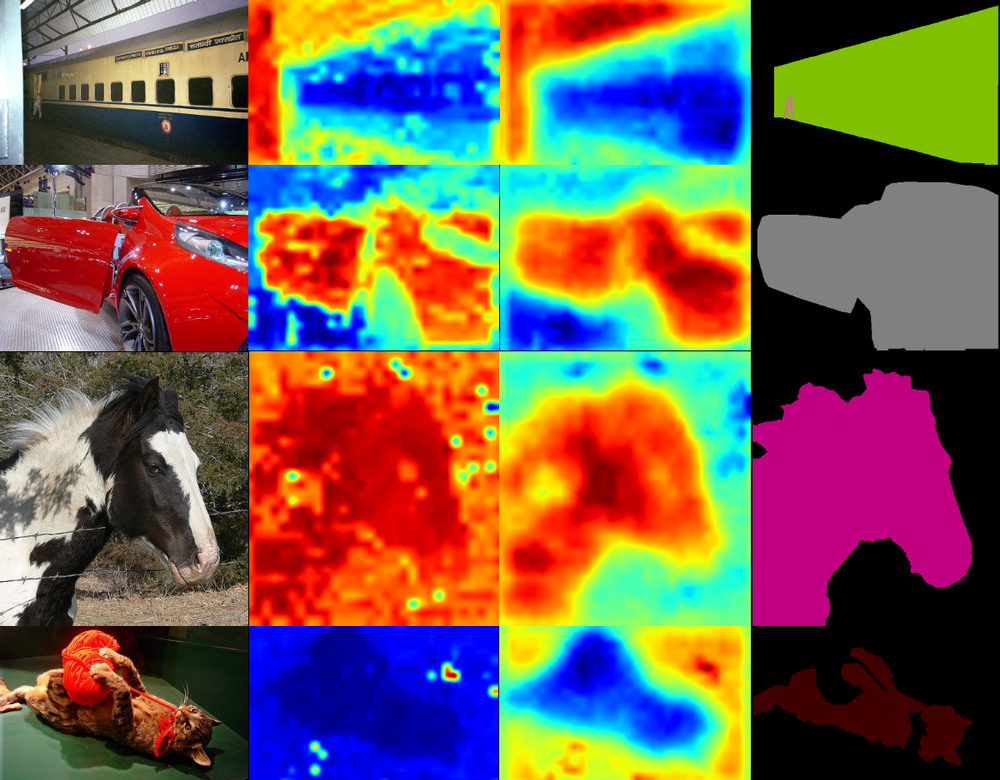
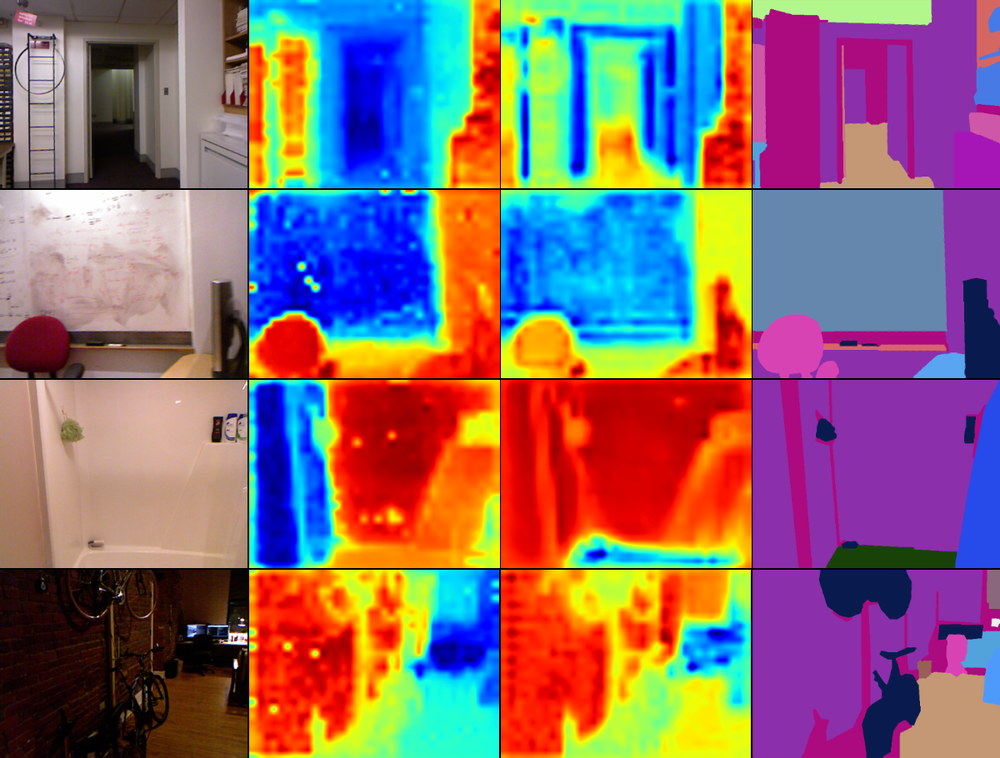
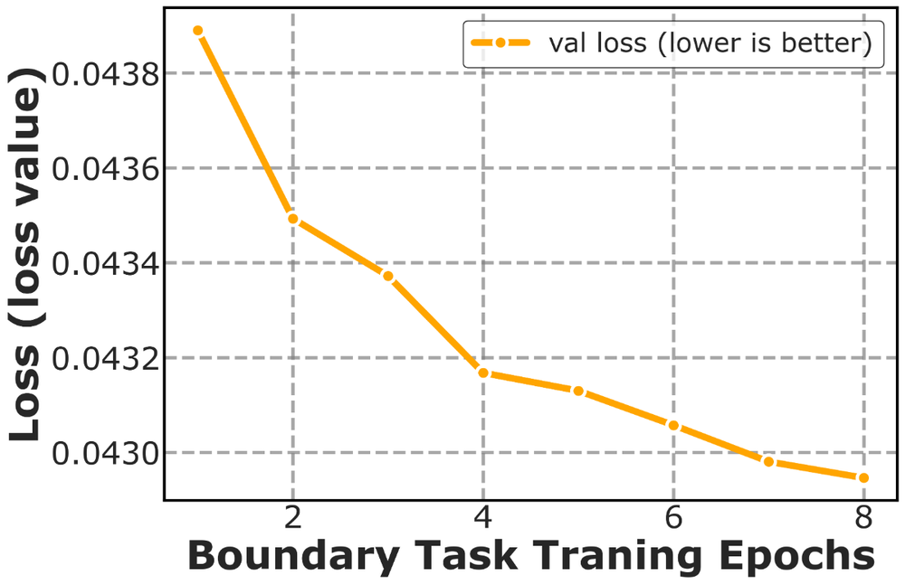
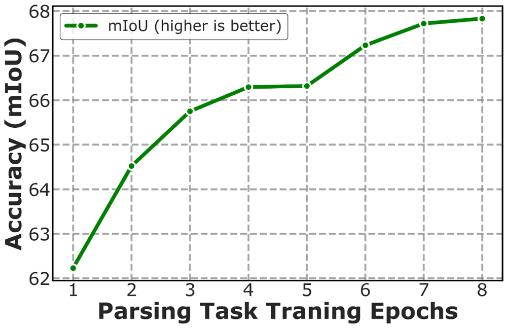
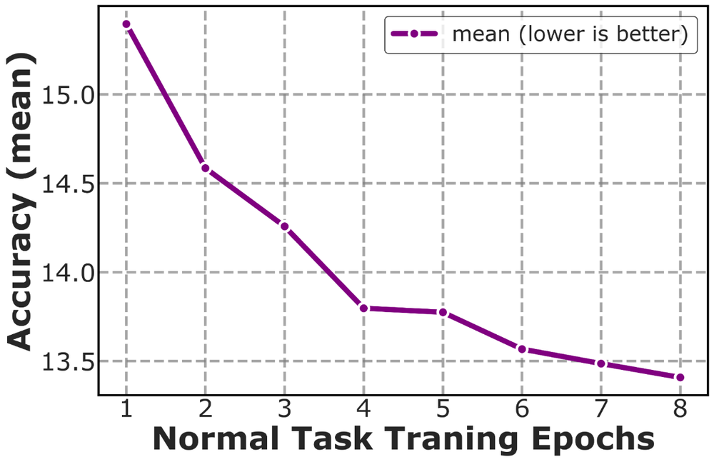
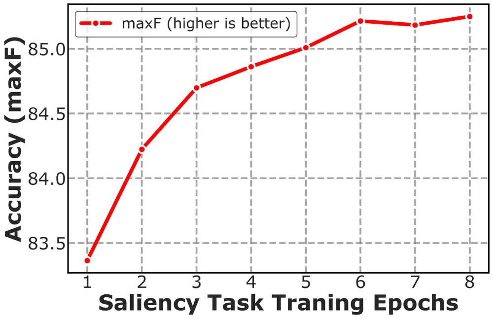
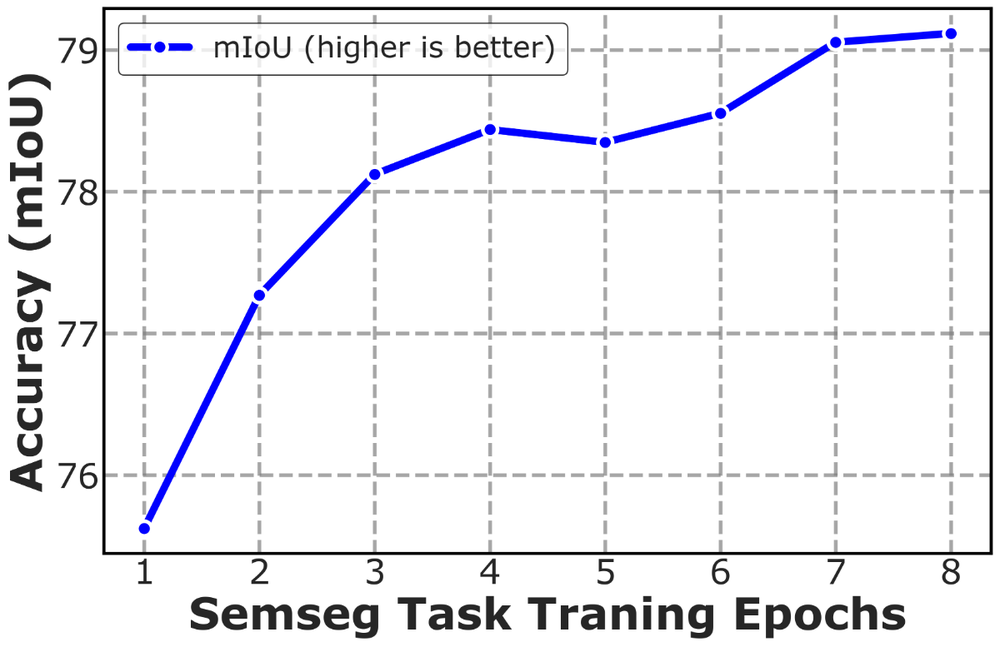
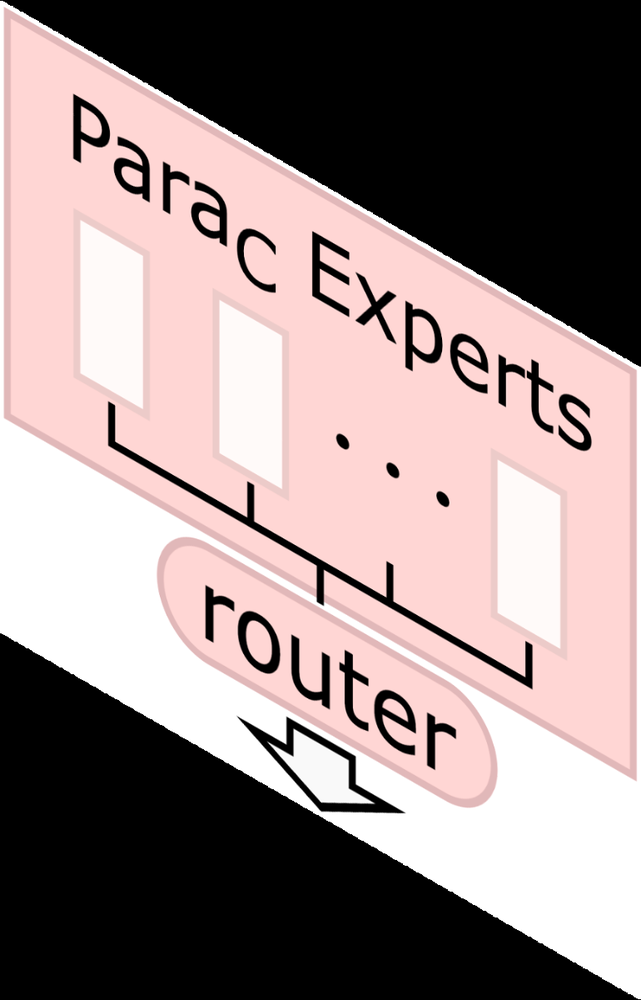

# Parameter Aware Mamba Model for Multi-task Dense Prediction

**ArXiv ID**: 2511.14503v1
**URL**: http://arxiv.org/abs/2511.14503v1
**提交日期**: 2025-11-18
**作者**: Xinzhuo Yu; Yunzhi Zhuge; Sitong Gong; Lu Zhang; Pingping Zhang; Huchuan Lu
**引用次数**: NULL
使用模型: ep-20251112215738-bz78g

## 1. 核心思想总结
这是一份根据您提供的学术论文标题、摘要和引言整理的第一轮总结，严格遵循四部分结构：

**标题:** Parameter Aware Mamba Model for Multi-task Dense Prediction

**第一轮总结**

*   **Background**
    多任务密集预测旨在通过一个模型同时解决多个相关的视觉任务（如场景解析、深度估计），其核心挑战在于理解并利用不同任务之间的关联性与交互作用。现有方法主要基于卷积神经网络和注意力机制来建模任务间的关系。

*   **Problem**
    当前基于Transformer的方法倾向于建模全局的、整体的任务关系，但可能缺乏对每个任务独特内在属性的精细刻画，以及一种高效且灵活的参数化方式来促进任务间的交互。

*   **Method (high-level)**
    本文提出一个新颖的、基于解码器的框架PAMM。其核心思想是利用状态空间模型（特别是结构化状态空间序列模型S4）强大的序列建模和可扩展参数能力。具体而言，PAMM设计了**双状态空间参数专家**，用于集成和设定**任务特定的参数先验**，从而精确捕捉每个任务的本质。此外，为了将2D图像特征有效地转化为序列，模型采用了**多方向希尔伯特扫描**方法来构建多角度的特征序列，以增强S4模型对2D数据的感知能力。

*   **Contribution**
    1.  提出了一个名为PAMM的新框架，首次将状态空间模型创新性地应用于多任务密集预测领域。
    2.  引入了参数专家机制，能够显式地建模任务特定的先验知识，从而更精细地促进任务间的交互。
    3.  在NYUD-v2和PASCAL-Context等多个标准基准数据集上进行了广泛实验，验证了所提方法的有效性。

## 2. 方法详解
好的，遵照您的要求，我将基于您提供的初步总结和论文方法章节的内容，对该论文《Parameter Aware Mamba Model for Multi-task Dense Prediction》的方法细节进行详细说明，重点描述关键创新、算法/架构细节、关键步骤与整体流程。

---

### **论文方法详细说明**

#### **1. 整体框架与流程概述**

该论文提出的PAMM模型是一个基于解码器的多任务密集预测框架。其核心思想是利用**状态空间模型（特别是Mamba或结构化状态空间序列模型S4）** 强大的序列建模能力和可扩展的参数化特性，来动态地生成和管理与每个任务相关的参数，从而实现更精细化的任务间交互。

**整体流程**可以概括为以下四个关键步骤：
1.  **特征提取**：使用一个共享的骨干网络（如ResNet或ViT）从输入图像中提取一个共享的、高层次的2D特征图。
2.  **序列构建**：采用**多方向希尔伯特扫描**策略，将2D特征图“展开”成多个1D序列，以更好地保留2D空间结构信息，供后续的状态空间模型处理。
3.  **参数生成与任务交互**：这是模型的核心创新点。将构建的序列输入到**双状态空间参数专家**模块中。该模块动态地生成一组**任务特定的参数（即“参数先验”）**，这些参数将用于初始化或调制任务解码器。
4.  **任务特定解码与预测**：每个任务拥有一个轻量级的解码器（如几个卷积层）。这些解码器的关键参数（例如卷积层的权重）由第三步生成的“参数先验”来设定。最终，每个任务解码器处理共享特征，生成各自密集的预测图（如语义分割图、深度图等）。

#### **2. 关键创新点与核心组件细节**

##### **创新点一：多方向希尔伯特扫描**

*   **问题**：标准的状态空间模型（如Mamba）是为1D序列设计的。直接将2D图像特征展平为1D序列会严重破坏其固有的空间局部性和2D结构，导致模型性能下降。
*   **解决方案**：论文采用了**多方向希尔伯特扫描**来将2D特征图转换为1D序列。
    *   **希尔伯特扫描**：这是一种空间填充曲线，它能将2D空间中的相邻点在1D序列中也保持相对邻近，比简单的行优先或列优先扫描能更好地保留空间局部性。
    *   **多方向**：为了捕获更丰富的空间上下文，论文不仅进行默认的希尔伯特扫描，还进行了**旋转和翻转**操作，从而生成多个不同扫描路径的序列（例如，0°， 90°， 180°， 270°旋转后的扫描）。这些序列从不同“视角”表征了同一幅特征图。
*   **作用**：这些多角度的序列被分别送入后续的参数专家模块，使得状态空间模型能够从多个维度感知2D空间信息，显著增强了模型对视觉数据的理解能力。

##### **创新点二：双状态空间参数专家**

这是整个方法最核心的创新，旨在显式地建模任务特定先验并促进任务交互。其结构和工作流程如下图所示（概念图）：

*   **组件构成**：
    1.  **任务特定专家**：每个任务（例如，任务A、任务B...）都对应一个独立的**状态空间模型块**。这个SSM块以**经过希尔伯特扫描的共享特征序列**作为输入。其核心功能是学习并输出一个针对该任务的**参数化表示**。这个表示捕获了该任务独有的特性和需求。
    2.  **任务交互专家**：这是一个**共享的**状态空间模型块。它接收来自**所有任务特定专家输出的拼接（Concatenation）** 作为输入。通过处理这个聚合了所有任务信息的序列，该专家能够建模任务之间的关联、依赖和冲突，并输出一个经过全局任务关系调制的、增强后的参数表示。
*   **工作流程（“双阶段参数生成”）**：
    1.  **阶段一：任务特定参数提取**：
        *   输入：共享特征序列（通过多方向扫描得到）。
        *   过程：每个任务的SSM专家独立处理该序列，生成一个初步的、专注于自身任务的参数向量/序列 \( P_{task_i}^{specific} \)。
    2.  **阶段二：全局任务交互与参数调制**：
        *   输入：将所有 \( P_{task_i}^{specific} \) 拼接成一个长序列。
        *   过程：任务交互SSM专家处理这个长序列，在全局视角下进行信息融合。它能够学习到诸如“边缘信息有助于语义分割”或“表面法线估计与深度估计高度相关”等知识，并输出调制后的参数 \( P_{task_i}^{interacted} \)。
    3.  **输出**：最终，每个任务对应的 \( P_{task_i}^{interacted} \) 经过一个轻量的投影层（如全连接层），被重塑为对应任务解码器所需的具体参数形式（例如，卷积核的权重）。这些生成的参数即为**任务特定的参数先验**。

#### **3. 关键步骤详解**

1.  **输入与特征提取**：
    *   输入：一张RGB图像 \( I \in \mathbb{R}^{3 \times H \times W} \)。
    *   过程：通过一个预训练的共享骨干网络（Backbone），得到共享特征图 \( F_{shared} \in \mathbb{R}^{C \times H' \times W'} \)。

2.  **序列化**：
    *   过程：对 \( F_{shared} \) 应用多方向（如4个方向）的希尔伯特扫描，将其转换为4个1D特征序列 \( S_{dir} \in \mathbb{R}^{L \times C} \)，其中 \( L = H' \times W' \) 是序列长度。

3.  **参数先验生成**：
    *   过程：对于每个扫描方向得到的序列 \( S_{dir} \)，都通过一次**双状态空间参数专家**模块。
    *   任务特定专家处理 \( S_{dir} \) → 得到初步参数。
    *   任务交互专家聚合所有任务的初步参数 → 生成调制后的参数。
    *   最终，对不同扫描方向产生的参数进行**融合**（例如，平均或加权求和），为每个任务生成一组鲁棒的、最终的任务特定参数先验 \( \Theta_{prior}^i \)。

4.  **任务解码与预测**：
    *   过程：每个任务配备一个结构简单且**权重极少**的解码器（如两层3x3卷积）。在推理时，该解码器的卷积核权重并非通过常规训练学习得到，而是由上一步生成的 \( \Theta_{prior}^i \) **直接初始化或设定**。
    *   这个解码器以共享特征图 \( F_{shared} \) 为输入，使用由参数先验定义的“知识”进行处理，上采样后输出最终的任务预测图 \( Y_i \)。

#### **4. 核心创新总结**

*   **架构创新**：首次将状态空间模型（Mamba/S4）引入多任务密集预测领域，替代了主流的Transformer或CNN交互模块。
*   **机制创新**：提出了“参数专家”的概念，将任务交互从**特征层面**提升到了**参数层面**。模型不再直接混合不同任务的特征，而是动态生成控制每个任务解码行为的参数，实现了更根本、更灵活的任务协同。
*   **技术融合创新**：巧妙地将**多方向希尔伯特扫描**与状态空间模型结合，有效解决了将SSM应用于2D视觉数据的关键挑战，保留了至关重要的空间信息。

这种方法使得PAMM能够同时兼顾**任务的共性**（通过共享骨干和交互专家）和**任务的个性**（通过任务特定专家和生成的参数先验），从而在多个密集预测任务上取得优异的性能。

## 3. 最终评述与分析
根据您提供的论文标题《Parameter Aware Mamba Model for Multi-task Dense Prediction》以及前三轮（初步总结、方法详述、结论节）的深入分析，现给出最终的综合评估如下：

### **最终综合评估**

#### **1. Overall Summary (整体总结)**

本论文提出了一种名为**PAMM**的创新性框架，用于解决多任务密集预测问题。其核心贡献在于**首次将状态空间模型（特别是Mamba模型）引入该领域**，以替代当前主流的基于Transformer或CNN的方法。PAMM的核心思想是通过一个新颖的**双状态空间参数专家**模块，动态地为每个任务生成特定的参数先验，从而在参数层面（而非传统的特征层面）实现更精细、更灵活的任务间交互。为了克服SSM处理2D图像数据的挑战，模型采用了**多方向希尔伯特扫描**来构建保留空间局部性的特征序列。在NYUD-v2和PASCAL-Context等多个标准基准上的实验结果表明，PAMM在保持高效性的同时，性能达到了领先水平，甚至在某些任务上超越了更大型的模型，验证了其作为多任务学习领域一个有前景的新范式的有效性。

#### **2. Strengths (优势)**

1.  **范式创新性强**：将新兴的状态空间模型（Mamba）成功应用于多任务密集预测，为领域提供了一个区别于Transformer和CNN的全新解决方案，具有重要的理论探索价值。
2.  **核心机制新颖有效**：提出的“参数专家”机制是核心亮点。它将任务交互从特征调制提升到参数生成层面，能够更本质、更显式地刻画任务特定属性和任务间依赖关系，实现了更精细的任务协同。
3.  **技术融合巧妙**：多方向希尔伯特扫描策略有效地解决了SSM处理2D空间数据的关键难题，通过多角度序列化较好地保留了2D结构信息，是一项实用的技术创新。
4.  **实验验证充分**：论文在多个公认数据集上进行了广泛的实验，不仅证明了其整体性能的优越性，还通过详尽的消融研究验证了每个核心组件（如双专家结构、希尔伯特扫描）的必要性和贡献，结论可靠。
5.  **高效性**：得益于SSM的线性计算复杂度，PAMM模型在计算和参数效率上表现出色，为实际部署提供了优势。

#### **3. Weaknesses / Limitations (局限性)**

1.  **序列化过程的固有信息损失**：尽管多方向希尔伯特扫描优于简单的展平操作，但将2D特征图转换为1D序列的过程本质上仍会带来一定程度的空间结构信息损失，这可能限制模型对极其精细的局部结构的捕捉能力。
2.  **对任务相关性的假设**：模型的有效性在一定程度上依赖于多个任务之间存在足够的相关性。对于关联性极弱或存在显著冲突的任务组合，参数专家机制的有效性可能需要进一步验证。
3.  **探索的广度**：论文主要聚焦于室内（NYUD-v2）和通用场景（PASCAL-Context）的密集预测任务。其方法在更复杂或特定领域（如自动驾驶街景、医疗影像）的泛化能力有待未来工作检验。
4.  **与最先进巨型模型的比较**：虽然论文指出PAMM在性能上可与一些大型模型相媲美且更高效，但与当前领域内规模最大、性能极致的SOTA模型进行直接、全面的性能对比可能尚不充分。

#### **4. Potential Applications / Implications (潜在应用与意义)**

1.  **实际应用前景**：PAMM的高效性和强大性能使其非常适合于**资源受限的边缘计算场景**，如移动机器人、增强现实（AR）设备、智能手机等，这些场景需要同时实时处理场景理解、深度感知等多种视觉任务。
2.  **推动SSM在视觉领域的发展**：本工作为状态空间模型在计算机视觉，特别是复杂的结构化预测任务中的应用树立了一个重要的里程碑，有望激发更多研究者探索SSM在目标检测、视频分析等更广泛视觉任务中的潜力。
3.  **为多任务学习提供新思路**：“参数化”的任务交互范式为多任务学习研究提供了新的方向。未来研究可以基于此思路，探索更复杂的参数生成网络或将其与其他学习范式（如元学习）相结合。
4.  **促进模型高效化设计**：该研究再次证明了通过精巧的架构设计，可以在不显著增加计算负担的前提下提升模型性能，这对推动绿色、可扩展的AI模型发展具有积极意义。

---
**总结**：该论文是一项高质量、创新性突出的研究工作。它不仅在具体技术上提出了有效的解决方案（PAMM框架），更重要的是为多任务学习领域引入了一个富有潜力的新范式（基于SSM的参数化交互）。尽管存在一些固有的或待验证的局限性，但其核心思想、实验成果和展现出的应用潜力，使其成为该领域一项具有重要意义的研究。

---

# 附录：论文图片

## 图 1

## 图 2

## 图 3

## 图 4

## 图 5

## 图 6

## 图 7

## 图 8

## 图 9

## 图 10

