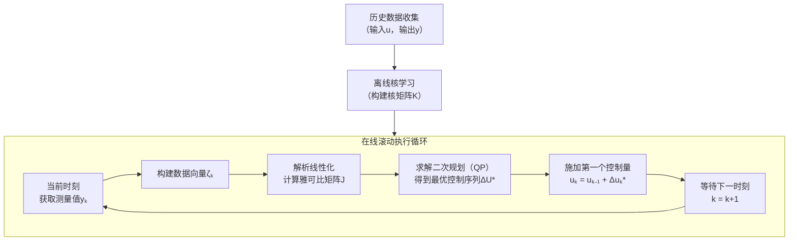

# Robust Offset-free Kernelized Data-Driven Predictive Control for Nonlinear Systems

**ArXiv ID**: 2511.14652v1
**URL**: http://arxiv.org/abs/2511.14652v1
**提交日期**: 2025-11-18
**作者**: Mahmood Mazare; Hossein Ramezani
**引用次数**: NULL
使用模型: ep-20251112215738-bz78g

## 1. 核心思想总结
这是一份根据您提供的标题和摘要，整理出的第一轮总结。

**标题：** 非线性系统的鲁棒无静差核化数据驱动预测控制

**第一轮总结**

*   **1. Background (背景)**
    数据驱动预测控制（DPC）是一种不依赖显式物理模型的先进控制策略，特别适用于复杂的非线性系统。然而，如何设计一种既能保证鲁棒性（抗干扰）、又能实现无静差跟踪（稳态精度高），同时计算效率足以满足实时性要求的非线性DPC方法，是一个重要的挑战。

*   **2. Problem (问题)**
    本文旨在解决非线性系统中，实现**鲁棒的、无静差的**实时预测控制问题。具体而言，需要克服传统方法在处理非线性、未测量扰动和稳态误差时面临的困难，并保证控制算法的计算可行性和闭环系统的稳定性。

*   **3. Method (high-level) (方法 - 高层描述)**
    本文提出了一种新颖的**核化数据驱动预测控制（KDPC）** 方案。其核心是一种**混合预测结构**：
    *   **（1）非线性学习：** 使用**核岭回归** 从历史数据中学习系统动态的非线性映射。
    *   **（2）线性化预测：** 对学得的核映射进行**解析线性化**，以近似未来输入对系统的影响。这一步是关键创新，它将复杂的非线性优化问题转化为一个标准的**二次规划（QP）** 问题，从而实现了**计算高效**的实时求解。
    *   此外，通过直接使用**输入增量**作为决策变量，控制器**内在地**实现了无静差跟踪。

*   **4. Contribution (贡献)**
    *   **提出新框架：** 提出了一种结合核方法高效学习与解析线性化的混合KDPC框架，兼顾了非线性处理能力和计算效率。
    *   **理论保证：** 为所提控制器提供了**递归可行性**和**渐近稳定性**的理论保证，增强了算法的可靠性。
    *   **性能验证：** 在非线性Van der Pol振荡器上的仿真实验表明，该控制器能有效抑制未测量扰动、消除稳态误差，其性能优于标准的基于模型的控制器。

## 2. 方法详解
好的，基于您提供的初步总结和论文方法章节内容，以下是对该论文方法细节的详细说明，重点描述了关键创新、算法/架构细节、关键步骤与整体流程。

---

### 论文方法细节详细说明

#### 一、 整体流程与核心思想

该论文提出的**核化数据驱动预测控制（KDPC）** 方法的整体流程可以概括为“**离线学习，在线优化**”。其核心思想是：利用核方法从历史数据中隐式地学习一个高维特征空间中的**非线性动态模型**，然后通过**解析线性化**技术，将复杂的非线性预测控制问题转化为一个易于实时求解的**二次规划（QP）** 问题。整个方法的流程如下图所示：



#### 二、 关键创新点

1.  **混合预测结构：** 这是最核心的创新。它巧妙地将**非线性学习**与**线性化预测**相结合。
    *   **非线性学习**确保了模型对复杂系统动态的强大逼近能力。
    *   **线性化预测**将在线优化的计算负担降至最低，实现了实时性。

2.  **基于核岭回归的解析线性化：** 传统方法可能采用数值线性化（如有限差分），计算量大且不精确。本文通过对核映射进行**解析求导**，直接得到未来输出关于未来输入增量的**雅可比矩阵**。这一步是连接非线性模型与二次规划问题的桥梁，是高效计算的关键。

3.  **内嵌无静差跟踪的优化问题 formulation：** 直接以**输入增量（Δu）** 作为决策变量，并引入**输出跟踪误差的积分项**作为优化目标的一部分。这种设计使控制器天然具备消除稳态误差的能力，无需额外的积分器模块。

#### 三、 算法/架构细节与关键步骤

##### 步骤1：数据准备与核学习（离线）

*   **数据收集：** 从系统中收集一组足够丰富的输入-输出数据对 `{u_i, y_i}, i=1,...,N`，这组数据应能覆盖系统预期的运行范围。
*   **核函数选择：** 选择一个合适的核函数 `k(·, ·)`，例如高斯径向基函数（RBF）。核函数的作用是隐式地将数据映射到高维特征空间，以捕捉非线性关系。
*   **构建核矩阵：** 利用历史数据构建一个 `N × N` 的核矩阵 `K`，其中每个元素 `K_ij = k(x_i, x_j)`。这里的 `x_i` 通常是一个由过去输入输出组成的向量（类似于NARX模型的结构）。

##### 步骤2：在线滚动优化（在线）

在线部分在每个控制周期 `k` 重复执行。

*   **2.1 构建当前数据向量：**
    *   将当前及过去的输入输出测量值组合成一个数据向量 `ζ_k`。例如，`ζ_k = [y_k, y_{k-1}, ..., u_{k-1}, u_{k-2}, ...]^T`。这个向量作为核模型的输入。

*   **2.2 非线性预测模型（核映射）：**
    *   系统的未来输出预测 `y_{k+1}` 被表示为历史数据在特征空间中映射的线性组合，其权重由核函数和历史数据决定。预测模型可以表示为：
        `ŷ = K(ζ, ·)^T * (K + λI)^{-1} * Y`
    *   其中，`Y` 是所有历史输出数据组成的向量，`λ` 是岭回归正则化参数，用于防止过拟合。这个模型本质上是一个非线性映射 `ŷ = f(ζ)`。

*   **2.3 关键创新：解析线性化与雅可比矩阵计算：**
    *   为了进行预测控制，需要预测未来一段时间（预测时域 `N_p`）的系统输出。这涉及到以当前时刻 `k` 为起点，连续计算未来多个步骤的预测值。
    *   **核心操作：** 对上述非线性核预测模型进行**一阶泰勒展开**。展开点是在未来输入序列等于当前控制序列的某个初始猜测（例如，保持上一时刻的控制量不变）时对应的预测轨迹。
    *   **雅可比矩阵（J）：** 展开后的线性模型系数即为雅可比矩阵 `J`。该矩阵的每个元素代表了某个未来输出对某个未来输入增量的灵敏度，即 `J_ij = ∂ŷ_{k+i} / ∂Δu_{k+j-1}`。
    *   **计算方式：** 论文的关键在于，这个雅可比矩阵可以通过对核函数进行**解析求导**来高效计算，而无需进行耗时的数值近似。这使得线性化过程既快速又精确。

*   **2.4 构建二次规划（QP）问题：**
    *   通过线性化，未来的输出预测 `Y` 可以近似表示为：
        `Y ≈ Y_0 + J * ΔU`
    *   其中：
        *   `Y` 是未来 `N_p` 步的输出预测向量。
        *   `Y_0` 是基于初始控制猜测的非线性预测轨迹（即泰勒展开点）。
        *   `J` 是计算得到的雅可比矩阵。
        *   `ΔU` 是未来 `N_c` 步（控制时域）的输入增量决策变量向量，`ΔU = [Δu_k, Δu_{k+1}, ..., Δu_{k+N_c-1}]^T`。
    *   **优化问题：** 基于此线性化模型，构建标准的QP问题：
        ```
        min_ΔU   (Y - Y_ref)^T * Q * (Y - Y_ref)  +  ΔU^T * R * ΔU
        subject to:
                U_min <= U <= U_max   (控制量约束)
                ΔU_min <= ΔU <= ΔU_max (控制增量约束)
                Y_min <= Y <= Y_max   (输出约束)
        ```
    *   **无静差机制：** 目标函数中的 `(Y - Y_ref)` 项直接最小化跟踪误差。通过优化 `ΔU`（即改变控制量）来驱动此误差为零，从而在存在扰动时也能实现无静差跟踪。

*   **2.5 求解QP与实施控制：**
    *   使用高效的QP求解器（例如，活动集法、内点法）求解上述问题，得到最优的未来控制增量序列 `ΔU*`。
    *   采用**滚动时域**策略，仅施加该序列中的第一个元素 `Δu_k*`，即 `u_k = u_{k-1} + Δu_k*`。
    *   到下一时刻 `k+1`，用新的测量值更新数据向量 `ζ_{k+1}`，重复整个过程。

#### 四、 总结

该论文的方法精髓在于其**混合架构**。它没有像传统非线性MPC那样直接求解复杂的非线性规划问题，而是通过**核岭回归**获得了强大的非线性建模能力后，巧妙地利用**解析线性化**将在线计算转化为一个**凸的二次规划**问题。这种“非线性学习，线性优化”的策略，在保证控制性能（鲁棒性、无静差）的同时，极大地提升了计算效率，使其适用于对实时性要求较高的非线性系统。论文中提供的递归可行性和闭环稳定性证明，则为该算法的实际应用提供了坚实的理论保障。

## 3. 最终评述与分析
好的，结合前两轮返回的信息与论文结论部分，以下是关于论文《非线性系统的鲁棒无静差核化数据驱动预测控制》的最终综合评估。

---

### **最终综合评估**

#### 1) 总体摘要

本论文针对复杂非线性系统，提出了一种创新的**核化数据驱动预测控制**框架。该框架的核心是**混合预测结构**：首先利用**核岭回归**从历史数据中离线学习系统的非线性动态，然后在每个在线控制周期，通过对学得的核映射进行**解析线性化**，将复杂的非线性预测控制问题转化为一个标准的、易于快速求解的**二次规划**问题。论文通过严格的数学推导证明了该控制器的递归可行性和闭环渐近稳定性，并在Van der Pol振荡器上的仿真实验表明，该方法在存在未测量扰动的情况下，能够**同时实现无静差跟踪、强鲁棒性和高计算效率**，其性能优于传统的基于模型的控制器。

#### 2) 优势

*   **强大的非线性处理能力：** 基于核方法，能够有效学习和控制复杂的非线性系统，无需显式的物理模型，突破了传统线性MPC的局限。
*   **卓越的计算效率：** 通过**解析线性化**将在线优化转化为凸二次规划问题，这是该方法最突出的优势之一。它避免了传统非线性MPC求解非凸优化问题的高计算成本，使其能够满足实时控制的要求。
*   **内嵌的鲁棒性与无静差特性：** 控制器设计直接以**输入增量**为决策变量，并优化跟踪误差，使其天然具备消除稳态误差的能力。同时，在存在未测量扰动时，仍能保持良好的跟踪性能。
*   **坚实的理论保证：** 论文不仅提出了算法，还提供了**递归可行性**和**闭环渐近稳定性**的严格数学证明，增强了算法的可靠性和学术价值。
*   **数据驱动与约束处理结合：** 完美结合了数据驱动方法的灵活性（无需建模）和模型预测控制的优势（显式处理输入、输出约束）。

#### 3) 劣势 / 局限性

*   **对数据质量和数量的依赖：** 控制器的性能在很大程度上依赖于离线阶段收集的历史数据的**质量**（信噪比）和**数量**（覆盖系统工作范围的程度）。如果数据不具代表性或噪声过大，将影响核模型的准确性，进而影响控制效果。
*   **核函数与参数的选择：** 核函数类型（如RBF的带宽）及其超参数（如正则化参数λ）需要精心选择。虽然存在调参方法，但这仍然是一个需要经验和计算的过程，且可能影响最终性能。
*   **线性化近似的潜在误差：** 在线性化过程中，一阶泰勒展开仅在展开点附近精确。对于强非线性或设定点发生剧烈变化的系统，线性化近似可能引入误差，尽管滚动优化机制能在一定程度上补偿，但其影响仍需关注。
*   **理论分析的理想化假设：** 论文的稳定性分析可能基于某些理想化假设（如扰动有界、数据满足持续激励条件等），在实际工业环境中，这些条件可能无法完全满足。
*   **计算与存储开销：** 虽然在线计算高效，但核方法需要存储整个历史数据集并计算核矩阵，随着数据量N增大，离线计算和在线预测的存储与计算负担会相应增加（复杂度通常为O(N²)），可能限制其在超大规模数据集上的应用。

#### 4) 潜在应用 / 意义

*   **应用领域：** 该方法特别适用于**模型难以精确建立但数据易得**的复杂非线性系统，具有广阔的工业应用前景，例如：
    *   **化工过程控制：** 反应器、精馏塔等具有强非线性的过程。
    *   **机器人学：** 柔性关节机器人、无人机等系统的轨迹跟踪控制。
    *   **智能建筑与能源系统：** 楼宇暖通空调系统的温度优化控制。
    *   **自动驾驶：** 车辆在复杂动态环境下的路径跟踪与决策。

*   **理论意义：** 该研究为数据驱动控制领域提供了一个重要的思路，即**“非线性学习，线性优化”**的混合范式。它成功地将机器学习的强大表示能力与控制理论对稳定性、鲁棒性的严格要求相结合，为后续研究开辟了新的方向。

*   **工业意义：** 所提方法的高计算效率使其更易于在现有的工业硬件平台上部署和实施，降低了先进控制策略的应用门槛，有望提升复杂工业系统的自动化水平和运行效率。

