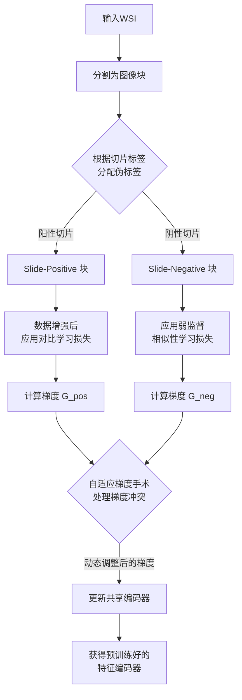
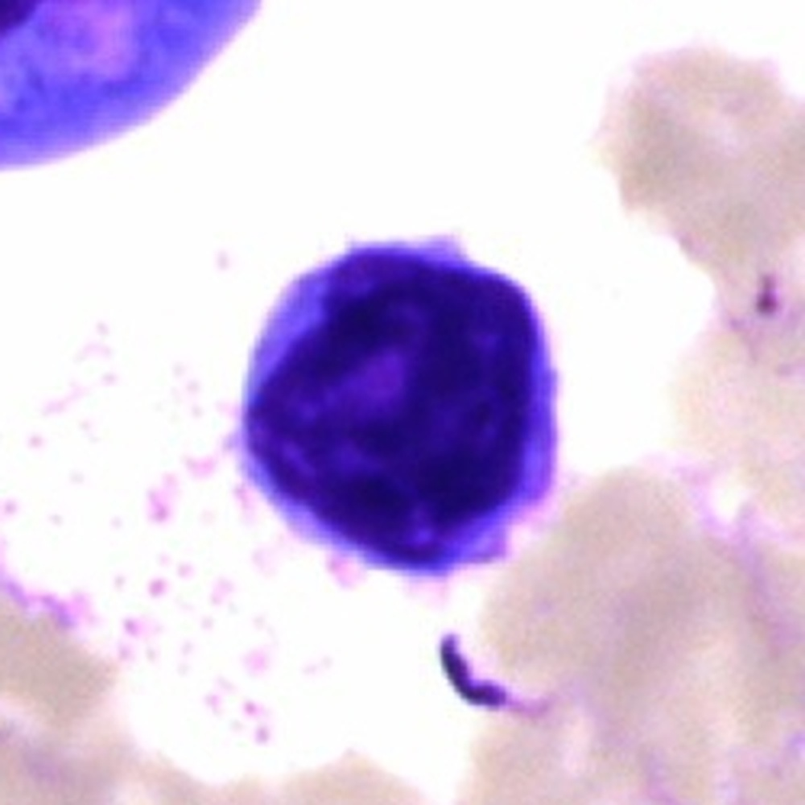
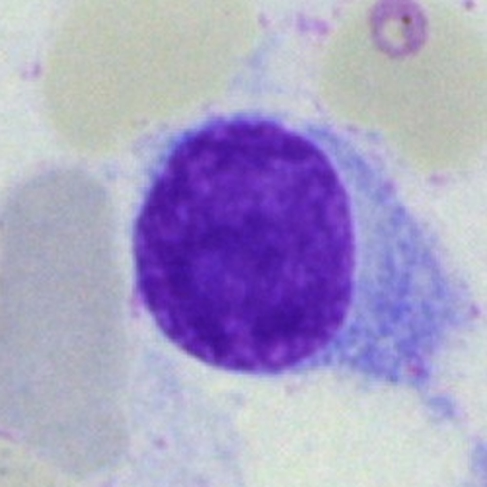
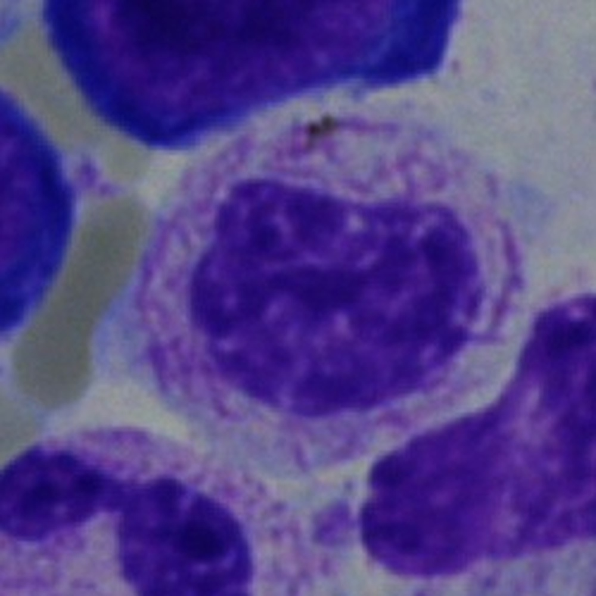
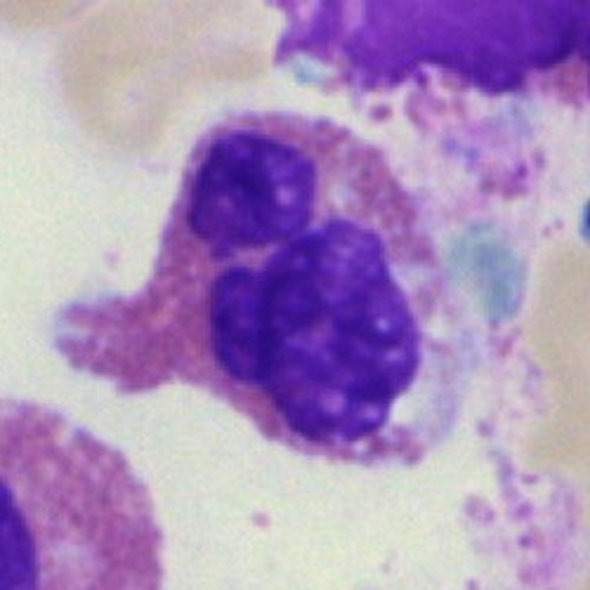

# SLAM-AGS: Slide-Label Aware Multi-Task Pretraining Using Adaptive Gradient Surgery in Computational Cytology

**ArXiv ID**: 2511.14639v1
**URL**: http://arxiv.org/abs/2511.14639v1
**提交日期**: 2025-11-18
**作者**: Marco Acerbis; Swarnadip Chatterjee; Christophe Avenel; Joakim Lindblad
**引用次数**: NULL
使用模型: ep-20251112215738-bz78g

## 1. 核心思想总结
好的，这是一份根据您提供的论文标题、摘要和引言信息整理的第一轮总结，严格按照四个部分组织。

---

### **论文第一轮总结**

**标题:** SLAM-AGS: 用于计算细胞学的、基于自适应梯度手术的切片标签感知多任务预训练

**1. Background (背景)**
计算细胞学领域，特别是在基于Whole Slide Image (WSI) 的异常细胞检测中，面临两个核心数据挑战：首先，获取可靠的实例级（如单个细胞）标注成本极高且困难；其次，“witness rate”（即阳性样本的占比）极低，这给模型学习带来了巨大困难。传统的预训练方法在此类数据稀缺且不平衡的场景下表现不佳。

**2. Problem (问题)**
在上述背景下，论文旨在解决的具体问题是：如何设计一种有效的预训练策略，使其能够利用容易获取的切片级标签（slide-label）来学习有意义的表征，并能够稳定地应对极低的witness rate。同时，在多任务学习框架下，不同任务产生的梯度可能会相互冲突，导致训练不稳定或模型崩溃，这也是一个需要解决的关键技术问题。

**3. Method (high-level) (方法 - 高层次概述)**
本文提出SLAM-AGS框架。其核心是一种**多任务预训练**方法，它根据切片标签将图像块分为“slide-positive”和“slide-negative”两组，并分别施加不同的学习目标：
*   对slide-positive块应用**自监督对比学习**，以学习其内在特征。
*   对slide-negative块应用**弱监督相似性学习**，以利用切片级别的负信号。
为了稳定多任务训练，该方法引入了**自适应梯度手术（Adaptive Gradient Surgery, AGS）**，动态调整冲突的任务梯度，防止模型崩溃。预训练后的编码器被集成到一个基于注意力的多示例学习框架中，用于最终的切片级预测和关键实例检索。

**4. Contribution (贡献)**
本文的主要贡献包括：
1.  **提出SLAM-AGS框架**：一种新颖的、切片标签感知的多任务预训练方法，专门针对计算细胞学中标签稀缺和witness rate极低的挑战。
2.  **引入AGS解决梯度冲突**：通过自适应梯度手术有效管理多任务学习中的梯度干扰，确保了训练的稳定性。
3.  **实证验证有效性**：在公开的骨髓细胞学数据集上，尤其是在极低witness rate（低至0.5%）的设置下，该方法在下游任务的切片级分类和阳性细胞检索性能上均优于其他预训练方法。
4.  **开源代码**：提供了完整的实现和评估框架，以促进结果的可复现性。

## 2. 方法详解
好的，根据您提供的初步总结和论文方法章节的内容，以下是对该论文方法细节的详细说明。

### **论文方法细节详解：SLAM-AGS**

SLAM-AGS 方法的核心思想是利用易于获取的**切片级标签**来指导**图像块级别**的预训练，从而学习到对下游任务（如异常细胞检测）更具判别性的表征。整个流程可分为三个主要阶段：**1) 数据预处理与任务构建**，**2) 切片标签感知的多任务预训练**，以及 **3) 下游任务微调与推理**。

---

#### **一、 关键创新与核心思想**

1.  **切片标签驱动的任务构建**： 这是最根本的创新。传统方法要么完全忽略切片标签（纯自监督），要么需要强实例级标签。SLAM-AGS 巧妙地将切片标签转化为对图像块的弱监督信号，创建了两个性质不同的学习任务。
2.  **自适应梯度手术（AGS）的应用**： 将原本用于自然语言处理多任务学习的AGS技术，创新性地引入到计算细胞学的视觉预训练中，以解决由数据特性（极低witness rate）导致的内在梯度冲突问题，确保了训练的稳定性。
3.  **面向极低阳性率的预训练策略**： 整个方法设计（特别是对slide-negative块的处理）都明确针对witness rate极低的场景，旨在防止模型被海量阴性样本主导，从而更好地捕捉稀有阳性模式。

---

#### **二、 整体流程与关键步骤**

##### **阶段一：数据预处理与任务构建**

1.  **Whole Slide Image (WSI) 分割**： 首先，将每个WSI分割成大量不重叠的、较小的图像块。
2.  **图像块标签派生**： 根据其所属WSI的切片级标签，为每个图像块分配一个派生标签：
    *   **Slide-Positive 块**： 来自阳性切片（如含有癌细胞的切片）的所有图像块。**关键点**：这些块中**可能包含**阳性细胞，但并非全部都是阳性。它们构成了一个“高价值候选集”。
    *   **Slide-Negative 块**： 来自阴性切片的所有图像块。这些块被确认为**不包含**目标阳性细胞。

##### **阶段二：切片标签感知的多任务预训练（核心环节）**

该阶段使用一个共享的编码器（如ResNet）来提取图像块特征，同时优化两个损失函数。其整体架构和流程如下图所示：

1.  **任务一：对Slide-Positive块的对比学习**
    *   **目标**： 学习Slide-Positive块中有区分度的特征表示。由于这些块是阳性细胞的“候选集”，目标是让模型能够区分它们之间细微的形态学差异，从而为后续识别真正的阳性细胞打下基础。
    *   **算法细节**： 采用类似于SimCLR或MoCo的框架。
        *   **步骤**： 对一个Slide-Positive块进行两次随机数据增强，得到两个视图。
        *   **正样本对**： 来自**同一个**图像块的两个增强视图。
        *   **负样本对**： 来自**同一个batch内所有其他**图像块（包括其另一个视图）的增强视图。
        *   **损失函数**： 使用标准的对比损失（InfoNCE Loss），目标是拉近正样本对的距离，推远负样本对的距离。

2.  **任务二：对Slide-Negative块的弱监督相似性学习**
    *   **目标**： 利用明确的阴性信号，让模型学习到“正常”细胞的特征，并使得所有Slide-Negative块的特征在特征空间中聚集在一起。
    *   **算法细节**：
        *   **核心思想**： 由于所有Slide-Negative块都来自阴性切片，它们应该共享“正常”的表征。因此，目标是最大化一个batch内所有Slide-Negative块之间的相似度。
        *   **损失函数**： 通常采用一种聚类损失或相似性损失。例如，**余弦相似度损失**：鼓励batch内所有Slide-Negative块的特征向量之间的两两余弦相似度接近1（即角度为0）。这可以表示为：`L_neg = 1 - average(cosine_similarity(z_i, z_j))`，其中 `z_i` 和 `z_j` 是任意两个Slide-Negative块的特征。

3.  **多任务损失与自适应梯度手术（AGS）**
    *   **总损失**： `L_total = λ1 * L_contrastive + λ2 * L_negative`，其中λ1和λ2是超参数。
    *   **梯度冲突问题**： 在极低witness rate的情况下，一个batch中可能99.5%的块都是Slide-Negative。因此，`L_negative` 的梯度会远强于 `L_contrastive` 的梯度，可能会“淹没”并破坏从少量Slide-Positive块中学到的有用特征，导致训练不稳定或模型崩溃。
    *   **AGS工作流程**：
        1.  **梯度计算**： 在每次反向传播时，计算两个任务损失相对于共享编码器参数θ的梯度：`G_pos = ∇θ(L_contrastive)` 和 `G_neg = ∇θ(L_negative)`。
        2.  **冲突检测**： AGS计算这两个梯度向量之间的余弦相似度。如果余弦值为负，说明梯度方向冲突（一个任务要求参数往A方向更新，另一个要求往B方向更新）。
        3.  **梯度投影（手术）**： 当检测到冲突时，AGS不会简单地对梯度进行加权平均。而是将 `G_neg` 投影到 `G_pos` 的垂直平面上，得到一个修正后的梯度 `G_neg_modified`。这个新梯度与 `G_pos` 不再冲突，但同时保留了 `G_neg` 中与 `G_pos` 不冲突的那部分信息。
        4.  **参数更新**： 最终用于更新模型参数的梯度是 `G_pos` 和 `G_neg_modified` 的加权和：`G_total = λ1 * G_pos + λ2 * G_neg_modified`。

##### **阶段三：下游任务微调与推理**

预训练完成后，得到的编码器被用于下游任务，如WSI级别的分类和阳性细胞检索。

1.  **特征提取**： 使用预训练编码器为WSI中的每个图像块提取特征。
2.  **集成到MIL框架**： 将这些特征输入一个基于注意力的多示例学习模型（如ABMIL）。
    *   ABMIL会为每个图像块计算一个注意力权重，该权重表示该块对于最终切片级诊断的重要性。
3.  **微调与推理**：
    *   **切片级分类**： 使用切片级标签对整个ABMIL模型（包括编码器）进行端到端的微调。模型的输出是切片的阳性/阴性概率。
    *   **阳性细胞检索**： 在推理时，注意力权重最高的那些图像块被视为最有可能包含阳性细胞的“关键实例”，从而实现无需实例级标注的阳性细胞定位。

---

#### **三、 总结**

SLAM-AGS方法通过**切片标签感知的任务设计**和**自适应梯度手术**这两个关键技术，成功地解决了计算细胞学中数据标注稀缺和极度不平衡的核心挑战。其流程清晰地将弱监督信号注入预训练过程，并通过动态梯度管理保证了学习过程的鲁棒性，最终学到的特征编码器能显著提升下游任务的性能。

## 3. 最终评述与分析
好的，结合前两轮关于论文背景、方法细节以及结论部分的信息，以下是最终的综合评估。

### **最终综合评估：SLAM-AGS论文**

#### **1) 总体摘要**

本论文针对计算细胞学中全幻灯片图像分析的两大核心挑战——**实例级标注稀缺**和**极低的阳性样本率**，提出了一个名为SLAM-AGS的创新预训练框架。该框架的核心创新在于，它巧妙地利用易于获取的**切片级标签**来驱动图像块级别的表征学习，通过构建两个互补的学习任务（对阳性切片内块的对比学习和对阴性切片内块的相似性学习），并引入**自适应梯度手术**来动态化解多任务训练中的梯度冲突，从而在极度不平衡的数据上实现稳定、高效的预训练。实验结果表明，该方法在骨髓细胞数据集上的切片级分类和阳性细胞检索任务中，尤其在极低阳性率（低至0.5%）的场景下，显著超越了现有的多种预训练基线模型。

#### **2) 优势**

1.  **问题导向性强，创新点明确**： 论文精准地抓住了计算细胞学（乃至整个医学图像分析）领域的实际痛点，即标注成本和高类别不平衡性。所提出的SLAM-AGS框架直接针对这些痛点进行设计，创新性体现在将切片标签转化为块级弱监督信号，思路巧妙且实用。
2.  **技术方案鲁棒且严谨**： 方法设计考虑了实际训练中的稳定性问题。引入自适应梯度手术来解决极低阳性率下必然出现的梯度冲突，这表明研究不仅关注“做什么”，更深入考虑了“如何做得稳定”，提升了方案的可靠性和复现价值。
3.  **实验验证充分，说服力强**： 论文在公开数据集上进行了系统性的评估，不仅设置了常规的阳性率场景，还重点挑战了极低阳性率（0.5%, 1%）的极端情况，充分证明了其方法在目标场景下的优越性和必要性。同时，通过消融实验验证了AGS等关键组件的有效性。
4.  **具有重要的实践价值**： 该方法降低了对昂贵实例级标注的依赖，提供了一条利用弱监督信号提升模型性能的有效路径，对于推动WSI分析在临床中的实际应用具有积极意义。开源代码进一步增加了其价值。

#### **3) 局限性与不足之处**

1.  **领域泛化性有待进一步验证**： 论文的所有实验均基于单一的骨髓细胞学数据集。虽然方法设计具有通用性，但其在其它组织类型（如乳腺、前列腺）的WSI数据上的有效性仍需更多实验来证明。不同组织的细胞形态、阳性模式可能存在差异。
2.  **对超参数的敏感性**： 多任务学习中的损失权重（λ1, λ2）以及AGS相关的参数可能需要针对不同的数据集或阳性率进行调整。论文并未深入讨论这些超参数的敏感性和调优策略，这可能在实践中带来一定的挑战。
3.  **“伪阳性”块的噪声处理**： 方法将阳性切片中的所有块都视为“Slide-Positive”，但其中实际上包含了大量正常细胞。尽管对比学习本身具有一定抗噪能力，但这种固有的标签噪声对学习过程的具体影响未被量化分析。
4.  **计算复杂度**： 结合了对比学习和AGS的预训练过程，相较于简单的ImageNet预训练或MoCo等标准自监督方法，可能会增加计算开销和时间成本。

#### **4) 潜在应用与启示**

1.  **在计算细胞学中的直接应用**： 该方法可立即应用于各种骨髓或外周血涂片的自动化筛查系统，帮助病理医生快速定位稀有异常细胞（如癌细胞、寄生虫感染细胞），提高诊断效率和一致性，尤其在大规模筛查场景下优势明显。
2.  **推广至更广泛的医学图像分析**： 其核心思想适用于任何存在**弱监督标签**和**实例级类别不平衡**问题的领域。例如：
    *   **组织病理学**： 针对肿瘤浸润淋巴细胞的检测、稀有微转移灶的定位等。
    *   **放射学**： 在CT或MRI中检测微小结节或早期病灶。
3.  **对机器学习社区的启示**：
    *   **极不平衡数据的学习**： 为处理极端类别不平衡问题提供了一个新颖的、基于多任务学习和梯度优化的解决方案。
    *   **弱监督学习**： 展示了如何创造性地利用高层级弱标签来指导低层级特征学习，为其他领域的弱监督研究提供了借鉴。
    *   **技术迁移**： 成功地将自然语言处理中的AGS技术迁移到计算机视觉任务中，体现了跨领域技术融合的潜力。

**总结**：SLAM-AGS是一篇高质量、问题驱动的研究工作，它针对一个具有重要实际意义且充满挑战的问题，提出了一个创新、严谨且有效的解决方案。尽管其在泛化性和参数调优方面存在一定的局限性，但其核心思想、显著的性能提升以及广泛的潜在应用前景，使其对计算细胞学和弱监督学习领域都具有重要的贡献。

---

# 附录：论文图片

## 图 1

## 图 2

## 图 3

## 图 4

