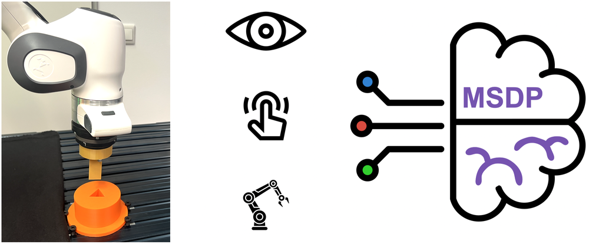
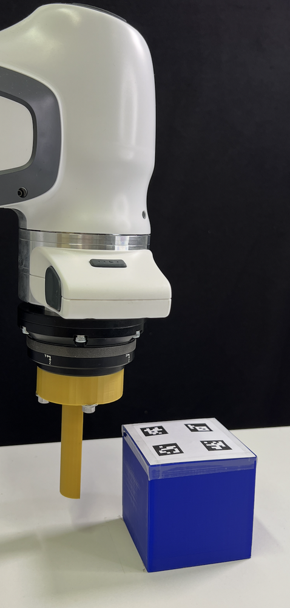
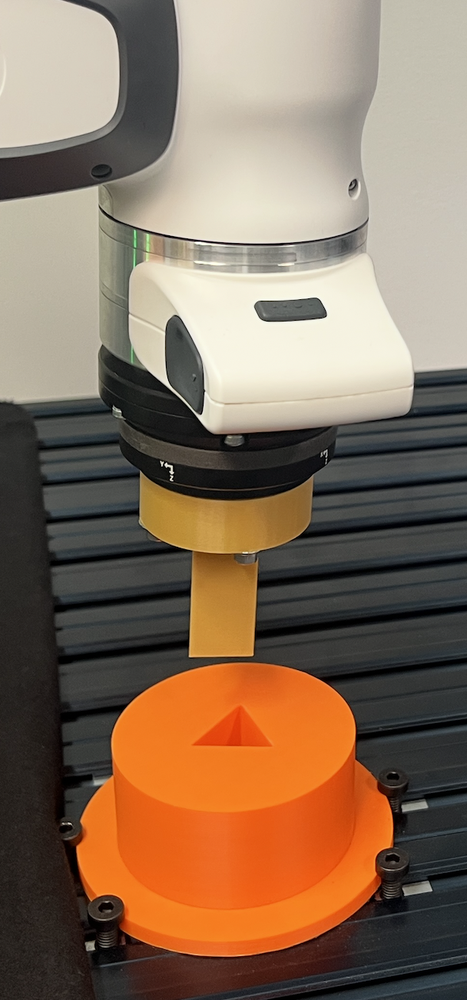
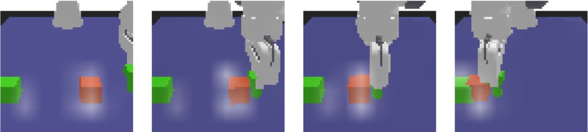
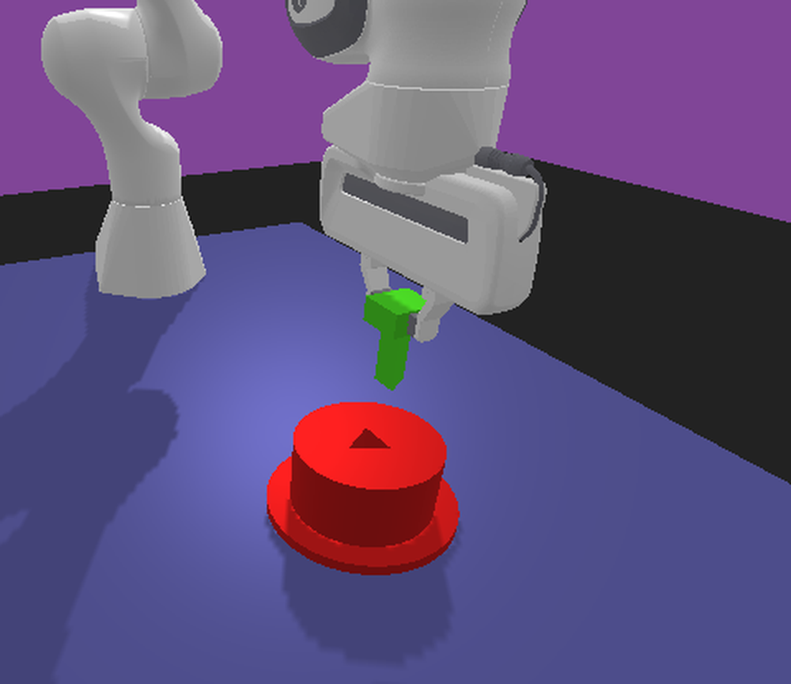
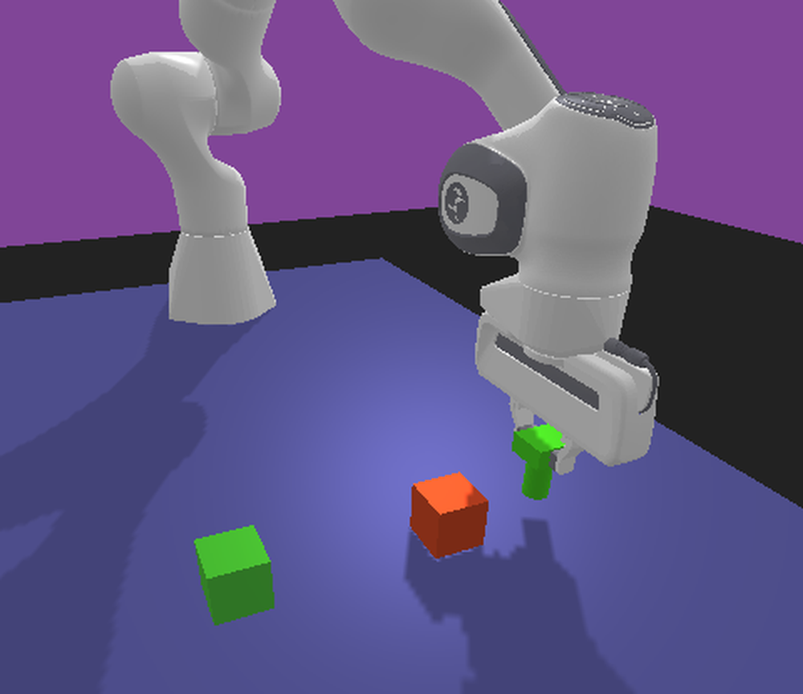
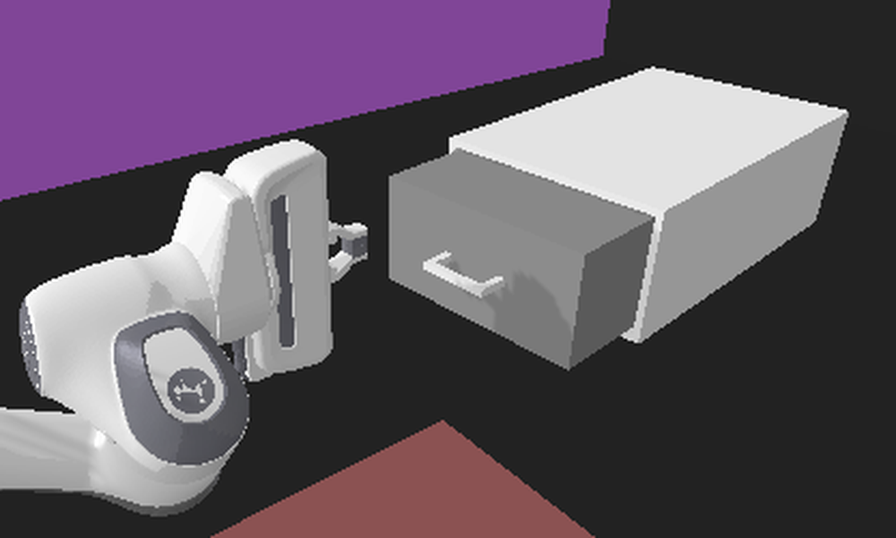

# Self-Supervised Multisensory Pretraining for Contact-Rich Robot Reinforcement Learning

**ArXiv ID**: 2511.14427v1
**URL**: http://arxiv.org/abs/2511.14427v1
**提交日期**: 2025-11-18
**作者**: Rickmer Krohn; Vignesh Prasad; Gabriele Tiboni; Georgia Chalvatzaki
**引用次数**: NULL
使用模型: ep-20251112215738-bz78g

## 1. 核心思想总结
这是一份根据您提供的标题和摘要整理的简洁第一轮总结，按四个部分组织：

**Background (背景)**
在接触丰富的机器人操作任务中，有效利用视觉、力觉和本体感觉等多模态传感信息至关重要。然而，这些传感器数据常伴有噪声和环境动态变化，为学习带来了挑战。

**Problem (问题)**
传统的强化学习智能体难以在这种多感官设置下有效学习。它们需要能够处理感官噪声、动态变化，并从高维、异构的传感器数据中学习鲁棒且表达力强的表征。

**Method (方法 - 高层描述)**
本文提出多感官动态预训练框架。该方法基于掩码自编码技术，通过仅使用部分传感器嵌入来重建完整的多感官观测，从而学习具有跨模态预测和传感器融合能力的表征。在下游策略学习中，采用一种新颖的非对称架构：评论家通过交叉注意力机制从冻结的表征中提取动态任务特征，而执行器则接收稳定的池化表征来指导动作。

**Contribution (贡献)**
1.  提出了MSDP框架，为任务导向的策略学习生成表达力强的多感官表征。
2.  引入了非对称的actor-critic架构，有效利用预训练表征进行策略学习。
3.  在模拟和真实世界的多种接触式操作任务中，该方法展示了加速学习、对干扰的强鲁棒性，以及在真实机器人上仅用少量交互即可实现高成功率。

## 2. 方法详解
好的，遵照您的要求，我将基于您提供的初步总结和论文方法章节内容，详细阐述该论文的方法细节。

### 论文方法细节详解

本文提出的方法名为**多感官动态预预测（MSDP）**，其核心思想分为两个主要阶段：1）**多感官动态预训练**，旨在学习一个对噪声和动态变化鲁棒的多模态表征模型；2）**非对称 Actor-Critic 策略学习**，旨在高效利用预训练表征解决下游机器人操作任务。

#### 一、 多感官动态预训练

此阶段的目标是训练一个编码器，使其能够从高维、异构的多模态传感器数据（如视觉、力觉、本体感觉）中提取出强大且任务相关的表征，而无需任何任务奖励信号。

**1. 关键创新：掩码多感官自编码器**
*   **核心思想**：借鉴自然语言处理中的掩码语言模型（如 BERT）和计算机视觉中的掩码自编码器（MAE），该方法的核心是**随机掩码掉一部分传感器的输入数据，然后让模型基于剩余的、未被掩码的传感器数据来重建完整的、原始的传感器观测**。
*   **与标准自编码器的区别**：标准自编码器将全部输入压缩再重建，容易学到“捷径”（如简单复制）。而掩码重建迫使模型必须**深入理解不同模态数据之间的内在关联和动态特性**，才能完成预测，从而学习到更具泛化性和表达力的跨模态表征。

**2. 算法/架构细节**
*   **输入处理**：多模态观测 \( o_t \) 被划分为多个传感器特定的嵌入（token）。例如，图像被分割成图像块，力觉数据被处理为向量，本体感觉数据也被转换为嵌入向量。
*   **随机掩码**：在每一个训练样本中，以较高的掩码率（例如 70%-90%）随机选择一部分传感器嵌入，并将其替换为一个可学习的【MASK】标记。
*   **编码器-解码器架构**：
    *   **编码器**：是一个**仅处理未被掩码的嵌入**的模型（如 Vision Transformer）。它从可见的嵌入中提取特征，输出对应的潜在表征。这一步大大降低了计算量。
    *   **解码器**：是一个轻量级的网络，其输入是**编码器输出的潜在表征和【MASK】标记**。解码器的任务是重建所有被掩码掉的原始传感器数据。
*   **重建目标**：损失函数是重建数据与原始数据之间的均方误差（MSE）或类似的回归损失，但**仅计算在被掩码的部分上**。这确保了模型的学习重点在于“预测”而非“复制”。

**3. 关键步骤与流程**
    1.  **数据收集**：在没有任何特定任务目标的情况下，通过随机策略或人类演示收集大量的机器人交互数据 \( \mathcal{D} = \{o_t\} \)。
    2.  **掩码与嵌入**：对每个观测 \( o_t \) 进行嵌入化和高比例随机掩码。
    3.  **表征学习**：将未被掩码的嵌入输入编码器，获得潜在表征。
    4.  **跨模态预测**：解码器利用潜在表征预测被掩码的传感器数据。
    5.  **参数更新**：通过最小化掩码部分的重建误差来更新编码器和解码器的参数。

预训练结束后，**编码器被冻结**，其输出的表征将作为下游强化学习策略的输入。

#### 二、 非对称 Actor-Critic 策略学习

此阶段利用预训练好的编码器来解决具体的机器人操作任务。其最大的创新在于设计了一个**非对称的 Actor-Critic 架构**，以不同的方式利用预训练表征，分别优化策略评估和策略执行。

**1. 关键创新：非对称架构**
*   **核心洞察**：策略学习中的两个角色——**评论家（Critic）** 和**执行器（Actor）**——对表征的需求是不同的。
    *   **评论家**需要**精细、动态的任务相关信息**来准确评估状态价值，例如“夹爪是否正在滑动？”或“物体是否即将倾倒？”。这需要关注传感器数据中快速变化的、与任务成败高度相关的细节。
    *   **执行器**需要**稳定、抽象的任务指导**来输出稳健的动作。过于细节和动态的感官信息可能会干扰策略的稳定性，它更需要知道“整体上处于任务的哪个阶段”。

**2. 算法/架构细节**
*   **共享的预训练编码器**：观测 \( o_t \) 首先通过冻结的预训练编码器，得到一组细粒度的潜在表征 \( Z_t \)（例如，对应图像块、力觉序列点等的嵌入序列）。
*   **非对称信息处理**：
    *   **Critic Pathway（动态特征提取）**：
        *   **机制**：引入一个可学习的**任务查询向量**。通过**交叉注意力（Cross-Attention）** 机制，让这个任务查询向量与预训练表征 \( Z_t \) 进行交互。
        *   **作用**：交叉注意力允许评论家网络**动态地、有选择地从庞大的多感官信息中“聚焦”于与当前任务评估最相关的部分**。例如，在插入任务中，评论家可以自动关注力传感器数据和夹爪尖端视觉特征，从而更精确地估计价值。
        *   **输出**：一个富含任务动态上下文信息的特征向量，用于计算Q值。
    *   **Actor Pathway（稳定策略指导）**：
        *   **机制**：对预训练表征 \( Z_t \) 进行简单的**全局平均池化（Global Average Pooling）**。
        *   **作用**：池化操作将所有细粒度表征压缩为一个单一的、全局的向量。这个过程丢弃了大部分空间和时序上的细节，但保留了观测中最显著和稳定的统计特征。这为执行器提供了一个**抽象且稳定的任务状态概览**。
        *   **输出**：一个稳定、全局的特征向量，用于指导动作生成。

**3. 关键步骤与流程**
    1.  **观测编码**：将当前观测 \( o_t \) 输入冻结的预训练编码器，得到潜在表征 \( Z_t \)。
    2.  **非对称特征提取**：
        *   评论家网络使用交叉注意力，基于任务查询从 \( Z_t \) 中提取动态特征。
        *   执行器网络通过对 \( Z_t \) 进行池化获得稳定特征。
    3.  **策略优化**：
        *   执行器根据稳定特征输出动作 \( a_t \)。
        *   评论家根据动态特征评估状态-动作对 \( (o_t, a_t) \) 的Q值。
    4.  **RL算法更新**：使用标准的强化学习算法（如SAC、DDPG）的更新规则，分别更新执行器和评论家的网络参数（**注意：预训练编码器的参数始终保持冻结**）。

### 整体流程总结

1.  **预训练阶段（无任务目标）**：使用掩码自编码技术在大量多模态机器人交互数据上训练一个编码器，使其学会跨模态的预测和融合能力，获得一个通用的、鲁棒的表征模型。
2.  **微调阶段（有任务目标）**：将预训练编码器冻结，并将其接入非对称的Actor-Critic架构。
    *   评论家通过交叉注意力“主动询问”与任务成败最相关的动态细节，实现精准的价值估计。
    *   执行器通过池化获得稳定抽象的状态表征，输出稳健的动作。
3.  **部署**：通过强化学习优化策略参数，最终得到一个在接触式操作任务中表现高效、鲁棒，并能快速适应真实世界的机器人策略。

这种方法的核心优势在于，它通过**预训练**解决了从高维异构数据中学习表征的挑战，又通过**非对称架构**巧妙地解决了如何将通用表征有效用于特定策略学习的问题，从而实现了加速学习和对干扰的强鲁棒性。

## 3. 最终评述与分析
好的，结合您提供的初步总结、方法详述以及论文结论部分，现给出对该论文的最终综合评估如下：

### 最终综合评估

**1) 总体摘要 (Overall Summary)**
本论文提出了一种名为**多感官动态预训练（MSDP）** 的创新框架，旨在解决机器人接触式操作任务中多模态传感数据（视觉、力觉、本体感觉）的噪声、高维和异构性带来的学习挑战。该框架分为两个核心阶段：首先，通过**掩码多感官自编码器**进行无监督预训练，使模型学会从部分观测中重建完整数据，从而获得对噪声和动态变化鲁棒的、具有跨模态预测能力的通用表征；其次，在下游策略学习中，引入一种**非对称的Actor-Critic架构**，其中评论家利用交叉注意力机制从冻结表征中提取精细的动态任务特征以进行精准价值评估，而执行器则使用池化后的稳定表征来指导稳健的动作生成。在模拟和真实机器人实验中都验证了该方法能显著加速学习、提升对感官干扰的鲁棒性，并实现高效的现实世界策略迁移。

**2) 优势 (Strengths)**
*   **创新的表征学习范式**：将掩码自编码思想成功应用于机器人多模态传感领域，通过高比例掩码重建任务，强制模型学习数据间的深层关联与动态特性，而非简单记忆，从而生成高质量、任务相关的表征。
*   **巧妙的架构设计**：非对称的Actor-Critic设计是论文的一大亮点。它敏锐地识别并满足了策略学习中不同组件（评估与执行）对信息需求的差异，使预训练表征的价值被最大化利用。
*   **卓越的性能表现**：论文通过充分的实验证明了MSDP框架在多项目标中的有效性，包括**显著优于基线方法的采样效率**、**对感官缺失和噪声干扰的出色鲁棒性**，以及**在真实机器人上仅需少量交互即可达到高成功率**的强大泛化能力。
*   **通用性与可迁移性**：预训练阶段不依赖任务奖励，使得学到的表征具有通用性，可应用于多种不同的下游操作任务。冻结预训练编码器的策略也保证了表征的稳定性，并减少了微调时的计算负担。

**3) 局限性与弱点 (Weaknesses / Limitations)**
*   **预训练数据依赖与质量**：该方法的有效性在很大程度上依赖于预训练阶段所收集数据集的规模、多样性和质量。如果预训练数据不能覆盖下游任务可能遇到的场景或动态，其表征的优势可能会打折扣。
*   **计算复杂度**：尽管编码器仅处理未被掩码的标记，但预训练一个多模态的Transformer模型以及在下游任务中使用交叉注意力机制，其计算和内存开销可能仍然较大，对硬件资源有一定要求。
*   **任务查询的隐式学习**：在非对称架构中，评论家路径的“任务查询”向量是自动学习得到的。虽然灵活，但其具体关注的内容缺乏明确的、可解释的语义，可解释性相对较弱。
*   **模态扩展性**：论文主要处理了视觉、力觉和本体感觉。虽然方法框架具有通用性，但将其扩展到更多或更复杂的模态（如声音、触觉纹理等）时，需要重新设计嵌入和掩码策略，其有效性和挑战有待进一步验证。

**4) 潜在应用与启示 (Potential Applications / Implications)**
*   **机器人操作**：该方法尤其适用于需要精细接触和力控的复杂操作任务，如精密装配、灵巧操作、插拔作业等，能显著提升机器人在不确定环境中的自主性和可靠性。
*   **快速机器人部署**：强大的预训练表征和高效的策略学习能力，使得机器人能够通过少量的现场试错或演示快速适应新任务、新工具或新环境，降低了机器人编程和调试的门槛与成本。
*   **多模态学习研究**：该工作为机器人领域的多模态表征学习提供了一个强有力的基线和新思路，其“掩码预测”和“非对称利用”的思想可启发后续研究，例如探索更高效的模态融合方式或更可解释的任务关注机制。
*   **跨领域借鉴**：该方法论的核心——即通过无监督预测任务学习鲁棒表征，再通过针对性的架构设计适配下游任务——对强化学习乃至其他需要处理多模态序列数据的领域（如自动驾驶、医疗诊断）都具有重要的参考价值。

---
**总结**：该论文提出了一个构思巧妙、实验验证充分且效果显著的框架，有效解决了机器人多感官操作中的关键挑战。其核心贡献在于将前沿的自监督学习思想与强化学习策略学习进行了深度结合，并通过创新的非对称架构设计放大了其优势，是一项在理论和实践上均有重要价值的工作。

---

# 附录：论文图片

## 图 1

## 图 2

## 图 3

## 图 4

## 图 5

## 图 6

## 图 7

## 图 8

