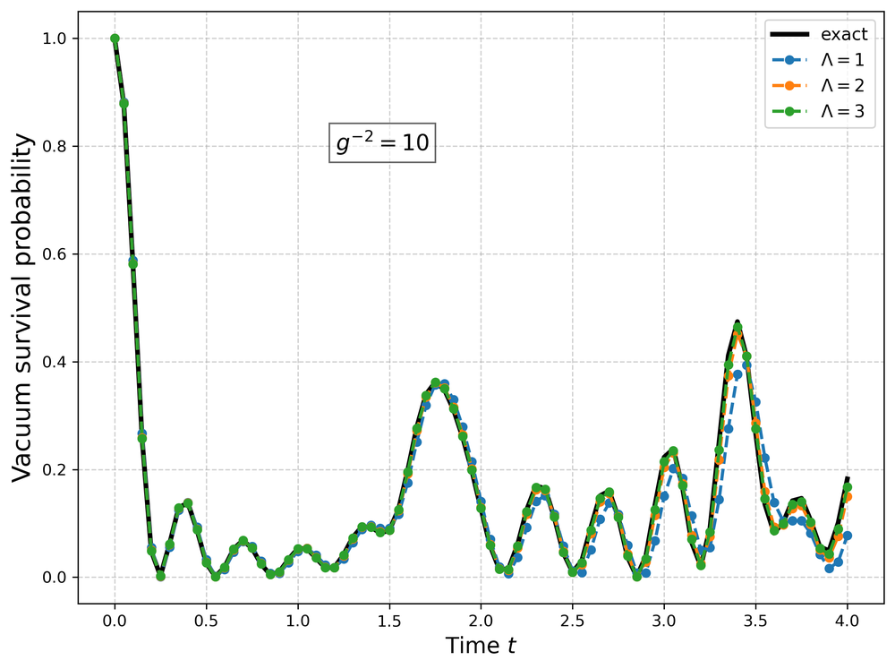
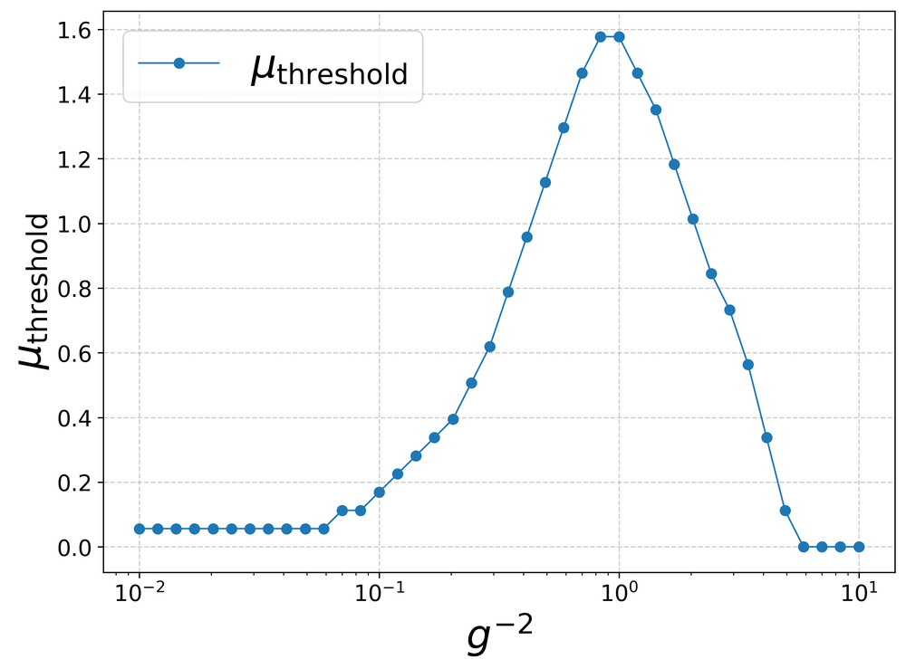
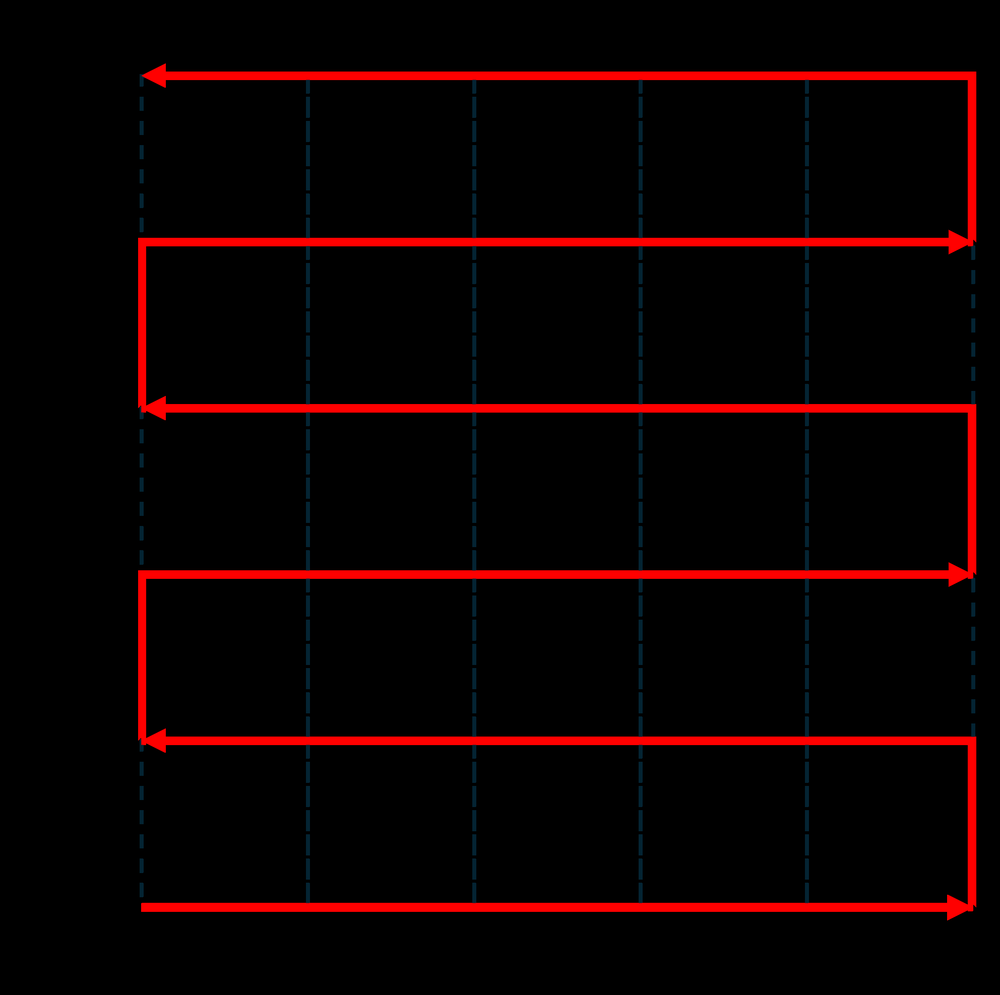

# Simulating quantum electrodynamics in 2+1 dimensions with qubits and qumodes

**ArXiv ID**: 2511.14506v1
**URL**: http://arxiv.org/abs/2511.14506v1
**提交日期**: 2025-11-18
**作者**: Victor Ale; Tommaso Rainaldi; Enrique Rico; Felix Ringer; George Siopsis
**引用次数**: NULL
使用模型: ep-20251112215738-bz78g

## 1. 核心思想总结
**第一轮总结**

**Background (背景)**
量子电动力学是描述光与物质相互作用的基本物理理论。在量子计算机上模拟晶格规范场论（如QED）是量子计算的一个重要应用方向，但如何高效、精确地表示具有连续对称性（如U(1)规范对称性）的非阿贝尔规范场是一个核心挑战。

**Problem (问题)**
现有的纯量子比特模拟方法在处理具有非紧致相空间的U(1)规范场时面临困难，因为需要无限维的希尔伯特空间来精确表示电场和矢量势。同时，如何将这种非紧致性与理论的紧致U(1)规范对称性相协调，并构建一个可扩展的、适用于近期量子设备的模拟框架，是关键难题。

**Method (high-level) (方法 - 高层次)**
本文提出了一种混合的“量子比特-量子连续变量模”框架。在该框架中，费米子物质场由量子比特表示，而U(1)规范场则由连续变量玻色模（qumodes）表示，其正则变量对应理论的电场和矢量势。为了解决qumode的非紧致相空间与紧致规范对称性之间的矛盾，作者引入并比较了两种约束策略：1）基于压缩的投影方法；2）通过惩罚哈密顿量项动态执行紧致性的方法。最后，作者使用连续变量版本的量子虚时间演化算法来验证框架的有效性。

**Contribution (贡献)**
1.  提出了一个用于模拟(2+1)维量子电动力学的混合量子比特-qumode模拟框架。
2.  引入了两种新颖的策略来解决非紧致相空间编码紧致规范对称性的根本问题。
3.  构建了相应的混合哈密顿量，并推导出其到实验可操作量子门的分解。
4.  通过单格点极限下的分析和数值模拟（使用CV-QITE算法），验证了该框架能正确再现规范不变的动力学，为在近期混合量子架构上模拟耦合费米物质的阿贝尔晶格规范理论提供了一条可扩展的路径。

## 2. 方法详解
好的，基于您提供的初步总结和论文方法章节的内容，以下是对该论文方法细节的详细说明，重点突出了关键创新、算法/架构细节、关键步骤与整体流程。

### **论文方法细节详述**

本论文的核心方法是构建一个**混合量子比特-量子连续变量模（Qubit-Qumode）的模拟框架**，用于在晶格上模拟具有紧致U(1)规范对称性的量子电动力学。该方法旨在解决使用纯量子比特系统模拟非紧致规范场所面临的根本性挑战。

#### **一、 关键创新**

1.  **混合表示法**： 这是最核心的创新。论文没有试图将无限维的规范场 Hilbert 空间截断或离散化到量子比特上，而是直接使用**量子连续变量模（Qumode）** 来天然地表示U(1)规范场。每个Qumode的**位置算符（\(\hat{x}\)）** 和**动量算符（\(\hat{p}\)）** 分别对应于规范场的**矢量势（\(\hat{A}\)）** 和**电场（\(\hat{E}\)）**。这种表示法保留了规范场相空间的连续性和非紧致性。
2.  **处理紧致对称性的两种策略**： 这是第二个关键创新。Qumode的非紧致相空间与U(1)规范群的**紧致性**（即规范变换参数在0到\(2\pi\)周期内）存在内在矛盾。论文创新性地提出并比较了两种解决策略：
    *   **策略一：压缩投影法**： 通过一个**压缩算子（\(\hat{S}(r)\)）** 对Qumode的波函数进行变换，将其“压缩”到一个周期性的拟概率分布（如Wigner函数）中，从而在物理上实现紧致性。
    *   **策略二：惩罚哈密顿量法**： 在系统的总哈密顿量中增加一个**惩罚项（\(\hat{H}_{penalty}\)）**。该项会惩罚违反紧致性（即电场值偏离整数）的状态，从而在动力学演化中动态地强制执行紧致约束。
3.  **混合系统的门操作分解**： 论文详细推导了如何将混合系统的演化算符分解为实验上可操作的量子门序列，包括作用于量子比特的门（如泡利门、受控门）和作用于Qumode的连续变量门（如位移门、相位门、压缩门、受控位移门）。

#### **二、 算法/架构细节**

**1. 系统架构与哈密顿量构建**

*   **物质场表示**： 费米子场（如电子/正电子）放置在晶格的**格点**上，使用量子比特来表示其存在与否（例如，用 |0⟩ 和 |1⟩ 表示无费米子和有费米子）或其它内部自由度。
*   **规范场表示**： U(1)规范场存在于晶格的**链接**上。每个链接由一个Qumode表示，其算符对应关系为：\(\hat{x} \equiv \hat{A}\)（矢量势），\(\hat{p} \equiv \hat{E}\)（电场）。
*   **混合哈密顿量**： 系统的总哈密顿量 \(\hat{H}_{total}\) 由三部分构成：
    *   **物质场项（\(\hat{H}_M\)）**： 描述费米子的静质量能，通常形式为 \(\sum_n m \hat{\psi}^\dagger_n \hat{\psi}_n\)，在量子比特编码下表现为对角算符。
    *   **规范动能项（\(\hat{H}_E\)）**： 描述电场的能量，形式为 \(\frac{g^2}{2} \sum_l \hat{E}_l^2 = \frac{g^2}{2} \sum_l \hat{p}_l^2\)，这是一个在Qumode上的二次项。
    *   **规范-物质相互作用项（\(\hat{H}_{int}\)）**： 描述费米子 hopping 时与规范场的耦合，是**关键的非线性项**。形式为 \(\sum_{\langle n,m \rangle} (\hat{\psi}^\dagger_n e^{i \hat{A}_{nm}} \hat{\psi}_m + H.c.)\)。其中 \(e^{i \hat{A}_{nm}}\) 是一个作用于链接上Qumode的**位移算子**。这使得该哈密顿量成为**量子比特和Qumode的耦合项**。

**2. 紧致性约束策略的细节**

*   **策略一：压缩投影法**
    *   **关键步骤**： 对每个表示规范场的Qumode施加一个**压缩变换** \(\hat{S}(r)\)，其中压缩参数 \(r\) 被精心选择。这个变换将电场算符的期望值“量化”到整数附近，即 \(\hat{S}^\dagger(r) \hat{p} \hat{S}(r) \approx e^{-r} \hat{p} \to \hat{E}_{quantized}\)。
    *   **效果**： 在压缩后的表示中，Qumode的Wigner函数呈现出周期性结构，自动满足了U(1)群的紧致性要求。系统的哈密顿量需要在新基下重写（即 \(\hat{S}^\dagger \hat{H} \hat{S}\)）。
*   **策略二：惩罚哈密顿量法**
    *   **惩罚项构建**： 惩罚项的形式为 \(\hat{H}_{penalty} = \lambda \sum_l \cos(2\pi \hat{E}_l) = \lambda \sum_l \cos(2\pi \hat{p}_l)\)，其中 \(\lambda\) 是一个很大的惩罚系数。
    *   **工作原理**： \(\cos(2\pi \hat{p})\) 算符的本征值在 \(\hat{p}\)（即电场 \(\hat{E}\)）为整数时取最大值（能量最低）。当 \(\hat{E}\) 偏离整数时，该项能量会急剧升高。因此，系统的低能物理（即物理态）会被限制在电场为整数的子空间内，从而强制执行了紧致性约束。

**3. 演化算法：连续变量量子虚时间演化**

论文采用**连续变量版本的量子虚时间演化（CV-QITE）** 作为核心算法来验证框架的有效性。
*   **目的**： QITE用于制备系统的基态或研究实时演化，是验证理论正确性的有力工具。
*   **流程**：
    1.  **初始化**： 准备一个简单的试探波函数，例如量子比特和Qumode都处于某个直积态。
    2.  **虚时间演化**： 将虚时间 \(t \to -i\tau\) 代入薛定谔方程，演化算符变为 \(e^{-\tau \hat{H}}\)。这个算符不是幺正的，但可以等效地通过一个幺正的量子电路来模拟，条件是系统的量子态始终保持在一个参数化的试探态形式中。
    3.  **参数更新**： 在每一个小的虚时间步长 \(\delta\tau\) 内，根据McLachlan变分原理，计算出一组最优的参数更新规则。这些规则被翻译成对量子比特和Qumode门操作参数的调整。
    4.  **迭代**： 重复步骤2和3，直到系统能量收敛，从而得到哈密顿量的近似基态。

#### **三、 关键步骤与整体流程**

整个方法的执行流程可以概括为以下步骤：

1.  **系统建模与编码**：
    *   将(2+1)维时空离散化为一个晶格。
    *   **编码物质场**： 将每个格点上的费米子自由度映射到一组量子比特上。
    *   **编码规范场**： 将每个链接上的U(1)规范场映射到一个Qumode上，建立 \(\hat{x}=\hat{A}, \hat{p}=\hat{E}\) 的对应关系。

2.  **构建混合哈密顿量**：
    *   写出完整的Kogut-Susskind哈密顿量 \(\hat{H}_{K-S} = \hat{H}_M + \hat{H}_E + \hat{H}_{int}\)。

3.  **实施紧致性约束（二选一）**：
    *   **选择策略一（压缩法）**： 对总哈密顿量进行压缩变换 \(\hat{H}‘ = \hat{S}^\dagger \hat{H}_{K-S} \hat{S}\)，并在压缩后的基下进行后续计算。
    *   **选择策略二（惩罚法）**： 将惩罚项加入总哈密顿量，形成 \(\hat{H}_{total} = \hat{H}_{K-S} + \hat{H}_{penalty}\)。

4.  **算法执行（以基态制备为例）**：
    *   初始化混合量子系统（量子比特和Qumode）。
    *   运行**CV-QITE算法**：
        *   a. 将系统参数化。
        *   b. 进行一个小步长的虚时间演化。
        *   c. 通过测量某些观测量（如能量梯度），计算参数更新量。
        *   d. 通过调整量子门参数来更新系统状态。
        *   e. 重复b-d步直至收敛。

5.  **观测与验证**：
    *   测量最终的量子态，计算物理观测量，如：
        *   **规范不变性**： 检查高斯定律 \(\hat{G}_n |\psi\rangle = 0\) 是否在期望值意义上满足。
        *   **能谱**： 将获得的基态能量与经典数值方法（如精确对角化）的结果进行比较，验证正确性。
        *   **动力学**： 研究实时演化，观察是否再现了预期的物理现象。

**总结**： 该论文的方法通过**混合架构**巧妙地利用了Qumode处理连续变量的天然优势，并通过**压缩**或**惩罚**两种创新策略解决了紧致对称性的核心难题，最后利用**CV-QITE**算法在混合平台上实现了可操作的模拟流程，为在近期量子设备上模拟连续规范场理论开辟了一条切实可行的路径。

## 3. 最终评述与分析
基于您提供的初步总结、方法详述以及论文结论部分，现给出对该论文的最终综合评估如下：

### **最终综合评估**

#### **1) 总体摘要 (Overall Summary)**

本论文针对在量子计算机上模拟具有紧致U(1)规范对称性的晶格量子电动力学这一核心挑战，提出了一个创新的**混合量子比特-量子连续变量模（Qubit-Qumode）框架**。该框架的核心思想是利用量子连续变量模（Qumode）天然表示非紧致的规范场（电场和矢量势），同时使用量子比特表示费米子物质场。为解决Qumode的非紧致相空间与U(1)群紧致性之间的内在矛盾，论文引入了两种新颖的约束策略（压缩投影法和惩罚哈密顿量法），并详细推导了混合系统的哈密顿量及其向可操作量子门的分解。通过理论分析和基于连续变量量子虚时间演化（CV-QITE）算法的数值模拟，论文验证了该框架能够正确再现规范不变的物理，为在现有的混合量子-光学平台上实现可扩展的连续规范场模拟铺平了道路。

#### **2) 优势 (Strengths)**

*   **根本性的创新**： 提出的混合架构是概念上的重大突破。它跳出了纯量子比特模拟中必须对无限维希尔伯特空间进行人工截断的范式，直接利用Qumode的连续变量特性来自然编码规范场，从根本上避免了截断误差和由此带来的规范对称性破缺问题。
*   **巧妙解决核心难题**： 针对紧致对称性这一关键挑战，论文提出的两种策略（压缩法和惩罚法）极具巧思。压缩法通过变换希尔伯特空间来“塑造”量子态，而惩罚法则在动力学中“选择”物理态，二者从不同角度解决了同一难题，并提供了比较和选择的余地。
*   **可行性与前瞻性**： 论文没有停留在理论构想，而是深入到了可实施的算法层面。它详细给出了哈密顿量的门分解，并采用了适合混合系统的CV-QITE算法进行验证，这表明该方案充分考虑了**近期量子设备**（如集成光学平台）的实际能力，具有很强的工程可行性指引。
*   **通用性与扩展潜力**： 虽然论文以(2+1)维QED为例，但该混合框架的核心思想（Qumode表示规范场、处理紧致对称性的策略）有望推广到更复杂的非阿贝尔规范理论（如量子色动力学QCD）的模拟中，展示了良好的通用性和扩展性。

#### **3) 劣势/局限性 (Weaknesses / Limitations)**

*   **对混合平台的依赖**： 该方案的实现高度依赖于能够同时操控量子比特和量子连续变量模的混合量子平台。目前，这类平台（如超导电路与微波光子耦合、离子阱与声子模耦合等）仍处于发展的早期阶段，其稳定性、可控性和扩展性相比成熟的超导量子比特或光学量子比特平台更具挑战，这可能会限制方案的立即广泛应用。
*   **策略的潜在开销与复杂性**：
    *   **压缩法**： 需要对整个系统进行非平凡的压缩变换，这可能在实际操作中引入额外的复杂性和误差。
    *   **惩罚法**： 需要引入一个大的惩罚系数λ，这可能导致哈密顿量的能标差异巨大，对量子演化的精度和步长控制提出更高要求，可能增加模拟的深度和资源消耗。
*   **数值验证的规模**： 论文中的数值验证（如单格点极限）虽然足以证明原理的正确性，但尚未在更大尺度的晶格上进行演示。在大规模系统中，两种约束策略的有效性、误差积累以及算法的可扩展性仍需进一步探究。
*   **噪声与误差分析缺失**： 作为一篇侧重于提出新框架和原理验证的论文，它可能未充分讨论在实际噪声环境中（如Qumode的退相干、门操作误差）方案的鲁棒性，这是未来实验实现前必须深入分析的问题。

#### **4) 潜在应用/意义 (Potential Applications / Implications)**

*   **量子模拟的里程碑**： 该工作为实现对基本物理理论（尤其是具有连续对称性的规范场论）的**全量子模拟**迈出了关键一步。成功实施将使我们能够用量子计算机探索经典计算机无法触及的物理领域，如强耦合QED下的相变、拓扑效应等。
*   **推动混合量子计算发展**： 本文为混合量子计算范式提供了一个强有力的应用案例，展示了如何利用不同量子系统（离散变量和连续变量）的独特优势协同解决复杂问题。这将激励更多研究者投身于混合量子处理器和算法的开发。
*   **高能物理与凝聚态物理的研究新工具**： 该框架不仅可以用于基本粒子物理的研究，也为模拟凝聚态物理中与规范场耦合的涌现现象（如分数量子霍尔效应、自旋液体）提供了新的强大工具。
*   **量子算法与软件的进步**： 文中发展的CV-QITE算法、混合系统的门分解技术等，本身也是对量子算法和编译技术的重要贡献，可被应用于其他需要处理连续变量的量子计算问题中。

**总结**： 本论文提出了一项极具原创性和前瞻性的研究，为解决量子计算中一个长期存在的挑战提供了新颖且可行的解决方案。尽管其实现依赖于尚在发展中的混合量子平台并存在一些待深入研究的局限性，但其理论深度、创新性和对未来实验的指导意义使其成为量子模拟领域的一个重要贡献，具有深远的科学影响和应用潜力。

---

# 附录：论文图片

## 图 1

## 图 2

## 图 3

