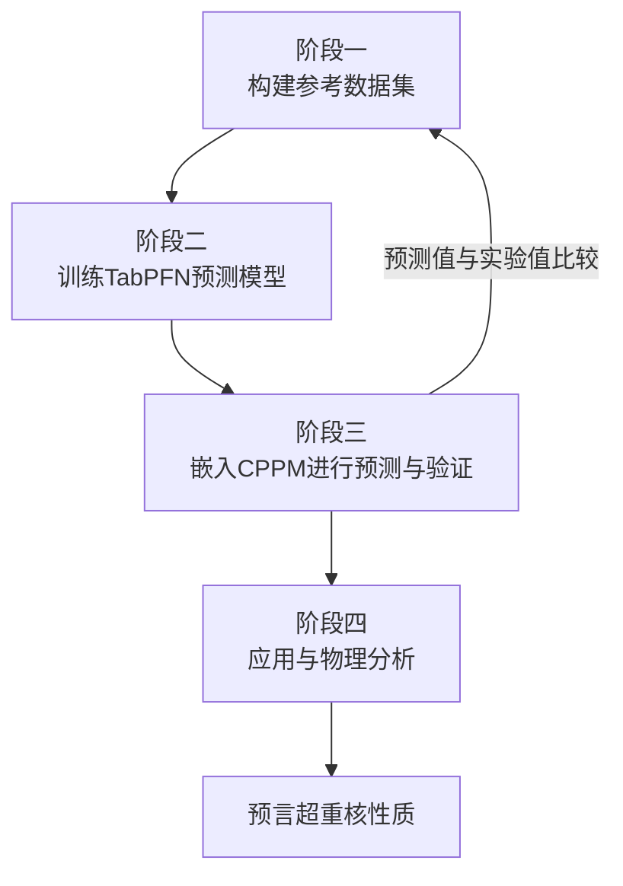
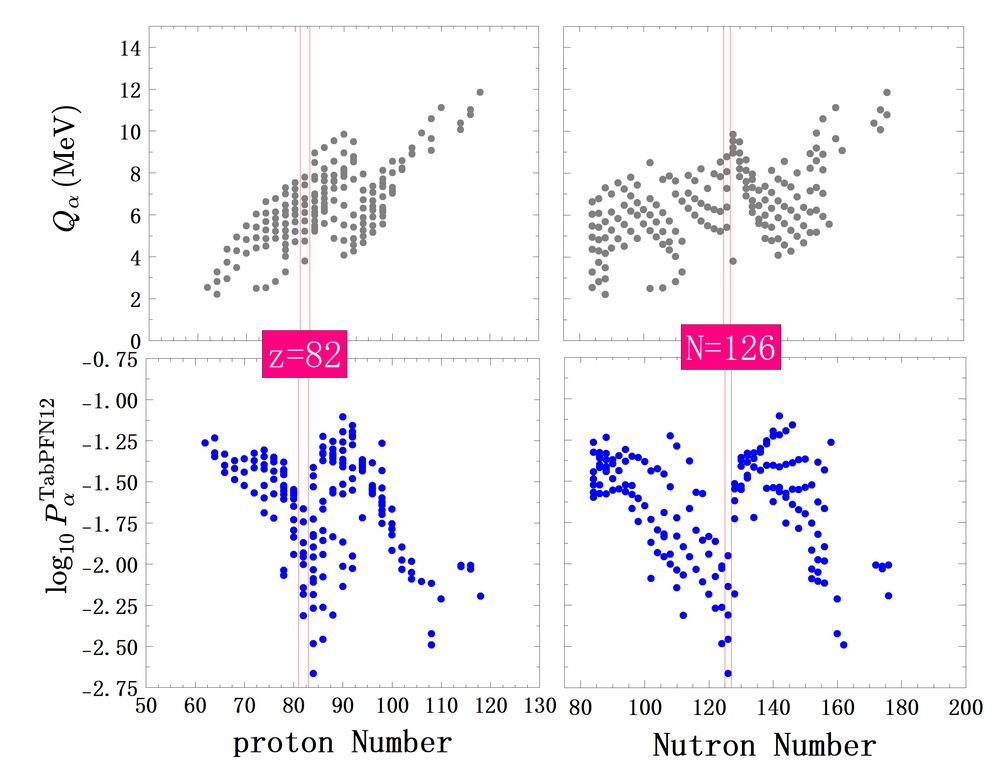
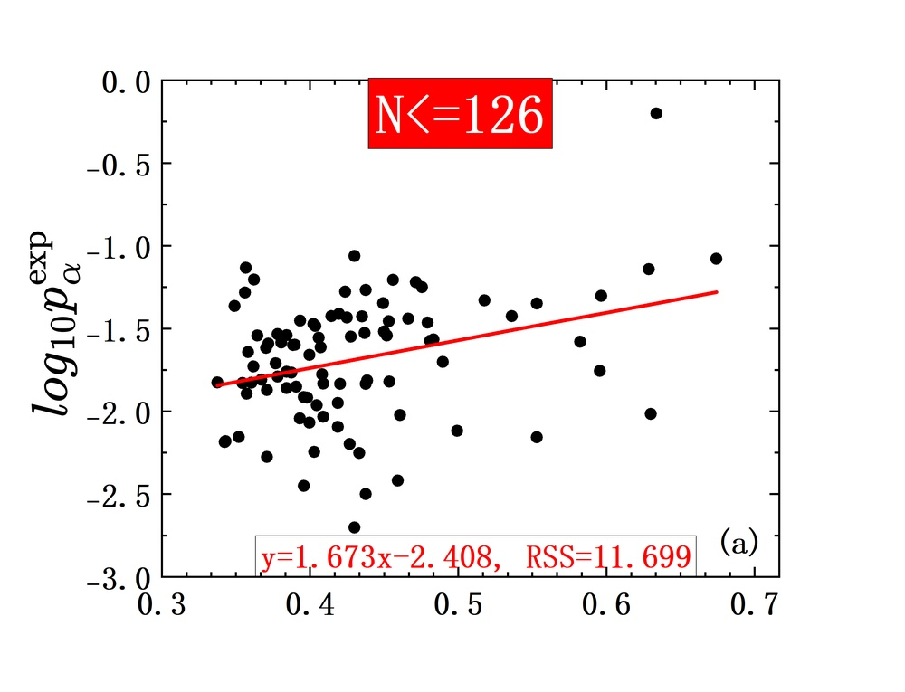
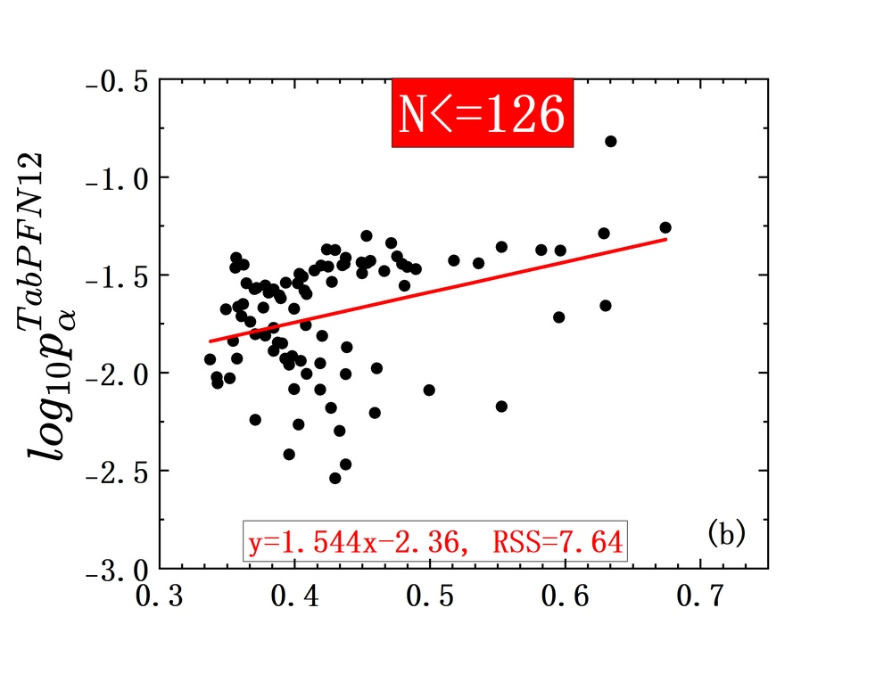
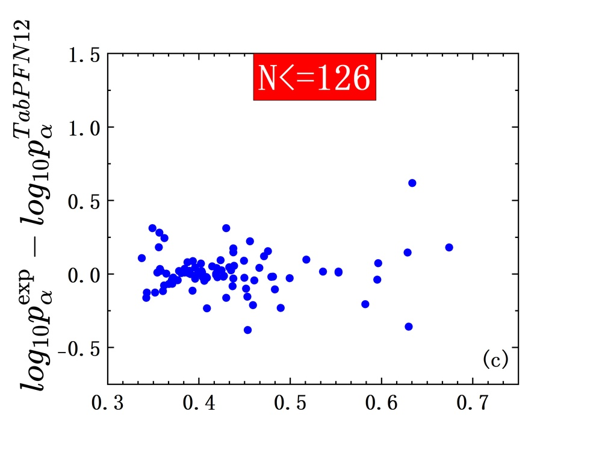
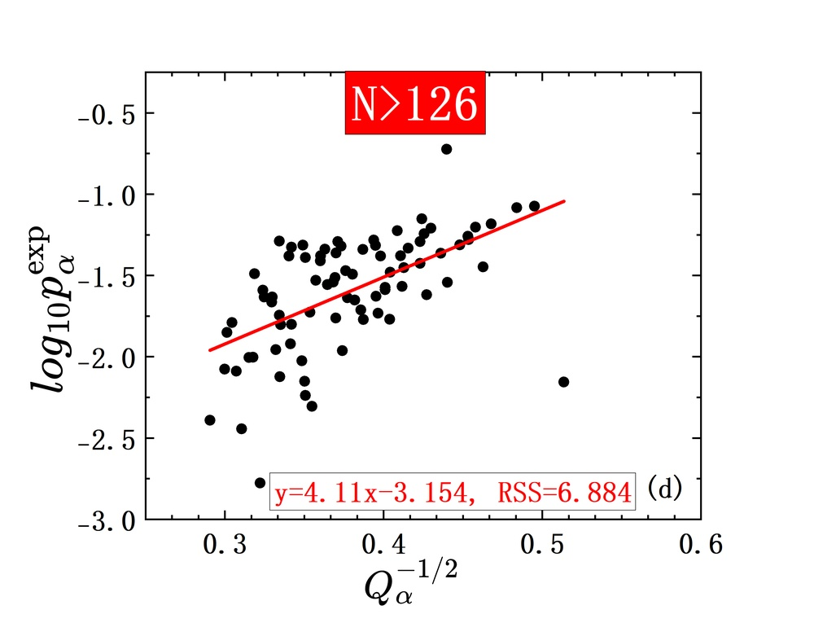
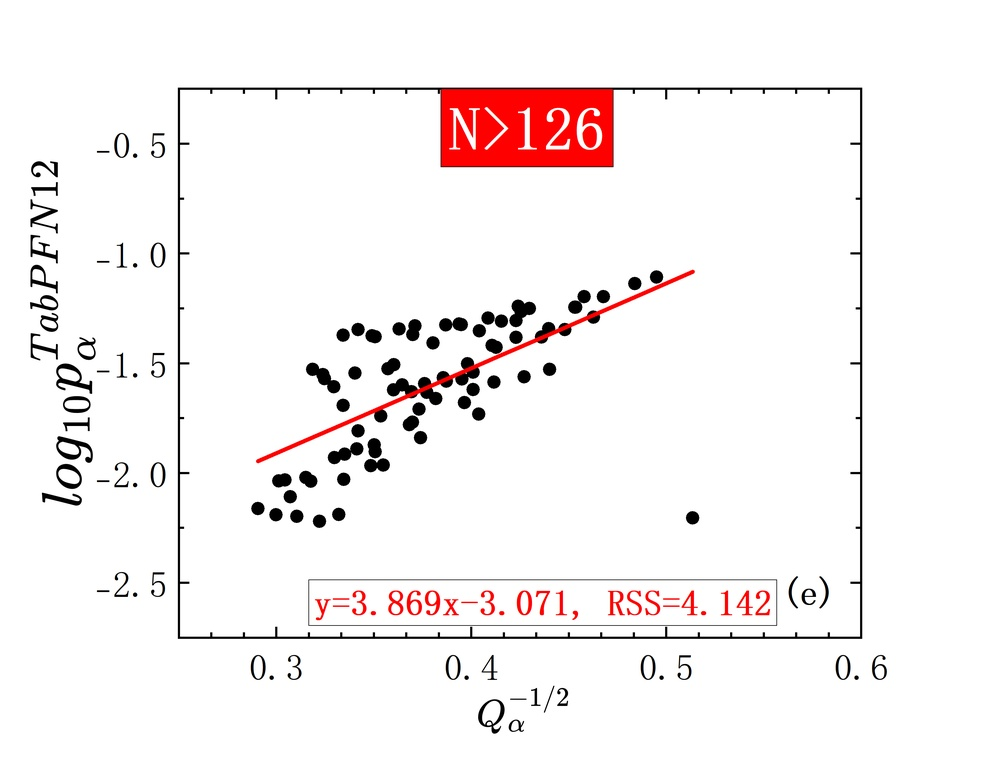
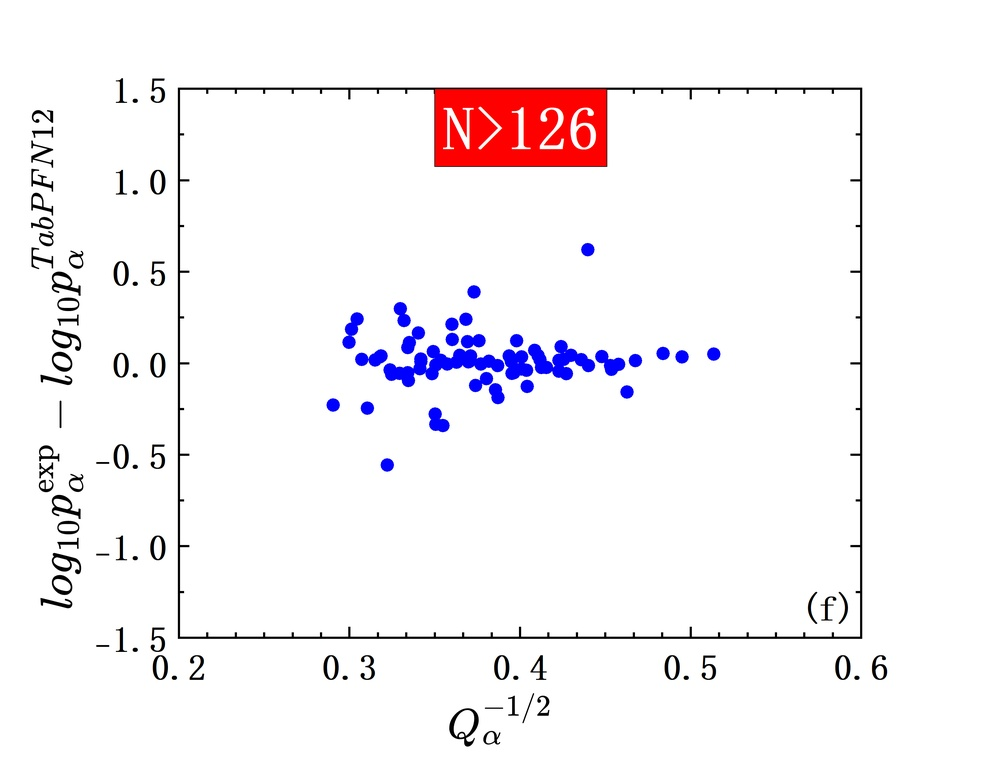
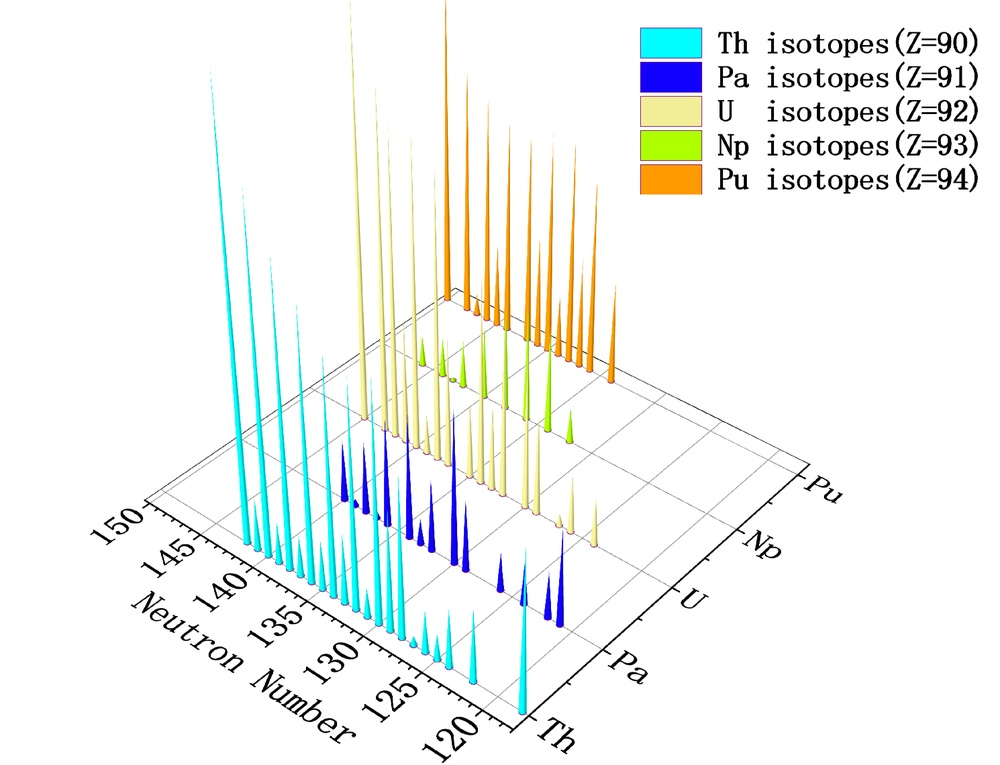
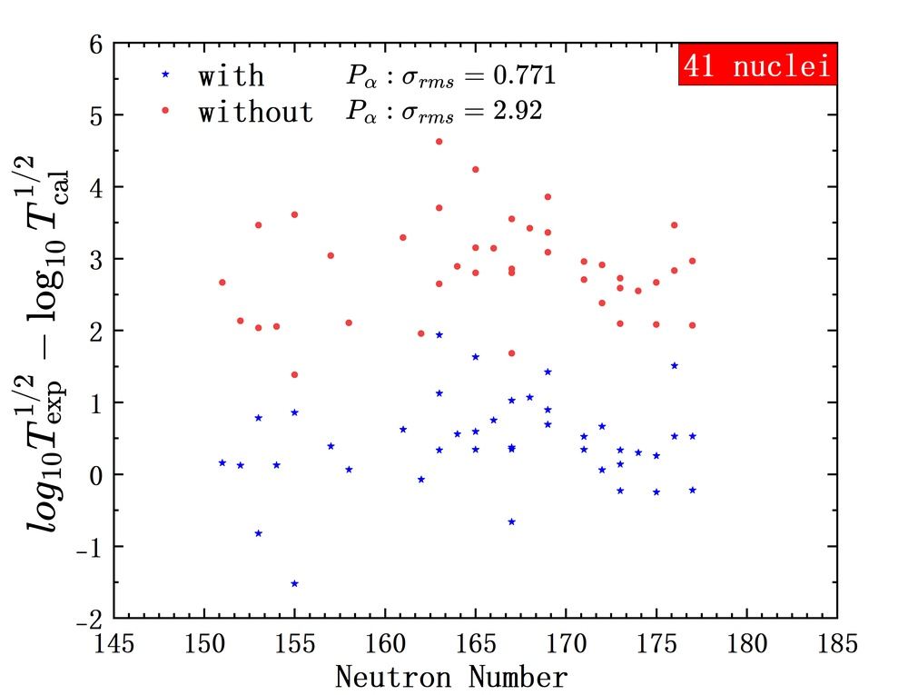

# Systematic Study on the $α$-particle preformation factor in the theory of $α$-decay based on the Tabular Prior-data Fitted Network (TabPFN)

**ArXiv ID**: 2511.14705v1
**URL**: http://arxiv.org/abs/2511.14705v1
**提交日期**: 2025-11-18
**作者**: Panpan Qi; Xuanpeng Xiao; Gongming Yu; Haitao Yang; Qiang Hu
**引用次数**: NULL
使用模型: ep-20251112215738-bz78g

## 1. 核心思想总结
这是一份根据您提供的标题、摘要和引言信息，整理出的第一轮学术论文总结。

**论文标题：** 基于表格先验数据拟合网络（TabPFN）的α衰变理论中α粒子预形成因子的系统性研究

**简洁总结：**

*   **Background (背景):**
    在原子核物理的α衰变理论中，α粒子预形成因子（\(P_α\)）是一个关键但难以从第一性原理计算的物理量。传统模型（如CPPM模型）通常对\(P_α\)进行简化假设，这限制了α衰变半衰期预测的准确性。

*   **Problem (问题):**
    如何更精确、更物理地确定原子核的α粒子预形成因子\(P_α\)，并系统性地研究其与核结构性质（如奇偶效应、壳层效应）的关系，从而改进现有α衰变半衰期的理论预测模型。

*   **Method (高层次方法):**
    本研究提出了一种混合方法：将先进的表格数据机器学习模型——表格先验数据拟合网络（TabPFN）与传统的库仑和邻近势模型（CPPM）相结合。具体而言，利用498个核素的实验数据训练TabPFN模型，使其学习核结构属性与\(P_α\)之间的复杂映射关系。

*   **Contribution (贡献):**
    1.  **高精度预测：** 成功应用TabPFN精确预测了\(P_α\)（均方根偏差为0.211），揭示了其清晰的奇偶 stagger 和壳层闭合效应。
    2.  **物理规律验证与扩展：** 发现预测的\(P_α\)与\(Q_α^{-1/2}\)存在线性关系，扩展了Geiger-Nuttall系统学。
    3.  **改进衰变模型：** 将机器学习得到的\(P_α\)代入CPPM模型，显著提高了α衰变半衰期的预测精度。
    4.  **超重核预言：** 模型应用于超重核区（Z=117–120），预言N=184可能是一个中子幻数，展示了其在前沿领域的应用潜力。

## 2. 方法详解
好的，遵照您的要求，我将基于您提供的初步总结和论文方法章节内容，对该论文所采用的方法进行详细、结构化的说明，重点阐述其关键创新、算法细节与整体流程。

---

### **论文方法细节详解**

本论文的核心方法是一种**物理模型与机器学习相结合的混合范式**。它没有完全抛弃成熟的物理理论模型，而是利用机器学习强大的数据拟合和模式识别能力，去弥补物理模型中一个关键的、经验性的短板。以下是详细分解：

#### **一、 关键创新**

1.  **范式创新：CPPM物理模型与TabPFN机器学习模型的协同**
    *   **传统CPPM模型的局限：** CPPM模型在计算α衰变半衰期（\(T_{1/2}\)）时，理论公式中明确包含预形成因子（\(P_\alpha\)）。然而，传统上\(P_\alpha\)被当作一个需要“拟合”或“假设”的参数（如常数值、或简单的奇偶依赖），这引入了主观性和不精确性，成为整个模型的主要误差来源。
    *   **本研究的创新：** 论文创新性地将\(P_\alpha\)的确定问题，从一个**基于假设的拟合问题**转变为一个**基于数据的预测问题**。具体来说，它使用TabPFN模型，从大量已知核素的实验数据中**直接学习**核结构特性与\(P_\alpha\)之间的复杂、非线性映射关系。然后将学习到的、更“物理”的\(P_\alpha\)值** plug-in（嵌入）** 回CPPM框架中进行半衰期计算。这种“**数据驱动的物理先验增强**”是方法的核心创新。

2.  **技术创新：引入前沿的表格数据学习模型TabPFN**
    *   在处理表格型数据（每个核素是一行，核特性是列）的任务中，TabPFN是比梯度提升机（如XGBoost）等更前沿的模型。其关键优势在于：
        *   **内置先验：** TabPFN在大量合成表格数据上进行了预训练，本身就包含了对表格数据结构的强大先验知识，使其在小样本（几百个数据点）学习任务上表现卓越，且训练速度极快（几秒钟）。
        *   **不确定性估计：** 作为一个贝叶斯模型，TabPFN能够提供预测的不确定性估计，这对于评估预测结果的可靠性至关重要，尤其是在预测未知超重核时。

#### **二、 算法/架构细节**

**A. 基础物理模型：库仑和邻近势模型（CPPM）**

1.  **α衰变半衰期公式：**
    \[    \log_{10} T_{1/2} = [\log_{10} \ln 2] - \log_{10} P_\alpha - \log_{10} S_{i.m.} + \log_{10} \left[ \int_{R_{\text{in}}}^{R_{\text{out}}} \frac{dR}{2K(R)} \right]\]
    *   \(P_\alpha\)： α粒子预形成因子，是本研究的**核心预测目标**。
    *   \(S_{i.m.}\)： 内禀谱因子，与\(P_\alpha\)物理上相关，但在CPPM中通常合并考虑或简化。
    *   积分项： 表示α粒子在量子隧穿通过势垒的透射概率，由核势、库仑势和离心势共同决定。这部分是CPPM的**第一性原理计算核心**，基于双核系统模型和给定的核质量表（如WS4）精确计算。

**B. 机器学习模型：表格先验数据拟合网络（TabPFN）**

1.  **模型角色：** TabPFN在本研究中被用作一个**高精度的回归器**，其任务是：**输入**一个原子核的特征向量（如质子数Z、中子数N、衰变能\(Q_\alpha\)等），**输出**该原子核的预形成因子\(P_\alpha\)的预测值。

2.  **TabPFN核心思想（简化）：**
    *   **预训练：** 在进入本任务之前，TabPFN已经在海量、多样化的**合成表格数据集**上进行了训练。这个过程使其学习到了“表格数据通常长什么样”的**先验知识**，例如特征之间的常见关系、交互作用等。
    *   **快速推理：** 当面对一个新的小数据集（如本研究的498个核素）时，TabPFN利用其先验知识，通过**贝叶斯推断**快速地将先验知识适配（或“拟合”）到当前的新数据上，生成一个针对该特定任务的预测模型。这个过程避免了传统深度学习模型从零开始的大量训练。

3.  **输入特征工程：**
    *   **特征选择：** 输入TabPFN的特征是经过精心挑选的、与核结构直接相关的物理量。根据方法章节，至少包括：
        *   质子数（Z）和中子数（N）
        *   α衰变能（\(Q_\alpha\)）
        *   可能还包括奇偶性、壳层修正能等。
    *   **目标变量：** 训练TabPFN所需的“真实”\(P_\alpha\)标签，是通过将**实验测得的半衰期**（\(T_{1/2}^{\text{exp}}\)）代入CPPM公式反推得到的：
        \[        P_\alpha^{\text{ref}} = \frac{\ln 2}{T_{1/2}^{\text{exp}} \times \nu \times S_{i.m.}}\]
        这里的\(P_\alpha^{\text{ref}}\)被视为基于实验数据的参考值，作为TabPFN学习的“标准答案”。

#### **三、 关键步骤与整体流程**

整个研究方法的流程可以清晰地分为四个阶段，如下图所示意的闭环过程：

**阶段一：构建参考数据集**
1.  **数据收集：** 从核数据库（如NUBASE）中收集498个核素的高质量实验数据，包括α衰变半衰期（\(T_{1/2}^{\text{exp}}\)）和衰变能（\(Q_\alpha\)）。
2.  **计算参考Pα：** 对于每个核素，使用CPPM模型（基于WS4质量表）计算其势垒穿透概率等量子力学项，然后结合实验测得的\(T_{1/2}^{\text{exp}}\)，通过公式反推出一个**参考预形成因子\(P_\alpha^{\text{ref}}\)**。
3.  **特征-标签配对：** 将每个核素的核物理特征（Z, N, \(Q_\alpha\), ...）作为输入特征（X），计算得到的\(P_\alpha^{\text{ref}}\)作为目标标签（y），共同构成训练TabPFN的数据集。

**阶段二：训练TabPFN预测模型**
1.  **模型训练：** 将上述数据集（498个样本）输入TabPFN模型进行训练/拟合。由于TabPFN的高效性，此过程耗时极短。
2.  **学习映射关系：** TabPFN从数据中学习到从核结构特征（X）到预形成因子（y）的复杂非线性映射函数 \(P_\alpha = f(Z, N, Q_\alpha, ...)\)。

**阶段三：嵌入CPPM进行预测与验证**
1.  **预测Pα：** 使用训练好的TabPFN模型，对数据集中的核素（或新的核素）预测其\(P_\alpha\)值。此时得到的是基于数据驱动思想的“机器学习增强型”\(P_\alpha^{\text{ML}}\)。
2.  **计算半衰期：** 将预测出的\(P_\alpha^{\text{ML}}\)代入CPPM的半衰期计算公式中，计算理论预言半衰期\(T_{1/2}^{\text{pred}}\)。
3.  **验证精度：** 将\(T_{1/2}^{\text{pred}}\)与实验值\(T_{1/2}^{\text{exp}}\)进行比较，通过均方根偏差（RMSD）等指标验证混合模型的精度提升效果。

**阶段四：应用与物理分析**
1.  **系统性研究：** 分析TabPFN预测出的整套\(P_\alpha\)值随中子数N、质子数Z的变化趋势，研究奇偶 stagger、壳层闭合（幻数）等核结构效应在\(P_\alpha\)上的体现。
2.  **扩展物理规律：** 将预测的\(P_\alpha\)与\(Q_\alpha^{-1/2}\)等量进行关联分析，验证并扩展传统的Geiger-Nuttall定律。
3.  **预言超重核：** 将训练好的模型应用于尚无实验数据的超重核区（Z=117–120），预测它们的\(P_\alpha\)和α衰变半衰期，为实验合成和鉴定提供理论参考，并基于\(P_\alpha\)的突变来支持N=184为中子幻数的预言。

---

**总结而言，该方法的核心精髓在于“扬长避短”：用CPPM可靠地处理量子隧穿等第一性原理计算，用TabPFN智能地学习物理模型中难以确定的经验参数。这种混合策略不仅显著提升了预测精度，更重要的是，其产出的\(P_\alpha\)数据本身成为了系统性研究核结构规律的新窗口。**

## 3. 最终评述与分析
根据您提供的论文标题、摘要、引言、方法细节以及结论部分的信息，现为您整理出最终的综合性评估报告如下：

### **基于TabPFN的α粒子预形成因子系统性研究：综合评估报告**

#### **1) 总体摘要**

本论文针对原子核α衰变理论中的核心难题——α粒子预形成因子（Pα）的精确确定问题，提出并成功实践了一种创新的**物理模型与机器学习相结合的混合范式**。研究通过将传统的库仑和邻近势模型（CPPM）与前沿的表格数据学习模型TabPFN相结合，利用498个核素的实验数据，让机器学习算法从数据中直接学习核结构特性与Pα之间的复杂映射关系。结果表明，该方法不仅能以高精度（均方根偏差为0.211）预测Pα，揭示了其清晰的奇偶 stagger 和壳层闭合效应，还显著提升了α衰变半衰期的理论预测能力。最终，模型被应用于超重核区，预言N=184可能是一个重要的中子幻数，展示了该方法在推动前沿核物理研究方面的巨大潜力。

#### **2) 优势**

*   **范式创新性强：** 核心创新点在于将Pα的确定从一个“基于假设的参数拟合问题”转变为一个“基于数据的物理量预测问题”。这种“数据驱动的物理先验增强”策略，为处理物理理论中的经验参数提供了新思路。
*   **方法协同高效：** 巧妙结合了CPPM模型在第一性原理计算（量子隧穿）上的可靠性，与TabPFN模型在小样本表格数据学习和模式识别上的高效性（训练快、内置先验），实现了优势互补。
*   **预测精度显著提升：** 相较于传统CPPM模型中简化处理Pα的方法，本方法将α衰变半衰期预测的精度提高了数个量级，证明了其有效性和优越性。
*   **物理洞察深刻：** 研究并未停留在“黑箱”预测，而是对机器学习输出的Pα值进行了深入的物理分析，成功验证并扩展了Geiger-Nuttall系统学，清晰揭示了Pα的奇偶效应和壳层效应，将数据驱动的结果与基础物理规律联系起来，增强了结果的可解释性。
*   **应用前景明确：** 模型在超重核区的成功应用，不仅为实验合成和鉴定新元素提供了有价值的理论预言，还支持了N=184作为中子幻数的关键核结构预言，凸显了其解决前沿实际问题的能力。

#### **3) 劣势 / 局限性**

*   **数据依赖性：** 模型的性能和可靠性高度依赖于训练数据的质量和数量。目前使用的498个核素的数据集虽然可观，但覆盖的核素范围可能仍有局限，且实验数据的误差会传递到反推的参考Pα值中，影响模型学习。
*   **模型可解释性的固有挑战：** 尽管论文对输出结果进行了物理分析，但TabPFN模型内部的决策过程仍具有一定程度的“黑箱”特性。对于为何某个核素会预测出特定的Pα值，其详细的物理机制解释不如纯解析模型直接。
*   **外推风险：** 将模型应用于训练数据区域之外（尤其是远超出训练样本质子数、中子数的超重核区）存在外推不确定性。尽管TabPFN提供了不确定性估计，但预言的可信度仍需未来实验的最终检验。
*   **计算资源的潜在限制：** 文中提到TabPFN适合小样本学习，但其预训练过程需要大量计算资源。虽然对本研究的使用者而言是便捷的，但该模型的定制化和进一步开发可能对计算资源有较高要求。
*   **对基础物理模型的依赖：** 本方法的“混合”范式依然建立在CPPM框架之上。因此，CPPM模型本身固有的近似和假设（如核势的选择、形状假设等）仍然是该混合模型系统误差的潜在来源。

#### **4) 潜在应用 / 启示**

*   **核物理理论模型改进：** 该方法为改进现有核衰变、裂变等理论模型提供了一个行之有效的模板。未来可将此范式推广至其他理论模型中难以从第一性原理计算的经验参数（如谱因子、结团预形成概率等）的确定上。
*   **实验核物理的指导作用：** 对超重核α衰变性质的准确预言，能为实验上合成和鉴别新元素、新核素提供关键的理论依据，帮助设计实验方案和解释实验结果。
*   **核数据评估与填补：** 可用于评估、补全现有核数据库中缺失或不确定的衰变数据，为核技术应用（如核能、医学物理、放射性束流物理）提供更可靠的基础数据。
*   **机器学习与科学发现的结合示范：** 本工作是机器学习技术与传统物理科学深度交叉的成功案例。它启示我们，机器学习不仅是预测工具，更能通过从数据中学习，**发现新的物理规律或关系**（如扩展Geiger-Nuttall律），成为推动科学发现的新引擎。
*   **促进人工智能在科学领域（AI4Science）的应用：** 为其他科学领域（如材料科学、化学、天体物理）中解决类似的复杂、数据驱动的参数化问题提供了可借鉴的方法论。

---
**总结：** 本研究是一项高质量、创新性强的交叉学科工作。它成功地将前沿机器学习技术融入经典核物理问题，不仅解决了具体科学问题、提升了预测精度，更重要的是展示了“物理模型+AI”这一新范式在增强科学模型能力、深化物理洞察方面的巨大潜力，具有重要的学术价值和广泛的应用前景。

---

# 附录：论文图片

## 图 1

## 图 2

## 图 3

## 图 4

## 图 5

## 图 6

## 图 7

## 图 8

## 图 9

## 图 10

