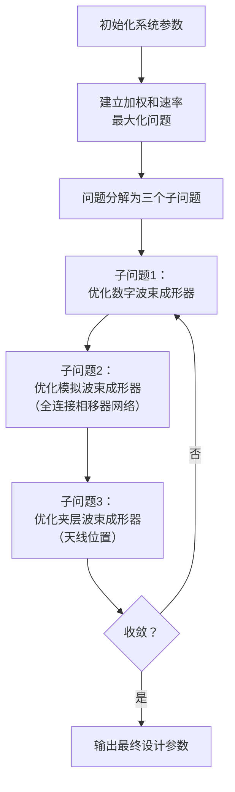
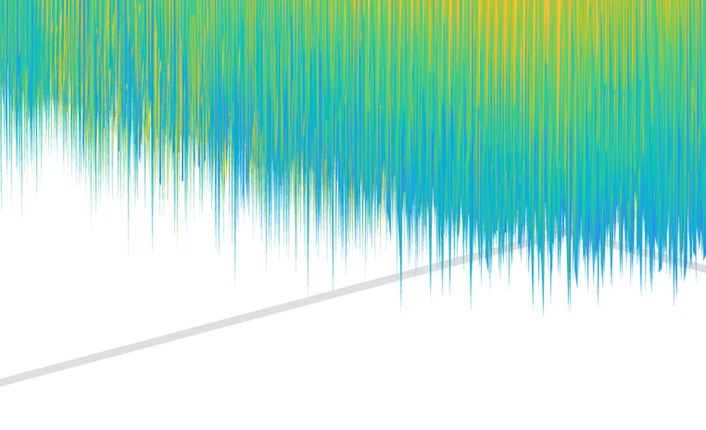
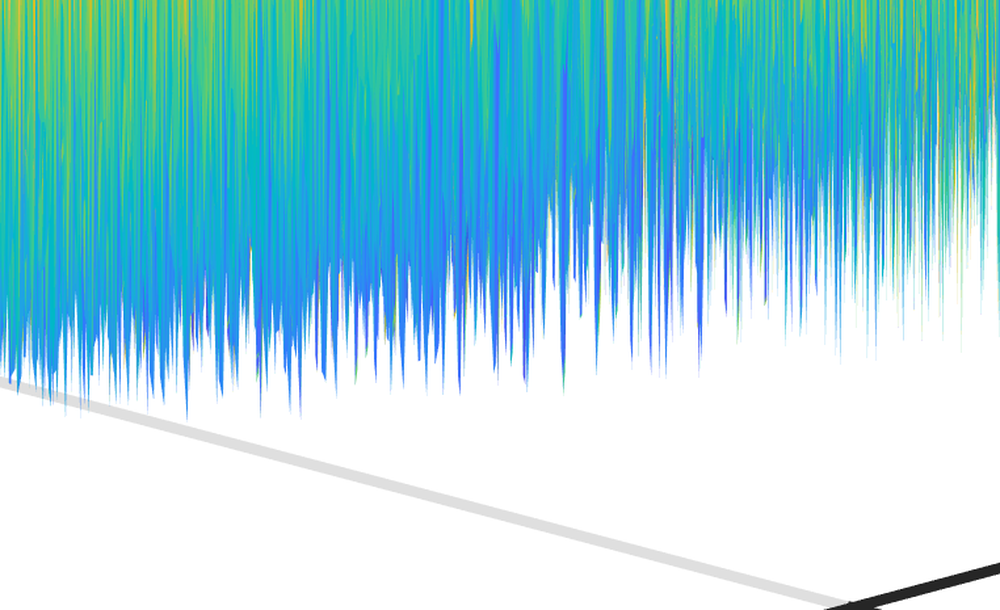
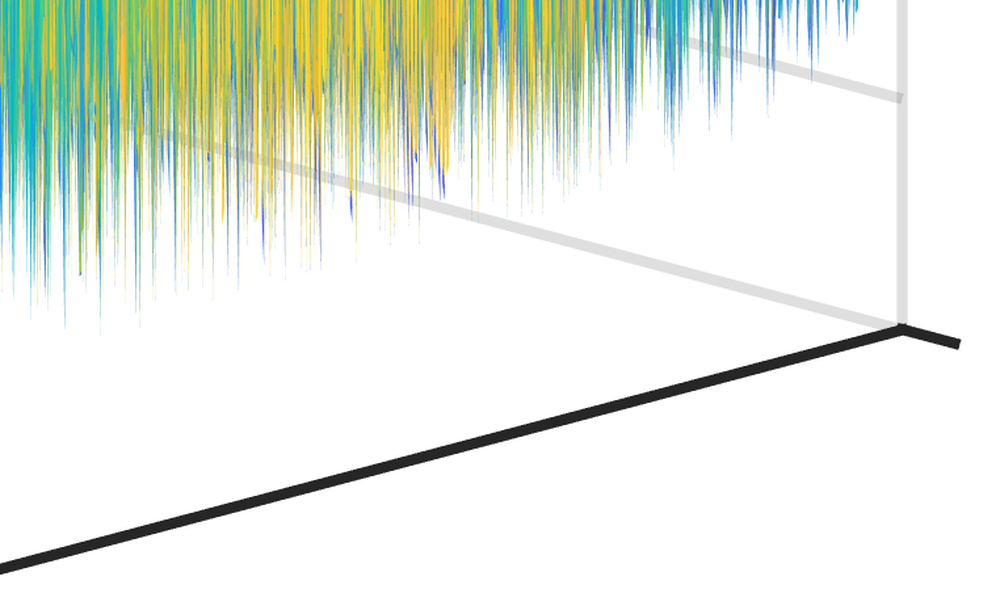
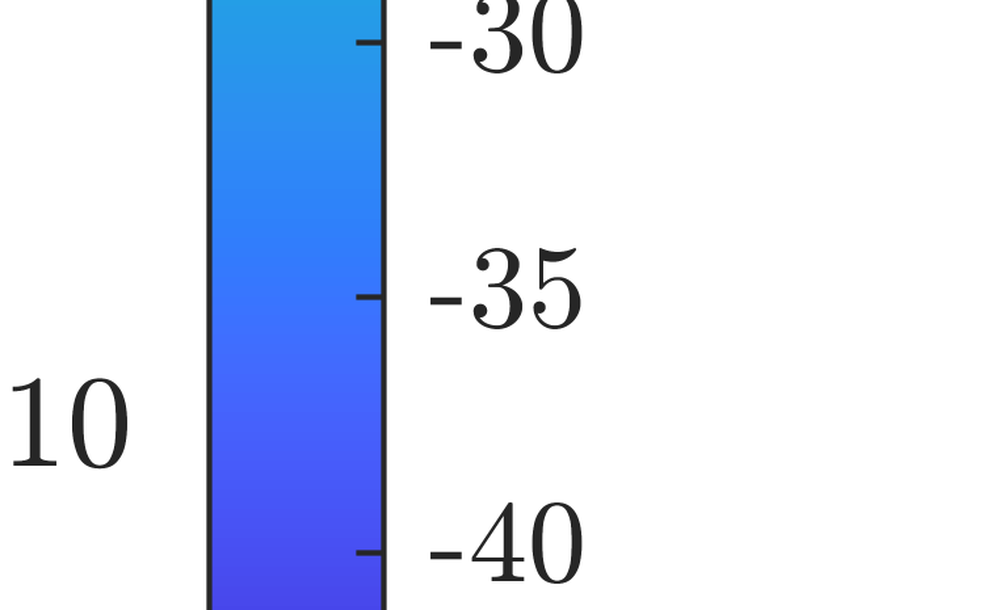
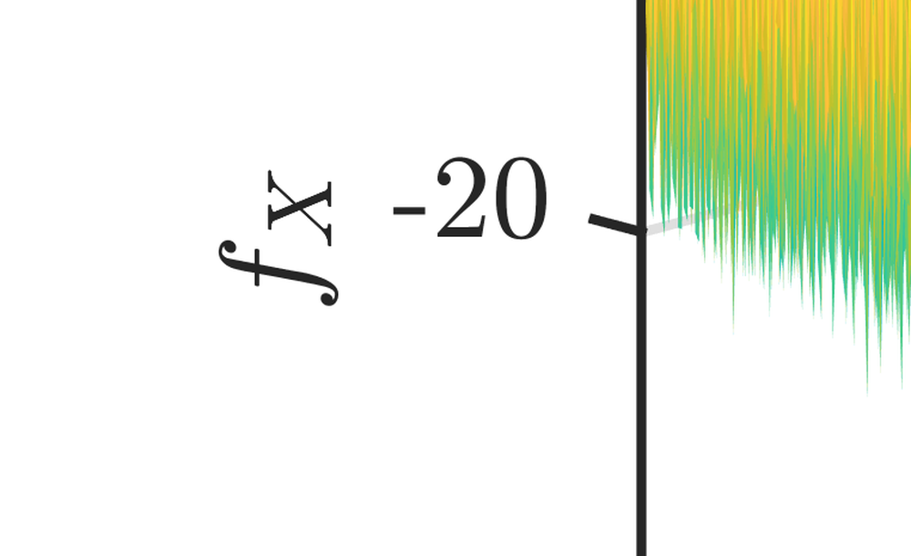
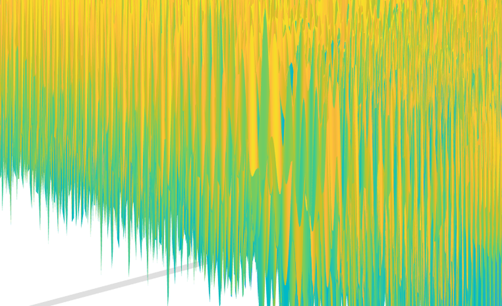
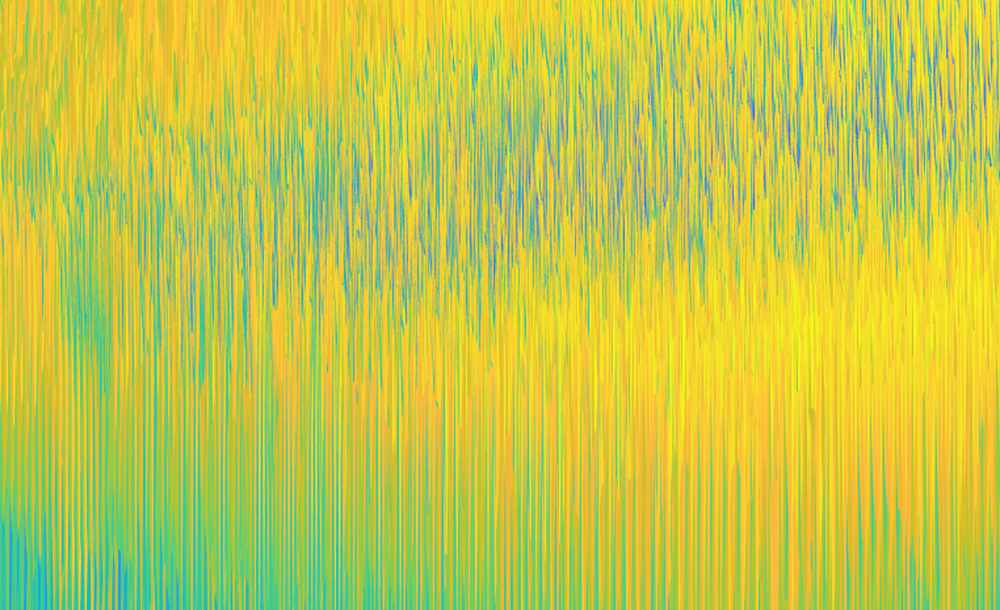
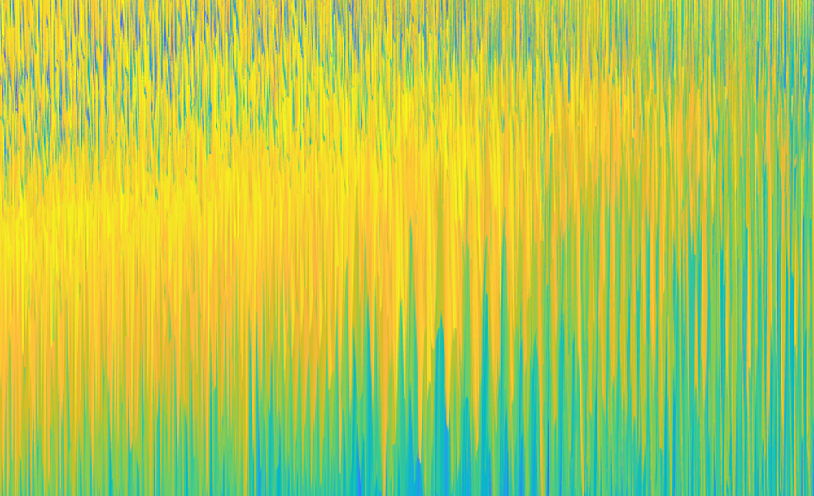
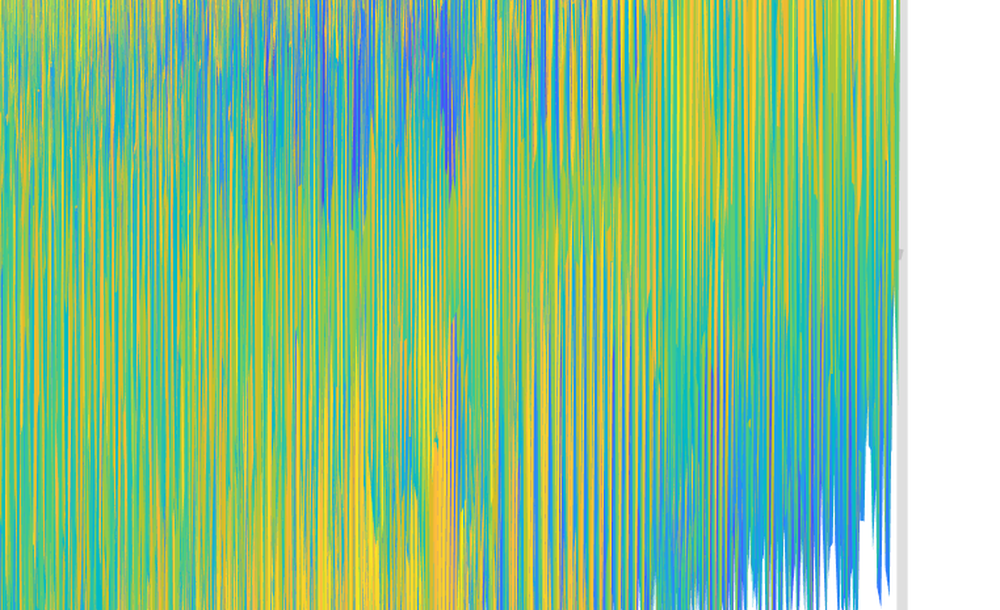

# Tri-Hybrid Beamforming Design for Fully-Connected Pinching Antenna Systems

**ArXiv ID**: 2511.14517v1
**URL**: http://arxiv.org/abs/2511.14517v1
**提交日期**: 2025-11-18
**作者**: Cheng-Jie Zhao; Zhaolin Wang; Hyundong Shin; Yuanwei Liu
**引用次数**: NULL
使用模型: ep-20251112215738-bz78g

## 1. 核心思想总结
这是一份根据您提供的标题和摘要整理的学术论文第一轮总结。

**标题：** 全连接夹层天线系统的三混合波束成形设计

**第一轮总结：**

*   **背景：**
    本文的研究背景是夹层天线系统，这是一种通过物理移动天线单元位置来增强波束成形灵活性的技术。传统的此类系统通常采用“部分连接”架构，其在性能和能效上存在限制。

*   **问题：**
    针对上述背景，本文旨在解决的核心问题是如何设计一种新的系统架构和相应的优化算法，以在保证高加权和速率性能的同时，显著提升夹层天线系统的能量效率。

*   **方法：**
    1.  **提出新架构：** 作者首先提出了一种名为“全连接三混合波束成形”的新架构。该架构通过一个可调相移器网络，将所有射频链与所有波导连接起来，融合了传统的模拟-数字混合波束成形和夹层波束成形。
    2.  **设计两种算法：** 为优化该架构，作者针对一个非凸的加权和速率最大化问题，开发了两种算法：一种是基于分式规划的交替优化算法，直接优化波束成形器和天线位置；另一种是基于迫零的简化算法，以降低计算复杂度。两种算法均采用了改进的自适应差分进化方法来高效优化天线位置。

*   **贡献：**
    本文的主要贡献在于提出了一种创新的全连接三混合波束成形架构。仿真结果表明，该架构能以更少的射频链实现与部分连接架构相近的加权和速率性能，同时展现出更优的能量效率。

## 2. 方法详解
好的，根据您提供的初步总结和论文方法章节内容，现对其方法细节进行详细说明。

### **论文方法详细说明**

本论文的核心是提出一种创新的“全连接三混合波束成形”架构，并设计高效的算法来优化该架构下的系统性能。其方法流程可以清晰地分为三个主要部分：**1）提出新架构；2）建立优化问题；3）设计求解算法。**

#### **一、 关键创新：全连接三混合波束成形架构**

这是本文最核心的贡献，它从根本上改变了传统夹层天线系统的连接方式。

*   **传统架构的局限（部分连接）：**
    *   在传统的“部分连接”夹层系统中，每个射频链仅连接到一个特定的波导（或一小组波导），每个波导又驱动一个固定的天线子阵列。
    *   这种架构限制了波束成形的灵活性，因为射频链的资源无法在所有天线单元之间共享。为了达到高性能，往往需要部署大量的射频链，导致能耗过高。

*   **本文提出的新架构（全连接）：**
    *   **核心创新点：** 在射频链和波导之间引入了一个**全连接的可调相移器网络**。这意味着**每一个射频链都可以通过这个网络连接到系统中的任何一个波导**。
    *   **“三混合”的构成：**
        1.  **数字波束成形器：** 在基带处理，负责多数据流的预编码。
        2.  **模拟波束成形器：** 即上述的**全连接相移器网络**，在射频域实现信号的灵活组合与分配。
        3.  **夹层波束成形：** 通过**物理移动天线单元**的位置（即改变波导上的激励相位）来进一步优化波束方向图。
    *   **架构优势：**
        *   **极高的灵活性：** 全连接结构使得系统能够以更少的射频链，动态地将能量集中到不同方向的用户，实现了射频链资源在所有天线单元间的充分共享。
        *   **高能效：** 核心目标。通过减少昂贵且高功耗的射频链数量，同时利用低功耗的模拟相移器和天线移动，在保持性能的同时显著提升系统整体能量效率。

#### **二、 整体流程与关键步骤**

方法的整体流程是一个系统化的优化过程，下图清晰地展示了其核心步骤与循环迭代关系：

#### **三、 算法/架构细节**

针对上述流程中的关键步骤，论文设计了以下核心算法：

**1. 优化问题建模：**
*   **目标函数：** 加权和速率，即所有用户速率与其优先级的加权和。最大化该函数意味着提升系统整体吞吐量和公平性。
*   **约束条件：**
    *   发射总功率约束。
    *   模拟波束成形器（相移器网络）的恒定模约束（每个相移器只能改变相位，振幅固定）。
    *   天线单元在波导上的物理移动范围约束。
*   **问题特性：** 该问题是一个包含连续变量（波束成形矩阵）和离散变量（天线位置）的**非凸优化问题**，非常复杂，难以直接求解。

**2. 基于分式规划和交替优化的主算法：**
论文采用**交替优化**框架，将复杂联合问题分解为三个相对简单的子问题，并迭代求解。

*   **步骤一：优化数字波束成形器（基带预编码器）**
    *   **方法：** 在固定模拟波束成形器和天线位置的情况下，问题简化为一个传统的多用户波束成形问题。论文采用**加权最小均方误差变换**和**分式规划**工具，将其转化为一个等价的、更容易处理的凸优化问题，然后使用标准凸优化算法求解。

*   **步骤二：优化模拟波束成形器（全连接相移器网络）**
    *   **挑战：** 由于恒定模约束，这是整个优化中最难的部分。
    *   **方法：** 论文采用**曼哈顿距离最小化**的思想。具体而言，在固定其他变量后，目标是让全连接的模拟波束成形器（乘以数字波束成形器后）尽可能逼近一个理想的、无约束的最优全数字波束成形器。
    *   **关键公式：** 通过最小化二者之间的Frobenius范数距离，并利用**矩阵分解**技术（如特征值分解或奇异值分解），可以推导出每个相移器闭合形式的最优解，从而高效地更新整个相移器网络。

*   **步骤三：优化夹层波束成形器（天线位置）**
    *   **挑战：** 天线位置是离散变量，且优化空间巨大，传统梯度方法不适用。
    *   **方法：** 这是论文的另一大算法创新点。作者采用了一种**改进的自适应差分进化算法**。
        *   **差分进化简介：** 一种强大的进化算法，通过“变异”、“交叉”、“选择”操作在解空间中搜索最优解。
        *   **本文的改进：** 针对天线位置优化问题的特殊性，对算法的参数（如缩放因子、交叉概率）进行了自适应调整，使其能更快、更稳定地收敛到高性能的天线布局。
        *   **操作：** 该算法将一组可能的天线位置配置作为“种群”，通过迭代进化，筛选出能最大化目标函数（加权和速率）的最终位置。

**3. 基于迫零的简化算法：**
为了进一步降低计算复杂度，满足实时性要求高的场景，论文提出了第二种算法。
*   **核心思想：** 利用**迫零准则**来简化数字和模拟波束成形器的设计。迫零目标是通过波束成形完全消除用户间的干扰。
*   **流程：** 首先，根据信道状态信息设计一个迫零预编码器。然后，将全数字的迫零预编码器通过矩阵分解技术（类似主算法中的步骤二）映射到全连接的模拟波束成形器和数字波束成形器上。最后，**仍然使用上述改进的自适应差分进化算法来优化天线位置**，以进一步提升迫零方案下的性能。

### **总结**

本文的方法细节体现了 **“架构创新”** 与 **“算法创新”** 的紧密结合。**全连接三混合波束成形架构**奠定了高能效和灵活性的硬件基础。而**基于分式规划和交替优化的算法**以及**改进的自适应差分进化算法**，则提供了高效求解这一复杂设计问题的钥匙。两种算法（高性能与低复杂度）的提出，也使得该架构能够适应不同应用场景的需求。最终，通过仿真验证，该方案能够以更少的射频链实现与传统架构相媲美的性能，显著提升了能量效率。

## 3. 最终评述与分析
好的，结合前两轮关于论文标题、摘要、方法详述以及结论部分的信息，现为您提供最终的综合评估如下：

### **关于“全连接夹层天线系统的三混合波束成形设计”的最终综合评估**

#### 1) 总体摘要 (Overall Summary)
本论文针对传统部分连接夹层天线系统在能效和灵活性上的局限，提出了一种创新的**全连接三混合波束成形**架构。该架构的核心是在射频链与波导之间引入一个全连接的可调相移器网络，将数字波束成形、模拟波束成形与物理天线移动（夹层波束成形）三者深度融合。为优化这一复杂架构，论文设计了一套完整的算法解决方案，包括一个基于分式规划和交替优化的高性能算法，以及一个基于迫零准则的低复杂度算法，其中特别采用了改进的自适应差分进化算法来高效优化离散的天线位置。仿真结果表明，该方案能够以**显著更少的射频链**，实现与先进部分连接架构相媲美的加权和速率性能，同时**大幅提升了系统的能量效率**。

#### 2) 优势 (Strengths)
*   **架构创新性强：** 提出的“全连接”架构是核心亮点，它打破了传统部分连接模式的资源壁垒，实现了射频链资源在所有天线单元间的灵活共享，为高能效波束成形设计提供了新的硬件基础。
*   **算法设计全面且精巧：** 不仅提出了架构，还提供了从高精度到低复杂度的完整算法链。交替优化框架将复杂非凸问题有效分解，而改进的差分进化算法成功解决了离散天线位置优化这一难题，显示了强大的工程应用潜力。
*   **性能优势显著：** 通过严谨的仿真验证，论文证实了所提方案在核心性能指标（加权和速率）上不逊于甚至优于传统方案，同时在**能量效率**这一关键指标上取得了**颠覆性优势**，直击未来通信网络（如6G）对能效的核心需求。
*   **解决方案实用化导向：** 提供了两种算法（高性能主算法 vs. 低复杂度简化算法），使该技术能灵活适应不同场景（如计算资源充裕的基站 vs. 要求实时性的设备），增强了其实用价值。

#### 3) 劣势/局限性 (Weaknesses / Limitations)
*   **计算复杂度仍然较高：** 尽管简化算法降低了复杂度，但主算法中的交替优化和进化算法迭代过程，其计算开销依然远高于传统波束成形设计。这对于计算能力有限或对时延极其敏感的应用场景可能是一个挑战。
*   **硬件实现复杂度与成本：** 全连接相移器网络需要大量的模拟组件（如N_射频链 × N_波导个相移器），这增加了系统的硬件复杂性、制造成本以及潜在的校准维护难度。论文主要聚焦于理论设计和算法仿真，对实际硬件实现中的非理想因素（如相位噪声、量化误差、互耦效应等）讨论有限。
*   **信道假设可能过于理想：** 论文的仿真和分析通常基于理想或特定统计特性的信道模型。在更复杂、动态变化的实际信道环境中（如高速移动、密集多径衰落），算法的鲁棒性和性能保持能力有待进一步验证。
*   **可扩展性未充分探讨：** 对于大规模天线阵列（如超大规模MIMO），全连接架构所需的相移器数量将呈平方级增长，这可能成为可扩展性的瓶颈。论文未深入讨论该架构在极大规模系统下的可行性及相应的简化方案。

#### 4) 潜在应用/影响 (Potential Applications / Implications)
*   **未来无线通信网络（如6G）：** 该技术为6G愿景中“绿色、高能效”网络提供了强有力的候选技术。特别适用于需要覆盖大面积且能源受限的通信场景，如**毫米波/太赫兹通信、智能超表面辅助通信、以及下一代蜂窝网络基站**，能显著降低网络运营成本。
*   **卫星通信与高空平台：** 卫星和无人机基站等平台对设备的重量、功耗和能效有极其严苛的要求。本方案能以更少的射频链实现高性能波束跟踪与成形，非常适合这类对尺寸、重量和功率敏感的应用。
*   **雷达与传感系统：** 该波束成形架构的高灵活性和高精度方向图控制能力，同样可应用于先进雷达系统（如MIMO雷达）和成像传感中，实现更精准的目标探测与识别。
*   **学术影响：** 本研究开创性地将“全连接”理念引入夹层天线系统，为混合波束成形领域开辟了一个新的研究方向。其提出的联合优化算法框架（特别是处理离散变量与连续变量混合问题的方法）对解决其他领域的类似复杂优化问题也具有重要的借鉴意义。

---

# 附录：论文图片

## 图 1

## 图 2

## 图 3

## 图 4

## 图 5

## 图 6

## 图 7

## 图 8

## 图 9

## 图 10

