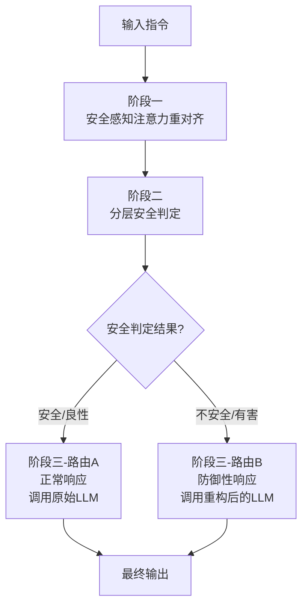

# Unified Defense for Large Language Models against Jailbreak and Fine-Tuning Attacks in Education

**ArXiv ID**: 2511.14423v1
**URL**: http://arxiv.org/abs/2511.14423v1
**提交日期**: 2025-11-18
**作者**: Xin Yi; Yue Li; Dongsheng Shi; Linlin Wang; Xiaoling Wang; Liang He
**引用次数**: NULL
使用模型: ep-20251112215738-bz78g

## 1. 核心思想总结
好的，这是一份根据您提供的标题、摘要和引言内容整理的简洁第一轮总结。

---

### 关于《Unified Defense for Large Language Models against Jailbreak and Fine-Tuning Attacks in Education》的第一轮总结

**Background (背景)**
大型语言模型（LLMs）正日益广泛地应用于教育场景。然而，这些模型普遍存在安全风险，容易受到“越狱攻击”（通过特定输入诱导有害输出）和“微调攻击”（通过恶意微调破坏模型安全对齐）的威胁。现有研究多集中于通用场景的安全评估，缺乏对教育领域独特安全需求的关注。

**Problem (问题)**
当前缺乏针对教育场景的系统性安全评估基准与方法。同时，现有的防御方案往往只能应对单一类型的攻击（如仅针对越狱攻击），难以在教育应用中实现对越狱和微调这两类攻击的统一、有效防御。

**Method (高层次方法)**
本文提出一个名为TSSF的三阶段防护框架。该框架的核心思想是：
1.  **安全感知注意力重对齐**：在模型内部将注意力引导至关键的不安全词汇，以恢复模型识别有害内容的能力。
2.  **分层安全判定**：通过聚合模型多个网络层的安全特征，来精准检测不安全指令。
3.  **防御驱动的双路由机制**：将安全查询与有害查询分离处理，确保对良性请求的正常响应，同时对有害请求进行防护性回复。

**Contribution (贡献)**
1.  **构建EduHarm基准**：创建了一个包含五种典型教育场景的安全-不安全指令对基准，为教育领域LLMs的系统化安全评估提供了标准工具。
2.  **提出统一防御框架TSSF**：首次设计了一种能同时有效防御越狱攻击和微调攻击的集成方案。
3.  **实证验证有效性**：通过在大规模越狱攻击策略和微调攻击数据集上的实验，证明TSSF能显著提升模型安全性，同时避免对良性查询的过度拒绝，并保持良性微调带来的性能提升。

---

## 2. 方法详解
好的，遵照您的要求，我将基于您提供的初步总结和论文方法章节的内容，详细阐述该论文《Unified Defense for Large Language Models against Jailbreak and Fine-Tuning Attacks in Education》所提出的TSSF框架的方法细节。

### **TSSF框架详细方法说明**

TSSF框架的核心目标是构建一个能够**统一防御**越狱攻击和微调攻击的机制，其创新之处在于不依赖于外部工具或模型，而是通过深入挖掘和利用LLM内部自身的“安全知识”来实现防御。整个流程分为三个核心阶段，其整体工作流程可概括为下图所示的协同过程：

下面，我们详细解析每个阶段的关键创新、算法细节和具体步骤。

#### **阶段一：安全感知注意力重对齐**

此阶段是针对**微调攻击**的关键防御措施，其目的是“清洗”或“修复”被恶意微调破坏的模型安全参数。

*   **关键创新与问题洞察**：
    *   **洞察**：作者认为，即使经过恶意微调，LLM内部关于“什么是有害内容”的底层知识（例如，“抄袭”是不好的）并未被完全抹除，只是模型在生成答案时，对这些关键安全概念的**注意力机制**被破坏或误导了。微调攻击可能让模型更关注如何满足用户的“指令部分”，而忽略指令中隐含的“有害部分”。
    *   **创新**：提出一种无需额外训练、基于提示工程的“注意力重对齐”技术。它不是修改模型权重，而是通过精心设计的系统提示，在推理阶段动态地引导模型的注意力焦点。

*   **算法/架构细节**：
    1.  **不安全词汇提取**：首先，从一个预定义的安全数据集中（如`BeaverTails`）提取出高频出现的、与有害性高度相关的**关键词或短语**，构成一个“不安全词汇库”（如：抄袭、作弊、仇恨言论、危险行为等）。
    2.  **重构系统提示**：将原始的系统提示（例如“你是一个有帮助的AI助手”）修改为一个**安全感知提示**。这个新提示会明确要求模型在执行用户指令前，先分析指令中是否包含或不包含“不安全词汇库”中的概念。
        *   **示例提示重构**：“在回答以下用户查询前，请首先分析查询是否涉及以下不安全概念：[此处插入不安全词汇库]。你的任务是识别潜在风险。”

*   **关键步骤**：
    1.  将带有安全感知提示和用户指令的文本输入给被攻击的模型。
    2.  模型在处理这个新提示时，会被强制要求先去“寻找”和“思考”这些不安全词汇。这个过程实际上**重新激活了模型内部与这些词汇相关的、未被完全破坏的安全神经元和注意力路径**。
    3.  经过这一步骤处理后，模型对于当前指令的安全状态有了一个初步的、内部的“重对齐”判断，为下一阶段的安全判定提供了更准确的内部特征表示。

#### **阶段二：分层安全判定**

此阶段是TSSF的“大脑”，负责对指令进行精准的安全与否判断。它利用LLM不同网络层所捕获的不同层次的信息来进行综合决策。

*   **关键创新与问题洞察**：
    *   **洞察**：LLM的深层网络层捕捉高级语义和意图，而浅层网络层捕捉词汇和语法特征。单一层的特征可能不足以应对复杂的、经过伪装的攻击（如越狱攻击）。将多层特征聚合起来，可以形成一个更鲁棒、更全面的安全视图。
    *   **创新**：提出一种**基于模型内部隐状态（Hidden States）的分层聚合判定机制**。这不同于传统方法只使用模型最终输出层的逻辑值（Logits）或最终答案。

*   **算法/架构细节**：
    1.  **特征提取**：对于给定的指令，在模型前向传播过程中，从**多个预选的关键网络层**（例如，中间层、后三分之一层、倒数第二层等）提取其隐状态。通常选取[CLS]标记或序列的均值/最大值作为该层的特征表示。
    2.  **特征聚合**：将这些来自不同层的特征向量进行聚合（例如，通过拼接或加权平均），形成一个**分层安全特征向量**。这个向量融合了从浅层到深层的丰富信息。
    3.  **安全分类器**：将一个轻量级的**分类器头**（如一个多层感知机MLP）应用于聚合后的特征向量上，从而输出一个最终的二元判定结果：**安全（Benign）** 或 **不安全（Harmful）**。这个分类器是在一个安全的指令数据集上预先训练好的。

*   **关键步骤**：
    1.  将经过阶段一处理后的指令输入模型，并在前向传播时拦截指定层的隐状态。
    2.  聚合这些隐状态，形成综合特征向量。
    3.  将综合特征向量输入预训练的安全分类器，得到判定概率。
    4.  根据概率阈值（如0.5）做出最终判定。

#### **阶段三：防御驱动的双路由机制**

此阶段是根据阶段二的判定结果，执行不同的响应策略，旨在**平衡安全性与实用性**。

*   **关键创新与问题洞察**：
    *   **洞察**：一个优秀的防御系统不能“一刀切”地拒绝所有可能有害的查询，否则会误伤大量良性请求，特别是在教育场景中，用户可能会询问一些敏感但属于正当学术探讨的问题。
    *   **创新**：设计了一种**条件路由机制**，根据查询的安全性质，动态选择不同的处理管道。

*   **算法/架构细节与关键步骤**：
    *   **路由A：安全/良性查询路径**
        *   **触发条件**：阶段二判定为“安全”。
        *   **处理流程**：指令将被直接发送给**原始的、未经过阶段一重对齐处理的模型**进行响应。
        *   **目的**：确保对良性指令的响应质量和效率最大化，完全不受防御框架的影响。这对于保持模型在教育任务（如答疑、辅导）上的性能至关重要。

    *   **路由B：不安全/有害查询路径**
        *   **触发条件**：阶段二判定为“不安全”。
        *   **处理流程**：指令将被发送给**已经过阶段一“安全感知注意力重对齐”处理的模型**进行响应。
        *   **目的**：利用被“修复”后的模型安全机制来生成响应。此时，模型不会遵从有害指令，而是会输出一个**防御性的、安全的回复**（例如，“我无法提供关于作弊的建议，这违反了学术诚信”）。

### **总结：整体流程与核心创新**

1.  **整体流程**：输入指令依次经过**注意力重对齐（修复模型安全焦点）** -> **分层安全判定（综合多层信息进行精准诊断）** -> **双路由响应（根据诊断结果分流处理）**，最终产生安全可控的输出。
2.  **核心创新**：
    *   **统一防御**：TSSF是首个明确针对越狱和微调两类攻击设计的集成式框架。
    *   **内在防御**：不依赖外部模型，通过挖掘和引导模型内在安全知识实现防护，更具通用性。
    *   **分层判定**：利用模型内部多层特征进行安全判定，比基于最终输出的方法更鲁棒。
    *   **实用性保障**：双路由机制有效避免了过度防御，确保了在教育应用中的可用性。

通过这三个阶段的紧密协作，TSSF框架实现了在不解体、不二次训练受害模型的情况下，有效提升其针对两种主流攻击的防御能力，同时保障了其在教育场景下的实用价值。

## 3. 最终评述与分析
好的，结合您提供的初步总结、方法详述以及论文结论部分，现为您整合生成一份最终的综合评估报告。

---

### **关于《Unified Defense for Large Language Models against Jailbreak and Fine-Tuning Attacks in Education》的最终综合评估**

#### 1) 总体摘要

本论文针对大型语言模型在教育领域应用中面临的两大核心安全威胁——**越狱攻击**和**微调攻击**，提出了一个名为**TSSF**的统一防御框架。该研究首先指出了现有安全评估与防御方案在教育场景下的不足，进而构建了专门的教育安全基准**EduHarm**。TSSF框架的创新性在于其**内生性防御**思路，它不依赖外部工具，而是通过三个协同阶段：**安全感知注意力重对齐**（修复被破坏的模型安全机制）、**分层安全判定**（聚合模型内部多层特征进行精准识别）和**防御驱动的双路由机制**（平衡安全性与实用性），实现了对两类攻击的有效统一防御。实验结果表明，TSSF能显著提升模型安全性，同时保持良好的良性任务性能，为LLMs在教育领域的**安全、可靠、实用化**部署提供了有力的解决方案。

#### 2) 优势

*   **针对性强与创新性突出**：首次明确提出并解决了教育领域LLMs面临的“越狱”与“微调”双重攻击的统一防御问题，填补了该细分领域的空白。
*   **内生性防御架构**：TSSF框架的核心优势在于其不依赖于任何外部模型或工具，仅通过挖掘和引导LLM自身的内部知识与机制（如注意力、隐状态）实现防御。这使得该方法具有**良好的通用性和较低的部署成本**，可适用于不同的LLM。
*   **防御性能卓越**：根据结论，TSSF在应对大规模、多样化的越狱攻击和强破坏性的微调攻击时，均表现出**显著高于基线方法的安全性能提升**，有效降低了有害内容生成率。
*   **实用性得到充分考虑**：框架设计的双路由机制是关键亮点。它确保了良性教育查询（如学术问答、知识讲解）能够**无损地通过原始模型处理**，从而最大程度地保留了LLM的教育辅助能力，避免了“过度防御”导致的可用性下降问题。
*   **基准贡献**：所构建的EduHarm基准为后续教育场景的LLM安全研究提供了**重要的评估工具和标准**，具有独立的学术价值。

#### 3) 劣势 / 局限性

*   **性能开销**：TSSF框架在推理阶段引入了额外的计算步骤（如阶段一的重对齐提示计算、阶段二的多层特征提取与分类），这不可避免地会带来**一定的响应延迟和计算资源开销**。对于需要高并发、低延迟的实时教育应用场景，此性能影响需在实际部署中仔细评估。
*   **泛化能力的未知性**：论文的实验验证主要基于其构建的EduHarm基准和选定的攻击方法。TSSF框架对于**未来可能出现的新型、未知攻击策略（尤其是高级越狱技术）的鲁棒性**，仍有待于更长时间和更广泛场景的考验。
*   **对良性微调的影响**：论文强调了TSSF在抵御恶意微调的同时，能“保持良性微调带来的性能提升”。然而，这一结论可能需要更细致的阐述。TSSF机制本身（特别是安全判定环节）是否可能在某些边缘情况下**误判并干扰为特定教育任务（如批判性思维训练）进行的良性微调**，是一个需要关注的问题。
*   **依赖内部特征的可解释性**：基于模型隐状态的安全分类器虽然有效，但其决策过程在一定程度上是一个“黑箱”。对于为何判定某个指令为有害的**可解释性**较弱，这在教育这种要求高度透明和公平的领域可能是一个小瑕疵。

#### 4) 潜在应用 / 影响

*   **教育科技产品落地**：该研究可直接应用于各类集成LLM的教育产品中，如**智能辅导系统、AI助教、个性化学习平台、自动评分系统**等，为这些产品的安全可靠部署保驾护航，减轻教育工作者和平台方的安全审核负担。
*   **推动负责任AI发展**：本研究为LLM在特定垂直领域（如教育、医疗、法律）的**“负责任AI”实践**提供了一个优秀范例。其“统一防御”的思想和内生性技术路径，可激励和启发其他领域针对特定风险设计定制化安全方案。
*   **制定行业安全标准**：论文的工作，特别是EduHarm基准和TSSF的评估方法，可以为**教育行业关于AI使用的安全规范与标准**的制定提供技术参考和依据。
*   **未来研究方向**：该框架为进一步研究指明了方向。例如，可以探索如何**优化TSSF的计算效率**以降低延迟；或者将类似的“内生性防御”理念应用于防御其他类型的攻击（如后门攻击、数据投毒等）；此外，如何增强防御系统的**可解释性**，使其决策更透明，也是一个有价值的后续课题。

---

# 附录：论文图片

## 图 1

## 图 2

## 图 3

## 图 4

## 图 5

## 图 6

## 图 7

## 图 8

## 图 9

