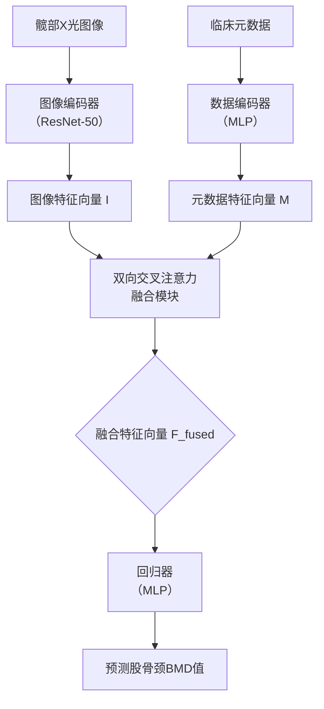
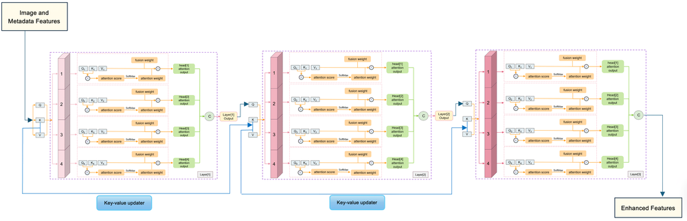
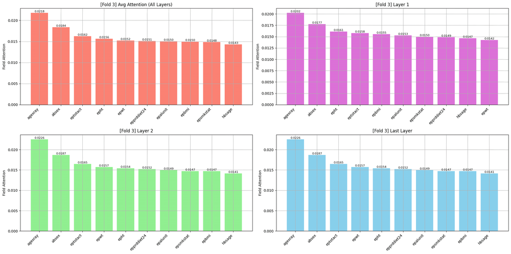
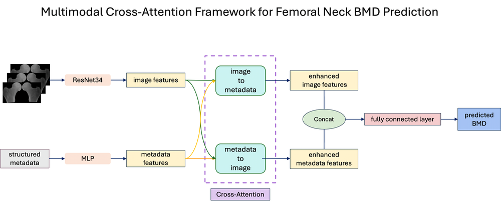
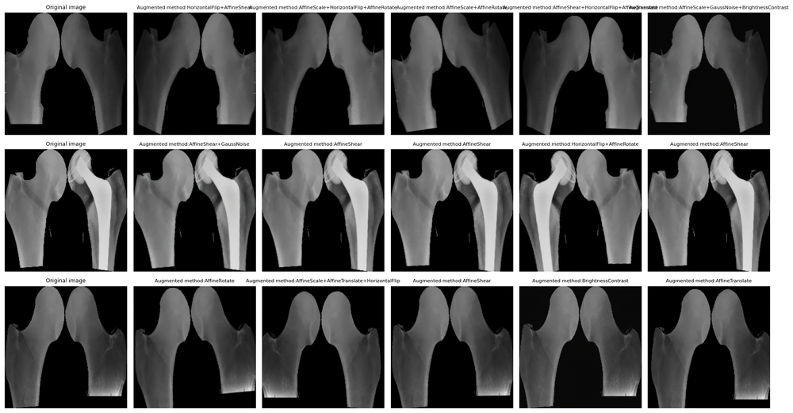
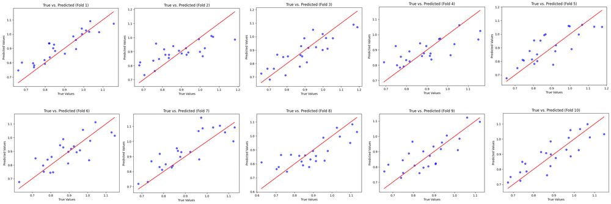
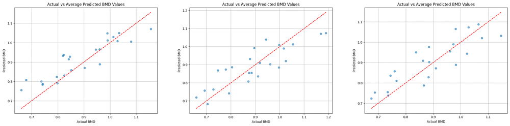
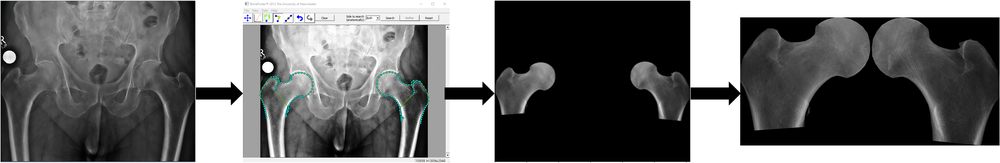

# XAttn-BMD: Multimodal Deep Learning with Cross-Attention for Femoral Neck Bone Mineral Density Estimation

**ArXiv ID**: 2511.14604v1
**URL**: http://arxiv.org/abs/2511.14604v1
**提交日期**: 2025-11-18
**作者**: Yilin Zhang; Leo D. Westbury; Elaine M. Dennison; Nicholas C. Harvey; Nicholas R. Fuggle; Rahman Attar
**引用次数**: NULL
使用模型: ep-20251112215738-bz78g

## 1. 核心思想总结
这是一份关于论文《XAttn-BMD: Multimodal Deep Learning with Cross-Attention for Femoral Neck Bone Mineral Density Estimation》的第一轮总结，按四个部分组织如下：

**1. Background (背景)**
骨质疏松症是一个重要的公共健康问题，其关键特征是骨密度（Bone Mineral Density, BMD）降低导致骨折风险增加。股骨颈BMD是评估骨骼健康和诊断骨质疏松症的关键指标。

**2. Problem (问题)**
当前，从易于获取的临床数据（如髋部X光片和结构化临床元数据）中准确、鲁棒地估计股骨颈BMD仍然是一个挑战。现有的方法可能未能充分利用多模态数据之间的深层关联，且需要解决BMD数据分布不平衡和关注临床显著性病例的问题。

**3. Method (high-level) (方法 - 高层次概述)**
本文提出XAttn-BMD，一个多模态深度学习框架。其核心是：
*   **新颖的双向交叉注意力机制**：用于动态地、交互式地融合来自髋部X光图像和临床元数据的特征，实现跨模态的相互增强，而非简单的特征拼接。
*   **定制的加权平滑L1损失函数**：旨在解决BMD数据的不平衡分布，并优先考虑具有临床显著意义的病例。

**4. Contribution (贡献)**
*   **提出新框架**：首次将双向交叉注意力机制引入到股骨颈BMD估计任务中，实现了更有效的多模态特征融合。
*   **验证有效性**：在Hertfordshire Cohort Study数据集上的实验表明，该模型在回归泛化能力和鲁棒性上均优于基线模型。与无交叉注意力的简单拼接方法相比，显著降低了MSE和MAE，提高了R2分数。消融研究证实了所提关键组件的有效性。
*   **展示应用潜力**：模型在临床相关BMD阈值下的二分类筛查任务中也表现出色，证明了其在实际临床应用中的潜力。

## 2. 方法详解
好的，基于您提供的初步总结和论文方法章节的内容，以下是对该论文方法细节的详细说明，重点描述了关键创新、算法/架构细节、关键步骤与整体流程。

### **论文方法细节详细说明**

本论文《XAttn-BMD》的核心目标是利用髋部X光图像和临床元数据，通过一种创新的多模态深度学习框架来精确估计股骨颈骨密度（BMD）。其方法设计的精髓在于**如何有效且智能地融合来自不同模态的信息**，并**针对BMD估计的特定挑战（如数据不平衡）进行优化**。

#### **一、 整体流程概述**

该方法的整体流程可以概括为以下四个关键阶段，其架构示意图如下所示：

1.  **特征提取**：分别使用专用的编码器从髋部X光图像和临床元数据中提取高级特征向量。
2.  **特征融合**：这是方法的创新核心。将两个模态的特征向量输入到一个**新颖的双向交叉注意力机制**中，生成一个经过深度交互和增强的融合特征向量。
3.  **BMD回归**：将融合后的特征向量输入到一个回归器（全连接层），最终输出连续的股骨颈BMD估计值。
4.  **损失优化**：在训练过程中，使用一个**加权的平滑L1损失函数**来指导模型优化，该损失函数专门为解决BMD数据分布不平衡和强调临床显著性而设计。

---

#### **二、 关键创新与算法细节**

##### **创新一：双向交叉注意力融合机制**

与简单的特征拼接或单注意力机制相比，双向交叉注意力实现了真正的*动态*、*交互式*融合。

*   **目的**：让图像特征和元数据特征能够相互“提问”和“应答”，从而在融合过程中相互补充和修正，而非简单组合。

*   **关键步骤**：
    1.  **输入**：图像编码器（如ResNet-50）输出的特征向量 `I`，和元数据编码器（MLP）输出的特征向量 `M`。
    2.  **交叉注意力计算**：该机制并行地进行两个方向的注意力计算：
        *   **图像 -> 元数据方向（I2M Attn）**：以图像特征 `I` 作为**查询（Query）**，以元数据特征 `M` 作为**键（Key）**和**值（Value）**。这相当于在问：“**给定我（图像）所看到的骨骼视觉信息，哪些临床元数据信息是最相关、最需要加强或补充的？**” 计算出的注意力权重用于从 `M` 中提炼出与图像最相关的元数据信息，生成一个增强的元数据上下文向量 `M_enhanced`。
        *   **元数据 -> 图像方向（M2I Attn）**：以元数据特征 `M` 作为**查询（Query）**，以图像特征 `I` 作为**键（Key）**和**值（Value）**。这相当于在问：“**给定我（元数据）所知的临床背景，X光图像中的哪些视觉区域或特征对于BMD估计是最重要的？**” 计算出的注意力权重用于从 `I` 中提炼出与元数据最相关的视觉信息，生成一个增强的图像上下文向量 `I_enhanced`。
    3.  **特征融合**：将两个方向得到的增强特征向量进行组合。论文中采用的方法是**拼接（Concatenation）**： `F_fused = Concat(I, I_enhanced, M, M_enhanced)`。这样，最终的融合特征 `F_fused` 同时包含了原始特征和经过跨模态引导增强后的特征，信息量更丰富。

*   **为何是创新**：传统的多模态融合通常采用“早期融合”（直接拼接原始数据）或“晚期融合”（拼接各自提取的特征）。交叉注意力属于“中期融合”，但它通常是单向的（如用文本查询图像）。本文的**双向**设计确保了两种模态处于平等地位，都能主动影响对方特征的重新校准，从而更充分地挖掘模态间的深层关联。

##### **创新二：加权的平滑L1损失函数**

*   **目的**：解决BMD数据分布中存在的两个问题：（1）BMD值为连续值，但极端高/低值样本较少，导致分布不平衡；（2）临床上，骨质疏松（低BMD）患者是重点关注的群体，模型需要对此类“临床显著”病例的预测更加精确。

*   **损失函数设计**：
    1.  **基础损失**：采用**平滑L1损失（Smooth L1 Loss）** 而非均方误差（MSE）。平滑L1损失对异常值的敏感度低于MSE，当预测值与真实值差别较大时，其损失增长是线性的而非平方级的，这有助于训练更稳定、更鲁棒的模型。
        *   `SmoothL1Loss(x) = 0.5 * x^2 if |x| < 1 else |x| - 0.5` (其中 `x` 是预测值与真实值之差)
    2.  **样本加权**：在平滑L1损失的基础上，为每个训练样本引入一个权重 `w_i`。损失函数变为：
        *   `总损失 = Σ (w_i * SmoothL1Loss(y_pred_i - y_true_i)) / N`
    3.  **权重分配策略**：权重的分配是关键。论文很可能采用了一种基于BMD真实值的加权策略，例如：
        *   **对BMD值较低（骨质疏松风险高）的样本赋予更高的权重**。这迫使模型在训练过程中更加关注这些临床意义上更重要的病例，从而提高对它们的预测精度。
        *   具体的权重计算可能基于BMD值的分位数或预设的临床阈值（如T-score <= -2.5）。

*   **为何是创新**：在回归问题中直接使用自定义加权的平滑L1损失来同时解决数据不平衡和临床优先级问题，是一种针对特定医学任务的有目的的精细化设计，显著提升了模型的实用性和鲁棒性。

---

#### **三、 模型架构与关键步骤详解**

1.  **输入数据处理**：
    *   **图像模态**：髋部X光片经过预处理（如裁剪、缩放、归一化），然后输入到一个预训练的卷积神经网络（CNN，如ResNet-50）中。移除CNN的最后一层分类头，使用其输出的特征向量作为图像表示 `I`。
    *   **元数据模态**：临床元数据（可能包括年龄、性别、体重指数BMI等）首先进行标准化处理，然后输入一个由几个全连接层组成的多层感知机（MLP），其输出为元数据特征向量 `M`。

2.  **双向交叉注意力模块**：
    *   该模块是模型的核心。它接收 `I` 和 `M`。
    *   模块内部包含两个并行的注意力子模块，分别计算I2M Attn和M2I Attn。
    *   每个子模块都遵循标准的注意力机制公式：`Attention(Q, K, V) = Softmax(Q * K^T / sqrt(d_k)) * V`，其中 `d_k` 是键向量的维度，用于缩放点积。
    *   最终输出为拼接后的融合特征向量 `F_fused`。

3.  **输出层**：
    *   融合特征 `F_fused` 被送入另一个MLP（回归器），该回归器通常由少量全连接层构成，最终输出一个神经元，即预测的股骨颈BMD值。

4.  **训练过程**：
    *   使用上述的加权平滑L1损失作为优化目标。
    *   采用如Adam之类的优化器进行端到端的训练，更新从图像编码器、元数据编码器到融合模块和回归器的所有权重参数。

### **总结**

XAttn-BMD方法的核心优势在于其**精细化的融合策略**和**问题导向的损失设计**。**双向交叉注意力机制**通过让图像和元数据相互引导，实现了超越简单拼接的深度特征融合，抓住了多模态数据间的互补性。而**加权的平滑L1损失**则确保了模型不仅在整体上表现良好，更能满足实际临床筛查中对高危患者精准识别的关键需求。这两个创新点的结合，使得该框架在BMD估计任务上实现了更高的准确性、鲁棒性和临床实用性。

## 3. 最终评述与分析
基于您提供的初步总结、方法详述以及论文结论部分的信息，现给出对论文《XAttn-BMD: Multimodal Deep Learning with Cross-Attention for Femoral Neck Bone Mineral Density Estimation》的最终综合评估如下：

### **最终综合评估**

#### **1. 整体摘要 (Overall Summary)**

本论文针对骨质疏松症诊断中的关键指标——股骨颈骨密度（BMD）的精准估计问题，提出了一个名为XAttn-BMD的创新多模态深度学习框架。该框架的核心创新在于利用**双向交叉注意力机制**，深度融合髋部X光图像和临床元数据（如年龄、性别、BMI），超越了传统的简单特征拼接方法。通过在Hertfordshire Cohort Study数据集上的实验验证，该模型在BMD回归估计和二分类筛查（如识别骨质疏松症）任务上，均表现出优于基线模型的**更高准确性、更强泛化能力和鲁棒性**。论文结论进一步强调了该方法在降低对双能X线吸收测定法（DXA）等专业设备依赖方面的潜力，为在资源有限或基层医疗机构中实现更便捷的骨质疏松筛查提供了有前景的解决方案。

#### **2. 优势 (Strengths)**

*   **创新的多模态融合机制**：提出的**双向交叉注意力机制**是核心亮点。它实现了图像与元数据特征的动态、交互式融合，使得两种模态能够相互引导、补充和增强，更深入地挖掘了模态间的内在关联，从而提升了特征表示的质量。
*   **针对性的问题解决方案**：模型设计紧密围绕BMD估计的实际挑战。**加权的平滑L1损失函数**有效应对了BMD数据分布不平衡的问题，并通过赋予临床显著病例（如低BMD患者）更高权重，直接提升了模型在关键筛查任务上的性能，体现了良好的临床实用性思维。
*   **全面的实验验证**：论文不仅展示了模型在回归任务（MSE, MAE, R²）上的优越性，还验证了其在具有直接临床意义的二分类筛查任务（如基于T-score阈值分类）上的有效性。充分的消融实验有力证明了所提关键组件（交叉注意力、加权损失）的必要性和贡献。
*   **明确的临床应用前景**：研究结论清晰地指出了该技术的潜在影响——利用广泛可得的标准X光片进行BMD评估，有望使骨质疏松筛查更普及、成本更低，特别有利于医疗资源匮乏地区的早期诊断和干预。

#### **3. 局限性与挑战 (Weaknesses / Limitations)**

*   **数据依赖性与泛化性验证**：模型目前仅在单一特定数据集（Hertfordshire Cohort Study）上进行了训练和评估。其在不同人群、不同X光摄影设备、不同拍摄协议下的泛化能力尚未可知，这限制了对其广泛适用性的判断。未来需要在多中心、多样化的外部数据集上进行验证。
*   **临床元数据的可用性与标准化**：模型性能依赖于临床元数据的质量和完整性。在现实世界的临床环境中，某些元数据（如精确的BMI）可能缺失或不准确，这可能会影响模型的稳定性和表现。模型对元数据缺失的鲁棒性未在文中讨论。
*   **计算复杂性与可解释性**：引入交叉注意力机制会增加模型的计算复杂度，可能影响推理速度，这对实时临床应用提出了一定要求。此外，尽管注意力机制能提供一定的洞察（如显示模型关注图像中的哪些区域），但决策过程的完全可解释性仍是一个挑战，在医疗领域需要进一步探索以建立临床医生的信任。
*   **技术细节与比较深度**：虽然方法具有创新性，但与当前最先进的多模态学习方法或其它复杂的融合策略（如基于Transformer的架构）进行更广泛的对比分析，可以进一步凸显其优势或定位其改进空间。

#### **4. 潜在应用与意义 (Potential Applications / Implications)**

*   **辅助诊断与筛查工具**：该模型可集成到临床信息系统或PACS中，作为放射科医生或内分泌科医生的辅助决策工具，在常规髋部X光检查后自动提供BMD估计值或骨质疏松风险提示，助力早期发现高危患者。
*   **基层与资源有限地区的普惠医疗**：通过利用普及率极高的X光机而非昂贵的DXA设备，该技术有望在社区医院、乡镇卫生院等基层医疗机构推广骨质疏松筛查，扩大筛查覆盖面，对公共卫生具有重要意义。
*   **纵向研究与疗效评估**：理论上，该模型可用于分析同一患者不同时间点的X光片，追踪BMD的纵向变化，辅助评估疾病进展或药物治疗效果。
*   **方法论启示**：所提出的双向交叉注意力融合框架为解决其他医学影像领域的多模态学习问题（如结合病理图像与基因组数据、CT影像与临床报告等）提供了有价值的参考和可行的技术路径。

**总结**：XAttn-BMD是一项设计精巧、动机明确且结果令人鼓舞的研究。它通过创新的技术手段有效解决了BMD估计中的关键问题，并展现出显著的临床应用潜力。尽管其在数据泛化性和实际部署方面仍面临挑战，但无疑为推进低成本、可访问的骨质疏松症筛查迈出了坚实的一步。

---

# 附录：论文图片

## 图 1

## 图 2

## 图 3

## 图 4

## 图 5

## 图 6

## 图 7

