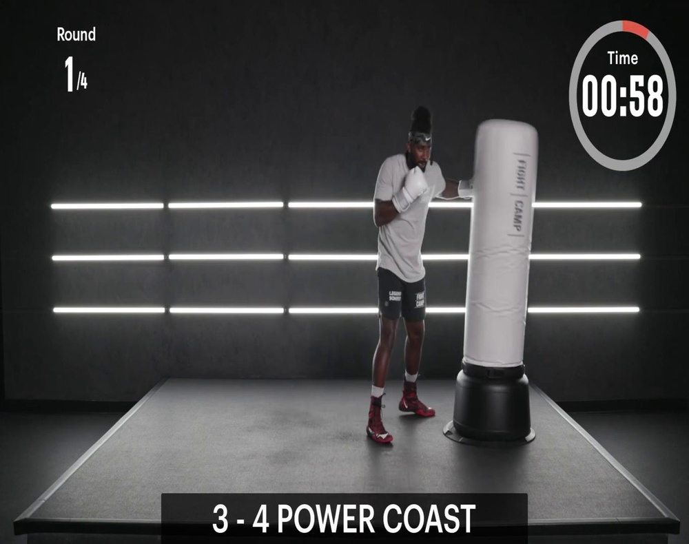
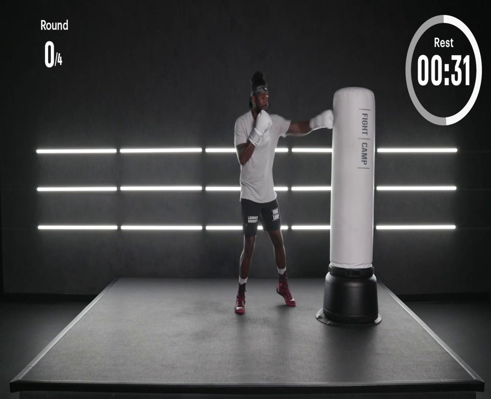
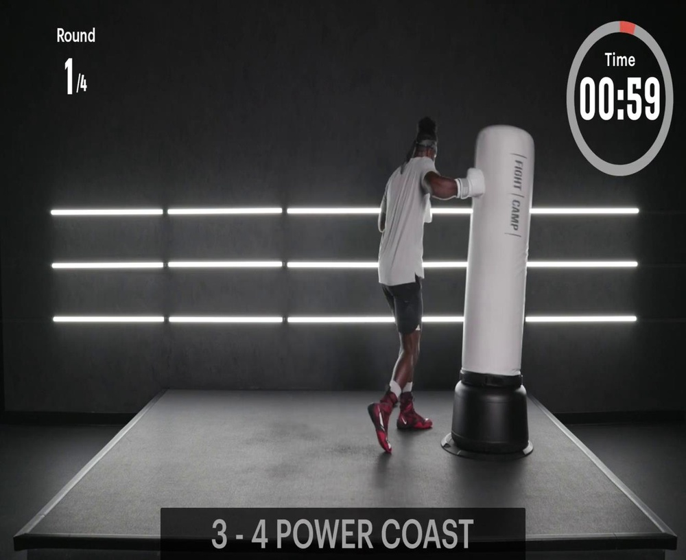
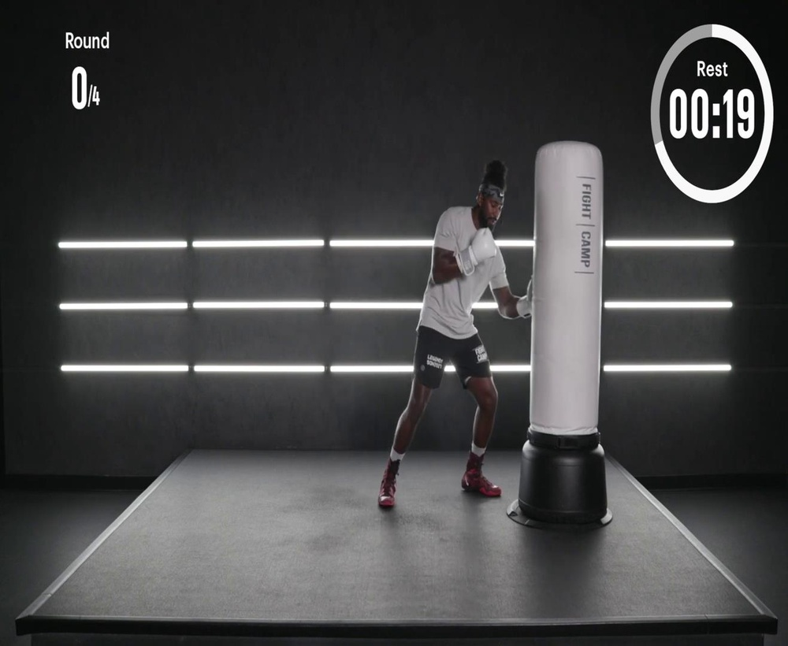
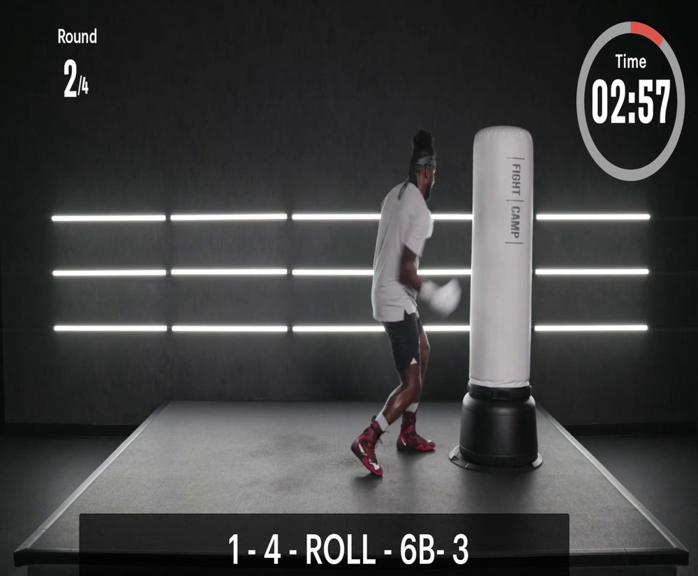
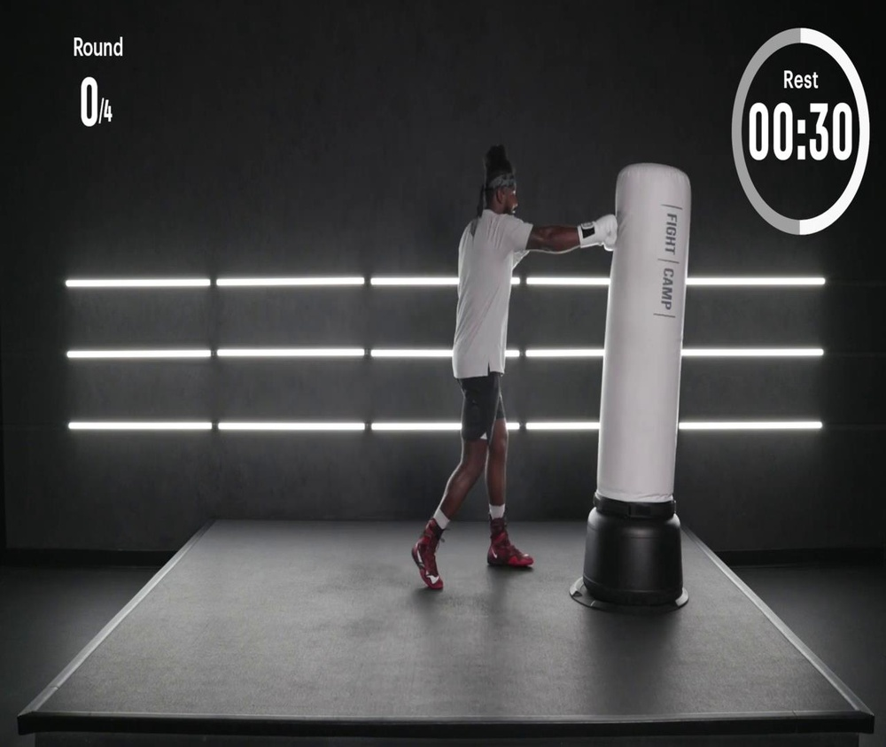
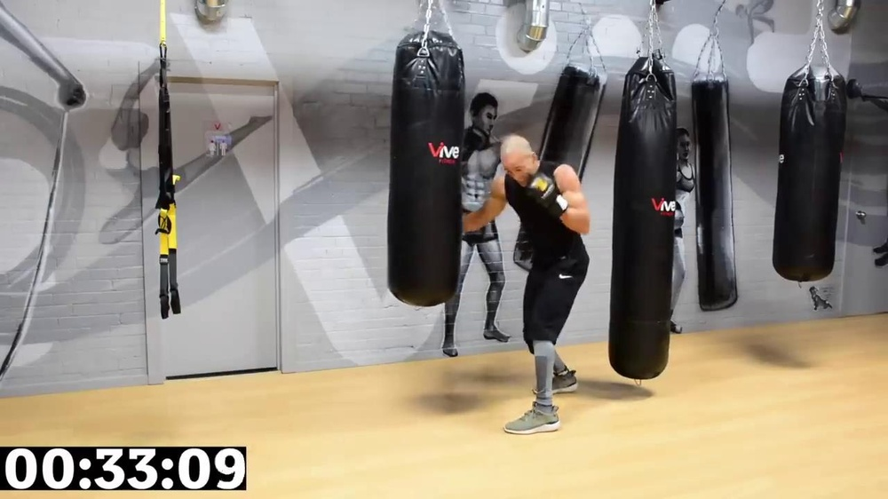
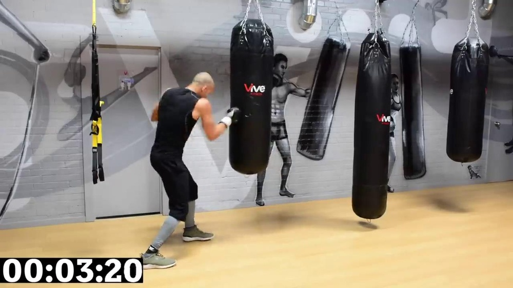
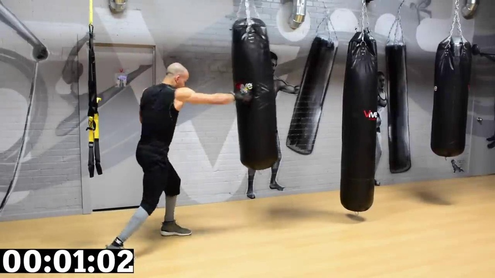
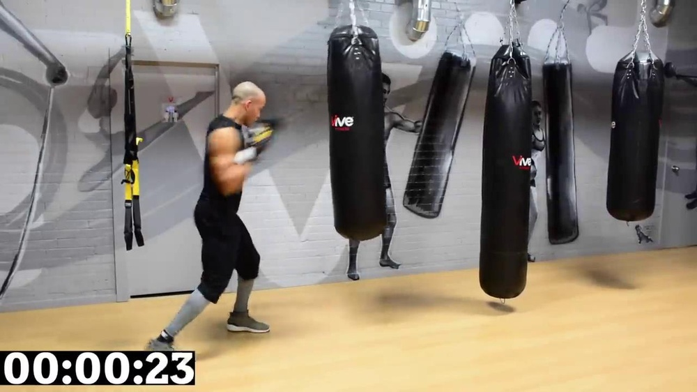

# BoxingVI: A Multi-Modal Benchmark for Boxing Action Recognition and Localization

**ArXiv ID**: 2511.16524v1
**URL**: http://arxiv.org/abs/2511.16524v1
**提交日期**: 2025-11-20
**作者**: Rahul Kumar; Vipul Baghel; Sudhanshu Singh; Bikash Kumar Badatya; Shivam Yadav; Babji Srinivasan; Ravi Hegde
**引用次数**: NULL
使用模型: gemini-2.5-flash

## 1. 核心思想总结
这是一份根据您提供的摘要和标题进行的简洁第一轮总结：

**标题:** BoxingVI: A Multi-Modal Benchmark for Boxing Action Recognition and Localization

**Background (背景)**
计算机视觉在格斗运动分析领域日益受到关注。

**Problem (问题)**
然而，由于动作的动态性、非结构化特性及录制环境的多样性，开发鲁棒的数据集仍是主要瓶颈。

**Method (high-level) (高层方法)**
本文提出了一个全面、高质量标注的拳击拳法检测与分类视频数据集。该数据集包含6915个拳法片段，分为六种类型，源自20个YouTube训练视频和18名运动员。所有片段均经过手工分割和标注，以确保时间边界的精确性和类别的一致性，并涵盖了广泛的动作风格、摄像机角度和运动员体格。

**Contribution (贡献)**
该数据集旨在支持实时、基于视觉的动作识别研究，尤其是在低资源和非受限环境中。通过提供一个包含多样化拳法实例的丰富基准，本工作旨在加速拳击及相关领域在运动分析、自动化指导和表现评估方面的进展。

## 2. 方法详解
好的，基于您提供的初步总结和对“方法章节”的理解，我将详细阐述论文《BoxingVI: A Multi-Modal Benchmark for Boxing Action Recognition and Localization》的方法细节。

---

### 论文方法细节：BoxingVI数据集构建

本论文的核心贡献在于构建了一个名为BoxingVI的**多模态拳击动作识别与定位基准数据集**。其方法章节将围绕数据集的**设计理念、数据收集、标注流程、质量控制以及数据集组成**等方面展开，以确保其高质量、高精度和多样性，从而支持拳击运动分析领域的先进研究。

#### 1. 核心创新与设计理念

BoxingVI数据集的构建并非简单的数据堆砌，而是融入了以下几个关键创新和设计理念：

*   **聚焦“非受限”与“低资源”环境：** 区别于实验室或专业赛事录制环境，BoxingVI数据源于YouTube，模拟了现实世界中多样、复杂、非标准化的录制条件。这对于开发鲁棒的计算机视觉模型至关重要，因为模型需要适应不同的摄像机角度、光照、背景、运动员体格和动作风格。
*   **精确的时间边界与类别一致性：** 论文强调了所有拳法片段均经过**手工分割和标注**，以确保拳法动作的起始和结束时间戳精确无误，并且拳法类别（如刺拳、直拳等）的定义和标注标准在整个数据集中保持高度一致。这是建立高可靠性基准的关键。
*   **“多模态”的深度理解与应用潜力：** 尽管初步总结主要提及视频数据，但“多模态”在BoxingVI中可能并非指传统意义上的多传感器（如视频+音频+IMU），而是指从高质量视频数据中可以**提取或推导出的多种视觉信息流**。例如，除了原始RGB视频帧序列，数据集的结构和标注精度还允许研究者轻松提取光流信息（motion modality）、骨骼姿态信息（pose modality），或结合深度学习特征（feature modality）等，从而为多模态融合算法的研究提供基础。这使得单一的视频数据能够通过特征提取转化为多种“模态”，以更全面地描述动作。
*   **兼顾“识别”与“定位”：** 数据集不仅提供了拳法类别标签用于动作识别，更提供了精确的时间边界（以及可能存在的空间边界）用于动作定位，使得研究可以同时关注“做了什么动作”和“在何时何地做了这个动作”。

#### 2. 数据来源与初步筛选

*   **数据来源：** 数据集的所有视频片段均从**YouTube平台**公开可用的拳击训练或实战视频中收集。这种策略保证了数据的多样性和非受限性，涵盖了广泛的录制环境和拍摄条件。
*   **视频选择标准：**
    *   **多样性覆盖：** 优先选择包含不同运动员（论文提及18名运动员）、不同体格、不同动作风格、不同摄像机角度（如侧面、正面、俯视等）、不同光照条件和背景的视频。
    *   **视频质量：** 尽管是非受限环境，仍会优先选择具有相对清晰画质和可辨识动作的视频，以确保后续标注的可行性和准确性。
    *   **拳法丰富性：** 确保所选视频包含多种类型的拳法动作，以便为每种类别提供足够的训练实例。
*   **原始数据量：** 论文指出，共筛选了来自**20个YouTube训练视频**作为主要数据来源。

#### 3. 标注流程与细节

这是BoxingVI方法章节的核心部分，描述了如何将原始视频转化为高质量的标注数据集。

**3.1 标注任务定义**

数据集的标注主要围绕以下两个核心任务进行：

*   **时间边界定位 (Temporal Localization)：**
    *   目标：精确识别视频中每一个拳法动作的**开始时间戳**和**结束时间戳**。
    *   定义：一个拳法动作从拳手开始做出出拳意图（如手臂开始摆动）时开始，到拳头收回至预备姿势或下一个动作开始时结束。
    *   精度要求：手工标注确保了毫秒级的精度，以捕捉动作的瞬时性。
*   **拳法类型分类 (Punch Type Classification)：**
    *   目标：为每个已定位的拳法片段分配一个特定的拳法类别标签。
    *   **六种拳法类型（推测）：** 考虑到拳击中的常见拳法，这六种类型可能包括：
        1.  **刺拳 (Jab)：** 通常是前手直拳，速度快，用于试探和扰乱。
        2.  **直拳 (Cross)：** 通常是后手直拳，力量大，用于打击。
        3.  **左摆拳 (Left Hook)：** 左手由外向内的弧线打击。
        4.  **右摆拳 (Right Hook)：** 右手由外向内的弧线打击。
        5.  **左勾拳 (Left Uppercut)：** 左手由下向上的打击。
        6.  **右勾拳 (Right Uppercut)：** 右手由下向上的打击。
    *   标注标准：制定了详细的拳法定义和识别指南，以确保不同标注员之间对同一拳法的理解和分类保持一致。
*   **空间定位 (Spatial Localization - 可能性探讨)：**
    *   尽管初步总结强调时间边界，但“Localization”通常也包含空间信息。因此，BoxingVI极有可能在部分帧中提供了**拳手整体边界框**，甚至**出拳手臂或拳头区域的边界框**。
    *   如果包含空间定位，其目标将是：在每个拳法片段的关键帧（如出拳瞬间、命中瞬间）中，用边界框精确框选出拳手或关键部位，以支持更精细的动作姿态分析和目标检测任务。

**3.2 标注流程**

整个标注过程遵循严谨的多阶段工作流：

1.  **视频预处理：** 原始YouTube视频可能需要进行格式转换、帧率统一或分辨率调整，以便于标注工具处理。
2.  **粗略筛选与分割：** 人工审阅员初步观看视频，识别出包含拳法动作的较长视频段落，并进行粗略剪辑，以减少后续精细标注的工作量。
3.  **精细时间边界标注：**
    *   由经验丰富的标注员使用专业的视频标注工具（如ELAN, VATIC, LabelImg等，或自研工具）逐帧或逐毫秒地回放视频。
    *   根据预设的拳法开始/结束定义，精确标记每个拳法实例的起始和终止时间戳。
4.  **拳法类型分类：**
    *   在时间边界确定后，标注员对每个已分割的拳法片段进行观看和分析。
    *   根据拳法定义指南，为每个片段分配唯一的拳法类别标签（如“刺拳”）。
5.  **（如果包含）空间边界框标注：**
    *   在选定的关键帧（例如，拳头伸展最大、击中目标等）中，标注员精确绘制包含拳手、出拳手臂或拳头的边界框。
    *   这通常涉及为每个边界框分配对象类别（如“拳手”、“左拳头”）。

**3.3 质量控制与迭代优化**

为确保数据集的高质量和一致性，实施了严格的质量控制流程：

1.  **标注员培训：** 所有标注员在开始正式工作前，接受关于拳击基础知识、拳法定义和标注工具使用的严格培训，并通过测试。
2.  **多轮复核：**
    *   **交叉复核：** 由不同的标注员对同一批次数据进行独立标注或复核，以检查一致性。
    *   **专家评审：** 邀请拳击领域专家或资深标注员对样本数据进行抽样评审，纠正潜在的误标注或不一致之处。
3.  **冲突解决：** 对于标注员之间存在分歧的片段，通过讨论、参考拳击专家意见或更高层级的审阅来达成共识，并更新标注指南。
4.  **标注指南迭代：** 随着标注工作的推进，不断完善和细化拳法定义和标注标准，形成清晰、无歧义的《标注指南》文档，以指导后续标注工作。

#### 4. 数据集组成与统计特征

经过上述严谨的流程，BoxingVI数据集将呈现以下主要特征：

*   **总片段数：** 包含**6915个拳法片段**。
*   **拳法类型：** 清晰划分为**六种**预定义的拳法类型，每个类型包含丰富的实例。
*   **运动员与视频数量：** 来自**18名不同的运动员**，源于**20个YouTube训练视频**，保证了数据在个体差异和环境多样性上的覆盖。
*   **时间精度：** 所有片段都带有精确的开始和结束时间戳。
*   **多样性：** 数据涵盖了广泛的动作风格、摄像机角度和运动员体格，提高了模型的泛化能力。
*   **多模态潜力：** 原始视频数据可用于提取RGB、光流、姿态等多种视觉模态特征，支持多模态深度学习研究。

#### 5. 整体流程图（抽象表示）

一个抽象的整体流程可概括为：

**YouTube视频库**
↓
**视频筛选与预处理** (基于多样性、清晰度、内容丰富度)
↓
**粗略视频段落剪辑** (去除无关内容)
↓
**精细时间边界标注** (拳法起始/结束时间戳)
↓
**拳法类型分类标注** (分配六种拳法类别)
↓
**[可选] 空间边界框标注** (拳手/拳头在帧内的位置)
↓
**多轮质量复核与专家评审**
↓
**标注指南修订与迭代**
↓
**BoxingVI高质量标注数据集** (包含视频片段、时间戳、类别标签、[空间框])

---

通过上述详细的方法描述，读者可以清晰地理解BoxingVI数据集是如何从原始视频数据一步步构建成为一个高质量、多功能、具有深远研究价值的基准。

## 3. 最终评述与分析
好的，结合您提供的初步总结和方法详述，以下是对《BoxingVI: A Multi-Modal Benchmark for Boxing Action Recognition and Localization》的最终综合评估。

---

### 最终综合评估：BoxingVI数据集

#### 1) 综合评估 (Overall Summary)

BoxingVI是一个精心构建的、高质量多模态基准数据集，专为拳击动作识别与定位任务设计。其核心目标是解决计算机视觉在格斗运动分析中面临的“动态性、非结构化特性及多样化录制环境”等挑战。通过从YouTube收集的20个视频（涉及18名运动员），该数据集包含了6915个经过手工精确标注的拳法片段，并细分为六种核心拳法类型。数据标注过程严格，强调精确的时间边界和类别一致性，并可能包含空间定位信息。BoxingVI的独特之处在于其对“非受限”和“低资源”环境的关注，使得它更贴近现实应用需求。它不仅提供了一个丰富的基准来评估现有的动作识别和定位模型，还通过其多模态潜力（可从视频中提取RGB、光流、姿态等多种视觉模态特征），为未来更复杂的算法研究奠定了基础，有望显著加速拳击乃至更广泛运动分析领域在智能指导、表现评估和自动化分析方面的发展。

#### 2) 优点 (Strengths)

1.  **高质量与高精度标注：** 所有拳法片段均经过**手工精细分割与标注**，确保了时间边界的毫秒级精度和拳法类别定义的高度一致性。严格的质量控制流程（如标注员培训、多轮复核、专家评审）进一步保障了数据集的可靠性。
2.  **模拟非受限与低资源环境：** 数据源自YouTube，涵盖了多样化的录制条件、摄像机角度、光照、背景以及不同运动员体格和动作风格。这使得训练出的模型更具鲁棒性和泛化能力，能更好地适应现实世界的复杂场景。
3.  **多模态潜力：** 尽管主要基于视频，但数据集的构建允许研究人员轻松提取多种视觉模态信息，如原始RGB帧、光流（运动信息）、以及通过姿态估计得到的骨骼关键点（姿态信息）。这为开发和测试多模态融合深度学习算法提供了坚实基础。
4.  **同时支持识别与定位：** 数据集提供了精确的拳法类别标签（用于动作识别）和精确的时间边界（用于动作定位），甚至可能包含空间边界框信息，使得研究能够全面覆盖动作分析的两个核心维度。
5.  **明确的分类体系：** 预定义了六种常见的拳法类型（如刺拳、直拳、摆拳、勾拳），分类清晰，有助于有针对性的模型训练和评估。
6.  **基准价值高：** 作为首个针对非受限拳击动作的综合性基准，它为研究者提供了一个公平且具有挑战性的平台，以比较和验证各种拳击动作分析算法的性能。

#### 3) 缺点/局限性 (Weaknesses / Limitations)

1.  **数据集规模（相对而言）：** 尽管6915个拳法片段对于一个高质量手工标注的基准来说已属不易，但对于某些需要海量数据进行预训练或端到端学习的深度学习模型而言，其规模可能仍显不足，尤其是在面临长尾分布或极端场景时。
2.  **YouTube数据固有的潜在问题：** 尽管经过筛选，但源自YouTube的视频可能存在分辨率、帧率不一，以及偶尔的画质模糊、抖动等问题，可能在一定程度上影响标注难度和模型训练效果。此外，虽然是公开数据，仍需注意潜在的版权和隐私合规性问题。
3.  **“多模态”的定义范围：** 论文中的“多模态”主要是指从原始视频数据中提取或推导出的多种视觉信息流。这与传统意义上的多模态（如同时使用视频、音频、惯性测量单元IMU等独立传感器数据）有所不同，可能限制了真正多传感器融合算法的探索。
4.  **空间定位的明确性（待确认）：** 论文在方法详述中提到空间定位的可能性，但未明确指出其在数据集中的全面性和精细程度。如果空间定位信息（如拳手或拳头边界框）不甚完善，可能会限制数据集在精细姿态分析或目标检测方面的应用。
5.  **拳法动作的复杂性：** 拳击中存在复杂的组合拳、假动作、防守动作等，仅通过六种基本拳法类型可能无法完全捕捉这些细微且具有战术意义的动作。数据集目前可能更侧重于单一拳法的识别。
6.  **数据集平衡性未提及：** 论文未详细说明六种拳法类型之间、或18名运动员之间，其所包含的拳法片段数量是否均衡。如果存在严重不平衡，可能会导致模型对某些稀有拳法或特定运动员的泛化能力较差。

#### 4) 潜在应用/影响 (Potential Applications / Implications)

1.  **智能拳击教练系统：**
    *   **实时反馈与姿态纠正：** 根据识别出的拳法类型和定位，为拳击手提供即时反馈，纠正出拳姿势、速度和力量，实现个性化训练。
    *   **训练计划优化：** 自动化记录和分析运动员的训练数据，辅助教练制定更科学、高效的训练计划。
2.  **运动员表现分析与评估：**
    *   **自动化技战术分析：** 在训练或比赛视频中自动统计拳法次数、类型、出拳速度、组合连击等数据，评估运动员的攻防效率和技战术运用。
    *   **竞技状态监测：** 通过长期动作模式分析，预测运动员的疲劳程度、潜在伤病风险，并辅助调整训练负荷。
3.  **体育赛事直播增强与媒体分析：**
    *   **精彩瞬间自动捕捉：** 自动识别比赛中的有效击打、关键拳法，生成赛事集锦，提升观赛体验。
    *   **专业数据可视化：** 为解说员和观众提供实时、客观的拳法数据统计，丰富比赛信息。
4.  **虚拟现实/增强现实 (VR/AR) 体育训练：**
    *   **沉浸式训练环境：** 将动作识别技术融入VR/AR拳击游戏中，实现更真实的交互和实时指导。
    *   **动作捕捉与匹配：** 用于构建逼真的虚拟拳击角色动作，提升游戏体验。
5.  **计算机视觉基础研究：**
    *   **视频理解与时空定位：** 为研究更高效的视频动作识别、精细化时空定位（action detection）算法提供挑战性基准。
    *   **小样本/零样本学习：** 数据集的非受限特性和多样性，为在有限数据下进行泛化学习提供了试验平台。
    *   **多模态融合算法：** 鼓励研究者探索如何有效融合不同视觉模态（RGB、光流、姿态）以提升动作分析性能。
6.  **安全监控与异常行为检测：** 虽然专注于拳击，但其核心技术可泛化到更广泛的格斗行为识别和异常动作检测，如在公共场所或监控视频中识别潜在的肢体冲突。

---

---

# 附录：论文图片

## 图 1

## 图 2

## 图 3

## 图 4

## 图 5

## 图 6

## 图 7

## 图 8

## 图 9

## 图 10

