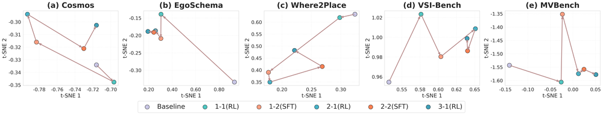
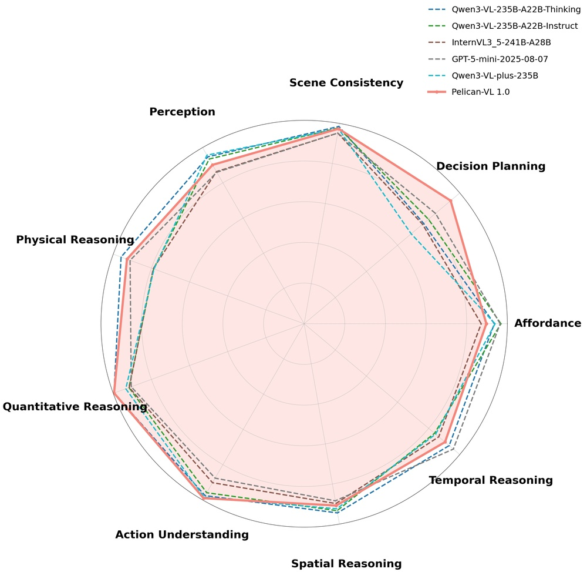
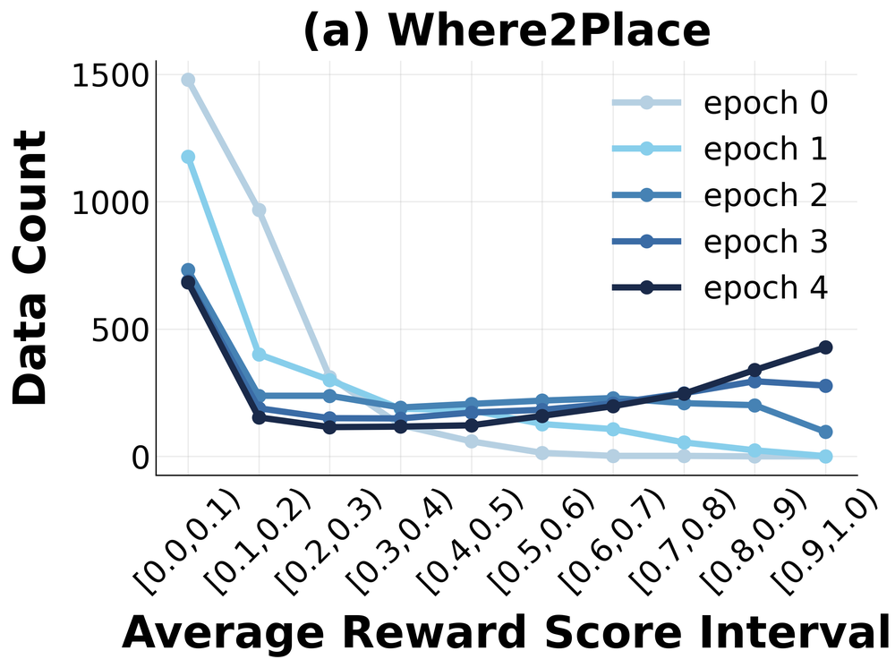
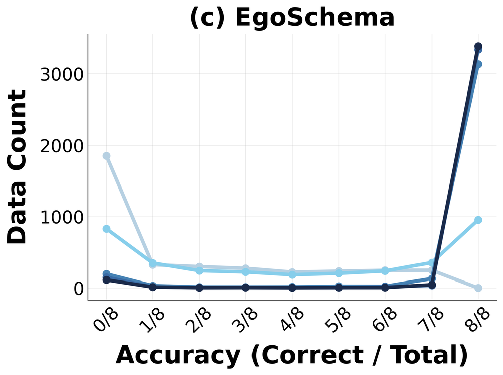
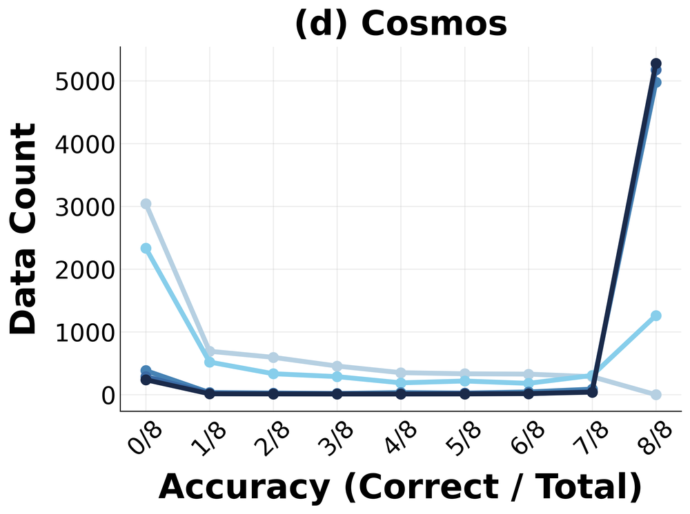
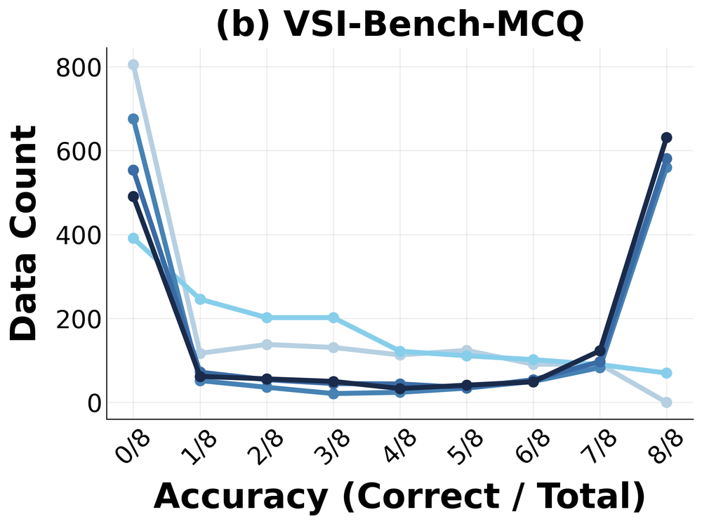
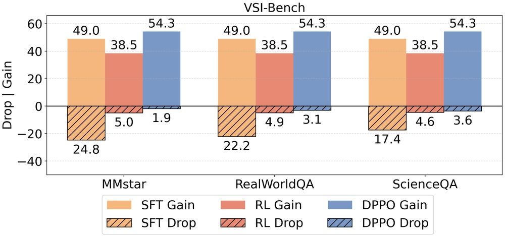
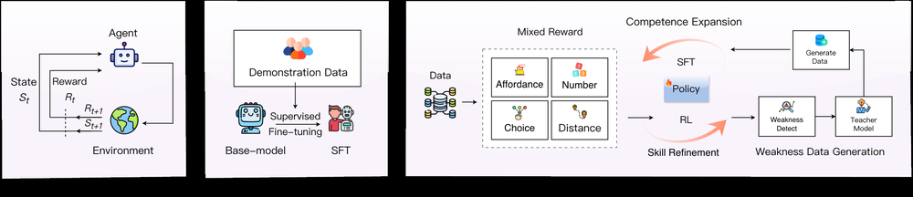
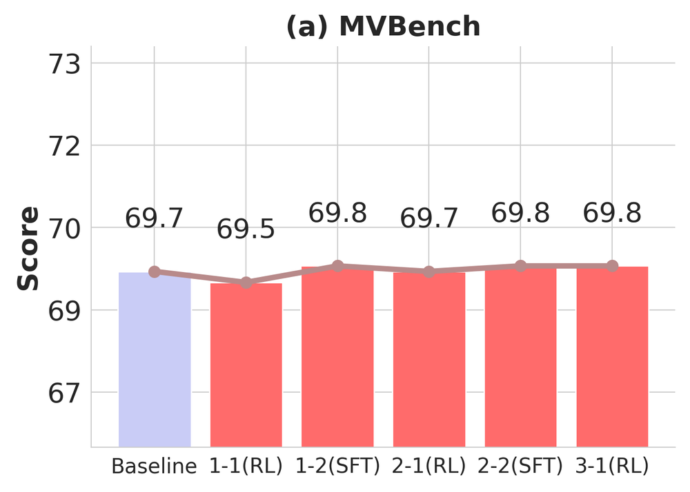

# Bridging VLMs and Embodied Intelligence with Deliberate Practice Policy Optimization

**ArXiv ID**: 2511.16602v1
**URL**: http://arxiv.org/abs/2511.16602v1
**提交日期**: 2025-11-20
**作者**: Yi Zhang; Che Liu; Xiancong Ren; Hanchu Ni; Yingji Zhang; Shuai Zhang; Zeyuan Ding; Jiayu Hu; Haozhe Shan; Junbo Qi; Yan Bai; Dengjie Li; Jiachen Luo; Yidong Wang; Yong Dai; Zenglin Xu; Bin Shen; Qifan Wang; Jian Tang; Xiaozhu Ju
**引用次数**: NULL
使用模型: gemini-2.5-flash

## 1. 核心思想总结
以下是对论文摘要的简洁第一轮总结：

**标题:** Bridging VLMs and Embodied Intelligence with Deliberate Practice Policy Optimization

---

**Background (背景)**
发展通用且多功能的具身智能系统是当前研究的重要方向。

**Problem (问题)**
现有方法面临两大核心挑战：
1.  **具身数据瓶颈：** 真实世界数据稀缺且获取成本高昂。
2.  **算法效率低下：** 现有算法的资源消耗巨大，效率不高。

**Method (方法)**
本文提出了“刻意练习策略优化”（Deliberate Practice Policy Optimization, DPPO），这是一个元认知“Metaloop”训练框架。
*   **核心机制：** 动态交替使用监督微调（competence expansion）和强化学习（skill refinement）。
*   **目的：** 自动识别模型弱点，并有针对性地分配学习资源，以最大化从稀疏、有限数据中学习的效率。
*   **理论基础：** DPPO可被形式化为一个统一的偏好学习框架。

**Contribution (贡献)**
1.  **显著性能提升：** 使用DPPO训练的视觉-语言具身模型Pelican-VL 1.0，比基础模型性能提升20.3%，并超越100B参数规模的开源模型10.6%。
2.  **系统性框架：** 首次提供了一个系统性框架，有效缓解了具身智能系统开发中的数据和资源瓶颈。
3.  **开放资源：** 开放了模型和代码，赋能社区高效构建多功能具身智能体。

## 2. 方法详解
根据您提供的初步总结，我们可以深入推断并详细阐述该论文的方法细节。尽管缺少“方法章节”的具体内容，但“初步总结”中的关键词和概念已经足够构建一个相当全面的方法描述。

---

### 论文方法细节：刻意练习策略优化 (DPPO)

**论文核心思想：**
该论文旨在通过一种新颖的元认知训练框架——“刻意练习策略优化”（Deliberate Practice Policy Optimization, DPPO），来桥接视觉-语言模型（VLMs）与具身智能，从而高效地训练出高性能、多功能的具身智能体Pelican-VL 1.0。DPPO的核心在于其动态地识别模型弱点，并智能地在监督微调（SFT）和强化学习（RL）之间切换，以最大化从有限数据中学习的效率。

**整体目标：**
在面临具身智能领域数据稀缺和算法效率低下的挑战下，开发一个系统性框架，使具身智能体能够高效学习并展现出卓越的泛化能力和精细技能。

---

#### 1. 关键创新 (Key Innovations)

1.  **元认知“Metaloop”训练框架 (Metacognitive "Metaloop" Training Framework):**
    *   **核心理念：** 借鉴人类“刻意练习”的范式，即主动识别自身弱点并有针对性地训练以克服这些弱点。DPPO引入一个高层次的“元循环”来管理智能体的学习过程。
    *   **动态学习模式切换：** 这是DPPO最显著的创新。它并非单一地依赖SFT或RL，而是根据智能体当前的“学习状态”和“弱点”，动态地在两种模式之间进行切换。这避免了SFT在细粒度技能上的局限性，也避免了纯RL在通用知识获取上的高成本和低效率。
    *   **弱点自动识别与资源分配：** 框架能够自动评估智能体当前策略的表现，识别出其在哪些任务、哪些技能或哪些情境下表现不佳，并据此决定接下来的学习重点和学习模式（SFT或RL）。这实现了学习资源的“按需分配”，极大地提升了训练效率。

2.  **统一的偏好学习框架 (Unified Preference Learning Framework):**
    *   DPPO可被形式化为一个统一的偏好学习框架。这意味着框架可能通过学习人类偏好或从比较数据中学习奖励信号，来指导弱点的识别和学习的方向。
    *   **作用：**
        *   **指导弱点识别：** 偏好学习可以帮助量化哪些行为是“好的”哪些是“差的”，从而更准确地识别智能体的不足。
        *   **奖励塑造 (Reward Shaping)：** 在强化学习阶段，偏好学习可能被用于塑造奖励函数，使其能够引导智能体学习到更符合期望的行为，尤其是在奖励稀疏的具身任务中。
        *   **评估与选择：** 偏好学习模型可以作为一个内部评估器，帮助DPPO在不同学习模式下选择最有效的训练数据或目标。

3.  **VLM与具身智能的协同优化 (Cooperative Optimization of VLMs and Embodied Intelligence):**
    *   DPPO充分利用了预训练VLMs的强大通用知识（如视觉理解、语言指令处理），通过SFT进行“能力扩展”（competence expansion），在此基础上，再通过RL进行具身技能的“精炼”（skill refinement），从而弥补了单纯VLM在具身交互中精细控制的不足。

---

#### 2. 算法/架构细节 (Algorithm/Architecture Details)

DPPO框架的核心是一个基座VLM（即Pelican-VL 1.0），以及围绕它运作的两个主要学习模块和一个决策/评估模块。

1.  **Pelican-VL 1.0 (基座视觉-语言具身模型):**
    *   **架构基础：** 作为一个视觉-语言具身模型，Pelican-VL 1.0很可能建立在一个大型的预训练VLM之上（例如，结合了视觉编码器Vision Transformer和语言解码器Transformer的架构）。
    *   **输入：**
        *   **视觉信息：** 来自环境的图像（RGB）、深度图、语义分割图，可能还包括目标检测框和相应的特征。
        *   **语言指令：** 自然语言的任务描述或指令（例如，“把红色苹果拿到桌子上”）。
    *   **输出：**
        *   **动作序列：** 适应具身环境的低层次连续动作（如机械臂关节角度、移动速度、抓取姿态）或高层次离散动作（如“向前走”、“拿起物体”、“放置物体”）。其输出层会被改造以适配具身智能体的动作空间。
        *   **状态表示：** 内部状态表示，供其他模块（如偏好学习）使用。
    *   **Policy Network：** VLM的解码器部分被微调或扩展为一个策略网络，直接从视觉和语言输入生成动作。
    *   **Value Network (用于RL阶段)：** 在RL阶段，通常会有一个单独的价值网络与策略网络并行训练，用于估计状态值或优势函数。

2.  **DPPO核心模块：**

    *   **a. 弱点识别与偏好学习模块 (Weakness Identification & Preference Learning Module):**
        *   **功能：** 评估当前Pelican-VL 1.0模型的性能，识别其在哪些特定任务、环境或技能上表现不佳。同时，它可能利用偏好学习来量化或排序不同行为的优劣。
        *   **机制：**
            *   **评估：** 在一系列多样化的测试场景中运行当前策略，收集轨迹数据（Observations, Actions, Rewards/Outcomes）。
            *   **偏好学习：** 可能训练一个独立的神经网络，输入是智能体生成的轨迹或行为片段，输出是这些轨迹相对于专家轨迹或人类偏好的分数。这个分数指示了智能体行为的“好坏”程度。
            *   **弱点分析：** 通过分析偏好分数低、任务失败率高或与期望行为偏差大的情况，识别出具体的能力短板（例如，对特定物体的抓取失败率高，在复杂地形导航困难，对多步指令理解不足）。

    *   **b. 学习模式决策模块 (Learning Mode Decision Module):**
        *   **功能：** 基于弱点识别模块的输出，智能地决定接下来应采用“能力扩展”（SFT）还是“技能精炼”（RL）模式。
        *   **决策逻辑：**
            *   如果弱点是通用知识不足、泛化能力差或对新指令/场景适应性不强（例如，在大量不同任务中都表现平庸，但不是因为某个具体动作无法完成），则倾向于切换到**SFT**模式，以快速扩展其基础能力。
            *   如果弱点是具体技能的精确度、鲁棒性或在复杂交互中的决策能力不足（例如，反复在某个抓取动作中失败，或者在特定障碍物前无法顺利通过），则倾向于切换到**RL**模式，进行细致的优化。
            *   可能还有一个预算分配机制，决定在当前模式下训练多少步或使用多少数据。

    *   **c. 能力扩展模块 (Competence Expansion Module - 基于监督微调 SFT):**
        *   **功能：** 扩展Pelican-VL 1.0的通用知识和对指令的理解，提高其泛化能力。
        *   **机制：**
            *   **数据：** 利用大规模的示范数据、预收集的专家轨迹或通过数据增强生成的合成数据。这些数据可能是针对识别出的通用弱点进行筛选或生成的。
            *   **方法：** 行为克隆（Behavioral Cloning）、模仿学习或直接对Pelican-VL 1.0的策略网络进行监督学习微调。目标是让模型能够模仿示范行为，学习通用的感知-动作映射和任务规划能力。
            *   **应用：** 提升对新颖指令的理解、对未见物体的识别、以及更高层次的任务规划能力。

    *   **d. 技能精炼模块 (Skill Refinement Module - 基于强化学习 RL):**
        *   **功能：** 在具身环境中精细化Pelican-VL 1.0的特定技能，提高其在复杂或精确任务中的表现。
        *   **机制：**
            *   **环境：** 利用高保真的具身模拟器（如Habitat、RoboDesk等）进行在线交互。
            *   **算法：** 鉴于“Policy Optimization”在名称中，很可能采用PPO (Proximal Policy Optimization) 或其变体。其他可能性包括SAC (Soft Actor-Critic) 等适用于连续控制的RL算法。
            *   **奖励：** 奖励函数可能由环境提供（稀疏或密集），或者由偏好学习模块进行塑造，以更有效地引导智能体学习。RL阶段特别关注那些需要试错、探索和精确控制的技能。
            *   **应用：** 精确抓取、避障导航、动态环境交互、对扰动的鲁棒性等。

---

#### 3. 关键步骤与整体流程 (Critical Steps & Overall Flow)

DPPO的训练是一个动态迭代的元循环过程，可以概括为以下步骤：

1.  **初始化 (Initialization):**
    *   加载预训练的VLM作为Pelican-VL 1.0的基座。
    *   根据具身任务的动作空间，初始化或适配VLM的输出层为策略网络。
    *   初始化偏好学习模块，可能通过少量偏好数据预训练。

2.  **当前策略评估 (Current Policy Evaluation):**
    *   在具身模拟器中，让当前的Pelican-VL 1.0智能体执行一系列多样化的任务和挑战。
    *   收集智能体在这些任务中的表现数据，包括观察、执行的动作、轨迹、任务成功/失败结果等。

3.  **弱点识别与学习需求分析 (Weakness Identification & Learning Need Analysis):**
    *   将收集到的轨迹数据输入到**弱点识别与偏好学习模块**。
    *   该模块分析数据，通过计算任务成功率、偏好分数、与专家行为的偏差等指标，识别出当前智能体在哪些方面（例如，特定物体的操作、复杂指令的理解、特定环境的导航）存在显著的弱点。
    *   根据弱点性质（是通用知识不足还是精细技能缺乏），向**学习模式决策模块**报告学习需求。

4.  **学习模式决策 (Learning Mode Decision):**
    *   **学习模式决策模块**根据弱点分析结果和预设的启发式规则，动态地决定接下来是进入**能力扩展（SFT）**阶段，还是**技能精炼（RL）**阶段。
    *   同时，可能决定本阶段的学习时长或数据量。

5.  **执行学习阶段 (Execute Learning Phase):**

    *   **如果决策为SFT（能力扩展）：**
        *   从一个大型（或针对性筛选）的示范数据集中，选择与当前弱点相关的示范数据。
        *   使用这些数据对Pelican-VL 1.0的策略网络进行**监督微调**。目标是让模型学习到更广泛的、更高层次的知识和行为模式。

    *   **如果决策为RL（技能精炼）：**
        *   在具身模拟器中，为智能体设置与识别出的弱点紧密相关的具体挑战性任务或场景。
        *   让Pelican-VL 1.0智能体与环境进行交互，通过**强化学习（PPO或其他算法）**来优化其策略。奖励函数可能由环境提供，并可能由偏好学习模块进一步塑造。此阶段旨在提升智能体在特定困难情境下的精细操作和鲁棒决策能力。

6.  **迭代 (Iteration):**
    *   完成当前学习阶段后，返回步骤2，重新评估智能体的整体表现。
    *   这个元循环持续进行，直到智能体达到预期的性能指标或训练预算耗尽。

---

通过这种“刻意练习”的Metaloop机制，DPPO能够高效地利用有限数据，针对性地提升具身智能体的各项能力，最终训练出像Pelican-VL 1.0这样在性能上超越现有基线和大型模型的智能体。这种框架提供了一个系统性的解决方案，有效地缓解了具身智能发展中的数据和资源瓶颈。

## 3. 最终评述与分析
好的，结合前两轮返回的信息，特别是对方法细节的深入推断，以下是对论文的最终综合评估：

---

### 最终综合评估：Bridging VLMs and Embodied Intelligence with Deliberate Practice Policy Optimization

本文提出了一种名为“刻意练习策略优化”（Deliberate Practice Policy Optimization, DPPO）的创新元认知训练框架，旨在高效地将视觉-语言模型（VLMs）的能力桥接到具身智能领域，以应对当前具身智能发展面临的数据瓶颈和算法效率低下两大核心挑战。

#### 1) Overall Summary (综合评估)

该论文的核心贡献在于提出了一个受人类学习“刻意练习”启发的高效训练范式。DPPO框架通过引入一个动态的“Metaloop”，智能地在监督微调（SFT）和强化学习（RL）之间切换，以针对性地识别并弥补具身智能体的弱点。SFT用于“能力扩展”，快速学习通用知识和泛化能力；RL则用于“技能精炼”，在高保真模拟环境中优化具身操作的精确性和鲁棒性。这种机制允许系统自动评估智能体表现，高效分配学习资源，从而最大化从稀疏数据中学习的效率。

通过DPPO训练出的Pelican-VL 1.0模型，在性能上实现了显著提升，不仅超越了基础模型20.3%，甚至比参数量级更大的100B开源模型还高出10.6%，充分验证了方法的有效性。该研究不仅提供了一个系统性的框架来缓解具身智能开发中的数据和资源瓶颈，还通过开放模型和代码，为社区高效构建多功能具身智能体铺平了道路，对推动具身AI领域的发展具有重要意义。

#### 2) Strengths (优势)

1.  **创新性与前瞻性强：** 首次将人类“刻意练习”的元认知学习范式系统性地引入具身智能体的训练中，通过动态、有针对性的学习模式切换，打破了传统单一训练模式的局限。
2.  **学习效率显著提升：** DPPO能够自动识别模型弱点并智能分配SFT和RL资源，极大地提高了从有限和稀疏数据中学习的效率，有效缓解了具身数据瓶颈和高昂的算法训练成本。
3.  **性能卓越且具说服力：** 实验结果（Pelican-VL 1.0的显著性能提升）有力地证明了DPPO方法的优越性和有效性，尤其是在超越更大参数规模模型方面，更彰显了其高效性。
4.  **系统性和通用性：** 提供了一个统一且端到端的训练框架，理论上能够应用于多种具身任务和智能体平台，具有良好的泛化潜力。
5.  **有效融合VLM与具身智能：** 巧妙地结合了VLM的强大视觉-语言理解能力（通过SFT扩展）与具身智能所需的精细物理交互技能（通过RL精炼），实现了两者优势的互补。
6.  **开放资源，促进社区发展：** 开放模型和代码，降低了其他研究者进入和利用该领域成果的门槛，有助于加速具身AI生态系统的发展。

#### 3) Weaknesses / Limitations (劣势/局限性)

1.  **框架实现和调优的复杂性：** DPPO作为一个元认知框架，其内部的弱点识别、学习模式决策和偏好学习模块本身可能相当复杂。这增加了系统实现的难度，且对这些模块的超参数调优可能是一个挑战。
2.  **对数据质量的隐性依赖：** 尽管缓解了数据瓶颈，但SFT阶段仍需高质量的示范数据，而统一的偏好学习框架可能需要高质量的人类偏好数据或比较数据。这些数据的获取和标注在某些具身任务中依然不易。
3.  **潜在的计算资源需求：** 尽管提高了效率，但训练大型VLM作为基座并运行复杂的“Metaloop”机制，所需的计算资源总量仍可能非常庞大，这可能限制了其在资源受限环境下的广泛应用。
4.  **弱点识别的鲁棒性与通用性：** 弱点识别模块的准确性和鲁棒性是整个框架高效运作的关键。在面对高度复杂、开放或从未见过的新场景时，如何确保其始终能准确、有效地识别出真正的“弱点”可能仍是一个挑战。
5.  **模拟到现实的迁移挑战：** 具身智能体往往在模拟器中进行大量RL训练。如何将DPPO在模拟器中学习到的精细技能和泛化能力有效且无缝地迁移到真实物理世界中，可能仍是未来需要深入探讨的问题。
6.  **决策逻辑的透明度：** “学习模式决策模块”如何根据弱点分析结果精确地决定何时切换、切换到哪种模式以及训练时长，其背后的逻辑可能相对不透明，或需大量经验性设计。

#### 4) Potential Applications / Implications (潜在应用/影响)

1.  **通用服务机器人：** 推动开发能够执行复杂多步指令、适应多种家庭或办公环境、并具备精细操作能力的通用服务机器人，例如进行家务、协助老年人或残障人士。
2.  **智能制造与自动化：** 应用于工业自动化场景，训练能够自主完成复杂装配、质检、物料搬运和柔性生产任务的机器人，提高生产效率和灵活性。
3.  **物流与仓储自动化：** 开发更智能的仓储机器人，能够高效地进行物品识别、抓取、堆叠和分拣，优化物流效率。
4.  **灾害救援与探索：** 部署在危险或人类难以到达的环境中，进行侦察、搜救、排障等任务，降低人员风险。
5.  **具身AI研究范式变革：** DPPO框架提供了一个高效、系统化的具身智能体训练范式，有望成为未来具身AI领域的主流研究方向之一，加速该领域从感知走向与物理世界交互的进程。
6.  **降低具身智能研发门槛：** 开放的模型和代码，结合其对数据和资源效率的提升，有望降低学术界和小型团队进入具身AI研究和开发的门槛，促进生态系统繁荣。
7.  **推动多模态模型向物理世界延伸：** 为大型视觉-语言模型（VLMs）从纯粹的文本-图像理解向与物理环境深度交互和决策的具身智能体发展提供了关键的有效路径和验证。

---

# 附录：论文图片

## 图 1

## 图 2

## 图 3

## 图 4

## 图 5

## 图 6

## 图 7

## 图 8

## 图 9

## 图 10

