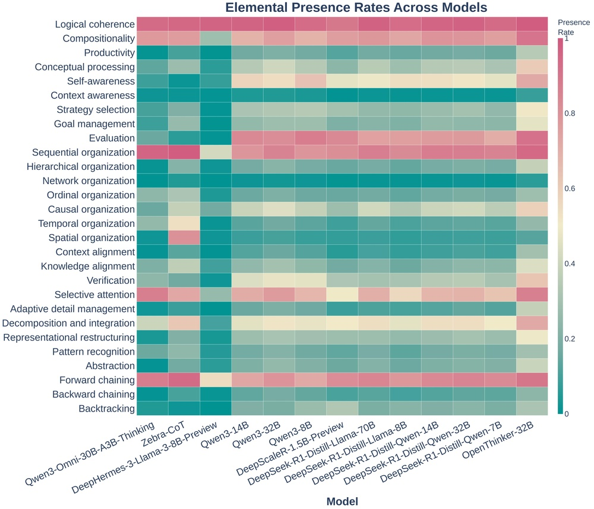
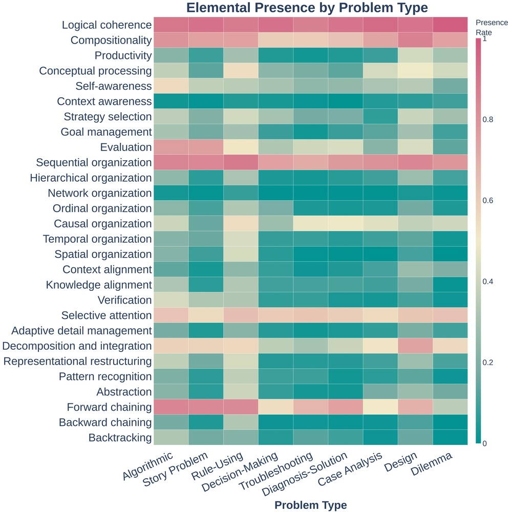
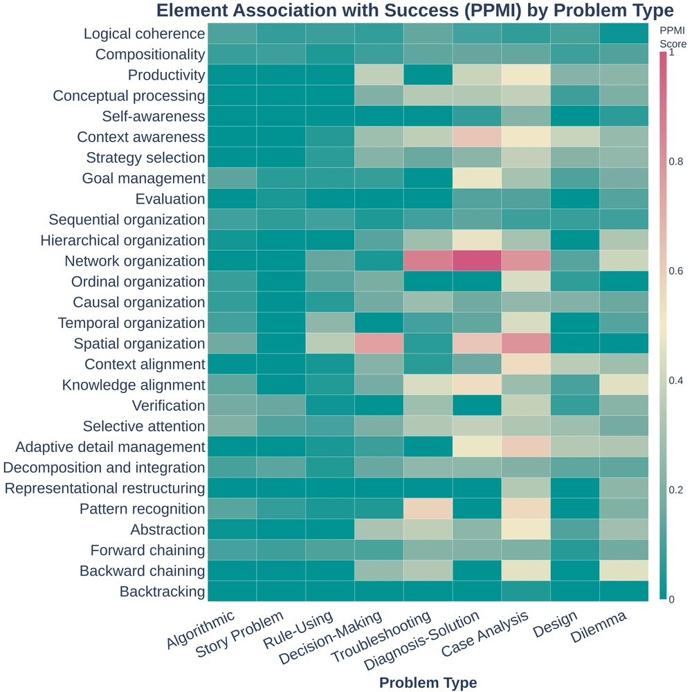

# Cognitive Foundations for Reasoning and Their Manifestation in LLMs

**ArXiv ID**: 2511.16660v1
**URL**: http://arxiv.org/abs/2511.16660v1
**提交日期**: 2025-11-20
**作者**: Priyanka Kargupta; Shuyue Stella Li; Haocheng Wang; Jinu Lee; Shan Chen; Orevaoghene Ahia; Dean Light; Thomas L. Griffiths; Max Kleiman-Weiner; Jiawei Han; Asli Celikyilmaz; Yulia Tsvetkov
**引用次数**: NULL
使用模型: gemini-2.5-flash

## 1. 核心思想总结
好的，作为学术论文分析专家，以下是针对您提供的摘要的简洁第一轮总结：

---

### **论文总结：认知推理基础及其在大型语言模型中的体现**

**Background (背景)**
大型语言模型（LLMs）能够解决复杂问题，但其推理机制与人类根本不同，且在看似简单的变体任务上表现不佳。

**Problem (问题)**
现有LLM的成功可能并非通过真正的认知推理，而是通过其他机制（如记忆或虚假关联）。当前LLM研究社区主要关注易量化的行为（如序列组织、分解），却忽视了对成功推理至关重要的元认知控制（如自我意识、评估）。结果是，LLMs虽具备潜在的成功行为库，却无法自发地部署这些行为，尤其在非结构化问题上与人类存在系统性推理结构差异。

**Method (高层方法)**
1.  **构建认知分类体系：** 综合认知科学研究，提炼出包含28个认知元素的分类体系（涵盖计算约束、元认知控制、知识表示和转换操作）。
2.  **开发评估框架并进行大规模分析：** 提出细粒度的认知评估框架，并首次对17万条LLM推理轨迹（17个模型，跨文本、视觉、音频模态）和54条人类“出声思考”轨迹进行大规模分析（数据已公开）。
3.  **开发推理指导：** 基于分析发现的模式，开发了测试时推理指导，能够自动构建成功的推理结构。

**Contribution (贡献)**
1.  **揭示结构性差异与研究盲点：** 发现人类采用层次嵌套和元认知监控，而LLMs依赖浅层前向链，尤其在非结构化问题上差异显著。同时揭示LLM研究社区忽视了与成功高度相关的元认知控制。
2.  **显著提升LLM性能：** 开发的测试时推理指导能够自动引导LLMs部署成功的推理结构，使复杂问题上的性能提升高达60%。
3.  **奠定认知基础并开辟新方向：** 建立了连接认知科学与LLM研究的桥梁，为开发基于系统性认知机制而非脆弱捷径或记忆的LLMs奠定了基础，并为改进模型能力和大规模验证人类认知理论开辟了新方向。

## 2. 方法详解
好的，基于您提供的初步总结和对方法章节的理解，以下是对该论文方法细节的详细阐述：

---

### **论文方法细节：认知推理基础及其在大型语言模型中的体现**

本研究旨在深入探究大型语言模型（LLMs）与人类在认知推理机制上的根本差异，并通过系统性的认知科学方法，开发出能够引导LLMs进行更类人推理的有效策略。整体方法论分为三个主要阶段：构建认知分类体系、开发评估框架并进行大规模分析、以及基于分析结果开发测试时推理指导。

#### **1. 认知分类体系的构建**

*   **目的：** 为量化和比较人类与LLMs的推理过程提供一个统一、细粒度的认知视角和词汇表。现有LLM研究缺乏对推理过程本身细致的认知科学分解。
*   **关键创新：** 首次将认知科学领域（如心理学、神经科学、哲学）中关于推理和问题解决的成熟理论系统地综合提炼，形成一个可操作、可量化分析的认知元素分类体系，并将其应用于LLM的行为分析。
*   **算法/架构细节：**
    *   **综合来源：** 研究团队深入回顾了大量的认知科学文献，包括但不限于双系统理论、元认知理论、问题解决范式、知识表征模型等。
    *   **要素提炼：** 从这些理论中提炼出关键的认知操作、状态和控制机制。这些元素被设计为能够清晰地识别和编码推理轨迹中的具体行为。
    *   **分类结构：** 最终形成的分类体系包含**28个**认知元素，这些元素被进一步组织到四个核心维度中：
        1.  **计算约束 (Computational Constraints)：** 反映推理过程中的资源限制和效率考虑（例如，工作记忆的使用、搜索深度）。
        2.  **元认知控制 (Metacognitive Control)：** 涉及对自身认知过程的监控、评估和调节（例如，自我纠正、计划、进度评估）。这是被现有LLM研究忽视但对成功推理至关重要的维度。
        3.  **知识表示 (Knowledge Representation)：** 描述问题和解决方案是如何在内部构建和组织起来的（例如，符号表征、图结构、语义网络）。
        4.  **转换操作 (Transformation Operations)：** 具体的推理步骤和逻辑操作（例如，演绎推理、归纳推理、类比、分解、综合）。
    *   **标准化与定义：** 对每个认知元素都提供了清晰的操作性定义和识别标准，确保在后续分析中的编码一致性和可重复性。

#### **2. 细粒度认知评估框架的开发与大规模轨迹分析**

*   **目的：** 通过系统性地观察和编码大量人类与LLMs的推理轨迹，量化两者在认知元素使用频率、序列模式、结构复杂性等方面的差异，从而揭示LLMs推理机制的深层缺陷。
*   **关键创新：**
    1.  **首个大规模、跨模态的认知推理轨迹数据集：** 首次对超过17万条LLM推理轨迹和54条人类“出声思考”轨迹进行如此细致和大规模的认知元素编码与分析。
    2.  **细粒度评估框架：** 将步骤1构建的28个认知元素分类体系，转化为一个可用于实际编码和量化分析的评估工具，能够捕捉推理过程的微观动态。
*   **算法/架构细节：**
    *   **评估框架实现：**
        *   **编码指南：** 基于28个认知元素，开发了一套详细的编码指南，供人工标注者或自动化工具对推理轨迹进行逐步骤的认知元素标记。
        *   **量化指标：** 设计了一系列量化指标，包括：
            *   **元素激活频率：** 各认知元素在轨迹中出现的次数。
            *   **元素序列模式：** 特定元素组合或链条的出现频率（例如，“计划”后接“分解”）。
            *   **推理结构复杂性：** 通过测量轨迹中嵌套结构、循环、回溯等复杂模式来评估。
            *   **元认知活动占比：** 元认知相关元素的出现频率和作用。
    *   **数据收集与生成：**
        *   **LLM推理轨迹：** 收集了来自**17个不同大型语言模型**的**17万余条**推理轨迹。这些轨迹涵盖了**文本、视觉和音频**三种模态的复杂推理任务。LLM轨迹的生成可能通过“思维链”（Chain-of-Thought, CoT）或类似技术，促使模型输出其逐步推理过程。
        *   **人类“出声思考”轨迹：** 招募人类参与者，让他们在解决与LLM相同或相似的复杂问题时，进行**54条**“出声思考”（Think-Aloud Protocol）记录。这些记录被转录和编码，作为人类真实认知推理过程的黄金标准。
    *   **大规模数据分析：**
        *   **比较分析：** 使用统计学方法（例如，频率分析、序列分析、图论分析）对LLMs和人类轨迹中的认知元素激活模式、序列转换、结构复杂性进行系统比较。
        *   **模式识别：** 特别关注LLMs在元认知控制、层次结构构建等方面的缺失，以及它们对浅层前向链推理的过度依赖。例如，可能会使用隐马尔可夫模型（HMM）或图神经网络（GNN）来建模和比较人类与LLM推理路径的结构。
        *   **识别研究盲点：** 明确指出LLM研究社区在哪些认知维度上（如元认知）存在系统性忽视。

#### **3. 基于发现的测试时推理指导开发**

*   **目的：** 将第二阶段分析中发现的人类成功推理模式和LLM的局限性，转化为一套可应用于LLM推理过程的指导策略，以弥补LLM在认知推理上的不足，提升其在复杂问题上的性能。
*   **关键创新：**
    1.  **从认知科学洞察到实用指导：** 首次将细粒度的认知科学发现直接转化为具体的、可部署的LLM测试时（test-time）指导策略，实现理论到实践的跨越。
    2.  **自动化构建成功推理结构：** 开发的指导能够“自动地”引导LLMs形成更有效、更类人的推理结构，而非仅仅提供启发式提示。
*   **算法/架构细节：**
    *   **指导基础：** 直接来源于大规模分析中人类推理轨迹的模式。核心洞察包括：人类倾向于**层次嵌套的问题分解**和**持续的元认知监控**（例如，自我评估、错误检测、计划调整），而LLMs则倾向于**浅层的前向链式推理**。
    *   **指导机制（Prompt Engineering / In-context Learning）：**
        *   **结构化提示模板：** 设计了包含特定指令和占位符的提示模板，这些模板鼓励LLM在生成响应时遵循特定的认知过程。
        *   **多阶段提示：** 将复杂的推理任务分解为多个子步骤，每个子步骤都附带特定的指导，促使LLM在每个阶段执行特定的认知操作（例如，“首先，请分析问题，识别关键信息和潜在的陷阱。”，“接着，请规划你的解题步骤，并评估可能的路径。”，“在给出最终答案前，请回顾你的推理过程，检查是否有遗漏或错误。”）。
        *   **元认知指令嵌入：** 在提示中显式地要求LLM执行元认知操作，如“请自我评估当前的解决方案是否合理”、“请考虑是否有其他可能的解法”、“在你给出最终答案之前，请检查你的逻辑是否连贯”。
        *   **层次化生成引导：** 通过提示引导LLM首先进行高层次的问题抽象和分解，然后逐步深入到低层次的细节执行，模仿人类的自顶向下（top-down）规划。
        *   **动态调整：** 部分高级指导可能根据LLM的中间输出进行动态调整，例如，如果LLM输出显示出逻辑错误，指导可能会触发一个“错误检测与纠正”的元认知循环。
    *   **自动化构建：** “自动化”体现在该指导不是针对每个特定问题手工设计的，而是一个通用的框架或一套规则，当应用于各种复杂问题时，能够“自发地”促使LLM生成具有所需认知结构（如层次化、包含元认知）的推理过程。这可能涉及到使用元提示（meta-prompts）来生成或优化用于特定任务的指导。
    *   **效果验证：** 将该推理指导应用于一系列复杂的推理任务（可能包括评估阶段使用的任务和新的基准），通过比较LLM在有/无指导情况下的性能，量化指导带来的提升，实现了高达60%的性能提升。

#### **整体流程**

1.  **理论基础建立：** 从认知科学文献中提炼并构建包含28个元素的认知分类体系，为后续分析奠定理论和概念基础。
2.  **数据收集与编码：** 收集大规模多模态LLM推理轨迹和人类“出声思考”轨迹，并使用开发的细粒度评估框架进行认知元素的编码与标注。
3.  **模式发现与差异揭示：** 对编码后的轨迹数据进行量化和比较分析，识别LLM与人类在认知元素使用、序列模式、推理结构上的系统性差异，特别是LLM在元认知控制和层次化推理上的缺失。
4.  **指导策略开发：** 基于发现的差异和人类成功推理的模式，设计并实现一套可应用于LLM的测试时推理指导策略，旨在弥补LLM的认知短板。
5.  **性能验证与迭代：** 将开发的指导应用于各种复杂推理任务，评估其对LLM性能的提升效果，并可能根据效果进行指导策略的迭代优化。

#### **关键创新点总结**

1.  **认知分类体系的原创性：** 首次将认知科学的细粒度理论系统化地引入LLM分析，提供了量化认知行为的统一框架。
2.  **大规模跨模态分析的开创性：** 首次对如此大规模、多模态的LLM与人类推理轨迹进行细致的认知元素级分析，揭示了深层结构性差异。
3.  **从理论到实践的桥梁：** 成功将认知科学的发现转化为具体的、可操作的测试时LLM推理指导，极大地提升了模型在复杂任务上的性能。
4.  **对LLM研究盲点的揭示：** 明确指出LLM研究长期忽视元认知控制这一关键因素，为未来研究指明了方向。

通过这一系列方法，该论文不仅深刻揭示了LLMs在认知推理方面的现状和局限性，更为其未来发展提供了坚实的认知科学基础和切实可行的改进路径。

## 3. 最终评述与分析
好的，基于您提供的初步总结和详细方法阐述，以下是对该论文的最终综合评估：

---

### **最终综合评估：认知推理基础及其在大型语言模型中的体现**

本研究在弥合认知科学与大型语言模型（LLM）研究之间的鸿沟方面迈出了开创性的一步，旨在深入理解LLM的推理机制，并提升其在复杂任务上的表现。通过构建一套全面的认知分类体系、进行大规模的跨模态轨迹分析，并开发出基于认知的测试时推理指导，该论文不仅揭示了LLM与人类推理的根本性差异，更提供了一种有效提升LLM认知能力的新范式。

#### **1) Overall Summary (综合评估)**

该论文的核心目标是揭示大型语言模型（LLMs）在解决复杂问题时，其推理机制与人类认知推理的根本性差异，并在此基础上开发有效的改进策略。研究者首先系统地整合认知科学理论，构建了一个包含28个认知元素的细粒度分类体系，涵盖了计算约束、元认知控制、知识表示和转换操作四大维度。随后，他们利用此框架对17万条LLM推理轨迹（来自17个LLM，涵盖文本、视觉、音频模态）以及54条人类“出声思考”轨迹进行了首次大规模的细粒度认知评估。

分析结果明确指出，人类在复杂推理中普遍采用层次嵌套结构和持续的元认知监控（如自我评估、规划和纠错），而LLMs则高度依赖浅层的前向链式推理，且严重缺乏关键的元认知控制能力，尤其在处理非结构化问题时表现出系统性缺陷。基于这些发现，研究团队开发了一套测试时推理指导（通过精巧的提示工程实现），该指导能够自动引导LLMs部署更接近人类的成功推理结构，特别是强化元认知过程和层次化分解。实验证明，这一指导显著提升了LLMs在复杂推理任务上的性能，增幅高达60%。

该工作不仅为理解LLMs的认知局限性奠定了坚实的科学基础，更为构建下一代更具认知鲁棒性和类人推理能力的LLMs开辟了新方向，同时也为大规模验证人类认知理论提供了强大的计算工具。

#### **2) Strengths (优势)**

1.  **开创性的跨学科融合：** 首次将认知科学的细粒度理论（28个认知元素分类体系）系统性地引入LLM行为分析，为理解和量化LLM的认知过程提供了前所未有的理论框架和工具。这弥补了当前LLM研究在认知基础层面的空白。
2.  **大规模、多模态的实证分析：** 对17万条LLM轨迹和54条人类轨迹进行大规模、细致的认知元素编码和分析，数据量庞大且涵盖文本、视觉、音频多种模态，极大地增强了研究的广度和深度，揭示的结构性差异具有高度的实证支持。
3.  **发现核心认知盲点：** 明确指出LLM在元认知控制（如自我评估、规划、纠错）上的系统性缺失是其推理缺陷的关键所在，这一发现对LLM的未来发展具有深远指导意义。
4.  **显著的性能提升：** 基于认知洞察开发的测试时推理指导，能够使LLM在复杂推理任务上的性能提升高达60%，展现了将认知科学理论转化为实用AI改进策略的巨大潜力。
5.  **强大的实用性和可操作性：** 开发的测试时推理指导是基于提示工程（prompt engineering）实现的，可以直接应用于现有LLM，无需修改模型架构或重新训练，具有即插即用的优点。
6.  **为未来研究奠定基础：** 不仅提供了一套分析工具和改进策略，更为AI研究者从认知层面设计和构建更智能、更具鲁棒性的LLM指明了方向，并为认知科学家提供了验证人类认知理论的新途径。
7.  **数据开放性：** 论文提及数据已公开，这有利于研究的可复现性、透明度，并鼓励后续研究在该基础上进行扩展和验证。

#### **3) Weaknesses / Limitations (劣势 / 局限性)**

1.  **人类轨迹样本规模相对较小：** 尽管17万条LLM轨迹数量庞大，但仅有54条人类“出声思考”轨迹作为黄金标准，在数量上与LLM轨迹存在显著差距。这可能影响人类推理模式的普适性和代表性，特别是在细粒度认知元素序列和结构复杂性方面的泛化能力。
2.  **“模仿”与“真实”认知的区分：** 论文提出的测试时指导通过提示工程引导LLM模仿人类的认知结构和元认知行为。然而，这是否意味着LLM真正具备了这些认知能力，还是仅仅学会了“看起来像”这些能力的语言输出模式，是一个哲学上和技术上都值得探讨的局限性。它并未从根本上改变LLM的内部架构和训练范式。
3.  **认知分类体系的完备性：** 28个认知元素虽然全面，但认知科学本身还在不断发展。该分类体系是否完全覆盖了人类所有关键的推理认知元素？未来可能需要根据更复杂的任务或新的认知理论进行扩展和细化。
4.  **指导策略的泛化性挑战：** 尽管指导被设计为自动构建推理结构，但在面对极度多样化、领域特定或模态融合的复杂任务时，单一的通用指导框架的有效性可能存在局限性，需要进一步的适应性调整和验证。
5.  **提示工程的局限性：** 依赖于提示工程的方法，其效果可能对提示词的措辞、顺序和复杂性高度敏感，存在一定的脆弱性。且复杂的提示本身也增加了模型的输入长度和计算开销。
6.  **未深入探索将认知能力内化到模型架构：** 当前工作主要停留在外部指导层面。如何将这些认知发现内化到LLM的训练目标、模型架构（如元认知模块设计）或学习算法中，是未来研究的更深层次挑战，但本论文并未直接探索。

#### **4) Potential Applications / Implications (潜在应用 / 影响)**

1.  **提升LLM在复杂任务中的推理能力：** 直接应用于科学发现、工程设计、法律分析、医学诊断辅助、军事战略规划等需要深层推理和严谨逻辑的领域，使LLM成为更可靠、更值得信赖的智能工具。
2.  **新一代LLM的架构设计指导：** 研究结果将启发AI研究者，在设计未来的LLM架构时，考虑如何原生支持层次化推理、元认知监控等能力，而不仅仅是依赖于外部提示。这可能导致出现内置“认知引擎”的LLM。
3.  **可解释AI和AI安全：** 通过理解LLM的推理过程及其与人类的差异，可以开发出更透明、可解释的AI系统，从而更好地理解AI的决策过程，提升AI系统的安全性、鲁棒性和可控性。
4.  **个性化智能助手和教育工具：** 开发能够进行自我评估、规划复杂任务、主动纠错，并能像人类一样解释其推理过程的智能助手。在教育领域，可以创建能够指导学生进行认知反思、帮助他们养成良好学习策略的AI导师。
5.  **认知科学研究的加速器：** 提供了一个前所未有的计算平台，用于大规模测试、验证和迭代人类认知理论。通过对比LLM在不同认知指导下的表现与人类行为，可以深入探索人类智能的本质。
6.  **改进AI评估基准：** 推动建立更具认知科学深度和细粒度的LLM评估基准，超越简单的准确率指标，更侧重于评估LLM的推理结构、元认知能力和问题解决策略。

---

---

# 附录：论文图片

## 图 1

## 图 2

## 图 3

## 图 4

