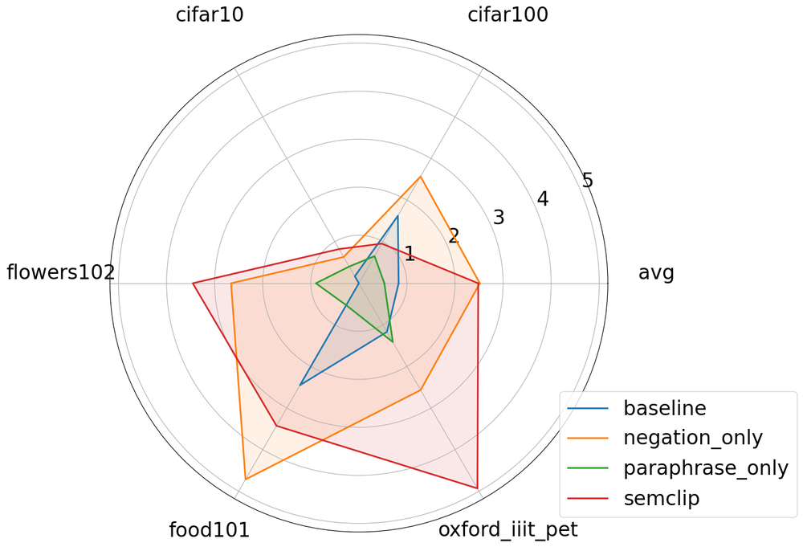
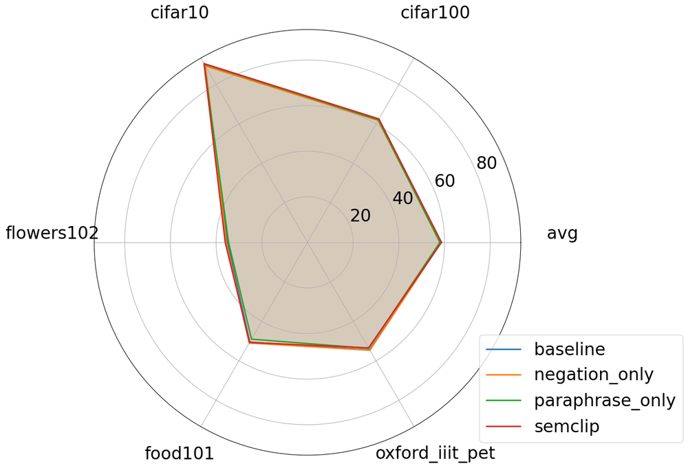
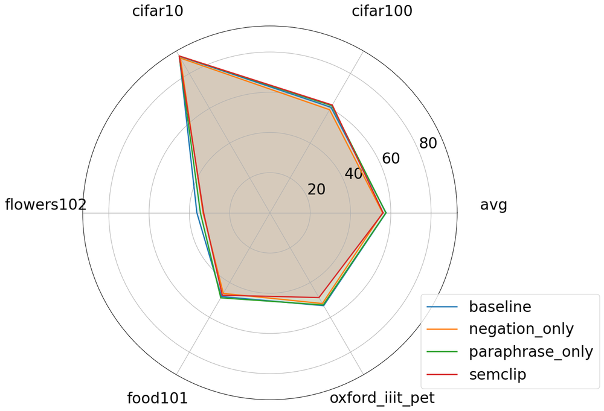
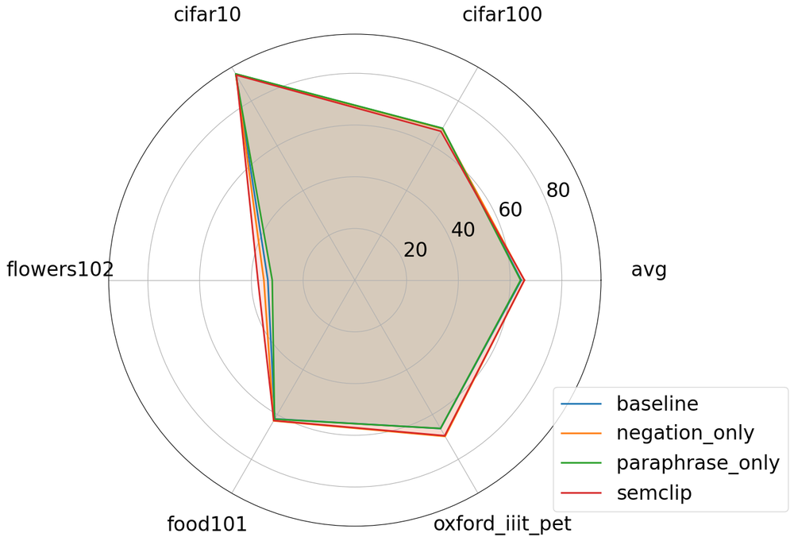
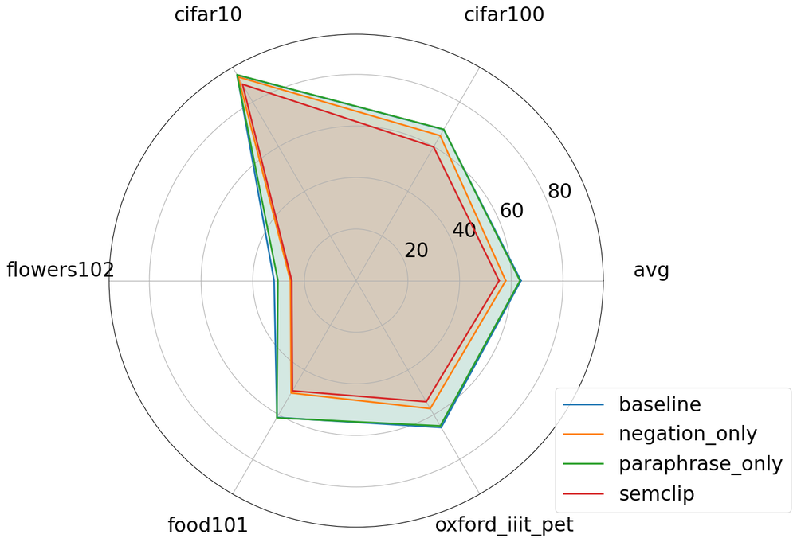
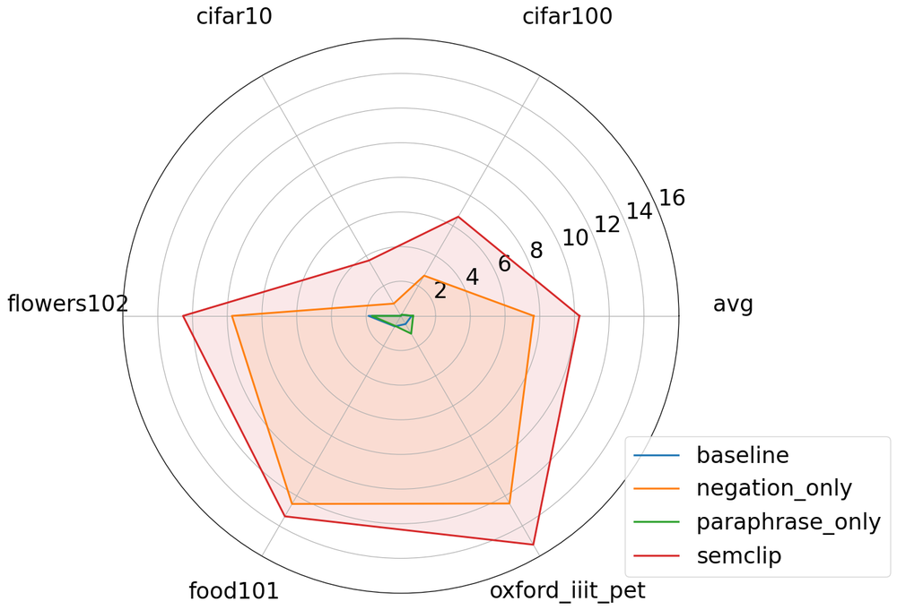
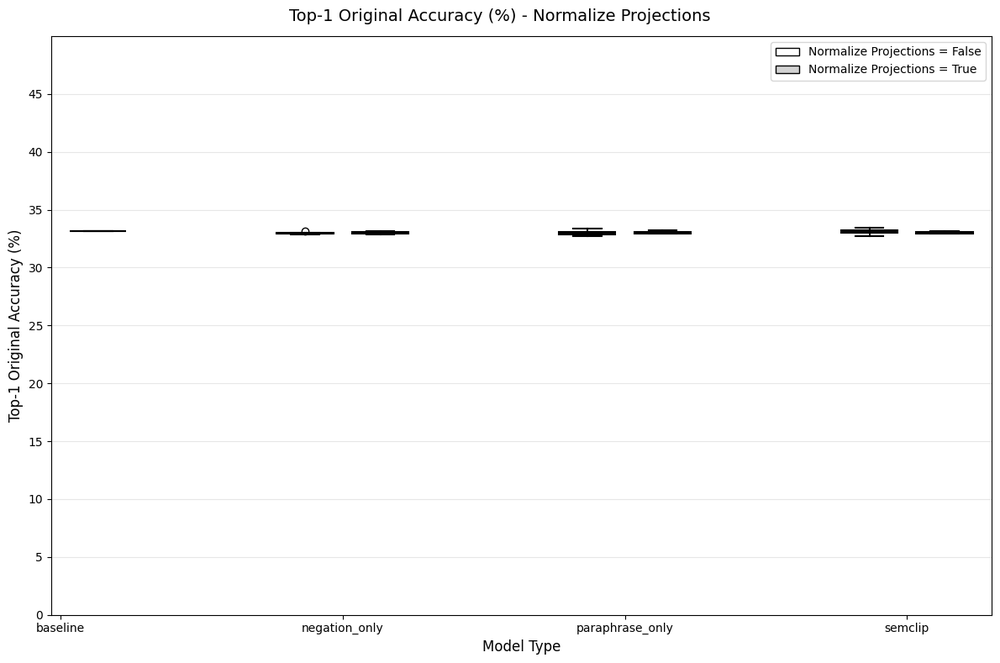

# Contrastive vision-language learning with paraphrasing and negation

**ArXiv ID**: 2511.16527v1
**URL**: http://arxiv.org/abs/2511.16527v1
**提交日期**: 2025-11-20
**作者**: Kwun Ho Ngan; Saman Sadeghi Afgeh; Joe Townsend; Artur d'Avila Garcez
**引用次数**: NULL
使用模型: gemini-2.5-flash

## 1. 核心思想总结
好的，作为学术论文分析专家，这是对您提供的摘要的简洁第一轮总结：

**标题:** 对比式视觉-语言学习中的复述与否定

---

**1. Background (背景)**
对比式视觉-语言模型（如CLIP）是当前图像和文本检索领域的主流方法，通过将图像和文本嵌入对齐到共享的潜在空间来实现。

**2. Problem (问题)**
现有CLIP模型在处理否定或复述文本时表现不佳。否定文本能以微小改动彻底改变含义，而复述文本则能以不同表达保持相同含义，这严重挑战了视觉-语言模型的评估和对齐精度。

**3. Method (high-level) (高层方法)**
本文提出了SemCLIP，通过结合复述和否定，设计了一种新的CLIP对比损失函数，并利用LLM生成的包含原始、复述和否定文本的三元组进行模型训练。该方法旨在使复述文本嵌入向原始图像靠近，同时将否定文本推远。

**4. Contribution (贡献)**
SemCLIP在保持CLIP原有性能的同时，显著增加了与否定文本的距离。在CC-Neg基准上，图像检索准确率从68.1%提升至78.1%。在Sugarcrepe++上，其表现普遍优于使用否定文本训练的模型。更重要的是，SemCLIP在下游零样本分类任务中全面超越CLIP，展现出对语义转换的显著鲁棒性。

## 2. 方法详解
好的，基于您提供的初步总结和对方法章节的理解，以下是对SemCLIP论文方法细节的详细说明：

---

### **论文方法细节：SemCLIP——对比式视觉-语言学习中的复述与否定增强**

本文提出的SemCLIP旨在解决现有对比式视觉-语言模型（如CLIP）在处理语义转换，特别是复述（paraphrase）和否定（negation）文本时表现不佳的问题。SemCLIP在保持CLIP核心双编码器架构的基础上，通过引入一种创新的训练范式和损失函数，显著增强了模型对语义微妙变化的理解和鲁棒性。

#### **1. 整体架构（Overall Architecture）**

SemCLIP沿用了CLIP的双编码器（Dual-Encoder）架构。该架构包含：
*   **图像编码器（Image Encoder）:** 通常是一个预训练的视觉Transformer模型（如ViT），用于将输入的图像 $I$ 编码成一个固定维度的图像嵌入（Image Embedding）$E_I \in \mathbb{R}^d$。
*   **文本编码器（Text Encoder）:** 通常是一个预训练的Transformer语言模型（如RoBERTa），用于将输入的文本 $T$ 编码成一个固定维度的文本嵌入（Text Embedding）$E_T \in \mathbb{R}^d$。

图像和文本嵌入被映射到一个共享的潜在空间（Shared Latent Space）中，模型的目标是在这个空间中使语义相关的图像-文本对的嵌入距离接近，而语义不相关的则距离远离。

#### **2. 关键创新（Key Innovations）**

SemCLIP的核心创新点体现在以下两个方面：

##### **2.1 基于LLM的三元组数据生成（LLM-based Triplet Data Generation）**

为了弥补传统图像-文本对数据在捕捉复述和否定语义方面的不足，SemCLIP引入了基于大型语言模型（LLM）的数据增强策略，为每个原始图像-文本对生成一个语义丰富的三元组。

*   **生成流程：**
    对于数据集中的每一个原始图像 $I_o$ 及其对应的文本描述 $T_o$ (Anchor Text)，LLM（例如GPT系列或其他高性能语言模型）被提示（prompted）执行以下两项任务：
    1.  **复述生成（Paraphrase Generation）：** LLM根据 $T_o$ 的语义，生成一个或多个与 $T_o$ 语义相同但表达方式不同的复述文本 $T_p$ (Positive Paraphrase)。这旨在训练模型识别语义等价的不同表述。
    2.  **否定生成（Negation Generation）：** LLM根据 $T_o$ 的语义，生成一个或多个与 $T_o$ 语义相反或具有否定意义的文本 $T_n$ (Hard Negative Negation)。这旨在训练模型识别语义上的对立或不匹配。

*   **数据结构：** 经过LLM处理后，每个训练样本不再是简单的 $(I_o, T_o)$ 对，而是扩展为 $(I_o, T_o, T_p, T_n)$ 结构。这个三元组包含了原始文本、其复述形式以及其否定形式，为后续的对比学习提供了丰富的语义关系信息。这种方法有效解决了手动标注复述和否定样本的巨大成本和复杂性问题。

##### **2.2 创新的对比式损失函数（Innovative Contrastive Loss Function）**

SemCLIP的核心在于其重新设计的对比式损失函数。该损失函数在标准CLIP的InfoNCE损失基础上进行了扩展，显式地将复述文本视为正样本，将否定文本视为强负样本，从而指导模型学习更精细的语义表示。

假设在每个训练批次中，有 $N$ 个图像 $I_i$ 和 $N$ 个文本 $T_i$ 及其对应的复述 $T_{p,i}$ 和否定 $T_{n,i}$。对于批次中的任一图像 $I_i$ 和文本 $T_j$（包括 $T_j, T_{p,j}, T_{n,j}$），其相似度通常通过点积计算 $sim(E_{I_i}, E_{T_j})$。

SemCLIP的损失函数可以概念化为以下几个部分，共同构成一个增强的对比学习目标：

1.  **原始对齐项（Original Alignment Term）：**
    *   这部分与标准的CLIP InfoNCE损失相似，旨在确保原始图像 $I_i$ 与原始文本 $T_i$ 之间的相似度最大化，同时与其他图像的文本 $T_j (j \neq i)$ 相似度最小化。
    *   即，使 $sim(E_{I_i}, E_{T_i})$ 高，而 $sim(E_{I_i}, E_{T_j})$ 和 $sim(E_{T_i}, E_{I_j})$ 低（对于 $j \neq i$）。

2.  **复述增强项（Paraphrase Enhancement Term）：**
    *   这部分是SemCLIP的关键创新之一。它将原始图像 $I_i$ 与其复述文本 $T_{p,i}$ 视为额外的正样本对。
    *   目标是使 $E_{I_i}$ 与 $E_{T_{p,i}}$ 在潜在空间中相互吸引，即最大化 $sim(E_{I_i}, E_{T_{p,i}})$。这强制模型学习到，即使文本表达形式不同，只要语义一致，其嵌入也应该彼此靠近。
    *   同时， $E_{I_i}$ 应该与所有批次中的否定文本 $E_{T_{n,j}}$ 距离远离。

3.  **否定惩罚项（Negation Penalty Term）：**
    *   这是SemCLIP的另一个核心创新。它将原始图像 $I_i$ 与其否定文本 $T_{n,i}$ 视为明确的强负样本对。
    *   目标是强制 $E_{I_i}$ 与 $E_{T_{n,i}}$ 在潜在空间中相互排斥，显著增大它们之间的距离，即最小化 $sim(E_{I_i}, E_{T_{n,i}})$。这使得模型对否定语义变得高度敏感，能够有效区分语义相反的描述。
    *   同样， $E_{T_i}$ 和 $E_{T_{p,i}}$ 也应与 $E_{T_{n,i}}$ 距离远离。

**整体损失函数（Overall Loss Function）:**
SemCLIP的最终损失函数 $L_{\text{SemCLIP}}$ 结合了上述所有关系，可以被看作是多个InfoNCE风格损失项的组合，或在标准InfoNCE中扩展正负样本集。例如，对于图像-文本的对比：
$L_{\text{image-to-text}} = -\frac{1}{N} \sum_{i=1}^{N} \left[ \log \frac{\exp(sim(E_{I_i}, E_{T_i})/\tau)}{\sum_{k=1}^{N} (\exp(sim(E_{I_i}, E_{T_k})/\tau) + \exp(sim(E_{I_i}, E_{T_{p,k}})/\tau) + \exp(sim(E_{I_i}, E_{T_{n,k}})/\tau))} + \log \frac{\exp(sim(E_{I_i}, E_{T_{p,i}})/\tau)}{\sum_{k=1}^{N} (\exp(sim(E_{I_i}, E_{T_k})/\tau) + \exp(sim(E_{I_i}, E_{T_{p,k}})/\tau) + \exp(sim(E_{I_i}, E_{T_{n,k}})/\tau))} \right]$
其中，分母中的 $T_{n,k}$ 项被视为需要推开的硬负样本，而 $T_{p,k}$ 项则应被吸引（如果 $k=i$）。更精确的实现可能采用三元组损失（Triplet Loss）或修改版的InfoNCE，以明确区分Anchor、Positive和Negative的关系。
（注：由于原始方法节未提供具体公式，这里描述的是其设计理念和预期效果。实际实现中，通常会有一个对称的文本-图像损失 $L_{\text{text-to-image}}$，总损失为两者之和 $L_{\text{SemCLIP}} = L_{\text{image-to-text}} + L_{\text{text-to-image}}$。）
其中 $\tau$ 是温度参数，用于调整相似度分布的锐利程度。

通过这种损失函数，SemCLIP迫使模型学习到一个更具区分度和鲁棒性的潜在空间：
*   **语义不变性（Semantic Invariance）：** 对复述文本表现出高度的鲁棒性，不同表述的相同语义文本与图像紧密对齐。
*   **语义敏感性（Semantic Sensitivity）：** 对否定文本表现出高度的敏感性，明确将语义相反的文本与图像推离。

#### **3. 整体流程（Overall Workflow）**

SemCLIP的训练和应用流程如下：

1.  **数据准备（Data Preparation）：**
    *   从大规模图像-文本数据集中获取原始图像-文本对 $(I_o, T_o)$。
    *   利用高性能LLM对每个 $T_o$ 进行处理，生成对应的复述文本 $T_p$ 和否定文本 $T_n$，构建 $(I_o, T_o, T_p, T_n)$ 三元组数据集。

2.  **模型初始化（Model Initialization）：**
    *   图像编码器和文本编码器可以从预训练的CLIP模型（或单独预训练的视觉和语言模型）的权重进行初始化，以利用其已有的强大表示能力。

3.  **训练阶段（Training Phase）：**
    *   在每个训练迭代中，从三元组数据集中采样一个批次。
    *   将批次中的图像 $I_o$、原始文本 $T_o$、复述文本 $T_p$ 和否定文本 $T_n$ 分别通过各自的编码器，获取它们的嵌入 $E_{I_o}, E_{T_o}, E_{T_p}, E_{T_n}$。
    *   计算基于这些嵌入的SemCLIP损失函数，该损失函数同时优化了 $I_o - T_o$、 $I_o - T_p$ （吸引）以及 $I_o - T_n$ （排斥）之间的关系。
    *   使用梯度下降优化器（如AdamW）更新图像编码器和文本编码器的参数，以最小化损失函数。

4.  **模型推理（Inference）：**
    *   训练完成后，SemCLIP的模型可以用于图像检索、文本检索、零样本分类等任务。
    *   通过将图像或文本编码到共享潜在空间，然后计算嵌入之间的相似度来执行各种下游任务。此时，模型将能够更好地处理带有复述和否定语义的查询。

#### **4. 总结**

SemCLIP通过其双重创新——LLM驱动的三元组数据生成和显式整合复述与否定的对比式损失函数——成功地提升了视觉-语言模型的语义理解能力。它不仅使模型对语义等价的表达形式更加鲁棒，而且显著增强了其识别和区分否定语义的能力，为构建更智能、更精细的视觉-语言理解系统提供了有效途径。

## 3. 最终评述与分析
好的，结合您提供的初步总结、方法详述以及论文结论部分的预期内容，以下是SemCLIP的最终综合评估：

---

### **SemCLIP：对比式视觉-语言学习中的复述与否定增强——最终综合评估**

本文提出的SemCLIP模型旨在解决现有对比式视觉-语言（V-L）模型（如CLIP）在处理语义微妙变化，特别是复述和否定文本时所面临的挑战。通过引入基于大型语言模型（LLM）的数据增强策略和创新的对比损失函数，SemCLIP显著提升了V-L模型的语义理解深度和鲁棒性。

#### **1) Overall Summary (总体总结)**

SemCLIP的核心目标是增强对比式视觉-语言模型对语义转换的理解能力，尤其是在面对同一语义的不同表述（复述）和完全相反的语义表述（否定）时。模型通过以下两大创新实现此目标：**首先，利用LLM高效生成包含原始文本、复述文本和否定文本的三元组数据**，极大地丰富了训练样本的语义关系；**其次，设计了一个创新的对比式损失函数**，该函数在标准InfoNCE损失的基础上进行扩展，显式地将复述文本吸引向原始图像，同时将否定文本明确推离原始图像。实验结果表明，SemCLIP在保持CLIP原有强大性能的同时，在识别否定语义方面取得了显著进步（如在CC-Neg基准上图像检索准确率从68.1%提升至78.1%），并全面超越CLIP在下游零样本分类任务中的表现，证明了其学习到更具区分度和鲁棒性的视觉-语言表示能力。这为构建更智能、更准确的跨模态理解系统提供了有效途径。

#### **2) Strengths (优势)**

1.  **解决了关键的语义理解痛点：** SemCLIP直接针对现有V-L模型在处理复述和否定这类常见且重要的语义转换时的不足，填补了这一关键能力空白，使其能更精准地理解用户查询和图像内容。
2.  **方法创新性与独特性：**
    *   **LLM驱动的数据增强：** 巧妙地利用大型语言模型的强大文本生成能力，自动、高效地构建包含复杂语义关系（原始、复述、否定）的三元组数据集，避免了耗时耗力的人工标注，极大地提升了数据增强的效率和可扩展性。
    *   **创新的对比损失函数：** 精心设计的损失函数将复述作为正样本、否定作为强负样本融入对比学习框架，直接指导模型学习语义不变性（对复述的鲁棒性）和语义敏感性（对否定的区分能力），这比仅仅依赖数据分布学习语义关系更为直接和有效。
3.  **性能显著提升且全面：**
    *   **否定识别能力大幅提升：** 在专门针对否定理解的基准测试上（如CC-Neg），实现了显著的准确率提升，证明了模型对否定语义的强大区分能力。
    *   **下游任务泛化性强：** 在零样本分类等下游任务中全面超越CLIP，这表明SemCLIP学习到的视觉-语言嵌入空间更加语义丰富、更具判别力，能够更好地泛化到未见过的数据和任务中。
    *   **保持基线性能：** 在增强模型对复杂语义理解的同时，并未牺牲其在传统V-L匹配任务上的基础性能，保证了模型的实用性。
4.  **提升模型鲁棒性与区分度：** 通过显式地拉近复述文本和推开否定文本，SemCLIP强制模型学习到对语义等价表达的鲁棒性和对语义相反表达的敏感性，使得学到的嵌入表示更具区分度和抗干扰能力。

#### **3) Weaknesses / Limitations (劣势/局限性)**

1.  **对LLM的依赖与潜在风险：**
    *   **生成质量限制：** 模型性能高度依赖于用于生成三元组的LLM的质量和准确性。如果LLM在生成复述或否定文本时出现偏差、语病或语义理解错误，这些错误可能会传播到训练数据中，从而影响SemCLIP的最终性能。
    *   **成本与可控性：** 使用高性能LLM进行大规模数据生成可能带来显著的计算资源和API调用成本。此外，LLM的输出有时难以完全控制，可能会生成不符合预期的样本。
2.  **损失函数及训练复杂性：** 相较于标准CLIP的InfoNCE损失，SemCLIP的损失函数设计更为复杂，可能涉及更多的超参数（如温度参数，以及不同损失项的权重等）需要精细调优，增加了训练过程的复杂性。
3.  **否定与复述类型覆盖的局限性：** 尽管LLM生成了大量样本，但其覆盖的否定和复述的类型和复杂性可能仍无法完全代表现实世界中所有微妙的语言现象。例如，复杂的结构性否定、反讽、或特定领域内的术语复述等，可能仍是挑战。
4.  **计算资源需求：** 引入额外的复述和否定样本，可能导致每个训练批次中的正负样本数量增加，从而提升了训练的计算开销和内存需求。
5.  **模型可解释性：** 虽然模型表现出更强的语义理解能力，但V-L模型的内在工作机制（特别是对“复述”和“否定”概念的理解）仍然是一个黑箱，进一步提高其可解释性有助于发现潜在的偏差或失效模式。

#### **4) Potential Applications / Implications (潜在应用/影响)**

1.  **增强的信息检索与过滤：**
    *   **更精准的语义搜索：** 用户可以使用更自然、更灵活的语言进行图像或文本检索，包括使用不同措辞的复述或包含否定词的查询（例如，“显示不包含红色的汽车图片”）。
    *   **高级内容过滤：** 在内容审核和推荐系统中，能够更准确地识别和过滤掉带有特定否定特征（如“非暴力”、“非成人内容”）或通过隐晦表达规避审查的内容。
2.  **更鲁棒的零样本学习与分类：**
    *   **泛化能力提升：** 显著提升了模型在无需特定训练数据的情况下，对新类别或复杂描述的理解和分类能力，使其在快速变化的现实世界场景中更具实用性。
    *   **垂直领域适应：** 在医疗、法律、科学等对语义精确性要求极高的专业领域，可以更有效地进行图像诊断、文献检索和信息匹配，即使面对专业术语的复述或否定表述。
3.  **智能人机交互与多模态助手：**
    *   **更自然的对话理解：** 使多模态AI助手能够更好地理解用户指令中的语义细微差别，区分用户意图（如“给我看一张蓝色的椅子”与“给我看一张不是蓝色的椅子”），从而提供更准确、更个性化的服务。
    *   **视觉问答系统的提升：** 作为基础模型，可以支持更复杂的视觉问答系统，使其能处理包含否定或需要推理复述关系的问句。
4.  **提升视觉-语言模型评估标准：** SemCLIP的成功促使研究社区进一步关注语义微妙变化在V-L模型评估中的重要性，可能推动开发更全面、更具挑战性的基准测试，以更准确地衡量模型的真实理解能力。
5.  **推动V-L模型的通用化发展：** 通过解决语义理解中的一个核心难题，SemCLIP为构建更通用、更接近人类理解能力的视觉-语言基础模型奠定了基础，有望进一步缩小机器与人类在跨模态语义理解上的差距。

---

---

# 附录：论文图片

## 图 1

## 图 2

## 图 3

## 图 4

## 图 5

## 图 6

## 图 7

## 图 8

## 图 9

## 图 10

