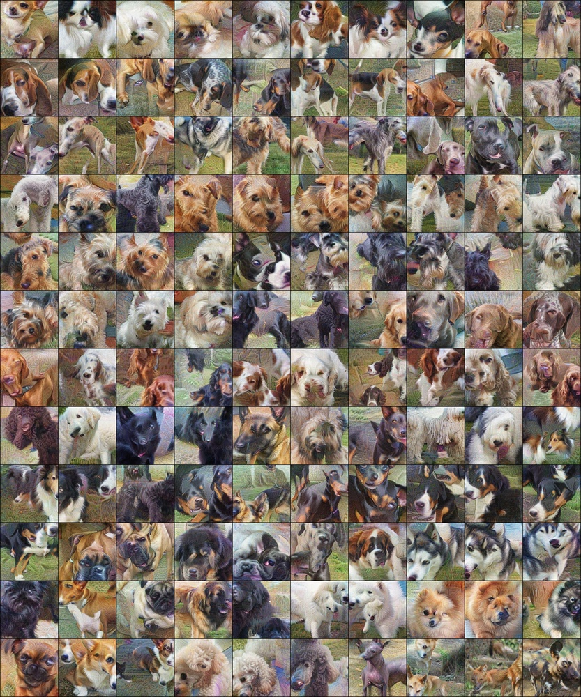
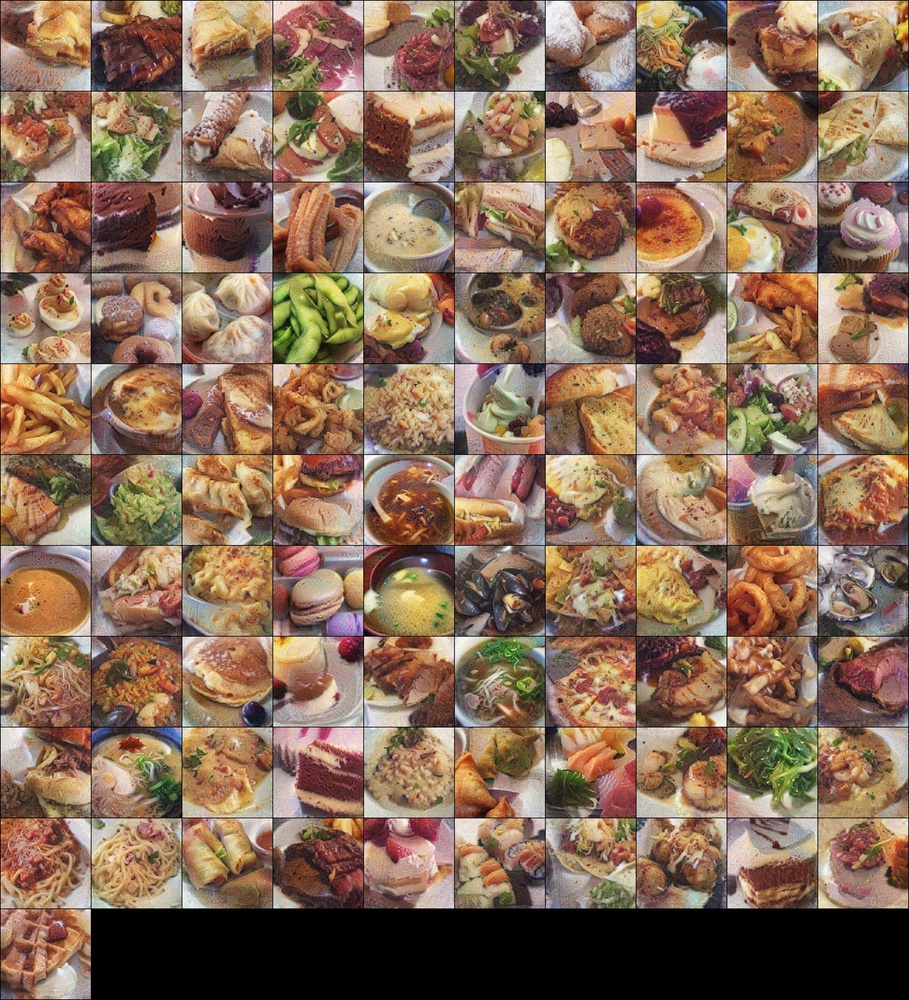
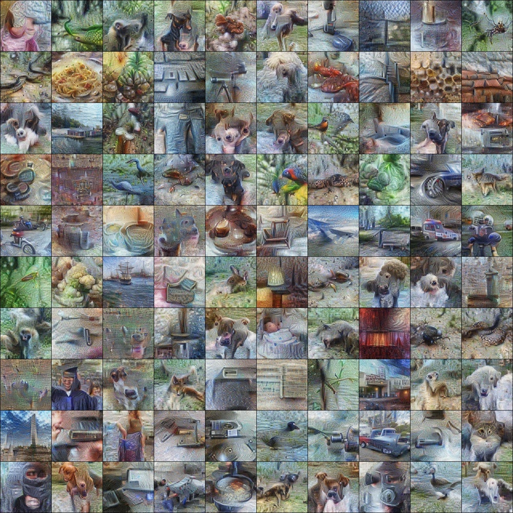
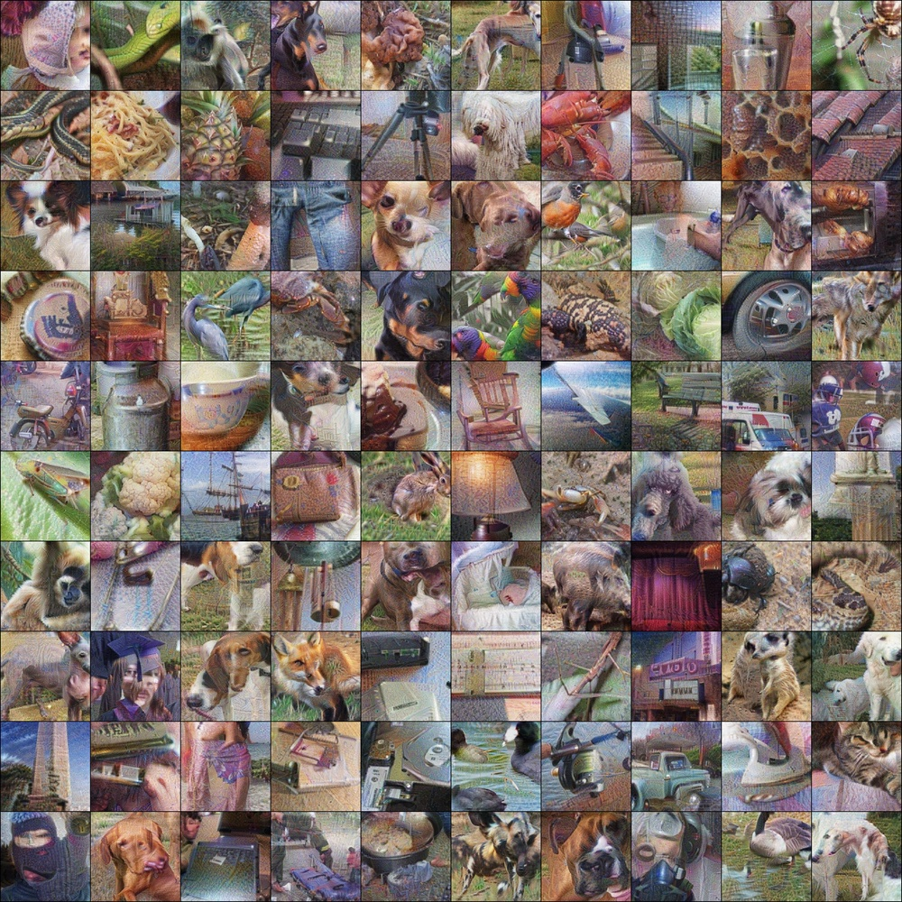
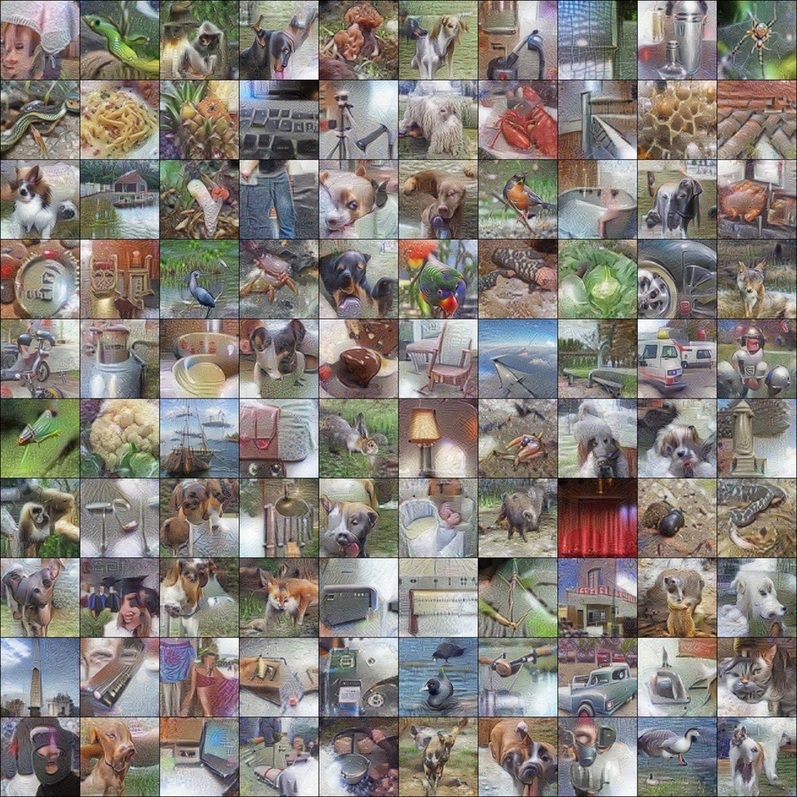
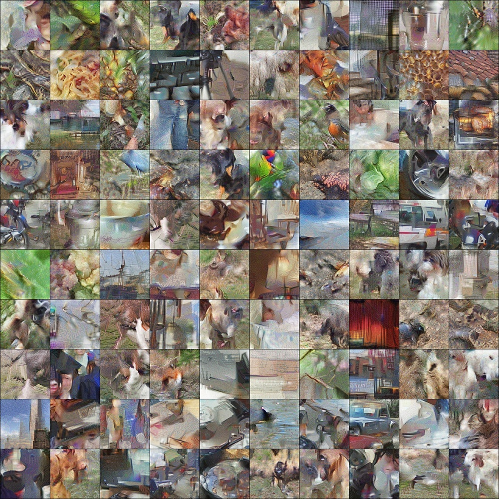
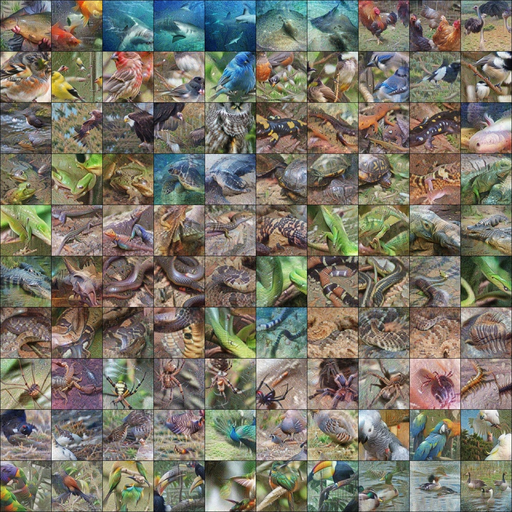
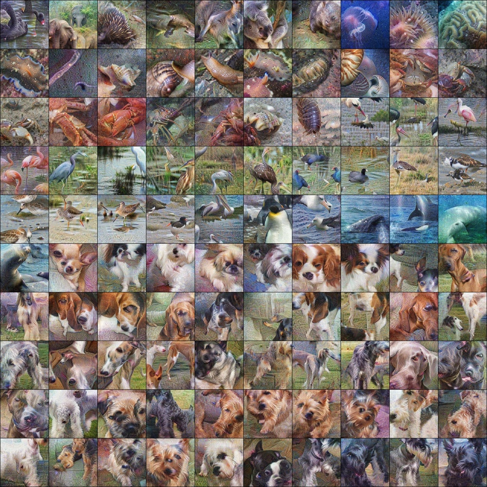
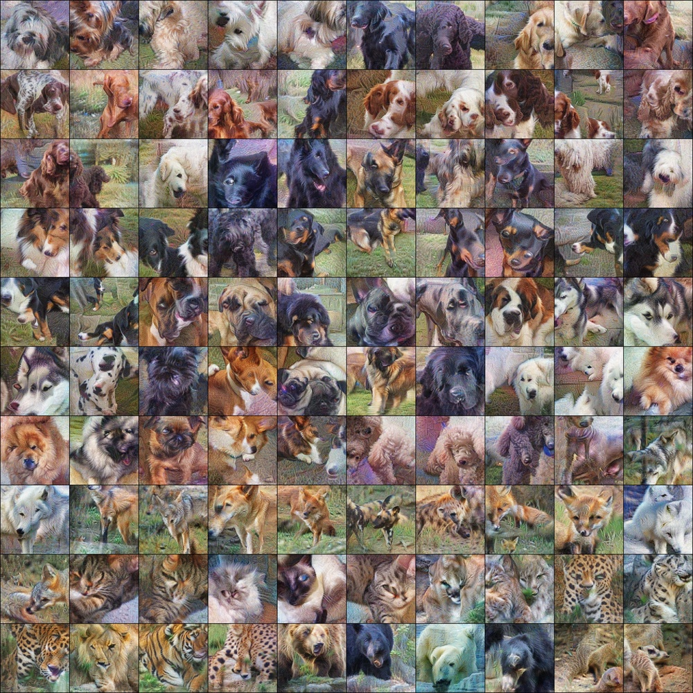

# Dataset Distillation for Pre-Trained Self-Supervised Vision Models

**ArXiv ID**: 2511.16674v1
**URL**: http://arxiv.org/abs/2511.16674v1
**提交日期**: 2025-11-20
**作者**: George Cazenavette; Antonio Torralba; Vincent Sitzmann
**引用次数**: NULL
使用模型: gemini-2.5-flash

## 1. 核心思想总结
好的，作为学术论文分析专家，这是对您提供的摘要的简洁第一轮总结：

---

**标题**: Dataset Distillation for Pre-Trained Self-Supervised Vision Models

**1. Background (背景)**
数据集蒸馏旨在生成少量合成图像，使其训练的模型能复现由大量真实数据训练出的模型性能。现有方法主要关注从随机初始化模型开始训练的场景。然而，当前最先进的视觉方法越来越多地依赖于大型预训练自监督模型，而非从头开始训练。

**2. Problem (问题)**
本文研究的问题是如何蒸馏数据集，以最优地训练这些大型预训练视觉模型顶部的线性分类器（linear probes）。

**3. Method (方法 - 高层)**
提出了一种名为“线性梯度匹配（Linear Gradient Matching）”的数据集蒸馏方法。该方法通过优化合成图像，使其经过预训练特征提取器后，在线性分类器中产生的梯度与真实数据产生的梯度相似。

**4. Contribution (贡献)**
*   合成数据超越了所有基于真实图像的基线方法。
*   蒸馏出的数据集在预训练视觉模型之间具有卓越的泛化能力，例如，能够使用通过DINO骨干网络蒸馏的数据集有效训练CLIP的线性分类器。
*   蒸馏数据集在细粒度分类中表现出色。
*   为模型可解释性提供了有价值的工具，例如预测两个模型嵌入空间的相似性，或模型对对抗性数据中虚假相关性的敏感度。

## 2. 方法详解
好的，基于您提供的初步总结和方法节要求，以下是该论文方法细节的详细说明：

---

### 论文方法细节：线性梯度匹配 (Linear Gradient Matching)

#### 1. 引言

本文提出了一种创新性的数据集蒸馏方法——**“线性梯度匹配 (Linear Gradient Matching, LGM)”**，旨在解决当前视觉领域中依赖大型预训练自监督模型（而非从头开始训练）的新范式下的数据蒸馏问题。LGM方法的核心目标是生成一个极小的合成数据集，该数据集能够最优地训练这些大型预训练视觉模型顶部的线性分类器（即执行线性探测），使其性能与在大量真实数据上训练所获得的性能相当。

#### 2. 核心思想与方法动机

传统的深度学习数据集蒸馏方法主要关注生成合成数据，使得一个模型从随机初始化开始，仅用合成数据训练后，能达到在真实数据上训练的同等性能。然而，这种方法与当前主流的视觉模型开发流程（即先使用大规模数据进行自监督预训练，然后通过线性探测或微调来适应下游任务）不符。

LGM方法正是为了适应这一新范式而设计的。其核心思想是：**通过优化合成图像和其对应标签，使得在预训练特征提取器所映射的特征空间中，一个虚拟（或瞬时）线性分类器在合成数据上产生的权重梯度，与它在真实数据上产生的权重梯度尽可能地相似。**

**动机：**
*   **聚焦线性探测：** LGM方法直接针对预训练模型顶部的线性分类器训练过程进行建模，而不是试图模拟整个深度网络的训练。
*   **利用固定特征空间：** 预训练模型提供了一个高质量且固定的特征空间。因此，蒸馏的重点不再是学习特征提取器本身，而是学习如何在这个固定特征空间内有效地划分类别。
*   **梯度是学习的本质：** 模型的学习是通过梯度下降进行的。如果合成数据能够诱导与真实数据相似的梯度更新路径，那么由合成数据训练出的线性分类器就能很好地模拟真实数据训练出的分类器。

#### 3. 算法/架构细节

LGM方法的架构相对简洁，主要包含三个核心组件：

*   **固定特征提取器 ($F$):**
    *   这是整个方法的基础，它是一个已经在大规模数据集上进行过自监督预训练的视觉骨干网络（例如DINO、CLIP等编码器）。
    *   在整个数据集蒸馏过程中，该特征提取器的所有参数是**完全固定不变**的，不参与任何梯度更新。
    *   其作用是将输入的原始图像 $x$ 映射到一个高维的、语义丰富的特征向量 $F(x)$。
*   **可学习的合成数据 ($X_S, Y_S$):**
    *   这是LGM方法的主要优化目标。它由一小批合成图像 $X_S = \{x_i^S\}_{i=1}^{N_S}$ 和对应的合成类别标签 $Y_S = \{y_i^S\}_{i=1}^{N_S}$ 组成。
    *   **合成图像 ($X_S$):** 通常初始化为随机噪声，或从真实数据集中随机采样并添加噪声。这些图像的像素值是**可学习的参数**，通过反向传播进行更新。
    *   **合成标签 ($Y_S$):** 对应于合成图像的类别标签，可以是one-hot编码。这些标签也是**可学习的参数**，在优化过程中可以被调整，以更好地匹配真实数据的梯度行为。合成图像的总数量 $N_S$ 远小于原始真实训练数据集的规模。
*   **虚拟线性分类器 ($W$):**
    *   这是一个简单的全连接层，用于在特征提取器 $F(x)$ 的输出之上进行分类。其参数 $W$ 是我们希望蒸馏数据能够高效训练的对象。
    *   在LGM的蒸馏过程中，$W$ 通常被视为一个**辅助性的虚拟分类器**。它不是最终要部署的分类器，而是作为一个工具来计算梯度。
    *   为了使梯度匹配更有效，在每次优化合成数据的迭代中， $W$ 可以被随机重新初始化，或者在当前合成数据上进行少量步数的“内循环”训练，以模拟一个经过初步训练的线性探测器状态。这确保了所计算的梯度能够代表一个有意义的学习方向。
*   **线性梯度匹配损失 ($L_{LGM}$):**
    *   这是LGM方法的核心优化目标函数。
    *   对于一个给定的虚拟线性分类器 $W$ 和标准分类损失函数（例如交叉熵损失 $L_{CE}$），一个真实数据批次 $(X_R, Y_R)$ 会产生针对 $W$ 的梯度：$\nabla_W L_{CE}(W, F(X_R), Y_R)$。
    *   类似地，当前的合成数据批次 $(X_S, Y_S)$ 也会产生针对 $W$ 的梯度：$\nabla_W L_{CE}(W, F(X_S), Y_S)$。
    *   LGM损失函数旨在最小化这两个梯度向量之间的距离。最常用的形式是它们的L2范数距离：
        $$L_{LGM}(X_S, Y_S) = || \nabla_W L_{CE}(W, F(X_S), Y_S) - \nabla_W L_{CE}(W, F(X_R), Y_R) ||_2^2$$
    *   这个损失函数可以通过链式法则，将梯度反向传播到合成图像 $X_S$ 的像素值和合成标签 $Y_S$，从而实现对它们的优化。

#### 4. 关键步骤与整体流程

LGM方法的优化是一个迭代过程，其整体流程可以概括如下：

1.  **初始化:**
    *   初始化 $N_S$ 个合成图像 $X_S$：例如，为每个类别生成少量随机噪声图像。
    *   初始化对应的合成标签 $Y_S$：例如，每个合成图像分配一个随机类别或均匀分布的one-hot编码。
    *   初始化虚拟线性分类器 $W$ 的参数：例如，随机权重。
2.  **迭代优化（外循环，优化 $X_S, Y_S$）:**
    a.  **采样真实数据:** 从大规模真实训练数据集中随机抽取一个小批次 $(X_R, Y_R)$。
    b.  **虚拟分类器内循环训练（可选但常用）:**
        *   为了更好地模拟真实训练过程，可以使用当前的合成数据 $(X_S, Y_S)$ 对虚拟线性分类器 $W$ 进行少量迭代的梯度下降更新。这确保了在计算梯度时，$W$ 处于一个“已开始学习”的状态，而不是完全随机，从而使匹配的梯度更具代表性。
        *   或者，可以在每次外循环开始时，简单地随机重新初始化 $W$。
    c.  **计算真实梯度:**
        *   将真实图像 $X_R$ 通过固定特征提取器 $F$ 得到特征 $F(X_R)$。
        *   使用虚拟线性分类器 $W$ 在 $F(X_R)$ 和 $Y_R$ 上计算分类损失 $L_{CE}$。
        *   计算该分类损失对 $W$ 的梯度：$\nabla_W L_{CE}(W, F(X_R), Y_R)$。
    d.  **计算合成梯度:**
        *   将合成图像 $X_S$ 通过固定特征提取器 $F$ 得到特征 $F(X_S)$。
        *   使用虚拟线性分类器 $W$ 在 $F(X_S)$ 和 $Y_S$ 上计算分类损失 $L_{CE}$。
        *   计算该分类损失对 $W$ 的梯度：$\nabla_W L_{CE}(W, F(X_S), Y_S)$。
    e.  **计算LGM损失:**
        *   根据步骤 c 和 d 得到的真实梯度和合成梯度，计算它们的L2距离作为LGM损失：$L_{LGM}(X_S, Y_S) = || \nabla_W L_{CE}(W, F(X_S), Y_S) - \nabla_W L_{CE}(W, F(X_R), Y_R) ||_2^2$。
    f.  **更新合成数据:**
        *   使用反向传播算法，根据 $L_{LGM}$ 对合成图像 $X_S$ 的像素值和合成标签 $Y_S$ 进行梯度下降更新。这一步是LGM方法的核心，它调整合成数据的外观和类别，使其能够更准确地模拟真实数据在特征空间中对线性分类器产生的梯度效应。
3.  **重复:** 重复步骤2，直至LGM损失收敛或达到预设的迭代次数。最终输出的合成数据集 $(X_S^*, Y_S^*)$ 便是蒸馏所得的高效训练数据。

#### 5. 关键创新

LGM方法的主要创新点体现在以下几个方面：

1.  **目标范式转变：** 明确地将数据集蒸馏的目标从“训练从头开始的模型”转移到“训练预训练模型上的线性分类器”。这种转变精确匹配了当前最先进的自监督学习模型的应用场景，使得蒸馏出的数据更具实际价值。
2.  **定制化的线性梯度匹配损失：** 提出并采用了专为线性探测场景设计的“线性梯度匹配”损失函数。该损失直接作用于线性分类器的权重梯度，在固定且高质量的特征空间内实现了高效且精准的知识蒸馏，避免了在整个复杂网络架构上进行梯度匹配的巨大计算负担。
3.  **蒸馏数据的高泛化能力：** 通过这种聚焦于特征空间梯度匹配的方法，LGM蒸馏出的数据集不仅对用于蒸馏的特定预训练模型有效，还展示了对其他（甚至不同架构的）预训练模型良好的泛化能力。例如，使用通过DINO骨干网络蒸馏的数据集，能够有效训练CLIP模型的线性分类器，极大地拓宽了合成数据的使用范围和价值。
4.  **提供可解释性工具：** LGM方法本质上是在学习如何在高维特征空间中有效地引导分类边界。这种蒸馏过程为理解模型如何在高维空间中区分不同类别提供了新的视角，可用于预测不同模型嵌入空间的相似性，或评估模型对对抗性数据中虚假相关性的敏感度。

#### 6. 整体流程图（概念性描述）

```
                     +---------------------------------------+
                     |  大型真实数据集 (X_Real, Y_Real)       |
                     +---------------------------------------+
                                        |
                                        V
+-------------------+      +--------------------------------+      +-------------------+
| 固定预训练特征提取器 F  |<------| 初始化 & 迭代优化             |------>| 优化后的合成数据 (X_S*, Y_S*) |
|   (e.g., DINO, CLIP) |      | (优化 X_S, Y_S)                  |      |                   |
+-------------------+      +--------------------------------+      +-------------------+
          ^                            |        ^
          |                            |        |
          |           +-----------------+--------+-----------------+
          |           |                 |                         |
          |           V                 V                         V
          |    采样真实批次 (X_R, Y_R)   合成数据 (X_S, Y_S)         虚拟线性分类器 W
          |            |                |                         |
          |            |                |                         |
          +------------+----------------+-------------------------+
                       | 计算真实梯度 (∇W L_CE(W, F(X_R), Y_R))    |
                       |                                         |
                       | 计算合成梯度 (∇W L_CE(W, F(X_S), Y_S))    |
                       |                                         |
                       V                                         V
              +-----------------------------------------------------+
              |           线性梯度匹配损失 L_LGM                    |
              | (衡量真实梯度与合成梯度的L2距离)                     |
              +-----------------------------------------------------+
                                        |
                                        V
                                 反向传播与参数更新 (X_S, Y_S)
```

通过上述详细的方法说明，可以看出线性梯度匹配方法巧妙地结合了自监督学习的预训练优势和数据集蒸馏的高效性，为在现代视觉任务中生成高质量的合成训练数据开辟了新的路径。

## 3. 最终评述与分析
好的，结合您提供的“初步总结”、“方法详述”和“结论节”，我对这篇论文给出最终的综合评估。

---

### 最终综合评估：Dataset Distillation for Pre-Trained Self-Supervised Vision Models

#### 1) 综合总结 (Overall Summary)

本文提出了一种创新性的数据集蒸馏方法——**线性梯度匹配 (Linear Gradient Matching, LGM)**，专门针对当前视觉领域中广泛采用的预训练自监督模型（如DINO、CLIP）的下游任务（特别是线性分类器训练）进行优化。与传统数据集蒸馏方法关注从头训练模型不同，LGM深刻洞察了现代视觉AI的范式转变，即模型性能主要来源于高质量的预训练特征提取器。

LGM的核心思想是，通过优化一小批合成图像及其标签，使其在经过固定预训练特征提取器后，所产生的针对一个虚拟线性分类器的梯度与真实数据产生的梯度尽可能相似。这种方法有效地将大规模真实数据集中的知识蒸馏到极小的合成数据集中，实现了对预训练模型顶部线性分类器的高效、精准训练。实验结果表明，LGM蒸馏出的数据集不仅在性能上超越了所有基于真实图像的基线方法，还在不同预训练模型之间展现出卓越的泛化能力，并在细粒度分类任务中表现出色。此外，该方法还为模型可解释性提供了新的工具。LGM的提出，为解决大型预训练模型在数据稀缺、隐私敏感或计算受限场景下的应用，开辟了一条高效且极具前景的新路径。

#### 2) 优点 (Strengths)

1.  **范式创新与高度相关性 (Paradigm Innovation & High Relevance):** LGM方法明确地将数据集蒸馏的目标从“训练从头开始的模型”转向“训练预训练模型上的线性分类器”，精确契合了当前最先进的自监督学习模型（如DINO, CLIP）的应用场景。这一转变使得蒸馏出的数据更具实际价值和应用前景，解决了行业痛点。
2.  **卓越的性能与数据效率 (Exceptional Performance & Data Efficiency):** 蒸馏出的极少量合成数据，在训练预训练模型顶部的线性分类器时，能够超越甚至优于使用相同数量真实数据训练的基线方法。这证明了LGM在知识压缩和信息保留方面的强大能力。
3.  **跨模型泛化能力 (Cross-Model Generalization):** LGM蒸馏出的数据集不仅对用于蒸馏的特定预训练模型有效，还对其他（甚至不同架构的）预训练模型展现出良好的泛化能力，例如，使用DINO骨干网络蒸馏的数据集能有效训练CLIP的线性分类器。这极大地拓展了合成数据的使用范围和价值，降低了针对不同模型重复蒸馏的成本。
4.  **方法的高效与精准性 (Efficiency & Precision of Method):** 通过聚焦于固定高质量特征空间中的线性分类器梯度匹配，LGM避免了在整个复杂深度网络上进行梯度匹配的巨大计算负担。这种定制化的损失函数设计，使得知识蒸馏过程更高效、更精准，直接服务于线性探测的学习目标。
5.  **为模型可解释性提供新工具 (Novel Tool for Model Interpretability):** LGM方法通过在特征空间中学习如何有效引导分类边界，为理解模型如何在高维空间中区分不同类别提供了新的视角。这可用于预测不同模型嵌入空间的相似性，或评估模型对对抗性数据中虚假相关性的敏感度，具有重要的研究价值。
6.  **适应性强 (Strong Adaptability):** 方法框架简洁，易于集成到现有的自监督预训练模型工作流中。仅需一个预训练的特征提取器，即可启动蒸馏过程。

#### 3) 缺点 / 局限性 (Weaknesses / Limitations)

1.  **对预训练模型的依赖 (Dependency on Pre-trained Models):** LGM方法的有效性高度依赖于一个高质量且固定的预训练特征提取器。它解决的是在已有强大特征提取器基础上的数据蒸馏问题，而不能解决从零开始训练一个特征提取器时的数据稀缺问题。
2.  **局限于线性探测 (Limited to Linear Probing):** 论文明确指出其目标是优化训练预训练模型顶部的“线性分类器”。虽然线性探测是评估预训练模型质量的重要方式，但许多下游任务需要对整个预训练模型进行精细调整（fine-tuning）。LGM蒸馏出的数据是否能有效支持全模型的微调，以及其在此场景下的性能，论文中未作深入探讨。
3.  **潜在的计算成本 (Potential Computational Cost):** 尽管LGM相比全模型蒸馏有所简化，但在线性梯度匹配过程中，反复计算真实数据和合成数据对虚拟分类器的梯度，并通过链式法则反向传播到合成图像的像素值，这个过程可能仍然需要较高的计算资源和时间，特别是当真实数据集非常庞大时。
4.  **合成图像的视觉可解释性不足 (Limited Visual Interpretability of Synthetic Images):** 蒸馏出的合成图像通常是高度抽象的，可能不具备人类直观可理解的视觉语义。这可能在某些需要人类审查数据或增强信任度的应用场景中构成挑战。
5.  **超参数敏感性 (Hyperparameter Sensitivity):** 数据集蒸馏方法通常对超参数（如合成图像的数量、优化器选择、学习率、内循环训练步数等）比较敏感。论文中可能未详细阐述LGM对这些超参数的鲁棒性。
6.  **泛化到其他下游任务的潜力待验证 (Potential for Other Downstream Tasks Needs Verification):** 虽然论文展示了跨模型的泛化能力，但其在分类以外的其他计算机视觉任务（如目标检测、语义分割等）上的应用和效果，仍需进一步研究和验证，尤其是在这些任务中通常需要更复杂的头部网络或全模型微调。

#### 4) 潜在应用 / 影响 (Potential Applications / Implications)

1.  **数据效率与隐私保护 (Data Efficiency & Privacy Protection):** LGM可在数据稀缺或隐私敏感的领域（如医疗影像、金融数据）中生成少量代表性数据，用于快速原型开发、模型验证或在线学习，而无需暴露原始敏感数据。
2.  **高效的模型评估与基准测试 (Efficient Model Evaluation & Benchmarking):** 可以利用蒸馏数据集高效地评估不同预训练模型的特征质量（通过线性探测性能），为模型选择和基准测试提供一个快速、标准化的方法，尤其是在计算资源有限的环境下。
3.  **轻量级模型部署与更新 (Lightweight Model Deployment & Updates):** 在边缘设备或资源受限的IoT设备上，LGM可用于生成极小的训练集，用于快速训练或更新特定任务的线性分类器，而无需存储和处理大量原始数据。
4.  **迁移学习研究与优化 (Transfer Learning Research & Optimization):** LGM为理解和优化迁移学习过程提供了新视角。研究人员可以利用蒸馏数据来分析不同预训练模型之间的知识转移机制，探索更高效的迁移学习策略。
5.  **模型可解释性与调试 (Model Interpretability & Debugging):** LGM作为可解释性工具，可帮助研究人员深入理解模型在特征空间中学习到的决策边界，识别模型潜在的偏差、对虚假相关性的敏感度，甚至用于对抗性攻击的分析。
6.  **教育与研究工具 (Educational & Research Tool):** 在教学和研究中，LGM提供了一种将复杂大规模数据集的关键信息压缩到小而易于管理的形式，有助于学生和研究人员理解深度学习模型的学习机制和数据的重要性，而无需庞大的计算资源。
7.  **数据集版权与分发 (Dataset Copyright & Distribution):** 在未来，蒸馏出的合成数据集可能成为一种可分发和共享的“知识摘要”，在一定程度上规避原始数据集的版权或分发限制，促进AI研究的开放性。

---

综上所述，LGM方法代表了数据集蒸馏领域的一个重要进步，特别是在适应现代自监督学习范式方面。它不仅提供了强大的性能，还在理论和实践上为未来的研究和应用开辟了广阔空间，尽管其在适用范围和计算效率方面仍存在一些可探索的局限性。


---

# 附录：论文图片

## 图 1


## 图 2


## 图 3


## 图 4


## 图 5


## 图 6


## 图 7


## 图 8


## 图 9


## 图 10


