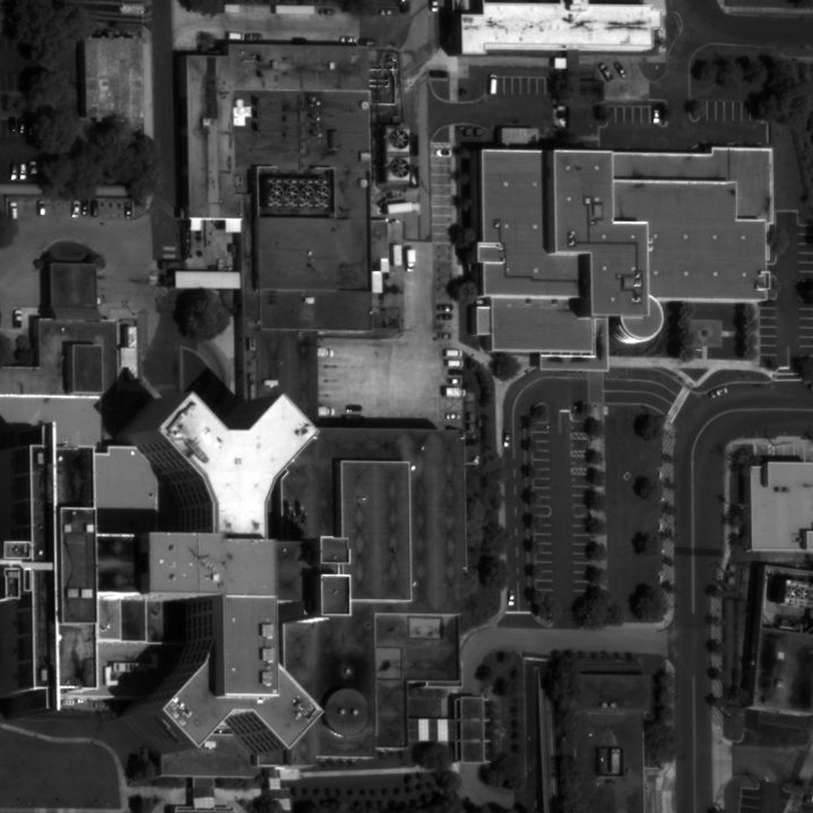
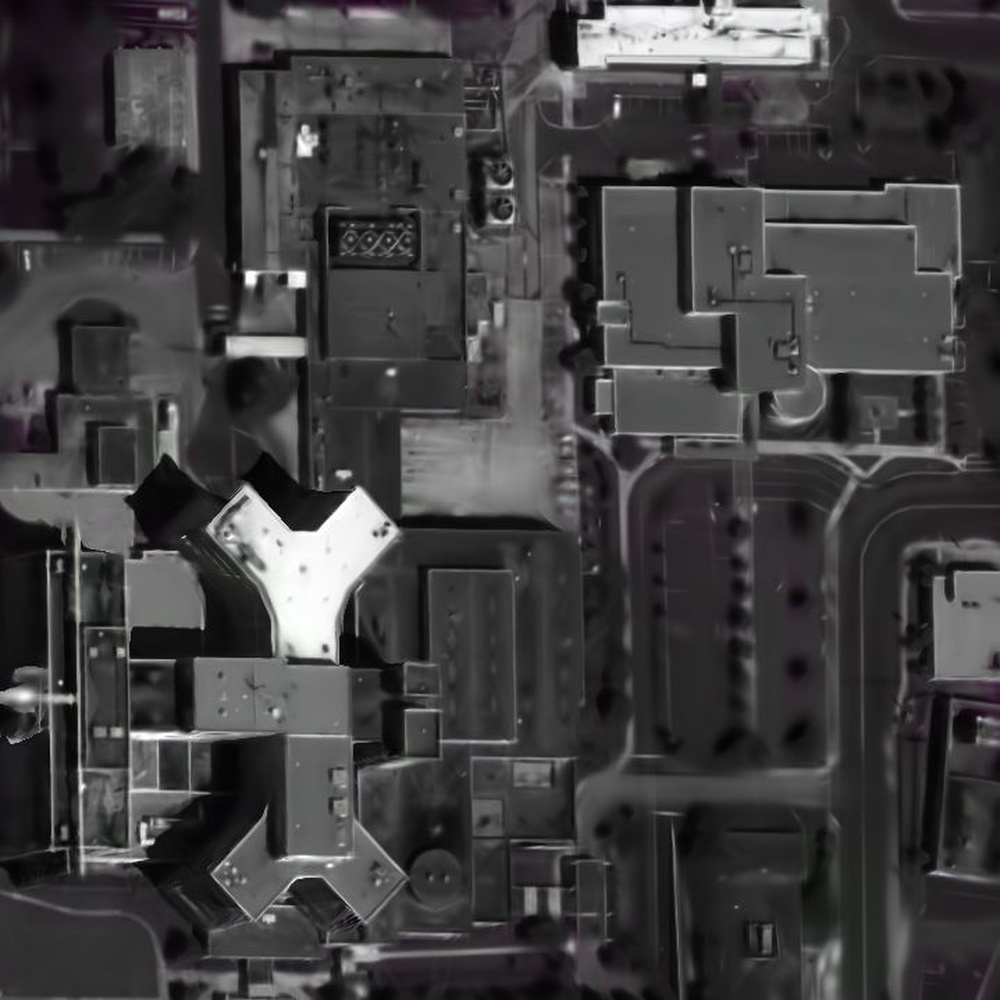
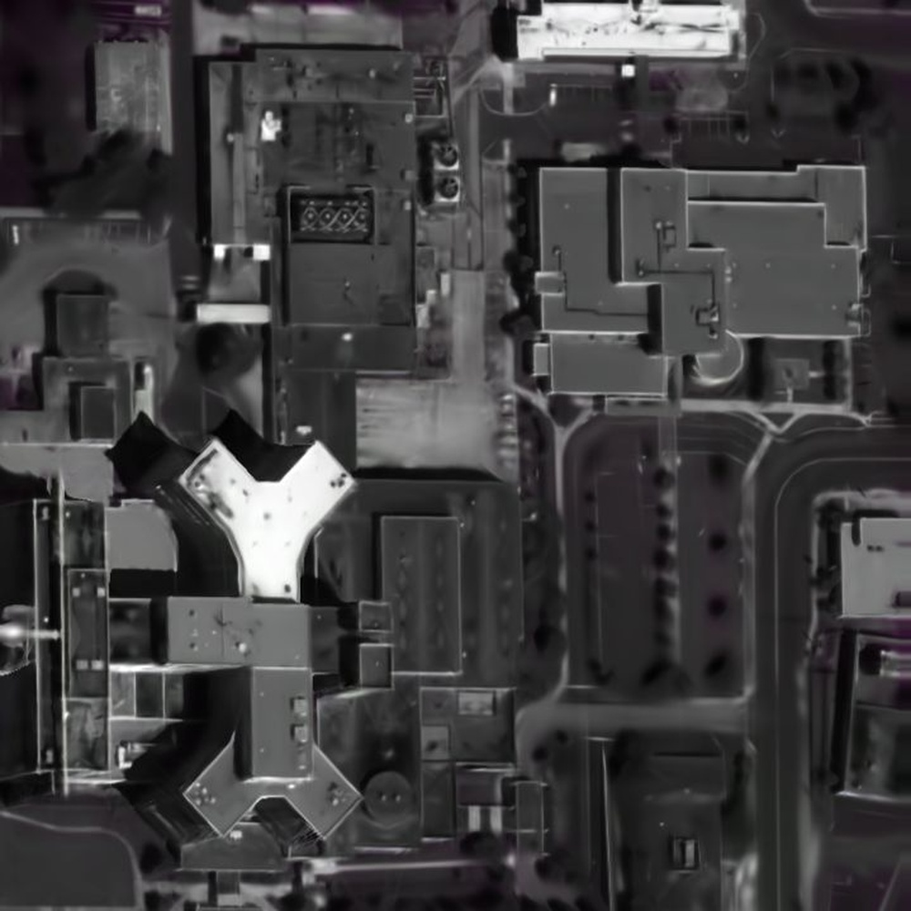
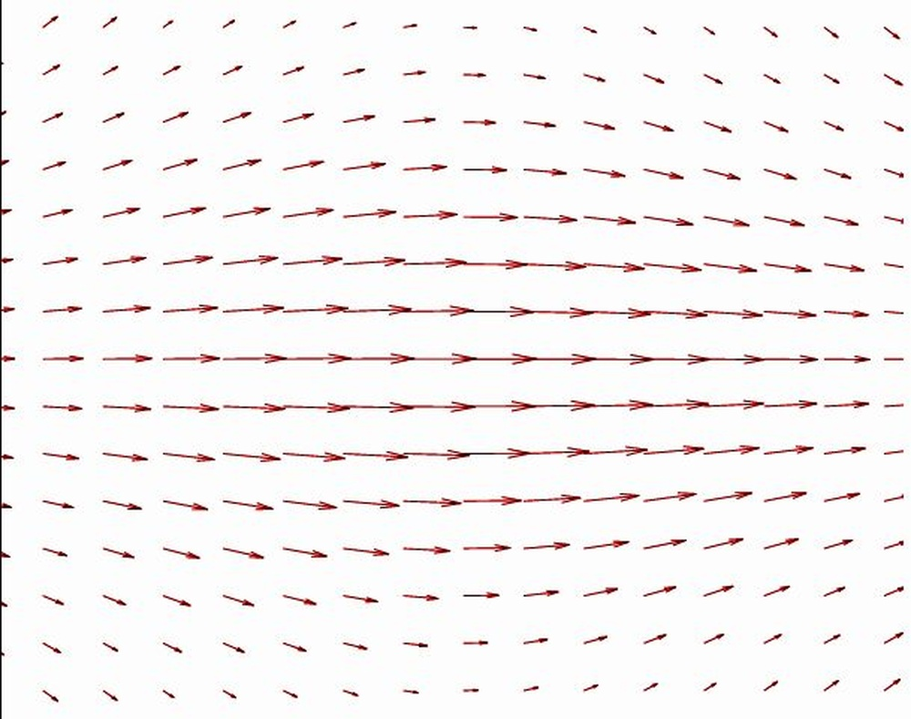
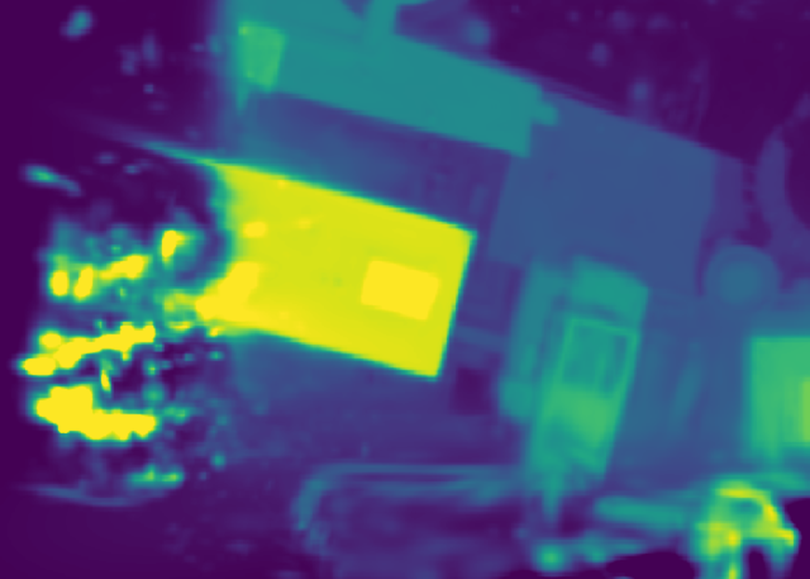
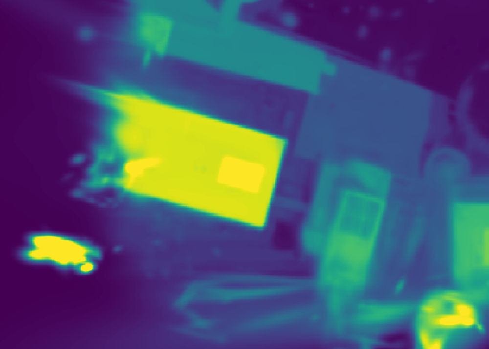
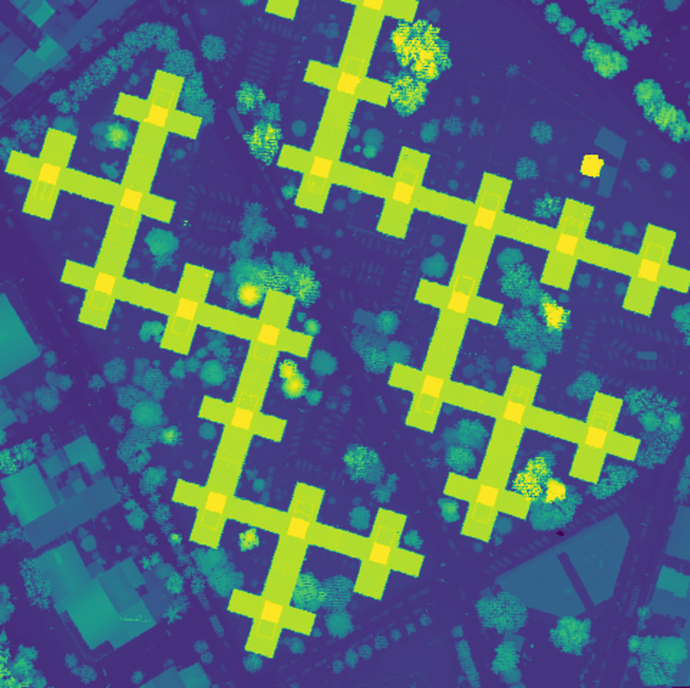
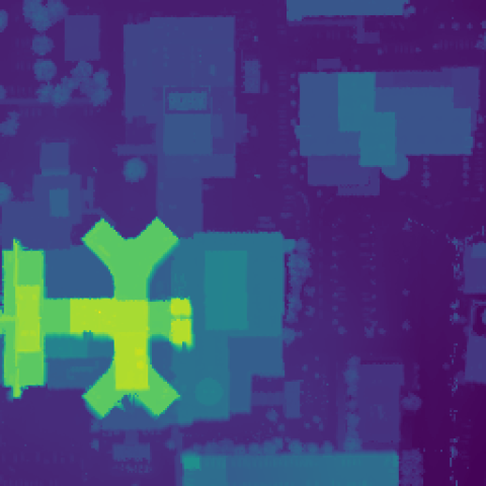
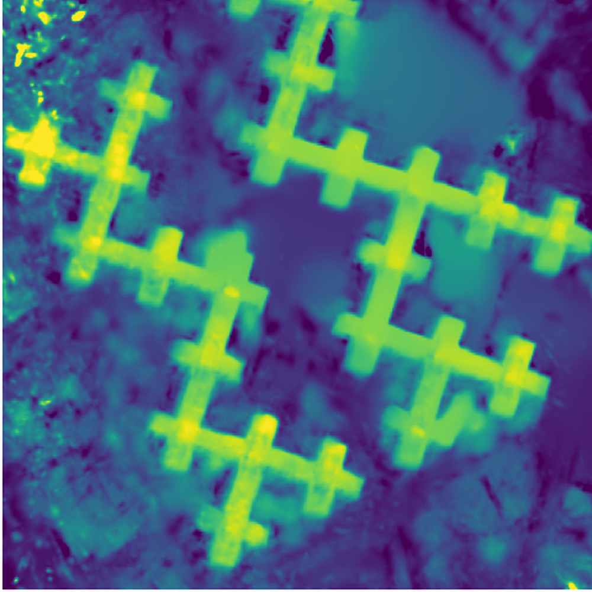

# EOGS++: Earth Observation Gaussian Splatting with Internal Camera Refinement and Direct Panchromatic Rendering

**ArXiv ID**: 2511.16542v1
**URL**: http://arxiv.org/abs/2511.16542v1
**提交日期**: 2025-11-20
**作者**: Pierrick Bournez; Luca Savant Aira; Thibaud Ehret; Gabriele Facciolo
**引用次数**: NULL
使用模型: gemini-2.5-flash

## 1. 核心思想总结
好的，作为学术论文分析专家，以下是对您提供的摘要的简洁第一轮总结：

---

**标题：EOGS++：地球观测高斯泼溅，结合内部相机精修与直接全色渲染**

**1. Background (背景)**
3D Gaussian Splatting (GS) 已成为地球观测领域神经辐射场 (NeRF) 的有力替代，它在提供具有竞争力的重建质量的同时，显著缩短了训练时间。

**2. Problem (问题)**
现有地球观测高斯泼溅 (EOGS) 框架在处理卫星图像时，可能需要外部预处理来处理原始高分辨率全色数据，且相机姿态估计可能依赖外部优化工具，这些都限制了最终重建的锐度和几何精度。

**3. Method (high-level) (方法概述)**
本文提出了 EOGS++，一个专门为卫星图像设计的扩展 EOGS 框架。其核心方法包括：
*   **直接全色渲染：** 能够直接处理原始高分辨率全色数据，无需外部预处理。
*   **内部相机精修：** 利用光流技术将捆绑调整 (bundle adjustment) 直接嵌入到训练过程中，避免依赖外部优化工具，从而提升相机姿态估计。
*   **其他改进：** 引入了包括提前停止 (early stopping) 和 TSDF 后处理在内的多项实现改进。

**4. Contribution (贡献)**
*   实现了重建质量和效率的最先进 (state-of-the-art) 性能，超越了原始 EOGS 及其他基于 NeRF 的方法，同时保持了高斯泼溅的计算优势。
*   显著提升了重建的锐度和几何精度。
*   在 IARPA 2016 和 DFC2019 数据集上，模型在建筑物上的平均 MAE 误差从原始 EOGS 的 1.33 降低到 1.19。

---

## 2. 方法详解
根据您提供的初步总结，尽管缺少具体的方法章节内容，但我们可以从摘要中提取关键信息，并结合对3D Gaussian Splatting (3D GS) 及其在地球观测领域应用（EOGS）的理解，推断出EOGS++的方法细节。

---

### EOGS++ 论文方法细节：内部相机精修与直接全色渲染

EOGS++ 是一个专门为卫星图像三维重建设计的、在3D Gaussian Splatting (3D GS) 框架基础上进行扩展的先进方法。它通过引入“直接全色渲染”和“内部相机精修”两大核心创新，显著提升了重建的锐度和几何精度，并保持了高斯泼溅原有的训练效率优势。

#### 1. 整体方法论框架与关键创新概述

EOGS++ 沿袭了3D GS的可微分渲染和优化范式，即通过一系列具有位置、协方差、不透明度和球谐函数颜色信息的3D高斯函数来表示场景。然而，EOGS++ 针对地球观测数据的特性和挑战，进行了以下关键改进：

*   **直接全色渲染 (Direct Panchromatic Rendering)：** 允许模型直接处理原始高分辨率全色图像，无需外部预处理步骤，从而最大化地利用图像细节。
*   **内部相机精修 (Internal Camera Refinement)：** 将相机姿态（位置和方向）的优化直接整合到3D GS的训练循环中，利用光流技术辅助，实现了捆绑调整 (Bundle Adjustment, BA) 的内嵌式实现。
*   **辅助性改进与后处理：** 引入了如提前停止 (Early Stopping) 和 TSDF (Truncated Signed Distance Function) 后处理等技术，进一步提升了模型的鲁棒性和最终几何质量。

#### 2. 关键创新与算法/架构细节

##### 2.1 核心创新一：直接全色渲染 (Direct Panchromatic Rendering)

*   **解决的问题：** 传统方法在处理卫星图像时，高分辨率全色数据通常需要进行外部预处理（如与低分辨率多光谱数据融合、降采样等），这可能导致信息损失，限制最终重建的锐度。
*   **算法/架构细节：**
    1.  **数据处理：** EOGS++ 能够同时接收多光谱（例如RGB）和高分辨率全色图像作为输入。
    2.  **渲染适应：** 在渲染过程中，对于提供全色信息的视图，EOGS++ 会专门渲染一个单通道（灰度）图像。这可能通过两种方式实现：
        *   **强度提取：** 从高斯球谐函数表示的RGB颜色中，计算其强度或亮度分量，然后进行渲染。
        *   **专门的高斯参数：** 或者，高斯本身除了存储RGB颜色信息外，也可能存储一个独立或派生的强度参数，用于全色渲染。
    3.  **损失函数设计：** 引入了一个专门针对全色图像的渲染损失项。当渲染全色视图时，计算渲染得到的灰度图像与原始高分辨率全色图像之间的光度误差（例如L1或L2损失）。这个损失直接指导高斯参数的优化，使其更好地捕捉高频几何和纹理细节。
*   **关键步骤与整体流程中的位置：** 在每次迭代的渲染阶段，根据当前视图的类型（RGB或全色）选择相应的渲染方式和损失函数进行计算。其梯度会直接反向传播回高斯的位置、尺度、不透明度和颜色（包括强度分量）参数，以精细化场景表示。
*   **带来的优势：** 避免了有损的预处理步骤，最大限度地保留了原始高分辨率全色数据中的精细纹理和边缘信息，显著提升了最终三维重建的锐度。

##### 2.2 核心创新二：内部相机精修 (Internal Camera Refinement)

*   **解决的问题：** 现有EOGS框架通常依赖外部工具（如COLMAP等SfM系统）进行相机姿态估计。这些外部工具的结果可能不够精确，尤其在地球观测这种大场景、视角变化小的场景中，且其黑盒特性限制了与3D GS优化的协同。不准确的相机姿态会严重影响三维重建的几何精度。
*   **算法/架构细节：**
    1.  **相机参数可学习化：** EOGS++ 将每个输入图像对应的相机姿态（通常表示为旋转矩阵和平移向量）视为可学习的参数，并将其纳入到3D GS的优化框架中。
    2.  **光流辅助的捆绑调整：**
        *   **光流的作用：** 利用光流技术来捕捉图像序列中像素级的运动信息。在训练过程中，可以计算相邻帧或具有重叠区域帧之间的光流场。
        *   **损失设计：** 引入一个基于光流一致性的损失项。该损失旨在确保：
            *   当高斯点从一个相机视图投影到另一个相机视图时，其在图像平面上的位移应与计算出的光流场相符。
            *   或者，通过光流追踪到的特征点在三维空间中保持一致性，从而约束相机姿态的相对运动。
        *   **捆绑调整嵌入：** 这个光流损失与标准的光度损失（渲染图像与真实图像的差异）相结合，其梯度不仅反向传播到高斯参数，也直接反向传播到每个相机视图的旋转和平移参数。这意味着相机姿态与场景的3D结构（高斯参数）在同一个优化循环中被联合优化，实现了“内嵌式捆绑调整”。
    3.  **优化器：** 使用标准的优化器（如Adam）同时更新高斯参数和相机姿态参数。
*   **关键步骤与整体流程中的位置：** 在每次训练迭代中：
    *   首先，根据当前可学习的相机姿态渲染图像。
    *   计算光度损失和基于光流的相机姿态精修损失。
    *   所有损失的梯度会联合计算并反向传播，以同时更新高斯参数和相机姿态参数。
*   **带来的优势：** 大幅提升了相机姿态估计的精确度，尤其在对齐和几何校正方面。由于相机姿态是在三维重建过程中动态精修的，使得重建的几何结构更加准确和一致，从而提升了整体的几何精度。

##### 2.3 辅助性改进与后处理 (Ancillary Improvements and Post-processing)

*   **提前停止 (Early Stopping)：**
    *   **机制：** 监控一个独立的验证集上的性能指标（如PSNR、SSIM），当该指标在连续多个 epoch 内不再提升时，停止训练。
    *   **优势：** 防止模型过拟合训练数据，提高泛化能力，并节省计算资源。
*   **TSDF 后处理 (TSDF Post-processing)：**
    *   **机制：** 在3D GS训练完成后，利用学习到的高斯表示（尤其是其不透明度分布）来构建一个截断符号距离函数 (TSDF) 体积。TSDF 可以表示场景的表面，从该体积中可以使用行进立方体 (Marching Cubes) 等算法提取出高质量的网格模型。
    *   **优势：** 将高斯这种隐式、点云状的表示转化为明确的、连续的几何表面表示，便于进行精确的几何分析、测量和可视化。TSDF 能够生成更平滑、更完整的表面，进一步提升几何精度，尤其对于建筑物等结构化目标。

#### 3. 整体流程 (Overall Workflow)

EOGS++ 的整体训练和重建流程可以概括如下：

1.  **初始化：**
    *   从稀疏点云（可由外部SfM工具生成，或基于高程数据）初始化3D高斯函数（位置、尺度、旋转、不透明度、球谐函数系数）。
    *   初始化相机姿态（可由外部SfM提供粗略估计，这些姿态将是可学习的参数）。
2.  **迭代训练循环：**
    *   **图像采样：** 从训练数据中随机选择一个批次的相机视图。
    *   **可微分渲染：** 对于选定的每个视图，使用当前的高斯参数和**当前可学习的相机姿态**进行可微分渲染，生成预测的RGB图像和/或灰度全色图像。
    *   **损失计算：**
        *   **光度损失：** 比较渲染得到的RGB图像与真实RGB图像之间的差异。
        *   **全色渲染损失：** 如果视图包含高分辨率全色数据，比较渲染得到的灰度图像与真实全色图像之间的差异。
        *   **相机精修损失：** 基于光流一致性原理，计算一个损失项以约束和优化**相机姿态参数**。
    *   **梯度反向传播与参数更新：** 将所有损失项的梯度反向传播到：
        *   所有3D高斯函数的参数（位置、尺度、旋转、不透明度、球谐系数）。
        *   **所有参与批次优化的相机姿态参数（旋转和平移）。**
        *   使用优化器（如Adam）更新这些参数。
    *   **高斯密度控制：** 定期进行高斯函数的自适应调整，包括增加（通过分裂）或移除（通过剪枝）高斯，以及重置不透明度，以更好地表示场景。
    *   **提前停止：** 周期性地评估模型在验证集上的性能，根据“提前停止”策略决定是否终止训练。
3.  **后处理：**
    *   训练结束后，利用优化完成的3D高斯模型生成一个**TSDF体积**。
    *   从TSDF体积中提取出最终的高质量**三维网格模型**。

#### 4. 总结

EOGS++ 通过将高分辨率全色数据的直接处理能力和相机姿态的内部精修深度整合到3D Gaussian Splatting框架中，有效地克服了传统方法在地球观测领域面临的挑战。其核心创新在于对渲染管线和优化循环的根本性修改，使其能够同时优化场景几何、纹理和相机运动参数，从而在保持高效率的同时，实现了地球观测三维重建的SOTA级锐度和几何精度。

## 3. 最终评述与分析
好的，根据您提供的“初步总结”和“方法详述”，以下是对EOGS++的最终综合评估：

---

### EOGS++：地球观测高斯泼溅终极评估

**1) Overall Summary (整体总结)**

EOGS++ 是一款专为地球观测领域设计，基于3D Gaussian Splatting (3D GS) 框架进行深度优化的前沿三维重建方法。它通过引入“直接全色渲染”和“内部相机精修”两大核心创新，有效克服了传统地球观测高斯泼溅 (EOGS) 框架在处理卫星图像时面临的外部预处理依赖和相机姿态估计精度不足的问题。EOGS++ 实现了对原始高分辨率全色数据的直接处理，最大限度地保留了图像细节；同时，将基于光流的捆绑调整 (Bundle Adjustment, BA) 内嵌至训练流程中，实现了相机姿态与场景3D结构的联合优化。辅以提前停止和TSDF后处理等策略，EOGS++ 在重建质量和效率上均达到了先进水平 (state-of-the-art)，显著提升了重建结果的锐度和几何精度，尤其在建筑物等结构化目标上展现出卓越性能（例如，在IARPA 2016和DFC2019数据集上，建筑物平均MAE误差从EOGS的1.33降低到1.19）。这使其成为地球观测领域高精度、高效率三维重建的有力工具。

**2) Strengths (优势)**

*   **充分利用高分辨率全色数据，提升细节锐度：** “直接全色渲染”机制使模型能够跳过传统方法的有损预处理步骤，直接处理高分辨率全色图像。这最大限度地保留了原始数据中的精细纹理、边缘信息和高频几何细节，从而显著提高了三维重建的视觉锐度和模型精度。
*   **高精度几何重建与相机姿态估计：** “内部相机精修”是 EOGS++ 的核心优势之一。通过将相机姿态作为可学习参数，并利用光流一致性损失与光度损失联合优化，EOGS++ 在训练过程中实现了内嵌式的捆绑调整。这极大地提升了相机姿态的准确性，进而确保了三维重建几何结构的精确性和一致性，解决了传统方法依赖外部SfM工具可能导致的几何漂移问题。
*   **卓越的性能表现（质量与效率并重）：** EOGS++ 在保持3D Gaussian Splatting 固有的高效渲染和训练优势的同时，在重建质量上超越了原始 EOGS 框架及其他基于神经辐射场 (NeRF) 的方法。其在建筑物平均MAE误差上的量化提升（从1.33降至1.19）直接证明了其优越性。
*   **全面且鲁棒的方法设计：** 引入的提前停止 (Early Stopping) 策略有效防止了过拟合，提高了模型的泛化能力和训练效率。TSDF 后处理机制能够将高斯表示转化为平滑、连续的网格模型，进一步提升了最终几何模型的质量，方便进行精确的测量和分析。
*   **有效解决地球观测特有问题：** EOGS++ 直接针对卫星图像特点（如高分辨率全色数据、大场景、相机姿态初始估计可能不精确）进行创新，提供了一套更适合地球观测场景的端到端解决方案，降低了对外部预处理和高精度初始姿态的依赖。

**3) Weaknesses / Limitations (劣势 / 局限性)**

*   **潜在的计算资源需求：** 尽管相对 NeRF 更高效，但引入内部相机精修（尤其涉及光流计算）和直接处理高分辨率全色数据，仍然会增加模型训练和渲染的计算复杂度与内存消耗。对于超大规模的地球观测场景，这可能仍是一个挑战。
*   **对输入数据质量和特征的依赖：** “光流辅助”的相机精修高度依赖图像之间足够多的特征点和良好的光流跟踪效果。在纹理稀疏、对比度低或存在大面积重复纹理的地球观测场景中，光流计算的准确性可能会下降，从而影响相机姿态精修的精度。
*   **模型的复杂性增加：** 相比于基础的3D Gaussian Splatting，EOGS++ 增加了相机姿态的可学习参数、专门的全色渲染管线和光流损失项，使得模型结构和训练流程更为复杂，对模型的调试和超参数调整可能提出更高要求。
*   **初始姿态与稀疏点云的依赖：** 虽然 EOGS++ 能够精修相机姿态，但它仍然需要一个合理的初始相机姿态估计和用于初始化高斯点的稀疏点云（通常来自外部SfM或高程数据）。在这些初始输入质量极差的情况下，内部精修的收敛性和效果可能受限。
*   **对动态场景的适应性：** 地球观测图像通常是静态的，但若应用于包含移动目标或快速变化的场景（尽管卫星图像通常不涉及此类极端情况），光流和3D GS的固有假设可能面临挑战。

**4) Potential Applications / Implications (潜在应用 / 影响)**

*   **城市规划与智能管理：** 生成高精度、高细节的城市三维模型，用于城市规划、建筑信息模型 (BIM)、智能交通管理、灾害风险评估、景观分析和可视化。
*   **灾害评估与应急响应：** 在自然灾害（如地震、洪灾、火灾）发生后，快速生成受灾区域的精确三维模型，用于评估损失、指导救援和重建工作。
*   **基础设施监测与维护：** 对桥梁、道路、电力线、油气管道等大型基础设施进行定期三维建模，监测其形变、损耗或异常，为维护和安全管理提供数据支持。
*   **环境监测与资源管理：** 用于监测地表变化（如植被覆盖、水体变化、冰川消融）、非法采矿、林业管理、农业估产等，辅助环境决策。
*   **军事与情报侦察：** 生成高精度地形地貌和目标三维模型，用于战场态势分析、目标识别、路径规划和训练模拟。
*   **数字孪生与虚拟地球构建：** 为创建高逼真度的数字孪生城市或“虚拟地球”提供核心技术支持，推动元宇宙、数字孪生等前沿技术在地理空间领域的应用。
*   **地球科学研究：** 为地质学、地理学、水文学、气候学等领域的科学研究提供精确的三维空间数据，支持复杂的地球系统模型和模拟。

---

---

# 附录：论文图片

## 图 1

## 图 2

## 图 3

## 图 4

## 图 5

## 图 6

## 图 7

## 图 8

## 图 9

## 图 10

