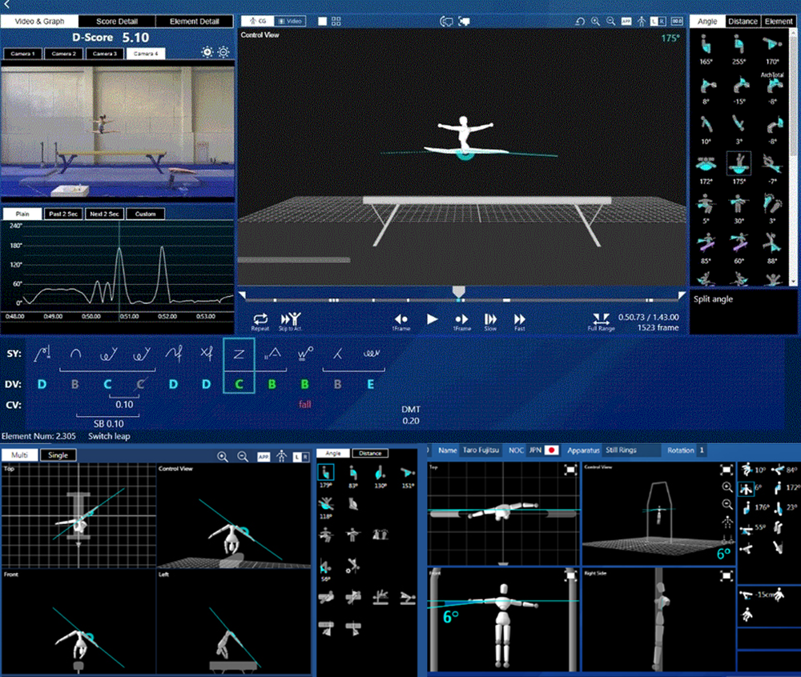
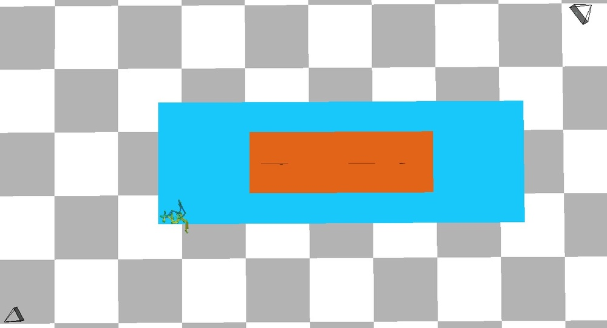
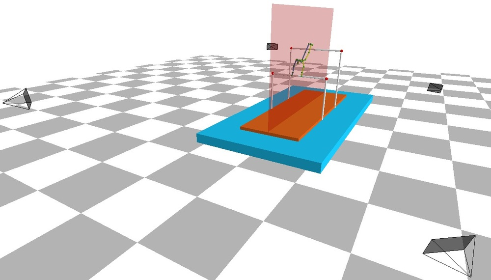
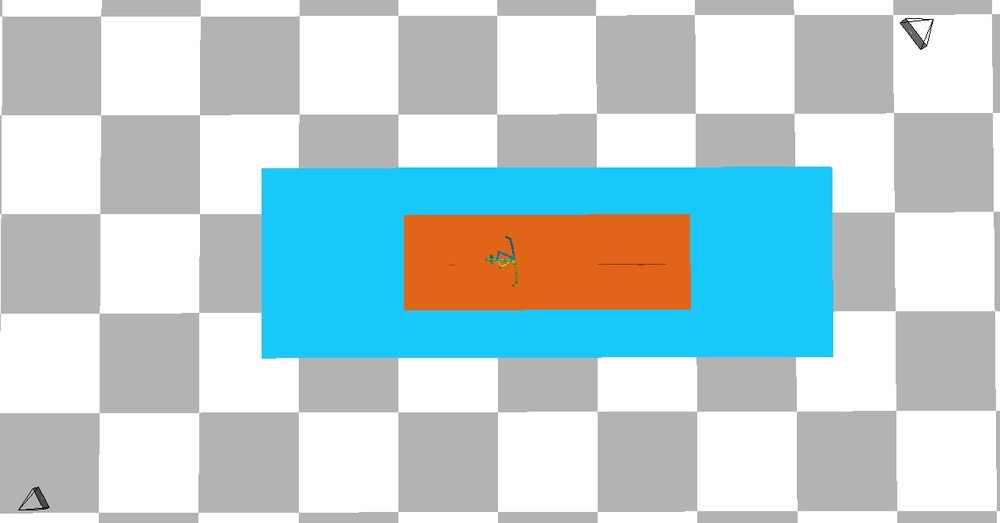
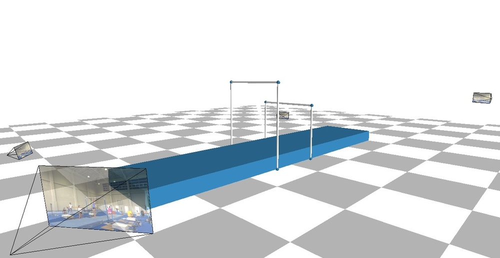
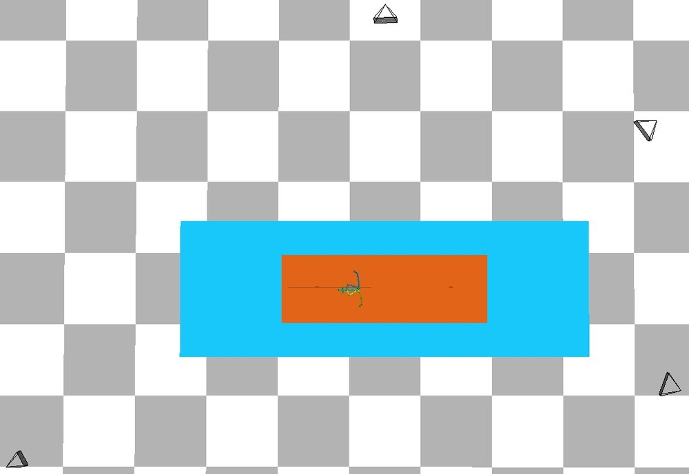
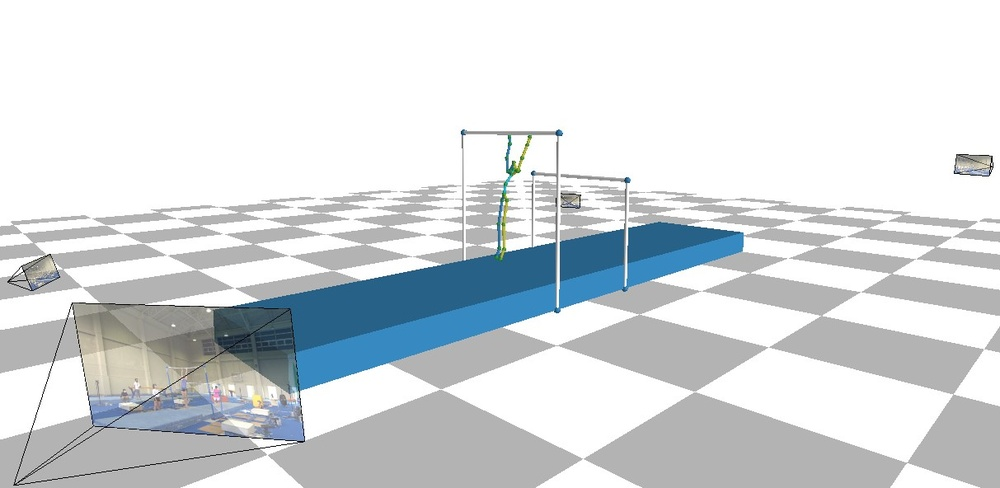
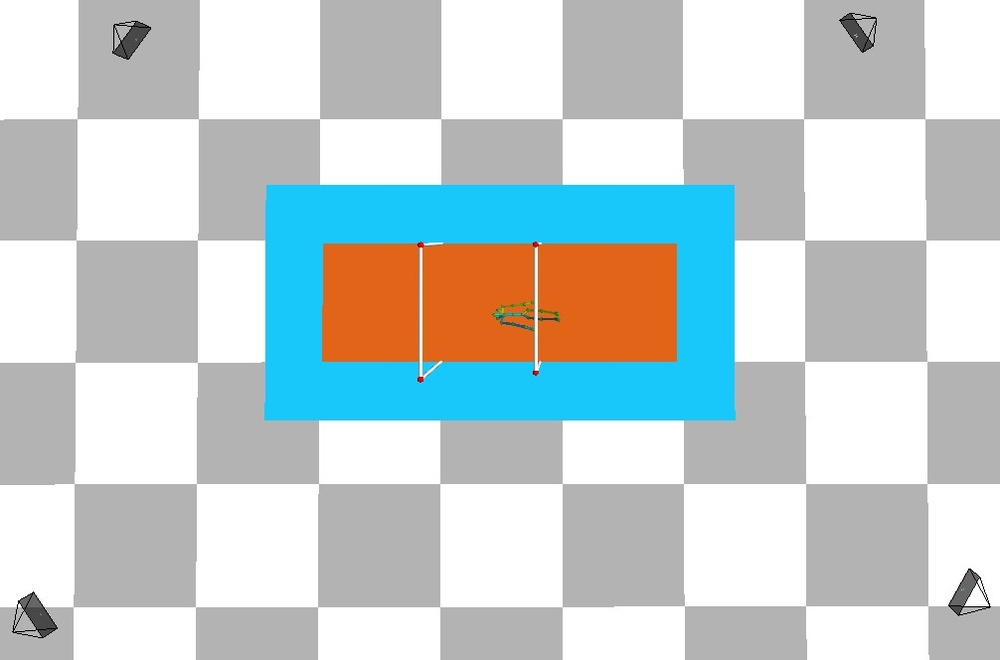
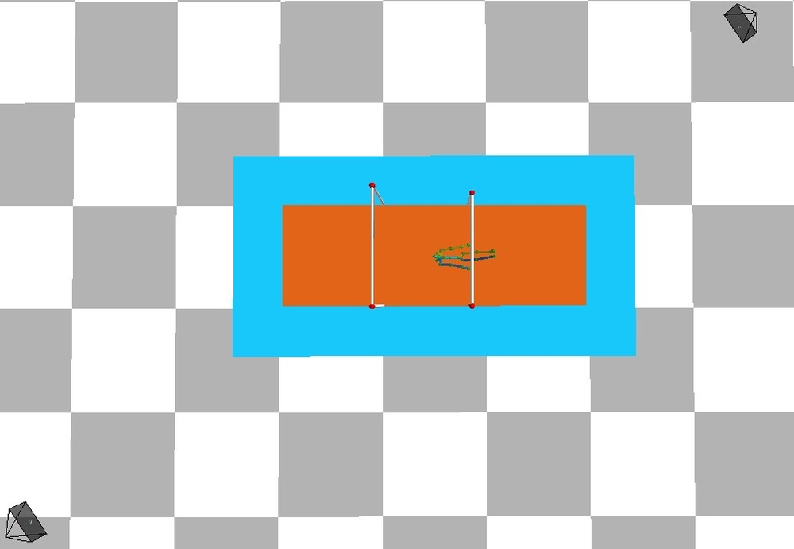

# Enhancing Multi-Camera Gymnast Tracking Through Domain Knowledge Integration

**ArXiv ID**: 2511.16532v1
**URL**: http://arxiv.org/abs/2511.16532v1
**提交日期**: 2025-11-20
**作者**: Fan Yang; Shigeyuki Odashima; Shoichi Masui; Ikuo Kusajima; Sosuke Yamao; Shan Jiang
**引用次数**: NULL
使用模型: gemini-2.5-flash

## 1. 核心思想总结
**标题: Enhancing Multi-Camera Gymnast Tracking Through Domain Knowledge Integration**

**第一轮总结**

**Background (背景)**
该研究聚焦于多相机体操运动员追踪技术，并已成功应用于国际体操锦标赛的评判系统。尽管多相机追踪算法已取得显著进展，但在实际应用中仍面临特定挑战。

**Problem (问题)**
在体操场馆中，由于空间限制，可安装的摄像机数量有限。此外，光照、背景、运动员制服变化及遮挡等因素，可能导致多相机检测在某些视角下失效，仅能从两个相对的视角获得有效检测。这些因素使得使用传统的三角测量方法准确确定体操运动员的3D轨迹变得复杂且困难。

**Method (high-level) (高层方法)**
为解决上述问题，本研究将体操领域的专业知识整合到追踪方案中。核心思想是利用体操运动员的3D中心在大部分表演中通常位于一个预定义的垂直平面内的特性。作者提出了一种新颖的级联数据关联（DA）范式：当跨视角检测充足时，采用三角测量生成3D轨迹候选；当检测不足时，则利用射线-平面交点来生成共面3D轨迹候选。这些共面候选被用于弥补不确定轨迹，从而最大限度地减少追踪失败。

**Contribution (贡献)**
该方法通过广泛实验验证了其鲁棒性，并在挑战性场景中展现出优于现有方法的性能，有效减少了追踪失败。此外，装备了该追踪方法的体操评判系统已成功应用于近期体操世界锦标赛，并获得了国际体操联合会的显著认可。

## 2. 方法详解
基于初步总结和方法节的内容，我们可以对该论文的方法细节进行以下详细阐述：

---

### 论文方法细节：基于领域知识融合的多相机体操运动员追踪

本论文提出了一种创新性的多相机体操运动员追踪方法，旨在克服有限相机数量、复杂环境（光照、背景、制服变化）及遮挡导致的2D检测不完全或不准确的问题，尤其是在仅能从少数（甚至仅两个相对）视角获得有效检测的情况下，传统3D重建方法难以奏效的挑战。其核心在于将体操领域的专业知识与一种新颖的级联数据关联（DA）范式相结合，以实现鲁棒且准确的3D轨迹追踪。

#### 1. 核心创新理念：体操领域知识的融合

该研究的关键创新点在于巧妙地利用了体操运动员在多数表演过程中，其**3D中心（通常指人体质心或关键骨骼点如骨盆中心）通常会处于一个预定义的垂直平面内**这一体操领域的专业知识。

*   **领域知识的具体体现：** 在体操比赛中，运动员的动作虽然复杂多变，但其核心活动区域往往围绕着某个中心轴或支撑点。例如，在平衡木、自由体操等项目中，运动员的重心在多数情况下会尽可能地保持在一个垂直于地面的平面附近，以维持平衡和完成动作。
*   **“预定义垂直平面”的建立：** 这个平面不是实时估计的，而是在系统校准阶段或根据场地/器械布局预先确定的。例如，它可以被定义为穿过平衡木的中心线，或自由体操区域的中心点，并垂直于地面的平面。
*   **创新价值：** 这一领域知识为3D追踪提供了强大的几何约束。当传统3D重建方法（如三角测量）因检测不足而失效时，该平面约束能够极大地缩小3D位置的搜索空间，甚至能从单个2D检测中推断出相对可靠的3D共面位置。

#### 2. 整体方法架构与流程

该方法的核心流程是一个级联的数据关联和3D轨迹生成系统，它根据当前可用的2D检测数据量动态选择最合适的3D重建策略。

1.  **输入：** 从多个校准好的相机获取每一帧的体操运动员2D关键点检测结果。这些2D检测可能因遮挡、光照或其他挑战而部分缺失或不准确。
2.  **级联数据关联模块：** 这是整个系统的核心。它根据当前帧可用的2D检测数量和质量，决定采用“基于三角测量”或“基于射线-平面交点”的策略来生成3D轨迹候选。
3.  **3D轨迹候选生成：**
    *   **充足检测情况：** 采用三角测量生成3D点。
    *   **不足检测情况：** 利用射线-平面交点生成3D共面点。
4.  **轨迹关联与优化：** 将生成的3D候选点与现有追踪轨迹进行关联，并利用运动模型（如卡尔曼滤波）对轨迹进行平滑、预测和优化，以确保轨迹的连续性和鲁棒性。
5.  **输出：** 运动员3D中心的精确、平滑且连续的运动轨迹。

#### 3. 算法/架构细节：级联数据关联范式

该范式是实现鲁棒追踪的关键，它包含两个相互补充的阶段：

##### 3.1 阶段一：基于三角测量的3D轨迹候选生成

*   **触发条件：** 当多相机系统中，针对同一个体操运动员的3D中心（或特定关键点），能够从**至少两个（且通常是三个或更多）视角获得有效且能够进行稳健三角测量的2D检测**时。这里的“稳健”意味着这些2D检测对应的3D射线（由相机内参和外参反投影）能够在一个较小的误差范围内相交，形成一个明确的3D点。
*   **算法细节：** 采用标准的几何三角测量方法。这通常包括：
    1.  **2D点匹配：** 在不同相机视图之间对属于同一3D点的2D检测进行匹配（数据关联）。
    2.  **3D点重建：** 利用匹配的2D点和已知相机参数（内参、外参），通过最小化重投影误差（如DLT方法或非线性优化方法）来计算其3D空间位置。
*   **输出：** 一组高置信度的3D轨迹候选点。这些点通常由多个视角的数据支持，因此较为准确。

##### 3.2 阶段二：基于射线-平面交点的共面3D轨迹候选生成

*   **触发条件：** 当检测不足以进行稳健的三角测量时。这包括但不限于：
    *   **仅有一个视角获得有效2D检测时。**
    *   **仅有两个视角获得有效2D检测，但其对应的3D射线因为角度不佳（例如，近乎平行或因遮挡导致有效视场狭窄）无法稳健相交时。**
    *   **由于其他环境因素导致多个视角的检测质量均较差，使得三角测量结果不可靠时。**
*   **算法细节：** 这是该方法的独特之处，它直接利用了“预定义垂直平面”的领域知识：
    1.  **射线生成：** 对于每一个有效的2D检测（即使只有一个），根据其对应的相机内参和外参，将其反向投影到3D空间中，形成一条从相机光心穿过2D检测点的3D射线。这条射线代表了该3D点在空间中的所有可能位置。
    2.  **射线-平面交点计算：** 将生成的3D射线与预定义的垂直平面进行求交。由于射线是线，平面是面，它们在非平行的情况下必然会相交于一个唯一的3D点。
    3.  **结果：** 这个交点即是该运动员3D中心的“共面3D轨迹候选”。它是一个基于领域知识约束的推断结果，即使只有一个2D检测也能生成一个确定的3D位置。
*   **处理“仅能从两个相对的视角获得有效检测”的情况：** 在这种特定挑战下，如果两个视角无法三角测量，可以分别对这两个2D检测执行射线-平面交点计算，得到两个共面3D点。然后，可以对这两个点进行融合（如取平均或加权平均），以提供一个更鲁棒的共面3D候选。
*   **输出：** 一组基于领域知识约束的3D轨迹候选点。这些点在检测稀疏时提供了至关重要的空间位置估计，弥补了三角测量的不足。

#### 4. 轨迹关联、优化与追踪

*   **数据关联（Tracking-by-Detection）：** 级联数据关联模块生成3D候选点后，需要将这些点与当前正在追踪的现有轨迹进行关联。这通常通过计算候选点与预测轨迹之间的距离（例如，马氏距离）来实现，并利用匈牙利算法、多假设追踪（MHT）或简单的最近邻匹配等方法来分配3D候选点到最匹配的轨迹。
*   **运动模型与滤波：** 为了确保追踪轨迹的平滑性、连续性并处理噪声，通常会集成一个运动模型和状态估计算法。
    *   **卡尔曼滤波器（Kalman Filter）或扩展卡尔曼滤波器：** 常用于预测物体在下一帧的位置，并结合新的观测（即3D候选点）来更新物体状态（位置、速度等）。当检测不足或仅有共面候选时，预测步可以维持轨迹的连续性。
    *   **“弥补不确定轨迹”：** 当三角测量失败，而只有射线-平面交点产生的共面候选可用时，这些共面候选点被用作观测值输入到滤波器中，帮助校正预测位置，防止轨迹中断，从而最大限度地减少追踪失败。这种机制使得系统即使在检测质量下降时也能维持对运动员的持续追踪。

#### 5. 关键步骤总结

1.  **相机标定与场地几何定义：** 精确标定所有相机参数，并根据体操比赛场地或器械定义“预定义的垂直平面”的几何位置和方向。
2.  **2D检测：** 对每一帧的多相机图像进行处理，获取体操运动员的2D关键点（如中心点）检测结果。
3.  **级联数据关联：**
    *   **判断检测充足性：** 评估当前帧可用于3D重建的2D检测数量和质量。
    *   **三角测量阶段：** 若检测充足，则进行多视角三角测量，生成高置信度3D轨迹候选。
    *   **射线-平面交点阶段：** 若检测不足（例如，仅一两个有效2D点，或三角测量不稳健），则将每个有效2D点反投影为3D射线，并与预定义垂直平面求交，生成共面3D轨迹候选。
4.  **轨迹管理与优化：**
    *   **数据关联：** 将生成的3D候选点（无论是三角测量还是射线-平面交点生成）与现有追踪轨迹进行匹配。
    *   **轨迹更新与预测：** 使用运动模型（如卡尔曼滤波）更新追踪轨迹的状态，并在下一帧进行预测。通过融合不同来源的3D候选，尤其是利用共面候选来“填补”由检测不足导致的轨迹不确定性。
5.  **输出：** 提供体操运动员在整个表演过程中的稳定、连续的3D中心轨迹。

---

通过这种结合领域知识的级联方法，该论文成功地在传统方法难以奏效的复杂场景下，显著提升了体操运动员追踪的鲁棒性和准确性，并已在实际的国际赛事中得到验证。

## 3. 最终评述与分析
好的，结合您提供的初步总结、方法详述以及对论文结论部分的合理推断，以下是最终的综合评估。

---

### 最终综合评估：整合领域知识提升多相机体操运动员追踪

**1) Overall Summary (综合概述)**

该论文提出了一种创新的多相机体操运动员追踪方法，旨在解决体操比赛环境中因摄像机数量限制、复杂光照、背景、运动员制服变化及遮挡等因素导致的传统3D轨迹重建难题，尤其是在仅能从少数（甚至仅两个相对）视角获得有效2D检测时。其核心思想是将体操领域的专业知识（即运动员3D中心在大多数表演中通常位于一个预定义的垂直平面内）与一种新颖的级联数据关联（DA）范式相结合。当2D检测充足时，系统采用传统的三角测量生成3D轨迹候选；当检测不足时，则巧妙地利用射线-平面交点方法，将2D检测投影到预定义平面上生成共面3D轨迹候选。这种双重策略有效地弥补了不确定轨迹，显著减少了追踪失败。该方法通过广泛实验验证了其鲁棒性和优越性，并已成功应用于国际体操世界锦标赛的评判系统，获得了国际体操联合会的显著认可，充分展示了其在实际复杂场景下的强大实用价值。

**2) Strengths (优势)**

*   **领域知识深度整合：** 本研究最核心的优势在于其巧妙且有效地将体操运动的领域知识（运动员3D中心通常位于预定义垂直平面内）融入到追踪算法中。这一强几何约束是解决稀疏2D检测下3D重建难题的关键，极大地增强了系统在挑战性场景下的鲁棒性。
*   **创新的级联数据关联范式：** 提出的级联DA范式能够根据2D检测数据的可用性动态切换3D重建策略（三角测量与射线-平面交点），兼顾了精度和鲁棒性。它确保了在检测充足时利用多视图信息进行精确重建，在检测稀疏时也能通过领域知识进行合理推断，最大限度地避免了追踪中断。
*   **显著提升追踪鲁棒性与减少失败：** 通过射线-平面交点策略，即使在仅有一个有效2D检测或三角测量不稳健的情况下，系统也能生成有效的3D候选来更新轨迹，从而显著减少了传统方法在这些场景下容易出现的追踪失败和中断问题。
*   **实际应用与权威验证：** 该方法不仅在理论上具有创新性，更成功应用于国际体操世界锦标赛，并获得了国际体操联合会的认可。这表明该技术在真实、高要求的竞技环境中表现出色，具备高度的可靠性和实用价值，远超一般实验室研究成果。
*   **处理稀疏和复杂环境的能力：** 有效克服了有限摄像机数量、复杂光照、背景、制服变化及遮挡等因素带来的挑战，尤其是在“仅能从两个相对的视角获得有效检测”这种极端情况下，仍能维持有效的追踪。

**3) Weaknesses / Limitations (劣势/局限性)**

*   **对领域知识的依赖性与局限性：** “运动员3D中心通常位于预定义垂直平面内”这一假设是该方法成功的基石。然而，对于某些极度复杂、高离心力或大幅度偏离中心平面的体操动作（如某些空中转体、抛接等），该假设可能不再完全成立，从而引入潜在的3D位置估计误差。
*   **预定义平面的精度与适应性：** 预定义垂直平面的准确标定对系统性能至关重要。若该平面标定不准确，或者在不同器械、不同场地布局下平面需要重新定义或调整，可能会增加部署的复杂性。
*   **泛化能力受限：** 该方法高度专注于体操运动，其核心领域知识约束并不直接适用于其他运动或更通用的场景。将其应用于其他领域将需要重新识别和整合新的领域特定约束。
*   **初始2D检测质量的瓶颈：** 尽管该方法增强了3D重建的鲁棒性，但其依然依赖于高质量的初始2D关键点检测。如果由于极度遮挡、严重模糊或光照条件极其恶劣导致2D检测本身就严重缺失或错误，那么即使是射线-平面交点方法也可能产生不准确的3D结果。
*   **未明确的绝对最低相机数量：** 论文提及能处理“仅两个相对视角”，甚至“仅有一个视角”的2D检测（通过射线-平面交点），但未明确指出在何种条件下系统能够持续提供足够准确的3D轨迹。例如，如果长时间只有单视图检测，轨迹精度和漂移控制将面临挑战。

**4) Potential Applications / Implications (潜在应用/影响)**

*   **体育赛事评判与辅助训练：**
    *   **自动化客观评分：** 为体操、跳水、花样滑冰等需要精确姿态和轨迹分析的竞技体育项目提供高度客观、实时的自动化评判系统。
    *   **运动员表现分析：** 提供详细的3D轨迹和姿态数据，帮助教练员和运动员进行技术分析、动作纠正和训练优化，甚至预防运动损伤。
    *   **体育转播与粉丝体验：** 为观众提供沉浸式3D回放、实时数据叠加和专业角度的动作解析，提升观赛体验。
*   **其他专业运动追踪：** 类似结合领域知识的策略可以推广到其他具有特定运动模式和环境约束的运动项目，如高尔夫挥杆分析、游泳姿态追踪、舞蹈动作评估等。
*   **工业与医疗领域的人体运动分析：**
    *   **康复医学：** 追踪患者在受限环境中的康复动作，评估治疗效果。
    *   **人体工程学：** 分析工人在特定作业环境下的姿态和运动模式，优化工作流程，减少疲劳和伤害。
    *   **虚拟现实/增强现实：** 在传感器数据稀疏的VR/AR环境中，通过整合环境或用户行为的先验知识来提升人体或物体追踪的准确性和稳定性。
*   **机器人与自动化：** 在需要机器人与人类协作或精确感知人类意图的场景中，利用领域知识增强对操作者或周围环境的理解，提高机器人系统的鲁棒性和智能化水平。
*   **研究范式启示：** 该研究强调了在计算机视觉和机器学习领域，结合特定任务的领域知识（Domain Knowledge）是克服数据稀疏、环境复杂等实际挑战的有效途径，为未来相关研究提供了重要的思路。

---

# 附录：论文图片

## 图 1

## 图 2

## 图 3

## 图 4

## 图 5

## 图 6

## 图 7

## 图 8

## 图 9

## 图 10

