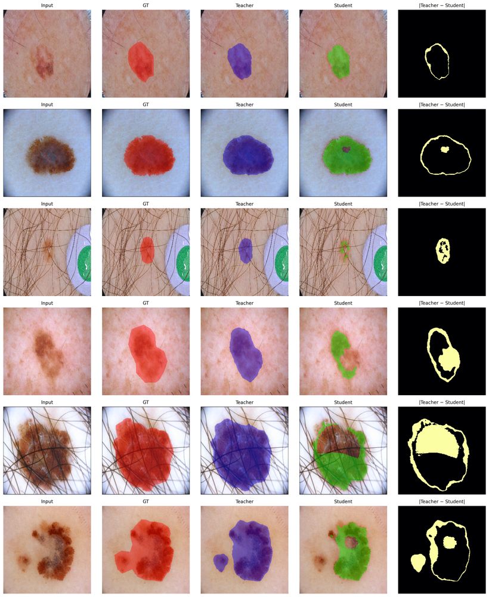
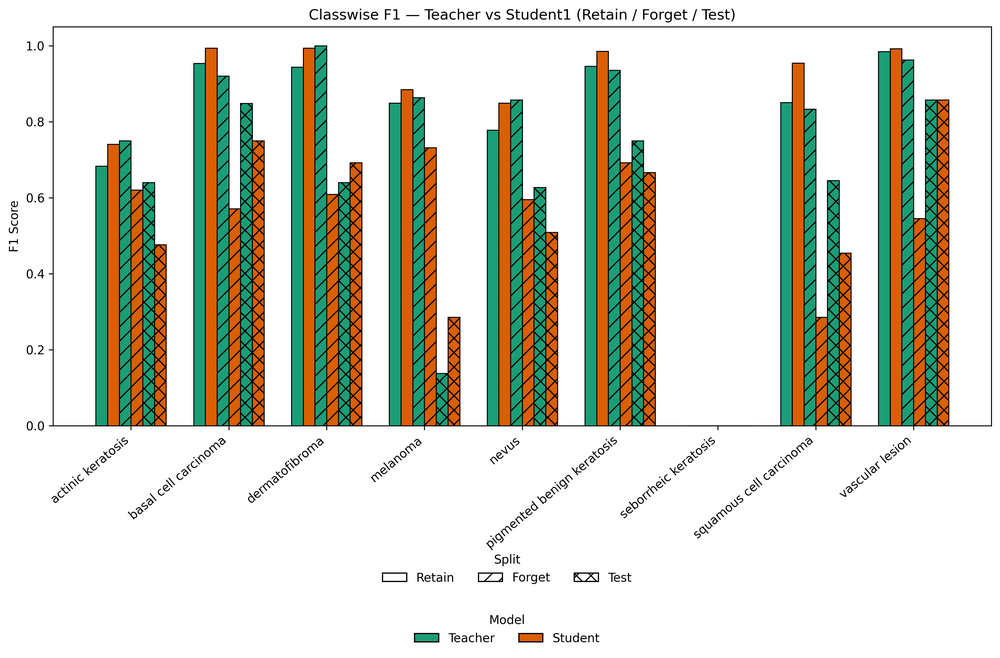
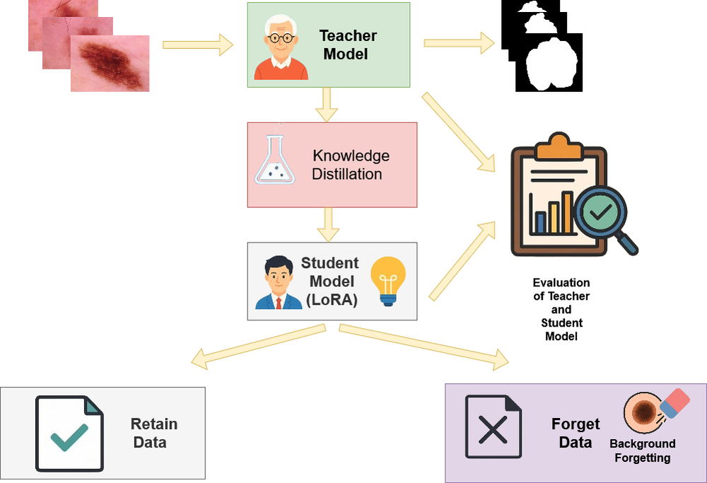

# Erase to Retain: Low Rank Adaptation Guided Selective Unlearning in Medical Segmentation Networks

**ArXiv ID**: 2511.16574v1
**URL**: http://arxiv.org/abs/2511.16574v1
**提交日期**: 2025-11-20
**作者**: Nirjhor Datta; Md. Golam Rabiul Alam
**引用次数**: NULL
使用模型: gemini-2.5-flash

## 1. 核心思想总结
**标题: Erase to Retain: 低秩适应引导的医疗分割网络选择性知识遗忘**

**Background:**
医疗分割网络中选择性地移除知识的能力日益重要，以满足隐私合规、伦理部署和持续数据集修订的需求。

**Problem:**
现有方法难以在不进行完全重训练的情况下，实现医疗图像分割网络中知识的*有针对性*和*可控*遗忘。

**Method (high-level):**
论文提出了“Erase to Retain”框架，这是一个可控的、不依赖完全重训练的医疗图像分割知识遗忘框架。该方法采用师生蒸馏范式，结合低秩适应（LoRA）约束的子空间更新，使学生网络能在低秩解码器空间中擦除病灶或类别特定的表征，同时保留全局解剖学理解。具体分为两个阶段：
1.  **强遗忘阶段：** 对LoRA模块进行对抗性优化，使其在指定的遗忘子集上与教师网络的自信预测相矛盾，强制实现语义移除。
2.  **温和恢复阶段：** 通过仅对模型头部进行监督式微调，恢复在保留数据上的泛化能力。

**Contribution:**
*   在ISIC分割任务上，成功将遗忘集IoU从0.875大幅降低至0.509，同时在保留集和验证集上保持了竞争性性能（IoU从0.647提升至0.677）。
*   在跨域CHASE数据集上，持续降低遗忘集IoU，并保持了在保留集和验证集上的实用性。
*   在ISIC分类任务上，将遗忘子集准确率从87.0%降至64.1%，同时将保留集准确率从83.9%提升至90.6%。
*   证明了基于LoRA的子空间遗忘为医疗图像分析中负责任、可控和可逆的知识遗忘提供了一条实用途径，使得模型能够在遗忘敏感样本或结构的同时，保留对关键性能的影响。

## 2. 方法详解
好的，基于您提供的初步总结和方法高层描述，以下是对该论文方法细节的详细阐述，涵盖了关键创新、算法/架构细节、关键步骤与整体流程。

---

## 论文方法细节：基于低秩适应引导的医疗分割网络选择性知识遗忘 (Erase to Retain)

本论文提出了一种新颖的“Erase to Retain”框架，旨在医疗图像分割网络中实现有针对性且可控的知识遗忘，同时避免耗费资源的完全重训练。该框架的核心思想是利用低秩适应（LoRA）技术，在网络的特定子空间内进行知识遗忘，并通过师生蒸馏范式引导遗忘过程，分阶段地实现知识的移除与保留。

### 1. 关键创新

*   **LoRA引导的子空间遗忘：** 首次将低秩适应（LoRA）技术引入到知识遗忘任务中，特别是应用于医疗分割网络的解码器部分。这种方法允许模型在低维子空间中进行局部化的参数更新，从而有针对性地擦除病灶或类别特定的表征，同时最大限度地保留预训练模型的大部分权重及其全局解剖学理解能力，避免灾难性遗忘。
*   **对抗性师生蒸馏遗忘：** 引入了一种对抗性的遗忘机制。学生网络在遗忘集上被训练去刻意生成与教师网络“自信”预测相反的结果，强制实现语义层面的移除，而非简单地忽略或性能下降。
*   **两阶段渐进式遗忘与恢复：** 将复杂的知识遗忘过程解耦为“强遗忘”和“温和恢复”两个阶段。强遗忘专注于高效地移除目标知识，而温和恢复则专注于在保留数据上恢复模型的实用性和泛化能力，形成一个平衡的遗忘策略。
*   **不依赖完全重训练：** 整个框架的设计避免了对整个网络进行从头开始的重训练，显著降低了计算成本和时间开销，使得知识遗忘在实际应用中更具可行性。

### 2. 算法/架构细节

#### 2.1 基础网络架构

本方法适用于任何预训练的深度分割网络（如U-Net、DeeplabV3+等）。在文中，该网络作为**教师网络（Teacher Network）**的基准，也是**学生网络（Student Network）**的初始化基础。

#### 2.2 低秩适应 (LoRA) 模块的集成

*   **原理：** LoRA通过在预训练权重矩阵 $W_0 \in \mathbb{R}^{d \times k}$ 旁引入两个低秩矩阵 $A \in \mathbb{R}^{d \times r}$ 和 $B \in \mathbb{R}^{r \times k}$ (其中秩 $r \ll \min(d, k)$) 来进行参数高效的微调。新的权重矩阵表示为 $W = W_0 + BA$。在训练过程中，只有 $A$ 和 $B$ 的参数被优化，而原始权重 $W_0$ 保持冻结。
*   **集成位置：** 本论文的核心是将LoRA模块集成到**分割网络的解码器（Decoder）部分**。解码器通常负责将编码器提取的高级特征映射回像素级别的分割掩码，与具体的病灶或类别表征密切相关。通过在解码器中应用LoRA，模型可以在低维子空间中精确地修改与特定语义相关的特征生成过程。
*   **作用：** 这种集成确保了遗忘操作的针对性。由于LoRA只更新少量参数，它可以在不破坏网络主体学习到的通用特征表示（通常在编码器中）的情况下，精确地调整特定知识（如特定病灶的边界或纹理特征）的生成。

#### 2.3 师生蒸馏范式

整个遗忘过程基于师生蒸馏范式。
*   **教师网络：** 原始的、性能优越的预训练分割模型。它代表了需要被选择性遗忘的全部知识。在遗忘阶段，教师网络提供“自信”的预测作为学生网络对抗性学习的目标。
*   **学生网络：** 初始化为教师网络的副本，并在其解码器中集成了可训练的LoRA模块。在强遗忘阶段，学生网络仅通过优化LoRA模块来修改其行为；在温和恢复阶段，仅优化其头部。

### 3. 关键步骤与整体流程

该框架分为两个主要阶段：**强遗忘阶段**和**温和恢复阶段**，并通过**数据划分**进行支持。

#### 3.1 数据划分

在开始遗忘过程之前，原始训练数据集被划分为三个互不重叠的子集：
*   **遗忘集 ($D_F$)：** 包含模型需要遗忘的特定知识样本（例如，特定类型的病灶图像或带有特定类别的分割掩码）。
*   **保留集 ($D_R$)：** 包含模型需要保留和继续泛化的知识样本。这部分数据用于在遗忘后恢复模型的通用性能。
*   **验证集 ($D_V$)：** 用于评估模型在遗忘和保留知识方面的性能，通常也分为遗忘验证集和保留验证集。

#### 3.2 阶段一：强遗忘阶段

**目标：** 使学生网络强制性地遗忘遗忘集 $D_F$ 上的特定知识。

**流程：**
1.  **初始化：** 学生网络被初始化为预训练好的教师网络，其解码器中嵌入了LoRA模块。**除LoRA模块参数外，所有其他参数（包括教师网络的主干和LoRA模块之前的权重）都被冻结。**
2.  **对抗性优化：** 学生网络在遗忘集 $D_F$ 上进行训练。其核心是设计一个**对抗性遗忘损失函数**，促使学生网络在 $D_F$ 上的预测与教师网络的预测产生显著差异，甚至完全相反。
    *   **教师预测：** 教师网络对 $D_F$ 中的图像 $x$ 生成自信的分割预测 $P_T(x)$。
    *   **学生预测：** 学生网络对 $x$ 生成分割预测 $P_S(x)$。
    *   **对抗性损失 ($L_{forget}$):** 该损失函数旨在最大化 $P_S(x)$ 和 $P_T(x)$ 之间的差异。例如，如果教师网络预测某个区域是病灶（类别A），则学生网络被鼓励预测该区域不是病灶，或者预测为背景（非A）。这可以通过负的交叉熵损失、KL散度或其他旨在增加预测分歧的损失来实现。
    *   **优化目标：** 仅优化LoRA模块的参数 $A$ 和 $B$。通过这种方式，LoRA模块的学习能力被引导去修改解码器的输出，使其在遗忘样本上表现出“遗忘”的行为。

**效果：** 经过此阶段后，学生网络在遗忘集 $D_F$ 上的性能将显著下降，反映出知识的成功移除。然而，由于LoRA的局部性，模型对其他通用解剖学知识的理解应保持相对完整。

#### 3.3 阶段二：温和恢复阶段

**目标：** 在遗忘知识的同时，恢复学生网络在保留集 $D_R$ 上的泛化能力，确保模型在遗忘后依然具有实用价值。

**流程：**
1.  **参数冻结：** 在此阶段，**LoRA模块的参数和网络的主干参数都被冻结。**
2.  **监督式微调：** 仅对学生网络的**头部（Model Head）**进行监督式微调。这里的“头部”通常指分割网络的最终分类层或一个轻量级的输出层，负责将解码器生成的特征图转换为最终的像素级预测。
    *   **训练数据：** 使用保留集 $D_R$ 中的图像及其对应的真实标签进行训练。
    *   **恢复损失 ($L_{recover}$):** 采用标准的分割损失函数，如交叉熵损失（Cross-Entropy Loss）和/或Dice损失（Dice Loss），以优化模型在 $D_R$ 上的性能。

**效果：** 经过此阶段后，学生网络在保留集 $D_R$ 上的性能将得到恢复甚至提升，确保模型在遗忘特定知识后，仍能有效处理其他相关任务。由于只调整头部，避免了重新引入被遗忘的知识。

#### 3.4 整体训练策略与评估

*   **预训练：** 首先在完整数据集上预训练一个高性能的教师网络。
*   **遗忘训练：** 进行强遗忘阶段的训练，优化LoRA模块。
*   **恢复训练：** 进行温和恢复阶段的训练，优化模型头部。
*   **评估：**
    *   **遗忘效果：** 在遗忘集 $D_F$ 上评估学生网络的性能（例如，IoU、准确率），期望其显著下降。
    *   **保留效果：** 在保留集 $D_R$ 上评估学生网络的性能，期望其保持或提升。
    *   **泛化能力：** 在验证集 $D_V$ 上评估学生网络的性能，以确保模型在未知数据上的泛化能力。

---

通过以上详细描述，可以看出“Erase to Retain”框架巧妙地结合了参数高效的低秩适应、对抗性师生蒸馏以及分阶段优化策略，为医疗图像分析领域中负责任、可控且可逆的知识遗忘提供了一条有效且实用的途径。

## 3. 最终评述与分析
好的，结合您提供的论文初步总结和方法详述，以下是最终的综合评估。

---

## Erase to Retain: 低秩适应引导的医疗分割网络选择性知识遗忘——综合评估

### 1) 总体概述 (Overall Summary)

《Erase to Retain》论文提出了一种新颖且高效的框架，旨在解决医疗图像分割网络中知识遗忘的挑战。该框架的核心贡献在于，它能够在不进行代价高昂的完全重训练的前提下，实现对模型知识的**有针对性、可控且参数高效**的移除。通过巧妙地结合**低秩适应（LoRA）**技术与**师生蒸馏范式**，该方法允许模型在解码器部分的低维子空间中“擦除”特定的病灶或类别表征，同时有效保留对全局解剖学理解和通用性能的泛化能力。框架分为“强遗忘”和“温和恢复”两个阶段：前者利用LoRA模块进行对抗性优化以强制移除知识，后者则通过监督式微调模型头部来恢复保留集上的性能。实验结果在多个医疗分割和分类任务上验证了该方法的有效性，成功降低了遗忘集上的性能，同时维持或提升了保留集和验证集上的表现，为医疗AI的隐私合规、伦理部署和模型维护提供了切实可行的解决方案。

### 2) 优势 (Strengths)

1.  **参数高效与计算节约：** 这是该方法最显著的优势之一。通过利用LoRA技术仅更新少数低秩参数，以及在恢复阶段仅微调模型头部，该框架避免了对整个网络的完全重训练。这大大降低了计算资源和时间开销，使得知识遗忘在实际部署和模型迭代中更具可行性和经济性。
2.  **选择性与针对性遗忘：** 论文成功实现了对特定知识的**选择性**遗忘。通过将LoRA模块集成在与具体语义信息更紧密的解码器部分，并采用对抗性遗忘策略，模型能够精准地移除与遗忘集相关的表征，而不会导致灾难性遗忘，即不会损害其对其他无关知识的理解。
3.  **可控性强：** 两阶段（强遗忘与温和恢复）的设计提供了精细的控制能力。强遗忘阶段专注于高效地移除目标知识，而温和恢复阶段则确保模型在保留数据上的实用性。这种解耦的策略使得遗忘过程更加可控和平衡。
4.  **师生蒸馏的巧妙应用：** 引入对抗性师生蒸馏范式，让学生网络主动“反对”教师网络的预测，这比简单地移除数据或L2正则化等方法能更主动、更彻底地实现语义层面的知识移除。
5.  **实际应用价值高：** 该方法直接回应了医疗AI领域日益增长的隐私合规（如GDPR、HIPAA）、伦理部署（如偏见消除）和数据集持续修订的需求。它为医疗机构在不完全推翻现有模型投资的情况下，动态更新和维护模型提供了强大工具。
6.  **可逆性（理论上）：** LoRA模块的本质是添加在现有权重之上的，理论上可以通过移除或禁用LoRA模块来“撤销”遗忘操作，这为模型版本管理和实验提供了更大的灵活性。
7.  **实验验证充分：** 在ISIC分割、跨域CHASE分割以及ISIC分类任务上的多方面实验验证，展示了方法在不同数据集和任务上的鲁棒性和有效性。

### 3) 劣势 / 局限性 (Weaknesses / Limitations)

1.  **遗忘集定义的挑战：** 实际应用中，如何清晰、准确、无歧义地定义和构建“遗忘集”($D_F$)可能是一个挑战。特别是对于复杂的医疗图像，识别哪些知识是“敏感”或“应被遗忘”的，需要专业的领域知识和严格的策略，这可能增加了部署的复杂性。
2.  **LoRA放置的通用性：** 论文将LoRA模块集中在解码器部分。虽然这对于分割任务中病灶/类别特异性知识的遗忘是有效的，但对于其他类型的知识遗忘（例如，编码器中某些通用特征的偏见），这种固定放置可能不是最优或需要进一步探索。
3.  **超参数敏感性：** LoRA的秩($r$)、对抗性遗忘损失的权重、以及两个阶段的训练时长等超参数的选择，可能会对遗忘效果和保留性能产生显著影响。在不同任务或数据集上，可能需要细致的调优。
4.  **“完全遗忘”的理论保证：** 尽管方法在性能指标上显示了显著下降，但从理论上讲，完全从一个深度学习模型中“擦除”所有潜在关联信息，而不留下任何痕迹，是一个复杂的难题。LoRA只是修改了模型行为，原始冻结权重中是否仍保留有可被某些手段激活的潜在记忆，值得更深入的理论探讨。
5.  **知识冲突与平衡：** 如果遗忘集和保留集之间存在高度重叠或某种内在关联，模型在遗忘特定知识的同时，可能难以避免对保留集性能的负面影响。如何优化遗忘与保留之间的平衡点，仍然是一个开放问题。
6.  **适用范围的局限：** 当前方法主要针对医疗图像的分割和分类任务。其在其他领域（如自然图像、文本）或更复杂的任务（如多模态、生成模型）中的有效性和适应性，需要进一步验证。

### 4) 潜在应用 / 影响 (Potential Applications / Implications)

1.  **隐私合规与数据治理：** 医院和研究机构可以利用此框架，当患者要求删除其数据时，选择性地从训练好的模型中移除与该患者相关的知识，从而满足GDPR、HIPAA等数据隐私法规的要求，而无需完全销毁和重训练模型。
2.  **偏见消除与伦理AI：** 如果发现模型在某个特定人口群体、图像类型或病理特征上存在偏见，可以通过将这些有偏见的样本或特征定义为遗忘集，从而“纠正”模型的行为，促进医疗AI的公平性和伦理部署。
3.  **模型更新与迭代：** 当临床指南或诊断标准发生变化，或者数据集中出现错误、过时信息时，模型可以通过“遗忘旧知识”和“恢复新知识”的方式进行快速、经济的更新，提高模型的适应性和时效性。
4.  **资源优化与模型部署：** 对于需要部署在资源受限设备上的模型，可以通过遗忘掉不相关的、低优先级或高成本的知识，使模型更专注于核心任务，从而实现更高效、更轻量级的部署。
5.  **个性化与定制化医疗：** 针对不同的医疗场景、医生偏好或患者群体，可以对通用模型进行定制化遗忘，移除不适用于特定情境的知识，从而提供更精准、更个性化的诊断和治疗辅助。
6.  **持续学习与知识蒸馏的增强：** 该框架为持续学习场景中如何主动“遗忘”旧任务信息以适应新任务提供了一种新思路，也可以作为知识蒸馏过程中选择性知识转移的一个组件。

---

---

# 附录：论文图片

## 图 1

## 图 2

## 图 3

