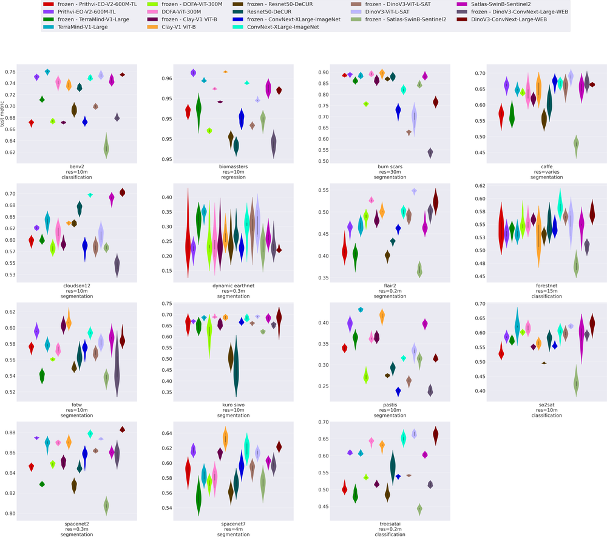
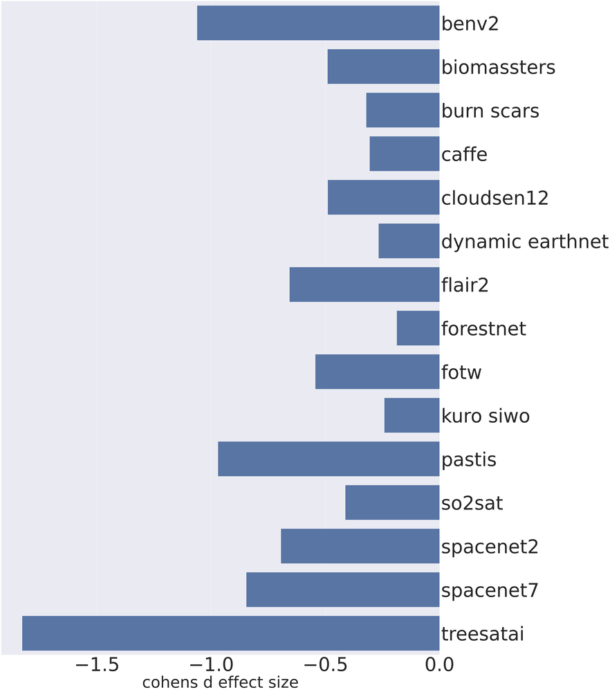
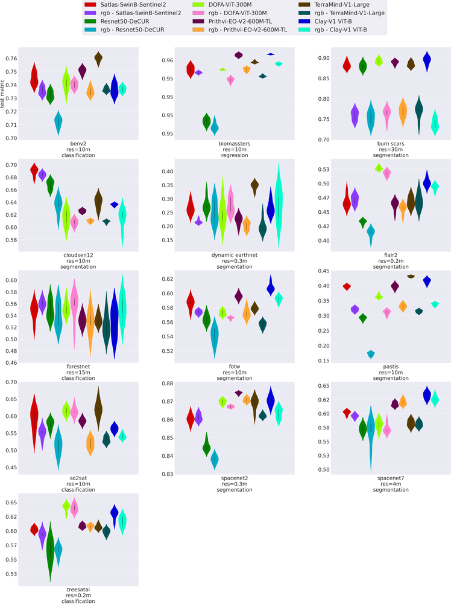
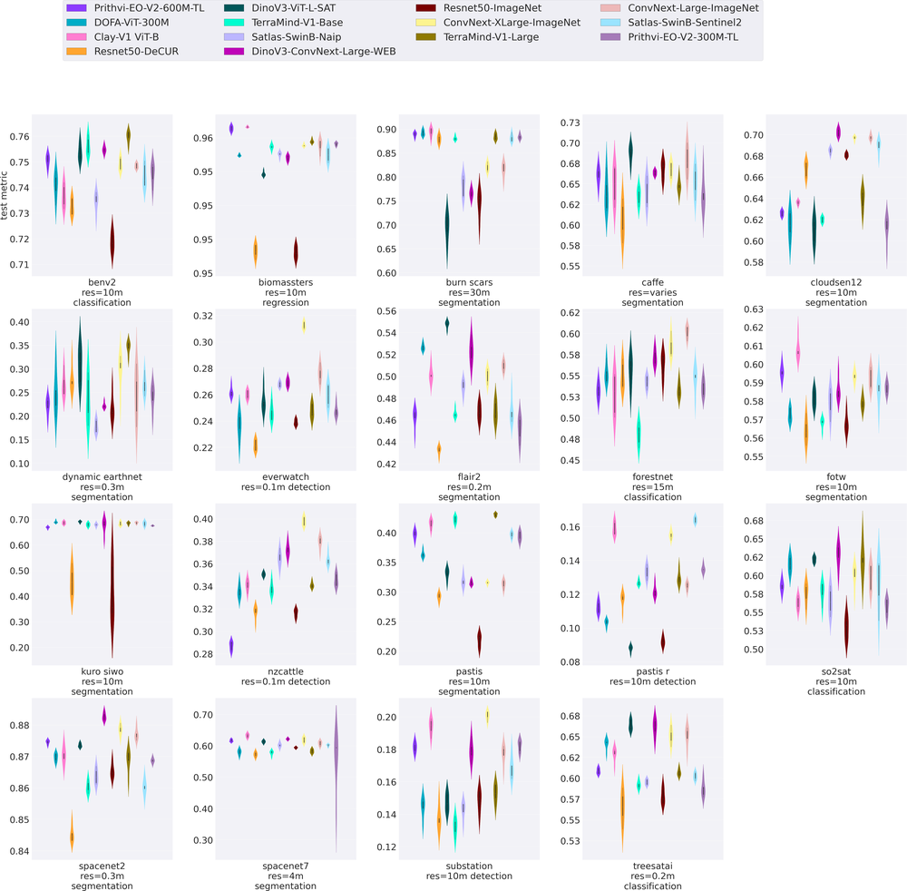
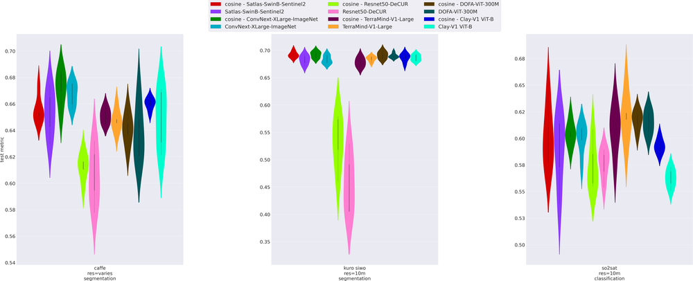
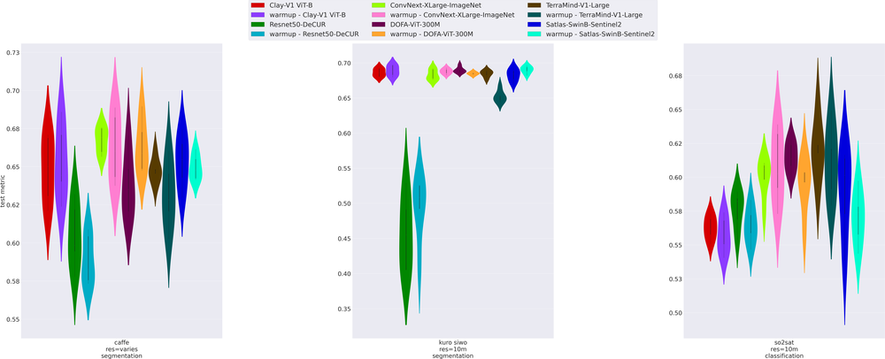
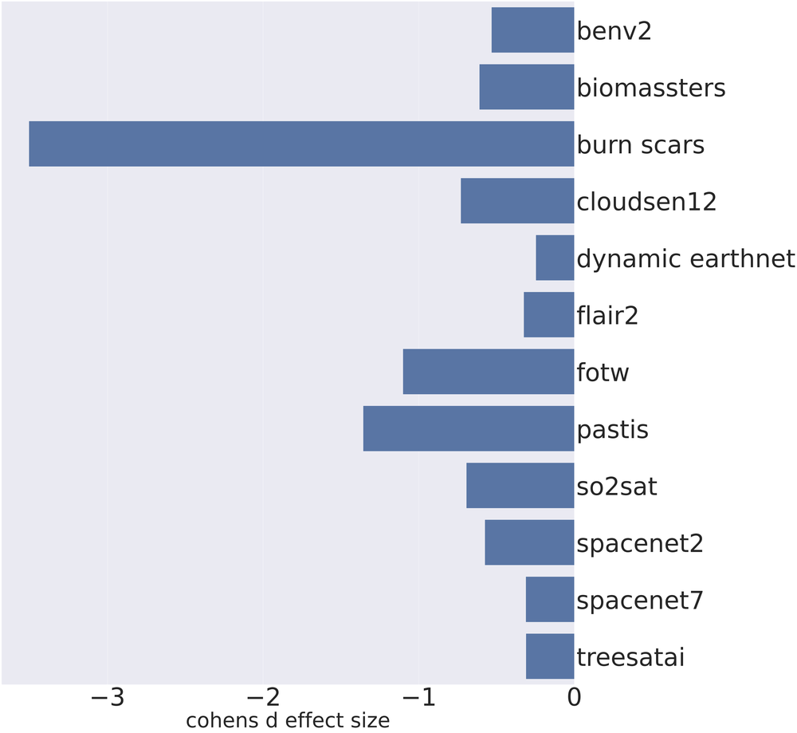
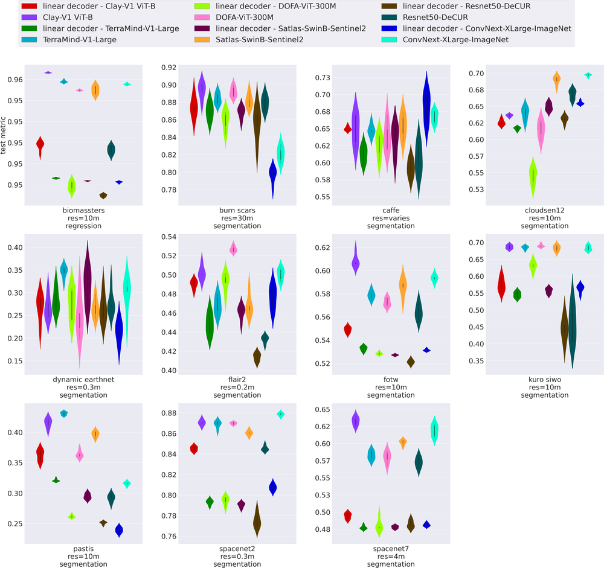
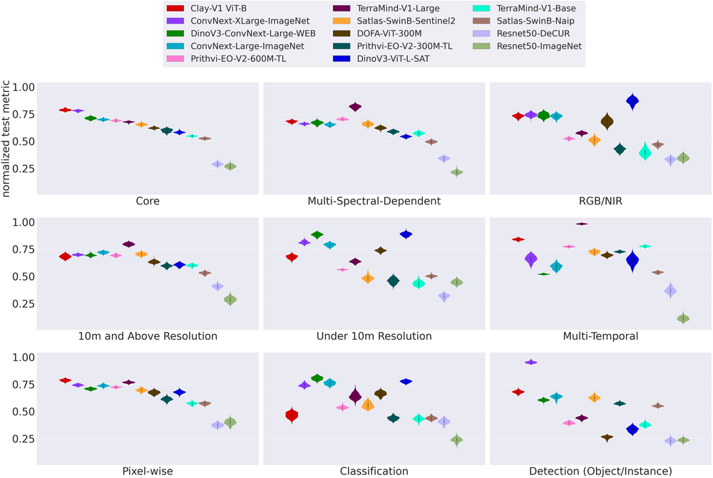
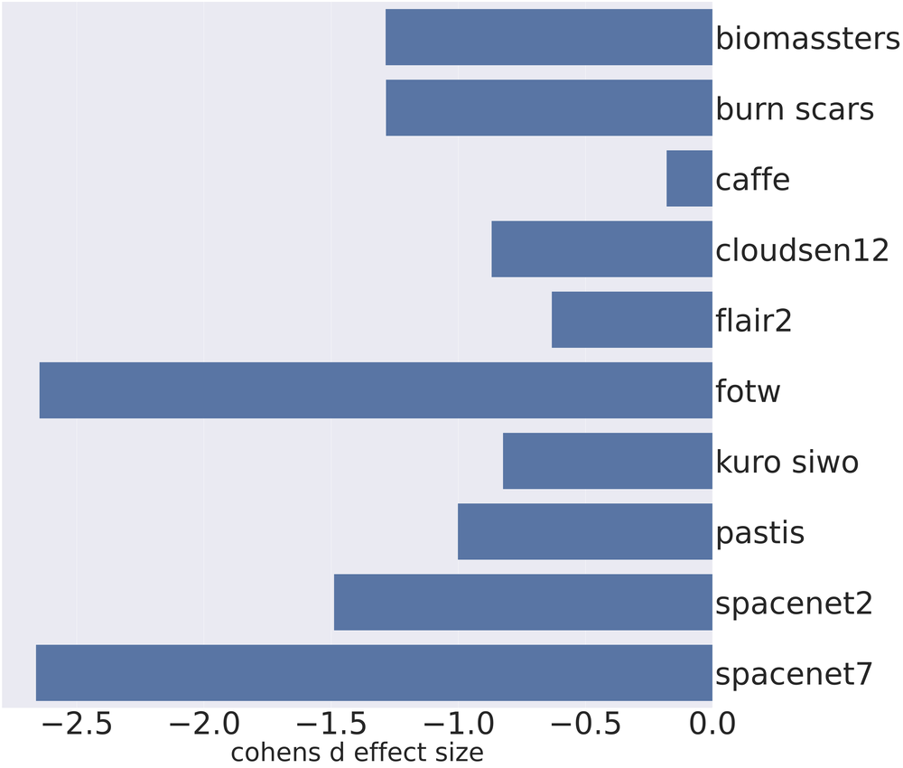

# GEO-Bench-2: From Performance to Capability, Rethinking Evaluation in Geospatial AI

**ArXiv ID**: 2511.15658v1
**URL**: http://arxiv.org/abs/2511.15658v1
**提交日期**: 2025-11-19
**作者**: Naomi Simumba; Nils Lehmann; Paolo Fraccaro; Hamed Alemohammad; Geeth De Mel; Salman Khan; Manil Maskey; Nicolas Longepe; Xiao Xiang Zhu; Hannah Kerner; Juan Bernabe-Moreno; Alexander Lacoste
**引用次数**: NULL
使用模型: Unknown

## 1. 核心思想总结
抱歉，没有可用的LLM客户端。请检查API密钥配置。

## 2. 方法详解
抱歉，没有可用的LLM客户端。请检查API密钥配置。

## 3. 最终评述与分析
抱歉，没有可用的LLM客户端。请检查API密钥配置。

---

# 附录：论文图片

## 图 1

## 图 2

## 图 3

## 图 4

## 图 5

## 图 6

## 图 7

## 图 8

## 图 9

## 图 10

