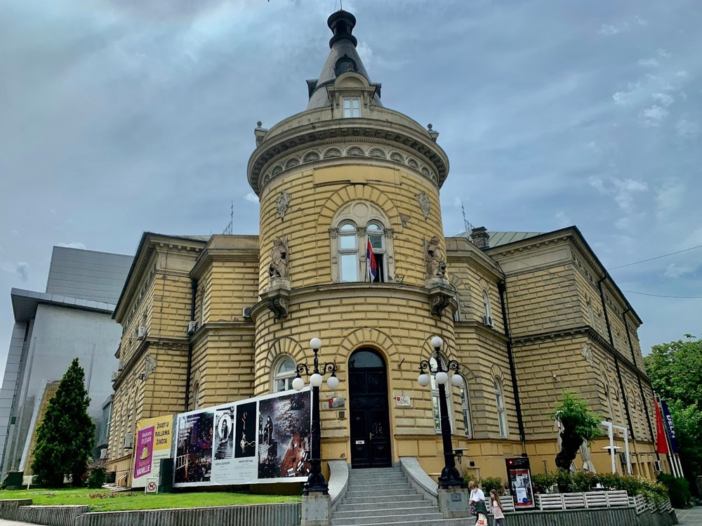
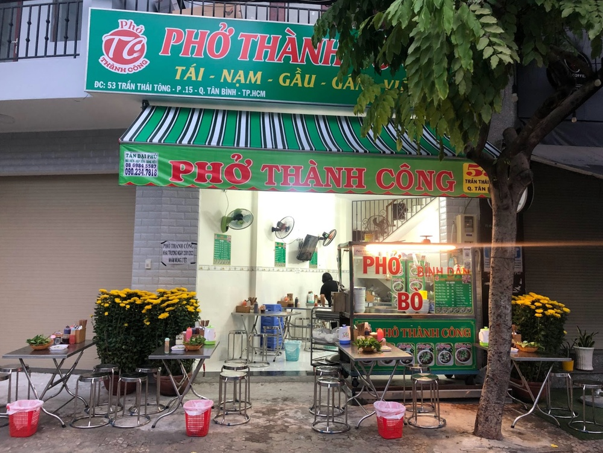
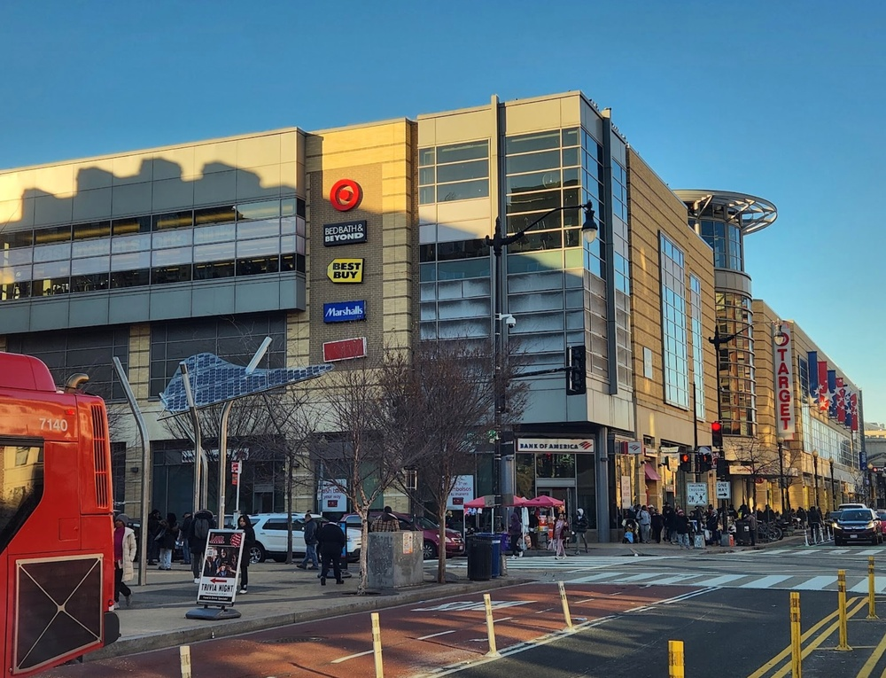
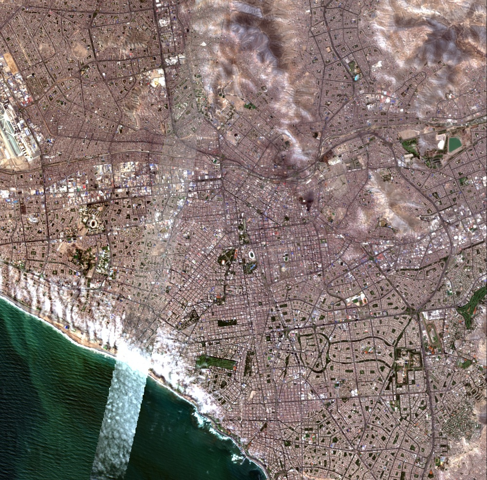
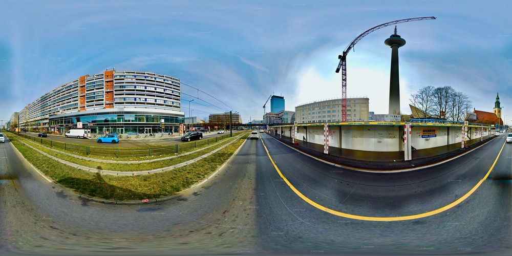
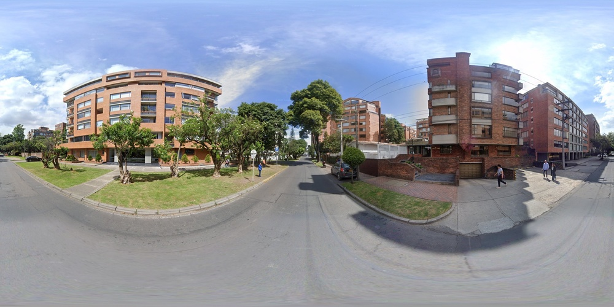

# GeoVista: Web-Augmented Agentic Visual Reasoning for Geolocalization

**ArXiv ID**: 2511.15705v1
**URL**: http://arxiv.org/abs/2511.15705v1
**提交日期**: 2025-11-19
**作者**: Yikun Wang; Zuyan Liu; Ziyi Wang; Pengfei Liu; Han Hu; Yongming Rao
**引用次数**: NULL
使用模型: gemini-2.5-flash

## 1. 核心思想总结
这是一份简洁的第一轮总结：

### GeoVista: Web-Augmented Agentic Visual Reasoning for Geolocalization

**Background:**
当前智能体视觉推理研究在深度多模态理解方面取得进展，但其应用主要集中在图像操作工具，缺乏通用性。

**Problem:**
1.  **通用性不足:** 现有智能体模型未能满足更通用目的的需求。
2.  **任务挑战性:** 地理定位任务需要精细的视觉定位和网络搜索以验证或完善推理假设。
3.  **基准缺陷:** 现有地理定位基准无法满足高分辨率图像和深度智能体推理的评估需求。

**Method (high-level):**
1.  **提出GeoVista模型:** 一个将工具调用（如图像放大、网络搜索）无缝集成到推理循环中的智能体模型。
2.  **完整训练流程:**
    *   **SFT（监督微调）阶段:** 冷启动，学习推理模式和工具使用先验。
    *   **RL（强化学习）阶段:** 进一步增强推理能力，采用分层奖励机制利用多级地理信息。
3.  **构建GeoBench基准:** 包含全球照片、全景图及卫星图像，以严格评估智能体模型的地理定位能力。

**Contribution:**
1.  **模型性能提升:** GeoVista在地理定位任务上显著超越其他开源智能体模型。
2.  **媲美顶尖模型:** 在多数指标上，GeoVista的性能可与Gemini-2.5-flash和GPT-5等闭源模型媲美。
3.  **新基准贡献:** 策展并发布GeoBench，填补了现有地理定位基准在高分辨率图像和深度智能体推理评估方面的空白。

## 2. 方法详解
根据您提供的初步总结和方法节内容，以下是对GeoVista论文方法细节的详细阐述：

---

### GeoVista论文方法细节：基于Web增强的智能体视觉推理地理定位模型

GeoVista旨在解决现有智能体模型在通用性、地理定位任务复杂性以及现有基准缺陷等问题。其核心思想是构建一个能够无缝集成工具调用（如图像放大、网络搜索）到迭代推理循环中的智能体模型，并通过独特的分阶段训练范式进行优化。

#### 一、 GeoVista 整体架构与工作流

GeoVista模型的核心是一个以**大型语言模型（LLM）为大脑**的智能体，它负责高级推理、规划和决策。该智能体通过**视觉感知模块（Vision Module）**获取图像信息，并通过**工具调用模块（Tool Calling Module）**与外部工具进行交互，从而形成一个**迭代的“观察-思考-行动-观察”推理循环**。

1.  **视觉感知模块：** 负责处理输入的原始图像。这通常通过一个预训练的视觉语言模型（VLM）来实现，它能够将图像内容转化为LLM可理解的文本描述、视觉特征或回答LLM提出的视觉问题。当使用“图像放大”工具时，该模块会处理放大的局部图像，并提供更细粒度的视觉信息。
2.  **智能体核心（LLM）：** 作为GeoVista的推理引擎。它接收来自视觉感知模块的图像描述、历史推理步骤以及工具调用的结果。基于这些信息，LLM会：
    *   **生成思考（Thought）：** 分析当前状态，形成假设，并规划下一步行动。例如：“这张图片显示了一个欧洲风格的建筑，我需要放大查看上面的文字。”
    *   **生成行动（Action）：** 根据思考，LLM决定执行以下操作之一：
        *   **调用工具：** 生成结构化的工具调用指令，例如`zoom_in(bounding_box_coordinates)`或`web_search("European architecture styles with pointed roofs")`。
        *   **做出最终预测：** 当智能体认为已收集足够信息时，它会输出最终的地理位置预测（如国家、城市或经纬度）。
3.  **工具调用模块：** 负责解析LLM生成的工具调用指令，执行相应的外部工具，并将工具执行的结果返回给LLM。
4.  **工作流程：**
    *   模型接收一张待定位的图片。
    *   视觉感知模块处理图片，提供初始视觉信息给LLM。
    *   LLM生成思考和行动，可能是一个工具调用。
    *   工具调用模块执行工具，获取结果（例如，放大后的图片描述或网页搜索结果）。
    *   工具结果和新的视觉信息被反馈给LLM。
    *   LLM根据新的信息继续迭代推理，直到做出最终的地理位置预测。

#### 二、 关键创新与算法/架构细节

GeoVista的关键创新点在于其**深度集成的智能体推理循环**、**分层工具集**以及**全面的两阶段训练范式**，特别是其中独特的**强化学习分层奖励机制**。

##### A. 深度集成的智能体推理循环

*   **创新点：** GeoVista将外部工具（如图像分析和网络搜索）无缝地集成到智能体的推理循环中，使得智能体能够像人类专家一样，根据需要动态地选择和使用工具来验证或完善其地理定位假设。这解决了现有智能体工具调用不灵活或无法与推理深度耦合的问题。
*   **细节：**
    *   **动态工具选择：** LLM在每个推理步骤中，可以根据当前的视觉线索、已有的假设以及已获取的信息，自主决定调用哪个工具（或是否调用）。
    *   **上下文感知：** 工具的输出（例如，放大图片后提取的细粒度特征描述，或网络搜索结果摘要）被完全整合到LLM的输入上下文中，供其进行后续的推理和决策。
    *   **迭代推理：** 智能体不会一次性做出决策，而是通过多轮“观察-思考-行动”的迭代过程，逐步从粗粒度（如大陆）到细粒度（如城市或具体地标）地收敛其预测。

##### B. 分层工具集

GeoVista设计并集成了专门用于地理定位任务的工具，以增强其推理能力。

1.  **图像放大与细粒度分析工具（Image Zoom & Fine-grained Analysis Tool）：**
    *   **目的：** 当初始视觉信息不足以做出精确判断时，智能体可以指示该工具对图像的特定区域进行放大，以获取更细致的视觉线索。
    *   **工作机制：** LLM会输出一个包含目标区域坐标（例如，边界框）的指令。工具模块接收指令后，裁剪并放大指定区域，然后再次通过视觉感知模块（VLM）对放大后的图像进行特征提取或生成详细描述，并将这些细粒度信息反馈给LLM。
    *   **示例应用：** 识别路牌上的文字、建筑风格的细节、特定植物类型、车牌特征等，这些通常是地理定位的关键线索。

2.  **网络搜索工具（Web Search Tool）：**
    *   **目的：** 用于验证智能体的假设、获取背景知识或寻找外部证据。
    *   **工作机制：** LLM会根据其当前推理状态生成一个文本查询（例如，基于视觉线索提炼出的地标名称、建筑风格描述或风土人情特征）。工具模块将此查询发送给一个搜索引擎API，并将返回的搜索结果摘要或相关URL反馈给LLM。
    *   **示例应用：** 搜索某个特定建筑的名称以确认其位置、查询特定国家或地区的文化习俗以排除或确认假设、验证某个地标的地理信息等。

##### C. 全面的两阶段训练范式

GeoVista的训练分为SFT（监督微调）和RL（强化学习）两个阶段，旨在从零开始学习推理模式和工具使用，并进一步优化其决策能力。

1.  **SFT（监督微调）阶段：**
    *   **目的：** 作为冷启动阶段，让智能体学习基础的地理定位推理模式、如何理解和生成工具调用指令的语法、以及如何根据工具返回的结果进行初步判断。
    *   **数据：** 利用高质量、人类专家标注的或由强模型生成的“推理轨迹”数据。每条轨迹都包含一系列的“初始图片 -> 视觉描述 -> 思考 -> 工具调用 -> 工具结果 -> 思考 -> 最终预测”步骤。这些数据教会模型在给定情境下应该做什么，以及工具调用的正确格式。
    *   **方法：** 采用标准的序列到序列学习或因果语言建模范式，通过最大化预测下一个token的概率来训练LLM。

2.  **RL（强化学习）阶段：**
    *   **目的：** 在SFT阶段获得基础能力后，RL阶段旨在通过与环境的实际交互来进一步增强智能体的决策能力、探索更优的推理路径、提高其在复杂和未知情境下的泛化能力，并使其能够利用多级地理信息进行更精确的预测。
    *   **环境：** 地理定位任务本身构成强化学习的环境。智能体的“行动”包括调用工具或做出预测，“状态”是当前的图片、历史推理记录和工具返回结果，“奖励”则根据其预测的准确性给出。
    *   **关键创新：分层奖励机制（Hierarchical Reward Mechanism）：**
        *   **思想：** 为了更好地指导智能体在地理定位任务中逐步细化其预测，GeoVista引入了分层奖励机制，利用了地理信息的天然层级结构（例如，大洲 -> 国家 -> 区域 -> 城市 -> 精确坐标）。
        *   **奖励分配：**
            *   智能体正确识别**大洲**会获得基础奖励。
            *   在此基础上，如果进一步正确识别**国家**，会获得更高的累积奖励。
            *   如果能进一步正确识别**区域/省份**，奖励会再次提升。
            *   最高奖励通常给予精确到**城市**甚至**经纬度**的正确预测。
            *   此外，还可以引入惩罚机制，例如对低效的工具使用、冗余的推理步骤或完全错误的预测进行惩罚。
        *   **优势：** 这种分层奖励机制鼓励智能体首先进行粗粒度的判断，然后逐步细化，避免了“一步到位”的难度，也解决了稀疏奖励的问题。它引导智能体学习如何有效地利用工具逐步缩小搜索范围，并最终达到高精度的地理定位。
    *   **算法：** 可能会采用如PPO（Proximal Policy Optimization）等策略梯度算法来优化智能体（即LLM）的决策策略，使其能够最大化期望的累积奖励。

#### 三、 GeoBench 基准的构建

虽然GeoBench基准的构建是GeoVista的一个重要贡献，但它主要服务于模型的**评估**而非直接构成模型的方法细节。不过，它的存在为GeoVista的方法提供了验证的舞台。

*   **目的：** 解决现有基准在评估高分辨率图像和深度智能体推理能力方面的不足。
*   **内容：** 包含多样化的全球照片、全景图及卫星图像，要求智能体进行高难度的视觉推理和外部信息检索。
*   **评估方式：** GeoBench支持评估智能体在不同粒度（如国家、城市、经纬度距离）上的定位精度，以及其推理步骤和工具使用效率。

#### 四、 整体流程概览

GeoVista在解决一个地理定位任务时，将遵循以下整体流程：

1.  **输入接收：** 接收一张待定位的图像。
2.  **初始感知：** 视觉感知模块处理图像，生成高层级视觉描述，并作为LLM的初始输入。
3.  **迭代推理：** LLM进入循环：
    *   **思考：** 基于当前视觉信息、历史对话和工具结果，LLM生成一个思考，形成初步假设或决定下一步策略。
    *   **行动：** LLM根据思考决定是：
        *   **调用图像放大工具：** 指定图像区域，获取细粒度视觉线索。
        *   **调用网络搜索工具：** 构造搜索查询，获取外部信息。
        *   **做出最终预测：** 如果信心足够，直接输出地理位置。
    *   **工具执行：** 如果调用工具，工具模块执行并返回结果。
    *   **信息更新：** 工具结果被添加到LLM的上下文，形成新的推理状态。
4.  **预测输出：** 当LLM决定做出最终预测时，输出国家、城市、经纬度等地理定位结果。

---

通过上述详细的方法描述，可以看出GeoVista不仅是一个集成了工具的智能体，更是一个经过精心设计和训练，能够以类似人类专家的方式，通过迭代推理和多级信息融合来解决复杂地理定位问题的强大模型。其分层奖励机制和两阶段训练范式是实现这一目标的关键保障。

## 3. 最终评述与分析
结合您提供的初步总结和方法详述，以下是对GeoVista的最终综合评估：

---

### GeoVista：基于Web增强的智能体视觉推理地理定位模型最终评估

#### 1) 总体评估 (Overall Summary)

GeoVista提出了一种创新的、结合网络增强的智能体视觉推理模型，专注于解决复杂的地理定位任务。它成功地应对了当前智能体模型在通用性方面的不足、地理定位任务的固有挑战性以及现有评估基准的缺陷。该模型的核心是一个以大型语言模型（LLM）为大脑的智能体，能够无缝集成图像放大和网络搜索等外部工具，并通过一个独特的两阶段训练范式（SFT+RL，其中RL阶段引入了分层奖励机制）进行优化。GeoVista不仅在地理定位任务上显著超越了其他开源智能体模型，其性能甚至可与Gemini-2.5-flash和GPT-5等顶尖闭源模型相媲美。同时，该研究还策展并发布了GeoBench这一高分辨率、深度智能体推理的专用基准，为该领域树立了新的评估标准，极大地推动了智能体视觉推理和地理定位研究的发展。

#### 2) 优势 (Strengths)

1.  **强大的智能体推理能力：**
    *   **深度集成的工具调用：** GeoVista将图像放大和网络搜索等外部工具无缝融入到智能体的迭代推理循环中。这种深度集成使得智能体能够像人类专家一样，根据当前信息动态地选择和使用工具来验证或完善其地理定位假设，显著提升了推理的精细度和准确性。
    *   **分层工具集：** 设计并实现了专门用于地理定位任务的工具（图像放大用于细粒度视觉线索，网络搜索用于外部知识验证），这些工具的有效结合极大地增强了智能体的感知和信息检索能力。
    *   **“观察-思考-行动”迭代循环：** 智能体通过多轮的迭代过程，能够从粗粒度（如大洲）到细粒度（如城市或具体地标）逐步收敛其预测，提高了复杂场景下的推理鲁棒性。

2.  **高效且创新的训练范式：**
    *   **两阶段训练策略：** 结合了监督微调（SFT）和强化学习（RL），SFT阶段为模型提供了基础的推理模式和工具使用先验，RL阶段则通过与环境的交互进一步增强了决策能力和泛化性。这种结合充分利用了监督数据的指导和交互学习的优势。
    *   **独特的分层奖励机制：** RL阶段的核心创新，利用地理信息的天然层级结构（大洲、国家、城市等）设计奖励，有效解决了地理定位任务中稀疏奖励的问题，并引导智能体逐步细化其预测，从而实现高精度定位。

3.  **卓越的性能表现：**
    *   在地理定位任务上，GeoVista展现出显著的性能优势，不仅超越了现有的开源智能体模型，更在多数指标上能够与Gemini-2.5-flash和GPT-5等顶尖闭源模型媲美，证明了其在这一复杂任务上的领先地位和SOTA能力。

4.  **高质量的基准贡献：**
    *   策展并发布GeoBench，填补了现有地理定位基准在高分辨率图像和深度智能体推理评估方面的空白。GeoBench的多样化图像来源和对高难度推理的要求，为未来的研究提供了一个更具挑战性和真实性的评估平台，将有效推动领域发展。

#### 3) 劣势/局限性 (Weaknesses / Limitations)

1.  **计算与数据成本高昂：**
    *   两阶段训练，特别是强化学习阶段，以及高分辨率图像处理和多轮工具调用，意味着巨大的计算资源消耗。这可能限制其在资源受限环境下的部署和进一步研究。
    *   SFT阶段需要高质量的推理轨迹数据（无论是人工标注还是由强模型生成），这些数据的获取或生成成本高昂，且质量直接影响模型性能。

2.  **对外部工具的依赖性：**
    *   模型的性能在很大程度上取决于底层视觉感知模块（VLM）和网络搜索工具的准确性与可靠性。若外部工具提供错误、模糊或过时的信息，智能体可能被误导，导致推理失败。
    *   网络搜索引入了潜在的信息偏见和伦理风险，例如搜索结果可能包含错误信息、偏见或有害内容，智能体需要具备过滤和评估信息的能力。

3.  **通用性与任务迁移的局限：**
    *   尽管智能体框架本身具有通用潜力，但GeoVista的分层工具集和分层奖励机制是针对地理定位任务高度定制的。将其迁移到其他复杂任务（如医学诊断、科学发现）可能需要重新设计相应的工具和奖励机制，通用性并非一蹴而就。

4.  **推理效率与实时性挑战：**
    *   多轮迭代的“观察-思考-行动”循环虽然提高了准确性，但也增加了推理时间。每次LLM推理和工具调用都会带来延迟，可能不适用于对实时性要求非常高的应用场景。

5.  **可解释性有待提高：**
    *   尽管LLM生成“思考”步骤，但智能体做出特定决策（例如，为何选择放大某个特定区域，或者为何生成某个特定的搜索查询）的深层逻辑有时仍可能难以完全追溯和理解，这对于某些需要高可信度的应用场景（如司法、军事）可能是一个限制。

#### 4) 潜在应用/影响 (Potential Applications / Implications)

1.  **高精度地理信息服务：**
    *   **地图与导航增强：** 显著提高在无GPS信号区域（如室内、峡谷、城市峡谷）或GPS受干扰情况下的定位精度，优化地图匹配和路线规划。
    *   **旅游与文化探索：** 基于用户上传的图像，即时识别地标、景点，为游客提供详细的地理信息和文化背景介绍。
    *   **地理空间数据分析：** 辅助专业人员从大量未标记图像中提取精确地理位置信息，用于环境监测、城市规划等领域。

2.  **公共安全与应急响应：**
    *   **灾害现场定位：** 从社交媒体图片、无人机航拍图或受害者手机照片中快速准确地识别和定位灾害发生地，为救援行动提供关键情报。
    *   **犯罪侦查与取证：** 协助执法部门通过现场图片分析，识别犯罪地点、追踪嫌疑人活动轨迹，提高侦查效率。

3.  **环境保护与资源管理：**
    *   **生态监测与保护：** 从卫星图像或野外相机数据中识别特定物种的栖息地、监测生物多样性变化、追踪非法捕捞或盗伐行为。
    *   **气候变化研究：** 通过分析历史和当前图像，精确识别和量化气候变化对地理环境（如冰川消融、海岸线变化）的影响。

4.  **智能体AI研究与发展：**
    *   **通用智能体基础：** GeoVista所提出的迭代推理、工具调用与分层奖励机制的框架，为构建更通用、更智能、能与世界深度交互的AI助手提供了重要的经验和范例，推动了具身智能和通用人工智能的研究。
    *   **多模态推理新范式：** 进一步推动了多模态大模型在复杂现实世界任务中深度整合视觉、语言和外部知识的能力，为未来AI系统设计提供了方向。

5.  **基准促进研究：**
    *   GeoBench的发布将作为该领域的一个标准挑战，激励更多研究者投入到高分辨率、深度智能体视觉推理的地理定位任务中，加速技术创新和突破。

---

---

# 附录：论文图片

## 图 1

## 图 2

## 图 3

## 图 4

## 图 5

## 图 6

## 图 7

## 图 8

## 图 9

## 图 10

