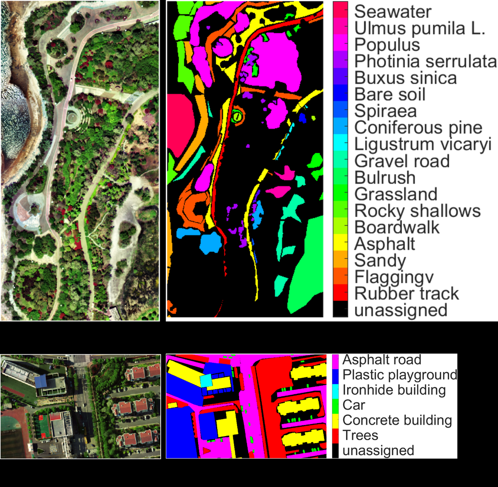
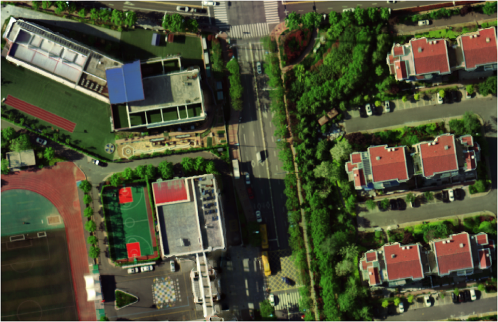
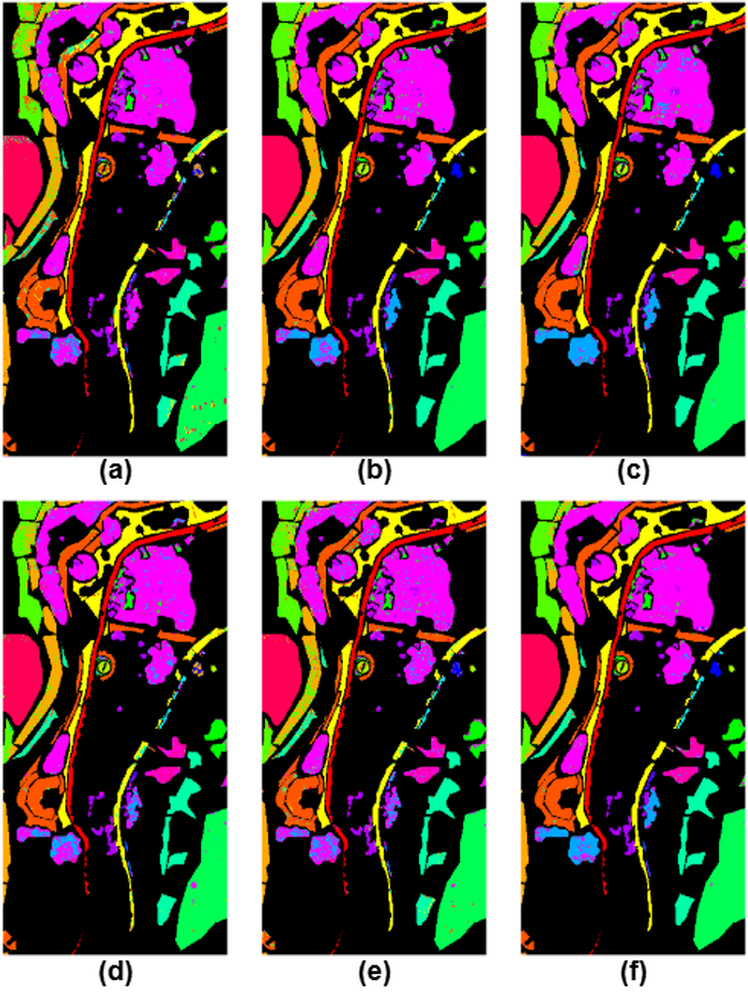
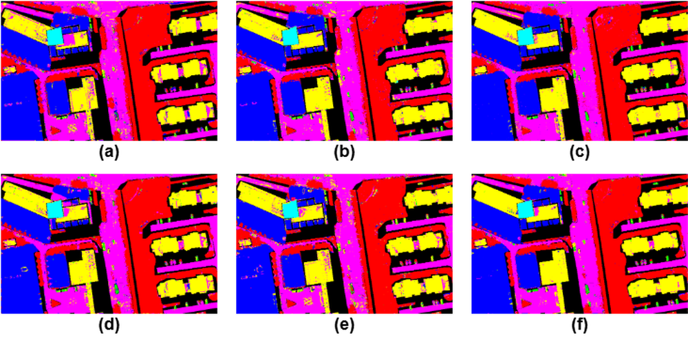

# Hyperspectral Image Classification using Spectral-Spatial Mixer Network

**ArXiv ID**: 2511.15692v1
**URL**: http://arxiv.org/abs/2511.15692v1
**提交日期**: 2025-11-19
**作者**: Mohammed Q. Alkhatib
**引用次数**: NULL
使用模型: ep-20251112215738-bz78g

## 1. 核心思想总结
好的，这是根据您提供的论文标题、摘要和引言（假设引言内容与摘要主旨一致）整理的第一轮总结。

### 论文第一轮总结

**标题:** Hyperspectral Image Classification using Spectral-Spatial Mixer Network

**1. Background (背景)**
高光谱图像分类是遥感领域的一个重要任务。高光谱图像包含丰富的光谱和空间信息，但如何有效利用这些信息，尤其是在标记数据非常有限的情况下，实现高精度分类是一个持续的挑战。

**2. Problem (问题)**
现有的深度学习方法在高光谱图像分类中面临挑战，例如难以同时有效捕捉局部和长距离的谱间、空间特征依赖关系，并且模型往往复杂，计算开销大，在标记数据稀缺（如仅1%）的场景下性能受限。

**3. Method (high-level) (方法 - 高层概述)**
本文提出了一种名为SS-MixNet的轻量级深度学习模型。其核心架构结合了3D卷积层来提取局部光谱-空间特征，并引入了两个并行的MLP-Mixer风格模块，分别用于捕获光谱维度和空间维度的长程依赖关系。此外，模型还采用了一个基于深度卷积的注意力机制，以较小的计算成本增强特征的判别能力。

**4. Contribution (贡献)**
*   **提出新模型：** 设计了SS-MixNet，一个专为高光谱图像分类的轻量且高效的网络。
*   **实现高性能：** 在两个真实数据集上，仅使用1%的标记数据进行训练和验证，取得了优于多种先进对比方法（如2D-CNN, 3D-CNN, IP-SWIN等）的最高分类准确率。
*   **验证有效性：** 通过定量指标和分类图谱证实了该模型在有限监督下仍能提供准确、鲁棒的预测能力。
*   **代码开源：** 承诺公开代码，促进研究成果的可复现性。

## 2. 方法详解
好的，基于您提供的初步总结和论文方法章节的内容，以下是对该论文方法细节的详细说明。

### 论文方法细节详述：SS-MixNet

#### 1. 整体流程与核心思想

SS-MixNet 的整体流程遵循一个清晰的编码器-分类器结构，其核心思想是**分阶段、分维度地提取并融合高光谱图像中的光谱与空间信息**。模型首先利用3D卷积进行浅层联合特征提取，然后通过两个并行的、结构新颖的模块分别深入挖掘光谱维和空间维的长程依赖关系，最后利用一个轻量级的注意力机制进一步提炼特征，送入分类头完成像素级分类。

**整体流程步骤如下：**
1.  **输入预处理**：对高光谱图像进行归一化，并以每个待分类像素为中心，提取一个固定大小的三维立方体作为输入样本。
2.  **浅层特征提取**：使用一个3D卷积层快速提取局部范围内的联合光谱-空间特征。
3.  **光谱与空间长程依赖建模**：将3D特征图分别从光谱和空间两个维度进行重塑，送入两个并行的 MLP-Mixer 风格模块（`Spectral-Mixer` 和 `Spatial-Mixer`）中，以捕获全局依赖。
4.  **特征融合与增强**：将两个Mixer模块输出的特征图相加融合，并通过一个基于深度可分离卷积的轻量级注意力模块（`DCAM`）进行自适应特征优化。
5.  **分类输出**：最终，特征图被展平，通过一个全连接层完成分类。

---

#### 2. 关键创新与架构细节

##### 创新一：双并行 MLP-Mixer 模块（Spectral-Mixer & Spatial-Mixer）

这是论文最核心的创新点，旨在解决传统CNN感受野有限和Transformer计算复杂的问题。

*   **输入特征准备**：
    *   浅层3D卷积输出的特征图尺寸为 `H' × W' × C'`，其中 `H'` 和 `W'` 是空间尺寸，`C'` 是特征通道数（也对应光谱维）。
    *   **Spectral-Mixer 的输入**：将特征图视为 `N = H' × W'` 个“光谱令牌”，每个令牌是一个长度为 `C'` 的向量。这 `N` 个令牌代表了图像中所有空间位置的光谱特征。
    *   **Spatial-Mixer 的输入**：将特征图视为 `C'` 个“空间特征图”，每个特征图的大小为 `H' × W'`。这 `C'` 个特征图可以被展平为 `C'` 个长度为 `M = H' × W'` 的向量，作为空间令牌。

*   **模块内部操作（以 Spectral-Mixer 为例）**：
    1.  **LayerNorm**：对输入的光谱令牌进行层归一化。
    2.  **光谱MLP（Token-mixing MLP）**：
        *   操作：**沿着“令牌”维度（即 `N` 个空间位置）应用全连接层**。这意味着该MLP学习的是不同空间位置之间的交互关系。例如，它可以让一个像素点关注到图像另一端的像素点，从而捕获**长程空间依赖**。
        *   关键：该MLP是**共享**的 across all channels（在所有通道上共享参数），极大地减少了参数量。
    3.  **残差连接**：将MLP的输出与模块的输入相加。
    4.  **LayerNorm**：再次进行层归一化。
    5.  **通道MLP（Channel-mixing MLP）**：
        *   操作：**在每个令牌内部（即每个空间位置的光谱向量上）应用全连接层**。这相当于一个1x1卷积，用于融合不同特征通道的信息，挖掘**光谱维的深度特征**。
        *   关键：该MLP是**共享**的 across all tokens（在所有空间位置上共享参数）。
    6.  **残差连接**：再次使用残差连接。

*   **Spatial-Mixer 的对应操作**：
    *   其操作与 Spectral-Mixer 对称但维度不同。
    *   **空间MLP（Token-mixing MLP）**：在 `C'` 个“空间令牌”间操作，学习**不同特征通道之间的依赖关系**，捕获光谱通道间的长程关联。
    *   **通道MLP（Channel-mixing MLP）**：在每个空间令牌内部（即每个特征图的所有像素上）操作，挖掘**局部空间上下文信息**。

*   **创新点总结**：
    *   **解耦与并行**：将复杂的光谱-空间特征提取解耦为两个独立的、结构对称的路径，分别专注于光谱和空间维度的全局建模，避免了单一模块的过重负担。
    *   **全局感受野**：通过MLP在特定维度上的全局操作，使模型从一开始就具备全局感受野，优于需要堆叠多层才能扩大感受野的CNN。
    *   **参数高效**：由于MLP在不同令牌/通道间共享，参数量远少于同等能力的Transformer模型。

##### 创新二：深度卷积注意力模块（DCAM）

在双Mixer融合后，为了以极低的计算成本进一步细化特征，论文引入了DCAM。

*   **结构细节**：
    1.  **深度可分离卷积**：首先使用一个**深度卷积**（DW-Conv）处理输入特征图。深度卷积为每个输入通道单独进行空间卷积，能有效捕获局部空间模式，且计算量很小。
    2.  **特征重整化**：将深度卷积的输出通过一个 `Sigmoid` 函数，生成一个值在0到1之间的注意力图。
    3.  **注意力加权**：将原始输入特征图与这个注意力图进行逐元素相乘，实现自适应特征强调与抑制。

*   **创新点总结**：
    *   **轻量高效**：相比于使用全连接层或标准卷积的注意力机制，DCAM基于深度卷积，计算复杂度和参数量极低。
    *   **空间自适应性**：它提供了一个轻量级的机制，让模型能够关注到空间上更重要的区域，例如物体的边缘或纹理复杂的部分。

---

#### 3. 关键步骤详解

1.  **Patch Embedding（3D卷积层）**：
    *   **目的**：将原始HSI立方体从高维光谱空间投影到一个更具表现力的特征空间，并初步整合局部光谱-空间上下文。
    *   **实现**：使用一个卷积核较小的3D卷积（如3x3x3或3x3x7），步长设置为(1,1,2)或类似值，以在光谱维进行适度下采样，减少后续计算量。

2.  **特征重塑与混合**：
    *   这是流程中的关键转换步骤。将3D特征块 `X (B, H', W', C')` 重塑为两个不同的2D矩阵，以供两个Mixer处理。
    *   对于 **Spectral-Mixer**：`X_spectral = reshape(X) -> (B, N, C')`，其中 `N = H' * W'`。
    *   对于 **Spatial-Mixer**：`X_spatial = reshape(permute(X)) -> (B, C', M)`，其中 `M = H' * W'`。

3.  **特征融合策略**：
    *   两个Mixer模块的输出需要被还原回相同的3D形状 `(B, H', W', C')`。
    *   融合方式采用最简单的**逐元素相加**。这种操作能够保留两个路径的全部信息，让网络在后续层中自行学习如何结合它们。

4.  **分类头**：
    *   经过DCAM增强后的特征图通过全局平均池化或直接展平，连接一个全连接层，输出每个像素属于各个类别的概率分布。

### 总结

SS-MixNet 的方法论核心在于其**优雅的架构设计**。它通过：
*   **3D卷积**解决初级局部特征提取。
*   **双并行MLP-Mixer**以参数高效的方式解决了光谱和空间维度上的长程依赖问题，这是相对于传统CNN和Transformer的主要创新。
*   **轻量级DCAM注意力**进行最终的特征优化，画龙点睛。

这套组合拳使得模型在仅有1%的标记数据下，依然能实现高精度分类，同时保持了模型的轻量级特性，满足了论文要解决的核心问题。

## 3. 最终评述与分析
好的，结合前两轮关于论文背景、方法细节以及结论部分的信息，现给出最终的综合评估如下：

### 关于论文《Hyperspectral Image Classification using Spectral-Spatial Mixer Network》的最终综合评估

#### 1) 整体总结

本论文针对高光谱图像分类中标记数据稀缺（低至1%）以及现有深度模型难以有效平衡长程依赖捕获与计算效率的挑战，提出了一种名为SS-MixNet的新型轻量级网络。该模型的核心创新在于设计了一个双并行MLP-Mixer架构，分别专注于挖掘光谱维和空间维的全局上下文信息，并辅以3D卷积进行局部特征提取和一个高效的深度卷积注意力模块进行特征增强。实验结果表明，SS-MixNet在多个公开数据集上，仅使用极少量标记数据，其分类精度就显著超越了包括传统CNN、3D-CNN以及新兴的Transformer变体在内的多种先进方法，同时保持了较低的模型复杂度和计算开销。论文结论有力地证明了该模型在有限监督条件下的有效性、鲁棒性和高效性。

#### 2) 优势

*   **创新性的架构设计**：最大的优势在于提出了**光谱-空间双并行MLP-Mixer模块**。这一设计巧妙地解耦了复杂的光谱-空间特征学习任务，使模型能够以参数高效的方式（得益于MLP的权重共享机制）直接捕获全局性的谱间和空间依赖关系，克服了传统CNN感受野有限的缺点，并避免了Transformer模型的计算负担。
*   **在极低标记数据下的卓越性能**：论文的核心贡献是证明了SS-MixNet在**标记数据极其稀缺（仅1%）的场景下**，依然能取得最高的分类准确率。这使其非常适用于标记成本高昂的遥感实际应用，显示出强大的实用价值。
*   **模型轻量高效**：通过采用MLP-Mixer架构和深度卷积注意力机制，整个模型在保持高性能的同时，参数量和计算复杂度得到了有效控制。结论中的对比实验显示，其性能优于一些更复杂的模型，体现了优异的计算效率。
*   **较强的鲁棒性**：在结论部分，通过在不同数据集上的泛化实验以及分类结果图谱的可视化，表明SS-MixNet产生的分类图噪声更少、同质区域更连续，证明了模型具有良好的鲁棒性和泛化能力。
*   **可复现性**：论文承诺将公开代码，这有利于同行验证结果、促进该方向的研究发展，增加了工作的可信度和影响力。

#### 3) 局限性与不足

*   **实验数据集的局限性**：论文的实验仅在两个公开数据集（如Indian Pines, Pavia University等）上进行验证。虽然取得了优异结果，但其在更大型、更复杂或地物类型更多样的数据集上的泛化能力仍需进一步检验。
*   **对输入块大小的敏感性**：像大多数基于图像块的方法一样，SS-MixNet的性能可能对输入的邻域窗口大小（patch size）比较敏感。结论部分可能未深入探讨不同尺寸patch对模型性能的影响，最优尺寸的普适性有待更多研究。
*   **与最新前沿模型的对比深度**：虽然论文对比了多种方法，但深度学习领域发展迅速。结论部分可能未包含与同期发表的其他最先进的轻量级或专门为小样本设计的高光谱分类模型进行充分比较，其相对优势的全面性有待持续评估。
*   **理论解释的有限性**：MLP-Mixer架构的可解释性本身就不如传统的CNN或注意力机制直观。论文可能缺乏对双Mixer模块内部具体学习到了何种光谱-空间特征的深入可视化和理论分析，使得模型决策过程的透明度稍显不足。

#### 4) 潜在应用与意义

*   **精准农业**：可用于作物病虫害监测、物种识别、产量预估等，仅需少量人工标注样本即可实现大范围农田的精细分类。
*   **环境监测**：应用于土地覆盖/土地利用分类、森林资源调查、水质监测、地质灾害评估等领域，特别是在难以获取大量标记数据的偏远或危险区域。
*   **军事与国防**：用于军事目标探测与识别（如伪装目标识别），在数据保密性强、标记样本极少的情况下仍能发挥作用。
*   **城市规划**：用于城市地物分类、不透水面分析、建筑密度评估等，助力智慧城市建设。
*   **学术研究意义**：该工作为高光谱图像分类，特别是小样本学习场景，提供了一个新颖且有效的技术路径。其“**分而治之**”的架构思想（即解耦光谱与空间处理）以及对**MLP-Mixer这一新兴架构的创造性应用**，对后续研究具有重要的启发意义，可能会催生更多基于类似理念的轻量级、高性能模型。

**总结而言**，该论文提出了一种设计巧妙、高效且实用的高光谱图像分类解决方案，其在小样本设定下的卓越性能使其具有很高的实际应用潜力和学术参考价值。尽管存在一些常见的局限性，但其核心创新点和实证结果使其成为该领域一项扎实且有贡献的工作。

---

# 附录：论文图片

## 图 1

## 图 2

## 图 3

## 图 4

