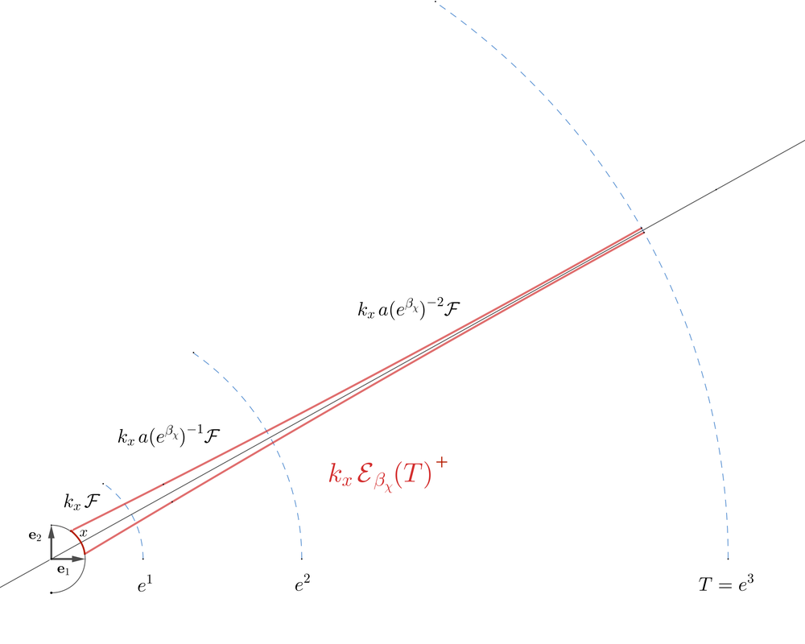

# Integrability of Siegel transforms and an application

**ArXiv ID**: 2511.15568v1
**URL**: http://arxiv.org/abs/2511.15568v1
**提交日期**: 2025-11-19
**作者**: René Pfitscher
**引用次数**: NULL
使用模型: Unknown

## 1. 核心思想总结
抱歉，没有可用的LLM客户端。请检查API密钥配置。

## 2. 方法详解
抱歉，没有可用的LLM客户端。请检查API密钥配置。

## 3. 最终评述与分析
抱歉，没有可用的LLM客户端。请检查API密钥配置。

---

# 附录：论文图片

## 图 1

