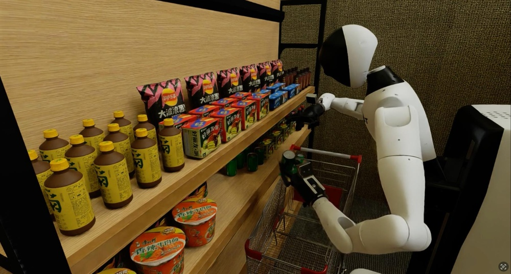
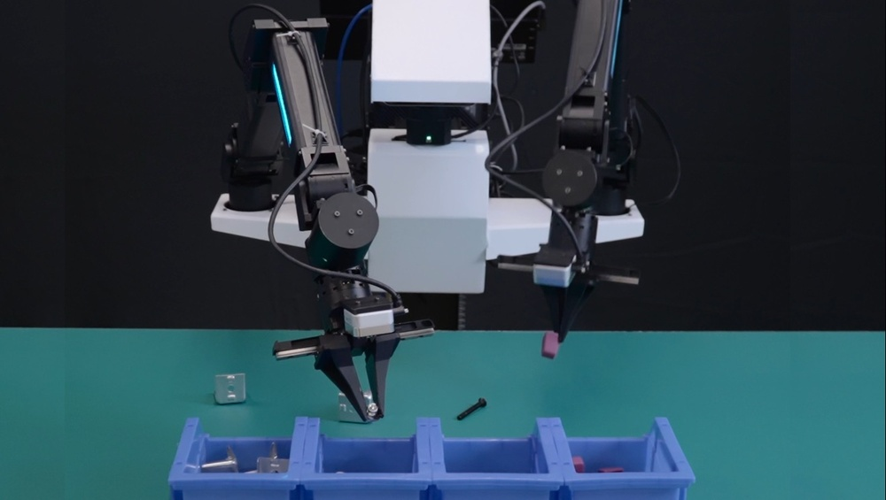

# InternData-A1: Pioneering High-Fidelity Synthetic Data for Pre-training Generalist Policy

**ArXiv ID**: 2511.16651v1
**URL**: http://arxiv.org/abs/2511.16651v1
**提交日期**: 2025-11-20
**作者**: Yang Tian; Yuyin Yang; Yiman Xie; Zetao Cai; Xu Shi; Ning Gao; Hangxu Liu; Xuekun Jiang; Zherui Qiu; Feng Yuan; Yaping Li; Ping Wang; Junhao Cai; Jia Zeng; Hao Dong; Jiangmiao Pang
**引用次数**: NULL
使用模型: gemini-2.5-flash

## 1. 核心思想总结
**标题**: InternData-A1: 为预训练通用策略开创高保真合成数据

**第一轮总结**

**Background (背景)**
现有研究探讨真实与合成数据对视觉-语言-动作 (VLA) 模型泛化能力的贡献。大规模真实机器人数据预训练已被证实能有效提升VLA模型的性能。

**Problem (问题)**
尽管真实数据有效，但此前合成数据在大规模预训练中未能展现出与真实数据相当的能力，限制了其在VLA模型泛化上的应用潜力。

**Method (高层次方法)**
本文提出并生成了一个大规模高保真合成数据集InternData-A1，包含超过63万条轨迹和7433小时的数据，涵盖四种具身、18项技能、70项任务和227个场景，覆盖刚体、铰接体、可变形体和流体操作。该数据集通过一个高度自主、完全解耦且组合式的仿真管线生成，该管线支持长周期技能组合、灵活任务组装和异构实体，且仅需最少手动调优。研究者利用InternData-A1，以与$π_0$相同的架构预训练了一个VLA模型。

**Contribution (贡献)**
1.  **首次证明**: 首次提供了证据，表明仅依赖合成数据即可使VLA模型预训练性能匹敌最强真实数据集（$π$-dataset），突显了大规模仿真的巨大价值。
2.  **性能匹配**: 预训练模型在49项仿真任务、5项真实世界任务和4项长周期灵巧任务上，性能与官方$π_0$模型持平。
3.  **零样本迁移**: 模型展现出令人惊喜的零样本模拟到真实（sim-to-real）迁移能力。
4.  **数据与工具发布**: 发布了InternData-A1数据集，并将开源其生成管线，旨在拓宽大规模机器人数据的获取途径，并降低具身AI研究中可伸缩数据创建的门槛。

## 2. 方法详解
基于您提供的初步总结，我们可以推断出InternData-A1论文的方法细节，重点将放在其数据生成管线（pipeline）上，因为VLA模型架构本身是沿用$π_0$的。

---

### InternData-A1 论文方法细节

本论文的核心方法在于设计并实现了一个**大规模、高保真、高度自主的合成数据生成管线**，用于为VLA模型预训练提供高质量数据。其关键创新、算法/架构细节、关键步骤与整体流程如下。

#### 1. 关键创新 (Key Innovations)

1.  **高保真大规模合成数据集 InternData-A1 的创建与发布：**
    *   首次证明纯合成数据能够支撑VLA模型达到与顶级真实数据集（$π$-dataset）相当的预训练性能。
    *   数据集规模巨大：超过63万条轨迹，7433小时数据。
    *   高度多样性：涵盖4种具身代理、18项基础技能、70项复杂任务、227个不同场景，以及刚体、铰接体、可变形体和流体的物理交互。

2.  **高度自主、完全解耦且组合式的仿真管线：** 这是生成InternData-A1的核心技术。
    *   **高度自主 (Highly Autonomous)：** 管线设计目标是最大限度减少人工干预，通过自动化机制高效生成大量高质量数据。这可能涉及参数化任务生成、自动化的专家策略执行或基于规则的控制器。
    *   **完全解耦 (Fully Decoupled)：** 系统的各个组成部分（如场景、物体、代理、技能、任务逻辑、数据收集）彼此独立，降低了系统的复杂性，提高了可维护性和可扩展性。例如，可以独立更新场景资产而不影响任务逻辑。
    *   **组合式 (Combinatorial)：** 通过组合少量原子级的技能、物体、场景和任务模板，能够指数级地生成极其丰富的任务实例和数据，从而确保数据集的多样性和泛化能力。
    *   **支持长周期技能组合 (Long-Horizon Skill Composition)：** 允许将基础技能序列化，以完成复杂的、多步骤的机器人任务。
    *   **灵活任务组装 (Flexible Task Assembly)：** 提供灵活的接口或语言来定义和组装各种任务，适应不同的机器人应用场景。
    *   **支持异构实体 (Heterogeneous Entities Support)：** 仿真环境能够准确模拟不同物理属性（刚体、铰接体、可变形体、流体）的物体，并处理它们之间的复杂交互，这是实现“高保真”的关键。
    *   **最少手动调优 (Minimal Manual Tuning)：** 管线的自动化和鲁棒性使其在不同场景和任务下仍能高效运行，减少了繁琐的人工调试工作。

#### 2. 算法/架构细节 (Algorithm/Architecture Details)

该方法的核心“架构”是指其数据生成管线的体系结构。虽然具体细节未给出，但根据其特性可以推测其架构：

1.  **模块化设计 (Modular Design)：**
    *   **场景与资产库 (Scene & Asset Library)：** 包含227个多样化场景模板和大量3D模型（刚体、铰接体、可变形体、流体容器/内容），支持纹理、光照、物理属性的随机化，以增加视觉多样性。
    *   **具身代理库 (Embodied Agent Library)：** 包含4种不同类型或配置的具身代理（如不同机械臂、移动机器人等），每种代理都有其运动学和动力学模型。
    *   **基础技能库 (Base Skill Library)：** 包含18项原子级技能，如抓取 (grasp)、放置 (place)、推动 (push)、拉动 (pull)、倾倒 (pour)、开门 (open door)、拧螺丝 (screw) 等。这些技能通常由底层控制器或专家策略实现。
    *   **任务定义语言/框架 (Task Definition Language/Framework)：** 一种高级语言或DSL (Domain-Specific Language)，允许用户通过组合基础技能、指定物体、目标位置、约束条件等来定义复杂任务。例如，可以定义一个任务为 `Sequence(Pick(red_block, table_A), Place(red_block, bin_B), Push(blue_sphere, target_zone))`。

2.  **自动化策略执行器 (Automated Policy Executor)：**
    *   对于每个定义的任务，该模块负责在仿真环境中自主执行。这很可能涉及：
        *   **分层规划器 (Hierarchical Planner)：** 将长周期任务分解为一系列子目标，并调用对应的基础技能。
        *   **专家控制器 (Expert Controllers)：** 对于每项基础技能，可能采用基于IK/FK的运动规划、MPC (Model Predictive Control) 或预训练的专家策略来完成。
        *   **状态机/行为树 (State Machine/Behavior Tree)：** 用于管理任务执行流程，处理异常情况和重试机制，确保任务的鲁棒完成。

3.  **高保真仿真引擎 (High-Fidelity Simulation Engine)：**
    *   底层依赖一个强大的物理仿真引擎（如Isaac Gym, MuJoCo, Sapien, RaiSim等），能够精确模拟刚体、铰接体、可变形体和流体之间的物理交互。
    *   渲染模块需要支持真实感渲染，包括PBR (Physically Based Rendering)、动态光照、阴影、反射等，以确保生成数据的视觉质量足以媲美真实世界。

4.  **数据采集与标注模块 (Data Collection & Annotation Module)：**
    *   在任务执行过程中，同步采集多模态数据：
        *   **视觉数据：** RGB图像、深度图、语义分割、实例分割等。
        *   **语言数据：** 对应于任务的高级指令或逐步指令（通过任务定义语言自动生成）。
        *   **动作数据：** 机器人关节角度、末端执行器位姿、力矩等。
        *   **状态数据：** 物体位置、姿态、属性，接触信息等。
    *   确保数据的时间同步性、准确性和完整性。
    *   可能包含数据过滤机制，以去除失败轨迹或低质量数据。

5.  **VLA模型预训练 (VLA Model Pre-training)：**
    *   本文明确指出采用与$π_0$相同的VLA模型架构。$π_0$模型通常是一个基于Transformer的多模态编码器-解码器架构，能够处理视觉输入、语言指令，并输出机器人动作。
    *   预训练目标可能包括：多模态表征学习、动作预测、模仿学习、因果语言建模等。

#### 3. 关键步骤与整体流程 (Key Steps & Overall Workflow)

整个数据生成到模型训练的流程可以概括为以下步骤：

1.  **管线基础设施构建 (Pipeline Infrastructure Setup)：**
    *   **定义和填充资产库：** 创建和导入大量的3D模型（物体、场景元素）、定义物理属性、随机化参数。
    *   **开发具身代理模型和控制器：** 实现4种代理的运动学/动力学模型，并开发18项基础技能的专家控制器或策略。
    *   **设计任务定义框架：** 建立一个灵活的系统，用于描述和组合复杂任务。

2.  **任务实例生成 (Task Instance Generation)：**
    *   利用“组合式”特性，通过随机采样、参数化实例化和组合基础技能与场景/物体，自动生成70项任务的数千乃至数十万个独特的任务实例。例如，将“抓取”技能应用于“红色立方体”或“绿色球体”，在“厨房”或“客厅”场景中。
    *   为每个任务实例自动生成对应的语言指令。

3.  **自主数据采集 (Autonomous Data Collection)：**
    *   对于每个生成的任务实例，调用自动化策略执行器在仿真环境中运行任务。
    *   在任务执行期间，高频次地同步采集多模态数据（视觉、语言、动作、状态）。
    *   实施错误检测和重试机制，确保成功的轨迹被记录，失败或低质量的轨迹被剔除或重新尝试。
    *   大规模并行化数据采集过程，利用多个仿真实例同时运行，以达到7433小时的总数据量。

4.  **数据后处理与数据集构建 (Data Post-processing & Dataset Construction)：**
    *   对原始采集数据进行清洗、过滤和标准化。
    *   将数据组织成InternData-A1数据集所需的格式，包括轨迹、帧、标注等。
    *   可能进行额外的数据增强（如随机裁剪、颜色抖动等）以进一步提升模型泛化能力。

5.  **VLA模型预训练 (VLA Model Pre-training)：**
    *   将构建好的InternData-A1数据集作为输入。
    *   使用与$π_0$相同的VLA模型架构进行大规模预训练。训练过程旨在让模型学习到如何根据视觉观测和语言指令生成正确的机器人动作，以及理解具身环境中各种元素的交互关系。

6.  **模型评估与分析 (Model Evaluation & Analysis)：**
    *   在49项仿真任务、5项真实世界任务和4项长周期灵巧任务上评估预训练模型的性能。
    *   特别关注零样本模拟到真实（sim-to-real）迁移能力。
    *   与基线模型（如使用真实数据预训练的$π_0$）进行比较。

通过上述高度自主、模块化和可组合的管线，InternData-A1成功克服了合成数据在规模和质量上的挑战，为VLA模型的大规模预训练提供了一个强有力的新范式。

## 3. 最终评述与分析
## InternData-A1 综合评估

### 1) Overall Summary (总体概括)

InternData-A1 项目在具身智能（Embodied AI）领域取得了开创性进展，它通过生成一个前所未有的**大规模、高保真合成数据集InternData-A1**，首次有力证明了**仅依赖合成数据**预训练的视觉-语言-动作（VLA）模型，其性能能够**匹敌甚至达到**使用最先进真实数据集（如$π$-dataset）预训练的模型水平。该数据集涵盖超过63万条轨迹和7433小时的数据，由一个高度自主、完全解耦且组合式的仿真管线生成，该管线支持长周期技能组合、灵活任务组装和异构实体操作，并且仅需最少手动调优。InternData-A1不仅在49项仿真任务、5项真实世界任务和4项长周期灵巧任务上展现出与官方$π_0$模型相当的性能，还令人惊喜地表现出**零样本模拟到真实（sim-to-real）迁移能力**。该项目的核心贡献在于为VLA模型的预训练开辟了一条**可扩展、高效率且经济可行**的新路径，降低了大规模机器人数据获取的门槛，并承诺开源其数据集和生成管线，有望加速具身AI研究与发展。

### 2) Strengths (优势)

1.  **里程碑式的性能突破：** InternData-A1首次提供了确凿证据，证明纯合成数据也能支撑VLA模型达到与顶级真实数据集相当的预训练性能，打破了此前合成数据在大规模预训练中表现不足的局限，开启了合成数据在具身AI领域应用的全新篇章。
2.  **卓越的泛化能力与Sim-to-Real迁移：** 预训练模型不仅在广泛的仿真任务（49项）上表现出色，还在真实世界任务（5项）和长周期灵巧任务（4项）上与基于真实数据训练的模型持平，尤其令人惊喜的是其展现出的零样本Sim-to-Real迁移能力，这对于实际机器人部署具有巨大价值。
3.  **大规模、高保真与多样性：**
    *   **规模空前：** 超过63万条轨迹，7433小时数据，远超以往的合成数据集，为VLA模型提供了丰富的数据量。
    *   **高保真度：** 仿真环境能够精确模拟刚体、铰接体、可变形体和流体的复杂物理交互，并结合真实感渲染，保证了数据的质量。
    *   **极致多样性：** 涵盖4种具身代理、18项基础技能、70项复杂任务和227个场景，极大地提升了模型的鲁棒性和通用性。
4.  **高效、可扩展的数据生成管线：**
    *   **高度自主与自动化：** 最大限度减少了人工干预，能够高效批量生成高质量数据。
    *   **完全解耦与组合式设计：** 模块化组件（场景、物体、代理、技能、任务逻辑）彼此独立，通过灵活组合能指数级生成任务实例，极大提高了数据生成效率和多样性。
    *   **支持长周期与异构性：** 能够模拟复杂的多步骤任务和各种物理属性的物体，确保了数据内容的深度和广度。
    *   **最小化手动调优：** 提高了管线的易用性和鲁棒性。
5.  **推动开放科学与社区发展：** 论文承诺发布InternData-A1数据集并开源其生成管线，这将极大地降低其他研究者获取大规模高质量机器人数据的门槛，加速整个具身AI领域的研究与发展。

### 3) Weaknesses / Limitations (劣势 / 局限性)

1.  **Sim-to-Real Gap 的固有挑战：** 尽管取得了令人惊喜的零样本Sim-to-Real迁移，但合成数据与真实世界之间仍存在固有的“模拟-真实鸿沟”。例如，真实世界的材质纹理、光照变化、传感器噪声、环境混乱以及未知物理现象等，可能仍然难以在仿真中完美复现。模型在某些未见过的真实世界复杂场景下，其鲁棒性可能仍有提升空间。
2.  **生成管线的复杂性与资源需求：** 尽管管线在使用时“最少手动调优”，但其**初始构建和维护**一个“高度自主、完全解耦且组合式”的、支持多种物理实体的仿真管线，本身就是一项巨大的工程。这需要投入大量的人力、时间和计算资源（例如，并行运行大规模仿真实例）来开发、优化和运行，对于小型团队或资源有限的研究者而言，从零开始复现整个管线仍具挑战。
3.  **专家策略的覆盖与质量依赖：** 数据集的生成依赖于18项“基础技能”的专家控制器或策略。这些专家策略的覆盖范围、鲁棒性和执行质量直接决定了生成数据的多样性和有效性。如果专家策略存在盲点或不够完善，可能会导致数据集中存在隐性偏见或不足，从而影响模型的泛化能力。
4.  **任务多样性的深度：** 虽然任务数量（70项）和场景数量（227个）看起来很大，但它们的“语义深度”和“开放世界”的复杂性可能仍不及真实世界。合成任务通常具有明确的目标和边界，而真实世界任务可能充满歧义、意外和需要常识推理的情况。
5.  **模型架构的限制：** 论文明确表示采用与$π_0$相同的VLA模型架构进行预训练。虽然这有助于公平比较，但也意味着其性能上限可能受限于$π_0$架构本身。未来的研究可以探索将InternData-A1与更先进、更强大的VLA模型架构相结合，以实现更大的突破。

### 4) Potential Applications / Implications (潜在应用 / 影响)

1.  **加速具身AI研究与开发：** InternData-A1为具身智能研究提供了一个前所未有的可扩展、经济高效的数据来源，显著降低了数据获取的成本和时间，使研究者能够更快地迭代模型、验证想法，从而加速整个领域的创新。
2.  **通用机器人策略的普及：** 摆脱了对昂贵且难以获取的真实世界数据的重度依赖，未来训练更加通用、多功能且鲁棒的机器人策略将变得更加可行，有望推动机器人从特定任务工具走向更广泛的智能助手。
3.  **仿真环境作为核心训练平台的地位确立：** 此次成功证明了高保真仿真环境在VLA模型预训练中的核心地位和巨大潜力。未来的具身智能发展将更加依赖先进、可扩展的仿真技术。
4.  **新型数据生成与策展范式：** InternData-A1的成功提供了一个全新的数据生成范式——通过高度自主、组合式的仿真管线来大规模生产高质量数据，这可推广到其他需要大量特定领域数据的AI应用中。
5.  **安全且可控的训练环境：** 在仿真环境中，机器人可以在没有物理损坏风险的情况下探索和学习危险或罕见的操作，这对于开发高风险任务（如核废料处理、太空探索）的机器人系统至关重要。
6.  **具身AI的民主化：** 随着数据集和生成管线的开源，更多学术机构、初创企业乃至个人开发者将有机会参与到具身AI的探索中，推动技术普惠和创新生态的形成。

---

# 附录：论文图片

## 图 1

## 图 2

## 图 3

## 图 4

## 图 5

## 图 6

## 图 7

## 图 8

## 图 9

## 图 10

