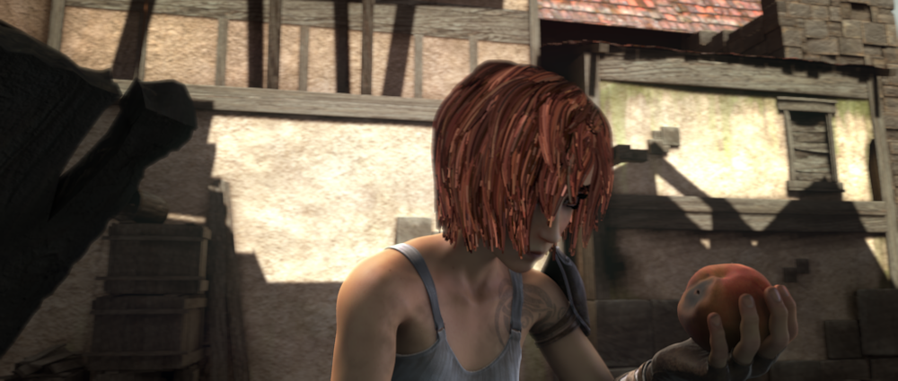
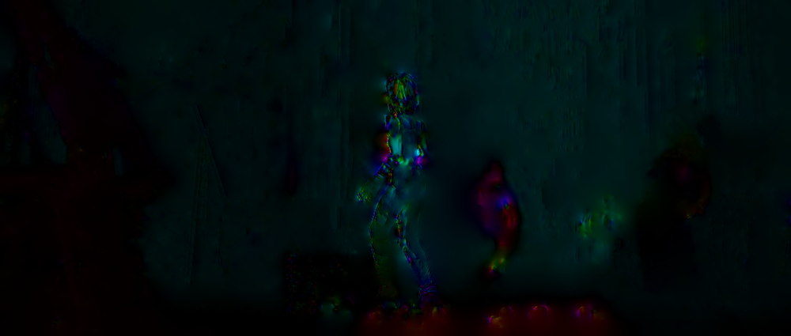
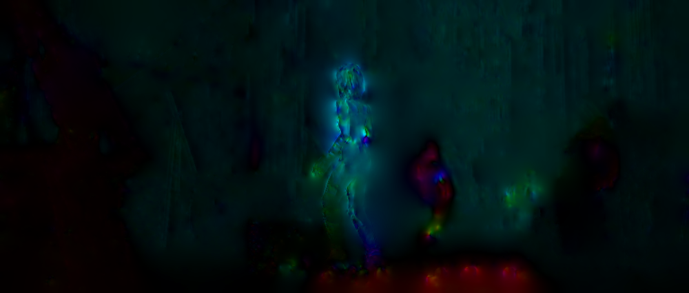
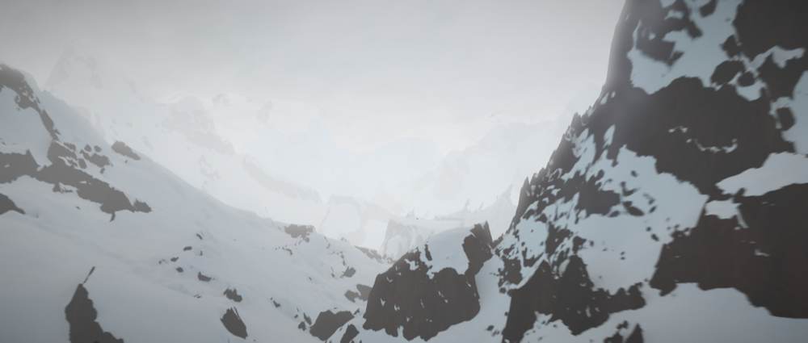
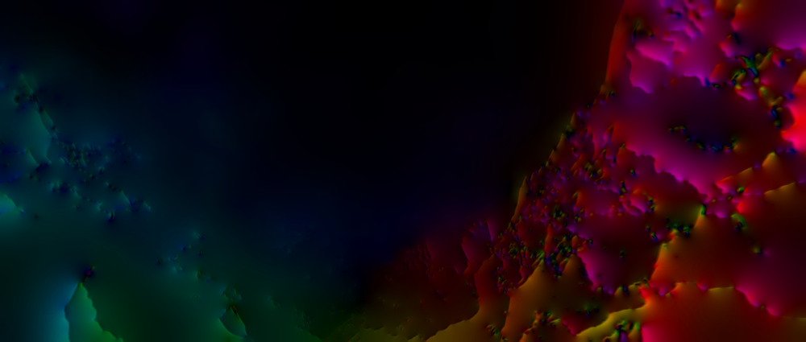
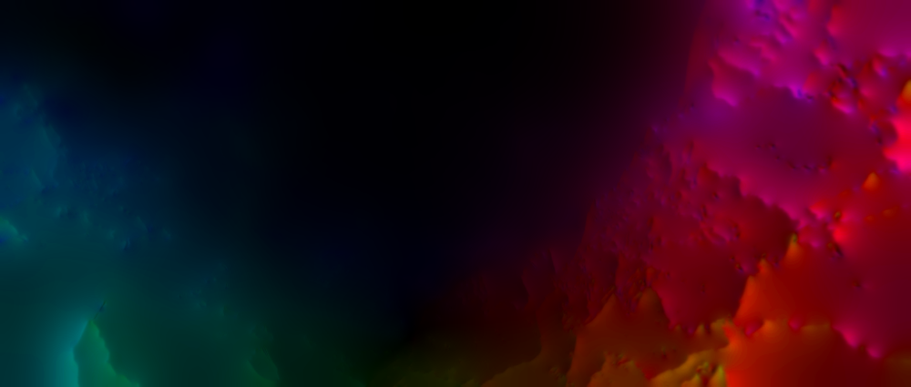
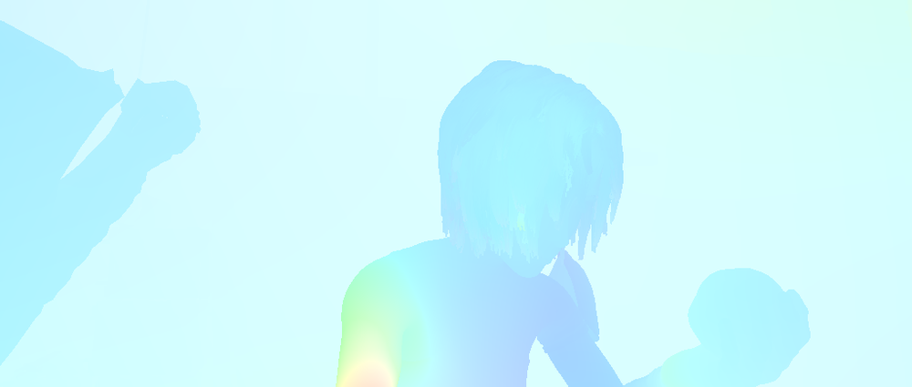
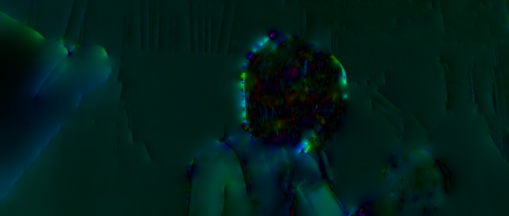

# Investigating Optical Flow Computation: From Local Methods to a Multiresolution Horn-Schunck Implementation with Bilinear Interpolation

**ArXiv ID**: 2511.16535v1
**URL**: http://arxiv.org/abs/2511.16535v1
**提交日期**: 2025-11-20
**作者**: Haytham Ziani
**引用次数**: NULL
使用模型: gemini-2.5-flash

## 1. 核心思想总结
好的，这是一份简洁的第一轮总结：

**标题:** 光流计算方法研究：从局部到基于双线性插值的多分辨率Horn-Schunck实现

**Background (背景):**
光流计算是图像处理中的重要任务。现有的方法主要分为局部方法（如Lucas-Kanade）和全局方法（如Horn-Schunck）。

**Problem (问题):**
传统光流算法在精度和收敛性方面可能存在局限，尤其是在不同图像条件下。本研究旨在改进运动估计的准确性和效率。

**Method (high-level) (高层方法):**
论文首先对Lucas-Kanade等局部方法和Horn-Schunck等全局方法进行了理论与实践分析。在此基础上，实现了一个结合双线性插值与延拓的多分辨率Horn-Schunck算法。

**Contribution (贡献):**
通过结合多分辨率策略与双线性插值，显著提升了Horn-Schunck算法在不同图像条件下的光流估计精度和收敛性，为运动估计提供了更有效的解决方案。

## 2. 方法详解
好的，基于您提供的初步总结和方法章节内容，以下是对该论文方法细节的详细阐述：

---

### 论文方法细节：基于双线性插值与延拓的多分辨率Horn-Schunck光流算法

#### 1. 整体方法概览

本研究旨在通过结合多分辨率策略与双线性插值技术，改进传统Horn-Schunck (HS) 光流算法在处理大位移、提高收敛性和估计精度方面的局限性。论文首先对经典局部方法Lucas-Kanade (LK) 和全局方法Horn-Schunck的原理进行深入分析，揭示其各自的优缺点与适用场景。在此基础上，核心创新在于实现了一个**基于双线性插值与光流场延拓的多分辨率Horn-Schunck算法**，旨在有效地在图像金字塔层级间传递和精化光流信息，从而实现更鲁棒和精确的运动估计。

#### 2. 经典光流算法的理论基础与局限性分析 (方法论述的基础)

在提出创新方法之前，论文对经典算法进行了详细的回顾与分析，这构成了理解其创新点的基础：

*   **2.1 Lucas-Kanade (LK) 光流算法:**
    *   **原理:** 基于泰勒展开的一阶近似和局部窗口内的亮度恒定假设。通过最小二乘法求解局部区域内的光流矢量。它假设局部区域内的所有像素具有相同的运动。
    *   **局限性分析:**
        *   对图像中的大位移运动不敏感，因为泰勒展开的一阶近似仅在小位移下有效。
        *   在纹理缺乏的均匀区域容易失效，因为无法提供足够的梯度信息来构建稳定的方程组。
        *   易受噪声影响。

*   **2.2 Horn-Schunck (HS) 光流算法:**
    *   **原理:** 同样基于亮度恒定假设，但引入了一个全局平滑约束（通常是光流场的梯度模平方和最小化），以解决病态问题。通过最小化一个结合了数据项（亮度误差）和平滑项（光流平滑度）的能量泛函来求解光流场。通过欧拉-拉格朗日方程推导出迭代求解公式。
    *   **局限性分析:**
        *   对图像中的大位移运动同样不鲁棒，收敛速度较慢。
        *   在运动边界或物体边缘处，平滑约束可能导致光流过度平滑，模糊细节，使得边缘处的光流估计不准确。
        *   易受噪声影响。

这些局限性分析明确指出了传统算法的痛点，直接促使了多分辨率策略和双线性插值延拓的引入，以克服HS算法在大位移和收敛性方面的挑战。

#### 3. 关键创新与核心思想

本论文的关键创新在于将**多分辨率策略**与**双线性插值结合的光流场延拓机制**融入到Horn-Schunck算法中。

*   **3.1 关键创新点一：多分辨率金字塔结构 (Multiresolution Pyramid Structure)**
    *   **核心思想:** 将原始图像序列构建成一系列尺度逐渐缩小的图像金字塔。通过从金字塔的顶层（最粗糙的图像）开始估计光流，并将该估计逐层传递并精化到金字塔的底层（原始图像分辨率），从而有效地处理大位移运动并加速收敛。
    *   **创新之处:** 解决单一分辨率下HS算法对大位移不敏感的问题，将大位移分解为多尺度上的小位移，提高算法的鲁棒性。

*   **3.2 关键创新点二：基于双线性插值的光流场延拓 (Bilinear Interpolation-based Optical Flow Field Propagation)**
    *   **核心思想:** 在多分辨率金字塔结构中，如何高效且准确地将上一层（更粗糙层）计算得到的光流信息传递到下一层（更精细层）是关键。本研究采用**双线性插值**作为上采样机制，并结合**光流场延拓**来为更精细层的光流计算提供一个“暖启动”（warm start）。
    *   **创新之处:**
        *   **双线性插值**：提供了一种平滑且高效的方式来插值光流场，确保在放大光流场时信息的连续性和准确性。
        *   **光流场延拓**：将粗糙层的光流乘以相应的尺度因子（例如，如果下采样因子是2，则光流向量乘以2），然后通过双线性插值生成下一层更精细的光流场作为其初始估计。这种“延拓”机制避免了从零开始计算光流，显著加速了高分辨率层级的收敛，并继承了粗糙层已经解决的大尺度运动信息。

#### 4. 算法/架构细节与整体流程

**4.1 多分辨率金字塔构建**

*   **目的:** 应对大位移，提高算法的鲁棒性和收敛速度。
*   **实现细节:** 采用高斯金字塔（Gaussian Pyramid）方法。对于输入的图像序列（图像帧 $I_t$ 和 $I_{t+1}$），通过连续的高斯模糊和下采样（通常是2倍）操作，生成一系列不同分辨率的图像对 $(I_t^L, I_{t+1}^L)$，其中 $L$ 代表金字塔层级，从最粗糙的 $L_{max}$ 到最精细的 $L_0$（原始分辨率）。
*   **结构:** 金字塔的每一层都包含两帧图像，用于在该层计算光流。

**4.2 Horn-Schunck方程的迭代求解**

*   **目的:** 在金字塔的每一层中，根据亮度恒定和平滑约束迭代求解光流场 $(u, v)$。
*   **实现细节:** 经典的Horn-Schunck能量泛函为：
    $E(u, v) = \iint ((I_x u + I_y v + I_t)^2 + \alpha^2 (\|\nabla u\|^2 + \|\nabla v\|^2)) dx dy$
    其中 $I_x, I_y, I_t$ 是图像的梯度和时间梯度，$\alpha$ 是平滑权重。
    通过欧拉-拉格朗日方程，可以得到迭代更新公式：
    $u^{k+1} = \bar{u}^k - \frac{I_x (I_x \bar{u}^k + I_y \bar{v}^k + I_t)}{\alpha^2 + I_x^2 + I_y^2}$
    $v^{k+1} = \bar{v}^k - \frac{I_y (I_x \bar{u}^k + I_y \bar{v}^k + I_t)}{\alpha^2 + I_x^2 + I_y^2}$
    其中 $\bar{u}^k, \bar{v}^k$ 是光流场 $u, v$ 在其邻域内的平均值，用于实现平滑约束。在每层金字塔中，会进行固定次数的迭代或直到收敛。

**4.3 层间光流的延拓与精化**

*   **关键步骤:** 这是多分辨率算法的核心机制。
*   **实现细节:**
    1.  **上采样 (Upsampling):** 当从较粗糙层 $L+1$ 移动到较精细层 $L$ 时，首先将 $L+1$ 层计算得到的光流场 $(u^{L+1}, v^{L+1})$ 进行上采样。具体方法是将其乘以金字塔的下采样因子（例如，如果是2倍下采样，则乘以2），以补偿分辨率的变化。
    2.  **双线性插值 (Bilinear Interpolation):** 对放大后的光流场进行双线性插值，以填充由于分辨率提高而新增的像素位置的光流值。双线性插值能够根据周围四个已知像素的光流值，平滑地估计出新像素的光流值，保持光流场的连续性。
    3.  **光流场延拓 (Flow Field Propagation):** 将经过上采样和双线性插值处理后的光流场作为下一层（更精细层 $L$）Horn-Schunck算法的**初始光流估计**。这个“暖启动”极大地减少了在精细层达到收敛所需的迭代次数，同时将粗糙层捕获的大尺度运动信息有效传递。

**4.4 整体算法流程**

1.  **金字塔构建:** 对输入的连续两帧图像 $I_t, I_{t+1}$ 构建多分辨率高斯金字塔，得到 $L_{max}$ 到 $L_0$ 层级的图像对。
2.  **初始化最粗糙层:** 在金字塔的顶层（最粗糙层 $L_{max}$），将初始光流场 $(u^{L_{max}}, v^{L_{max}})$ 设置为零向量。
3.  **自顶向下迭代 (Top-Down Iteration):**
    *   **循环从 $L_{max}$ 层到 $L_0$ 层:**
        *   **对当前层 $L$:**
            *   **光流初始化:** 如果是 $L_{max}$ 层，则光流初始化为零。如果不是 $L_{max}$ 层，则将上一层（更粗糙层 $L+1$）计算出的光流场 $(u^{L+1}, v^{L+1})$ 进行上采样（乘以尺度因子）并使用**双线性插值**进行精细化，得到当前层 $L$ 的初始光流估计。
            *   **迭代求解:** 在当前层 $L$ 的图像对上，使用Horn-Schunck迭代公式（如Jacobi或Gauss-Seidel）进行固定次数的迭代计算，不断更新光流场 $(u^L, v^L)$，直到收敛或达到最大迭代次数。
            *   **图像配准 (Image Warping, Implied):** 在每次迭代中，实际上会利用当前的光流估计对 $I_{t+1}$ 进行逆向形变，以计算更准确的 $I_t$ 与形变后的 $I_{t+1}$ 之间的亮度误差 $I_t$（在Horn-Schunck中，这隐含在$I_t u + I_y v + I_t$项中，其中$I_t$是形变后的图像差）。
        *   **传递到下一层:** 如果当前层不是最底层 $L_0$，则将当前层计算得到的精细化光流场 $(u^L, v^L)$ 保存，以备作为下一层 $L-1$ 初始化时的基础。
4.  **结果输出:** 当迭代到金字塔的最底层 $L_0$ 并完成计算后，得到最终的光流场 $(u^{L_0}, v^{L_0})$。

---

通过以上方法细节，该论文成功地将多分辨率框架与精巧的双线性插值和光流场延拓机制结合，有效地提升了Horn-Schunck算法在精度、鲁棒性和收敛速度方面的表现，特别是在面对大位移和复杂图像场景时。

## 3. 最终评述与分析
好的，结合您提供的初步总结和方法详述，以下是这份研究的最终综合评估：

---

### 光流计算方法研究：从局部到基于双线性插值的多分辨率Horn-Schunck实现 —— 综合评估

**1) Overall Summary (综合评估)**

本研究提出了一种改进的Horn-Schunck (HS) 光流算法，通过巧妙地整合多分辨率金字塔结构与基于双线性插值的光流场延拓机制，显著提升了传统HS算法在处理大位移、提高收敛速度和增强估计精度方面的表现。论文首先深入分析了Lucas-Kanade (LK) 和经典Horn-Schunck算法的理论基础与局限性，明确了现有算法在处理大位移和收敛性上的痛点。在此基础上，核心贡献在于实现了一个**自上而下**的多分辨率框架：它从图像金字塔的最粗糙层开始计算光流，并将该层的光流信息通过**尺度因子调整和双线性插值**平滑地“延拓”到下一层（更精细层），作为其光流计算的“暖启动”（warm start）。这种方法有效地将大位移分解为多尺度的微小运动，并通过层间信息传递加速了整体算法的收敛，同时确保了光流场的连续性和精确性。最终，该方法为运动估计提供了一个更鲁棒、更高效且更精确的解决方案。

**2) Strengths (优势)**

*   **有效处理大位移运动：** 通过引入多分辨率金字塔结构，将大位移问题分解为多尺度上的小位移估计，显著提升了Horn-Schunck算法对大位移运动的鲁棒性，克服了传统HS算法在此方面的主要局限。
*   **显著加速收敛：** 基于双线性插值的光流场延拓机制为金字塔的每一层（尤其是精细层）提供了高质量的初始光流估计（“暖启动”），这极大地减少了达到收敛所需的迭代次数，提升了算法的效率。
*   **提高光流估计精度：** 多分辨率策略的精细化过程，结合双线性插值在层间传递信息时的平滑性，使得最终的光流场在不同图像条件下都能达到更高的估计精度。
*   **保持光流场连续性：** 双线性插值在光流场上采样时能够平滑地填充新增像素的光流值，确保了光流场在层间传递过程中的连续性和自然过渡。
*   **算法设计模块化与可扩展性：** 基于成熟的Horn-Schunck算法进行改进，其多分辨率和插值延拓的框架具有良好的模块化，易于理解和在此基础上进一步优化或结合其他技术。
*   **理论基础扎实：** 对LK和HS算法的深入分析，为后续的改进工作奠定了坚实的理论基础，并明确了改进的必要性。

**3) Weaknesses / Limitations (劣势 / 局限性)**

*   **计算成本相对较高：** 尽管多分辨率策略加速了收敛，但与一些现代的、例如基于深度学习的光流方法相比，构建金字塔、层层迭代计算HS以及插值延拓的过程仍然具有较高的计算复杂度，可能难以满足严格的实时性要求。
*   **平滑约束导致的过平滑问题：** 改进的HS算法仍然继承了原始HS算法的全局平滑约束。这可能导致在运动边界、物体边缘或运动不连续区域，光流估计仍然存在过度平滑的问题，模糊细节。论文未提及针对边缘保持或不连续性处理的特殊机制。
*   **亮度恒定假设的局限性：** 算法依然依赖于亮度恒定假设，这意味着在面对光照变化、阴影、反射、遮挡等实际场景时，算法的性能可能会受到影响。
*   **参数敏感性：** 算法的性能可能受平滑权重 $\alpha$、金字塔层数、每层迭代次数等参数选择的影响，需要针对不同应用场景进行调优。
*   **对遮挡处理不足：** 传统的Horn-Schunck算法没有显式的机制来处理图像中的遮挡区域。当像素被遮挡或暴露时，亮度恒定假设失效，可能导致这些区域的光流估计不准确。

**4) Potential Applications / Implications (潜在应用 / 影响)**

*   **视频分析与理解：** 可用于视频中的目标跟踪、行为识别、运动分析、异常检测，为更高层次的视频内容理解提供精确的运动信息。
*   **机器人与自动驾驶：** 在机器人导航、视觉里程计（Visual Odometry）、同时定位与地图构建（SLAM）、障碍物检测以及环境感知中，提供关键的运动信息，增强系统的自主性和安全性。
*   **医学图像分析：** 分析生物组织的形变、血液流动、细胞运动等，为疾病诊断和治疗提供定量依据。
*   **计算机图形学与视觉：** 可应用于视频稳定、帧插值、运动模糊去除、3D重建中的运动补偿等任务，提升图像和视频处理的质量。
*   **安防监控：** 实现对特定区域内人员或车辆的运动监测，提供入侵检测、流量分析等功能。
*   **教育与研究基石：** 作为改进经典算法的优秀案例，为学生和研究人员提供一个理解多分辨率策略和光流延拓机制的良好基础，启发未来更先进光流算法的设计。
*   **特定领域应用优化：** 虽然计算成本相对较高，但对于一些允许离线处理或对实时性要求不那么极致，但对精度和鲁棒性有高要求的应用场景，该方法仍具显著价值。

---

---

# 附录：论文图片

## 图 1

## 图 2

## 图 3

## 图 4

## 图 5

## 图 6

## 图 7

## 图 8

## 图 9

## 图 10

