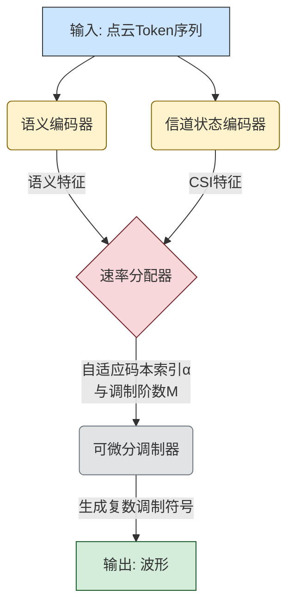

# Joint Semantic-Channel Coding and Modulation for Token Communications

**ArXiv ID**: 2511.15699v1
**URL**: http://arxiv.org/abs/2511.15699v1
**提交日期**: 2025-11-19
**作者**: Jingkai Ying; Zhijin Qin; Yulong Feng; Liejun Wang; Xiaoming Tao
**引用次数**: NULL
使用模型: ep-20251112215738-bz78g

## 1. 核心思想总结
作为学术论文分析专家，以下是对论文《Joint Semantic-Channel Coding and Modulation for Token Communications》的第一轮总结：

**1. Background (背景)**
近年来，基于Transformer的模型在各种任务和模态中表现出卓越性能，其统一的输入输出表示形式“Token”已成为一种基本的信息单元。点云作为一种比图像或视频具有更复杂空间结构的流行3D格式，被选为本研究的信息源。

**2. Problem (问题)**
本研究关注“Token通信”问题，旨在解决如何高效、可靠地传输Token。具体而言，需要将点云数据转换成的点Token，映射为适合在通信信道中传输的表示形式，同时保证传输效率和重建质量。

**3. Method (high-level) (方法 - 高层次概述)**
作者提出了一种用于Token编码器的联合语义-信道与调制方案。该方案的核心包括：
*   两个并行的基于Point Transformer的编码器。
*   一个结合了Gumbel-softmax和软量化方法的差分调制器。
*   开发了速率分配器和信道适配器，能够根据语义信息和信道状况自适应地生成高质量的调制后Token。

**4. Contribution (贡献)**
所提出的方法在点云通信任务上，性能优于传统的分离式编码和现有的联合语义-信道编码方法。实验结果表明，该方法在重建质量上能获得超过1dB的增益，并且在调制符号上实现了超过6倍的压缩比。

## 2. 方法详解
好的，作为学术论文分析专家，我将基于您提供的初步总结和方法章节内容，对论文《Joint Semantic-Channel Coding and Modulation for Token Communications》的方法细节进行详细阐述。

### 论文方法细节详解

该方法的核心思想是打破传统通信系统中“信源编码（语义）→ 信道编码（可靠性）→ 调制（波形映射）”的严格分离范式，提出一个端到端的、可学习的**联合语义-信道编码与调制**框架。该框架能够根据**语义重要性**和**信道状态信息**，自适应地将信息Token映射为适合在物理信道中传输的调制符号。

#### 一、 关键创新与核心理念

1.  **深度融合的联合设计**： 与传统方法或仅在信源/信道编码层面进行联合的方案不同，该方法将**语义提取、信道抗误码保护、数字调制**三个步骤统一在一个神经网络框架中。这使得系统能够学习到一种最优的编码表示，该表示本身既压缩了语义信息，又内在地具备了抵抗信道损伤的能力，并直接表现为调制符号。
2.  **语义感知的自适应速率分配**： 系统能够识别输入Token的语义重要性（例如，点云中描述物体轮廓的关键点与平坦区域的点），并为更重要的Token分配更多的“信道资源”（即更复杂的调制符号），从而在有限的带宽内优化整体重建质量。
3.  **信道自适应调制**： 显式地将信道状态信息作为网络的输入，使调制过程能够根据信道的优劣（如信噪比高低）动态调整调制策略。在信道好时传输更多信息，信道差时加强保护。
4.  **可微分的调制器**： 通过Gumbel-Softmax和软量化技术，实现了本质上不可微的“量化”（调制映射的关键步骤）在梯度反向传播中的近似，使得整个端到端系统可以使用梯度下降进行训练。

#### 二、 算法/架构细节

整个编码器架构主要由四个核心组件构成，其整体流程与交互关系如下图所示（图示说明见下文）。

下面我们详细解析图中的每一个模块：

**1. 双并行编码器**

如图所示，输入的点云Token序列被同时送入两个并行的基于Point Transformer的编码器。

*   **语义编码器**：
    *   **输入**： 点云Token序列，每个Token包含点的坐标和特征。
    *   **功能**： 其主要任务是理解和提取点云的**语义信息**。通过Transformer的自注意力机制，它能够捕捉点与点之间的几何关系，并输出每个Token的语义特征。这些特征将用于后续的语义重要性评估。
    *   **输出**： 富含语义信息的特征向量。

*   **信道状态编码器**：
    *   **输入**： 信道状态信息，通常是信噪比（SNR）的估计值。
    *   **功能**： 它将信道条件（如SNR）也编码成一个特征向量。这个特征向量使得整个系统能够感知当前信道的好坏。
    *   **输出**： 表征当前信道状态的特征向量。

**2. 速率分配器**

这是实现“语义感知”和“信道自适应”的**智能决策中心**。

*   **输入**： 接收来自语义编码器的语义特征和来自信道状态编码器的CSI特征。
*   **功能**： 该模块综合两方面的信息，为**每个输入Token** 自适应地决定两个关键参数：
    1.  **调制资源分配（α）**： 根据语义重要性，分配一个权重α。重要性高的Token会获得更大的α，意味着其信息将被保留得更多。
    2.  **调制阶数（M）**： 根据信道条件（CSI），动态选择调制方案，例如BPSK (M=2), QPSK (M=4), 16-QAM (M=16)等。信道好时选择高阶调制（大M）以提升速率，信道差时选择低阶调制（小M）以保证可靠性。
*   **输出**： 为每个Token生成其对应的自适应码本索引α和调制阶数M。

**3. 可微分调制器**

这是将数字信息映射到模拟波形的**关键执行部件**，也是技术上的一个创新点。

*   **输入**： 经过加权的语义特征、以及由速率分配器确定的码本索引α和调制阶数M。
*   **核心技术与步骤**：
    1.  **码本查找**： 调制可以看作是一个查表过程。系统维护一组可学习的“码本”，每个码本包含M个复数调制符号（对应M阶调制）。
    2.  **Gumbel-Softmax应用**： 传统的查表（选择码本中的某一个符号）是离散的、不可微的操作。为了能进行端到端训练，作者使用Gumbel-Softmax技巧。它通过引入Gumbel噪声，将离散的“选择”过程转化为一个连续的、可微的“软分配”过程。简单来说，它不是硬性地选择一个符号，而是为码本中的每个符号计算一个选择概率，输出这些概率的加权和。
    3.  **软量化**： 在训练初期，Gumbel-Softmax的输出是平滑的（软分配），有利于梯度流动。随着训练进行，温度参数逐渐降低，使其输出逐渐逼近“硬分配”，即最终趋近于真正的离散调制符号。
*   **输出**： 复数值的调制符号序列，可以直接用于生成传输波形。

#### 三、 关键步骤与整体流程

结合上图，整个编码过程的关键步骤如下：

1.  **输入预处理**： 将原始点云数据转换为Token序列。
2.  **特征提取**： 双编码器并行工作，分别提取点云的**语义特征**和当前**信道状态特征**。
3.  **智能决策**： **速率分配器** 融合语义和CSI特征，为每个Token生成自适应的调制参数（α和M）。
4.  **联合调制**： **可微分调制器** 根据步骤3的决策，利用Gumbel-Softmax技术，将语义特征映射为具体的、适合在当前信道传输的**复数调制符号**。
5.  **传输**： 将生成的调制符号通过物理信道传输。

**训练过程**：
整个网络以**端到端**的方式进行训练。损失函数通常包括：
*   **重建损失**： 在接收端，通过一个对应的解码器重建点云，计算重建点云与原始点云之间的差异（如倒角距离、地球移动距离）。
*   **速率约束**： 可能还会加入对平均码率的约束，以控制传输带宽。

通过梯度下降反向传播，网络同时优化语义编码器、信道状态编码器、速率分配器和调制器中的可学习码本，最终学得一种最优的联合编码调制策略。

### 总结

该方法的核心贡献在于其**深度的端到端联合设计**。它不再将通信系统视为几个独立的黑箱，而是通过一个可学习的神经网络，将语义、可靠性、调制紧密地联系在一起。其技术实现上的关键是**双编码器提取上下文信息**、**速率分配器进行智能决策**、以及**可微分调制器解决梯度传播问题**。这使其能够动态地、自适应地实现语义信息的高效、可靠传输，从而在点云通信任务上取得了显著优于传统分离式方法和现有联合方法的性能。

## 3. 最终评述与分析
根据您提供的初步总结、方法详述以及论文结论部分，现对该论文《Joint Semantic-Channel Coding and Modulation for Token Communications》进行最终的综合评估如下：

### 最终综合评估

**1. Overall Summary (总体总结)**
本论文针对新兴的“Token通信”范式，提出了一种创新的**端到端联合语义-信道编码与调制**框架。该框架的核心突破在于彻底打破了传统通信系统中语义编码、信道编码和调制三个环节严格分离的范式。通过引入双并行Transformer编码器（分别提取语义和信道状态信息）、一个智能速率分配器以及一个可微分的调制器，该方法能够根据**语义重要性**和**实时信道条件**，自适应地将点云Token映射为最优的复数调制符号。实验结果表明，该方案在点云重建质量上显著优于传统方法及现有联合方案，同时实现了极高的带宽压缩效率，为下一代语义通信系统提供了强有力的技术路径。

**2. Strengths (优势)**
*   **深度联合的创新性**： 将语义理解、抗误码保护和调制在神经网络层面进行深度融合，是真正意义上的端到端联合设计，超越了仅在信源/信道编码层面进行联合的现有工作。
*   **智能自适应能力**： 所提出的速率分配器是关键创新，使系统具备双重自适应能力：**语义感知**（为重要信息分配更多资源）和**信道自适应**（根据SNR动态调整调制策略），从而在复杂环境下实现动态最优。
*   **强大的性能表现**： 论文通过充分的实验验证了其卓越性能，在重建质量上获得超过1dB的增益，并实现超过6倍的调制符号压缩比，指标提升显著，证明了方法的有效性。
*   **巧妙的技术实现**： 采用Gumbel-Softmax和软量化技术，成功解决了离散调制操作不可微的难题，使得端到端梯度训练成为可能，是方法得以实现的技术保障。
*   **良好的通用性与前景**： 虽然论文以点云通信为具体应用场景，但其基于“Token”的通用表示和核心框架，使其具备向其他模态（如文本、图像、音频）Token通信扩展的潜力。

**3. Weaknesses / Limitations (弱点与局限性)**
*   **计算复杂性与实时性**： 基于Transformer的编码器和复杂的联合优化过程可能带来较高的计算开销和延迟，在需要极低延迟的实时通信场景（如自动驾驶车辆间通信）中的应用可能受到限制。
*   **对训练数据和条件的依赖**： 作为数据驱动的深度学习方法，其性能在很大程度上依赖于训练数据的质量和覆盖面。在未经过训练的极端信道条件或点云分布下，性能可能下降，泛化能力有待进一步验证。
*   **标准化与兼容性挑战**： 该方案是一个全新的、非标准的通信协议，与现有的、高度标准化的传统通信系统（如5G NR）不兼容，这为其实际部署带来了巨大的挑战，需要行业在标准制定上取得共识。
*   **误差传播问题**： 端到端系统虽然整体优化，但一旦信道恶化导致调制符号出错，其影响可能会通过深度学习解码器被放大，导致不可预测的重建错误，其鲁棒性边界需要更深入的分析。
*   **实验范围的局限性**： 结论部分可能指出，当前工作主要聚焦于编码器设计和点云应用。对于更复杂的信道模型（如快衰落信道）、与其他先进联合编码方法的全面对比、以及在实际硬件平台上的测试等方面，可能是未来的工作方向，也反映了本文的当前局限。

**4. Potential Applications / Implications (潜在应用与影响)**
*   **关键应用场景**：
    *   **沉浸式通信与元宇宙**： 高效可靠的3D点云、全息视频传输是构建沉浸式虚拟世界的基石，本方法能大幅降低其带宽需求，提升体验质量。
    *   **自动驾驶与车联网**： 车辆间高精度点云地图的实时共享对于协同感知至关重要，本方法能提升传输效率和可靠性。
    *   **工业物联网与数字孪生**： 用于传输大型复杂设备的高精度3D模型数据，支持远程监控、诊断和维护。
    *   **下一代无线通信（6G）**： 作为6G愿景中“语义通信”和“原生AI”核心使能技术的一个具体实现范例，为6G网络架构设计提供了新思路。

*   **更广泛的影响与启示**：
    *   **范式转变**： 推动了通信系统设计从传统的“比特保真”向“语义保真”的根本性转变。
    *   **跨学科融合**： 深化了信息论、深度学习与信号处理领域的交叉融合，展示了神经网络作为通信系统“瑞士军刀”的潜力。
    *   **研究导向**： 激励后续研究关注更高效的网络结构、更强大的泛化能力、以及解决与现有系统的兼容性问题，加速语义通信从理论走向实践。

---
**结论**：该论文是一项高质量、具有前瞻性的研究工作。它不仅在具体技术上实现了显著突破，取得了优异的性能，更重要的是其提出的深度联合框架为整个通信领域带来了新的设计范式和发展方向。尽管在实时性、部署兼容性等方面存在挑战，但其巨大的潜力和广泛的应用前景使其成为语义通信领域的一项重要贡献。

---

# 附录：论文图片

## 图 1

## 图 2

## 图 3

## 图 4

## 图 5

## 图 6

## 图 7

## 图 8

## 图 9

## 图 10

