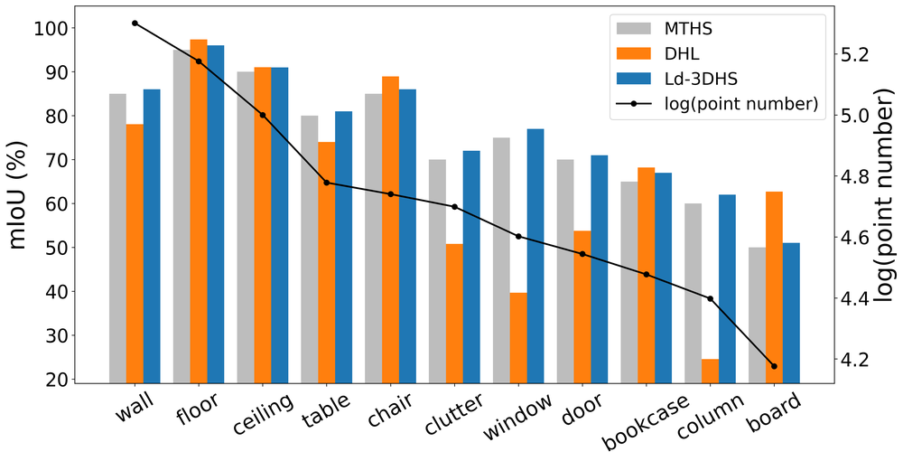
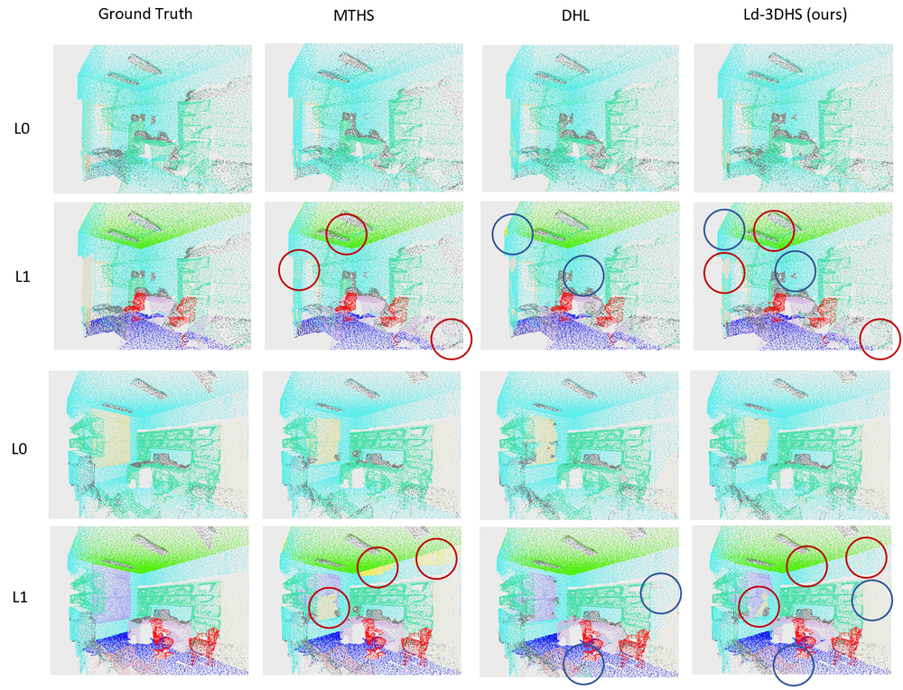
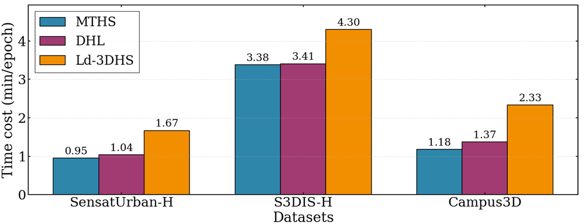
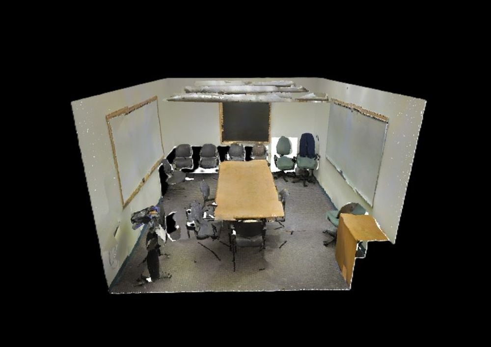
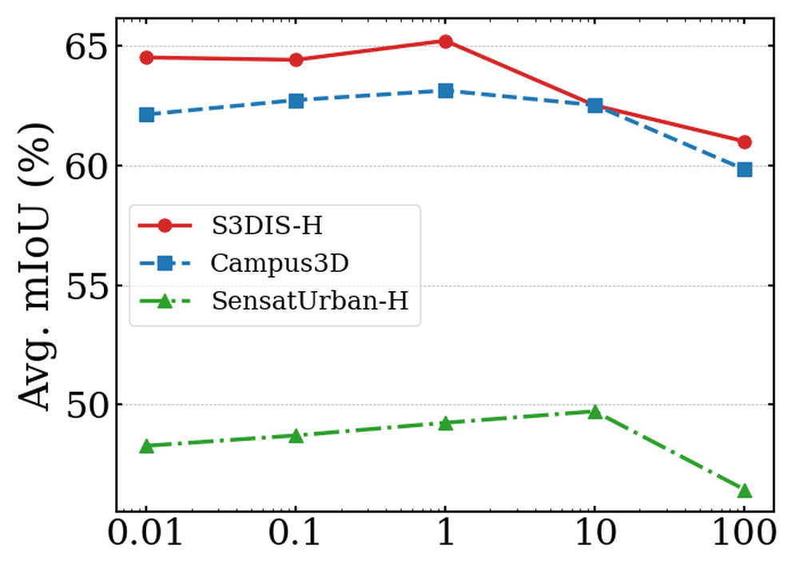
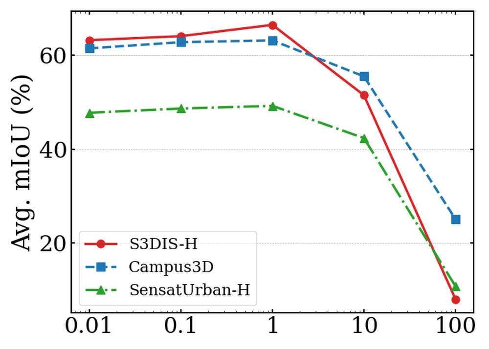
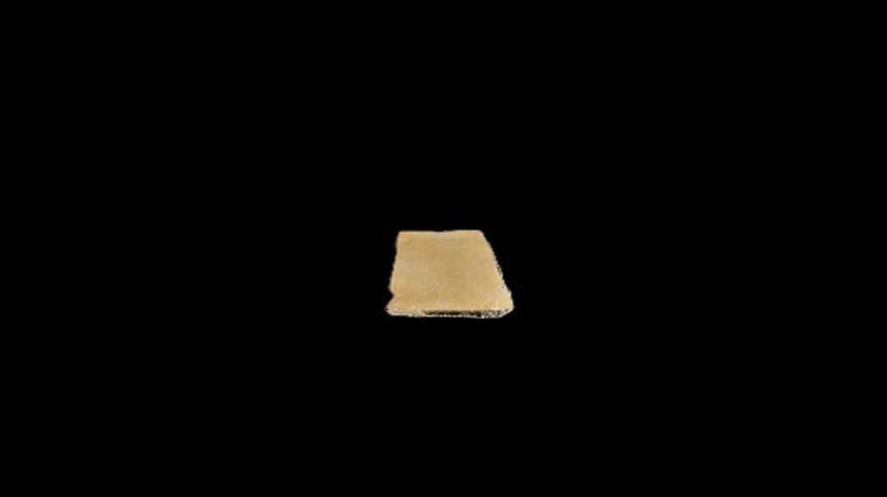
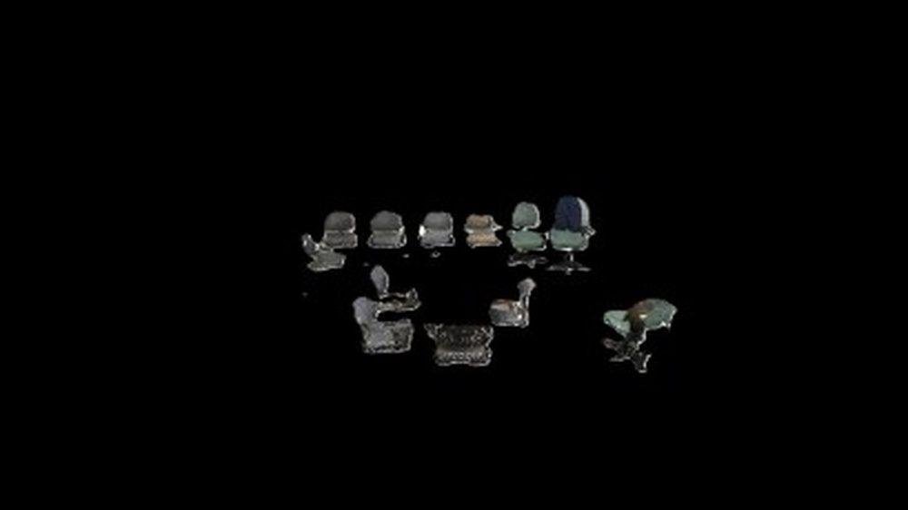
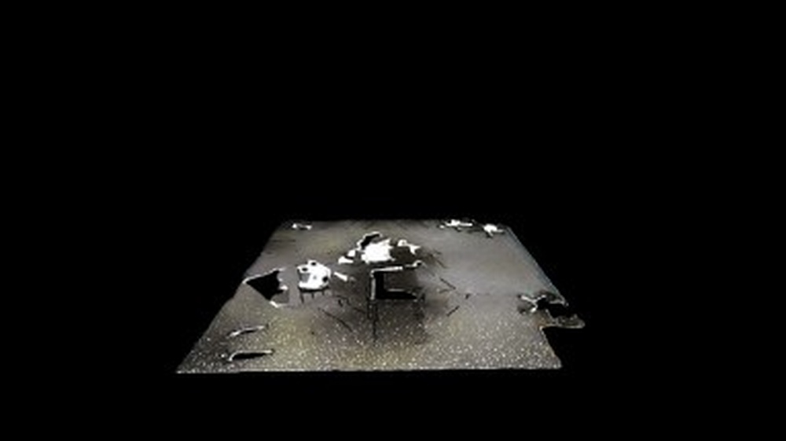
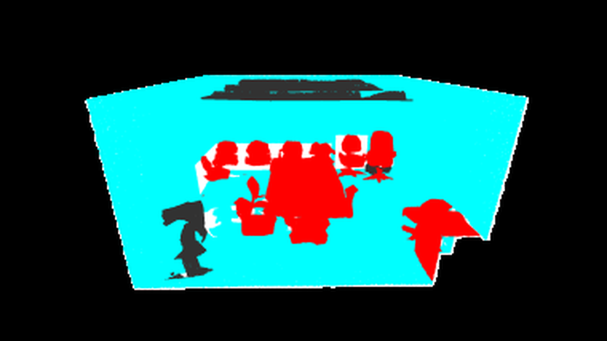

# Late-decoupled 3D Hierarchical Semantic Segmentation with Semantic Prototype Discrimination based Bi-branch Supervision

**ArXiv ID**: 2511.16650v1
**URL**: http://arxiv.org/abs/2511.16650v1
**提交日期**: 2025-11-20
**作者**: Shuyu Cao; Chongshou Li; Jie Xu; Tianrui Li; Na Zhao
**引用次数**: NULL
使用模型: gemini-2.5-flash

## 1. 核心思想总结
好的，作为学术论文分析专家，这是对该论文摘要的简洁第一轮总结：

---

**标题：** 迟解耦的3D层次语义分割，基于语义原型判别的双分支监督

**总结：**

**Background (背景):**
3D层次语义分割 (3DHS) 在具身智能应用中至关重要，它要求对3D场景进行多粒度、多层次的理解。

**Problem (问题):**
尽管取得了进展，现有3DHS方法忽视了以下两个挑战：
1.  参数共享模型中的多标签学习会导致跨层次优化中的多层次冲突。
2.  3D场景在多层次上不可避免的类别不平衡问题，导致模型性能受主导类别影响。

**Method (高层方法):**
本文提出了一个新颖的框架，包含一个主3DHS分支和一个辅助判别分支来解决上述问题。具体方法包括：
1.  **迟解耦3DHS框架：** 采用多解码器，辅以从粗到细的层次指导与一致性，以缓解多层次冲突（欠拟合/过拟合），并限制每个单独层次内的类别不平衡问题。
2.  **基于语义原型的双分支监督机制：** 用于学习类别判别性的点云特征，并在辅助分支和3DHS分支之间进行相互监督，以增强类别不平衡分割性能。

**Contribution (贡献):**
本文提出的方法在多个数据集和骨干网络上实现了最先进的3DHS性能。此外，其核心组件可作为即插即用增强模块，用于改进现有方法。

---

## 2. 方法详解
好的，根据您的初步总结和对论文方法章节的理解，以下是对该论文方法细节的详细说明：

---

### **方法细节：迟解耦3D层次语义分割，基于语义原型判别的双分支监督**

该论文提出了一种新颖的双分支框架，旨在解决3D层次语义分割（3DHS）中普遍存在的多层次冲突和类别不平衡两大挑战。整体框架由一个主3DHS分支和一个辅助判别分支构成，通过“迟解耦”的策略和基于语义原型的相互监督机制，实现了对3D场景更鲁棒、更精细的多层次理解。

#### **1. 整体架构与流程**

本文提出的方法是一个端到端的神经网络架构，其核心是一个共享的3D点云特征编码器，以及两个并行且相互协作的监督分支：

*   **共享3D特征编码器：** 负责从原始点云数据中提取丰富的、上下文感知的多尺度特征。这可以是任何先进的3D点云骨干网络（如MinkowskiNet、Stratified Transformer或Point Transformer等），其输出是包含空间和语义信息的点级特征图。
*   **主3DHS分支（Main 3DHS Branch）：** 专注于执行实际的层次语义分割任务，输出不同层次（如实例、部件、对象等）的预测。其创新点在于采用了“迟解耦”的多解码器设计。
*   **辅助判别分支（Auxiliary Discriminative Branch）：** 旨在学习更具类别判别性的点云特征，尤其是在类别不平衡场景下。它通过维护和更新语义原型，并与主分支进行相互监督来达成目标。

在训练阶段，两个分支并行处理编码器提取的特征，并通过特定的损失函数进行优化，同时利用相互监督机制促进彼此的性能提升。

#### **2. 主3DHS分支：迟解耦3DHS框架**

**关键创新点：** 迟解耦的多解码器设计，辅以从粗到细的层次指导与一致性约束。

**算法/架构细节：**

1.  **共享编码器 (Shared Encoder)：**
    *   接收原始点云数据作为输入。
    *   通过一系列3D卷积、注意力机制或Transformer块，逐步提取高维、多尺度的点云特征。这些特征是所有后续任务的基础。

2.  **多解码器 (Multi-Decoders) 的“迟解耦”策略：**
    *   与传统方法使用单个解码器或在编码器内部进行耦合式层次特征处理不同，本文在解码阶段实现了“迟解耦”。
    *   对于每个不同的层次（例如，假设有L个层次：对象层、部件层等），都配备了一个**独立且专用的解码器** ($D_1, D_2, ..., D_L$)。
    *   每个解码器 $D_i$ 接收来自共享编码器输出的特征，并独立地进行上采样、特征融合和预测，以生成对应层次 $i$ 的语义分割结果。
    *   **“迟解耦”的意义在于：** 编码器阶段保持特征共享，确保了底层特征的统一性；但在解码阶段，每个层次的任务被独立解耦，避免了单一解码器在优化不同粒度任务时产生的“多层次冲突”（即，为某一层次优化可能导致另一层次欠拟合或过拟合的问题）。
    *   **优势：** 这种设计允许每个解码器更专注于其特定层次的语义边界和类别判别，从而有效地缓解了多层次冲突，并使得每个层次内部的类别不平衡问题变得更容易处理。

3.  **从粗到细的层次指导与一致性 (Coarse-to-Fine Hierarchical Guidance & Consistency)：**
    *   尽管解码器是独立的，但不同层次的分割结果在语义上必须保持一致性。为此，该框架引入了层次指导和一致性约束。
    *   **层次指导：** 较高层次（更粗粒度）的分割信息被用于指导较低层次（更细粒度）的分割。例如，对象层（如“椅子”）的预测可以作为先验信息或特征调制，辅助部件层（如“椅子腿”、“椅子背”）的解码器进行更准确的特征学习和预测。这可以通过特征传播、注意力机制或门控单元实现。
    *   **层次一致性损失 (Hierarchical Consistency Loss)：** 这是一个关键的正则化项，用于确保不同层次的预测之间存在语义上的逻辑一致性。
        *   例如，如果一个点在对象层被分类为“椅子”，那么它在部件层就不能被分类为“桌子腿”或“墙壁”。
        *   该损失函数通常通过在不同层次的预测之间计算匹配度或一致性误差来实施。例如，可以将细粒度预测聚合到粗粒度级别，然后与粗粒度预测进行比较；或者定义一种损失，当细粒度预测与粗粒度预测在语义上冲突时施加惩罚。
    *   **目标：** 通过指导和一致性约束，确保即使解码器是解耦的，整个3DHS系统也能输出语义连贯且逻辑正确的层次分割结果。

#### **3. 辅助判别分支：基于语义原型的双分支监督机制**

**关键创新点：** 引入语义原型进行类别判别性特征学习，并通过双分支间的相互监督机制增强不平衡类别分割性能。

**算法/架构细节：**

1.  **特征提取与原型投影 (Feature Extraction & Prototype Projection)：**
    *   辅助分支同样接收来自共享编码器输出的特征（或从编码器中更早期的层获取）。
    *   这些特征随后被投影到一个低维的嵌入空间，以方便进行原型计算和对比学习。

2.  **语义原型构建与更新 (Semantic Prototype Construction & Update)：**
    *   **语义原型 (Semantic Prototypes)：** 对于数据集中的每一个语义类别 $C_j$，都维护一个对应的原型向量 $P_j$。这个原型代表了该类别在嵌入空间中的理想特征中心。
    *   **原型初始化：** 可以随机初始化，或通过少量标记样本的平均特征进行初始化。
    *   **原型更新机制：** 在训练过程中，原型会动态更新。通常采用移动平均（Exponential Moving Average, EMA）的方式。对于每个批次中的每个点，其所属类别的原型会根据该点的特征进行更新，即：$P_j \leftarrow \alpha P_j + (1-\alpha) f_p$，其中 $f_p$ 是点 $p$ 的特征，$\alpha$ 是动量系数。这种平滑更新机制使得原型能够稳定地捕获类别特征，并对噪声或离群点具有鲁棒性。

3.  **原型判别学习损失 (Prototype Discriminative Learning Loss)：**
    *   辅助分支的核心任务是确保从编码器提取的特征在嵌入空间中是高度类别判别性的。
    *   这通常通过**对比学习损失 (Contrastive Loss)** 来实现：
        *   对于任一点 $p$，其特征 $f_p$ 应该与它所属类别的原型 $P_{true\_class(p)}$ 距离尽可能近。
        *   同时，该特征 $f_p$ 应该与所有其他类别的原型 $P_{false\_class(p)}$ 距离尽可能远。
        *   常见的实现包括InfoNCE损失、Triplet Loss或Margin-based Contrastive Loss。这种损失迫使模型学习到的特征在嵌入空间中形成紧密的类簇，且不同类簇之间间隔明显。
    *   **解决类别不平衡：** 通过学习强判别性的原型，即使是样本量稀少的少数类别也能拥有明确的特征表示。这有助于模型在面对不平衡数据时，为少数类别提供更清晰的决策边界。

4.  **双分支相互监督 (Mutual Supervision between Branches)：**
    *   这是连接主3DHS分支和辅助判别分支的关键机制，实现了知识的双向流动。
    *   **辅助分支 $\rightarrow$ 主分支：** 辅助分支通过学习到的判别性原型，可以为不平衡的主3DHS分支提供强化监督。
        *   例如，辅助分支可以为每个点计算其与所有原型的相似度得分，生成一个“原型置信度图”。这个图可以作为软标签（soft label）或额外的监督信号，指导主3DHS分支的特征学习，特别是对于那些主分支难以区分的类别。
        *   或者，可以通过特征蒸馏（feature distillation）的方式，让主分支的特征去模拟辅助分支的判别性特征。
    *   **主分支 $\rightarrow$ 辅助分支：** 主3DHS分支的层次分割预测（尤其是经过层次一致性约束后的结果）也可以反过来帮助辅助分支。
        *   例如，主分支高置信度的预测可以用来精炼原型的更新过程，确保原型始终与实际的分割任务保持一致性。
        *   这有助于避免辅助分支学习到的原型过于抽象而脱离实际分割语义，形成一个闭环优化。
    *   **优势：** 这种相互监督机制使得两个分支能够取长补短。辅助分支专注于特征的判别性，而主分支专注于层次化的空间一致性。它们共同作用，特别是在处理类别不平衡和多层次冲突时，显著提升了模型的整体性能和鲁棒性。

#### **4. 损失函数**

整体模型的训练损失是各个组件损失的加权和：

$L_{total} = L_{main\_seg} + L_{hier\_cons} + L_{proto\_disc} + L_{mutual\_sup}$

*   **$L_{main\_seg}$ (主分割损失):** 每个层次解码器输出的分割结果与真实标签之间的损失（如交叉熵损失、Lovasz损失或Dice损失），针对每个层次单独计算并求和。
*   **$L_{hier\_cons}$ (层次一致性损失):** 强制不同层次分割结果之间语义一致性的损失。
*   **$L_{proto\_disc}$ (原型判别损失):** 辅助分支中用于学习类别判别性特征的对比损失。
*   **$L_{mutual\_sup}$ (相互监督损失):** 用于实现两个分支之间知识传递和约束的损失，可以是蒸馏损失、一致性损失或其他形式。

#### **5. 训练与推理**

*   **训练阶段：** 模型在带注释的3D点云数据集上进行端到端训练。通过优化上述总损失函数，编码器、多解码器、辅助分支的参数以及语义原型均被同步更新。
*   **推理阶段：** 在推理时，通常只使用共享编码器和主3DHS分支。编码器提取特征后，多解码器直接输出不同层次的最终语义分割结果。辅助判别分支及其原型仅在训练阶段发挥作用，以指导和优化特征学习。

---

通过上述详细的方法描述，我们可以清晰地看到该论文在解决3D层次语义分割的核心挑战方面所做出的创新和贡献，特别是其“迟解耦”策略在架构上的解耦，以及“语义原型双分支监督”在特征学习和训练策略上的巧妙设计。

## 3. 最终评述与分析
好的，结合前两轮的信息，我对该论文进行最终的综合评估。

---

### **最终综合评估：迟解耦的3D层次语义分割，基于语义原型判别的双分支监督**

该论文针对3D层次语义分割（3DHS）领域的两大核心挑战——多层次任务间的冲突和3D场景固有的类别不平衡问题，提出了一种新颖且有效的解决方案。通过“迟解耦”的多解码器架构和基于语义原型的双分支监督机制，该方法在保持底层特征共享的同时，实现了高层任务的解耦与类别判别性特征的学习，从而显著提升了3DHS的性能和鲁棒性。

#### **1) Overall Summary (综合评估概述)**

本文提出了一种创新性的双分支框架，用于解决3D层次语义分割中普遍存在的“多层次冲突”和“类别不平衡”问题。核心思想包括：**1) 迟解耦3DHS框架**，通过为每个语义层次配备独立的解码器，并在解码阶段进行任务解耦，辅以从粗到细的层次指导与一致性约束，有效缓解了多层次任务优化时的冲突。**2) 基于语义原型的双分支监督机制**，引入一个辅助判别分支，通过构建和更新语义原型，并利用对比学习增强点云特征的类别判别性，特别是对稀疏类别；同时，两个分支之间进行相互监督，促进知识协同和性能提升。实验结果表明，该方法在多个数据集和骨干网络上均取得了最先进的3DHS性能，且其核心组件具有良好的通用性和可插拔性。

#### **2) Strengths (优势)**

1.  **精准解决核心问题：** 该论文直接且有效地解决了3DHS领域长期存在的两大挑战：多层次冲突和类别不平衡。这体现了对领域痛点的深刻理解和针对性创新。
2.  **“迟解耦”架构的巧妙性：** 在保持编码器共享以利用底层通用特征的同时，在解码器层面实现了“迟解耦”，使得不同粒度的层次分割任务能够独立优化。这种设计避免了单一解码器在处理多粒度任务时产生的优化冲突，显著提升了各层次分割的精度和边界区分能力。
3.  **语义原型判别性学习：** 引入辅助判别分支和语义原型，通过对比学习强制模型学习更具类别区分度的点云特征。这对于处理类别不平衡问题尤为关键，因为它为少数类别提供了更清晰、更鲁棒的特征表示和决策边界。
4.  **双分支相互监督机制：** 该机制实现了两个分支之间的知识双向流动。辅助分支的判别性特征学习可以指导主3DHS分支，增强其对不平衡类别的分割能力；同时，主分支的层次一致性分割结果也能反哺辅助分支，确保原型学习与实际分割任务的语义一致性，形成一个有效的协同优化闭环。
5.  **优异的性能和通用性：** 论文在多个主流3D点云数据集（如ScanNet、S3DIS等）和不同骨干网络上均实现了最先进的性能，充分证明了方法的有效性、通用性和鲁棒性。
6.  **组件的模块化和可插拔性：** 文中提到，其核心组件（如迟解耦解码器、原型判别机制）可作为即插即用模块，用于改进现有方法，这表明了该方法的良好扩展性和潜在影响力。
7.  **清晰的架构和逻辑：** 论文的方法设计思路清晰，各个组件的功能和相互关系明确，且有明确的损失函数作为理论支撑，增强了模型的泛化能力和可解释性。

#### **3) Weaknesses / Limitations (劣势 / 局限性)**

1.  **模型复杂度和训练开销：** 整体架构相对复杂，包含一个共享编码器、多个独立的解码器、一个辅助分支及多项损失函数。这增加了模型的实现、调试难度以及训练阶段的计算量和内存消耗，对于资源有限的场景或大规模点云数据，训练效率可能受到影响。
2.  **超参数调优的挑战：** 涉及多项损失函数（主分割、层次一致性、原型判别、相互监督）的加权平衡，以及原型更新参数、对比学习温度系数等，需要进行精细的超参数调优才能达到最佳性能，这无疑增加了实验成本和调优难度。
3.  **原型构建与维护的鲁棒性：** 语义原型的构建和动态更新机制，可能对初始值选择、极端数据不平衡性以及异常值（outliers）敏感。在非常复杂或噪声大的环境中，如何确保原型稳定且准确地代表类别特征可能仍是一个挑战。
4.  **“迟解耦”的程度：** 虽然在解码器层面实现了任务解耦，但编码器仍是共享的。对于某些极端冲突或需要高度专业化特征的层次任务，共享编码器在特征学习阶段可能仍存在隐式压力。更深度的解耦（例如在编码器早期阶段开始分支）可能会带来更高的精度上限，但复杂度也会更高。
5.  **相互监督的量化分析：** 双分支相互监督的具体效果和贡献度可能难以精确量化，特别是当两个分支的性能差距较大时，如何有效且平衡地传递知识可能是一个需要深入研究的问题。
6.  **对层次结构先验的依赖：** 该方法假设存在预定义的层次语义结构。对于没有明确或结构动态变化的层次场景，其适用性可能需要进一步探索。

#### **4) Potential Applications / Implications (潜在应用 / 影响)**

1.  **具身智能与机器人学：** 为机器人提供更精细、更鲁棒的环境感知能力，例如在复杂环境中进行物体识别、部件抓取、场景理解和人机交互，从而提升机器人的自主性和操作精度。
2.  **自动驾驶与智慧城市：** 在自动驾驶中，可用于对道路元素、车辆部件、行人及其携带物品进行多层次精细分割，提高环境理解的深度，支持更安全、更准确的路径规划和决策。在智慧城市领域，可用于城市基础设施的精细化监测和管理。
3.  **增强现实 (AR) / 虚拟现实 (VR)：** 提升AR/VR场景重建的精度和细节，使得数字内容能够更自然、更真实地与现实世界融合，实现更丰富的交互体验。
4.  **智能制造与质量检测：** 在工业自动化和质量检测领域，对复杂零件或装配体进行多层次的缺陷检测、部件识别和装配状态监控，提高生产效率和产品质量。
5.  **3D医学影像分析：** 在医学影像（如CT、MRI点云重建）分析中，可用于对器官、病灶及其亚结构进行多层次的精细分割，辅助医生进行更准确的诊断、手术规划和治疗效果评估。
6.  **推动3D点云理解研究：** 本文提出的“迟解耦”架构和“语义原型双分支监督”机制为3DHS领域提供了新的范式和有效的解决方案，将启发更多研究者探索如何更有效地处理多任务学习和类别不平衡问题，从而推动整个3D点云理解技术的发展。

---

---

# 附录：论文图片

## 图 1

## 图 2

## 图 3

## 图 4

## 图 5

## 图 6

## 图 7

## 图 8

## 图 9

## 图 10

