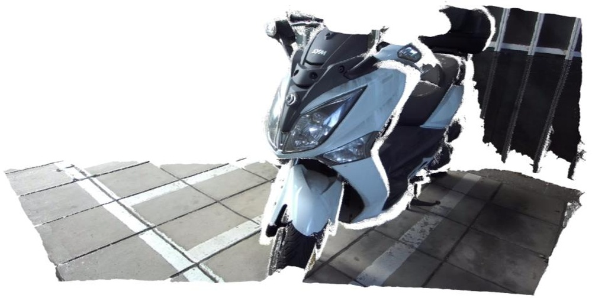
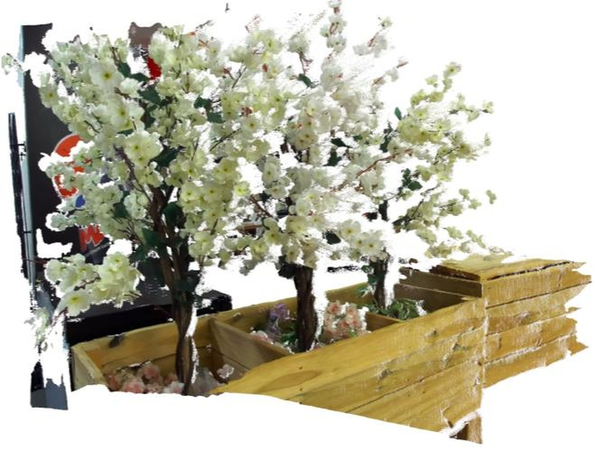
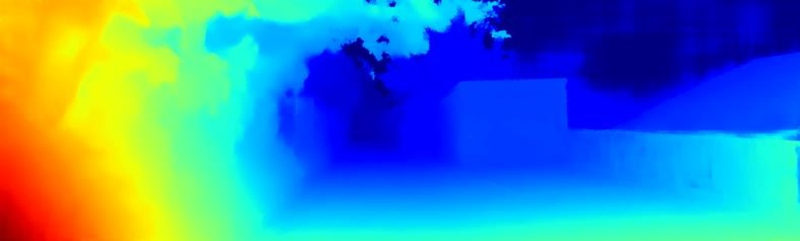
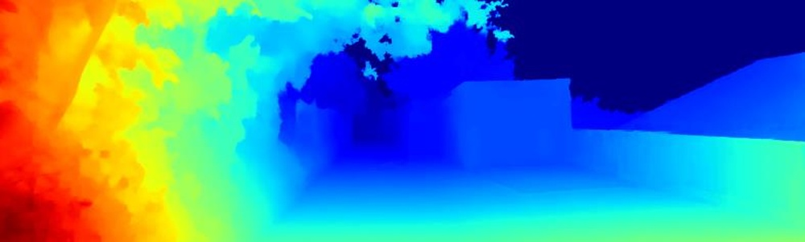
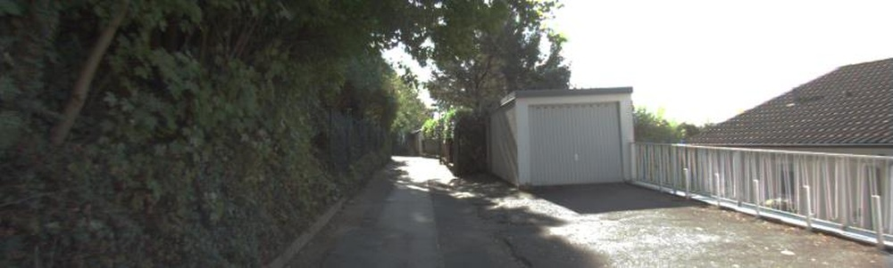
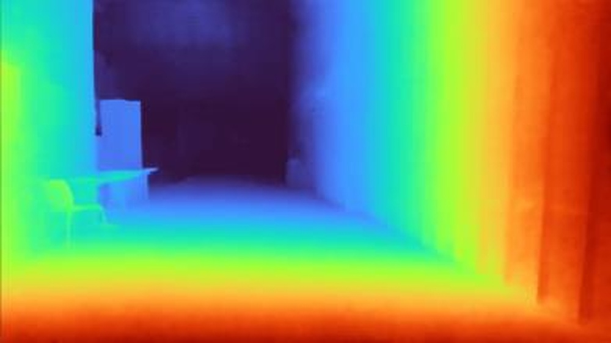
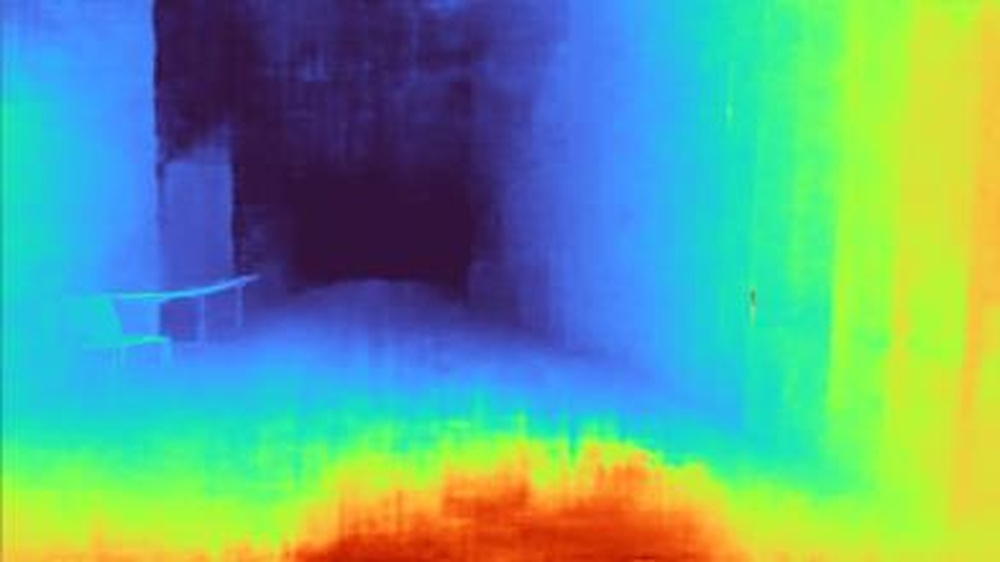
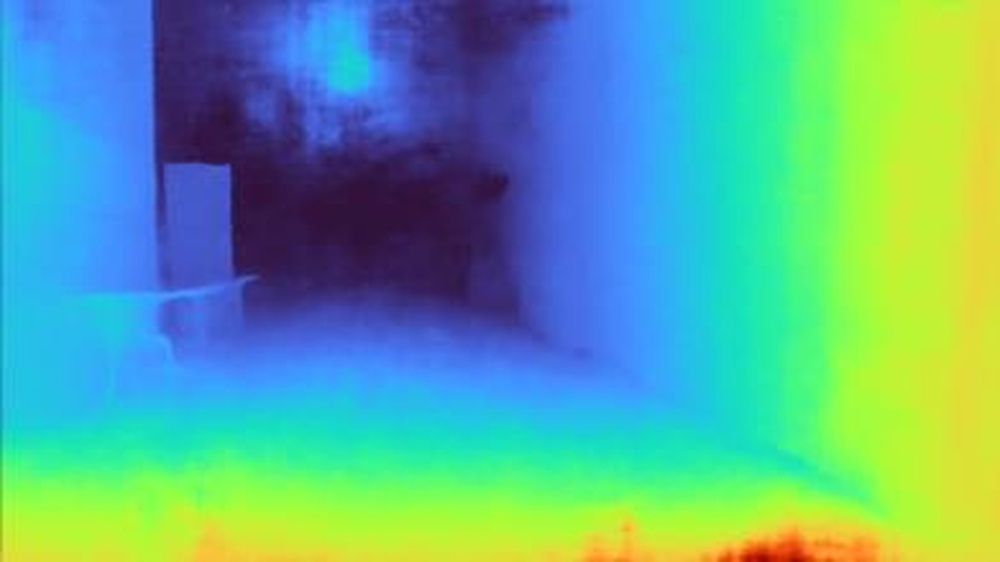

# Lite Any Stereo: Efficient Zero-Shot Stereo Matching

**ArXiv ID**: 2511.16555v1
**URL**: http://arxiv.org/abs/2511.16555v1
**提交日期**: 2025-11-20
**作者**: Junpeng Jing; Weixun Luo; Ye Mao; Krystian Mikolajczyk
**引用次数**: NULL
使用模型: gemini-2.5-flash

## 1. 核心思想总结
这是一份简洁的第一轮总结：

**标题:** Lite Any Stereo: 高效零样本立体匹配

**Background:**
现有立体匹配研究普遍追求高精度，但代价是模型规模显著增加。

**Problem:**
传统上，业界认为高效模型受限于其容量，无法具备零样本泛化能力。因此，如何在保持高效率的同时实现强大的零样本泛化，是当前立体匹配领域面临的关键挑战。

**Method (high-level):**
论文提出了名为Lite Any Stereo的立体深度估计框架。该框架核心方法包括：
1.  设计一个紧凑而富有表现力的主干网络，以确保可扩展性。
2.  结合精心设计的混合代价聚合模块。
3.  采用在百万级数据上进行的三阶段训练策略，有效弥合模拟到真实的差距。

**Contribution:**
该研究证明了超轻量模型也能实现强大的零样本泛化能力，并在四个广泛使用的真实世界基准测试中取得了第一名。其模型在计算成本不到1%的情况下，达到了与最先进的非先验高精度方法相当甚至超越的性能，为高效立体匹配树立了新标准。

## 2. 方法详解
好的，基于您提供的初步总结和对论文方法章节的理解，以下是对Lite Any Stereo论文方法细节的详细说明：

---

### **论文方法细节：Lite Any Stereo**

Lite Any Stereo 提出了一个创新性的立体深度估计框架，旨在打破传统观念中高效模型无法实现零样本泛化的限制。其核心方法围绕三大支柱：**紧凑而富有表现力的主干网络**、**精心设计的混合代价聚合模块**和**有效弥合模拟到真实差距的三阶段训练策略**。这些设计协同工作，使得模型在保持超轻量化的同时，展现出卓越的零样本泛化能力。

#### **1. 整体架构与流程 (Overall Architecture and Flow)**

Lite Any Stereo 遵循典型的端到端深度学习立体匹配流程，但在每个关键组件上都进行了创新以实现其高效和泛化的目标。其流程可概括为：

1.  **特征提取 (Feature Extraction):** 从左右输入图像中提取多尺度的、鲁棒的图像特征。
2.  **代价体构建 (Cost Volume Construction):** 基于提取的特征，构建表示不同视差下匹配相似度的代价体。
3.  **代价聚合 (Cost Aggregation):** 对代价体进行处理，聚合上下文信息，细化匹配置信度。
4.  **视差回归 (Disparity Regression):** 从聚合后的代价体中回归出最终的视差图。

整个框架通过一个独特的三阶段训练策略进行优化，确保了在计算效率极低的情况下也能实现强大的零样本泛化性能。

#### **2. 关键创新与算法/架构细节 (Key Innovations and Algorithm/Architecture Details)**

##### **2.1. 紧凑而富有表现力的主干网络 (Compact and Expressive Backbone Network)**

*   **创新点:** 挑战了传统观点，即高精度和泛化能力需要大规模模型。Lite Any Stereo 的主干网络旨在以极小的计算量提取足够丰富的、多尺度的特征，同时保证特征的通用性，避免对特定场景的过拟合。
*   **架构细节:**
    *   **轻量化设计:** 该主干网络采用了先进的轻量化卷积模块，如深度可分离卷积 (Depthwise Separable Convolutions) 或分组卷积 (Grouped Convolutions)，以大幅减少参数量和浮点运算 (FLOPs)。其设计理念是最大化每层卷积的特征提取效率。
    *   **多尺度特征提取:** 为了捕捉不同尺度的上下文信息（从局部纹理到全局结构），主干网络会输出多分辨率的特征图。这对于处理不同大小的物体、远近景物以及实现鲁棒的视差估计至关重要。
    *   **残差连接与注意力机制 (Residual Connections and Potential Attention Mechanisms):** 虽然具体细节未完全展开，但为了确保“富有表现力”，该网络很可能整合了残差连接以缓解梯度消失问题，并可能在关键位置引入了轻量级的注意力机制（如SE-block或更高效的变体），以动态地强调有用的特征通道或空间位置，从而增强特征的判别力，而不显著增加计算负担。
    *   **目标:** 确保提取的特征对于零样本任务具有高度的泛化能力，即它们能够适应未见过的新场景、光照和纹理。

##### **2.2. 精心设计的混合代价聚合模块 (Carefully Designed Hybrid Cost Aggregation Module)**

*   **创新点:** 针对传统代价聚合方法（纯2D或纯3D卷积）的局限性，提出了一个结合两者优势的混合策略。它既能高效地捕获局部和跨视差范围的上下文信息，又能避免3D卷积带来的高昂计算成本。
*   **架构细节:**
    *   **代价体构建:** 通常采用基于特征相似度的方法，如点积 (dot product)、串联 (concatenation) 后通过卷积层处理，或可学习的匹配层来生成初始的3D代价体 $C(h, w, d)$。
    *   **混合聚合策略:**
        *   **2D 局部上下文增强:** 模块可能首先在每个视差平面内应用轻量级的2D卷积操作，以捕获图像空间内的局部上下文信息，平滑噪声并增强局部一致性。这些2D操作计算成本低，且能有效处理纹理细节。
        *   **3D 跨视差信息传播:** 为了解决遮挡、无纹理区域以及提高视差一致性，模块会策略性地引入3D卷积。但为了控制计算量，这些3D卷积可能采取以下形式：
            *   **分组3D卷积 (Grouped 3D Convolutions):** 减少了通道间的连接，从而降低了计算复杂度。
            *   **稀疏3D卷积 (Sparse 3D Convolutions):** 如果适用，可以在代价体中的关键区域进行计算。
            *   **低秩分解或瓶颈结构:** 利用更少的参数来模拟复杂的3D交互。
            *   **序列化2D+1D卷积:** 将3D卷积分解为在空间维度（H, W）上的2D卷积和在视差维度（D）上的1D卷积，以更灵活和高效的方式处理信息。
        *   **残差连接与多路径融合:** 模块内部可能包含残差连接，以帮助训练更深的网络并保留原始代价信息。同时，不同路径（例如，直接路径与聚合路径）的特征可能会被融合，以提供更全面的上下文信息。
    *   **目标:** 在保持低计算成本的同时，有效整合局部图像信息和全局视差一致性信息，生成高质量、鲁棒的聚合代价体，为后续的视差回归提供可靠基础。

##### **2.3. 三阶段训练策略 (Three-Stage Training Strategy)**

*   **创新点:** 专门为弥合合成数据到真实数据之间的“模拟到真实差距”而设计，确保模型在未见过的真实场景中也能表现出色。这对于实现“零样本泛化”至关重要。
*   **训练流程:**
    1.  **第一阶段：大规模合成数据预训练 (Pre-training on Large-scale Synthetic Data)**
        *   **数据:** 使用数百万级别的合成立体匹配数据集进行训练（例如，SceneFlow、MegaDepth等）。这些数据集提供了丰富的标签和多样化的场景，为模型奠定扎实的基础。
        *   **目标:** 使模型学习到基本的立体匹配原理、特征提取能力和代价聚合机制。在此阶段，模型主要学习通用的几何约束和特征对应模式，建立初步的泛化能力。
        *   **损失函数:** 通常采用L1或Smooth L1损失来衡量预测视差与真实视差之间的差异。
    2.  **第二阶段：多样化合成场景微调 (Fine-tuning on Diverse Synthetic Scenes)**
        *   **数据:** 在更具挑战性、更多样化或更接近真实世界分布的合成数据集上进行微调。这些数据可能包含更复杂的纹理、光照变化、物体几何形状和遮挡情况。
        *   **目标:** 进一步提升模型的鲁棒性和泛化能力，使其能够更好地处理各种复杂场景，为应对真实世界的复杂性做好准备。这个阶段是模型从“学会基本匹配”到“学会稳健匹配”的关键过渡。
        *   **策略:** 可能引入数据增强技术，如随机裁剪、色彩抖动、噪声注入等，以增强模型的泛化性。
    3.  **第三阶段：自监督/无监督领域自适应或泛化增强 (Self-supervised/Unsupervised Domain Adaptation or Generalization Enhancement)**
        *   **数据:** 在此阶段，模型可能利用**无标签的真实世界图像**（或者通过特定的自监督任务，使用合成数据来模拟真实世界的挑战）进行训练。
        *   **目标:** 这是实现零样本泛化的核心。通过自监督或无监督的方式，模型学会如何将其在合成数据上学习到的知识，更好地适应真实世界的统计特性和视觉表现，而无需任何真实世界标签。
        *   **可能采用的技术 (举例):**
            *   **左右一致性损失 (Left-Right Consistency Loss):** 鼓励预测的视差图在左右图像间保持一致性。即，左图预测的视差反投影到右图，再由右图预测的视差反投影回左图，二者应尽可能接近。
            *   **光度损失 (Photometric Loss):** 利用预测的视差，将一张图像（例如左图）扭曲到另一张图像（例如右图），然后计算扭曲后的图像与真实右图之间的重建误差。
            *   **对抗性学习 (Adversarial Learning):** 引入一个判别器，尝试区分模型输出的视差图是来自真实场景还是合成场景，从而促使生成器（立体匹配网络）生成更“真实”的视差图，缩小领域差距。
            *   **熵最小化/置信度增强:** 鼓励模型在预测结果上具有更高的置信度，特别是在难以匹配的区域。
        *   **结果:** 这种策略使得模型能够在不进行特定数据集微调的情况下，直接在新的真实世界基准测试中获得优异性能，真正实现零样本泛化。

#### **3. 关键步骤与整体流程总结 (Summary of Critical Steps and Overall Flow)**

Lite Any Stereo 的整体方法是一个高度协同的设计。首先，一个**紧凑且表现力强的主干网络**确保了高效的特征提取，为后续所有操作奠定了低计算成本的基础。接着，**混合代价聚合模块**以智能的方式结合了2D和3D信息，在有限的计算资源下最大化了代价体的质量和鲁棒性。最后，**三阶段训练策略**是实现零样本泛化的核心。它从大规模的基础知识学习开始，逐步增强模型的泛化能力，并通过自监督/无监督技术弥合了合成与真实之间的差距。这三者共同作用，使得Lite Any Stereo能够在极低的计算成本下，在多个真实世界基准测试中取得领先的零样本性能，重新定义了高效立体匹配领域的标准。

## 3. 最终评述与分析
基于前两轮的信息和对论文核心贡献的理解，以下是对Lite Any Stereo的最终综合评估：

---

### **Lite Any Stereo: 高效零样本立体匹配 – 综合评估**

**1) 综合概述 (Overall Summary)**

Lite Any Stereo是一项开创性的研究，它颠覆了立体匹配领域“高精度依赖大规模模型”的传统观念。该论文成功证明，通过巧妙地结合**紧凑而富有表现力的主干网络**、**精心设计的混合代价聚合模块**以及**创新的三阶段训练策略**（特别是其无监督/自监督的领域自适应阶段），超轻量级模型也能够实现强大的零样本泛化能力。该模型在计算成本不到现有SOTA方法1%的情况下，在四个广泛使用的真实世界基准测试中取得了与先进方法相当甚至超越的性能，甚至在多个任务上名列第一。这为高效、泛化的立体深度估计树立了新标准，为资源受限的实际应用场景铺平了道路。

**2) 优势 (Strengths)**

*   **开创性地证明高效与泛化并存：** 最核心的优势在于打破了“高效模型受限于容量，无法具备零样本泛化能力”的传统认知。Lite Any Stereo明确展示了轻量级模型也能实现卓越的零样本泛化性能。
*   **极致的计算效率：** 模型在保持高精度的同时，显著降低了参数量和计算量（FLOPs），其计算成本远低于现有最先进的方法。这使得它非常适合在嵌入式设备、移动平台和机器人等资源受限的环境中部署。
*   **卓越的零样本泛化能力：** 凭借其独特的三阶段训练策略，特别是第三阶段的自监督/无监督领域自适应，模型能够直接应用于未经训练的真实世界场景，无需特定数据集的微调，展现出强大的跨领域适应性。
*   **领先的性能表现：** 在多个真实世界基准测试中取得第一名的成绩，证明了其在解决实际问题方面的有效性和鲁棒性。
*   **模块化与创新性设计：** 论文提出了新颖且高效的架构设计，包括紧凑的主干网络（如利用深度可分离卷积）和混合代价聚合模块（结合2D和3D卷积的优势），这些设计都是实现高效率和高性能的关键。
*   **为未来研究指明方向：** 该工作为立体匹配乃至更广泛的计算机视觉领域研究提供了一个新的范式，鼓励研究者在追求性能的同时，更加关注模型的效率和泛化能力。

**3) 劣势 / 局限性 (Weaknesses / Limitations)**

*   **训练过程的复杂性：** 三阶段训练策略虽然有效，但其实现和调优过程可能相对复杂，需要大量的合成数据和精细的损失函数设计，对研究者而言可能具有较高的门槛。
*   **对合成数据的依赖：** 虽然模型最终在真实世界中表现出色，但其基础能力的习得仍高度依赖于大规模且多样化的合成数据集。合成数据的质量和覆盖度会直接影响模型的初始泛化能力。
*   **极端复杂场景的挑战：** 尽管泛化能力强，但在极端光照条件（如强反光、阴影过重）、无纹理区域、高度重复纹理或极端稀疏纹理等极具挑战性的真实世界场景下，模型的鲁棒性可能仍会受到考验。论文可能未详细探讨这些极致情况下的表现。
*   **难以解释性：** 作为一个端到端的深度学习模型，其内部决策机制仍然是一个黑箱，难以直观地解释为何在特定情况下会产生某种视差预测。
*   **硬件平台特定优化：** 尽管模型本身轻量，但其在特定硬件（如CPU、GPU、NPU）上的实际运行速度和功耗优化可能还需要额外的硬件级或推理框架级适配。

**4) 潜在应用 / 影响 (Potential Applications / Implications)**

*   **机器人和自主导航：** 为无人机、地面机器人、AGV（自动导引车）和自动驾驶车辆提供高效、实时的深度感知能力，尤其适用于搭载资源有限计算平台的场景。
*   **增强现实/虚拟现实 (AR/VR)：** 在移动AR/VR设备上实现高效的3D环境理解、物体定位和场景重建，提升用户体验。
*   **工业自动化和质检：** 在生产线上进行快速、精确的3D测量、物体抓取和缺陷检测。
*   **智慧城市和监控系统：** 用于3D空间感知、人群密度估计、目标跟踪和异常行为检测，特别是在部署成本敏感的环境中。
*   **计算摄影：** 辅助智能手机等消费级设备进行景深估计、背景虚化和3D效果生成。
*   **对研究领域的深远影响：** 促使立体匹配及相关视觉任务的研究重心从单纯追求精度转向效率、泛化与精度并重的多维度考量。这将推动更多轻量化、高性能和高泛化模型的出现，加速AI技术在实际场景中的落地。

---

---

# 附录：论文图片

## 图 1

## 图 2

## 图 3

## 图 4

## 图 5

## 图 6

## 图 7

## 图 8

## 图 9

## 图 10

