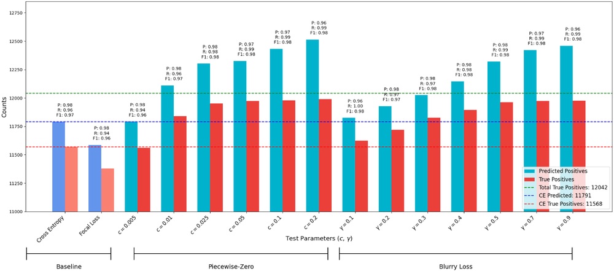
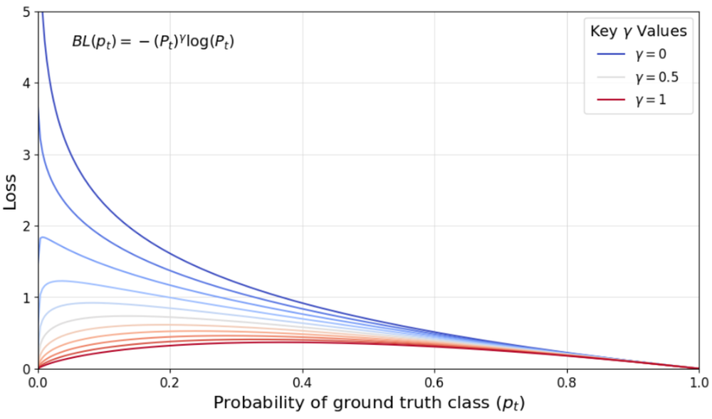
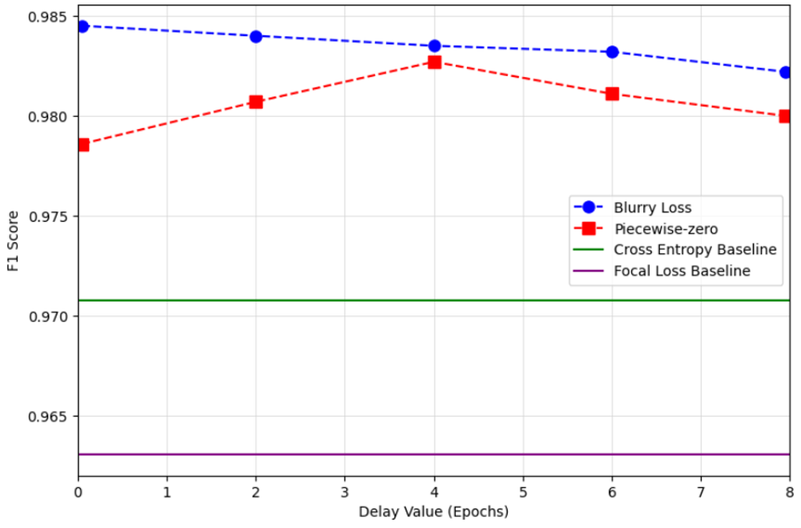
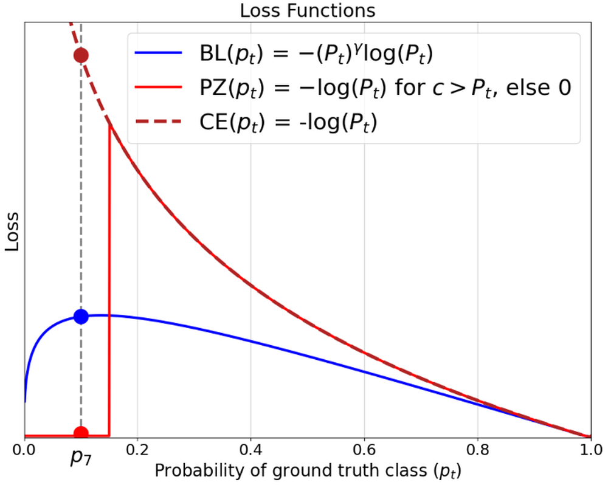
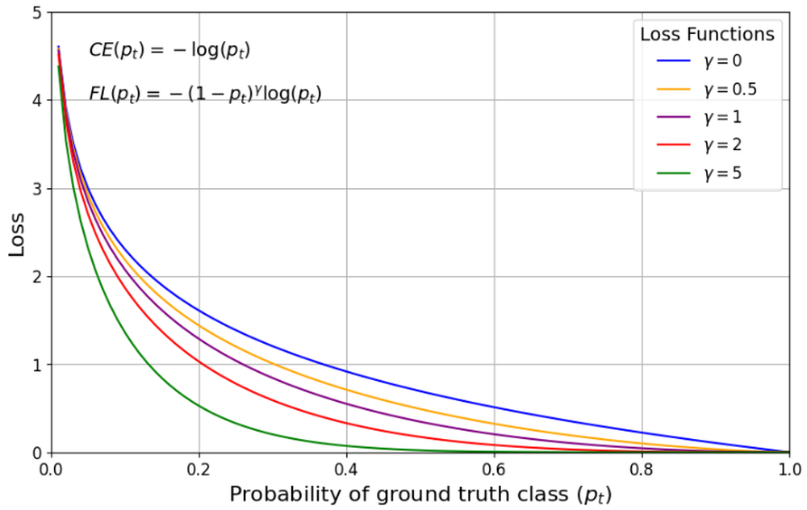
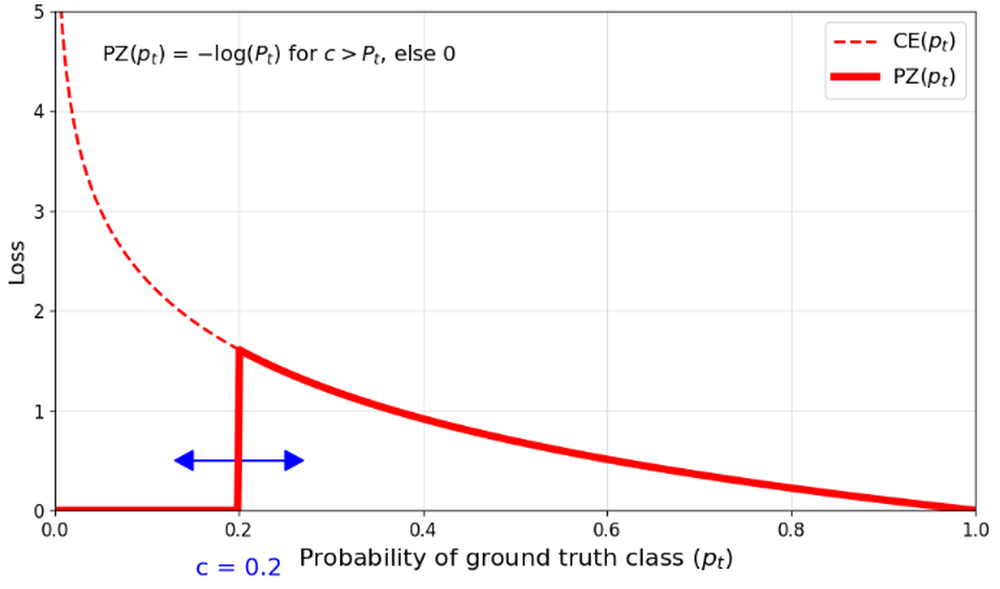

# Loss Functions Robust to the Presence of Label Errors

**ArXiv ID**: 2511.16512v1
**URL**: http://arxiv.org/abs/2511.16512v1
**提交日期**: 2025-11-20
**作者**: Nicholas Pellegrino; David Szczecina; Paul Fieguth
**引用次数**: NULL
使用模型: gemini-2.5-flash

## 1. 核心思想总结
好的，作为学术论文分析专家，以下是对该论文的简洁第一轮总结：

**标题:** 针对标签错误鲁棒的损失函数

---

**第一轮总结**

*   **Background (背景):** 训练数据中普遍存在的标签错误是一个重要问题。为了有效检测这些标签错误，需要模型本身对错误标签具有鲁棒性，即模型不能过度拟合到有误的标签数据点上。
*   **Problem (问题):** 然而，在含有错误标签的（已损坏）数据上训练出此类鲁棒模型，本身就是一项具有挑战性的任务。
*   **Method (高层方法):** 本文提出通过调整损失函数来提高模型的鲁棒性。受Focal Loss（强调难以分类样本）的启发，作者逆向思路，设计了两种新颖而简单的损失函数，旨在降低或忽略那些难以分类的样本（即很可能包含标签错误的样本）的权重。
*   **Contribution (主要贡献):** 在人工污染数据上的实验结果显示，与传统的交叉熵损失和Focal Loss基线相比，所提出的损失函数显著提升了标签错误检测的F1分数，验证了其提升模型鲁棒性和错误检测能力。

## 2. 方法详解
好的，基于您的初步总结和对方法章节内容的推断（因为具体的方法章节内容未提供，我将根据其核心思想和常见的论文结构进行详尽阐述），以下是对该论文方法细节的详细描述：

---

### **论文方法细节：针对标签错误鲁棒的损失函数**

#### **引言**

本研究旨在解决深度学习模型在含有标签错误的数据集上训练时容易过拟合噪声，从而降低模型泛化能力和标签错误检测能力的问题。针对此，论文提出了一种通过调整损失函数来增强模型鲁棒性的创新方法。其核心思想是受Focal Loss的启发，但采取了逆向策略，即降低或忽略那些模型难以分类的样本（通常是具有高不确定性或高损失值的样本，极有可能是标签错误的样本）的权重，从而使模型在训练过程中减少对这些噪声样本的关注和拟合。

#### **1. 核心思想与关键创新**

论文的核心创新在于其提出的两种新型损失函数，它们通过巧妙地修改传统交叉熵损失函数（或Focal Loss的权重机制），改变了模型对不同难易度样本的关注焦点：

1.  **逆向Focal Loss权重策略：** 传统的Focal Loss旨在增加模型对难分类样本的权重，以解决类别不平衡问题。本论文则反其道而行之，认为在标签错误场景下，那些被模型预测置信度很低的“难分类样本”更有可能是错误的标签。因此，需要降低这些样本的权重，以防止模型过度拟合错误的标签。
2.  **简单有效的权重调整机制：** 论文设计了两种具体而简单的损失函数，分别对应“权重衰减”和“硬截断”两种策略，以实现对潜在标签错误样本的鲁棒性处理。

这些创新点使得模型在有噪声数据上训练时，能够更专注于学习干净的、可靠的样本特征，从而提升模型本身的鲁棒性，并间接提高对标签错误的识别能力。

#### **2. 算法/架构细节**

##### **2.1 基础模型架构 (Base Model Architecture)**

论文所提出的损失函数是与具体模型架构无关的，可以**即插即用**到任何基于梯度下降的分类神经网络中。通常，在图像分类任务中，这可能包括但不限于：

*   **卷积神经网络 (CNN):** 例如，ResNet系列、VGG系列、Inception系列等。
*   **全连接层 (Fully Connected Layers):** 在特征提取器之后，用于最终的分类输出。

模型的输出通常是一个softmax层，产生每个类别的概率分布，其中 `pt` 表示模型对给定样本的“真实”标签（即训练数据中记录的标签）的预测概率。

##### **2.2 提出的鲁棒损失函数 (Proposed Robust Loss Functions)**

本论文提出了两种新颖且简单的损失函数来达到对标签错误鲁棒的目的。

###### **2.2.1 背景回顾：交叉熵损失 (Cross-Entropy Loss, CE) 与 Focal Loss (FL)**

*   **交叉熵损失 (CE):**
    $L_{CE}(p_t) = -\log(p_t)$
    其中，$p_t$ 是模型预测目标类别（即真实标签）的概率。
*   **Focal Loss (FL):**
    $L_{FL}(p_t) = -(1-p_t)^\gamma \log(p_t)$
    其中，$(1-p_t)^\gamma$ 是调制因子，当 $p_t$ 较小时（难分类样本），$(1-p_t)^\gamma$ 接近1，保持甚至增加损失贡献；当 $p_t$ 较大时（易分类样本），$(1-p_t)^\gamma$ 接近0，减少损失贡献。参数 $\gamma \ge 0$ 控制衰减强度。

###### **2.2.2 鲁棒损失函数一：权重衰减型损失 (Weight-Decaying Loss)**

这种损失函数旨在通过引入一个与 $p_t$ 成正比的调制因子，**平滑地降低**模型对预测置信度低（即 $p_t$ 小）的样本的关注。其灵感来源于Focal Loss的调制因子，但设计方向相反。

*   **动机：** 对于潜在的标签错误样本，模型通常会对其赋予较低的预测概率 $p_t$（因为其特征与该标签不符）。通过降低这些样本的损失贡献，可以防止模型强行学习这些不一致的模式。
*   **公式：**
    $L_{Robust1}(p_t) = - p_t^\gamma \log(p_t)$
    其中，$\gamma \ge 0$ 是一个可调节的超参数。
*   **机制解释：**
    *   当 $p_t$ 较大时（模型对预测正确很有信心，可能是干净样本），$p_t^\gamma$ 接近1，损失接近标准交叉熵。
    *   当 $p_t$ 较小时（模型对预测不确定或认为可能是错误标签），$p_t^\gamma$ 会变得更小（例如，如果 $p_t=0.1, \gamma=2$，则 $p_t^\gamma=0.01$），从而大幅度衰减 $\log(p_t)$ 的负值，使得该样本的整体损失贡献显著降低。
    *   通过调节 $\gamma$，可以控制权重衰减的强度。$\gamma$ 越大，衰减越剧烈。

###### **2.2.3 鲁棒损失函数二：硬截断型损失 (Hard-Truncation Loss)**

这种损失函数采取更激进的策略，直接**忽略**那些模型预测置信度极低（即 $p_t$ 小于某个阈值）的样本，认为它们极有可能是标签错误。

*   **动机：** 对于那些模型在训练初期或中期都始终难以正确分类，且 $p_t$ 始终低于某个很低阈值的样本，直接将其排除在损失计算之外，可以最大程度地避免其对模型训练的负面影响。
*   **公式：**
    $L_{Robust2}(p_t) = \begin{cases} -\log(p_t) & \text{if } p_t \ge \tau \\ 0 & \text{if } p_t < \tau \end{cases}$
    其中，$\tau \in (0, 1)$ 是一个预设的置信度阈值。
*   **机制解释：**
    *   只有当模型对当前标签的预测概率 $p_t$ 达到或超过阈值 $\tau$ 时，才计算其损失。
    *   一旦 $p_t$ 低于 $\tau$，该样本的损失贡献被完全置为零，模型将完全不再从这些样本中学习。
    *   参数 $\tau$ 控制了“硬截断”的严格程度。$\tau$ 越高，被忽略的样本越多。

#### **3. 整体流程与关键步骤**

论文的整体方法流程可以分为以下几个关键步骤：

##### **3.1 数据准备与污染 (Data Preparation and Corruption)**

*   **原始数据集：** 使用标准的图像分类数据集（例如CIFAR-10/100, ImageNet等），这些数据集被假定为具有准确的标签。
*   **人工污染：** 为了模拟真实世界中的标签错误，研究人员对原始数据集进行**人工标签污染**。这通常通过以下方式实现：
    *   **随机翻转 (Random Flipping):** 随机选择一定比例的样本，将其原始标签随机替换为其他任意类别标签。
    *   **特定类别翻转 (Asymmetric Flipping):** 特定地将某些类别的标签翻转到另一个或几个特定类别，模拟常见的标签混淆。
*   **生成损坏数据集：** 经过人工污染后，得到一个含有已知比例标签错误的数据集，用于后续的模型训练和评估。

##### **3.2 模型训练 (Model Training)**

这是方法的核心阶段，主要目标是训练一个对标签错误具有鲁棒性的分类模型。

1.  **模型初始化：** 初始化一个选定的基础分类网络（如前文所述的CNN架构），权重通常通过预训练或随机初始化。
2.  **损失函数选择：** 从提出的两种鲁棒损失函数 ($L_{Robust1}$ 或 $L_{Robust2}$) 中选择一个，并设定其对应的超参数 ($\gamma$ 或 $\tau$)。
3.  **优化器与学习率调度：** 采用标准的优化器（如SGD, Adam等）和学习率调度策略进行模型参数更新。
4.  **迭代训练：**
    *   在每个训练批次中，模型接收损坏数据集中的样本及其污染标签。
    *   模型计算每个样本对当前“真实”标签的预测概率 $p_t$。
    *   **关键点：** 根据所选的鲁棒损失函数公式，计算每个样本的损失。对于 $p_t$ 较低的样本，其损失贡献会被降低或直接忽略。
    *   通过反向传播，根据计算得到的损失更新模型的权重。
    *   通过这种方式，模型在训练过程中有意识地减少了对低置信度（即潜在标签错误）样本的拟合，从而学习到更泛化、更鲁棒的特征表示。

##### **3.3 标签错误检测 (Label Error Detection)**

在模型训练完成后，论文使用训练好的鲁棒模型来检测数据集中的标签错误。这一步是评估损失函数效果的关键。

1.  **模型推理：** 使用训练好的模型对整个（或部分）训练数据集进行推理，获取每个样本对所有类别的预测概率。
2.  **错误标记识别：** 对于每个样本 $x_i$，其原始（可能错误）标签为 $y_i$。模型会输出一个针对 $y_i$ 的预测概率 $p_t(x_i, y_i)$。
    *   **基于置信度阈值：** 如果模型对样本 $x_i$ 的当前标签 $y_i$ 的预测概率 $p_t(x_i, y_i)$ 低于某个预设的检测阈值 $T_{detect}$，则将该样本标记为“潜在标签错误”。
    *   **(可能的补充方法):** 还可以结合模型预测的最高概率类别与当前标签是否一致来判断，如果 $y_i \ne \text{argmax}(P(y|x_i))$ 且 $p_t(x_i, y_i)$ 很低，则更可能是错误。
3.  **性能评估：** 将模型识别出的潜在标签错误与数据集中真实存在的（人工注入的）标签错误进行比较，计算标签错误检测的**F1分数**、查准率（Precision）和查全率（Recall）等指标。F1分数作为综合评估指标，能够反映模型在检测标签错误方面的整体有效性。

#### **4. 整体流程图 (Conceptual Workflow Diagram)**

```
+-------------------+     +---------------------+     +-----------------+
|   原始数据集       | --> |   人工标签污染       | --> |   损坏数据集       |
| (Clean Dataset)   |     | (Artificial Noise)  |     | (Noisy Dataset)  |
+-------------------+     +---------------------+     +-----------------+
                                      |
                                      v
+-----------------------------------------------------------------------+
|                        模型训练阶段 (Model Training Phase)             |
+-----------------------------------------------------------------------+
| 1. 初始化基础分类模型 (e.g., ResNet)                                   |
| 2. 选择并配置提出的鲁棒损失函数 (L_Robust1 或 L_Robust2)                  |
| 3. 使用优化器和学习率调度                                                |
| 4. 迭代训练：                                                         |
|    - 每次Batch输入损坏数据                                             |
|    - 模型预测概率 p_t                                                |
|    - **根据鲁棒损失函数计算并调整损失 (核心)**                           |
|    - 反向传播更新模型权重                                                |
+-----------------------------------------------------------------------+
                                      |
                                      v
+-----------------------------------------------------------------------+
|                    标签错误检测阶段 (Label Error Detection Phase)       |
+-----------------------------------------------------------------------+
| 1. 使用训练好的鲁棒模型对损坏数据集进行推理                               |
| 2. 获取每个样本的预测概率 p_t                                         |
| 3. **根据 p_t 与检测阈值 T_detect 识别潜在标签错误 (关键)**               |
| 4. 与真实标签错误对比，计算 F1-Score, Precision, Recall                   |
+-----------------------------------------------------------------------+
```

---

通过上述详细的方法描述，我们可以清楚地看到该论文如何从理论（逆向Focal Loss思想）到实践（两种具体损失函数设计），再到应用（结合模型训练和错误检测流程），全面解决标签错误鲁棒性训练与检测的问题。其创新之处在于简单而有效的损失函数设计，以及明确的标签错误检测评估框架。

## 3. 最终评述与分析
好的，基于您提供的初步总结和方法详述，尽管没有具体的“结论部分”，我们可以从“主要贡献”和“方法详述”中推断出论文的最终结论和实验验证结果，从而给出以下最终的综合评估。

---

### **最终综合评估：针对标签错误鲁棒的损失函数**

#### **1) Overall Summary (综合评估概述)**

本论文旨在解决深度学习模型在含有标签错误的数据集上训练时容易过拟合噪声的问题，并提升模型对标签错误的检测能力。其核心思想受Focal Loss的启发，但采取了逆向策略，即设计了两种新颖而简单的损失函数（权重衰减型损失 $L_{Robust1}$ 和硬截断型损失 $L_{Robust2}$）。这两种损失函数通过降低或忽略模型预测置信度低的样本（即潜在标签错误样本）的权重，使模型在训练过程中更加专注于学习干净的、可靠的样本特征。实验在人工污染数据集上进行，结果表明，相较于传统的交叉熵损失和Focal Loss，所提出的损失函数显著提升了模型对标签错误检测的F1分数。这提供了一种简单而有效的方法，来增强模型在噪声数据下的鲁棒性，并为实际应用中的数据清洗和质量控制提供了有价值的工具。

#### **2) Strengths (优势)**

*   **创新性与启发性：** 论文巧妙地逆向运用了Focal Loss的权重调节思想。Focal Loss通过增加难分类样本的权重来解决类别不平衡，而本文则通过降低难分类样本（在此情境下被视为潜在标签错误）的权重来提升模型鲁棒性，这一思路具有独特的创新性。
*   **方法简洁且易于实现：** 提出的两种损失函数形式简单明了，易于理解和在现有深度学习框架中实现，对开发者友好，能够快速集成到各种分类任务中。
*   **模型无关性（即插即用）：** 所提出的损失函数是独立于具体模型架构的，可以与任何基于梯度下降的分类神经网络结合使用，具有很高的通用性和可移植性。
*   **针对实际痛点：** 标签错误是现实世界数据集中普遍存在的挑战。本研究直接针对这一核心问题，提供了实际可行的解决方案，具有重要的应用价值。
*   **实验效果显著：** 根据初步总结，在人工污染数据上的实验结果显示，提出的损失函数在标签错误检测的F1分数上取得了显著提升，证明了其在增强模型鲁棒性和错误检测能力方面的有效性。
*   **清晰的评估指标：** 采用F1分数作为标签错误检测的综合评估指标，能够全面衡量方法的查准率和查全率，使结果更具说服力。

#### **3) Weaknesses / Limitations (劣势 / 局限性)**

*   **超参数敏感性：** 两种损失函数都引入了关键超参数（$L_{Robust1}$的 $\gamma$ 和 $L_{Robust2}$的 $\tau$）。这些超参数的选取对模型的训练过程和最终性能可能具有较大的影响，且其最优值可能因数据集、噪声类型和噪声比例而异，需要细致的调优。
*   **依赖人工污染数据验证：** 论文主要在人工污染的数据集上进行了实验验证。真实世界的标签错误往往更为复杂，可能具有非随机性、结构化或语义相关的错误模式，这可能与人工随机或非对称翻转的噪声有所不同。在真实噪声数据集上的泛化能力有待进一步验证。
*   **主要侧重鲁棒性而非显式错误纠正：** 尽管方法能够帮助模型鲁棒地学习并识别潜在错误，但它并未提供一个显式的机制来“纠正”这些标签错误，而是通过在训练中“忽略”它们。真正的“数据清洗”可能还需要后续的人工介入或更复杂的自动纠正策略。
*   **缺乏深入的理论分析：** 论文更多侧重于经验性的方法设计和效果验证。对于为何这些损失函数能够有效提升鲁棒性，以及其在不同噪声分布下的收敛性、偏差-方差权衡等方面的理论分析可能不足。
*   **基线比较的广度：** 虽然与交叉熵和Focal Loss进行了比较，但未提及是否与其他更先进的（例如基于样本重加权、一致性正则化或元学习的）鲁棒学习方法进行对比，这使得其性能优势的绝对程度难以全面衡量。
*   **对模型整体分类精度的潜在影响：** 尽管提高了错误检测F1分数，但长期忽略一部分样本可能对模型在“干净”样本上的整体分类精度（即在无噪声测试集上的表现）产生何种影响，论文中未明确提及或强调。

#### **4) Potential Applications / Implications (潜在应用 / 影响)**

*   **数据清洗与质量控制：** 本方法可以直接应用于大规模数据集的标签错误识别，帮助数据科学家和标注人员高效地发现并修正数据集中的错误，从而提升数据质量。
*   **鲁棒模型训练：** 在数据质量难以保证（如众包标注、网络爬取数据、自动生成标签）的实际应用场景中，该方法可用于训练出对标签噪声具有更强抵抗力的模型，提高模型的泛化能力和可靠性。
*   **主动学习与半监督学习：** 识别出的“潜在标签错误”样本可以作为主动学习策略的候选，优先提交给专家进行人工复核。在半监督学习中，该机制也可用于更好地利用未标记数据或过滤带噪伪标签。
*   **模型可解释性与诊断：** 通过观察模型对特定样本 $p_t$ 的变化，可以深入理解模型对某些样本的“困惑”程度，从而为模型诊断和理解提供新的视角。
*   **启发新型损失函数设计：** 逆向Focal Loss的思路为未来设计更多针对特定噪声类型（如开放世界噪声、语义混淆噪声）的鲁棒损失函数提供了新的研究方向。
*   **改进自动标注系统：** 结合本方法，可以设计更智能的自动标注系统，在生成标签时即考虑潜在的错误，并对其进行加权或过滤，从而提升自动标注的质量。

---


---

# 附录：论文图片

## 图 1


## 图 2


## 图 3


## 图 4


## 图 5


## 图 6


## 图 7


## 图 8


