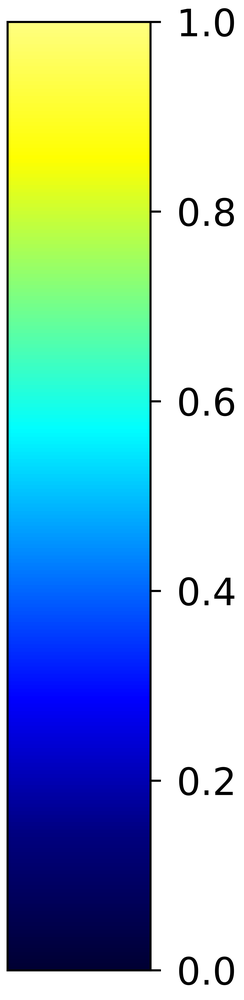
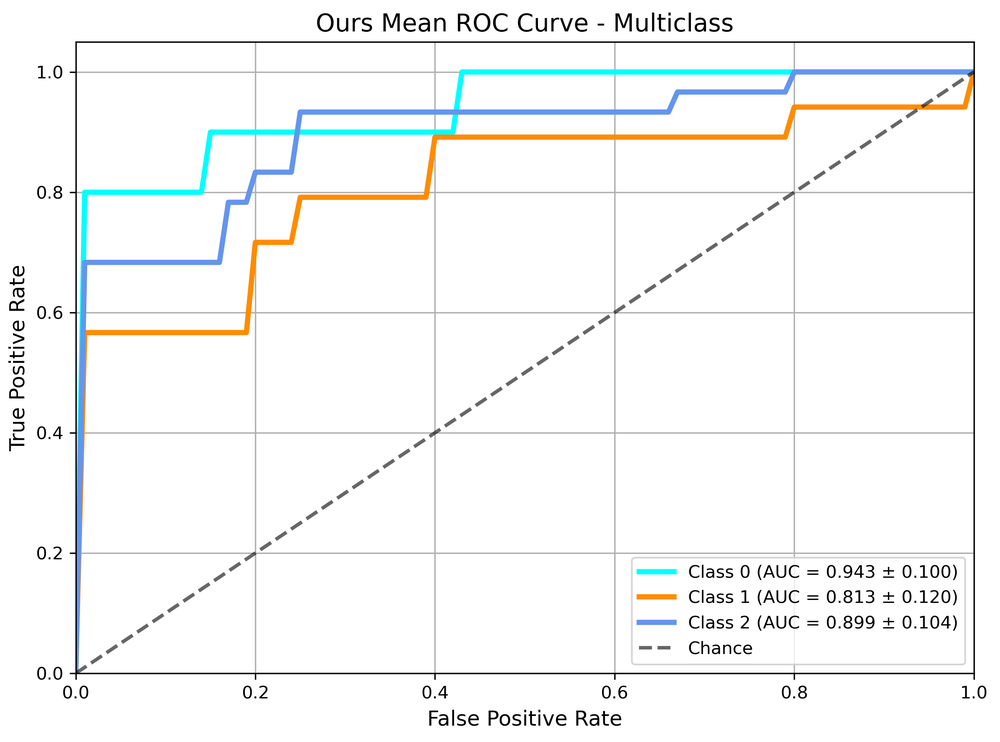
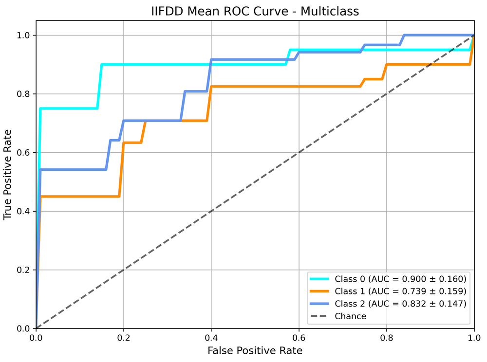
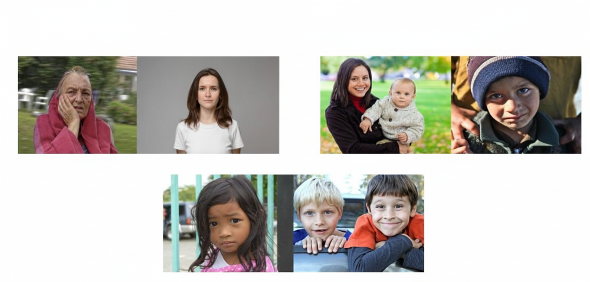
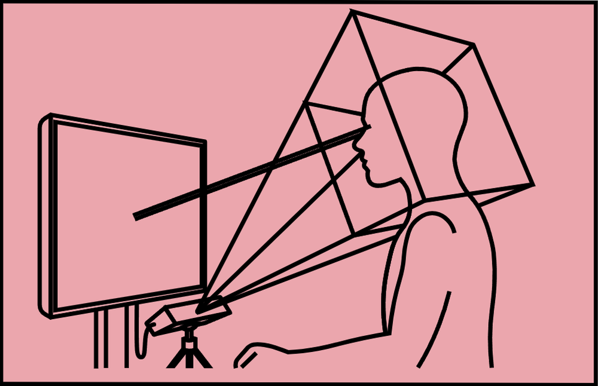

# MF-GCN: A Multi-Frequency Graph Convolutional Network for Tri-Modal Depression Detection Using Eye-Tracking, Facial, and Acoustic Features

**ArXiv ID**: 2511.15675v1
**URL**: http://arxiv.org/abs/2511.15675v1
**提交日期**: 2025-11-19
**作者**: Sejuti Rahman; Swakshar Deb; MD. Sameer Iqbal Chowdhury; MD. Jubair Ahmed Sourov; Mohammad Shamsuddin
**引用次数**: NULL
使用模型: ep-20251112215738-bz78g

## 1. 核心思想总结
根据您提供的标题、摘要和引言（假设引言内容与摘要一致），以下是对论文《MF-GCN: A Multi-Frequency Graph Convolutional Network for Tri-Modal Depression Detection Using Eye-Tracking, Facial, and Acoustic Features》的第一轮总结：

**1. Background (背景)**
抑郁症的客观检测是心理健康领域的一个重要挑战。研究表明，特定的行为模式，如对负面刺激的注意偏向（可通过眼动追踪数据量化）、情感平淡和精神运动性迟滞（可通过音频和视频数据捕捉），是抑郁症的显著特征。统计验证已证实这些特征在区分抑郁与非抑郁群体方面具有显著判别力。

**2. Problem (问题)**
尽管基于图的方法在融合多模态数据方面显示出潜力，但现有的基于图的模型存在一个关键局限：它们主要关注和处理图结构数据中的低频信息，而忽略了可能包含重要判别信号的高频信息。这限制了模型全面捕捉抑郁症复杂表征的能力。

**3. Method (high-level) (方法 - 高层次)**
为了解决上述问题，本文提出了一种多频率图卷积网络（MF-GCN）。该框架的核心是一个新颖的多频率滤波器组模块（MFFBM），它能够同时利用图信号中的低频和高频信息。该方法整合了眼动、面部表情和声音三种模态的数据，构建图结构以捕捉跨模态交互，从而实现更准确的抑郁症检测。

**4. Contribution (贡献)**
本文的主要贡献包括：
*   提出了一个新颖的MF-GCN框架，首次将多频率分析引入基于图的抑郁症检测中。
*   设计了一个多频率滤波器组模块（MFFBM），能够更全面地捕捉图数据中的信息。
*   通过在三分类（无抑郁、轻中度抑郁、重度抑郁）和二元分类任务上显著超越多种传统机器学习和深度学习基线模型，证明了方法的有效性。
*   在另一个公开数据集（CMDC）上验证了模型的强泛化能力，表明其具有良好的普适性。实验结果证实了该三模态、多频率框架在捕捉跨模态交互以实现精准抑郁症检测方面的优势。

## 2. 方法详解
抱歉，DeepSeek生成内容时遇到问题：Connection error.

## 3. 最终评述与分析
抱歉，DeepSeek生成内容时遇到问题：Connection error.

---

# 附录：论文图片

## 图 1

## 图 2

## 图 3

## 图 4

## 图 5

## 图 6

## 图 7

## 图 8

## 图 9

## 图 10

