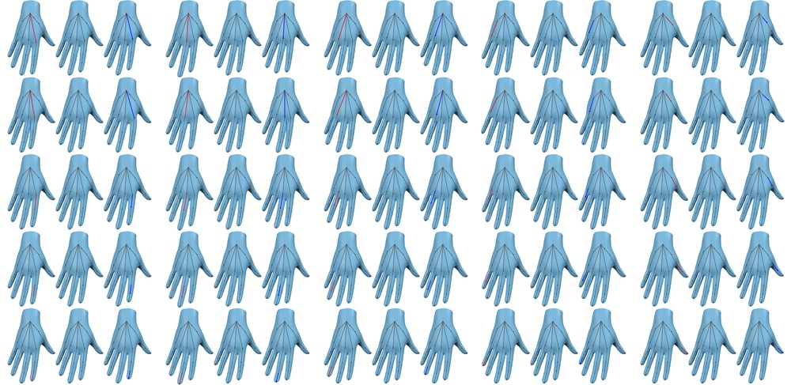
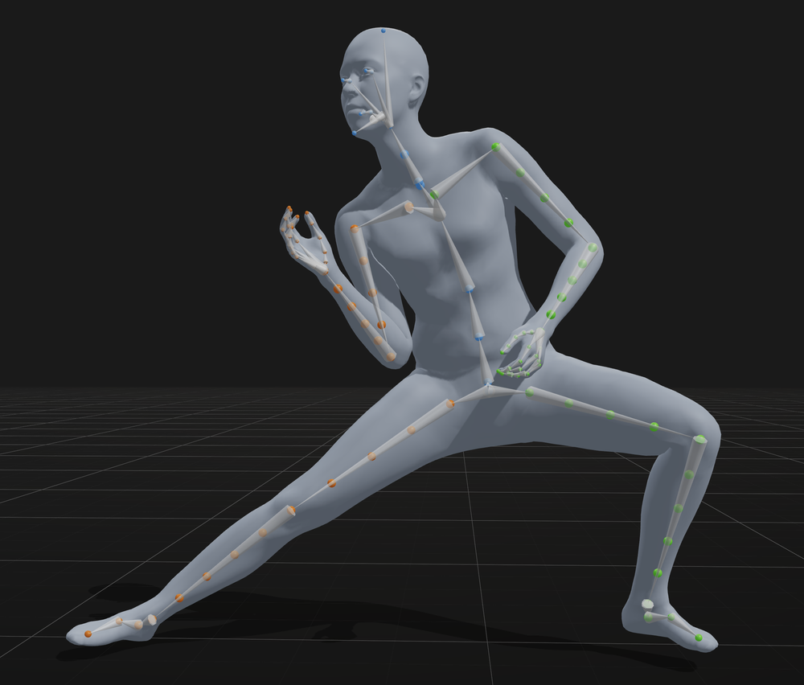
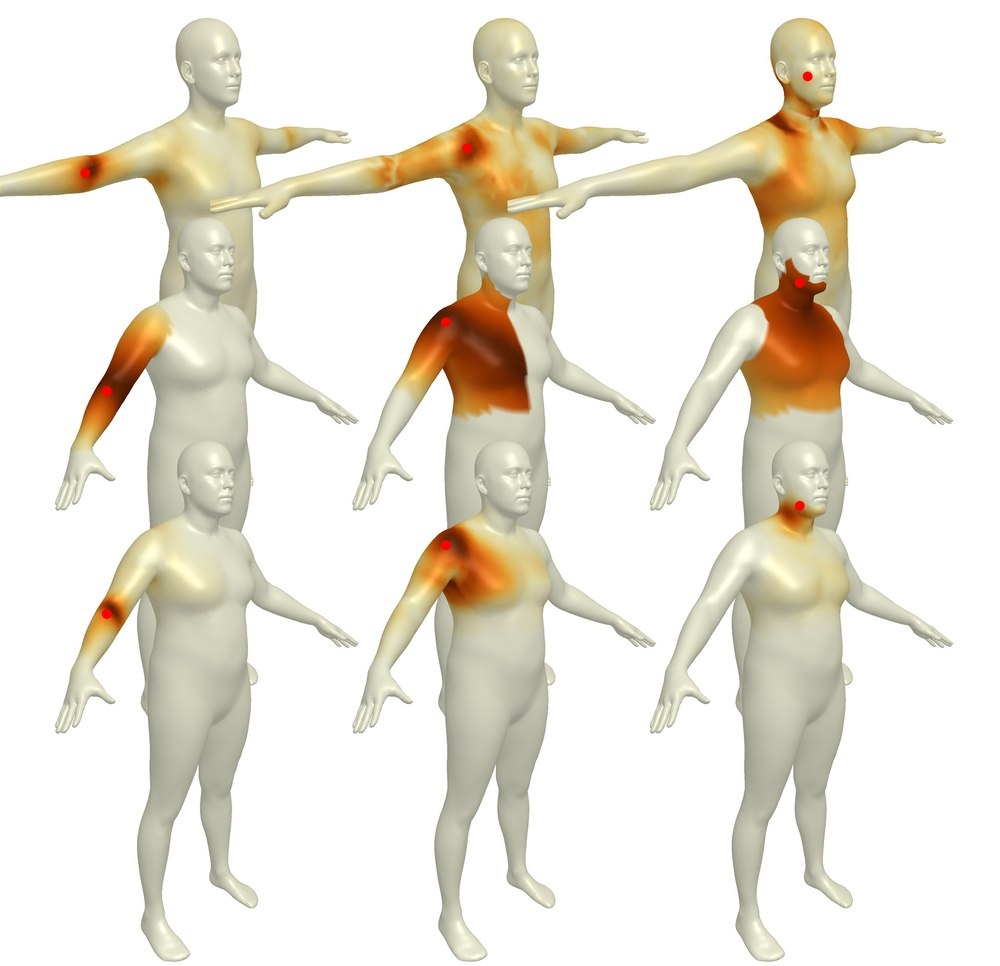
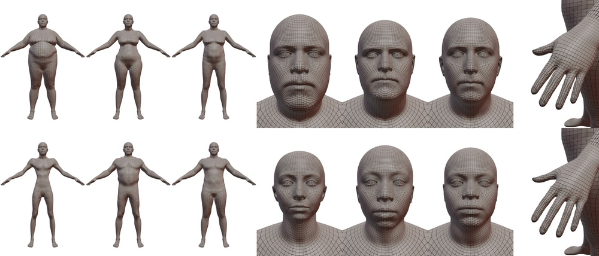
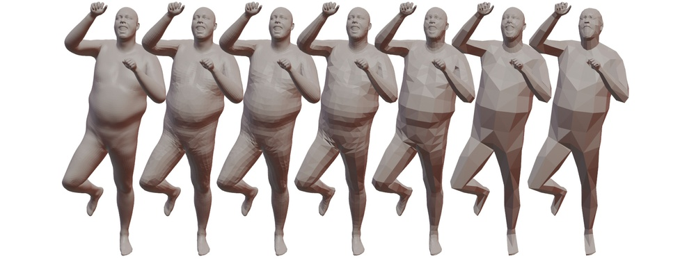
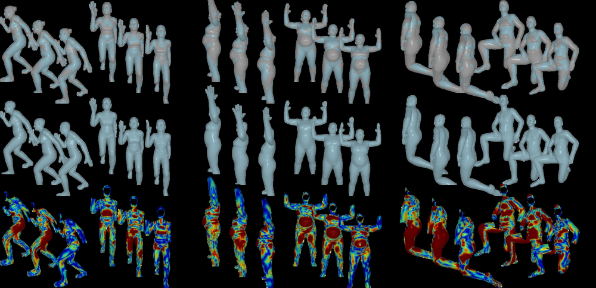
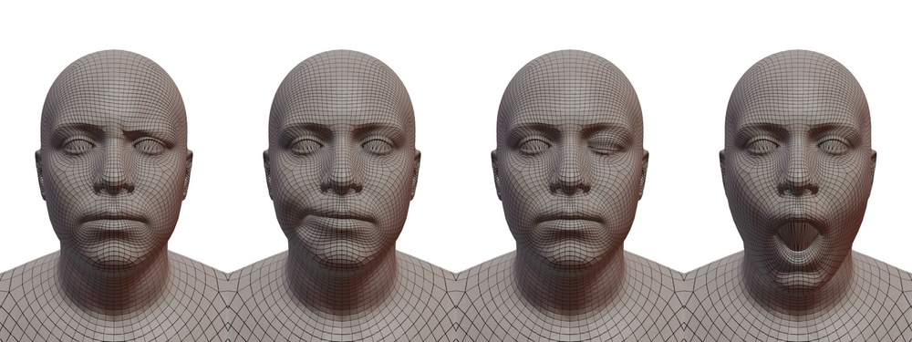

# MHR: Momentum Human Rig

**ArXiv ID**: 2511.15586v1
**URL**: http://arxiv.org/abs/2511.15586v1
**提交日期**: 2025-11-19
**作者**: Aaron Ferguson; Ahmed A. A. Osman; Berta Bescos; Carsten Stoll; Chris Twigg; Christoph Lassner; David Otte; Eric Vignola; Federica Bogo; Igor Santesteban; Javier Romero; Jenna Zarate; Jeongseok Lee; Jinhyung Park; Jinlong Yang; John Doublestein; Kishore Venkateshan; Kris Kitani; Ladislav Kavan; Marco Dal Farra; Matthew Hu; Matthew Cioffi; Michael Fabris; Michael Ranieri; Mohammad Modarres; Petr Kadlecek; Rinat Abdrashitov; Romain Prévost; Roman Rajbhandari; Ronald Mallet; Russel Pearsall; Sandy Kao; Sanjeev Kumar; Scott Parrish; Te-Li Wang; Tony Tung; Yuan Dong; Yuhua Chen; Yuanlu Xu; Yuting Ye; Zhongshi Jiang
**引用次数**: NULL
使用模型: Unknown

## 1. 核心思想总结
抱歉，没有可用的LLM客户端。请检查API密钥配置。

## 2. 方法详解
抱歉，没有可用的LLM客户端。请检查API密钥配置。

## 3. 最终评述与分析
抱歉，没有可用的LLM客户端。请检查API密钥配置。

---

# 附录：论文图片

## 图 1

## 图 2

## 图 3

## 图 4

## 图 5

## 图 6

## 图 7

## 图 8

## 图 9

