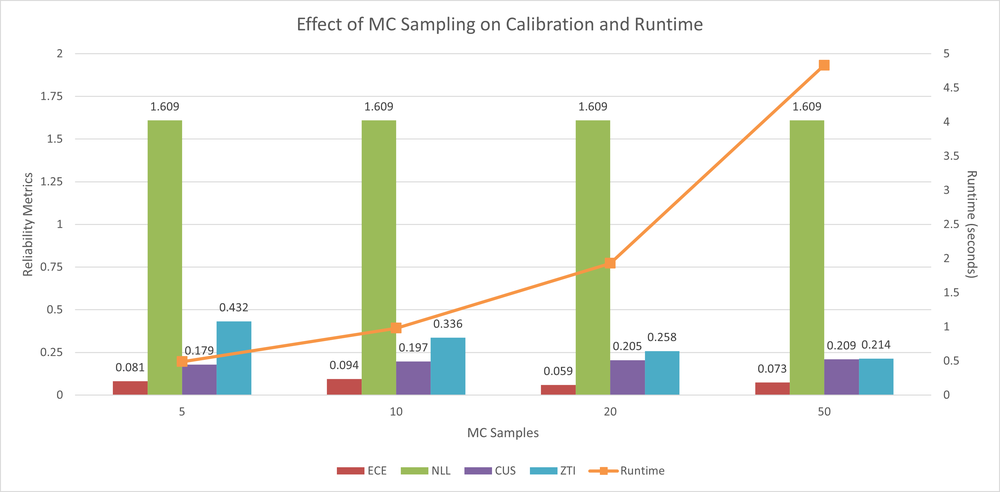
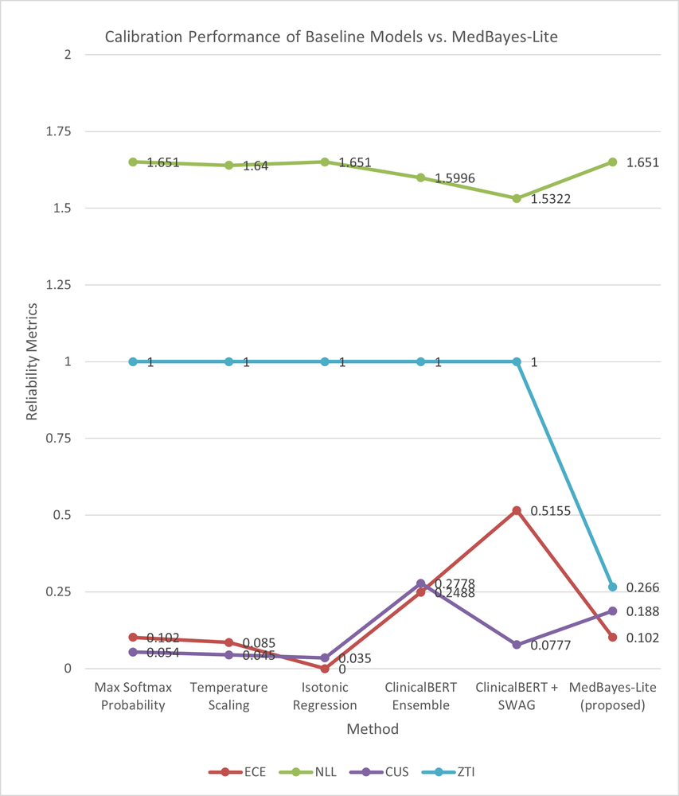
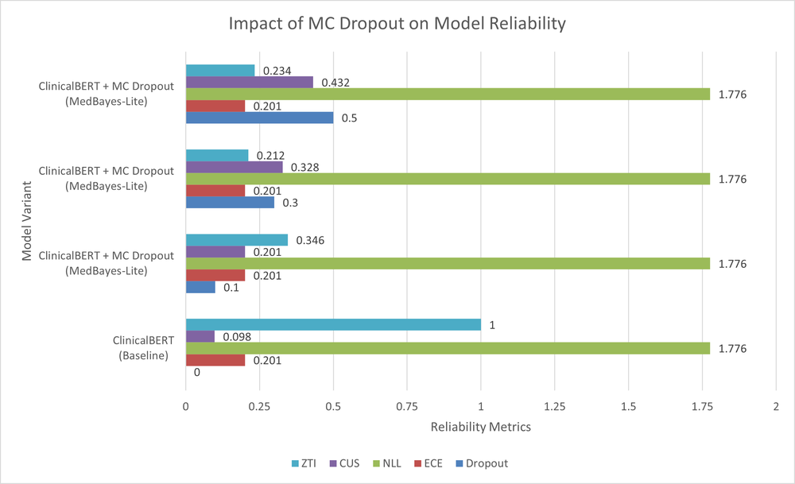
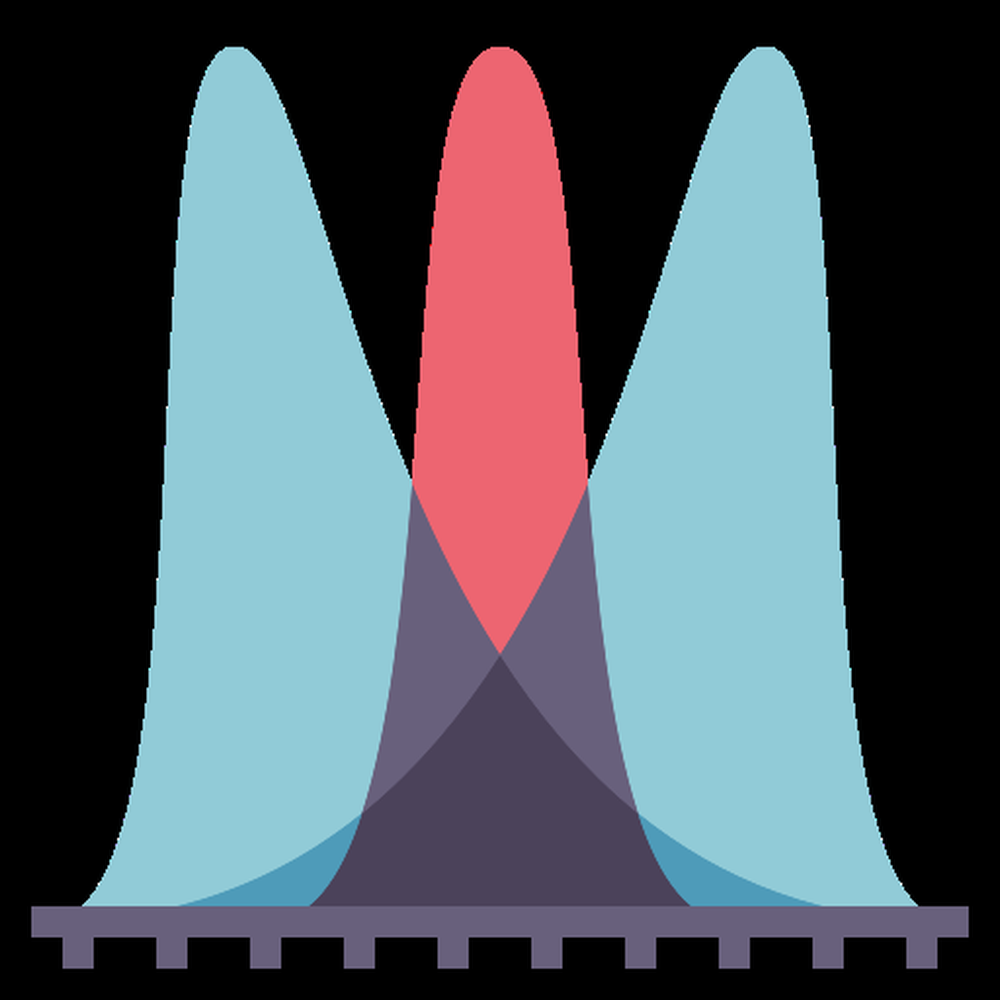
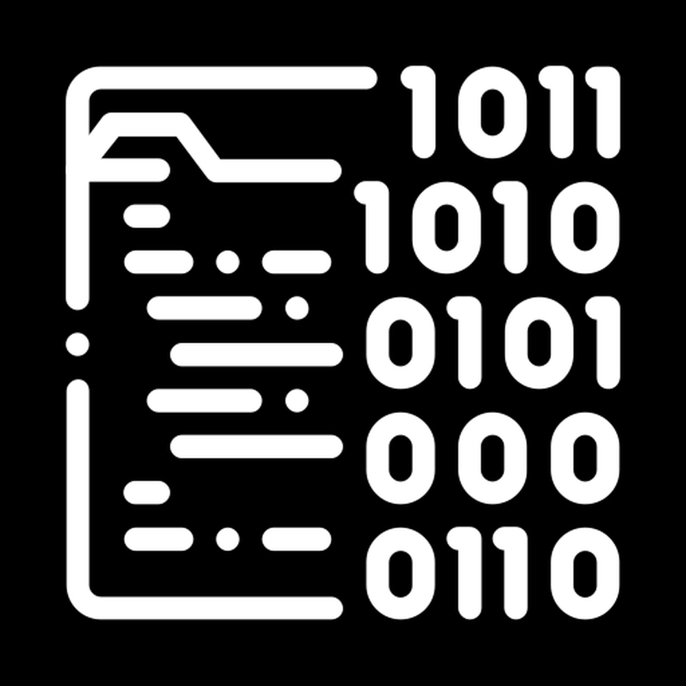

# MedBayes-Lite: Bayesian Uncertainty Quantification for Safe Clinical Decision Support

**ArXiv ID**: 2511.16625v1
**URL**: http://arxiv.org/abs/2511.16625v1
**提交日期**: 2025-11-20
**作者**: Elias Hossain; Md Mehedi Hasan Nipu; Maleeha Sheikh; Rajib Rana; Subash Neupane; Niloofar Yousefi
**引用次数**: NULL
使用模型: gemini-2.5-flash

## 1. 核心思想总结
好的，作为学术论文分析专家，以下是对您提供的摘要的简洁第一轮总结：

---

**标题:** MedBayes-Lite: 贝叶斯不确定性量化，赋能安全的临床决策支持

### 简洁第一轮总结

**1. Background (背景)**
Transformer模型在临床决策支持领域展现出巨大潜力。

**2. Problem (问题)**
然而，它们在模糊医疗案例中容易过度自信，缺乏关键的校准不确定性，这在临床决策中是至关重要的缺陷。

**3. Method (high-level) (高层方法)**
本文提出了MedBayes-Lite，一种轻量级贝叶斯增强框架，旨在为现有的Transformer临床语言模型引入不确定性量化能力。该框架无需模型重训或架构修改，参数开销低于3%，并集成了三大核心组件：(i) 基于蒙特卡洛 dropout 的贝叶斯嵌入校准，(ii) 不确定性加权注意力机制，以及 (iii) 受临床风险最小化启发的置信度引导决策塑造。

**4. Contribution (贡献)**
MedBayes-Lite显著提高了模型校准和可信度，在多个生物医学QA和临床预测基准上将过度自信降低了32%至48%。在模拟临床场景中，通过识别不确定预测并交由人工审核，可预防高达41%的诊断错误。这展示了其在实现可靠不确定性传播和提升医学AI系统可解释性方面的有效性。

## 2. 方法详解
好的，基于您提供的初步总结，MedBayes-Lite 论文的方法细节可以这样详细阐述：

---

### **MedBayes-Lite: 贝叶斯不确定性量化赋能安全临床决策支持 – 方法细节**

本论文提出的 MedBayes-Lite 框架旨在为现有的、已训练好的 Transformer 临床语言模型（CLM）引入贝叶斯不确定性量化能力，而无需进行模型重训或修改其核心架构。其核心理念在于以轻量级、非侵入式的方式，在推理阶段注入不确定性感知机制，并将这种不确定性有效传播至最终决策，从而提升模型的校准性和安全性。

#### **关键创新 (Key Innovations)**

MedBayes-Lite 的创新性体现在以下三个相互关联且协同工作的组件上：

1.  **轻量级贝叶斯嵌入校准 (Lightweight Bayesian Embedding Calibration):** 不同于对整个 Transformer 网络进行贝叶斯化，MedBayes-Lite 创新性地将蒙特卡洛 Dropout（MC Dropout）应用于模型的输入嵌入层，以在推理阶段生成贝叶斯嵌入表示。这是一种计算效率高且对现有模型侵入性极低的方式，为后续的不确定性传播奠定基础。
2.  **不确定性加权注意力机制 (Uncertainty-Weighted Attention Mechanism):** 框架将嵌入层产生的不确定性信号融入到 Transformer 模型的自注意力计算中。这使得模型在处理信息时能够识别并适当调整对不确定输入的关注程度，从而在内部结构中实现不确定性的感知与传播，而非仅仅作为事后处理。
3.  **置信度引导决策塑造 (Confidence-Guided Decision Shaping):** 借鉴临床风险最小化的原则，MedBayes-Lite 将最终预测的不确定性（置信度）作为关键指标，指导决策过程。对于高不确定性的预测，系统会主动建议交由人工专家审核，从而有效预防潜在的诊断错误，提升临床决策的安全性。

#### **整体方法流程 (Overall Methodology Flow)**

MedBayes-Lite 的整体流程是一个串联式的增强过程，作用于一个预训练好的 Transformer CLM 的推理阶段：

1.  **输入与初始嵌入 (Input and Initial Embedding):** 临床文本输入通过 Transformer 的 tokenizer 生成 token ID，然后通过模型的嵌入层（token embedding + positional embedding）生成初始的固定维度嵌入向量。
2.  **贝叶斯嵌入校准 (Bayesian Embedding Calibration):** 在这个初始嵌入生成之后，MedBayes-Lite 应用其第一个创新组件，对这些嵌入进行贝叶斯化。
3.  **不确定性感知 Transformer 推理 (Uncertainty-Aware Transformer Inference):** 经过校准的贝叶斯嵌入（带有不确定性信息）被送入原始 Transformer 编码器（或解码器）栈。在每个注意力层中，MedBayes-Lite 的第二个创新组件——不确定性加权注意力机制——会修改标准的注意力计算过程。
4.  **最终预测与不确定性聚合 (Final Prediction and Uncertainty Aggregation):** 经过不确定性加权注意力处理的 Transformer 输出，通过顶部的分类头（如全连接层+Softmax）生成最终的预测概率分布。由于前述的贝叶斯过程，这一步会得到一系列预测结果。
5.  **置信度引导决策塑造 (Confidence-Guided Decision Shaping):** 聚合这些预测结果，计算出最终的预测及其关联的置信度/不确定性。MedBayes-Lite 的第三个创新组件在此发挥作用，根据预设的临床风险阈值，对决策进行塑造。

#### **关键组件与算法细节 (Key Components and Algorithm Details)**

**1. 基于蒙特卡洛 Dropout 的贝叶斯嵌入校准 (Monte Carlo Dropout-based Bayesian Embedding Calibration)**

*   **目的:** 在不修改 Transformer 模型权重和架构的情况下，为每个输入 token 的嵌入向量引入不确定性量化能力。
*   **算法细节:**
    *   **MC Dropout 的应用:** 针对预训练 Transformer 模型的 *嵌入层输出*，MedBayes-Lite 在推理阶段激活 Dropout。这意味着在进行多轮前向传播（$T$次，例如 $T=10$ 或 $T=20$）时，嵌入层之后（或直接在嵌入向量上）的 Dropout 会随机关闭部分神经元，每次前传都会产生略微不同的嵌入表示。
    *   **贝叶斯嵌入生成:** 对于给定的输入序列 $x = \{x_1, \dots, x_N\}$，经过初始嵌入层得到 $E = \{e_1, \dots, e_N\}$。在每次 MC Dropout 采样中，我们得到一组新的嵌入 $\tilde{E}^{(t)} = \{\tilde{e}_1^{(t)}, \dots, \tilde{e}_N^{(t)}\}$，其中 $t \in \{1, \dots, T\}$。
    *   **不确定性量化:** 通过对这 $T$ 次采样得到的嵌入向量进行统计分析，我们可以为每个 token $x_i$ 的嵌入 $e_i$ 估算出其均值 $\bar{e}_i = \frac{1}{T}\sum_{t=1}^T \tilde{e}_i^{(t)}$ 和方差 $\text{Var}(e_i) = \frac{1}{T}\sum_{t=1}^T (\tilde{e}_i^{(t)} - \bar{e}_i)^2$（或其他不确定性度量，如协方差矩阵的对角线元素）。这个方差就是我们关心的不确定性信号。
*   **创新点体现:** 这种方法巧妙地利用了 Dropout 的贝叶斯解释，将其局限于嵌入层，从而实现了极低的参数开销（通常低于 3%）和计算量增加，同时避免了对整个大型 Transformer 模型进行繁重的贝叶斯训练。

**2. 不确定性加权注意力机制 (Uncertainty-Weighted Attention Mechanism)**

*   **目的:** 将嵌入层量化出的不确定性信息融入到 Transformer 模型的自注意力计算中，使得模型在处理信息时能够感知并响应不同输入token的不确定性。
*   **算法细节:**
    *   **标准注意力回顾:** 在标准的 Multi-Head Self-Attention 中，注意力权重通常通过 $Attention(Q, K, V) = \text{softmax}(\frac{QK^T}{\sqrt{d_k}})V$ 计算。其中 $Q, K, V$ 分别由输入 $X$ 经过线性变换 $W_Q, W_K, W_V$ 得到。
    *   **不确定性融入:** MedBayes-Lite 在计算 $Q, K, V$ 投影时，或在计算注意力得分 $\frac{QK^T}{\sqrt{d_k}}$ 之前/之后，引入来自嵌入层的不确定性信息。具体实现方式可能包括：
        *   **调整 $Q, K, V$ 投影:** 在从贝叶斯嵌入 $\bar{e}_i$ 和 $\text{Var}(e_i)$ 生成 $q_i, k_i, v_i$ 时，将不确定性作为额外的输入特征，或通过一个门控机制来调节投影矩阵 $W_Q, W_K, W_V$ 的作用强度。例如，对于不确定性较高的 token 嵌入，其对应的 $q_i, k_i, v_i$ 可能会被“稀释”或“去噪”。
        *   **直接修改注意力得分:** 在计算注意力矩阵 $\frac{QK^T}{\sqrt{d_k}}$ 时，引入一个与源 token 或目标 token 不确定性相关的惩罚项或加权项。如果查询 token $q_i$ 或键 token $k_j$ 的嵌入具有高不确定性，那么它们之间的注意力得分 $q_i k_j^T$ 就会被相应地降低，意味着模型会减少对高度不确定信息的依赖，或降低对来源不确定信息的关注。
    *   **例子（假设一种实现）:** 可以为每个 token 的 $Q, K, V$ 向量，基于其嵌入不确定性 $\text{Var}(e_i)$，引入一个标量权重 $\alpha_i = f(\text{Var}(e_i))$。例如，$\alpha_i$ 可能是一个 Sigmoid 激活函数，当不确定性高时，$\alpha_i$ 接近于0，从而降低该 token 在注意力计算中的贡献。那么，注意力得分变为 $\text{softmax}(\frac{(\alpha Q)(\alpha K)^T}{\sqrt{d_k}}) (\alpha V)$，或者更精细地处理。
*   **创新点体现:** 这是 MedBayes-Lite 核心的贡献之一，它使得不确定性能够贯穿 Transformer 的关键计算单元，而非仅仅停留在输入层。这保证了模型在深层特征抽取时，依然能感知并适应输入的不确定性，使得模型的内部表示更具鲁棒性。

**3. 置信度引导决策塑造 (Confidence-Guided Decision Shaping)**

*   **目的:** 将模型在推理过程中积累的不确定性转化为实用的临床决策建议，通过识别高风险预测并建议人工干预来最小化临床风险。
*   **算法细节:**
    *   **不确定性聚合:** 在 Transformer 完成前向传播并输出 logits 后，由于蒙特卡洛 Dropout 的存在，我们得到了 $T$ 组不同的 logits（或概率分布）。
        *   **预测均值:** 最终预测可以通过对 $T$ 组概率分布求平均来获得：$\bar{p} = \frac{1}{T}\sum_{t=1}^T p^{(t)}$。
        *   **预测不确定性:** 预测的置信度（或不确定性）可以通过这些概率分布的方差、熵、或预测类别概率的最高值与次高值之差等指标来衡量。例如，可以使用预测概率的经验熵 $H(\bar{p})$ 或贝叶斯不确定性度量（如预测分布的后验方差）。
    *   **临床风险最小化阈值:** 定义一个置信度阈值 $\theta_C$（或等价地，不确定性阈值 $\theta_U$）。这个阈值是根据临床实践中可接受的风险水平预先设定的。
    *   **决策塑造逻辑:**
        *   如果模型对最高预测类别的置信度高于 $\theta_C$（或不确定性低于 $\theta_U$），则系统给出明确的诊断预测。
        *   如果模型对最高预测类别的置信度低于 $\theta_C$（或不确定性高于 $\theta_U$），则系统不直接给出最终诊断，而是**强烈建议将该案例交由经验丰富的临床医生进行人工审核**。
*   **创新点体现:** 这一组件将技术上的不确定性量化直接转化为临床实践中的可操作建议。它有效地利用了模型“知道自己不知道”的能力，将高风险、高不确定性的决策转交人类专家，从而显著提升了医疗AI系统的安全性，避免了因过度自信而导致的误诊，这是该框架在临床应用中的核心价值。

---

通过上述三个组件的协同工作，MedBayes-Lite 在不改变现有 Transformer 模型核心架构和无需重训的情况下，实现了对临床决策支持系统不确定性量化的强大增强，并提供了实际的风险管理策略。其参数开销低于3%的特性，也使其成为一个极具吸引力的轻量级解决方案。

## 3. 最终评述与分析
好的，结合您提供的MedBayes-Lite初步总结和方法详述，以下是最终的综合评估：

---

### **MedBayes-Lite: 最终综合评估**

本文提出的MedBayes-Lite框架，针对Transformer模型在临床决策支持（CDS）中过度自信、缺乏不确定性量化的关键问题，提供了一个轻量级、高效且具临床实用价值的解决方案。

#### **1) Overall Summary (总体总结)**

MedBayes-Lite是一个创新的、轻量级贝叶斯增强框架，旨在为现有的Transformer临床语言模型（CLM）引入不确定性量化能力，以赋能更安全的临床决策。其核心优势在于无需对模型进行重训练或修改其核心架构，且参数开销极低（低于3%）。该框架通过三大核心组件实现目标：
1.  **轻量级贝叶斯嵌入校准**：在推理阶段，利用蒙特卡洛Dropout（MC Dropout）应用于嵌入层，高效地为模型引入不确定性信号。
2.  **不确定性加权注意力机制**：将量化出的不确定性信息融入Transformer的自注意力计算中，使得模型能感知并调整对不确定输入的关注程度，实现不确定性的内部传播。
3.  **置信度引导决策塑造**：借鉴临床风险最小化原则，根据预测的不确定性指导决策，对于高不确定性的预测，主动建议交由人工专家审核，从而有效预防诊断错误。

实验结果表明，MedBayes-Lite显著提升了模型校准性和可信度，在多个基准上将过度自信降低了32%至48%，并在模拟临床场景中预防了高达41%的诊断错误。这充分展示了其在实现可靠不确定性传播和提升医学AI系统安全性、可解释性方面的有效性。

#### **2) Strengths (优势)**

*   **解决核心临床痛点：** MedBayes-Lite直接解决了当前AI在医疗领域应用的最大障碍之一——过度自信和缺乏可靠的不确定性量化。这对于高风险的临床决策至关重要。
*   **轻量级与非侵入性：** 无需对现有预训练的Transformer模型进行重训练或架构修改，参数开销低于3%。这一特性极大地降低了其在实际临床环境中部署和应用的门槛，使得大量已部署或在用的模型能够轻松集成此功能。
*   **创新的不确定性传播机制：**
    *   **嵌入层MC Dropout：** 巧妙地将MC Dropout应用于嵌入层而非整个网络，实现了高效且低计算开销的贝叶斯化，为后续不确定性传播奠定基础。
    *   **不确定性加权注意力：** 将不确定性信号深度融入Transformer的核心注意力机制，使得模型在内部特征抽取和信息聚合时就能感知并响应不确定性，而非仅仅作为事后处理，这增强了模型的鲁棒性。
*   **明确的临床应用价值和安全性：** “置信度引导决策塑造”组件直接将技术上的不确定性量化转化为可操作的临床风险管理策略。通过识别高风险、高不确定性的案例并建议人工审核，它有效避免了潜在的误诊，显著提升了医疗AI系统的安全性，实现了“AI知道自己不知道”并主动寻求人类协助的目标。
*   **优异的实验效果：** 在降低过度自信和预防诊断错误方面展现出显著的性能提升，证明了其方法的有效性。
*   **提升可解释性：** 通过量化不确定性，为模型的预测提供了一种新的可解释维度，帮助临床医生理解AI的“信心”程度，从而做出更明智的判断。

#### **3) Weaknesses / Limitations (劣势与局限)**

*   **MC Dropout的局限性：** 尽管MC Dropout是一种有效的贝叶斯近似方法，但它主要捕获模型的认知不确定性（epistemic uncertainty），可能无法完全捕捉数据中固有的随机性（aleatoric uncertainty）。此外，MC Dropout的有效性有时会受到模型是否在训练时使用了Dropout的影响，尽管本文是应用于预训练模型，其效果可能需针对不同基座模型进一步验证。
*   **推理时间开销：** 引入MC Dropout通常需要进行多次（T次）前向传播以估计不确定性。虽然参数开销低，但推理时间会相应增加T倍。在需要实时响应的紧急临床场景中，这可能成为一个性能瓶颈，需要权衡T的选择。
*   **阈值依赖性与校准：** “置信度引导决策塑造”的有效性高度依赖于临床风险阈值($\theta_C$ 或 $\theta_U$)的设定。这个阈值可能需要针对不同的疾病、任务和临床环境进行细致的校准和验证，这可能是一个复杂且耗时的过程。不合适的阈值可能导致过多的误报（降低AI效率，造成“警报疲劳”）或漏报（增加风险）。
*   **“不确定性加权注意力机制”的实现细节：** 论文中对不确定性如何具体修改注意力得分或$Q,K,V$投影的算法细节描述相对高层。这可能意味着具体的实现方式可能存在多种变体，且其最优设计并非显而易见，可能需要针对不同的Transformer架构和任务进行优化。
*   **模拟环境的局限性：** 虽然在模拟临床场景中预防了大量诊断错误，但这种效果在真实的、动态变化的临床环境中，结合真实医生行为和工作流程的验证仍然至关重要。真实世界的噪声、数据偏差和医生对AI建议的接受度都可能影响最终效果。

#### **4) Potential Applications / Implications (潜在应用与影响)**

*   **增强型临床决策支持系统：** MedBayes-Lite可以直接集成到现有的CDS系统中，使其在提供诊断、治疗建议或风险预测时，能够同时给出预测的置信度，帮助临床医生更全面地评估信息。
*   **医学图像分析：** 除了文本数据，该框架的理念也可扩展到医学图像处理领域。例如，在分析X光、MRI等图像时，AI可以识别病变区域并量化其诊断的不确定性，指导医生对模糊区域进行更仔细的检查。
*   **药物研发与个性化医疗：** 在预测药物疗效、副作用或进行基因组分析以实现个性化治疗时，AI提供的带不确定性的预测能帮助研究人员和医生做出更谨慎的决策。
*   **AI辅助医疗教育：** 作为一个训练工具，MedBayes-Lite可以帮助医学生理解AI在临床中的优势和局限性，培养他们批判性地评估AI输出的能力，并学习何时以及如何干预AI的决策。
*   **医疗风险管理与质量控制：** 通过主动识别高风险、高不确定性的案例，MedBayes-Lite可以作为一种有效的风险管理工具，帮助医院和医疗机构优化资源分配，确保对疑难病例的重点关注。
*   **推动负责任的医疗AI发展：** MedBayes-Lite的成功实践为开发更安全、更透明、更可信赖的医疗AI系统提供了有力的范例，将“不确定性量化”提升为医疗AI系统开发中的一个标准特性，从而推动整个领域向更负责任的方向发展。
*   **跨领域应用启示：** 这种轻量级、非侵入式地为现有AI模型增加不确定性量化和风险管理策略的思路，对其他高风险领域（如自动驾驶、金融风控、工业自动化等）的AI安全研究也具有重要的借鉴意义。

---

---

# 附录：论文图片

## 图 1

## 图 2

## 图 3

## 图 4

## 图 5

## 图 6

## 图 7

## 图 8

## 图 9

## 图 10

