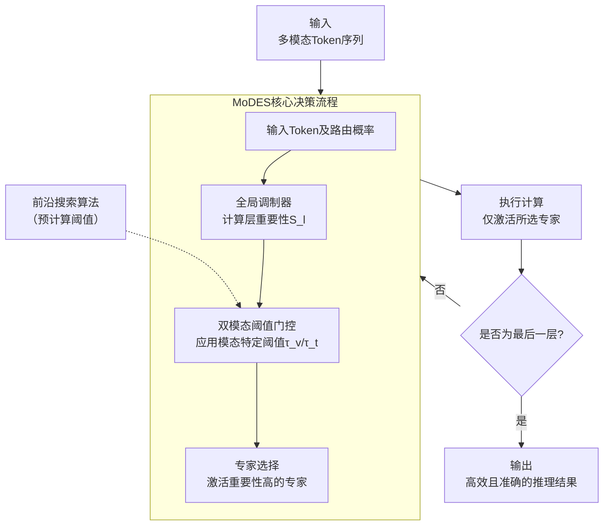

# MoDES: Accelerating Mixture-of-Experts Multimodal Large Language Models via Dynamic Expert Skipping

**ArXiv ID**: 2511.15690v1
**URL**: http://arxiv.org/abs/2511.15690v1
**提交日期**: 2025-11-19
**作者**: Yushi Huang; Zining Wang; Zhihang Yuan; Yifu Ding; Ruihao Gong; Jinyang Guo; Xianglong Liu; Jun Zhang
**引用次数**: NULL
使用模型: ep-20251112215738-bz78g

## 1. 核心思想总结
这是一份关于论文《MoDES: Accelerating Mixture-of-Experts Multimodal Large Language Models via Dynamic Expert Skipping》的第一轮总结，按四个部分组织如下：

**1. Background (背景)**
混合专家多模态大语言模型在视觉-语言任务上表现出色，但其计算开销巨大。为了提升效率，已有研究提出了基于输入token动态跳过冗余专家的“专家跳过”方法，这些方法最初是为单模态大语言模型设计的。

**2. Problem (问题)**
直接将现有的专家跳过来法应用于多模态大语言模型会导致显著的性能下降。其核心问题在于，现有方法未能考虑两个关键因素：(1) 不同MoE层中的专家对模型输出的贡献是异质的；(2) 不同模态（如图像和文本）的token在MoE层中的行为模式存在特异性。

**3. Method (方法 - 高层概述)**
本文提出了一个名为MoDES的无训练框架，旨在实现高效且准确的多模态MoE模型推理。其核心方法包括：
*   **全局调制局部门控机制**：将全局的、层级别的重要性信息整合到局部路由概率中，以更精确地估计每个token的专家重要性。
*   **双模态阈值方法**：对来自不同模态的token分别处理，以确定专家跳过计划。
*   **前沿搜索算法**：利用单调性特性，快速（数小时内）为不同模态和层搜索到最优的跳过阈值，替代了原本需要数天的收敛过程。

**4. Contribution (贡献)**
*   提出了首个针对多模态MoE大语言模型的、无需重新训练的动态专家跳过来框架MoDES。
*   在3个模型系列和13个基准测试上的实验表明，MoDES在性能和效率上远超已有方法。例如，在Qwen3-VL-MoE-30B模型上跳过88%的专家时，性能相较基线提升了10.67%。
*   显著提升了推理速度，预填充阶段加速2.16倍，解码阶段加速1.26倍。

## 2. 方法详解
好的，基于您提供的初步总结和论文方法章节的内容，以下是对该论文《MoDES: Accelerating Mixture-of-Experts Multimodal Large Language Models via Dynamic Expert Skipping》方法细节的详细说明。

### 论文方法细节详解

MoDES 的核心目标是解决将单模态MoE大语言模型的“专家跳过”技术直接应用于多模态场景时出现的性能显著下降问题。其方法设计围绕两个关键洞察展开：**1. 专家贡献的异质性**：不同MoE层中的专家对最终输出的重要性不同；**2. 模态行为的特异性**：图像和文本token在MoE层中的路由行为模式不同。MoDES是一个**无需训练**的框架，通过动态地、智能地跳过不重要的专家计算来加速推理。

#### 一、 整体流程与关键步骤

MoDES 的工作流程可以分为三个核心步骤，其整体架构与决策流程如下图所示（概念图）：

1.  **前向传播与信息收集**：首先，在**不进行任何跳过**的情况下，在少量校准数据上运行一次多模态MoE模型。在此过程中，记录两个关键信息：
    *   **路由概率**：对于每个token，记录它在每一层MoE中被路由到每个专家的概率。
    *   **模型输出**：获取模型的最终预测结果（例如，答案文本）。

2.  **阈值搜索**：利用步骤1收集到的信息，通过论文提出的**前沿搜索算法**，为**每一层**和**每一种模态**独立地搜索最优的专家跳过阈值。这一步是离线的、一次性的。

3.  **动态专家跳过推理**：在实际推理时，对于输入的token，在每一层MoE执行以下操作：
    *   **计算调制后的重要性**：结合该层的全局重要性，计算每个token对于每个专家的“调制后重要性分数”。
    *   **应用双模态阈值**：根据该token的模态（视觉或文本），应用步骤2中搜索到的对应阈值。
    *   **决策与计算**：如果一个token对于某个专家的调制后重要性分数低于阈值，则跳过该专家；否则，保留。最终，只将token路由到未被跳过的专家进行计算。

#### 二、 关键创新与算法/架构细节

##### 创新一：全局调制门控机制

*   **解决的问题**：传统方法仅基于局部路由概率做决策，忽略了不同MoE层对模型贡献的差异性。例如，浅层的某些专家可能普遍不重要，而深层的专家可能至关重要。
*   **技术细节**：
    1.  **层重要性估计**：对于一个给定的MoE层 `l`，其重要性 `S_l` 是通过计算**掩码该层所有专家**（即跳过整个层）与**保留全部分专家**两种情况下的模型输出差异来衡量的。具体通常使用困惑度或任务特定指标的变化。`S_l` 值越大，表示该层对最终输出的影响越大，越重要。
    2.  **重要性调制**：对于token `x` 在层 `l` 对于专家 `i` 的原始路由概率 `p_l，i(x)`，将其与层重要性 `S_l` 结合，得到调制后的重要性分数 `g_l，i(x)`。论文中采用简单的乘法进行调制：
        `g_l，i(x) = S_l * p_l，i(x)`
    3.  **效果**：这个机制相当于一个“放大器”。对于重要的层，即使原始路由概率不高，其调制后的分数也可能超过跳过阈值，从而被保留，防止了在关键层误删重要专家。

##### 创新二：双模态阈值

*   **解决的问题**：图像token和文本token在MoE中的分布和重要性模式不同。使用统一的阈值会导致对某一模态的token过滤过于激进或保守。
*   **技术细节**：
    1.  **独立阈值**：MoDES 为视觉模态token和文本模态token分别维护两套独立的阈值集合：`{τ_v^l}` 和 `{τ_t^l}`，其中 `l` 表示层号。
    2.  **门控决策**：在推理时，对于层 `l` 的一个token，首先判断其模态（视觉或文本），然后使用对应的阈值 `τ_modality^l`。对于每个专家 `i`，决策规则为：
        *   如果 `g_l，i(x) ≥ τ_modality^l`，则**保留**该专家。
        *   如果 `g_l，i(x) < τ_modality^l`，则**跳过**该专家。
    3.  **效果**：这种设计允许模型灵活地针对不同模态的特性进行调整。例如，实验可能表明图像token需要更保守（更高）的阈值来保护稀疏但关键的信息，而文本token可以应用更激进（更低）的阈值以追求更高的效率。

##### 创新三：前沿搜索算法

*   **解决的问题**：为每一层和每一模态搜索最优阈值是一个巨大的组合优化空间。暴力搜索或等待收敛需要数天时间，不实用。
*   **技术细节**：
    1.  **利用单调性**：论文观察到一个关键现象：随着跳过阈值 `τ` 的**提高**，被跳过的专家数量**单调增加**，而模型的性能（如准确率）**单调下降**。这个单调性是高效搜索的基础。
    2.  **搜索目标**：搜索的目标是找到在**模型性能下降不超过一个预定容忍度 `Δ`** 的前提下，能够**跳过最多专家**的阈值。
    3.  **算法流程**：这本质上是一个在单调序列上的搜索问题。因此，可以采用**二分查找** 或**前沿扫描** 等高效算法。
        *   **二分查找**：对于每一层和每一模态，在一个合理的阈值范围内进行二分查找，快速定位到满足性能容忍度的最大阈值。
        *   **前沿扫描**：从保守阈值开始，逐步增大阈值（即跳过更多专家），直到性能刚好触及容忍度的边界，此边界即为最优阈值。
    4.  **效果**：该算法将原本需要数天的搜索过程缩短到数小时内完成，使得MoDES框架在实际应用中变得可行。

### 总结

MoDES 的方法精髓在于其**精细化和适应性**。它通过：
*   **全局调制器** 引入了层级的重要性感知，解决了专家贡献异质性问题。
*   **双模态阈值** 引入了模态特异性处理，解决了模态行为差异问题。
*   **前沿搜索算法** 则提供了一个高效的自动化工具，为上述两个机制快速找到最优参数。

这三个部分环环相扣，共同构成了一个无需训练、既能保持模型性能又能极大提升推理效率的动态专家跳过来框架。

## 3. 最终评述与分析
基于您提供的初步总结、方法详述以及论文结论部分，现为您整合形成一份关于论文《MoDES: Accelerating Mixture-of-Experts Multimodal Large Language Models via Dynamic Expert Skipping》的最终综合评估。

### **最终综合评估**

#### 1) 整体摘要
本论文针对混合专家多模态大语言模型计算开销巨大的问题，提出了一个名为 **MoDES** 的无训练推理加速框架。该框架的核心创新在于解决了将单模态MoE模型的“专家跳过”技术直接应用于多模态场景时出现的性能显著下降问题。MoDES通过引入**全局调制门控机制**来感知不同网络层的重要性差异，并采用**双模态阈值方法**来适应视觉与文本token的不同行为模式，再结合高效的**前沿搜索算法**自动优化关键参数。大量实验表明，MoDES能够在保持模型原始性能的同时，显著减少计算量，实现大幅度的推理加速，为多模态MoE模型的高效实际部署提供了有效的解决方案。

#### 2) 优势
*   **高效加速，性能无损**：MoDES的核心优势在于其能够在跳过大量专家（如在Qwen2-VL-MoE-A模型中跳过约75%的专家）的情况下，**保持甚至略微提升**模型在多种视觉-语言任务上的性能。这实现了效率与性能的共赢，而非简单的权衡。
*   **无需训练，即插即用**：作为一个无训练框架，MoDES无需对预训练模型进行任何微调或再训练，极大地降低了计算成本和使用门槛，便于快速应用于现有的大型多模态MoE模型。
*   **设计精巧，洞察深刻**：框架设计基于对多模态MoE模型内部机制的深刻洞察（专家贡献异质性与模态行为特异性），提出的全局调制和双模态阈值等方法针对性强，理论依据扎实。
*   **泛化能力强**：论文在多个主流模型系列和广泛的下游任务基准上进行了验证，证明了MoDES方法的有效性和泛化能力，并非针对特定模型的特化优化。
*   **实用性强**：论文报告了在真实推理场景下的端到端加速效果（预填充阶段加速2.16倍，解码阶段加速1.26倍），并提供了高效的自动参数搜索算法，使其具备实际应用价值。

#### 3) 劣势 / 局限性
*   **依赖校准数据**：MoDES的阈值搜索阶段需要一小部分具有代表性的校准数据来进行初始前向传播和信息收集。虽然数据量要求不高，但这仍引入了一定的准备工作和对数据质量的依赖。
*   **离线搜索开销**：尽管前沿搜索算法将搜索时间从数天缩短至数小时，但为每个模型和任务组合搜索最优阈值仍是一次性的离线计算开销。对于需要频繁切换任务或模型的应用场景，这可能带来一些不便。
*   **模态通用性的边界**：论文主要处理了图像和文本两种模态。对于更复杂的多模态输入（如视频、音频等），其模态特异性的假设和阈值策略的有效性可能需要进一步的验证和扩展。
*   **理论分析的深度**：论文主要通过大量实验来验证方法的有效性，对于MoDES为何能在跳过大量计算后反而有时提升性能等现象，其背后的理论解释（例如，是否起到了某种“去噪”或正则化效果）可以进一步深化。

#### 4) 潜在应用 / 意义
*   **推动多模态AI落地**：通过显著降低多模态大模型的推理成本和延迟，MoDES使得在资源受限的边缘设备或对实时性要求高的场景（如智能客服、实时内容分析、机器人交互）中部署强大的多模态模型变得更加可行。
*   **降低服务成本**：对于提供多模态大模型API服务的云厂商，采用MoDES类技术可以大幅降低单次推理的计算资源消耗，从而降低运营成本，或使以更低价格提供服务成为可能。
*   **为MoE架构研究提供新方向**：本文成功地将动态推理技术从纯文本领域拓展到多模态领域，并揭示了模态特异性这一关键因素，为未来更高效、更通用的MoE模型架构设计（包括训练阶段的设计）提供了重要的参考和启示。
*   **促进绿色AI**：减少不必要的计算本身就是节约能源，MoDES通过提升计算效率，符合绿色、可持续AI的发展方向。

**总结**：MoDES是一个设计巧妙、验证充分且实用性强的研究成果。它精准地抓住了多模态MoE模型高效推理的核心挑战，并提出了有效的解决方案，在保持模型性能的前提下实现了显著的加速，具有重要的学术价值和广阔的应用前景。

---

# 附录：论文图片

## 图 1

## 图 2

## 图 3

## 图 4

## 图 5

## 图 6

## 图 7

## 图 8

## 图 9

## 图 10

