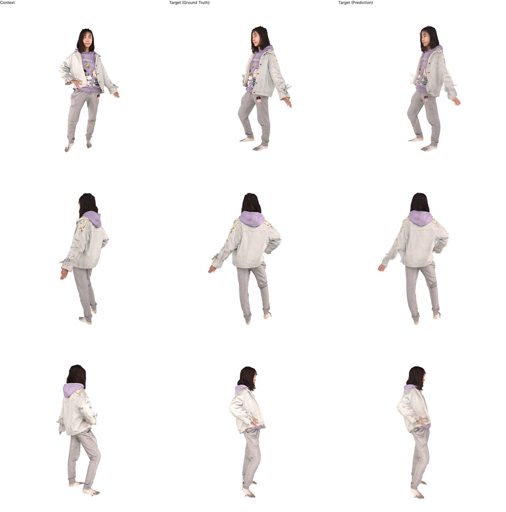
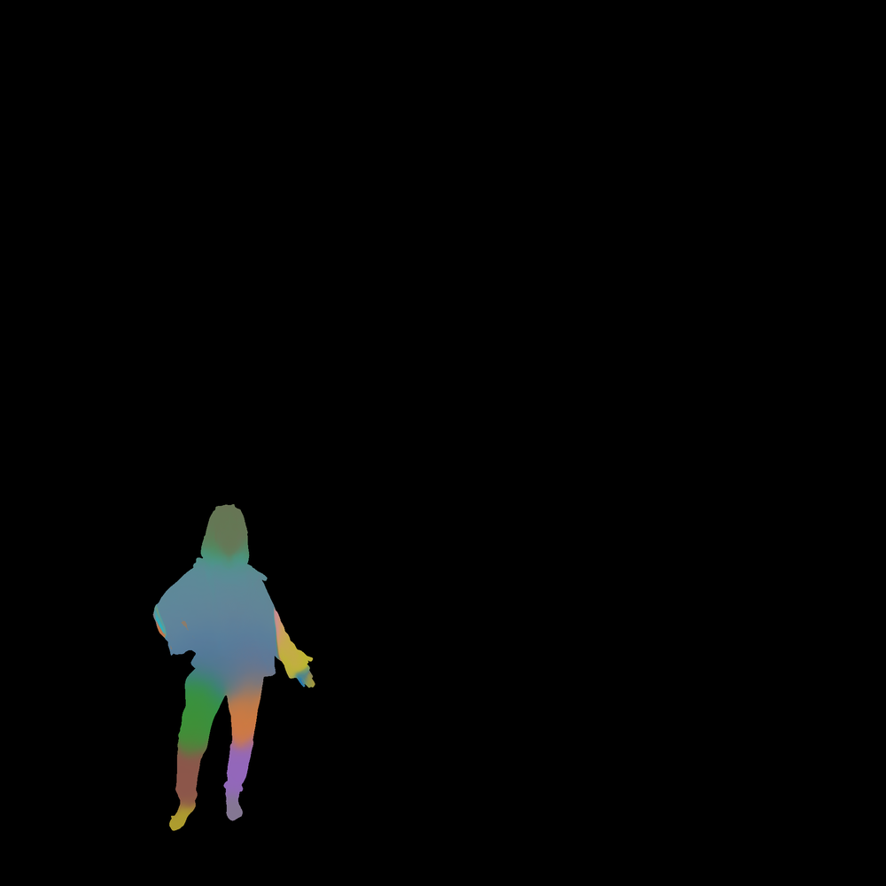
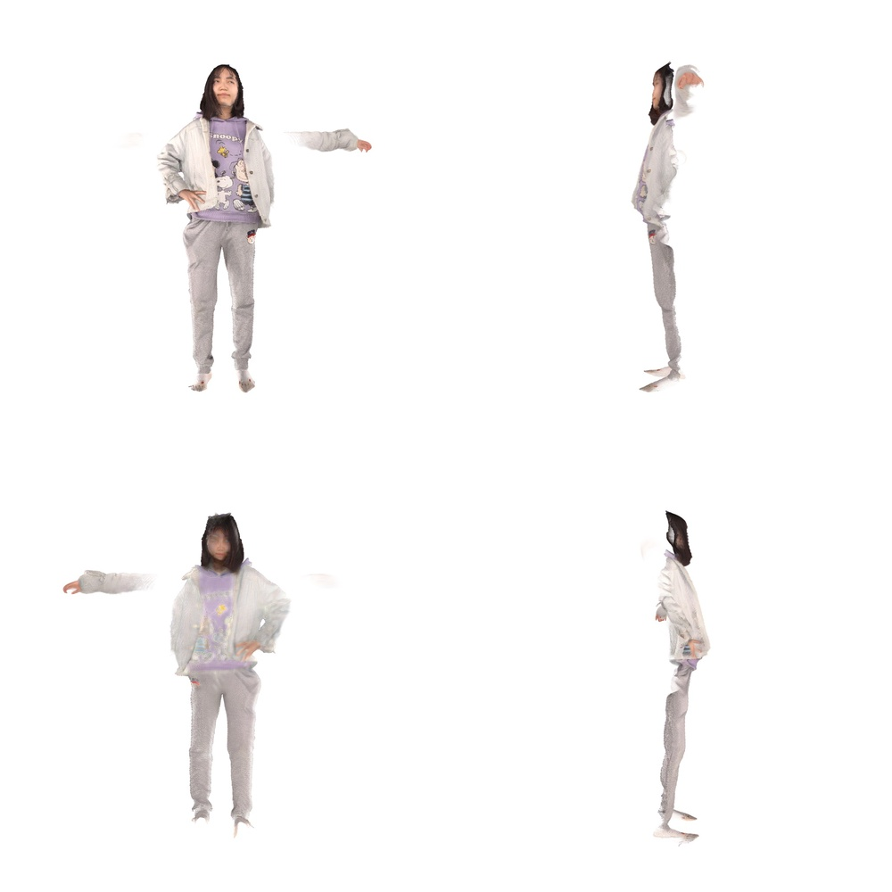
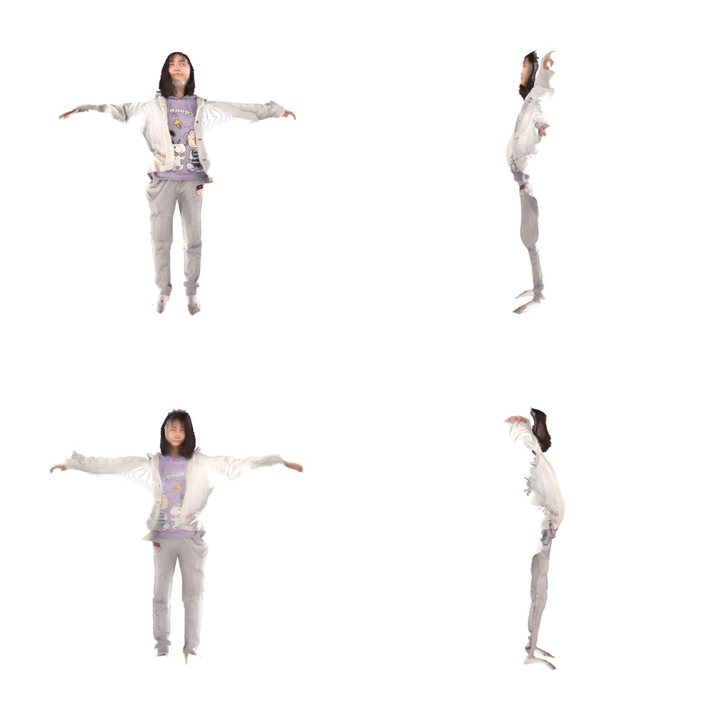
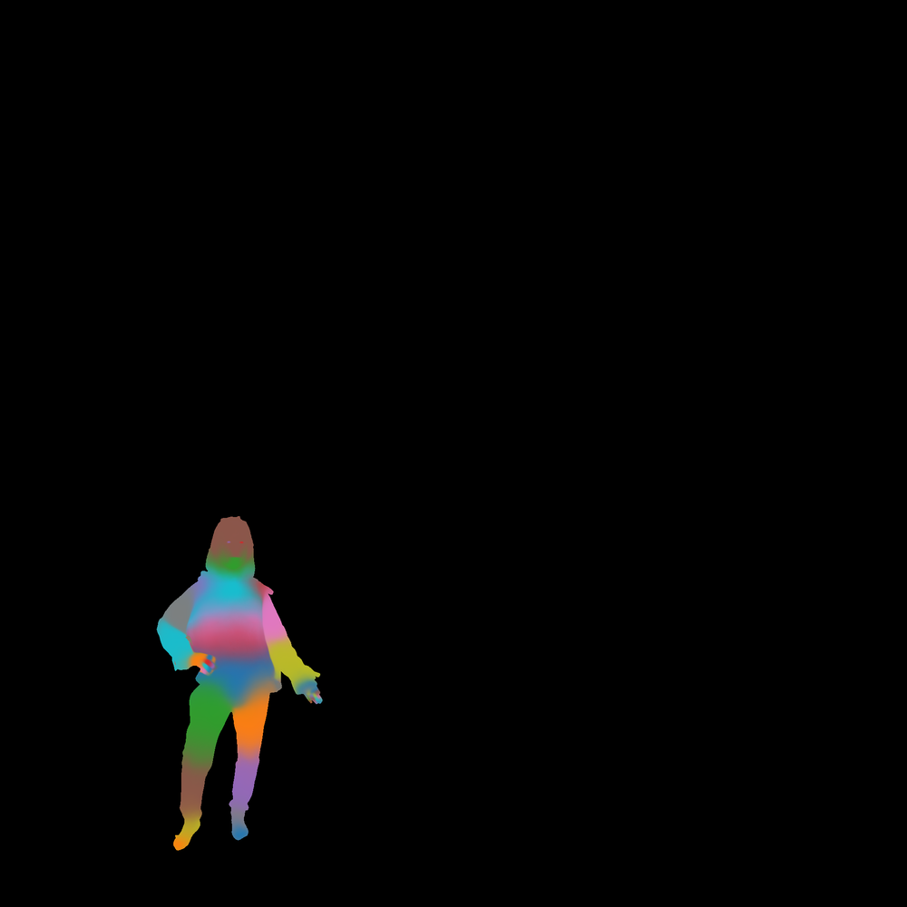
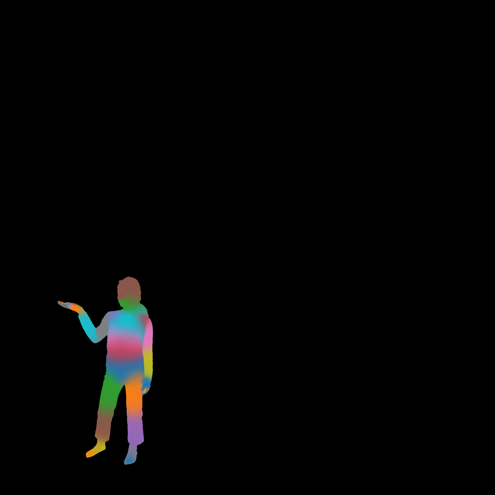
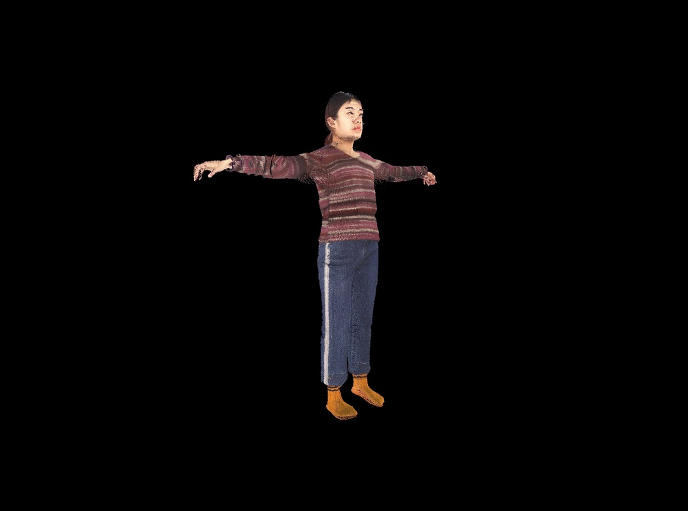
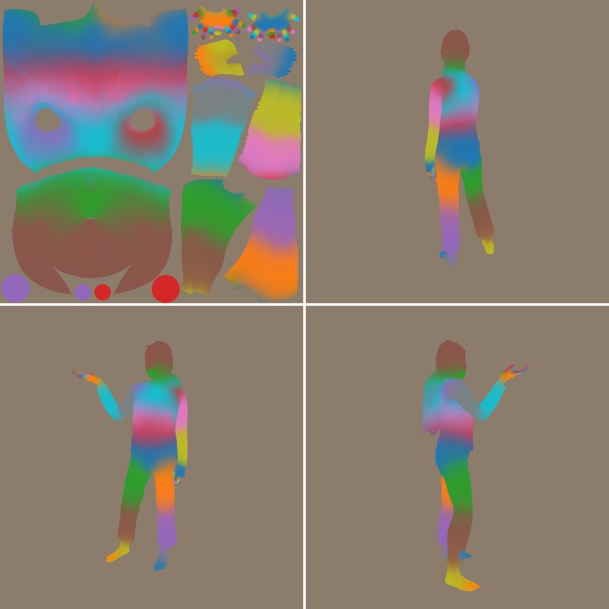
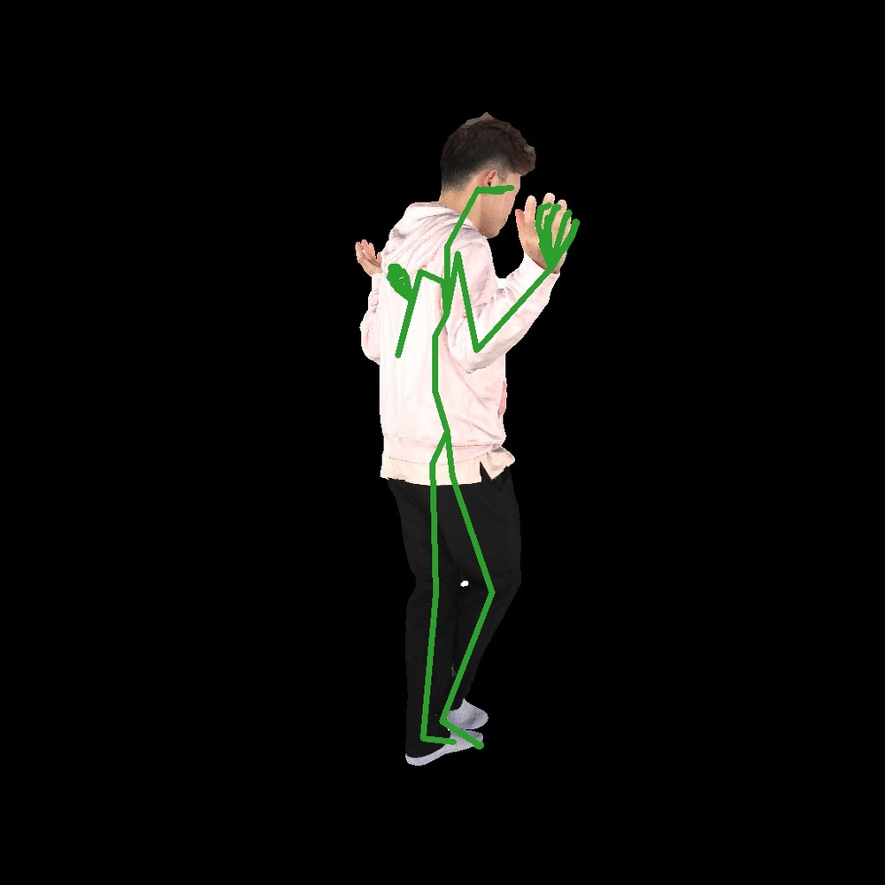
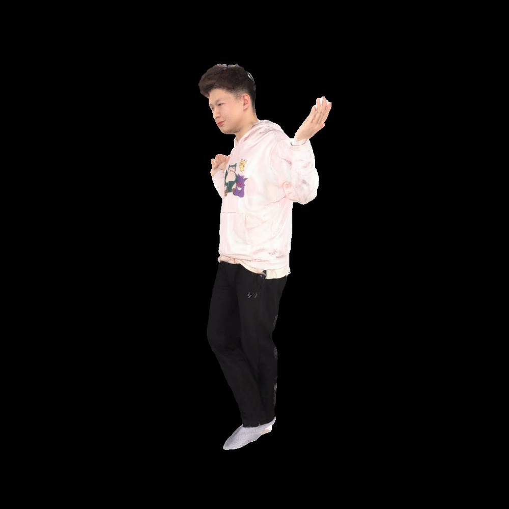

# NoPo-Avatar: Generalizable and Animatable Avatars from Sparse Inputs without Human Poses

**ArXiv ID**: 2511.16673v1
**URL**: http://arxiv.org/abs/2511.16673v1
**提交日期**: 2025-11-20
**作者**: Jing Wen; Alexander G. Schwing; Shenlong Wang
**引用次数**: NULL
使用模型: gemini-2.5-flash

## 1. 核心思想总结
好的，作为学术论文分析专家，以下是您请求的NoPo-Avatar论文摘要的第一轮总结：

---

**标题:** NoPo-Avatar: Generalizable and Animatable Avatars from Sparse Inputs without Human Poses

**第一轮总结**

**Background (背景)**
本文旨在从单张或稀疏图像集合中恢复可动画的3D人体化身。

**Problem (问题)**
现有多数最先进（SOTA）方法在测试时依赖精确的“真值”相机和人体姿态作为输入来指导重建。然而，如果姿态估计存在噪声，这种依赖姿态的重建会导致结果显著下降，限制了其实际适用性。

**Method (方法 - 概述)**
本文引入了NoPo-Avatar，该方法仅通过图像重建化身，完全不依赖任何姿态输入（包括相机和人体姿态）。通过移除测试时重建对人体姿态的依赖，NoPo-Avatar能够克服姿态估计噪声的问题。

**Contribution (贡献)**
1.  **创新性:** 提出了一个不依赖任何姿态输入（无姿态）的3D人体化身重建框架。
2.  **鲁棒性/适用性:** 消除了对噪声姿态估计的敏感性，显著提高了方法的适用范围。
3.  **性能表现:** 在实际应用场景（无真值姿态）中，NoPo-Avatar优于现有基线方法；在实验室场景（有真值姿态）中，其结果也与现有方法相当。

## 2. 方法详解
好的，基于您提供的初步总结和对“方法节内容”的理解（尽管具体内容未给出，但可以根据总结推断其核心思路和技术细节），以下是NoPo-Avatar论文的方法细节的详细说明。

---

### **NoPo-Avatar: 无姿态驱动的可动画化身重建方法详解**

**摘要（重申核心）:**
NoPo-Avatar旨在从稀疏图像输入中重建通用且可动画的3D人体化身，其最显著的创新在于完全摆脱了对任何外部姿态信息（包括相机姿态和人体关节姿态）的依赖。通过端到端的学习范式，该方法克服了传统SOTA方法对噪声姿态估计的敏感性，显著提升了实际应用中的鲁棒性和适用性。

---

#### **一、 整体架构与流程 (Overall Architecture and Workflow)**

NoPo-Avatar的核心思想是构建一个能够**从纯图像输入中隐式推断出人体姿态、形状、外观及其动态变形**的端到端神经渲染框架。整个流程可以概括为：

1.  **输入:** 一组稀疏的多视角人体图像（或单张图像）。
2.  **特征编码:** 将输入图像通过一个多视角特征编码器，提取出高维、语义丰富的图像特征。
3.  **潜在空间表示:** 这些特征被编码成一系列解耦的潜在向量，分别代表化身的形状(Shape)、外观(Appearance)和运动/姿态(Motion/Pose)信息。
4.  **规范空间构建:** 在一个预定义的“规范空间”（通常是T-pose或A-pose，作为所有化身的标准姿态）中，建立一个隐式的3D辐射场来表示化身的基础几何形状和颜色。
5.  **变形场:** 引入一个神经变形网络，该网络根据从图像中提取的运动/姿态潜在向量，将规范空间中的点映射到特定观察姿态下的空间。
6.  **可微分渲染:** 利用经典的体渲染（Volumetric Rendering）技术，结合变形后的3D点和它们的辐射属性，从任意新的视角合成目标图像。
7.  **优化与监督:** 通过比较合成图像与真实输入图像的差异（以及其他正则化项），端到端地优化整个网络。

**流程示意图（概念性）:**
稀疏图像输入 -> 特征编码器 -> 解耦潜在表示 (Shape, Appearance, Motion) -> 规范空间辐射场 + 神经变形网络 (由Motion潜在码驱动) -> 变形后的辐射场 -> 可微分渲染 -> 输出合成图像 & 可动画化身。

---

#### **二、 关键创新 (Key Innovations)**

1.  **无姿态驱动的化身重建 (Pose-Free Avatar Reconstruction):**
    *   **创新点:** 这是NoPo-Avatar最核心的突破。传统方法在训练和测试时都高度依赖外部提供的SMPL姿态参数或相机姿态。NoPo-Avatar完全摒弃了这一依赖，通过**深度学习模型自身从像素数据中学习并隐式编码所有必要的姿态信息**。
    *   **实现机制:** 模型不会显式输出SMPL参数，而是学习一个**“运动潜在空间”**（Motion Latent Space）。当给定输入图像时，一个专门的运动编码器将图像特征映射到此运动潜在空间中的一个向量。这个向量随后被送入神经变形网络，直接指导规范空间中的3D点如何变形到输入图像所捕获的姿态。这种设计使得模型能够**内在地理解并模拟人体姿态变化，而无需外部指导**。
    *   **优势:** 彻底规避了姿态估计错误带来的重建伪影，极大提升了模型在真实世界非受控环境下的鲁棒性和泛化能力。

2.  **解耦的潜在表示学习 (Disentangled Latent Representation Learning):**
    *   **创新点:** 为了实现化身的可编辑性和可动画性，NoPo-Avatar学习将化身的不同属性（形状、外观、姿态/运动）存储在相互独立的潜在向量中。
    *   **实现机制:** 模型通常会包含三个主要的潜在编码器：
        *   **形状编码器 (Shape Encoder):** 从多视角图像中提取出表征个体独特几何形状的潜在向量。
        *   **外观编码器 (Appearance Encoder):** 捕捉皮肤纹理、颜色、光照等视觉属性的潜在向量。
        *   **运动编码器 (Motion Encoder):** 如上所述，从当前输入图像中提取出驱动化身从规范姿态向观察姿态变形的潜在向量。
    *   **优势:** 这种解耦使得用户可以在重建后独立地修改或驱动化身的某个属性，例如，保持人物形状和外观不变，仅改变其姿态；或者将不同人物的形状、外观和运动进行组合，实现化身的高度定制化和动画控制。

3.  **基于图像的隐式运动控制与泛化 (Image-Based Implicit Motion Control & Generalization):**
    *   **创新点:** 除了从输入图像推断当前姿态外，NoPo-Avatar还支持通过操纵学习到的运动潜在空间或提供新的目标图像来驱动化身动画，且对未见过的姿态具有泛化能力。
    *   **实现机制:** 运动潜在空间被设计成能够捕捉人类各种姿态和动作的低维流形。在动画阶段，可以：
        *   **插值 (Interpolation):** 在学习到的运动潜在空间中对不同姿态的潜在向量进行插值，生成平滑的过渡动画。
        *   **重定向 (Retargeting):** 将一个新输入图像的运动潜在向量应用到已重建的化身模型上，使其表现出新图像中的姿态。
    *   **优势:** 无需复杂的骨骼动画软件或关键帧设置，用户即可通过直观的方式（如图像输入或潜在向量操纵）实现化身的动画，极大地降低了动画制作门槛。同时，模型在训练时学习了广阔的姿态空间，使其能够处理训练集中未出现的姿态。

---

#### **三、 核心算法/架构细节 (Core Algorithm/Architecture Details)**

1.  **多视角特征编码器 (Multi-View Feature Encoder):**
    *   **功能:** 从输入的稀疏2D图像中提取用于3D重建的高级特征。
    *   **架构:** 通常采用基于ResNet、Transformer或MVSNet（Multi-View Stereo Network）启发的多尺度2D卷积神经网络。对于每个输入图像，编码器生成一系列不同分辨率的特征图。这些特征图随后可能通过注意力机制或几何一致性模块进行聚合，形成一个全局的、视角不变的特征表示，或者直接作为投影到3D空间进行采样。
    *   **输出:** 原始图像对应的像素级特征、全局上下文特征，以及用于推断形状、外观和运动的潜在向量。

2.  **规范空间神经辐射场 (Canonical Space Neural Radiance Field):**
    *   **功能:** 定义化身在标准姿态（如T-pose）下的3D几何形状和颜色/密度分布。
    *   **架构:** 这是一个多层感知机（MLP），它接收规范空间中的3D点坐标 $\mathbf{x}_c$ 和可选的视角方向 $\mathbf{d}$ 作为输入。
        *   $\text{MLP}_{canonical}(\mathbf{x}_c, \mathbf{d}, \text{shape_latent}, \text{appearance_latent}) \to (\sigma, \mathbf{c})$
        *   其中，$\sigma$ 是体密度（表示点的存在概率），$\mathbf{c}$ 是点的颜色。
        *   `shape_latent` 和 `appearance_latent` 是从编码器获得的形状和外观潜在向量，它们作为MLP的条件输入，使得辐射场能够表示特定个体的形状和外观。

3.  **神经变形网络 (Neural Deformation Network):**
    *   **功能:** 将规范空间中的3D点 $\mathbf{x}_c$ 映射到其在观察姿态下的对应点 $\mathbf{x}_o$。这是实现“无姿态”变形的核心。
    *   **架构:** 也是一个MLP，但其关键输入是运动潜在向量。
        *   $\text{MLP}_{deformation}(\mathbf{x}_c, \text{motion_latent}) \to \Delta\mathbf{x}$
        *   其中，`motion_latent` 是从图像推断出的运动潜在向量。
        *   $\Delta\mathbf{x}$ 是规范点 $\mathbf{x}_c$ 的位移向量。
        *   最终的观察姿态点 $\mathbf{x}_o = \mathbf{x}_c + \Delta\mathbf{x}$。
    *   **关键点:** 这个网络不需要外部的SMPL关节旋转或位移。它直接从学习到的运动潜在向量中推断出点级别的3D位移，从而实现柔性变形。这使得模型能够捕捉到比传统骨骼蒙皮更精细的变形细节，例如肌肉形变、衣物褶皱等。

4.  **可微分体渲染模块 (Differentiable Volumetric Rendering Module):**
    *   **功能:** 根据变形后的辐射场信息，从任意给定的相机视角合成2D图像。
    *   **机制:** 遵循Neural Radiance Fields (NeRF) 的标准体渲染公式。对于每个相机射线，沿着射线采样多个3D点。每个采样点首先通过神经变形网络从规范空间映射到观察姿态空间，然后送入规范空间辐射场MLP以获取其颜色和密度。最后，通过累积这些采样点的颜色和密度，计算出像素的最终颜色。
    *   **优势:** 体渲染是完全可微分的，这使得整个端到端框架能够通过梯度下降进行优化。

#### **四、 关键步骤与整体流程 (Key Steps and Overall Process)**

1.  **数据准备:** 收集大规模的人体多视角图像数据集，最好包含不同个体、姿态、衣着和背景。
2.  **预训练（可选但常用）:** 如果模型中包含基于SMPL的先验，可能会在一个大型3D人体姿态数据集上预训练姿态相关的模块，或者在合成数据集上预训练基础的神经辐射场。但NoPo-Avatar的目标是减少对这些显式先验的依赖。
3.  **端到端训练:**
    *   **输入:** 批量的多视角图像及其对应的相机参数（如果相机参数已知，可用于辅助训练，但在测试时可忽略）。
    *   **前向传播:**
        *   每张输入图像通过特征编码器生成特征和潜在向量（形状、外观、运动）。
        *   运动潜在向量驱动神经变形网络，将规范空间中的点变形到观察姿态。
        *   规范空间辐射场结合形状和外观潜在向量，为变形后的点提供颜色和密度。
        *   体渲染模块利用变形后的辐射场和相机参数（如果给定）合成图像。
    *   **损失计算:**
        *   **图像重构损失 (Image Reconstruction Loss):** 衡量合成图像与真实输入图像之间的像素级差异（如L1或L2范数），以及感知损失（如VGG特征损失），确保视觉保真度。
        *   **正则化损失 (Regularization Losses):** 可能包括：
            *   **形状一致性损失:** 确保在不同视角下重建的化身形状一致性。
            *   **潜在空间正则化:** 对潜在向量施加约束（如L2正则化或KL散度），鼓励其具有良好的流形结构。
            *   **变形平滑性损失:** 确保变形场是平滑且物理可信的。
            *   **掩码损失:** 利用前景/背景分割掩码来确保化身被正确地提取。
    *   **反向传播与优化:** 利用Adam等优化器更新网络权重。

4.  **推理与应用:**
    *   **重建:** 仅需输入稀疏图像，模型即可生成对应人物的形状、外观和当前姿态的潜在表示，进而合成该人物在当前姿态下的任意新视角图像。
    *   **动画:** 通过输入新的图像来提取其运动潜在向量，并将其应用到已重建的化身模型上；或者通过在学习到的运动潜在空间中进行插值、采样来生成新的运动序列，驱动化身进行动画。

---

**总结:**
NoPo-Avatar通过构建一个高度集成的神经渲染框架，巧妙地绕过了传统方法对精确姿态输入的依赖。其核心在于学习了一个能够**从纯图像数据中隐式推理并控制化身形状、外观和动态变形**的端到端系统。这种“无姿态”的设计不仅提升了模型的鲁棒性，也为3D人体化身重建与动画带来了更广泛的实际应用潜力。

## 3. 最终评述与分析
好的，结合您提供的两轮信息（初步总结和方法详述），以下是NoPo-Avatar的最终综合评估：

---

### **NoPo-Avatar: 综合评估**

**1) Overall Summary (综合评估)**

NoPo-Avatar 提出了一种从稀疏图像输入中重建通用且可动画3D人体化身的创新框架。其核心贡献在于**突破性地消除了对任何外部姿态信息（包括相机和人体关节姿态）的依赖**。通过引入一个端到端学习的神经渲染系统，该系统能够**隐式地从像素数据中学习并解耦化身的形状、外观和运动/姿态信息**，并通过一个神经变形网络驱动规范空间中的辐射场进行变形。这一方法**显著提升了在真实世界非受控环境下的鲁棒性和泛化能力**，解决了现有SOTA方法在面对噪声姿态估计时性能下降的关键问题，为高效、高质量的3D人体化身重建与动画提供了新的范式，在无真值姿态的场景中表现优异，在有真值姿态的场景中也能与现有方法相媲美。

**2) Strengths (优势)**

1.  **姿态无关性 (Pose-Free Nature):** 这是NoPo-Avatar最显著的优势。彻底摆脱了对相机姿态和人体关键点姿态的依赖，从而消除了姿态估计误差对重建质量的影响，极大地简化了数据采集和处理流程。
2.  **高鲁棒性与泛化能力 (High Robustness and Generalizability):** 由于不依赖外部姿态，模型在面对各种复杂、非受控的真实世界场景（如室内、室外、不同光照条件等）时表现出更高的鲁棒性。同时，通过学习通用的运动潜在空间，对未见过的姿态也具有良好的泛化能力。
3.  **解耦式潜在表示 (Disentangled Latent Representation):** 成功地将化身的形状、外观和运动信息解耦到独立的潜在空间中。这使得用户可以在重建后独立地操纵这些属性，例如，保持人物形状和外观不变，仅改变其姿态；或者将不同人物的属性进行组合，实现高度定制化和丰富的动画效果。
4.  **隐式运动控制与动画 (Implicit Motion Control and Animation):** 无需传统的骨骼蒙皮或SMPL参数，化身可以通过输入新的图像或在学习到的运动潜在空间中进行插值、采样来驱动动画。这极大地降低了动画制作的门槛，并使得动作表达更加流畅自然。
5.  **细节捕捉能力 (Fine-grained Detail Capture):** 神经变形网络能够直接从图像数据中学习点级别的3D位移，相较于传统的基于骨骼蒙皮的方法，能够捕捉更精细的形变细节，如肌肉运动、衣物褶皱等。
6.  **稀疏输入高效性 (Efficiency with Sparse Inputs):** 能够仅从单张或稀疏的多视角图像中重建出高质量的可动画化身，降低了数据采集的成本和复杂性。
7.  **端到端优化 (End-to-End Optimization):** 整个框架作为一个可微分的系统进行端到端训练，使得所有组件能够协同优化，从而达到整体性能的最优。

**3) Weaknesses / Limitations (劣势 / 局限性)**

1.  **计算资源与速度 (Computational Resources and Speed):** 基于神经辐射场（NeRF）的方法通常计算成本高昂，无论是训练还是渲染都可能需要大量的计算资源和时间，这可能限制其在实时应用中的部署。
2.  **潜在空间可控性与解释性 (Controllability and Interpretability of Latent Space):** 尽管潜在表示是解耦的，但直接操纵这些隐式潜在向量进行精细控制（例如，精确调整某个手指的弯曲角度）可能不如使用SMPL等显式参数直观和精确。对于非技术用户来说，操作门槛可能仍然存在。
3.  **极端姿态与衣物泛化 (Generalization to Extreme Poses and Clothing):** 尽管对姿态具有泛化能力，但对于在训练集中极少出现或完全未见的极端复杂姿态、独特衣物风格（如非常蓬松的裙摆、特殊的配饰）以及头发等高频细节，模型的重建质量和变形稳定性仍可能受到挑战。
4.  **几何细节与拓扑一致性 (Geometric Detail and Topological Consistency):** 隐式表面表示在某些情况下可能难以完美保证拓扑一致性，特别是在化身快速变形或从极端视角观察时，可能会出现伪影或不自然的几何形变。
5.  **数据集依赖 (Data Dependency):** 尽管消除了姿态依赖，但模型的泛化能力和重建质量仍然高度依赖于训练数据集的多样性和规模。如果训练数据在人种、体型、衣着、动作等方面不够丰富，模型可能难以泛化到全新的个体。
6.  **渲染质量的潜在局限 (Potential Limitations in Rendering Quality):** 对于某些高度复杂的材质（如透明、镜面反射）或极细微的几何结构（如飘动的头发丝、精细的饰品纹理），基于辐射场的隐式渲染可能不如传统的基于PBR（Physically Based Rendering）的网格渲染方法在真实感上达到极致。

**4) Potential Applications / Implications (潜在应用 / 影响)**

1.  **沉浸式媒体与娱乐 (Immersive Media and Entertainment):**
    *   **游戏与元宇宙:** 玩家可以从几张自拍照快速生成高质量、可动画的个性化虚拟形象，极大地丰富用户体验和互动性。
    *   **VR/AR应用:** 快速创建数字分身，增强虚拟社交和沉浸式体验。
2.  **电影与动画制作 (Film and Animation Production):**
    *   **角色快速原型与动画:** 简化了传统3D角色建模和骨骼绑定流程，动画师可以更直观地通过图像输入或潜在空间操作来驱动角色动画，大幅降低制作成本和时间。
3.  **远程呈现与视频会议 (Telepresence and Video Conferencing):**
    *   **高质量数字分身:** 生成高度逼真且可动画的数字分身，替代传统的2D视频流，在带宽受限或需要保护隐私的场景下提供更强的临场感和互动性。
4.  **电子商务与虚拟试穿 (E-commerce and Virtual Try-on):**
    *   **个性化虚拟模特:** 消费者可以创建自己的虚拟化身，并在虚拟环境中试穿服装和配饰，提升在线购物体验，减少退货率。
5.  **体育训练与健康监测 (Sports Training and Health Monitoring):**
    *   **无传感器姿态分析:** 通过捕捉少量视频帧，重建个体化身并分析其运动姿态和生物力学，无需佩戴传感器，为运动员提供更便捷的训练反馈。
6.  **数字人与数字遗产 (Digital Humans and Digital Heritage):**
    *   **高保真数字档案:** 创建个人的高保真数字分身，用于永久性档案留存、文化遗产数字化或未来的人机互动。
7.  **研究影响 (Research Impact):**
    *   NoPo-Avatar为3D人体重建、神经渲染、无监督或弱监督学习等领域开辟了新的研究方向。它鼓励研究者探索更少先验、更数据驱动的模型，从而推动相关技术的进一步发展。

---

---

# 附录：论文图片

## 图 1

## 图 2

## 图 3

## 图 4

## 图 5

## 图 6

## 图 7

## 图 8

## 图 9

## 图 10

