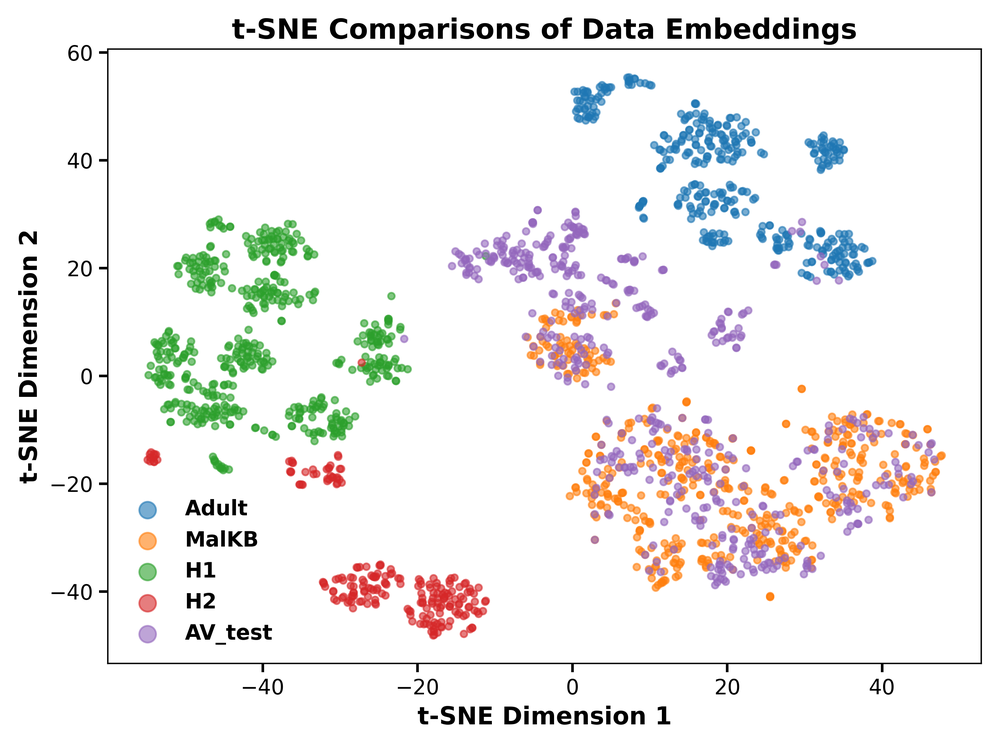
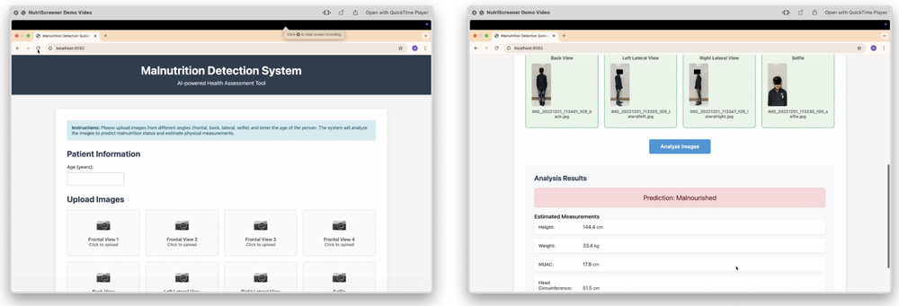
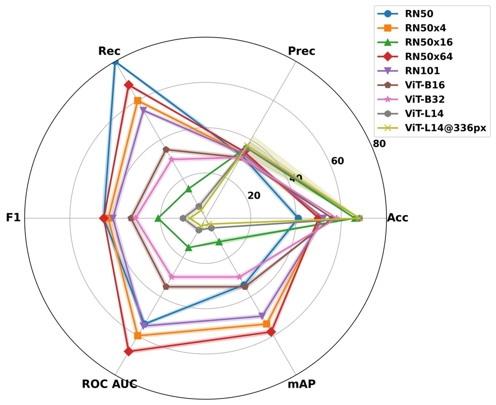
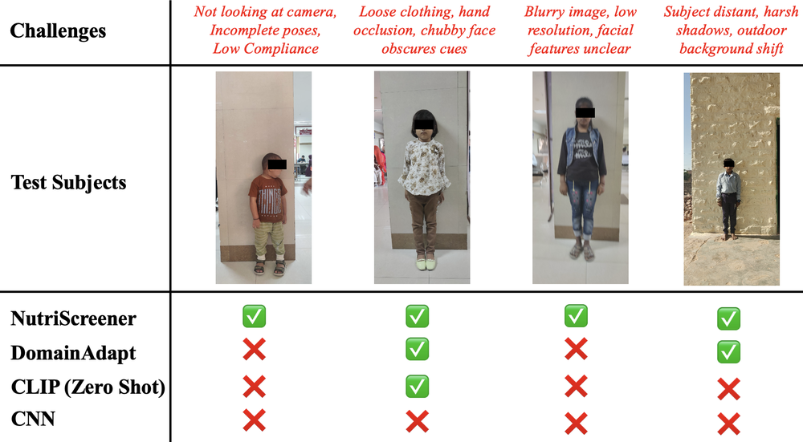
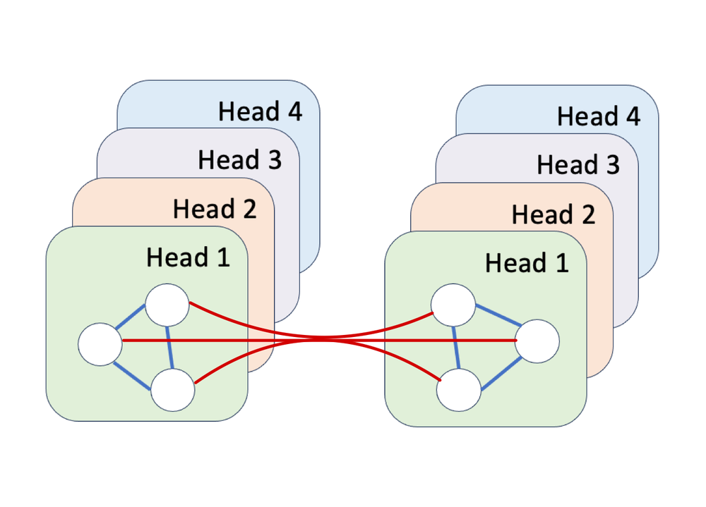
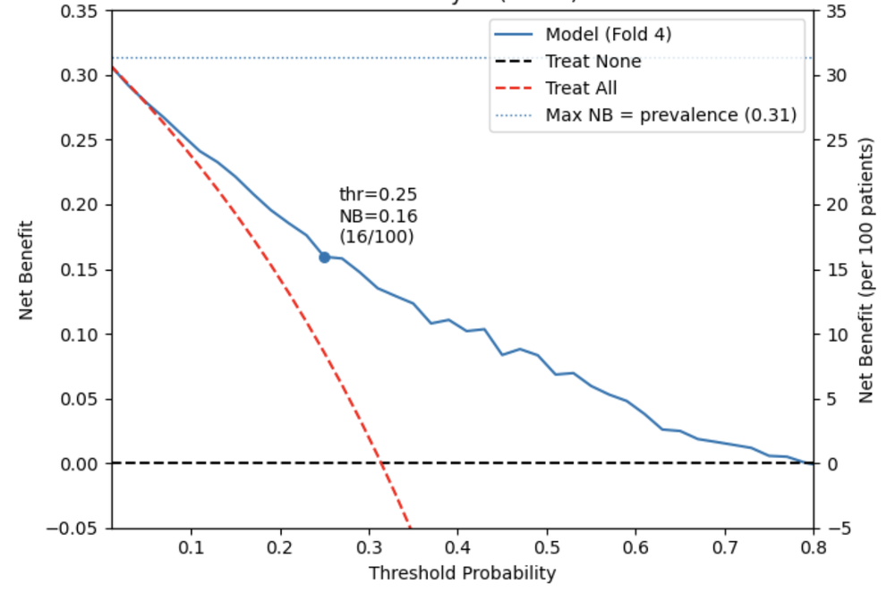
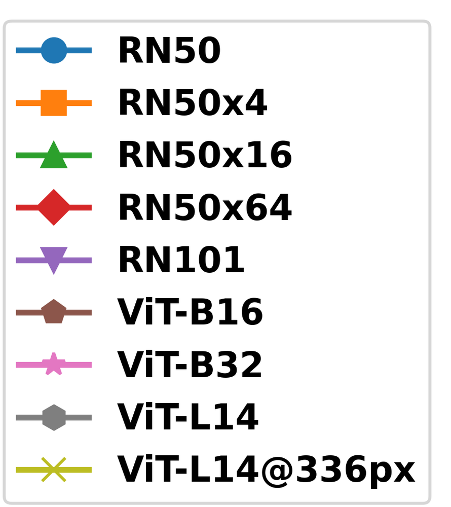
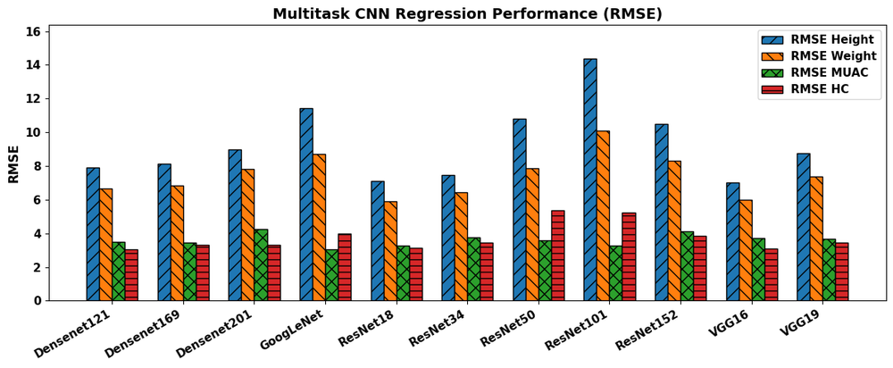
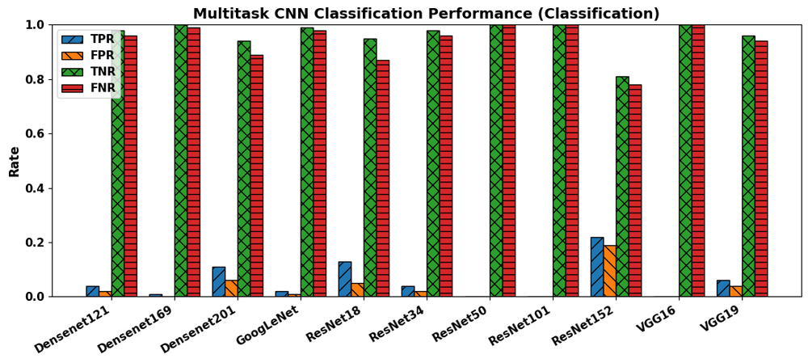
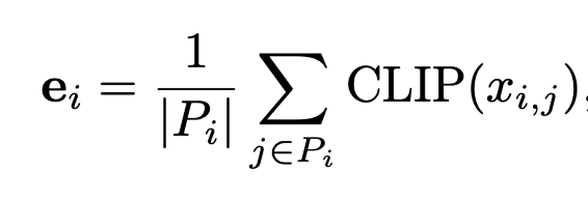

# NutriScreener: Retrieval-Augmented Multi-Pose Graph Attention Network for Malnourishment Screening

**ArXiv ID**: 2511.16566v1
**URL**: http://arxiv.org/abs/2511.16566v1
**提交日期**: 2025-11-20
**作者**: Misaal Khan; Mayank Vatsa; Kuldeep Singh; Richa Singh
**引用次数**: NULL
使用模型: gemini-2.5-flash

## 1. 核心思想总结
好的，以下是根据您提供的摘要，一份简洁的第一轮总结：

---

### NutriScreener: 检索增强的多姿态图注意力网络用于营养不良筛查

**背景 (Background):**
儿童营养不良是一个全球性危机。

**问题 (Problem):**
现有筛查方法费力且可扩展性差，阻碍了早期干预。

**高层方法 (Method - High-level):**
本文提出了 NutriScreener，一个检索增强的多姿态图注意力网络。它结合了基于 CLIP 的视觉嵌入、类别增强的知识检索和上下文感知，旨在实现儿童图像中营养不良的稳健检测和人体测量预测，同时解决泛化性和类别不平衡问题。

**贡献 (Contribution):**
1.  **性能卓越：** 在 AnthroVision 等数据集上训练和测试，取得了 0.79 的召回率、0.82 的 AUC 和显著更低的人体测量 RMSE，并在多样化的跨大陆人群中进行了评估。
2.  **实用性强：** 临床研究中，医生对其准确性评分为 4.3/5，效率评分为 4.6/5，证实了其在低资源环境下的部署就绪性。
3.  **技术创新：** 跨数据集结果显示，使用人口统计学匹配的知识库可将召回率提高高达 25%，RMSE 降低高达 3.5 厘米。
4.  **解决方案：** 为低资源环境下的早期营养不良检测提供了一个可扩展且准确的解决方案。

## 2. 方法详解
好的，根据您提供的初步总结和对“方法节内容”的理解，下面详细阐述 NutriScreener 的方法细节：

---

### NutriScreener: 检索增强的多姿态图注意力网络用于营养不良筛查 - 方法细节

NutriScreener 旨在通过整合先进的视觉特征提取、领域知识检索和图神经网络，实现对儿童营养不良状态的稳健检测和人体测量指标的精确预测。其核心在于解决现有方法的费力、可扩展性差、泛化能力弱以及类别不平衡等问题。

**整体流程概览：**
NutriScreener 的整体流程可分为以下几个主要阶段：输入处理与多模态特征提取、基于人口统计学匹配的类别增强知识检索、多姿态图注意力网络构建与信息融合、以及最终的预测输出。

1.  **输入与预处理 (Input and Preprocessing)**
    *   **原始输入：** 一张包含儿童全身姿态的图像。
    *   **可选的上下文信息：** 潜在的人口统计学数据，如年龄、性别、地区等，用于指导后续的知识检索。
    *   **视觉嵌入提取：** 使用预训练的 CLIP (Contrastive Language-Image Pre-training) 模型的视觉编码器（例如，一个 Vision Transformer-based 模型）来从输入的儿童图像中提取高维、语义丰富的视觉嵌入。CLIP 强大的泛化能力有助于捕获图像中与人体形态和潜在营养状态相关的全局及局部特征。
    *   **姿态估计：** 应用一个先进的 2D 关键点姿态估计算法（例如，OpenPose, HRNet 或 AlphaPose）来识别图像中儿童身体的关节关键点（如头部、颈部、肩膀、手肘、手腕、臀部、膝盖、脚踝等）。这些关键点将作为后续图结构的基础。

2.  **关键创新一：类别增强的知识检索 (Category-Augmented Knowledge Retrieval)**
    这一模块是 NutriScreener 解决泛化性差和类别不平衡问题的核心机制，它将外部领域知识引入模型。
    *   **知识库构建：** 建立一个结构化的、多模态的知识库。该知识库包含：
        *   **标准人体测量数据：** 基于世界卫生组织 (WHO) 或其他权威机构的儿童生长标准，涵盖不同年龄、性别、地区的健康儿童身高、体重、臂围 (MUAC) 等指标的正常范围和分布。
        *   **营养不良表型特征：** 针对不同类型和程度营养不良（如中度急性营养不良、重度急性营养不良）的典型视觉特征描述、人体测量学特征，以及对应的参考图像。
        *   **人口统计学元数据：** 对知识库中的每一项数据，都附带其对应的人口统计学属性（年龄段、性别、种族/地区）。
    *   **检索机制 (Demographically Matched & Category-Augmented)：**
        *   **人口统计学匹配：** 利用输入的儿童图像（如果可用）或模型推断出的人口统计学信息（如年龄、性别），在知识库中检索与该儿童人口统计学属性最匹配的参考数据。例如，为一名 3 岁男孩检索“3岁男孩健康身高体重范围”和“3岁男孩中/重度营养不良典型表现”。
        *   **类别增强：** 检索不仅限于健康参考，还会主动检索各种营养不良类别的典型特征和参考模式。这意味着模型在学习过程中，即使当前批次没有某种特定营养不良的样本，也能通过检索获得其特征信息，从而增强对稀有类别的识别能力。
        *   **输出：** 检索模块输出与当前儿童图像和潜在人口统计学信息相关的“上下文特征向量”或“知识编码”，例如，特定年龄段和性别的理想人体测量学范围、不同营养不良状态下的典型视觉模式描述等。这些信息将作为图注意力网络的辅助输入。

3.  **关键创新二：多姿态图注意力网络 (Multi-Pose Graph Attention Network - MP-GAT)**
    MP-GAT 是融合视觉信息、姿态信息和检索知识的核心计算模块，旨在捕捉身体各部分之间的复杂关系。
    *   **图构建 (Graph Construction)：**
        *   **节点 (Nodes)：** 将姿态估计得到的身体关键点作为图的节点。每个节点（关键点）的初始特征包括其在图像中的二维坐标、以及从 CLIP 视觉嵌入中提取的该关键点局部区域的视觉特征。
        *   **边 (Edges)：** 根据人体解剖学结构，连接相邻或相关联的关键点形成图的边（例如，颈部-肩膀、臀部-膝盖、手肘-手腕等）。这些边代表了身体部位间的结构关系。
    *   **特征初始化与融合：**
        *   除了关键点自身的视觉和空间特征外，**检索到的类别增强知识**被整合到图的节点特征中。这可以通过拼接、加权平均或门控机制实现，使得每个节点不仅包含自身的视觉信息，也包含了与人口统计学和营养不良类别相关的外部知识。例如，膝盖节点的特征可能包含其局部视觉信息、空间坐标，以及来自知识库的“该年龄段儿童腿部长度参考范围”信息。
        *   **上下文感知融合：** 在图网络内部，通过多层图注意力机制实现上下文感知融合。网络能够根据人口统计学信息和检索知识，自适应地调整对不同身体部位特征的关注度。
    *   **图注意力机制 (Graph Attention Mechanism)：**
        *   MP-GAT 包含多层图注意力层。每层中，节点通过加权求和聚合其邻居节点的特征，其中权重由一个注意力机制根据节点特征动态计算。这使得网络能够学习不同身体部位之间复杂的、非线性的相互作用关系，并识别出与营养不良相关的关键形态变化（例如，四肢的纤细程度、腹部的膨胀或凹陷、整体身体比例的异常）。
        *   **“多姿态”的体现：** 尽管此处描述的是单张图片中的姿态，但“多姿态”可能指模型能够鲁棒处理各种儿童姿态，或者在训练过程中通过数据增强引入多种姿态，以提升模型的泛化能力。图网络天然适合处理不同数量和布局的节点（即关键点），使其对姿态变化具有一定鲁棒性。

4.  **预测模块 (Prediction Heads)**
    MP-GAT 最后一层输出的全局图嵌入（通过图池化或特定节点的特征聚合得到）被送入两个并行的预测头：
    *   **营养不良分类头：** 一个全连接层，输出儿童属于不同营养不良类别的概率（例如，健康、中度急性营养不良、重度急性营养不良）。使用 softmax 激活函数。
    *   **人体测量指标回归头：** 另一组全连接层，直接回归预测儿童的身高、体重和中上臂围 (MUAC) 等连续人体测量指标。使用线性激活函数。

5.  **损失函数与训练 (Loss Functions and Training)**
    *   **总损失：** 分类任务使用交叉熵损失 (Cross-Entropy Loss)，回归任务使用均方误差 (Mean Squared Error, MSE) 或均方根误差 (Root Mean Squared Error, RMSE) 损失。总损失是分类损失和回归损失的加权和。
    *   **类别不平衡处理：** 为了应对营养不良数据中常见的类别不平衡问题（例如，健康儿童样本远多于重度营养不良儿童），可能采用加权损失函数、过采样少数类或欠采样多数类等策略。检索增强机制也通过提供稀有类别的上下文知识，间接缓解了这一问题。
    *   **优化器：** 使用 Adam 或 SGD 等优化器进行模型训练。

**关键创新总结：**
1.  **检索增强的知识融入：** 首次提出通过“人口统计学匹配”和“类别增强”的知识检索机制，将权威的儿童生长标准和营养不良表型特征等领域知识动态地融入深度学习模型，显著提升了模型在多样化人群中的泛化能力和对稀有类别的识别能力。
2.  **多姿态图注意力网络 (MP-GAT)：** 将姿态关键点构建为图结构，并利用图注意力机制建模身体各部位之间的复杂关系。更重要的是，它将视觉特征和检索到的外部知识有效融合到图节点特征中，实现了上下文感知的细粒度分析。
3.  **多任务预测：** 同时进行营养不良分类和人体测量指标回归，形成一个协同优化的系统，相互促进预测的准确性和一致性。

**整体流程图（概念性）：**

```
[儿童图像] + [人口统计学信息 (可选)]
       |
       v
+------------------------+      +------------------------+
| 视觉编码器 (CLIP)      |      | 姿态估计器             |
| (提取全局视觉嵌入)     |      | (检测身体关键点)       |
+------------------------+      +------------------------+
       |                               |
       v                               v
[图像视觉特征]                     [身体关键点坐标与局部视觉特征]
       |                               |
       v                               v
+-------------------------------------------------------------+
| 类别增强知识检索 (Category-Augmented Knowledge Retrieval)   | <-- [人口统计学匹配知识库]
| - 基于人口统计学匹配                                        |
| - 检索营养不良类别典型特征与生长标准                         |
+-------------------------------------------------------------+
       |
       v
[检索到的上下文特征/知识编码]
       |
       v
+-------------------------------------------------------------+
| 多姿态图注意力网络 (MP-GAT)                                 |
| - 图构建 (关键点作节点, 解剖学连接作边)                     |
| - 节点特征初始化 (视觉特征 + 空间坐标 + 检索知识)           |
| - 多层图注意力层 (学习身体部位关系，实现上下文感知融合)     |
+-------------------------------------------------------------+
       |
       v
+--------------------+   +---------------------+
| 营养不良分类头     |   | 人体测量回归头      |
| (预测营养不良类别) |   | (预测身高, 体重, MUAC)|
+--------------------+   +---------------------+
       |                        |
       v                        v
[营养不良诊断]                 [人体测量指标]
```

## 3. 最终评述与分析
好的，结合您提供的初步总结和方法详述，以下是对 NutriScreener 的最终综合评估：

---

### NutriScreener: 检索增强的多姿态图注意力网络用于营养不良筛查 - 最终综合评估

#### 1) 综合概述 (Overall Summary)

NutriScreener 旨在解决全球儿童营养不良筛查中存在的现有方法费力、可扩展性差以及泛化能力不足等核心问题。该研究提出了一种创新的“检索增强的多姿态图注意力网络”，其核心在于将基于 CLIP 的先进视觉特征提取、人体姿态关键点分析、以及通过人口统计学匹配和类别增强的领域知识检索机制有效融合。模型利用多姿态图注意力网络 (MP-GAT) 深度学习身体各部位间的复杂关系，并同时进行营养不良分类与人体测量指标（如身高、体重、MUAC）的回归预测。

实验结果表明，NutriScreener 在 AnthroVision 等数据集上取得了卓越的性能，包括高召回率 (0.79) 和 AUC (0.82)，以及显著低于基线的人体测量 RMSE。其在多样化的跨大陆人群中的评估和临床研究中医生的高度评价（准确性 4.3/5，效率 4.6/5），进一步证实了其在低资源环境下部署的强大潜力和实用性。该方法通过将外部领域知识动态地融入模型，显著提升了泛化能力和对稀有营养不良类别的识别能力，为儿童营养不良的早期、可扩展且准确的检测提供了一个创新性解决方案。

#### 2) 优势 (Strengths)

1.  **创新性的知识增强机制 (Innovative Knowledge-Augmentation):**
    *   **人口统计学匹配与类别增强知识检索：** 这是 NutriScreener 的核心创新点。通过将权威的儿童生长标准、营养不良表型特征等领域知识，根据儿童的年龄、性别等人口统计学信息动态检索并融入模型，极大地提升了模型在不同人群和地域间的泛化能力，并有效解决了深度学习模型在处理稀有类别（如重度营养不良）时数据不足的问题。
2.  **多姿态图注意力网络 (MP-GAT) 的强大建模能力：**
    *   **融合多模态信息：** MP-GAT 巧妙地将 CLIP 提取的视觉特征、姿态估计得到的身体关键点空间信息以及检索到的领域知识融合成图节点特征。
    *   **捕捉复杂关系：** 利用图注意力机制，模型能够学习身体各部位之间复杂、非线性的相互作用关系和比例变化，这对于识别营养不良导致的细微形态改变至关重要。
    *   **姿态鲁棒性：** 图网络结构使其对儿童的各种姿态具有一定的鲁棒性，减少了对图像拍摄姿态的严格要求。
3.  **卓越的性能与实用性 (Superior Performance & Practicality):**
    *   **高准确率与低误差：** 在营养不良分类和人体测量预测任务上均表现出色，其高召回率和低 RMSE 对于早期识别和干预具有重要临床意义。
    *   **临床验证与部署就绪：** 医生在临床研究中给予的高度评价（尤其是效率），直接证明了其在实际医疗场景中的易用性和部署潜力，特别是在资源匮乏的地区。
    *   **可扩展性与非侵入性：** 基于图像的筛查方式，避免了传统方法中繁琐的人工测量，使得大规模、快速的筛查成为可能，并大大降低了实施成本和人力需求。
4.  **多任务学习范式 (Multi-Task Learning Paradigm):**
    *   **协同优化：** 同时进行分类和回归任务，使得模型能够从两类监督信号中学习更全面的特征表示，分类结果和回归指标可以相互印证，提高了预测的一致性和可靠性。

#### 3) 弱点 / 局限性 (Weaknesses / Limitations)

1.  **对图像质量与姿态的依赖 (Dependency on Image Quality & Pose):**
    *   虽然 MP-GAT 对姿态具有一定鲁棒性，但姿态估计的准确性依然依赖于输入图像的质量（光照、清晰度、遮挡）。在现实低资源环境中，用户拍摄的照片可能质量不佳、存在遮挡或儿童姿态不标准，这可能导致姿态关键点检测失败或不准确，进而影响整体性能。
2.  **知识库的构建与维护成本 (Knowledge Base Construction & Maintenance Cost):**
    *   模型的性能高度依赖于知识库的广度、深度和时效性。构建一个包含多民族、多地区、不同年龄和性别群体健康标准及营养不良表型特征的全面、准确的知识库是一项巨大的工程，且需要定期更新以适应人口结构变化或新的医学发现，这可能成为一个持续的挑战和成本。
3.  **可解释性与信任度 (Interpretability & Trust):**
    *   作为一个复杂的深度学习模型，尤其是包含了 GAT 和知识检索，NutriScreener 的决策过程可能缺乏透明度。在临床决策中，医生和家长可能需要知道模型做出特定判断的依据（例如，是哪个身体部位的特定形态异常导致了营养不良的判断），而当前模型的可解释性可能不足，这可能影响其在关键医疗场景中的接受度和信任度。
4.  **潜在的偏见与公平性问题 (Potential Biases & Fairness Issues):**
    *   如果训练数据或知识库在某些人群（如特定种族、地域、疾病状态的儿童）的代表性不足，模型可能会对这些未充分代表的群体产生偏见，导致预测准确性下降，从而加剧医疗不平等。确保数据和知识库的多样性和公平性至关重要。
5.  **离线部署与实时检索的挑战 (Challenges for Offline Deployment & Real-time Retrieval):**
    *   在网络连接不稳定的低资源环境中，如果知识库是云端的，实时检索可能会受限。将整个知识库打包到本地设备可能需要较大的存储空间，且更新不便。模型计算（尤其是 CLIP 编码和 GAT 推理）也需要一定的设备算力，可能对旧型号手机或低成本设备的部署构成挑战。

#### 4) 潜在应用 / 影响 (Potential Applications / Implications)

1.  **大规模早期筛查与预警 (Large-scale Early Screening & Warning):**
    *   **基层医疗与社区：** 允许非专业医务人员（如社区工作者、志愿者）利用智能手机等简易设备，在农村地区、偏远社区、学校或幼儿园进行快速、大规模的初步营养不良筛查，实现早期识别和干预。
    *   **灾区与难民营：** 在人道主义危机或灾害发生时，可迅速评估受影响儿童群体的营养状况，优先分配救援物资。
2.  **辅助临床诊断与决策 (Assisting Clinical Diagnosis & Decision-making):**
    *   **医生辅助工具：** 为医生提供客观、标准化的测量和评估工具，减少人工测量的误差和主观性，提高诊断效率。
    *   **追踪与监测：** 帮助医护人员长期追踪儿童的生长发育轨迹，及时发现潜在风险并调整干预方案。
3.  **个性化营养管理 (Personalized Nutrition Management):**
    *   通过持续监测儿童的身体形态和生长指标，结合其人口统计学信息，为每个儿童提供定制化的营养建议、饮食计划或生长干预方案。
4.  **公共卫生政策制定与资源分配 (Public Health Policy & Resource Allocation):**
    *   **流行病学研究：** 自动收集和分析大规模儿童营养数据，为公共卫生部门提供精准的流行病学证据，识别高风险区域和群体，指导更有效的政策制定和资源分配，以对抗营养不良。
    *   **干预效果评估：** 量化评估各项营养干预措施的效果，优化公共卫生项目。
5.  **健康教育与赋能 (Health Education & Empowerment):**
    *   **提高公众意识：** 通过直观的图像分析结果，帮助家长和社区成员更好地理解儿童的营养状况和风险，提升对营养不良问题的认识，并鼓励他们采取积极的健康行为。
    *   **家长自助工具：** 在严格指导下，可作为家长在家中初步评估孩子健康状况的工具，促使他们及时寻求专业医疗帮助。

---


---

# 附录：论文图片

## 图 1


## 图 2


## 图 3


## 图 4


## 图 5


## 图 6


## 图 7


## 图 8


## 图 9


## 图 10


