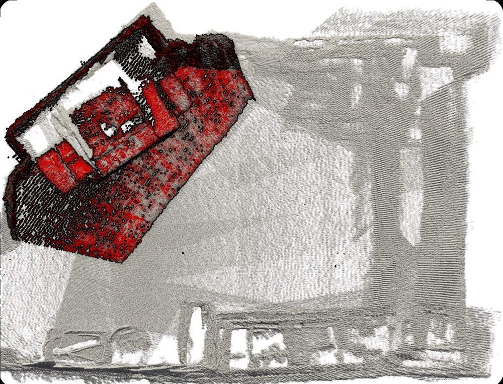
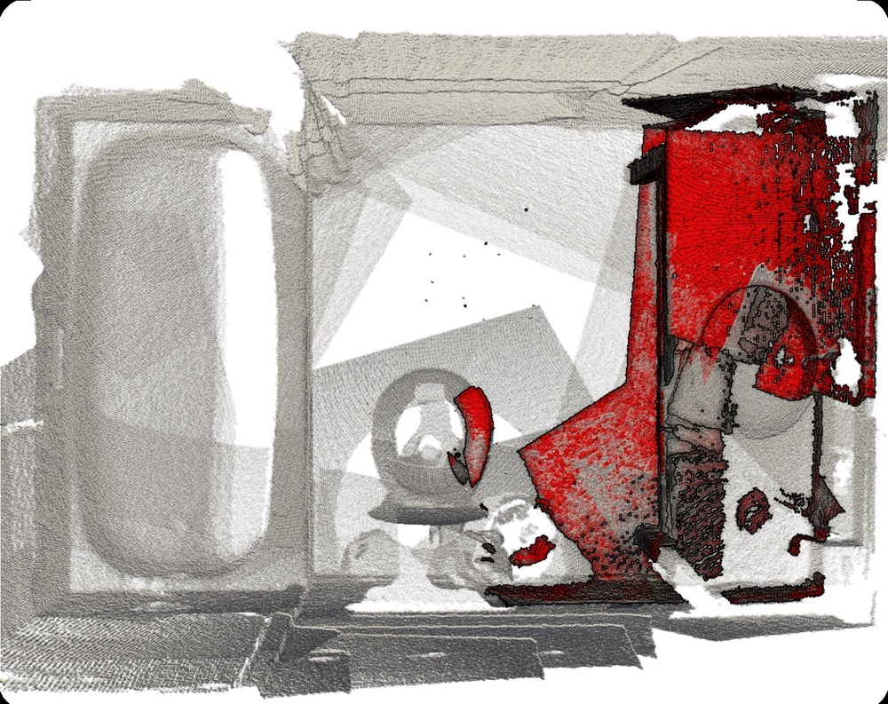
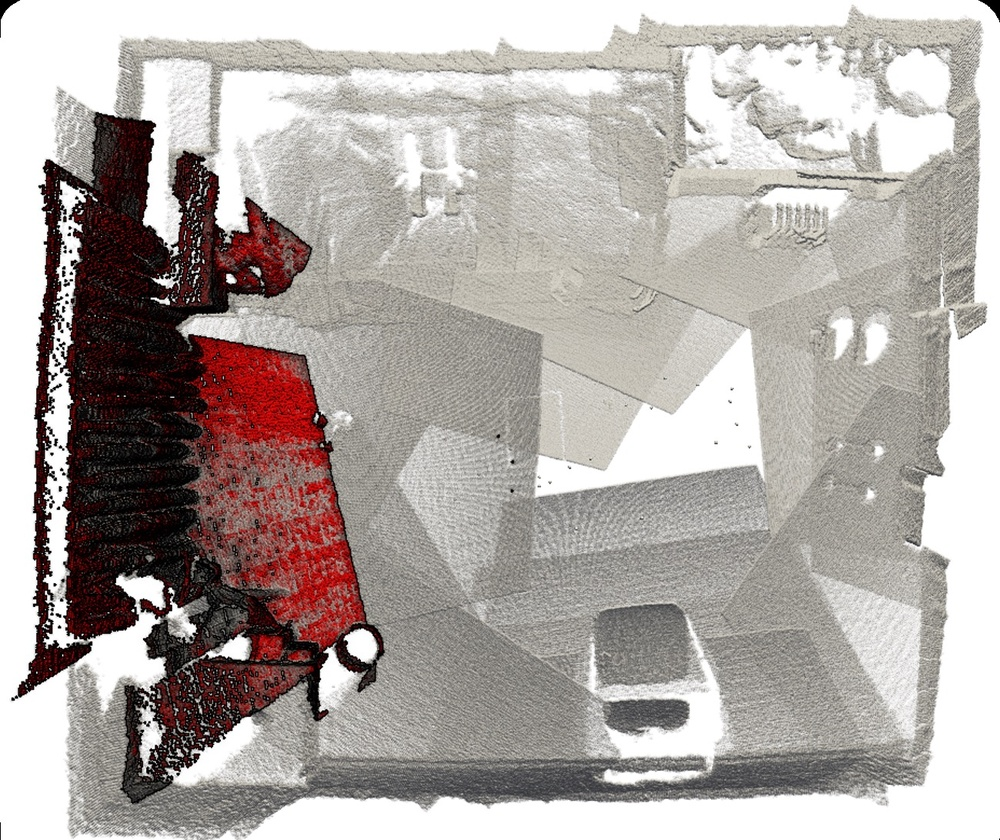
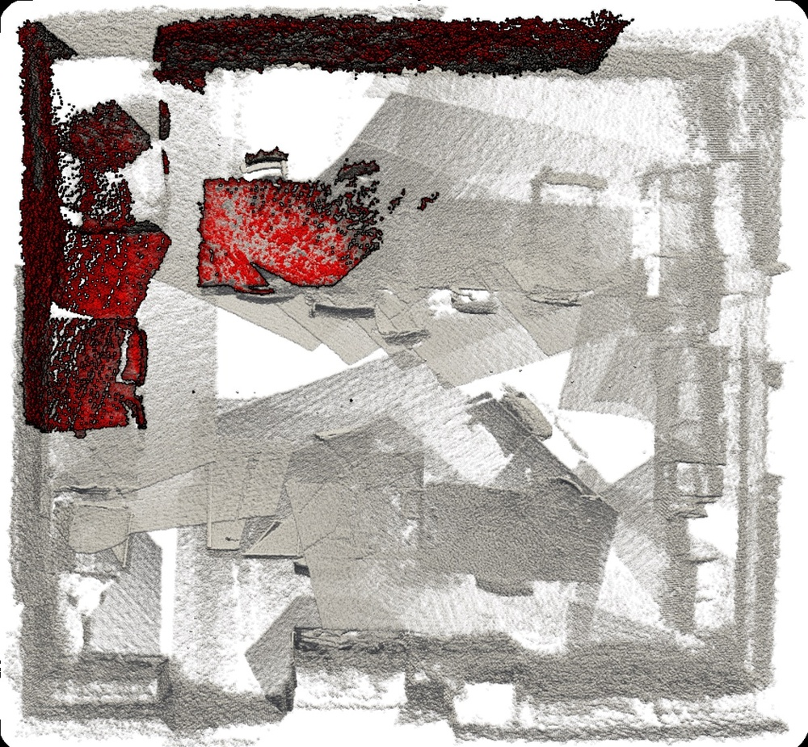
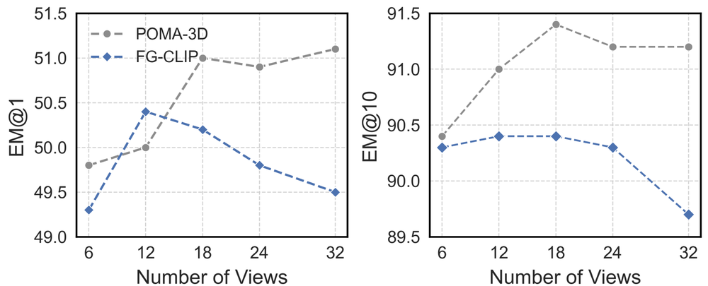
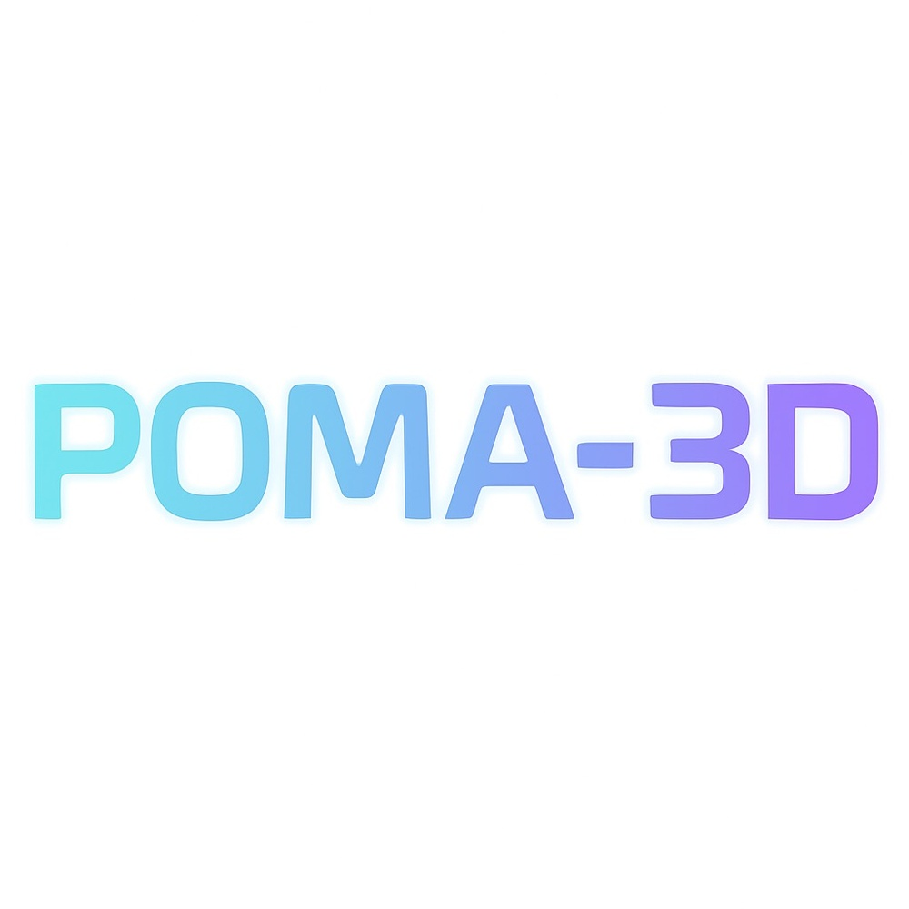
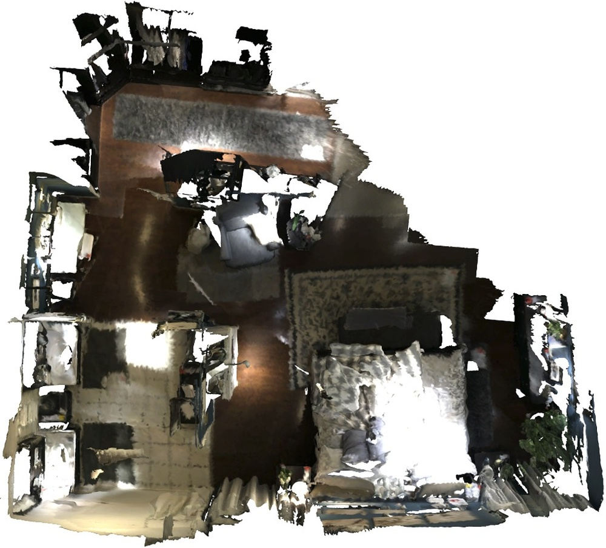
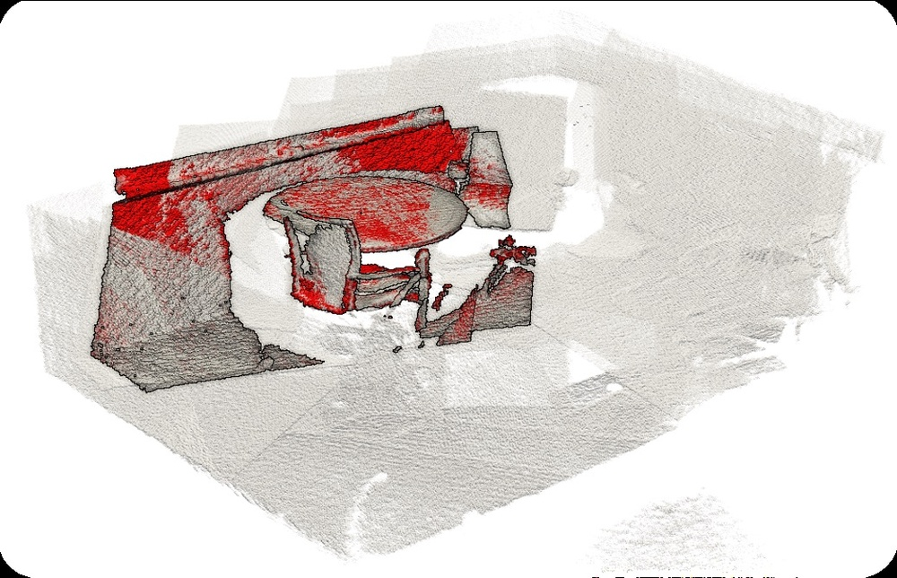

# POMA-3D: The Point Map Way to 3D Scene Understanding

**ArXiv ID**: 2511.16567v1
**URL**: http://arxiv.org/abs/2511.16567v1
**提交日期**: 2025-11-20
**作者**: Ye Mao; Weixun Luo; Ranran Huang; Junpeng Jing; Krystian Mikolajczyk
**引用次数**: NULL
使用模型: gemini-2.5-flash

## 1. 核心思想总结
这是一份基于提供的标题和摘要的简洁第一轮总结：

---

**标题：** POMA-3D: The Point Map Way to 3D Scene Understanding

**第一轮总结**

**Background (背景)**
*   三维场景理解和自监督三维表示学习是重要研究方向。
*   当前二维基础模型拥有丰富的预训练先验知识，但在三维领域缺乏类似资源。

**Problem (问题)**
*   三维表示学习面临预训练先验知识稀缺和数据有限的挑战。
*   难以有效将丰富的二维先验知识迁移到三维场景理解中。
*   点图（point map）本身存在视角依赖性，需要在多视角下保持几何一致性。

**Method (高层方法)**
*   **核心思想：** 引入 POMA-3D，一种基于点图（point map）的自监督三维表示模型。
*   **点图定义：** 点图在结构化二维网格上编码显式三维坐标，既保留全局三维几何信息，又与二维基础模型的输入格式兼容。
*   **2D先验迁移：** 设计了视图-场景对齐策略，以将丰富的二维先验知识迁移到 POMA-3D 中。
*   **几何一致性：** 针对点图的视角依赖性，提出了 POMA-JEPA（联合嵌入-预测架构），以确保多视角下点图特征的几何一致性。
*   **大规模预训练：** 构建了 ScenePoint 数据集（包含6.5K房间级RGB-D场景和1M二维图像场景），用于大规模 POMA-3D 预训练。

**Contribution (贡献)**
*   首次提出了基于点图的自监督三维表示模型 POMA-3D，为三维场景理解探索了一条新的“点图路径”。
*   有效解决了三维表示学习中预训练先验稀缺和数据有限的问题，并实现了2D先验知识向3D的有效迁移。
*   引入了视图-场景对齐策略和 POMA-JEPA 架构以处理点图特性和多视角一致性。
*   构建并发布了 ScenePoint 大规模点图数据集。
*   POMA-3D 作为强大的骨干网络，仅使用几何输入即可支持包括三维问答、具身导航、场景检索和具身定位在内的多种三维理解任务，展现了卓越的通用性和专业性。

---

## 2. 方法详解
好的，基于您提供的初步总结和对方法章节的理解，以下是对 POMA-3D 论文方法细节的详细阐述：

---

### POMA-3D: 基于点图的三维场景理解自监督学习方法

本节将详细阐述 POMA-3D 的核心方法，包括其创新的点图表示、用于多视角几何一致性的 POMA-JEPA 架构、以及将丰富二维先验知识迁移至三维的视图-场景对齐策略，并概述其整体预训练流程。

#### 1. 整体框架与关键创新 (Overall Framework & Key Innovations)

POMA-3D 是一种开创性的自监督三维表示学习模型，旨在通过引入“点图”这一新颖的数据表示形式，有效桥接二维和三维世界的鸿沟，从而将二维基础模型的强大能力迁移至三维场景理解。其整体框架围绕着**点图表示**、**多视角几何一致性学习（POMA-JEPA）**和**二维先验知识迁移（视图-场景对齐）**这三大核心支柱构建。

**关键创新点包括：**

1.  **点图（Point Map）表示：** 首次提出将三维信息编码在结构化二维网格中的点图，作为统一二维和三维数据、兼容二维基础模型输入的新范式。
2.  **POMA-JEPA (Joint Embedding-Predictive Architecture)：** 针对点图的视角依赖性，设计了基于几何投影的 JEPA 变体，通过预测不同视角下点图特征的几何一致性来学习鲁棒的三维表示。
3.  **视图-场景对齐策略：** 一套明确的策略，旨在将二维预训练模型中丰富的语义和视觉先验知识，高效、精准地迁移到三维点图表示的学习中。
4.  **ScenePoint 大规模数据集：** 为支撑大规模自监督预训练而构建的包含 RGB-D 场景和大量二维图像场景的综合性数据集。

#### 2. 点图表示 (Point Map Representation)

点图是 POMA-3D 方法的基础和核心创新。它解决了传统点云的无序性与图像的二维结构化表示之间的不兼容问题，同时保留了显式三维几何信息。

*   **定义与结构：** 点图是一个 $H \times W \times 3$ 的张量，可以被视为一张特殊的“图像”。其中，$H$ 和 $W$ 代表图像的高度和宽度，而每个“像素”位置 $(u, v)$ 存储的不是颜色信息，而是该像素在相机坐标系或世界坐标系下的**显式三维坐标 $(x, y, z)$**。
*   **生成方式：** 点图可以直接从深度图（Depth Map）结合相机内参生成。对于给定的深度图 $D(u, v)$ 和相机内参矩阵 $K$，每个像素 $(u, v)$ 的三维坐标 $(x, y, z)$ 可以通过反投影计算得到。
*   **优势：**
    *   **保留显式几何：** 每个“像素”直接编码了其对应的三维空间位置，避免了仅通过颜色或强度推断三维信息的模糊性。
    *   **结构化与致密性：** 作为二维网格，点图具有与普通图像相同的结构，可以直接作为标准二维卷积神经网络（CNN）或 Vision Transformer (ViT) 的输入，无需特殊的点云处理层。这使其能够直接受益于二维基础模型的强大架构和计算效率。
    *   **兼容二维先验：** 这种表示形式使得将预训练好的二维模型（如 CLIP、DINO）的知识迁移到三维成为可能，因为它们都处理类似的二维网格数据。

*   **挑战：** 尽管点图是结构化的，但它像传统的深度图一样，具有**视角依赖性**。同一个三维场景，从不同视角观察会生成完全不同的点图。这是 POMA-JEPA 需要解决的核心问题。

#### 3. POMA-JEPA：联合嵌入-预测架构 (Joint Embedding-Predictive Architecture for Point Maps)

POMA-JEPA 是 POMA-3D 中用于学习跨视角几何一致性表示的核心自监督学习范式。它借鉴了 JEPA 的思想，并通过融入三维几何投影，使其适应点图的视角依赖特性。

*   **目标：** 学习一个点图编码器，使其能够从不同视角的同一三维场景的点图中提取出具有几何一致性（即视角不变性）的鲁棒三维特征。
*   **架构组成：**
    1.  **在线编码器 (Online Encoder $f_\theta$)：** 一个参数 $\theta$ 的神经网络，接收点图输入，并输出其潜在嵌入（特征图）。
    2.  **目标编码器 (Target Encoder $f_\xi$)：** 一个参数 $\xi$ 的神经网络，结构与在线编码器相同，其参数 $\xi$ 通过在线编码器参数 $\theta$ 的指数移动平均 (Exponential Moving Average, EMA) 进行更新，提供稳定的学习目标。
    3.  **预测器 (Predictor $h_\phi$)：** 一个参数 $\phi$ 的小型神经网络，接收在线编码器的输出，并尝试预测目标编码器在另一视角下的输出。
*   **关键步骤与流程：**
    1.  **多视角采样：** 对于一个三维场景，随机采样其两个或多个不同视角的点图 $P_A$ 和 $P_B$，以及它们之间的相对相机姿态 $T_{AB}$。
    2.  **在线编码与目标编码：**
        *   将 $P_A$ 输入**在线编码器** $f_\theta$，得到特征嵌入 $E_A = f_\theta(P_A)$。
        *   将 $P_B$ 输入**目标编码器** $f_\xi$，得到目标特征嵌入 $T_B = f_\xi(P_B)$。
    3.  **几何投影与特征对齐：** 这是 POMA-JEPA 的**核心创新点**。为了在不同视角之间建立联系，模型不直接比较 $E_A$ 和 $T_B$。而是利用已知的相对相机姿态 $T_{AB}$，将 $E_A$ 投影到 $P_B$ 的视角空间中，得到投影后的特征 $E_{A \to B}$。这一步通常涉及三维点云的变换（将 $P_A$ 恢复为点云，变换，再投影回二维），或更高效地直接在特征图上进行基于深度和姿态的特征 warping。
    4.  **特征预测：** 将**投影后的在线特征** $E_{A \to B}$ 输入**预测器** $h_\phi$，得到预测的特征 $P_{AB} = h_\phi(E_{A \to B})$。
    5.  **损失计算：** 计算预测的特征 $P_{AB}$ 与目标特征 $T_B$ 之间的距离作为损失函数。常用的可以是 L2 距离或其他度量相似性的函数。
        $$ \mathcal{L}_{\text{JEPA}} = \lVert P_{AB} - T_B \rVert_2^2 $$
        通过最小化这个损失，模型被强制学习到即使从不同视角观察，其提取的特征在几何校准后也能保持一致性的三维表示。
    6.  **参数更新：** 在线编码器 $f_\theta$ 和预测器 $h_\phi$ 的参数通过反向传播进行更新；目标编码器 $f_\xi$ 的参数则通过 $f_\theta$ 的 EMA 更新，保证目标的稳定性。

这种设计使得 POMA-JEPA 能够有效地解决点图的视角依赖性问题，促使编码器学习到真正意义上的、对视角变化不敏感的、仅由三维几何本身决定的场景特征。

#### 4. 视图-场景对齐策略 (View-Scene Alignment Strategy)

为了将二维基础模型的丰富语义和视觉先验知识引入 POMA-3D，论文设计了视图-场景对齐策略。这弥补了三维领域预训练数据和先验知识的不足。

*   **目标：** 促使 POMA-3D 的点图编码器学习到的特征不仅具有几何一致性，而且与来自真实 RGB 图像的、由二维基础模型提取的特征在语义和视觉层面上保持一致。
*   **具体实现（推测，基于通用方法）：**
    1.  **多模态输入：** 对于每个三维场景，除了其点图 $P$ 之外，还会获取或生成其对应的真实 RGB 图像 $I$（或从点图渲染）。
    2.  **二维基础模型特征提取：** 使用一个预训练好的二维基础模型（如 CLIP 的图像编码器、DINO 的 ViT）对 RGB 图像 $I$ 进行编码，得到其二维特征 $F_{2D} = \text{FoundationModel}(I)$。
    3.  **对齐损失：** 设计一个辅助损失函数 $\mathcal{L}_{\text{Align}}$ 来鼓励 POMA-3D 点图编码器 $f_\theta$ 输出的特征 $E_P = f_\theta(P)$ 与二维基础模型提取的特征 $F_{2D}$ 相似。这可以通过多种方式实现：
        *   **对比学习 (Contrastive Learning)：** 将 $E_P$ 和 $F_{2D}$ 视为正样本对，与其他场景的特征视为负样本，使用 InfoNCE 损失进行训练。
        *   **知识蒸馏 (Knowledge Distillation)：** 将 $F_{2D}$ 视为“教师”的输出，指导 $E_P$ 的学习，例如通过 L2 损失或 Kullback-Leibler (KL) 散度。
        *   **跨模态匹配：** 训练一个小的投影头将 $E_P$ 投影到与 $F_{2D}$ 相同的特征空间，然后进行匹配。
    4.  **语义增强：** 这种对齐不仅作用于图像级特征，还可能作用于区域级或对象级特征，确保点图编码器能够理解图像中蕴含的丰富语义信息。

通过结合 POMA-JEPA 损失和视图-场景对齐损失，POMA-3D 能够在学习三维几何一致性的同时，也继承二维世界丰富的语义理解能力。

#### 5. 大规模预训练与数据集 (Large-Scale Pre-training & ScenePoint Dataset)

模型的强大性能离不开大规模的预训练。

*   **ScenePoint 数据集：** POMA-3D 预训练的基础。该数据集是一个大规模的、综合性的数据集，包含：
    *   **6.5K 房间级 RGB-D 场景：** 提供高质量的深度信息和颜色信息，是生成点图的直接来源。每个场景通常包含多视角的数据和对应的相机姿态信息。
    *   **1M 二维图像场景：** 来源于各种公开数据集，用于支持视图-场景对齐策略，提供丰富的二维先验知识。
*   **预训练流程：**
    1.  从 ScenePoint 数据集中采样一个三维场景。
    2.  为该场景生成或选择多个不同视角的点图 $P_A, P_B, \dots$ 和至少一个对应的 RGB 图像 $I$。
    3.  根据 POMA-JEPA 架构，计算几何一致性损失 $\mathcal{L}_{\text{JEPA}}$。
    4.  根据视图-场景对齐策略，计算二维先验知识迁移损失 $\mathcal{L}_{\text{Align}}$。
    5.  总损失 $\mathcal{L}_{\text{Total}} = \mathcal{L}_{\text{JEPA}} + \lambda \mathcal{L}_{\text{Align}}$ （其中 $\lambda$ 是平衡权重）。
    6.  通过优化器更新在线编码器和预测器的参数。
    7.  重复上述步骤，直到模型收敛，学习到一个具有强大三维表示能力的 POMA-3D 编码器。

#### 6. 下游任务应用 (Downstream Task Applications)

经过大规模预训练的 POMA-3D 编码器，其学习到的三维表示可以作为强大的骨干网络，应用于多种三维场景理解任务。通常，这只需要在预训练的编码器之上添加一个轻量级的任务特定头部 (head) 进行微调。

*   **三维问答 (3D Question Answering)**
*   **具身导航 (Embodied Navigation)**
*   **场景检索 (Scene Retrieval)**
*   **具身定位 (Embodied Localization)**

在这些任务中，POMA-3D 编码器负责从点图输入中提取丰富的、视角不变且语义感知的特征，极大地简化了下游任务模型的学习难度和数据依赖性。

---

通过上述详细的方法阐述，可以看出 POMA-3D 如何通过创新性地结合点图表示、几何感知的自监督学习范式和二维先验知识迁移策略，为三维场景理解提供了一个强大而通用的解决方案。

## 3. 最终评述与分析
好的，结合您提供的初步总结和方法详述，以下是对 POMA-3D 的最终综合评估：

---

### POMA-3D: The Point Map Way to 3D Scene Understanding 最终综合评估

**1) Overall Summary (总体概述)**

POMA-3D 提出了一种创新性的自监督三维表示学习框架，旨在解决三维领域预训练先验知识稀缺和数据标注昂贵的核心挑战。其核心在于引入了**点图（Point Map）**这一新颖的数据表示形式——一种在结构化二维网格上编码显式三维坐标的张量。点图巧妙地桥接了二维图像的结构化优势和三维场景的几何信息，使其能够兼容现有的强大二维基础模型。

该框架包含两大关键机制：
1.  **POMA-JEPA (Joint Embedding-Predictive Architecture)**：通过设计一种基于几何投影的联合嵌入-预测架构，有效解决了点图固有的视角依赖性问题，促使模型学习到真正的视角不变且几何一致的三维场景表示。
2.  **视图-场景对齐策略（View-Scene Alignment Strategy）**：利用二维基础模型（如 CLIP、DINO）的丰富语义和视觉先验知识，将其高效迁移到三维点图的学习中，从而弥补了三维语义理解的不足。

POMA-3D 在大规模 ScenePoint 数据集上进行预训练，作为一个强大的三维骨干网络，仅依靠几何输入即可在包括三维问答、具身导航、场景检索和具身定位在内的多种下游任务中展现出卓越的通用性和专业性，为三维场景理解开辟了一条新的“点图路径”。

**2) Strengths (优势)**

*   **创新性的点图表示：** POMA-3D 最显著的优势在于引入了“点图”这一革命性的三维数据表示。它将三维几何信息编码在结构化的二维网格中，既保留了显式三维坐标，又使其能够直接作为标准二维神经网络（如 CNN、ViT）的输入，从而有效利用了二维领域成熟的模型架构和计算效率。
*   **有效融合2D与3D先验：** 通过“视图-场景对齐策略”，POMA-3D 成功将二维基础模型中丰富的语义和视觉先验知识迁移到三维学习中，极大地弥补了三维领域预训练数据和先验知识不足的短板，实现了跨模态知识的高效利用。
*   **鲁棒的几何一致性学习：** POMA-JEPA 架构是解决点图视角依赖性的关键。通过引入几何投影和跨视角特征预测，它能迫使模型学习到真正意义上的、对视角变化不敏感的三维几何特征，确保了表示的鲁棒性。
*   **自监督学习范式：** 采用自监督学习，显著减少了对昂贵且耗时的三维数据标注的依赖，使得模型能够在大规模未标注数据上进行预训练。
*   **强大的通用性与下游任务表现：** 经过预训练的 POMA-3D 编码器可以作为多功能骨干网络，在多种三维理解任务（如 3D QA、具身导航、场景检索）中表现出色，尤其在仅使用几何输入的情况下仍能取得优异成绩，这证明了其学习到的特征具有深厚的几何和语义理解能力。
*   **大规模数据集支持：** 构建并开源了 ScenePoint 大规模数据集，为三维视觉研究社区提供了宝贵的资源，并支持了 POMA-3D 的大规模预训练，是模型成功的基石之一。

**3) Weaknesses / Limitations (劣势 / 局限性)**

*   **对深度数据质量的依赖：** 点图直接来源于深度图。因此，深度传感器的精度、噪声、缺失值以及视角遮挡等问题将直接影响点图的质量，进而可能限制 POMA-3D 的性能和在真实世界复杂场景中的鲁棒性。
*   **计算资源需求：** 大规模预训练（在 ScenePoint 数据集上，包含 6.5K RGB-D 场景和 1M 二维图像）需要巨大的计算资源和时间投入，这对于资源有限的研究者来说可能是一个挑战。POMA-JEPA 中涉及的几何投影和特征 warping 操作也可能增加计算复杂度。
*   **点图表示的固有视角依赖性：** 尽管 POMA-JEPA 旨在学习视角不变的特征，但点图作为一种基于视角的深度图衍生表示，其本身仍然具有视角依赖性。这意味着对于极端视角变化或部分观察，模型可能仍需付出额外的努力来维持几何一致性，而非从根本上消除输入表示的局部性。
*   **潜在的环境泛化性：** ScenePoint 数据集主要包含“房间级 RGB-D 场景”。POMA-3D 在预训练中可能更侧重于室内环境的特征学习。其在室外、无序、开放或包含高度动态元素的场景中的泛化能力可能需要进一步验证。
*   **对2D基础模型的依赖性：** 视图-场景对齐策略的有效性高度依赖于所选二维基础模型的性能和其所含先验知识的质量。如果基础模型本身存在偏差或不足，这可能会传递到 POMA-3D 中。
*   **对明确相机姿态的需求：** POMA-JEPA 的几何投影需要精确的相机内参和外参（相对姿态）来对齐不同视角的特征。在某些真实世界应用中，获取高精度的相机姿态可能具有挑战性。

**4) Potential Applications / Implications (潜在应用 / 影响)**

*   **机器人与具身智能：** POMA-3D 可以作为机器人实现高级场景理解的核心模块，赋能更智能的具身导航、物体抓取、人机交互以及环境感知，使其在未知环境中更自主地执行任务。
*   **增强现实（AR）/ 虚拟现实（VR）：** 提升 AR/VR 应用中的场景理解能力，实现更精确的虚拟物体放置、环境重建和用户与虚拟世界的自然交互，创造更沉浸式的体验。
*   **智能家居与智慧城市：** 用于构建智能环境感知系统，实现空间布局理解、用户行为分析、安全监控以及能耗优化等应用。
*   **三维内容生成与编辑：** 辅助从真实世界数据中自动化生成和编辑三维模型，简化三维资产的创建流程，降低内容生产成本。
*   **自动驾驶与高精地图：** 虽然论文侧重于室内，但其点图表示和几何一致性学习的原理可以推广到自动驾驶领域，用于车辆周围环境的实时三维感知、高精地图构建与更新，特别是在几何特征理解方面。
*   **三维视觉领域的基础模型：** POMA-3D 有潜力成为三维视觉领域的“基础模型”之一，类似于 NLP 中的 BERT/GPT 或 2D 视觉中的 CLIP/DINO，为后续的各种三维任务提供强大的通用特征提取能力，加速三维领域的研究和应用发展。
*   **推动多模态学习研究：** POMA-3D 成功地将 2D 和 3D 信息有效结合，为未来的多模态（如 文本-图像-3D）融合学习提供了新的思路和范例。

---

---

# 附录：论文图片

## 图 1

## 图 2

## 图 3

## 图 4

## 图 5

## 图 6

## 图 7

## 图 8

## 图 9

## 图 10

