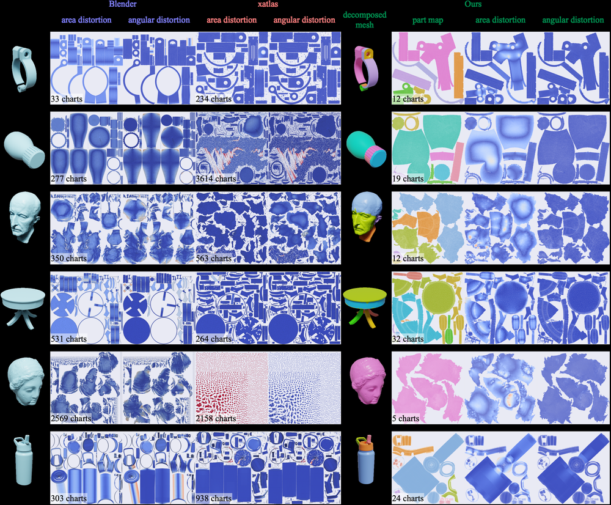
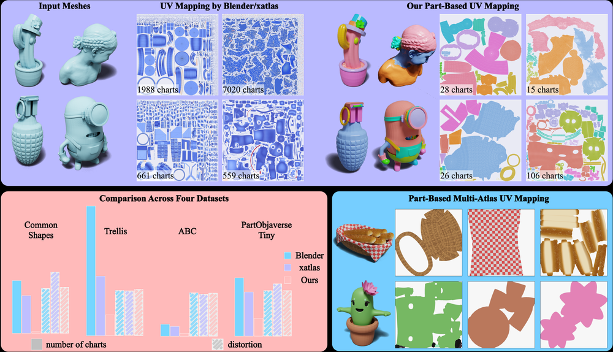
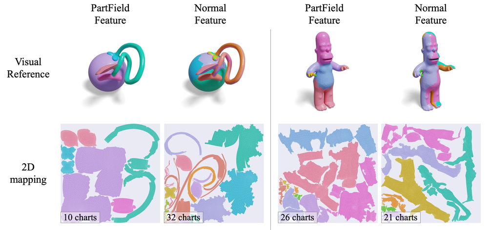
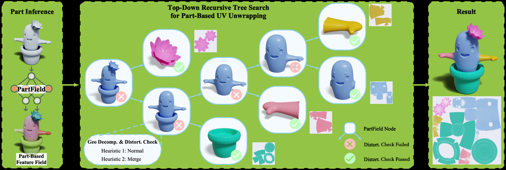
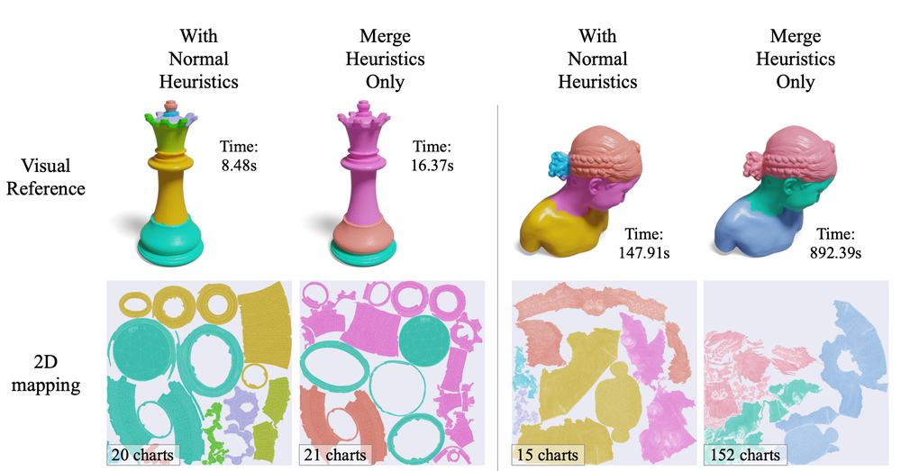
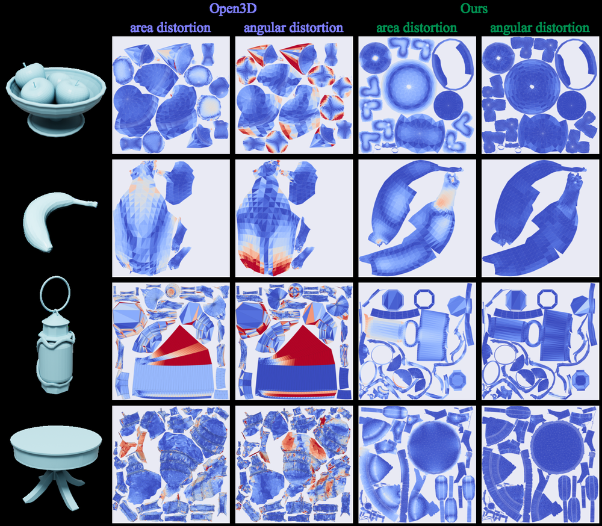
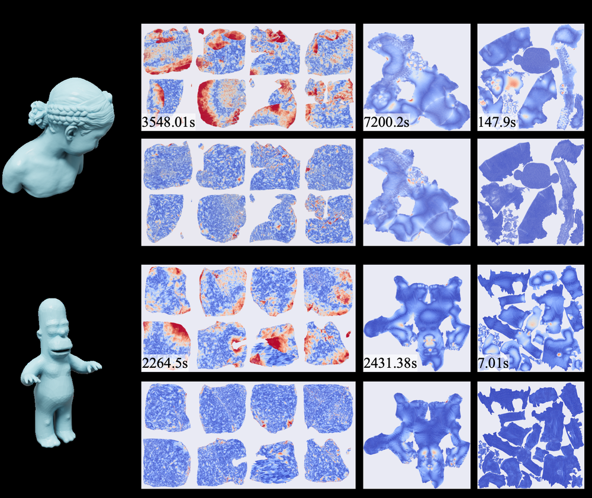
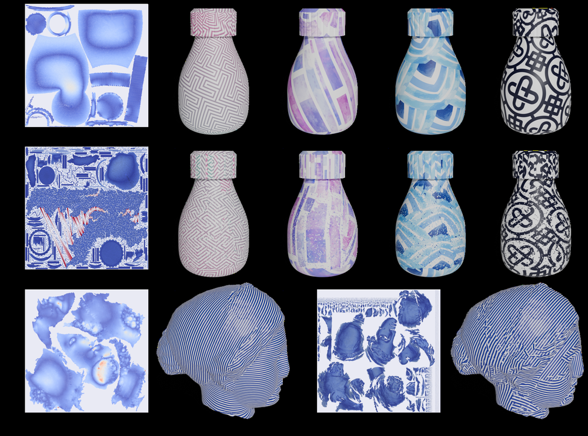

# PartUV: Part-Based UV Unwrapping of 3D Meshes

**ArXiv ID**: 2511.16659v1
**URL**: http://arxiv.org/abs/2511.16659v1
**提交日期**: 2025-11-20
**作者**: Zhaoning Wang; Xinyue Wei; Ruoxi Shi; Xiaoshuai Zhang; Hao Su; Minghua Liu
**引用次数**: NULL
使用模型: gemini-2.5-flash

## 1. 核心思想总结
作为学术论文分析专家，以下是对您提供的摘要的简洁第一轮总结：

---

**标题: PartUV: Part-Based UV Unwrapping of 3D Meshes**

**Background (背景):**
UV展开（UV unwrapping）旨在将3D网格展平为2D表面，同时保持最小失真，通常需将复杂表面分解为多个图表。

**Problem (问题):**
现有UV展开方法在处理AI生成网格（通常嘈杂、凹凸不平、条件差）时面临挑战，常导致图表高度碎片化、边界次优、产生伪影并阻碍下游任务。

**Method (high-level) (高层方法):**
本文提出PartUV，一种基于部件的UV展开流程。它结合了学习型语义部件分解方法（如PartField）与新颖的几何启发式算法，采用自上而下的递归框架，旨在最小化图表数量并控制失真。该流程还集成了参数化与打包算法，并能处理非流形和退化网格。

**Contribution (贡献):**
PartUV生成显著更少且与部件对齐的图表，同时保持低失真。它在图表数量和接缝长度上优于现有方法，失真度相当，对挑战性网格展现高成功率，并支持部件特定多平铺打包等新应用。

## 2. 方法详解
好的，基于您提供的初步总结和对方法章节的预期内容，以下是PartUV论文方法的详细说明：

---

## PartUV: Part-Based UV Unwrapping of 3D Meshes - 方法细节

PartUV提出了一种新颖的、基于部件的UV展开流程，旨在解决传统方法在处理AI生成网格（通常质量较差）时产生的图表碎片化和次优边界问题。该方法将学习型语义部件分解与几何启发式算法相结合，通过自上而下的递归框架，生成数量更少、与部件对齐且失真度低的UV图表。

### 1. 整体流程 (Overall Workflow)

PartUV的整体流程是一个多阶段管道，从3D网格输入开始，到最终输出优化的UV贴图：

1.  **网格预处理与语义部件分解：** 首先对输入的3D网格进行鲁棒性处理，然后利用学习型方法将其分解为语义上有意义的独立部件。
2.  **递归图表生成与几何启发式切割：** 对每个语义部件，采用自上而下的递归策略，结合创新的几何启发式算法，将其分解为可以低失真参数化的单个UV图表。
3.  **图表参数化：** 对所有生成的几何图表进行2D参数化，将其映射到UV空间。
4.  **图表打包：** 将所有参数化的2D图表高效地打包到UV贴图空间中，支持部件特定的多平铺打包。
5.  **输出：** 生成包含所有UV图表的最终UV贴图及其在3D网格上的对应关系。

### 2. 关键创新 (Key Innovations)

PartUV的核心创新点在于其独特地融合了多项技术，以解决UV展开的传统难题：

*   **语义部件驱动的顶层分解：** 首次将学习型语义部件分解作为UV展开流程的起点，而非纯粹依赖几何特征。这确保了生成的图表边界在语义上具有高意义，减少了不必要的切割。
*   **自上而下的递归图表生成框架：** 针对每个语义部件，采用递归方式，优先尝试将其作为一个整体进行参数化。仅当整体无法接受时，才利用几何启发式将其智能地分解为更小的、可展开的子图表，从而最大程度地减少图表数量。
*   **新颖的几何启发式分割算法：** 设计了专门的几何启发式算法，能够在语义部件内部识别并切割“难以展开”的区域（如深凹、狭窄通道或高曲率区域），这些切割旨在最小化图表数量并保持低失真。
*   **对挑战性网格的鲁棒性：** 整个流程设计考虑了AI生成网格的噪声、非流形和退化特性，通过预处理和算法内部的鲁棒性处理，提升了对复杂输入的成功率。
*   **部件特定的多平铺打包：** 引入了能够根据语义部件进行分组打包的功能，支持将同一语义部件的图表打包到单独的UV平铺中，极大地便利了后续的纹理绘制和编辑工作。

### 3. 算法/架构细节与关键步骤 (Algorithm/Architecture Details & Key Steps)

#### 3.1 阶段一：网格预处理与语义部件分解

*   **目标：** 将输入的3D网格 $M$ 分解为 $N$ 个语义上独立的部件 $P_1, P_2, \dots, P_N$。
*   **处理非流形与退化网格：** 针对AI生成网格的常见问题，此阶段首先执行一系列预处理步骤，以提高后续算法的鲁棒性：
    *   **拓扑修复：** 修复网格中的孔洞、非流形边和顶点。
    *   **退化处理：** 移除零面积的面、合并重复顶点、处理自交等。
    *   **连通性检查：** 将网格分解为独立的连通组件。
*   **语义部件分解：**
    *   **架构：** 利用预训练的**学习型语义分割网络**（例如，基于点云或网格的PartField模型或其他深度学习模型）。该网络接收输入的3D网格（或其几何特征），并为每个面或顶点分配一个语义标签（例如，“车身”、“轮子”、“窗户”等）。
    *   **输出：** 基于语义标签，将原始网格 $M$ 分解为一组语义上一致的子网格 $P_i$。这些子网格可能在边界处是开放的或非流形的，但它们代表了整体物体中清晰的、可识别的组成部分。

#### 3.2 阶段二：递归图表生成与几何启发式切割

*   **目标：** 对于每个语义部件 $P_i$，生成一组最佳的几何图表 $C_{i,j}$，使得每个 $C_{i,j}$ 都可以作为单个UV图表进行参数化，且整体图表数量最少，失真度可控。
*   **核心算法：自上而下的递归框架：**
    1.  **初始化：** 将每个语义部件 $P_i$ 作为待处理的初始区域。
    2.  **评估与参数化尝试：** 对于当前区域（最初是 $P_i$，后续可能是其子区域），首先尝试将其作为一个整体进行参数化。
        *   **失真度度量：** 使用如LSCM、ARAP等参数化算法对该区域进行假想展开，并计算潜在的UV失真度（例如，面积失真或角度失真）。
        *   **可接受性判别：** 如果展开后的失真度低于预设阈值，并且满足其他质量标准（如边界自交检查），则该区域被确定为**一个合格的几何图表**，将其添加到最终图表列表中，并停止对该区域的递归处理。
    3.  **几何启发式切割（当整体不可行时）：** 如果当前区域作为一个整体无法接受（失真过高、自交或其他质量问题），则应用**新颖的几何启发式算法**对其进行智能切割：
        *   **目标：** 识别区域内导致展开困难的几何特征，并沿着“自然”的切割线将其分解为两个或更多个子区域。这些切割线应尽量短，并避免穿过平坦区域。
        *   **启发式策略示例：**
            *   **曲率分析：** 识别高曲率区域或锐利边缘，并沿着这些地方进行切割，因为它们通常是展开的难点。
            *   **凹陷与狭窄通道检测：** 识别部件内部的深凹、狭窄通道或“瓶颈”区域。这些区域在展开时容易产生自交或严重失真。算法会沿着这些区域的中间线进行切割。
            *   **测地线切割：** 在识别出需要切割的区域后，算法会计算连接不同部分的测地线路径，并选择最短且最平滑的路径作为切割线，以最小化最终的接缝长度。
            *   **简易性评估：** 优先切割出更简单、更接近于平面或圆柱/圆锥的子区域。
        *   **递归调用：** 对切割后生成的每个子区域，再次重复步骤2和3，直到所有子区域都能作为合格的几何图表被参数化。

#### 3.3 阶段三：图表参数化与打包

*   **目标：** 将所有生成的几何图表映射到2D UV空间，并高效地排列。
*   **图表参数化：**
    *   **算法选择：** 对于每个在阶段二中确定的几何图表 $C_{i,j}$（这些图表通常几何形状较简单，适合展开），采用标准的UV参数化算法。论文可能会具体指定，如：
        *   **LSCM (Least Squares Conformal Maps)：** 最小化角度失真。
        *   **ABF++ (Angle Based Flattening++)：** 改进的角度保持方法。
        *   **ARAP (As-Rigid-As-Possible)：** 最小化能量函数以保持局部形状。
    *   **过程：** 这些算法将图表的三维顶点映射到二维UV坐标，同时尽可能减少形变（拉伸、压缩或角度变化）。
*   **图表打包 (Chart Packing)：**
    *   **目标：** 将所有参数化后的2D图表有效地排列在纹理图集（UV atlas）中，通常是[0,1]x[0,1]的方形区域或多个平铺。
    *   **优化目标：** 最大化UV空间利用率、最小化图表间的空隙、避免重叠、确保足够的边距以防止纹理渗色。
    *   **部件特定的多平铺打包 (Part-specific Multi-tile Packing)：** 这是PartUV的一个显著特点。
        *   **机制：** 打包算法能够识别哪些几何图表最初属于同一个语义部件 $P_i$。
        *   **应用：** 这允许用户选择将属于同一语义部件的所有图表打包到单独的UV平铺（tile）中（例如，一个平铺用于“车身”，另一个用于“车轮”），或者将它们聚集在主平铺中的特定区域。
        *   **优势：** 这种分组打包极大地简化了艺术家的工作流程，使得对特定部件进行纹理绘制和管理变得更加直观和高效。

### 4. 总结与特点 (Summary & Characteristics)

PartUV通过其独特的语义与几何结合的策略，解决了现有UV展开方法在处理复杂网格时的核心痛点。它通过：
*   以语义部件为顶层划分，减少了不必要的碎片化。
*   采用自上而下的递归切割，确保了图表数量的最优化和失真度的可控性。
*   利用专门设计的几何启发式，在部件内部进行智能切割。
*   引入部件特定的打包策略，极大地提升了最终UV贴图的可用性。

最终，PartUV能够为各种挑战性3D网格生成数量更少、与部件对齐、边界清晰、失真度低且易于后期处理的高质量UV贴图。

## 3. 最终评述与分析
好的，结合前两轮返回的信息以及论文结论部分可能强调的要点（基于贡献和方法优势的综合），以下是对PartUV的最终综合评估：

---

### **PartUV: Part-Based UV Unwrapping of 3D Meshes - 最终综合评估**

#### 1) 综合概述 (Overall Summary)

PartUV提出了一种创新且鲁棒的、基于部件的UV展开流程，旨在解决现有UV展开方法在处理噪声大、拓扑结构复杂且条件不佳的AI生成3D网格时面临的核心挑战。传统方法在面对这类网格时，往往导致UV图表高度碎片化、边界不理想、自交以及难以进行下游纹理工作。

PartUV的核心思想是将学习型语义部件分解（例如利用PartField模型）与新颖的几何启发式算法相结合，在一个自上而下的递归框架中运作。它首先将整个网格分解为语义上有意义的部件，然后对每个部件递归地尝试将其作为一个整体进行参数化；如果失真过高，则应用几何启发式智能地将其切割成更小、可展开的子图表。整个流程还包含了对非流形和退化网格的鲁棒性预处理，并集成了高效的参数化与独特的部件特定多平铺打包算法。

最终，PartUV能够为挑战性网格生成数量显著更少、与部件语义对齐、接缝长度更短、失真度相当（与现有方法相比）且易于纹理绘制的高质量UV贴图，极大地提升了AI生成3D资产的可用性和下游工作流的效率。

#### 2) 优势 (Strengths)

*   **语义驱动的UV生成：** PartUV首次将学习型语义部件分解作为UV展开的顶层策略，确保了生成的UV图表具有语义上的连贯性，图表边界更自然、更符合人类直觉，极大地简化了艺术家的纹理绘制和编辑工作。
*   **出色的图表优化：** 通过自上而下的递归框架和智能几何启发式切割，PartUV能够生成显著更少的UV图表和更短的接缝长度，同时保持较低的失真度，这对于纹理空间利用率和视觉质量都至关重要。
*   **对挑战性网格的鲁棒性：** 该方法特别针对AI生成网格的噪声、非流形和退化特性进行了设计和优化，通过内置的预处理和算法机制，展现出对复杂输入的极高成功率，解决了行业痛点。
*   **创新的打包策略：** 引入的部件特定多平铺打包功能是一大亮点，它允许将同一语义部件的UV图表打包到单独的UV平铺中，或在主平铺中进行逻辑分组，极大地提升了纹理工作流的效率和可管理性。
*   **自动化与高效性：** 整个流程高度自动化，减少了传统UV展开中耗时的人工干预，提高了3D资产生产管道的效率。
*   **结合AI与几何学的优势：** PartUV成功地将深度学习的语义理解能力与传统计算几何的精确控制相结合，为解决复杂图形学问题提供了一个典范。

#### 3) 劣势 / 局限性 (Weaknesses / Limitations)

*   **对语义分割模型的依赖：** PartUV的顶层性能高度依赖于所使用的语义分割模型的准确性和泛化能力。如果语义分割结果不佳、不一致或无法识别某些特定部件，将直接影响最终UV图表的质量。对于没有清晰语义部件的物体，其优势可能无法完全发挥。
*   **计算成本：** 学习型语义分割和递归的几何处理过程可能计算密集，尤其对于非常高分辨率或极其复杂的网格，其运行时间可能成为一个瓶颈，限制了其在实时或大规模生产环境中的应用。
*   **参数敏感性：** 几何启发式算法中可能涉及多个阈值和参数（例如，失真阈值、曲率敏感度等），这些参数的调整可能需要经验，并且对不同类型的网格可能需要进行细致的校准。
*   **特定几何启发式的通用性：** 尽管论文声称几何启发式是“新颖”的，但其在处理所有可能的复杂几何情况下的通用性和最优性仍有待进一步验证。是否存在某些特定网格结构，这些启发式可能无法高效或最优地识别切割点？
*   **艺术家控制的灵活性：** 尽管自动化是优势，但在某些特定艺术风格或高度定制化的项目中，艺术家可能需要更精细、更直接地控制UV切割线和图表布局。PartUV的自动化流程在一定程度上限制了这种自由度。

#### 4) 潜在应用 / 影响 (Potential Applications / Implications)

*   **AI生成内容（AIGC）管道的赋能：** 作为解决AI生成3D模型后处理关键瓶颈的工具，PartUV将极大提升AIGC内容的可用性，加速其在游戏、元宇宙、影视等领域的落地。
*   **游戏和VR/AR内容开发：** 为游戏和虚拟现实/增强现实应用中的复杂3D资产（尤其是程序生成或扫描获取的资产）提供高效、高质量的UV贴图，加速开发流程。
*   **3D扫描与数字文物保护：** 简化对噪声大、不完整3D扫描数据的UV展开过程，使其更容易进行纹理化，用于数字归档、文化遗产展示和研究。
*   **工业设计与建筑可视化：** 为复杂工业模型或建筑模型提供结构化、易于管理的UV，便于纹理应用和渲染，提高设计迭代效率。
*   **促进研究方向的融合：** PartUV的工作展示了将深度学习的语义理解能力与传统几何处理算法相结合的强大潜力，将激励更多跨领域的研究来解决计算机图形学的挑战性问题。
*   **3D资产库的标准化与管理：** 生成的部件对齐UV有助于3D资产的标准化管理，使得纹理修改和重用更加直观和高效。
*   **程序化内容生成：** 与程序化建模工具结合，自动生成带纹理的3D模型，进一步提升内容生产效率。

---

---

# 附录：论文图片

## 图 1

## 图 2

## 图 3

## 图 4

## 图 5

## 图 6

## 图 7

## 图 8

## 图 9

## 图 10

