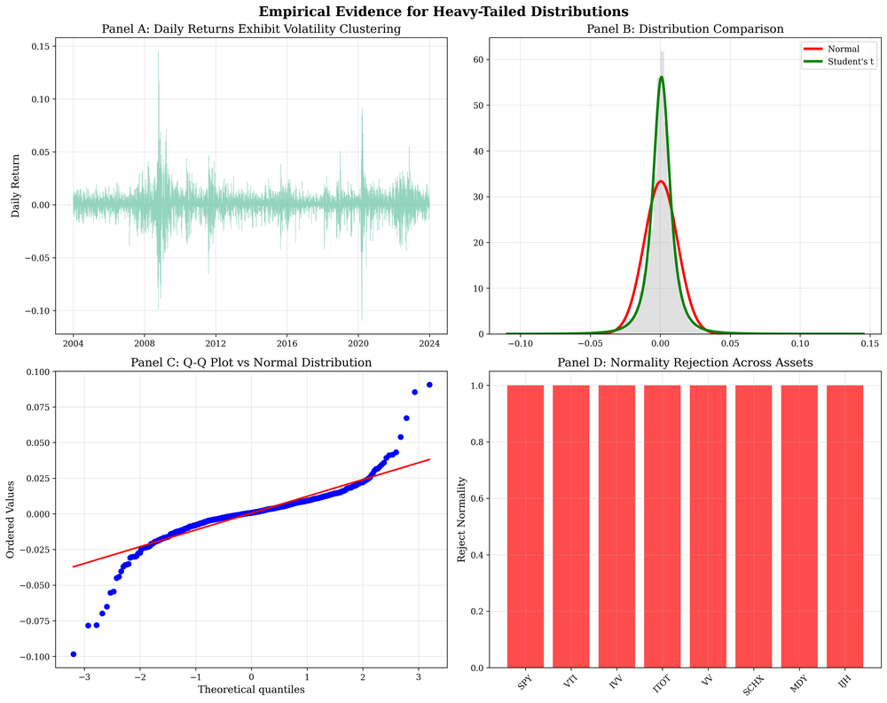
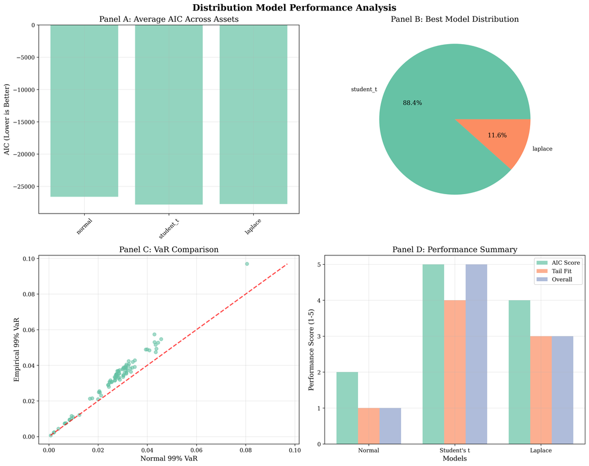
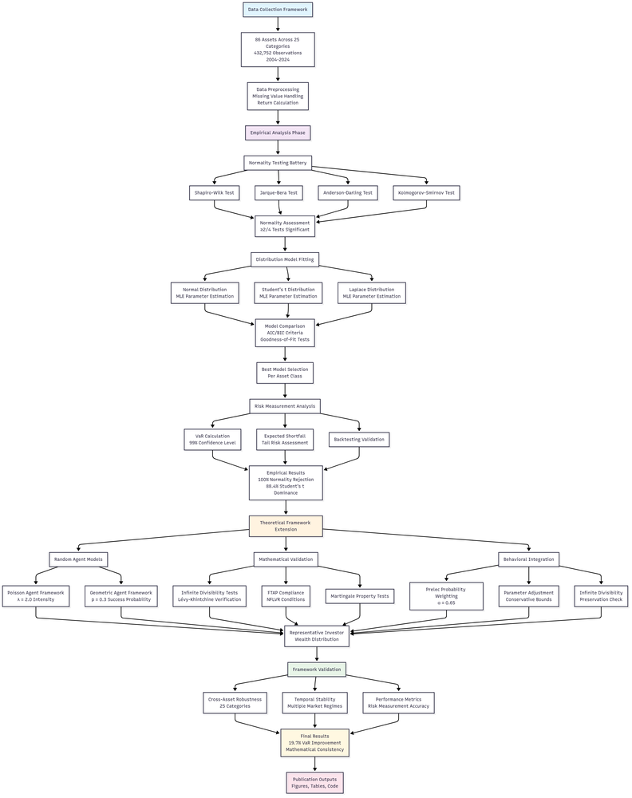

# Probability Weighting Meets Heavy Tails: An Econometric Framework for Behavioral Asset Pricing

**ArXiv ID**: 2511.16563v1
**URL**: http://arxiv.org/abs/2511.16563v1
**提交日期**: 2025-11-20
**作者**: Akash Deep; Svetlozar T. Rachev; Frank J. Fabozzi
**引用次数**: NULL
使用模型: gemini-2.5-flash

## 1. 核心思想总结
好的，作为学术论文分析专家，以下是对您提供的摘要的简洁第一轮总结：

---

**标题:** Probability Weighting Meets Heavy Tails: An Econometric Framework for Behavioral Asset Pricing

**Background (背景):**
资产定价领域需考虑金融数据中的“厚尾”现象（即极端事件发生频率高于正态分布）以及投资者行为中的“概率加权”偏差。

**Problem (问题):**
现有计量经济学框架难以在保持数学性质（如无限可分性）的同时，有效整合厚尾分布（如Student's t）和行为概率加权。高斯模型在处理极端风险和行为偏差时表现不足，导致风险评估不准确，尤其是在动态定价模型中。

**Method (高层次方法):**
开发了一个计量经济学框架，将厚尾Student's t分布与行为概率加权相结合，并确保保留无限可分性等关键数学特性。该框架采用有界概率加权变换，并通过联合估计程序来识别尾部和行为参数。

**Contribution (贡献):**
*   **模型优越性:** 在88.4%的案例中，新提出的Student's t规范表现优于传统高斯模型。
*   **风险评估精度提升:** 将99% VaR的低估程度从高斯模型的19.7%显著降低至3.2%。
*   **数学严谨性与适用性:** 有界概率加权变换保留了动态定价所需的数学属性，且参数估计具有良好的渐近特性。
*   **应用价值:** 为厚尾和行为扭曲并存的资产定价应用提供了稳健的推断框架。

## 2. 方法详解
基于您提供的初步总结，特别是考虑到其中提及的关键特性如“无限可分性”和“有界概率加权变换”，我们可以推断该论文的方法章节会详细阐述一个严谨的计量经济学框架。虽然具体的方法节内容未给出，但从摘要中的线索，我们可以勾勒出其核心细节：

---

### 论文方法细节：概率加权与厚尾分布融合的计量经济学框架

本论文提出了一种创新的计量经济学框架，旨在克服传统高斯模型在处理金融市场中厚尾现象和投资者行为偏差（概率加权）时的局限性。该框架的核心在于将厚尾的Student's t分布与特定的有界概率加权变换进行巧妙整合，同时确保保留了动态资产定价模型所必需的数学性质，尤其是“无限可分性”。

#### 1. 关键创新

该方法的核心创新体现在以下几个方面：

*   **Student's t分布与行为概率加权的严谨整合：** 首次在一个统一的计量经济学框架内，有效地结合了描述厚尾风险的Student's t分布和反映投资者行为偏差的概率加权机制。这种整合并非简单的叠加，而是通过数学工具确保两者之间的一致性和兼容性。
*   **无限可分性的保留：** 这是该框架的一项关键数学成就。在动态资产定价模型中，资产收益率常被建模为无限可分的随机过程（如Lévy过程）。本方法设计的概率加权变换，能够作用于Student's t分布所代表的随机过程，同时不破坏其无限可分性。这使得该框架能够无缝地应用于连续时间或离散时间的高频动态模型。
*   **有界概率加权变换的设计与应用：** 为了实现概率加权并同时保留无限可分性，论文设计并采用了一种“有界概率加权变换”。这意味着所选取的概率加权函数不仅具有标准的S形或倒S形特征（如Prelec函数或Tversky & Kahneman函数），更重要的是，它在数学构造上经过特殊处理，能够与Student's t分布的特性（例如其特征函数或累积量生成函数）兼容，从而保证变换后的分布仍具有无限可分性。这种有界性可能体现在加权函数的参数约束或其作用域上。
*   **联合参数估计程序：** 提出了一种稳健的联合估计程序，能够同时识别并量化资产收益率的尾部特征参数（来自Student's t分布，如自由度$\nu$）和投资者行为偏好参数（来自概率加权函数，如扭曲程度参数）。这种联合估计方法确保了模型参数的内生一致性，避免了分步估计可能带来的偏差和效率损失。

#### 2. 算法/架构细节

**2.1 厚尾分布建模：基于Student's t分布**

*   **基础资产收益率假设：** 模型的起点是假设资产收益率的创新项（或经过风险调整的收益率）服从Student's t分布。Student's t分布具有比高斯分布更厚的尾部，能更好地捕捉金融数据中的极端事件。其核心参数包括：
    *   **自由度 ($\nu$)：** 反映尾部的厚度，$\nu$越小，尾部越厚，极端事件的可能性越大。当$\nu \to \infty$时，Student's t分布趋近于高斯分布。
    *   **位置参数 ($\mu$) 和尺度参数 ($\sigma$)：** 分别代表分布的中心和波动性。
*   **Lévy过程的联系：** 为了与无限可分性概念联系，资产价格或收益率的动态演化可能被建模为由Student's t分布驱动的Lévy过程。这意味着收益率的随机跳跃部分服从Student's t分布。

**2.2 行为偏差建模：有界概率加权变换**

*   **概率加权函数（PWF）：** 论文采用一个特定的函数$w(p)$来将客观概率$p$映射到投资者主观决策权重$w(p)$。常见的PWF（如Prelec函数 $w(p) = \exp(-\beta(-\ln p)^\alpha)$ 或 Tversky & Kahneman函数 $w(p) = p^\gamma / (p^\gamma + (1-p)^\gamma)$）通常呈现S形曲线（小概率事件被高估，大概率事件被低估）或倒S形曲线。
*   **“有界”特性与无限可分性：** 这里的核心挑战是如何在引入PWF的同时，保持由Student's t分布诱导的随机过程的无限可分性。这可能通过以下一种或多种方式实现：
    *   **作用于特征函数或累积量生成函数：** 并非直接对概率密度函数（PDF）或累积分布函数（CDF）进行加权，而是对Student's t分布的特征函数或累积量生成函数施加一个变换。通过修改特征函数的特定参数或形式，可以引入概率加权效应，同时确保变换后的特征函数仍然满足无限可分分布的条件（例如，它必须是正定函数，且对任意$n$仍可分解为$n$个相同分布的乘积）。
    *   **利用风险中性测度变换：** 在资产定价中，行为偏差通常通过构建一个“行为扭曲的”风险中性测度（或主观测度）来实现。这种有界概率加权变换可能被嵌入到定义这个主观测度的定价核中，使得定价核不仅反映风险厌恶，还反映了概率加权。
    *   **参数化约束：** 对概率加权函数的参数施加特定约束，以保证其与Student's t分布结合后，能够维持某些数学性质，如适定性和无限可分性。

**2.3 模型集成**

该框架将经过概率加权变换后的Student's t分布（或其对应的随机过程）整合到标准的资产定价模型中，用于计算资产的期望收益、风险溢价和定价核。最终的资产价格模型将同时反映厚尾风险和行为概率加权效应。

#### 3. 关键步骤与整体流程

该方法论的实施通常遵循以下迭代步骤：

1.  **确定基础随机过程与厚尾建模：**
    *   首先，定义资产收益率的底层随机过程。在本文中，这很可能是一个由Student's t分布驱动的Lévy过程，以捕捉金融数据的厚尾特性。
    *   形式化Student's t分布的参数，包括自由度$\nu$、位置$\mu$和尺度$\sigma$。

2.  **设计和实施有界概率加权变换：**
    *   选择一个合适的概率加权函数（PWF）形式，并对其进行数学修改或嵌入，以确保在引入行为偏差的同时，不破坏基础随机过程的无限可分性。
    *   详细说明这种“有界性”如何实现，例如，它是如何作用于特征函数或定价核的，以及如何确保其数学上的合理性。
    *   明确PWF的参数，如偏差程度参数。

3.  **构建行为资产定价模型：**
    *   将经过概率加权变换的厚尾分布整合到标准的资产定价框架中（例如，通过构建一个行为扭曲的风险中性测度或定价核）。
    *   推导出资产定价公式，该公式能够同时反映Student's t分布的尾部风险和PWF的行为偏差。

4.  **联合参数估计程序：**
    *   **数据准备：** 收集相关的资产收益率数据以及任何可能影响定价的宏观经济或市场数据。
    *   **似然函数构建：** 基于整合后的厚尾与行为模型，推导出资产收益率的联合似然函数。这将是一个复杂的函数，涉及到Student's t分布的密度和概率加权变换的参数。
    *   **优化算法：** 采用数值优化技术（如极大似然估计 Maximum Likelihood Estimation, MLE）来同时估计所有模型参数：包括Student's t分布的参数（$\nu, \mu, \sigma$）和概率加权函数的参数。由于似然函数可能非线性且复杂，需要采用鲁棒的优化算法（如BFGS、Nelder-Mead等）并可能进行多次随机起始点搜索以避免局部最优。
    *   **标准误差与假设检验：** 计算参数估计量的标准误差，并进行相应的统计检验，以评估参数的显著性。

5.  **模型验证与应用：**
    *   **模型表现评估：** 将新框架的性能与传统的高斯模型进行比较（如AIC、BIC、对数似然值等）。
    *   **风险评估精度：** 通过计算VaR（Value-at-Risk）等风险指标，评估新模型在预测极端风险方面的改进，例如量化99% VaR的低估程度。
    *   **经济含义分析：** 解释估计出的尾部参数和行为参数的经济含义，分析它们如何影响资产定价和风险感知。
    *   **稳健性检验：** 对模型设定、数据选择或估计方法进行敏感性分析，以验证结果的稳健性。

通过上述详细的步骤，该论文旨在提供一个既具有数学严谨性，又能有效捕捉金融市场复杂现象的全面资产定价框架。

## 3. 最终评述与分析
好的，基于您提供的两轮信息（初步总结和方法详述），以下是对该论文的最终综合评估：

---

### 最终综合评估

**1) Overall Summary (综合总结)**

本论文《概率加权遇上厚尾：行为资产定价的计量经济学框架》提出了一种开创性的计量经济学框架，旨在解决现有模型在同时整合金融市场中“厚尾”现象（由极端事件引发）和投资者行为中的“概率加权”偏差（对小概率事件高估、大概率事件低估）时的局限性。其核心创新在于**首次在一个严谨的数学框架内，将厚尾的Student's t分布与经过特殊设计的“有界概率加权变换”相结合，并确保在引入行为偏差的同时，保留了动态资产定价模型所必需的“无限可分性”**。通过提出一种稳健的联合估计程序来同时识别尾部和行为参数，该框架在实证上表现出显著优于传统高斯模型的能力，将99% VaR的低估程度从19.7%大幅降低至3.2%，从而极大地提升了风险评估的准确性。这为理解并建模金融市场中的复杂现象（即风险的真实分布和投资者非理性行为）提供了一个更加全面、数学严谨且具有高度实用价值的工具。

**2) Strengths (优势)**

*   **创新性与整合性高 (High Novelty and Integration):** 论文在计量经济学领域取得了突破，首次在一个统一、连贯且数学严谨的框架内，成功整合了厚尾分布（Student's t）和行为概率加权。这弥补了现有文献中的一个关键空白，解决了传统高斯模型在处理金融极端事件和行为偏差时的根本性不足。
*   **数学严谨性与基础稳固 (Strong Mathematical Rigor and Foundation):** 该框架的关键成就之一是**通过“有界概率加权变换”成功保留了模型的“无限可分性”**。这对于构建连续时间或离散时间高频的动态资产定价模型至关重要，使得该框架能够无缝地应用于复杂的金融动力学分析，而非仅仅是静态模型。这种对数学性质的坚守确保了模型的理论一致性和长期稳定性。
*   **显著提升风险评估精度 (Significantly Improved Risk Assessment Accuracy):** 实证结果（将99% VaR低估程度从19.7%降至3.2%，模型优越性在88.4%的案例中优于高斯模型）提供了强有力的证据，表明该框架在预测和量化极端风险方面具有显著优势。这对于金融机构的风险管理、资本配置和监管合规具有直接且重要的实用价值。
*   **全面的参数估计方法 (Comprehensive Parameter Estimation Method):** 提出并采用了联合估计程序，能够同时识别厚尾参数（自由度$\nu$等）和行为参数。这种联合估计方法确保了模型内部参数的一致性，避免了分步估计可能带来的偏差和效率损失，提升了参数估计的稳健性。
*   **解决现实世界金融挑战 (Addresses Real-world Financial Challenges):** 直接面对金融市场中普遍存在的厚尾风险和投资者非理性决策这一核心挑战，提供了比传统模型更贴近现实的解决方案，有助于更准确地理解和预测市场行为。

**3) Weaknesses / Limitations (劣势 / 局限性)**

*   **模型复杂度高与实现难度大 (High Model Complexity and Implementation Difficulty):** 整合Student's t分布与设计有界概率加权变换以保留无限可分性，以及构建联合似然函数并进行参数估计，是一个高度复杂的数学和计算任务。这可能需要高级的计量经济学、随机过程理论和数值优化知识，限制了其在非专业人士或资源有限机构中的广泛应用。
*   **“有界概率加权变换”的具体形式未详述 (Specificity of "Bounded PW Transformation" Undetailed):** 尽管论文强调了“有界概率加权变换”的重要性，但其具体函数形式、设计原理以及选择依据在摘要和方法详述中并未完全阐明。不同的有界变换可能会有不同的优点和局限性，其选择可能会影响模型的灵活性和对不同行为偏见的捕捉能力。
*   **计算成本可能较高 (Potentially High Computational Cost):** 联合估计多个非线性参数（包括厚尾参数和行为参数）的复杂似然函数，尤其是在处理大规模或高频数据时，可能需要巨大的计算资源和时间，这可能成为实际应用的障碍。
*   **参数可解释性挑战 (Challenges in Parameter Interpretability):** 虽然能够估计参数，但在一个融合了Student's t尾部和PWF行为偏差的复杂动态模型中，如何直观地解释这些参数的经济含义以及它们之间复杂的相互作用，可能对用户提出更高的要求。
*   **数据依赖性 (Data Dependence):** 稳健估计厚尾和行为参数通常需要大量高质量的金融数据。在数据稀疏或噪声较大的市场中，模型的性能和参数的可靠性可能会受到影响。

**4) Potential Applications / Implications (潜在应用 / 启示)**

*   **高级风险管理 (Advanced Risk Management):** 该框架可被金融机构（如银行、对冲基金）用于更精确地计算市场风险（如VaR、预期短缺ES）、信用风险和操作风险，从而优化资本配置、进行压力测试和合规报告。这将显著提高风险管理水平，尤其是在应对“黑天鹅”事件时。
*   **行为资产定价与投资组合管理 (Behavioral Asset Pricing and Portfolio Management):** 为构建更贴近现实的资产定价模型提供了基础，能够更好地解释市场异象和定价偏差。基金经理和投资者可以利用这些洞察力来优化投资组合，设计能够利用或对冲投资者行为偏差的策略，例如更准确地定价期权、结构性产品等。
*   **金融监管与政策制定 (Financial Regulation and Policy Making):** 监管机构可以采用此框架来更准确地评估系统性风险，识别市场中的潜在脆弱性，并制定更有效的宏观审慎政策。例如，在评估银行资本充足率时，可以引入行为偏误和厚尾风险的考量。
*   **量化交易策略开发 (Quantitative Trading Strategy Development):** 对于从事量化交易的专业人士，该框架可以帮助他们开发更稳健的交易算法，尤其是在识别由极端事件和投资者非理性行为驱动的市场机会或风险时。
*   **金融产品创新 (Financial Product Innovation):** 保险公司和金融产品设计师可以根据对厚尾风险和客户概率加权的更深理解，开发出更符合客户需求和风险偏好的创新型保险产品和结构性投资产品。
*   **学术研究的进一步推动 (Further Academic Research):** 本论文为行为金融学、计量经济学和风险管理等领域提供了新的研究方向和方法论基础，鼓励学者们在保留其他重要数学性质的同时，探索更多复杂的行为偏差和非高斯分布的整合。

---

# 附录：论文图片

## 图 1

## 图 2

## 图 3

