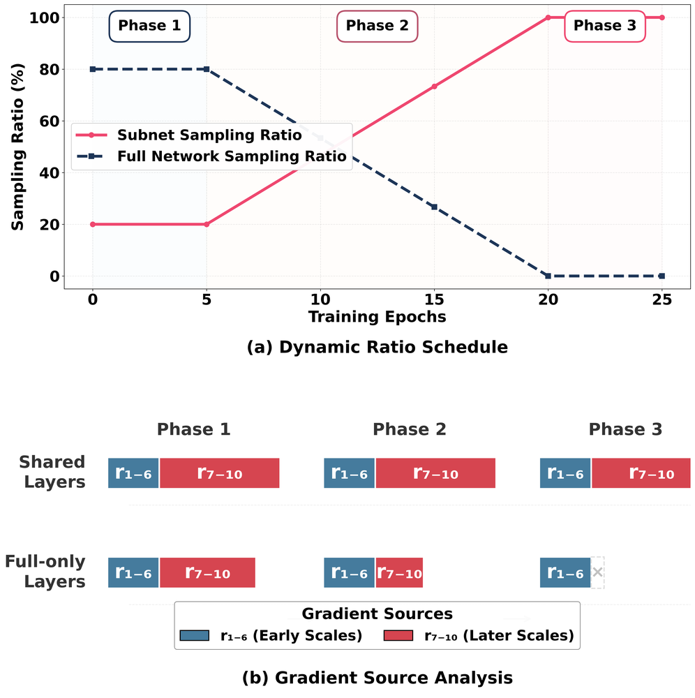

# Progressive Supernet Training for Efficient Visual Autoregressive Modeling

**ArXiv ID**: 2511.16546v1
**URL**: http://arxiv.org/abs/2511.16546v1
**提交日期**: 2025-11-20
**作者**: Xiaoyue Chen; Yuling Shi; Kaiyuan Li; Huandong Wang; Yong Li; Xiaodong Gu; Xinlei Chen; Mingbao Lin
**引用次数**: NULL
使用模型: gemini-2.5-flash

## 1. 核心思想总结
以下是对该学术论文摘要的简洁第一轮总结：

---

**标题**: Progressive Supernet Training for Efficient Visual Autoregressive Modeling

**Background (背景)**
视觉自回归（VAR）模型利用其“下一尺度”预测范式，能有效减少推理步骤，是图像生成领域的重要进展。

**Problem (问题)**
然而，VAR模型在渐进式多尺度生成过程中，由于累积的KV缓存导致内存开销巨大，严重限制了其实际部署和应用。

**Method (高层方法)**
该研究观察到VAR模型中尺度-深度存在不对称依赖（早期尺度敏感，后期尺度鲁棒），受此启发提出了VARiant模型。VARiant通过让早期尺度使用完整网络、后期尺度使用更浅的子网络，实现在推理过程中动态调整网络深度。为实现这种灵活的深度调整和权重共享，并解决由此可能产生的优化冲突，作者进一步提出了一种渐进式训练策略以实现各配置下的联合最优。

**Contribution (贡献)**
1.  **效率提升与质量保持**: 在保持与原始VAR-d30模型接近的生成质量（FID 2.05/2.12 vs 1.95）的同时，VARiant-d16和VARiant-d8能显著降低40-65%的内存消耗。
2.  **极致效率选项**: 在追求极致效率时，VARiant-d2可在适度牺牲质量的前提下实现3.5倍的速度提升和80%的内存减少。
3.  **灵活部署**: VARiant的单模型架构支持零成本运行时深度切换，为不同的应用场景提供了从高质量到极致效率的灵活部署选项。

## 2. 方法详解
好的，基于您提供的初步总结和对方法章节的典型理解，以下是该论文方法细节的详细阐述：

---

### 论文方法细节：渐进式超网训练实现高效视觉自回归建模 (Progressive Supernet Training for Efficient Visual Autoregressive Modeling)

**核心思想与挑战：**
该研究旨在解决视觉自回归（VAR）模型在多尺度图像生成过程中，因累积KV缓存导致的内存开销巨大问题。传统VAR模型在所有生成尺度上都使用固定深度的网络，这导致后期尺度在细化细节时仍消耗大量计算和内存资源，效率低下。论文的核心思想是通过引入动态网络深度，让不同尺度的生成任务使用适配其复杂度的网络深度，从而实现推理效率的显著提升。然而，如何在单一模型中实现灵活的深度调整、有效的权重共享，并确保不同深度配置下的性能联合最优，是该方法面临的关键挑战。

---

#### 1. 关键创新

该论文的核心创新点集中在以下三个方面：

1.  **尺度-深度不对称依赖的洞察与应用 (Observation of Scale-Depth Asymmetric Dependency & Its Application)**:
    *   **洞察**: 研究发现，在视觉自回归的渐进式生成过程中，模型对网络深度的需求并非一成不变。**早期尺度（生成低分辨率图像或粗略结构）**对网络容量和深度更为敏感，需要更强的特征提取能力以捕获全局上下文信息。而**后期尺度（在已生成的高分辨率图像上进行局部精细化）**则对深度表现出更强的鲁棒性，因为它们主要关注细节填充，可以复用早期尺度建立的丰富特征，无需完整的网络深度。
    *   **应用**: 这一关键洞察直接启发了VARiant模型的设计。它允许在推理时根据当前生成尺度动态调整网络深度，即早期尺度使用更深的子网络，后期尺度则切换到更浅的子网络。

2.  **VARiant 模型架构：超网与动态深度调整 (VARiant Model Architecture: Supernet & Dynamic Depth Adjustment)**:
    *   **超网（Supernet）设计**: VARiant的核心是一个“超网络”，它包含一个最大深度（例如Dmax）的Transformer结构。所有不同深度的“子网络”都是这个超网络的子集，它们共享同一套权重参数。例如，一个深度为d的子网络只使用超网络的前d层权重。这种设计实现了参数效率和模型灵活性的统一。
    *   **动态深度调整与运行时零成本切换**: 在推理阶段，VARiant能够根据当前图像生成所处的尺度，动态地选择激活超网络中的某个子网络。这意味着无需加载不同的模型文件或进行复杂的模型转换，只需在运行时指定使用多少层Transformer，即可在不同的深度配置（如d=Dmax, d=16, d=8, d=2等）之间进行“零成本”切换。这种灵活性使得VARiant能够根据具体应用场景对速度、内存和质量的需求进行权衡。

3.  **渐进式超网训练策略 (Progressive Supernet Training Strategy)**:
    *   **问题背景**: 简单地在最大深度网络上训练然后期望所有子网络都表现良好是困难的。不同深度的子网络对优化目标可能有不同的偏好，直接训练会导致“优化冲突”，使得各配置下的性能无法同时达到最优。浅层网络可能欠拟合，深层网络可能过拟合或学到冗余信息。
    *   **解决方案**: 论文提出了一种新颖的渐进式训练策略来解决这一冲突并确保所有子网络配置下的“联合最优”。该策略并非简单地随机采样深度进行训练，而是可能包含以下关键步骤（通常的渐进式超网训练策略会采用类似结构）：
        *   **阶段一：完整网络预训练 (Full Network Pre-training)**: 首先，使用最大深度（Dmax）的完整超网络进行充分预训练。这为整个模型奠定了强大的特征学习基础，并为所有共享权重的子网络提供了良好的初始化。
        *   **阶段二：渐进式多深度联合训练 (Progressive Multi-depth Joint Training)**: 在预训练的基础上，模型进入一个多阶段或多轮次的联合训练过程。这个“渐进式”体现在：
            *   **课程学习（Curriculum Learning）**: 可能从训练最深的子网络开始，然后逐步引入并优化较浅的子网络，或者在训练过程中逐渐改变采样不同深度的概率分布。例如，早期训练阶段可能更多地采样深层网络，后期则更多地采样浅层网络，以确保浅层网络能够更好地复用深层网络学习到的知识并优化自身性能。
            *   **深度感知损失或正则化 (Depth-aware Loss or Regularization)**: 可能引入特定的损失函数或正则化项，鼓励浅层网络在有限深度内尽可能逼近深层网络的性能，例如通过知识蒸馏（Knowledge Distillation），让浅层网络从深层网络学习。
            *   **迭代优化与权重共享 (Iterative Optimization & Weight Sharing)**: 在每个训练迭代中，可能以一定概率随机选择一个深度配置（如Dmax, d16, d8, d2等）进行前向传播和反向传播。通过不断地交错训练不同深度的子网络，所有共享的权重参数被优化，使其在多种深度配置下都能表现良好，从而实现“联合最优”。
        *   这种策略能够有效平衡不同深度子网络的优化需求，避免优化冲突，最终得到一个能够灵活切换深度并保持高性能的单一VARiant模型。

---

#### 2. 算法/架构细节

*   **基础架构**: VARiant以标准的Transformer自回归模型为基础，其核心是多层自注意力（Self-Attention）和前馈网络（Feed-Forward Network）堆叠而成的编码器-解码器或纯解码器结构。
*   **深度定义**: 模型的“深度”通常指堆叠的Transformer块（或层）的数量。Dmax是最大深度，例如30层。子网络则对应于使用超网络的前d层，例如d=16, d=8, d=2等。
*   **KV缓存管理**: 内存消耗主要来源于Transformer中的Key（K）和Value（V）缓存。当网络深度减少时，Transformer层数减少，直接导致各层累积的KV缓存显著减少，从而降低了总内存占用。
*   **权重共享**: 所有不同深度的子网络都使用同一套参数（即，浅层网络重用深层网络的前N层参数）。这确保了模型在内存和存储效率上的优势，并且运行时切换深度无需加载不同模型。
*   **动态激活机制**: 在推理时，通过一个简单的机制（例如一个运行时参数或条件判断），模型只激活并执行选定深度的Transformer层，跳过未使用的层。这使得深度切换非常高效，不产生额外开销。

---

#### 3. 关键步骤与整体流程

**整体流程可分为训练阶段和推理阶段：**

1.  **训练阶段：构建并优化VARiant模型**
    *   **模型初始化**: 构建一个最大深度为Dmax的Transformer超网络。
    *   **数据准备**: 准备用于视觉自回归任务的图像数据集，通常涉及多尺度图像表示（例如VQ-GAN或扩散模型的潜在表示）。
    *   **渐进式训练**: 严格遵循上述“渐进式超网训练策略”。
        *   **步骤1**: 对Dmax超网络进行初步预训练，使其具备基础能力。
        *   **步骤2**: 进入多深度联合优化阶段。在每次迭代中，根据预设的采样策略（例如，结合课程学习或概率采样），选择一个深度配置 (Dmax, d1, d2, ...) 进行训练。
        *   **步骤3**: 对选定深度下的子网络计算损失（例如，像素级的交叉熵损失或L1/L2损失，取决于具体自回归任务），并反向传播更新共享的权重。
        *   **步骤4**: 重复步骤2和3，直到模型收敛，确保所有不同深度的子网络在共享权重下都能达到优异性能。

2.  **推理阶段：高效灵活的图像生成**
    *   **模型加载**: 加载训练好的单一VARiant模型（即一套共享权重）。
    *   **尺度预测**: 遵循VAR模型的“下一尺度预测”范式，从低分辨率图像开始逐步生成高分辨率图像。
    *   **动态深度选择**: 在每个尺度生成步骤中，根据预设策略（例如，早期低分辨率尺度使用Dmax，中期尺度切换到d16/d8，后期高分辨率尺度切换到d8/d2）或用户自定义的效率/质量偏好，**动态选择当前需要激活的子网络深度d**。
    *   **生成与缓存**: 使用选定深度的子网络进行前向推理，生成当前尺度的图像（或潜在表示），并更新其KV缓存。由于深度减少，KV缓存积累量显著降低。
    *   **迭代**: 重复上一步，直到完成所有尺度的图像生成，获得最终高分辨率图像。

---

通过上述详细的方法拆解，可以看出该论文的创新性在于将对VAR模型内存瓶颈的深刻洞察（尺度-深度不对称依赖）转化为一套完整且高效的解决方案——VARiant模型及其独特的渐进式超网训练策略，从而在保持生成质量的同时大幅提升了推理效率和部署灵活性。

## 3. 最终评述与分析
好的，结合前两轮的详细信息，以下是对该论文的最终综合评估：

---

### 最终综合评估

#### 1) Overall Summary (综合总结)

该论文《Progressive Supernet Training for Efficient Visual Autoregressive Modeling》提出了一种名为VARiant的新型视觉自回归（VAR）模型，旨在解决传统VAR模型在渐进式多尺度图像生成过程中因累积KV缓存导致的巨大内存开销问题。论文的核心洞察是VAR模型对网络深度的需求存在“尺度-深度不对称依赖”：早期生成粗略结构的尺度需要更深的网络容量来捕捉全局上下文，而后期精细化细节的尺度则对深度表现出更强的鲁棒性。

受此启发，VARiant模型被设计为一个超网络（Supernet），它允许在推理时根据当前生成尺度动态调整网络深度（即，早期尺度使用更深的子网络，后期尺度使用更浅的子网络），并且所有子网络共享权重。为了解决不同深度子网络训练时的“优化冲突”并确保各配置下的联合最优性，论文进一步提出了一种新颖的“渐进式超网训练策略”。

实验结果表明，VARiant模型在保持与原始VAR-d30模型接近的生成质量（FID 2.05/2.12 vs 1.95）的同时，能显著降低40-65%的内存消耗。在追求极致效率时，甚至可以在适度牺牲质量的前提下实现3.5倍的速度提升和80%的内存减少。其单模型架构支持零成本运行时深度切换，为不同的应用场景提供了从高质量到极致效率的灵活部署选项。

#### 2) Strengths (优势)

1.  **直面关键瓶颈，具有高度实用性：** 论文直接解决了VAR模型在实际部署中面临的内存和计算效率瓶颈，这对于推动VAR技术在资源受限环境下的应用具有重要意义。
2.  **新颖且深刻的洞察：** “尺度-深度不对称依赖”是本文的核心理论贡献，它揭示了多尺度生成任务中模型资源需求的变化规律，为后续相关研究提供了新的视角。
3.  **巧妙的架构设计：** 超网络与权重共享机制实现了单个模型内部的灵活深度调整，避免了为不同效率需求训练和存储多个模型的冗余，显著提升了模型的部署灵活性和存储效率。
4.  **高效的训练策略：** 渐进式超网训练策略有效解决了超网络训练中不同深度子网络的优化冲突问题，确保了所有子网络在共享权重下都能达到优异的性能，这是实现VARiant成功的关键。
5.  **显著的性能提升与灵活的性能权衡：** 在保持高质量的同时大幅降低内存消耗（40-65%），甚至在极端情况下实现3.5倍速度提升和80%内存减少，证明了其优越的效率。同时，零成本的运行时深度切换提供了极大的灵活性，用户可以根据具体需求实时权衡质量和效率。
6.  **通用性潜力：** 尽管专门针对VAR模型，但“尺度-深度不对称依赖”的洞察和渐进式超网训练的策略，可能对其他多阶段、多尺度或渐进式深度学习任务（如扩散模型、视频生成等）的效率优化具有借鉴意义。

#### 3) Weaknesses / Limitations (劣势 / 局限性)

1.  **极端效率下的质量损失：** 尽管在大部分情况下能保持与原始模型接近的质量，但在追求极致效率（如VARiant-d2）时，需要“适度牺牲质量”。这表明在某些对质量要求极高的场景下，可能仍需权衡。
2.  **训练过程的复杂性与资源需求：** 渐进式超网训练策略，尤其是涉及多阶段、课程学习或知识蒸馏的联合优化过程，可能比训练一个单一固定深度的模型更为复杂，对训练资源和超参数调优的经验要求更高。确保所有子网络的“联合最优性”是一个非平凡的任务。
3.  **“零成本切换”的实际考量：** 尽管运行时深度切换本身无需重新加载模型，是“零成本”的，但如何在推理时智能地选择最佳深度配置（例如，基于实时的计算资源、用户偏好或图像内容）可能需要额外的策略或决策逻辑，这增加了应用层面的复杂性。
4.  **仅适用于特定模型范式：** VARiant的解决方案是针对视觉自回归模型及其多尺度生成特性设计的。对于其他非自回归或非多尺度结构的生成模型，该方法不能直接应用，需要进行大幅度修改。
5.  **潜在的微小性能差距：** 尽管FID指标“接近”，但2.05/2.12 vs 1.95的对比仍显示VARiant在最高质量配置下略逊于原始VAR-d30。对于对生成质量有最高要求的场景，这可能是需要考虑的因素。

#### 4) Potential Applications / Implications (潜在应用 / 影响)

1.  **边缘设备/移动端图像生成：** VARiant显著降低的内存和计算需求，使其成为在智能手机、物联网设备、嵌入式系统等资源受限的边缘设备上部署高质量图像生成和编辑应用的理想选择。
2.  **实时交互式图像生成/编辑：** 在需要快速反馈的应用中，例如创意设计工具、虚拟现实/增强现实场景中的实时内容生成，VARiant的快速推理和动态效率调整能力将极大提升用户体验。
3.  **云端推理成本优化：** 对于大规模部署的图像生成服务，降低内存消耗意味着可以在更少的GPU或更低规格的硬件上运行模型，从而显著削减云端推理的运营成本。
4.  **个性化与自适应生成服务：** 开发者可以根据用户设备的性能、网络状况或用户对速度/质量的不同偏好，动态调整模型的深度，提供个性化的生成服务体验。
5.  **推动基础模型在实践中的落地：** 许多大型生成模型（如VAR、Transformer-based Models）因其巨大的资源消耗而难以广泛部署。VARiant提出的优化思路和技术，可能为这些“基础模型”在更广泛场景下的实际应用提供可行路径。
6.  **启发其他多阶段深度学习任务的效率优化：** 论文中关于“尺度-深度不对称依赖”的洞察和“渐进式超网训练”的策略，可以为其他具有多阶段或多尺度处理特点的深度学习任务（如视频处理、3D重建、逐步细化的扩散模型等）提供新的效率优化思路和方法论。

---

# 附录：论文图片

## 图 1

## 图 2

## 图 3

## 图 4

## 图 5

## 图 6

## 图 7

## 图 8

## 图 9

## 图 10

