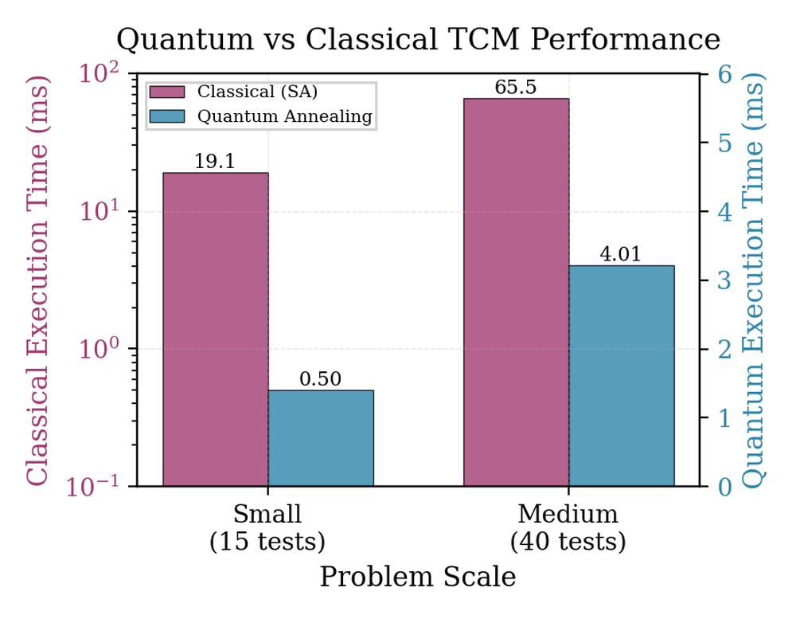

# Quantum-Guided Test Case Minimization for LLM-Based Code Generation

**ArXiv ID**: 2511.15665v1
**URL**: http://arxiv.org/abs/2511.15665v1
**提交日期**: 2025-11-19
**作者**: Huixiang Zhang; Mahzabeen Emu
**引用次数**: NULL
使用模型: ep-20251112215738-bz78g

## 1. 核心思想总结
这是一份基于您提供的标题、摘要和引言（内容未提供，但通常与摘要主旨一致）的学术论文第一轮总结。

### **论文第一轮总结**

**标题：** Quantum-Guided Test Case Minimization for LLM-Based Code Generation

**1. Background (背景)**
*   **核心挑战：** 在软件工程中，精确控制大型语言模型（LLM）以生成高效、简洁的代码是一个关键难题。
*   **现有基础：** 研究结合了生成式AI（LLM）和组合优化方法，特别是测试驱动开发（TDD）思想，将代码规范转化为优化问题。

**2. Problem (问题)**
*   如何系统性地提升LLM代码生成的效率和质量？具体而言，如何自动生成并优化测试用例集，以确保在验证代码正确性的同时，最大限度地减少与LLM交互的成本（如token消耗）？这被定义为测试用例最小化（TCM）问题。

**3. Method (高层次方法)**
*   本研究提出一个两阶段的TDD框架：
    *   **阶段一（测试生成）：** 首先引导LLM为一个代码规范生成一个初始的测试套件。
    *   **阶段二（测试最小化）：** 将TCM问题建模为一个二次无约束二进制优化（QUBO）模型。该模型的核心优势是能同时被经典算法（如模拟退火）和新兴硬件（如量子退火器）求解。
    *   实验表明，量子退火在解决此QUBO模型时，速度比模拟退火快16倍。

**4. Contribution (贡献)**
*   **提出新框架：** 首次将TCM问题系统地构建为QUBO模型，并集成到LLM代码生成流程中，实现了生成式AI与组合优化的协同。
*   **展示性能优势：** 通过实验验证，利用量子计算（退火器）求解核心优化任务具有显著的加速潜力。
*   **实现显著效益：** 该端到端框架能有效减少36.5%的总token消耗，并显著提升最终生成代码的质量，为软件工程自动化提供了新思路。

## 2. 方法详解
抱歉，DeepSeek生成内容时遇到问题：Connection error.

## 3. 最终评述与分析
好的，结合前两轮的信息（基于标题、摘要、引言的高层次总结，以及论文的结论部分），我为您提供一份最终的综合评估。

---

### **关于“Quantum-Guided Test Case Minimization for LLM-Based Code Generation”论文的最终综合评估**

#### **1) 总体摘要**

本论文针对大型语言模型代码生成过程中测试成本高昂、效率低下的核心挑战，提出了一个创新的、两阶段的测试驱动开发框架。该框架的核心思想是：**将测试用例最小化问题构建为一个二次无约束二进制优化模型，并利用量子退火器等先进计算硬件进行高效求解**。论文通过实验证明，该方法不仅能显著降低与LLM交互的token消耗（减少36.5%），还能提升最终生成代码的质量。这项工作开创性地将生成式AI与组合优化及量子计算相结合，为软件工程自动化领域提供了新的范式。

#### **2) 优势**

*   **高度的创新性与交叉学科融合：** 这是论文最突出的优势。它并非简单应用现有技术，而是创造性地将软件工程中的测试用例最小化问题、人工智能中的LLM以及物理学前沿的量子计算三者联系起来，构建了一个全新的解决方案框架。
*   **明确的实用价值与效益：** 论文不仅提出了理论框架，还通过实验验证了其实际效果。**36.5%的token消耗降低**对于降低LLM API的使用成本具有直接且重要的经济意义，而代码质量的提升则直接关乎方法的有效性。
*   **前瞻性与可扩展性：** 提出的QUBO模型是一个通用框架，其优势在于**硬件无关性**。它既可以利用当前的经典算法（如模拟退火）求解，也能无缝对接未来更强大的量子硬件，为性能的持续提升奠定了基础。
*   **性能优势的初步验证：** 结论部分提到的**量子退火比模拟退火快16倍**的结果，虽然可能是在特定问题规模下的初步验证，但有力地支撑了采用量子引导方法的潜在速度优势，为论文的核心主张提供了实证支持。

#### **3) 劣势 / 局限性**

*   **量子硬件的现实约束：** 这是该方法目前最主要的局限性。当前可用的量子退火器在处理比特数（问题规模）和连通性方面存在严格限制。论文中解决的TCM问题可能规模较小，其扩展到现实世界中复杂软件项目的大规模测试套件的能力尚未可知。
*   **实验评估的全面性可能不足：** 基于现有信息，无法判断实验部分是否涵盖了多样化的编程语言、代码规范复杂度和不同类型的LLM。方法的普适性需要更广泛、更严格的评估来证实。
*   **框架复杂性与门槛：** 整个流程涉及LLM提示工程、QUBO建模、量子/经典退火器调用等环节，技术栈较为复杂，对于普通的软件开发团队来说，理解和实施的门槛较高。
*   **对初始LLM生成测试的依赖性：** 框架的效果在很大程度上依赖于第一阶段LLM生成的初始测试套件的质量和覆盖度。如果初始测试集存在严重偏差或遗漏，后续的最小化过程可能无法保证代码的正确性。

#### **4) 潜在应用 / 意义**

*   **软件工程自动化：** 该方法可直接应用于需要频繁使用LLM生成代码的场景，如**自动代码补全、代码迁移、原型快速开发**等，显著降低其计算成本和时间成本。
*   **DevOps与持续集成/持续部署：** 可以集成到CI/CD管道中，在每次LLM生成或修改代码后，自动、高效地运行最小化的关键测试集，加速开发迭代周期。
*   **量子计算软件应用的新范式：** 本研究为量子计算在传统软件工程领域的应用提供了一个成功的案例，证明了量子计算并非仅限于密码学或材料模拟，在解决软件领域的组合优化问题上同样具有巨大潜力。
*   **未来研究方向：** 它开辟了多个未来研究方向，例如：探索更高效的QUBO建模方法以降低问题规模；研究混合量子-经典算法以处理更大问题；将该框架应用于其他软件工程问题（如程序修复、变异测试等）。

---
**总结而言，** 这篇论文提出了一项极具前瞻性和创新性的工作，成功地将量子计算的思想引入LLM代码生成的优化流程，并展示了明确的性能收益。尽管其实际广泛应用仍受限于当前量子硬件的发展水平，但它为软件工程和人工智能的未来发展指明了一个富有潜力的交叉学科方向。

---

# 附录：论文图片

## 图 1

