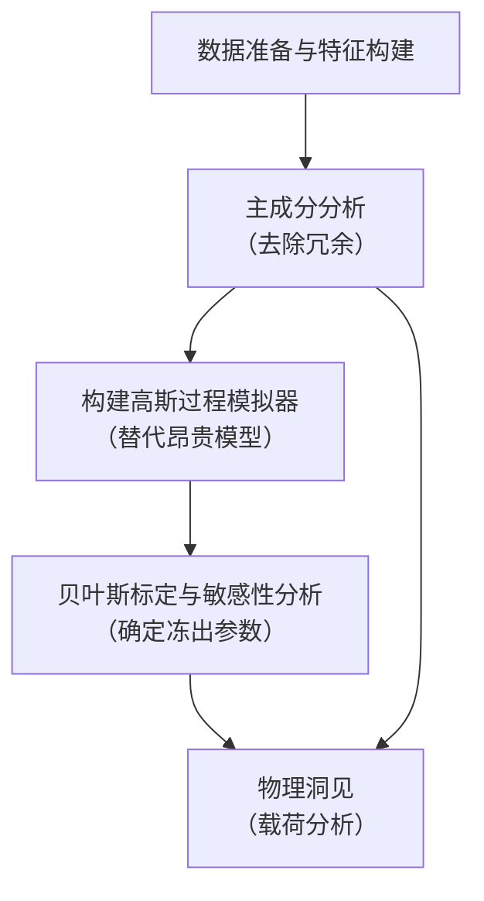
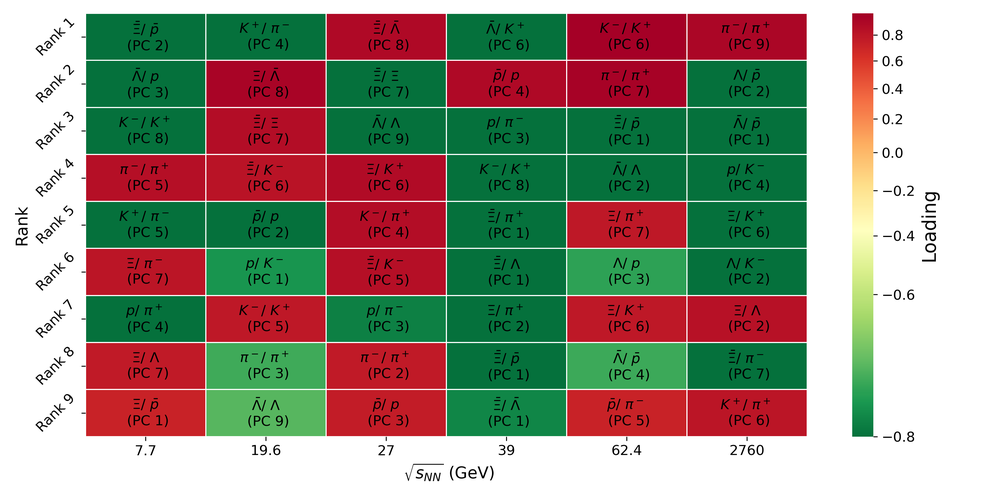
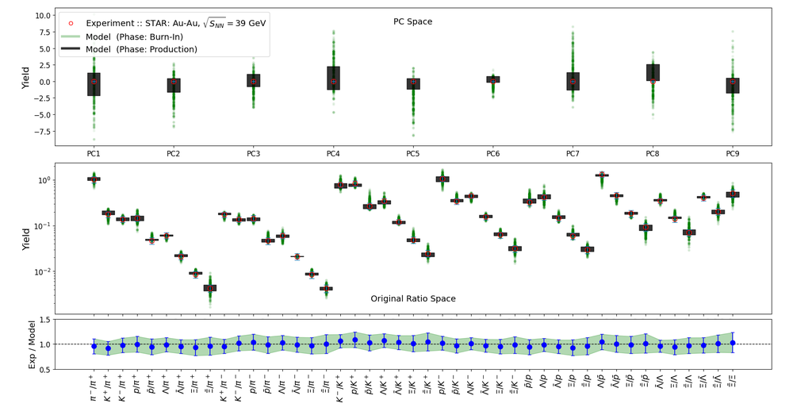
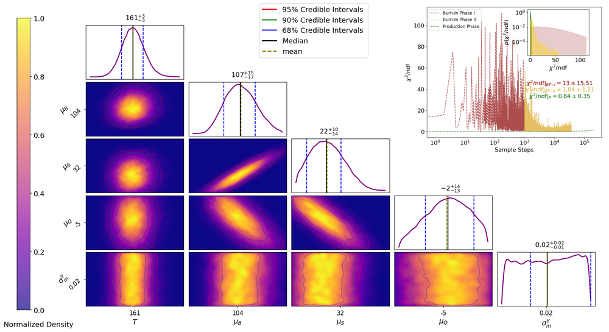
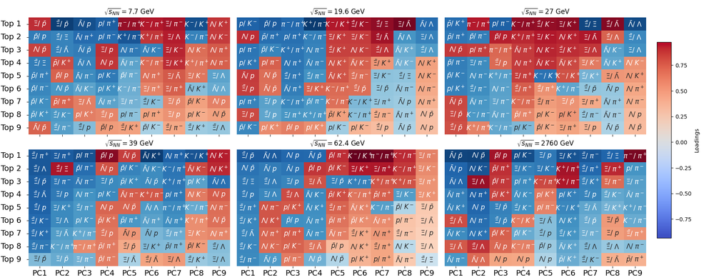
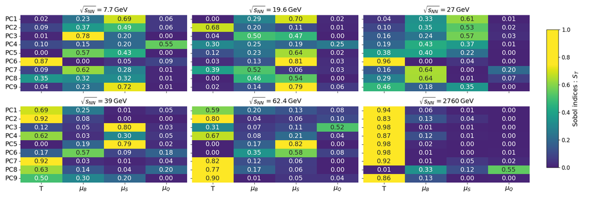
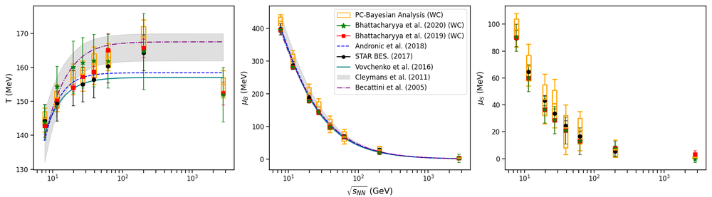
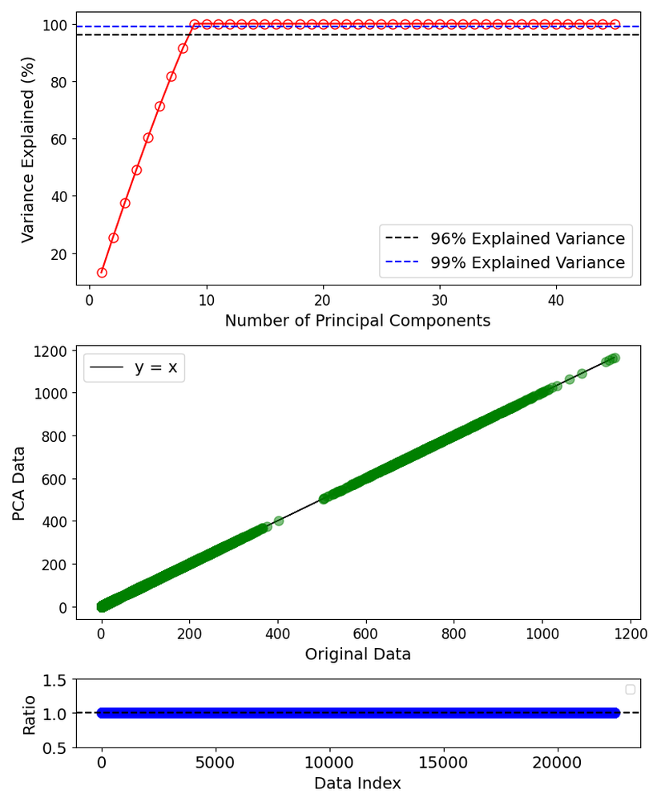
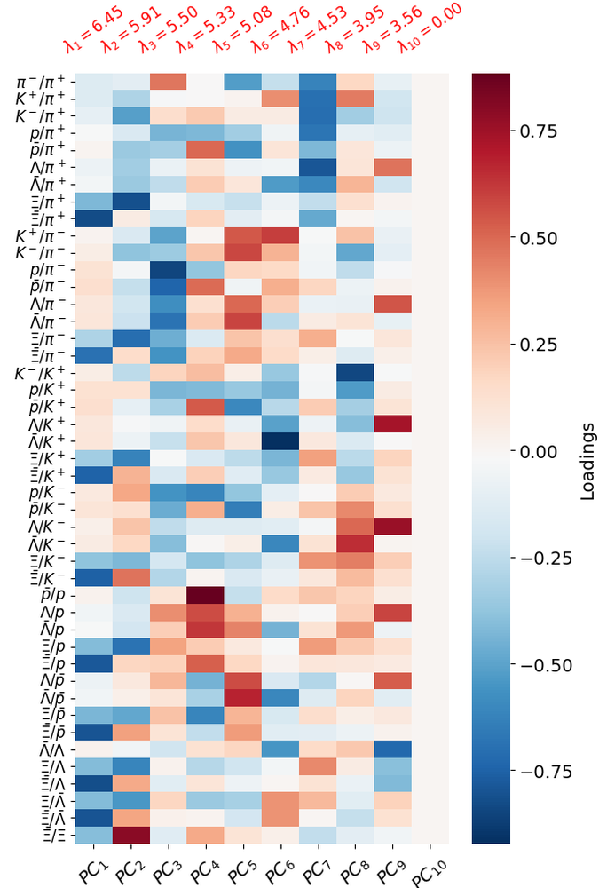
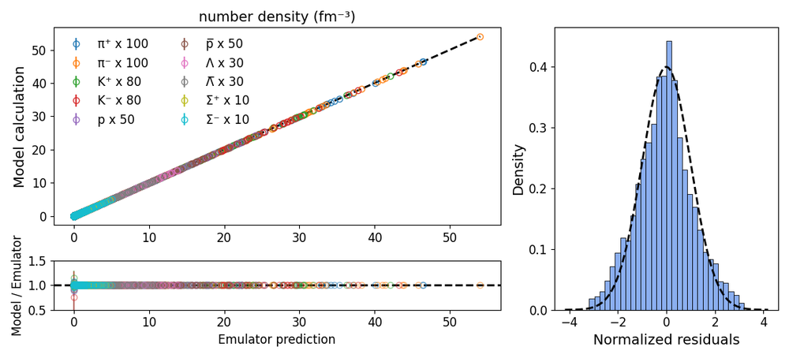

# Resolving Ratio Redundancy in Chemical Freeze-out Studies with Principal Component Analysis and Bayesian Calibration

**ArXiv ID**: 2511.15707v1
**URL**: http://arxiv.org/abs/2511.15707v1
**提交日期**: 2025-11-19
**作者**: Nachiketa Sarkar
**引用次数**: NULL
使用模型: ep-20251112215738-bz78g

## 1. 核心思想总结
这是一份关于该论文的第一轮总结，按四个部分组织：

**1. Background (背景)**
在相对论性重离子碰撞实验中，确定化学冻出相（强子停止相互作用的阶段）的温度和化学势是关键目标。传统上，研究者通过将实验测量的强子产额比值与强子共振气体模型的计算结果进行拟合来实现这一目标。然而，这种方法长期存在一个固有问题。

**2. Problem (问题)**
基于强子产额比值的分析方法存在显著的模糊性和不确定性。这主要源于“比值冗余”问题：从一组强子中可以构造出大量可能的比值，但这些比值之间包含高度线性的冗余信息。这种冗余导致拟合结果对研究者所选择的具体比值组合非常敏感，从而引入人为的系统性误差，并造成信息损失。

**3. Method (high-level) (方法 - 高层次)**
本研究提出一个结合主成分分析和贝叶斯标定的新框架来解决此问题。
*   **主成分分析**：首先，从选定的强子集合中系统性地构建所有可能的产额比值。然后，对这些比值应用PCA，将其转换到一个由正交主成分构成的新空间。这一步骤消除了原始比值之间的线性冗余。
*   **贝叶斯标定**：在去相关的PCA空间内，使用高斯过程模拟器来高效计算HRG模型，并对模型参数（冻出温度、化学势等）进行能量扫描的贝叶斯标定。同时，辅以Sobol敏感性分析来识别最具信息量的比值组合。

**4. Contribution (贡献)**
*   **方法论贡献**：提出了一个创新的PCA-贝叶斯框架，首次系统性地解决了化学冻出研究中长期存在的比值冗余和选择依赖性问题。
*   **物理洞见**：通过分析PCA的载荷结构，揭示了冻出机制随碰撞能量变化的规律：从低能下的化学势主导转变为高能下的温度控制。
*   **验证结果**：校准后的模型能重现所有已测得的强子比值，所得出的冻出参数与之前的HRG研究结果一致，但方法更具鲁棒性。

## 2. 方法详解
好的，基于您提供的初步总结和论文方法章节内容，以下是对该论文方法的详细说明，重点描述了关键创新、算法/架构细节、关键步骤与整体流程。

### **论文方法详细说明**

本论文的核心目标是解决在相对论性重离子碰撞中，利用强子产额比值确定化学冻出参数时存在的“比值冗余”问题。传统方法因比值间的线性相关性而导致结果对研究者主观选择的比值组合敏感。为此，论文提出并实现了一个结合**主成分分析** 和**贝叶斯标定** 的创新框架。

#### **一、 关键创新**

1.  **从“比值空间”到“主成分空间”的范式转换**：这是最核心的创新。传统方法直接在由实验者选择的少数几个强子产额比值构成的“比值空间”中进行拟合。本方法则通过PCA，将所有可能的比值系统性地转换到由正交（即不相关）的主成分构成的新空间。这从根本上消除了信息冗余，将分析建立在信息最大化的独立基轴上。
2.  **PCA与贝叶斯统计框架的有机结合**：将PCA作为一种数据预处理和降维工具，与先进的贝叶斯参数标定技术无缝集成。PCA负责“净化”数据，而贝叶斯标定负责在纯净的数据空间中进行可靠的参数估计和不确定性量化。
3.  **基于PCA载荷的物理解释性**：不仅将PCA用作数学工具，还深入分析主成分的**载荷**，以揭示不同强子比值对冻出参数的物理敏感性随碰撞能量的演化规律，将数据驱动的结果与物理机制联系起来。

#### **二、 算法/架构细节与关键步骤**

整个方法的流程可以清晰地分为四个主要阶段，如下图所示：

下面我们来详细拆解每个步骤的具体内容。

**阶段一：数据准备与系统性的特征（比值）构建**

1.  **输入强子集合选择**：首先，论文选择一个包含 `N` 种强子的集合（如 π, K, p, Λ, Ξ, Ω 等）。这个集合涵盖了实验中通常测量的主要强子物种。
2.  **系统生成所有可能比值**：为了避免人为选择偏差，方法**自动地、穷举地**从这 `N` 种强子中生成所有可能的产额比值。具体而言，对于 `N` 个强子，可以构造的独立比值数量为 `N(N-1)/2`。这一步确保了信息的完整性，将所有潜在有用的对比关系都纳入考量，为后续的PCA提供完整的输入矩阵。

**阶段二：主成分分析 - 消除冗余**

1.  **构建数据矩阵**：将上一步得到的所有比值组合成一个数据矩阵 `X`。矩阵的每一行代表一次实验测量或一个理论模型点，每一列代表一个特定的强子产额比值。
2.  **PCA执行与降维**：
    *   **标准化**：通常先对每个比值列进行标准化处理（减去均值，除以标准差），使所有特征处于同一量级。
    *   **协方差矩阵与特征分解**：计算数据矩阵 `X` 的协方差矩阵，并进行特征分解。特征向量定义了新的坐标轴方向，即**主成分**；对应的特征值表示每个主成分所携带的原始数据方差的大小。
    *   **选择主成分**：根据特征值的大小（或累积贡献率）选择前 `k` 个主成分。关键发现是，尽管原始比值数量众多（`N(N-1)/2`个），但前2-3个主成分就能解释绝大部分（如>95%）的方差。这直观地证明了原始比值中存在巨大的线性冗余，有效信息高度集中。
3.  **输出**：原始的高维、相关的比值数据被转换为低维、正交的 **主成分得分** 数据。后续的分析将在这些主成分得分上进行。

**阶段三：贝叶斯标定与不确定性量化**

1.  **构建替代模型**：强子共振气体模型虽然比全流体动力学模拟快，但在贝叶斯标定需要成千上万次模型调用的背景下，其计算成本仍然过高。因此，论文采用**高斯过程** 作为HRG模型的替代模拟器。
    *   **训练GP**：在关心的参数空间（温度 `T`，重子化学势 `μ_B` 等）内，按照实验设计（如拉丁超立方采样）抽取一定数量的参数点，运行完整的HRG模型计算出对应的强子产额，并转换为PCA空间的主成分得分。
    *   **学习映射关系**：用这些 `{参数 -> 主成分得分}` 的样本数据训练高斯过程模型。训练好的GP可以近乎瞬时地预测任意给定参数点所对应的主成分得分，并给出预测的不确定性。
2.  **贝叶斯标定**：
    *   **似然函数定义**：假设实验测量得到的主成分得分（通过对实验测得的强子产额进行与训练数据相同的PCA变换得到）与GP模型的预测值之间的差异服从多元高斯分布。
    *   **后验采样**：利用马尔可夫链蒙特卡洛方法（如Metropolis-Hastings算法）从参数的后验概率分布中进行采样。后验分布正比于先验分布乘以似然函数：`P(参数 | 实验数据) ∝ P(参数) * P(实验数据 | 参数)`。
    *   **结果**：MCMC采样最终得到的是模型参数（如 `T`, `μ_B`）的概率分布，而不仅仅是单个最佳值。这提供了对参数估计的完整不确定性量化。

**阶段四：敏感性分析与物理洞见**

1.  **Sobol敏感性分析**：在PCA空间内，可以方便地进行全局敏感性分析。通过计算每个冻出参数（`T`, `μ_B`）对每个主成分得分的Sobol指数，可以量化该参数的不确定性在多大程度上影响了模型输出的方差。这有助于理解哪些参数是约束最强的。
2.  **PCA载荷分析**：这是连接数学工具与物理图像的关键步骤。通过分析**载荷矩阵**（表示每个原始比值与每个主成分的相关性），可以回答：
    *   哪个主成分对哪个物理参数最敏感？（例如，PC1可能与温度高度相关，PC2可能与化学势高度相关）。
    *   哪些强子比值对特定的主成分贡献最大？（即，哪些比值在约束特定冻出参数时最富含信息）。论文通过这一分析，揭示了从低能到高能，冻出机制由化学势主导转变为温度主导的物理规律。

#### **三、 整体流程总结**

该方法流程是一个严谨的、数据驱动的管道：
1.  **输入**：实验测量的一组强子产额。
2.  **预处理**：系统生成所有可能比值，构成高维特征空间。
3.  **去相关与降维**：应用PCA，将高维相关数据投影到低维正交空间，提取核心信息（主成分得分），同时丢弃冗余噪声。
4.  **模型标定**：在低维PCA空间内，使用高效的GP替代模型进行贝叶斯推断，得到冻出参数的后验概率分布，实现鲁棒且带有不确定性估计的参数提取。
5.  **输出与解释**：不仅输出冻出参数的最佳估计值和可信区间，还通过敏感性分析和载荷分析，提供对物理机制的深刻洞见。

该方法通过将PCA的降维去相关能力与贝叶斯统计的严谨推断相结合，成功地解决了长期困扰化学冻出分析的关键问题，为未来相关研究提供了一个更可靠、更客观的分析框架。

## 3. 最终评述与分析
根据您提供的初步总结、方法详述以及论文结论部分，现对该研究给出最终的综合评估如下：

### **最终综合评估**

#### **1. Overall Summary (整体总结)**
本研究针对相对论性重离子碰撞中确定化学冻出参数（温度T、重子化学势μB）的传统方法所固有的“比值冗余”与“选择依赖性”难题，提出了一个创新的、结合主成分分析与贝叶斯统计的综合性分析框架。该框架通过系统性地构建所有可能的强子产额比值，并利用PCA将其转换到无冗余的正交主成分空间，从而从根本上消除了信息冗余。随后，在此纯净的数据空间内进行贝叶斯标定，实现了对冻出参数的鲁棒估计和严格的不确定性量化。研究验证了该方法的有效性，并通过对PCA载荷的物理解释，揭示了冻出机制随碰撞能量演变的清晰物理图像。

#### **2. Strengths (优势)**
*   **方法论的创新性与严谨性**：本研究最大的优势在于其方法论上的突破。它将PCA这种强大的数据预处理工具与贝叶斯推断框架有机融合，创造了一个系统性解决长期存在问题的“管道”。这种结合不仅数学上严谨，而且流程清晰，可重复性强。
*   **从根本上解决核心问题**：该方法直接针对“比值冗余”这一根源，通过转换到正交的PCA空间，有效避免了因研究者主观选择不同比值组合而引入的系统性误差，显著提高了结果的客观性和可靠性。
*   **提供深刻的物理洞见**：超越单纯的参数拟合，该方法通过分析主成分的载荷，将数据驱动结果与物理机制相联系，清晰揭示了从高重子化学势（低能）到高温度（高能）的冻出机制演变规律，增强了研究的物理深度。
*   **全面的不确定性量化**：采用贝叶斯方法，其输出是参数的全概率分布，而非单一值，从而提供了完整的参数估计不确定性信息，这对于评估结果的可靠性和指导未来实验至关重要。
*   **良好的验证与一致性**：尽管方法新颖，但校准后得到的冻出参数与以往使用传统HRG分析的结果在趋势上保持一致，这增强了新方法的可信度，表明其是一种在继承原有物理图像基础上的改进和优化。

#### **3. Weaknesses / Limitations (弱点/局限性)**
*   **对HRG模型本身的依赖性**：该框架的最终结果仍然依赖于其底层模型——强子共振气体模型。如果HRG模型本身存在固有局限（如未包含的共振态、体积修正、或对强相互作用冻出后效应的处理不足），那么即使拟合方法再完美，其结果也会受到这些模型系统误差的影响。
*   **PCA线性假设的潜在限制**：PCA是一种线性降维技术。它能够完美去除线性冗余，但如果原始强子产额比值之间存在重要的非线性关系，PCA可能无法完全捕捉这些信息，导致部分有效信息在降维过程中损失。
*   **计算复杂性与可及性**：虽然使用高斯过程作为替代模型大大加快了贝叶斯标定过程，但整个流程（包括系统生成所有比值、PCA、训练GP、运行MCMC等）相对于传统简单拟合而言，仍较为复杂，对计算资源和研究者的数据分析能力有较高要求，可能在一定程度上影响其在新领域中的快速普及。
*   **结论外推的边界**：论文得出的物理结论（如冻出线的一致性）基于所分析的碰撞能量范围。将该方法和结论推广到远超当前实验能量或极低能量的区域时，需要谨慎验证其适用性。

#### **4. Potential Applications / Implications (潜在应用/意义)**
*   **成为化学冻出分析的新标准方法**：本研究为解决一个长期存在的共性问题提供了强大方案，有潜力成为未来相对论性重离子碰撞实验中分析化学冻出参数的标准或参考方法，特别是在高精度数据时代（如FAIR、NICA实验），对分析方法的鲁棒性要求更高。
*   **促进统计方法与核物理的深度融合**：这项工作展示了先进统计学习方法（PCA、贝叶斯推断、高斯过程、敏感性分析）在解决复杂物理问题中的巨大威力，为核物理领域乃至其他物理分支的数据分析提供了可借鉴的范式，推动了数据驱动科学发现的发展。
*   **为QCD相图研究提供更可靠的基础**：化学冻出参数是绘制QCD相图的关键输入。本方法提供的更可靠、不确定性更清晰的冻出参数，将为在T-μB相图上精确定位化学冻出曲线提供更坚实的数据基础，从而助力于对QCD物质相结构的深入探索。
*   **方法框架的可迁移性**：该PCA-贝叶斯框架的核心思想——即通过去除特征冗余来提升模型标定鲁棒性——具有普适性。未来可应用于粒子物理、天体物理或其他领域中面临类似“高维共线性特征选择”问题的参数估计任务。

---

# 附录：论文图片

## 图 1

## 图 2

## 图 3

## 图 4

## 图 5

## 图 6

## 图 7

## 图 8

## 图 9

## 图 10

