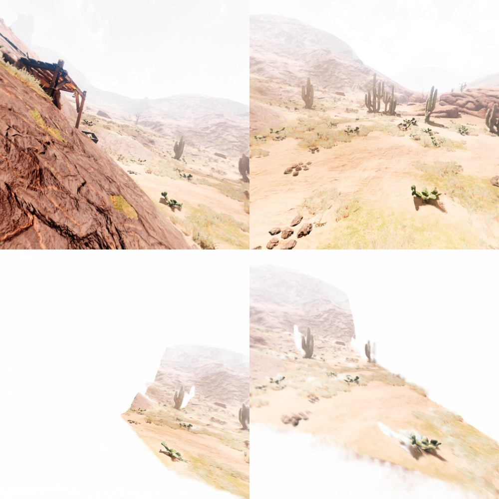
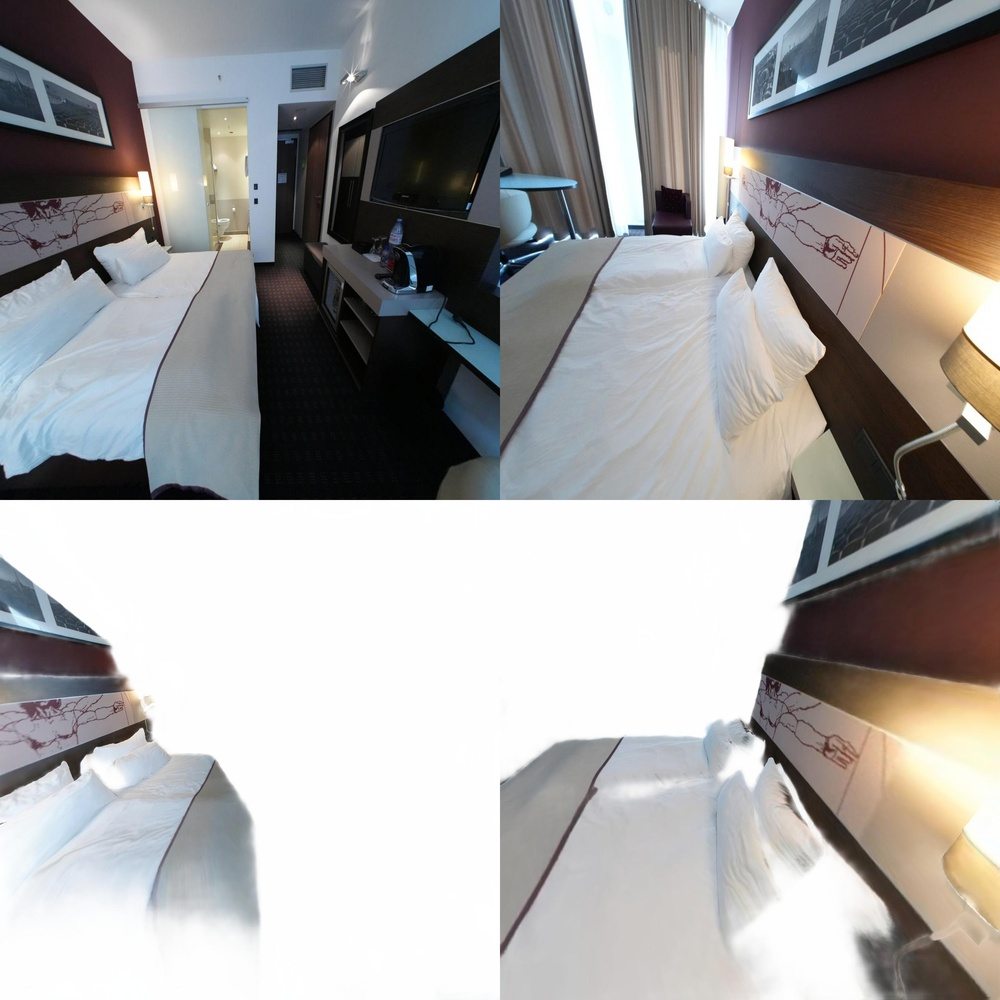
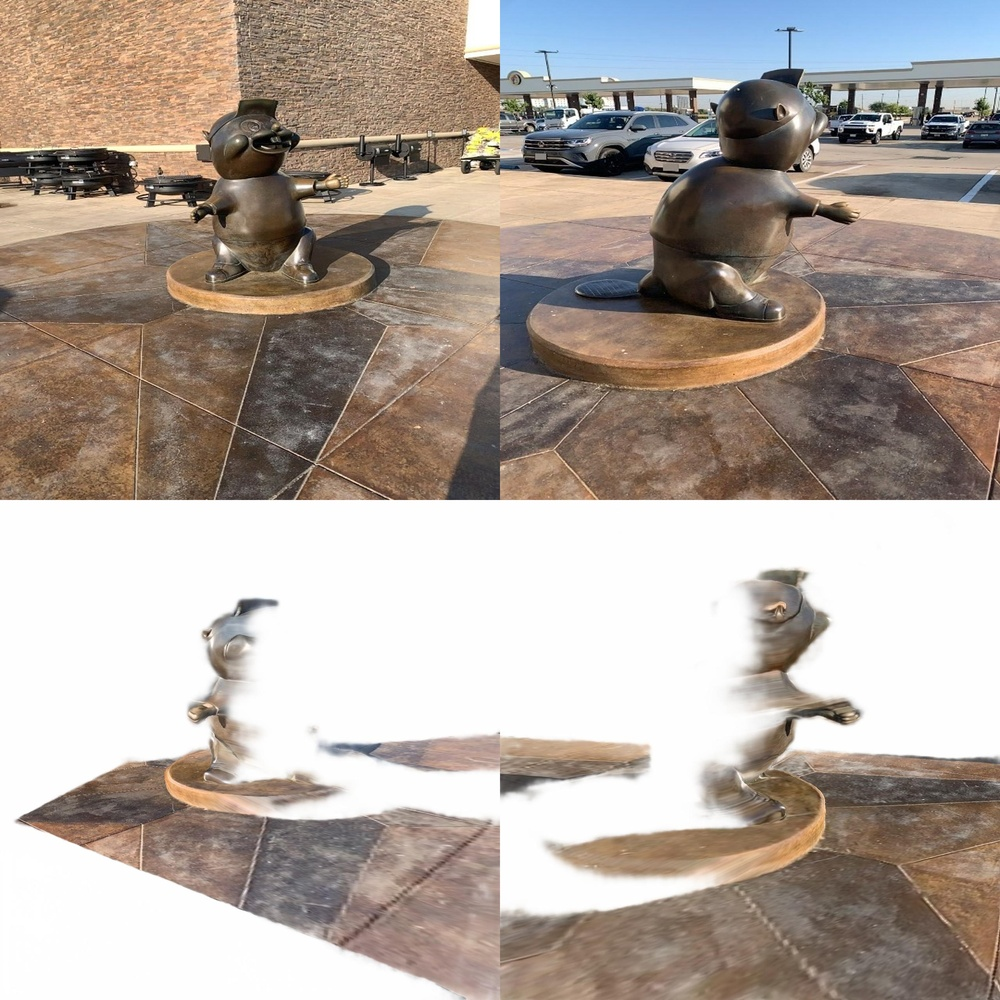
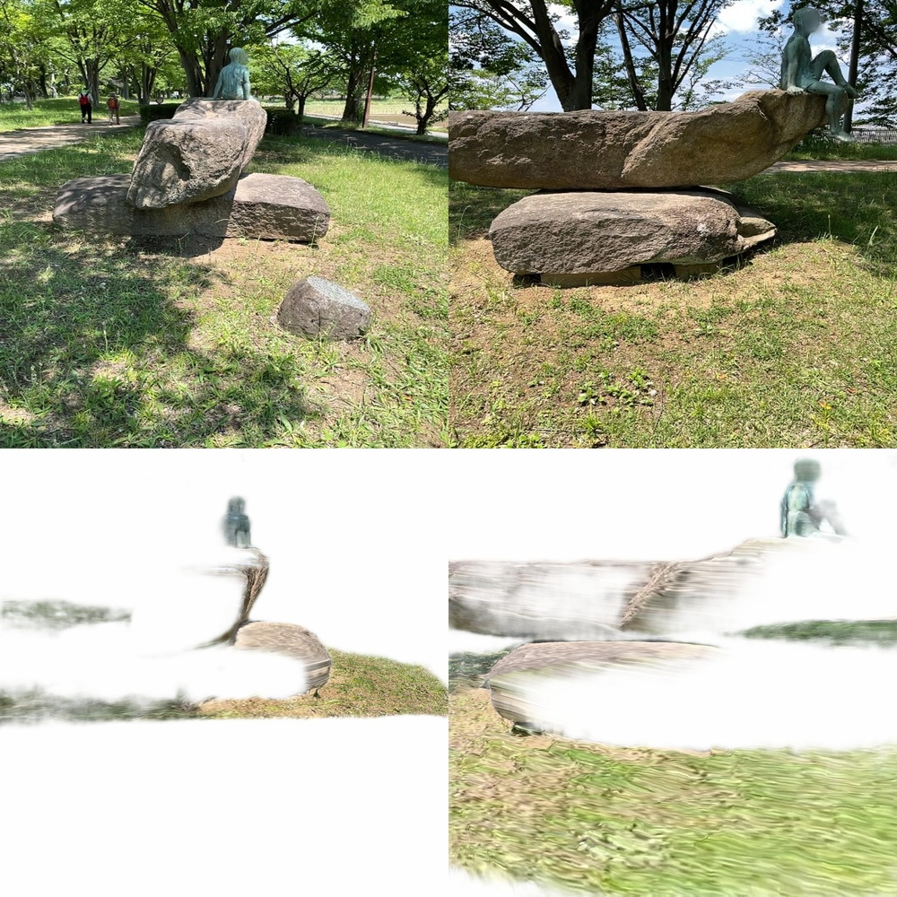
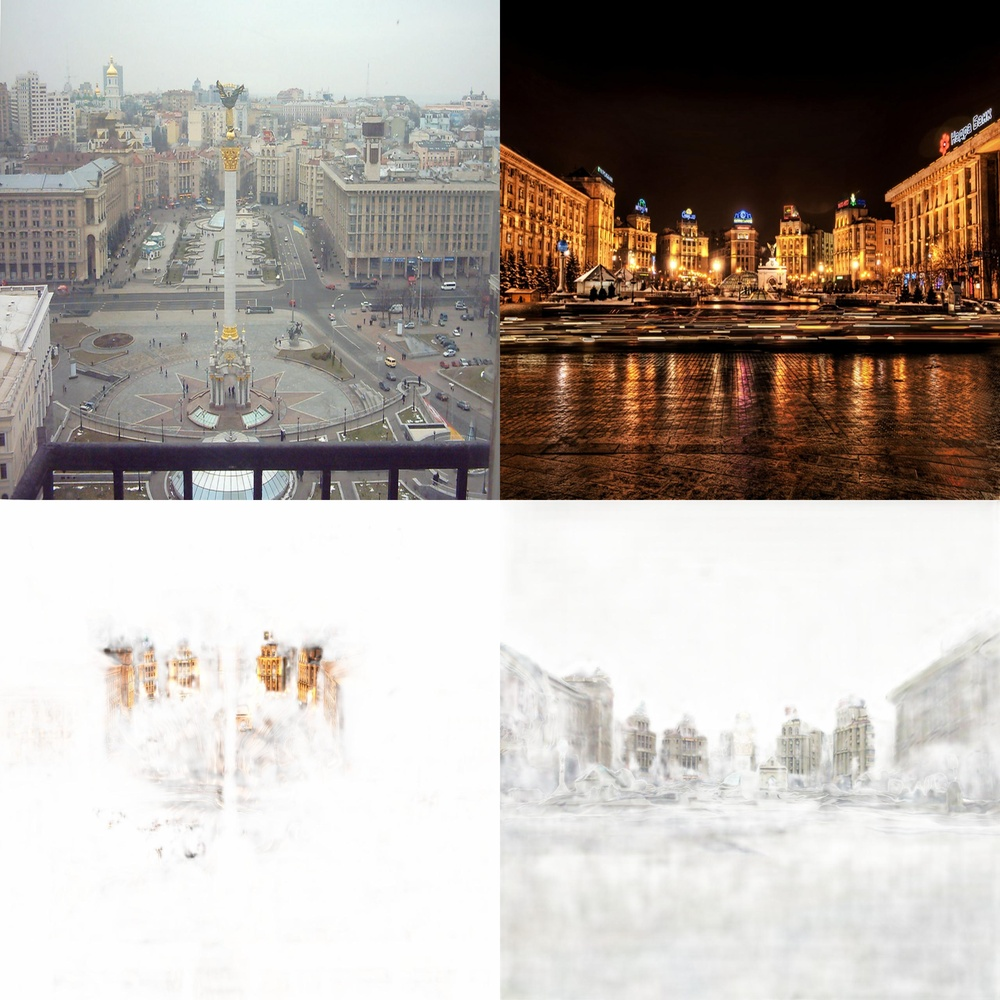
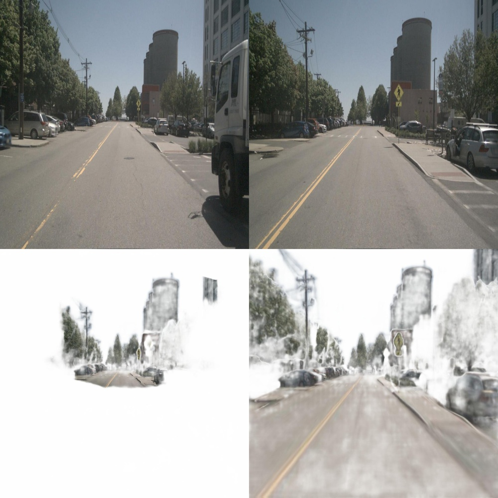
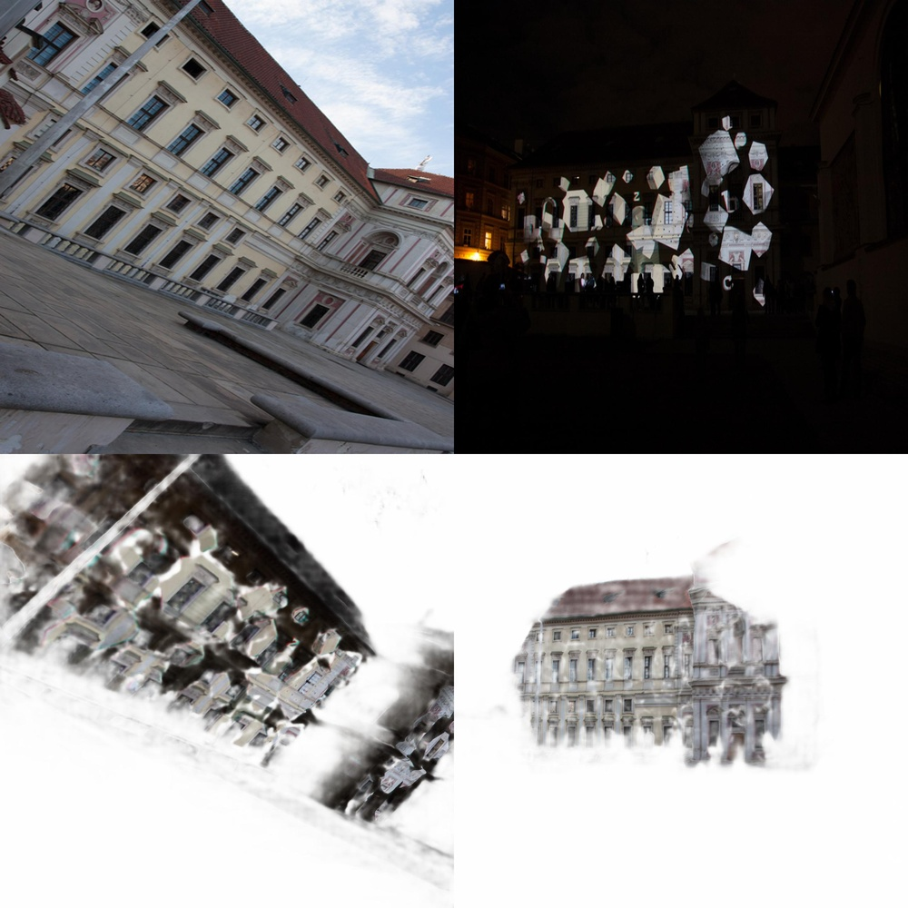
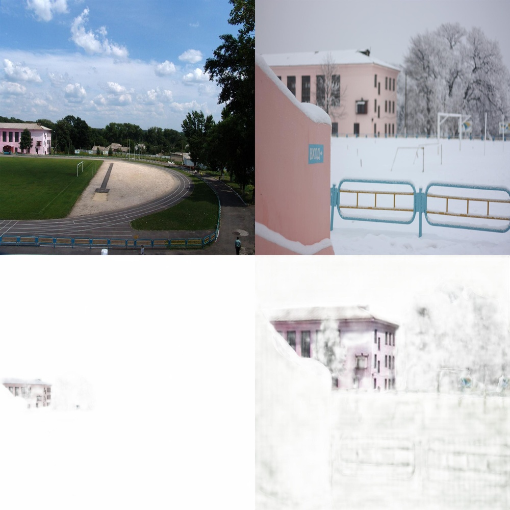
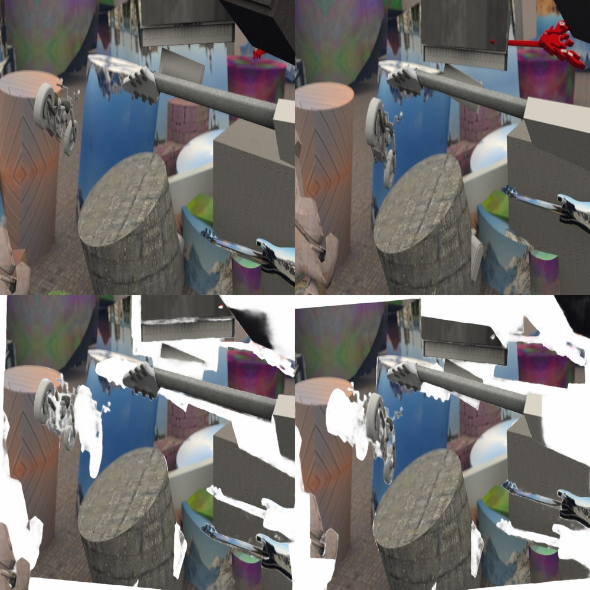
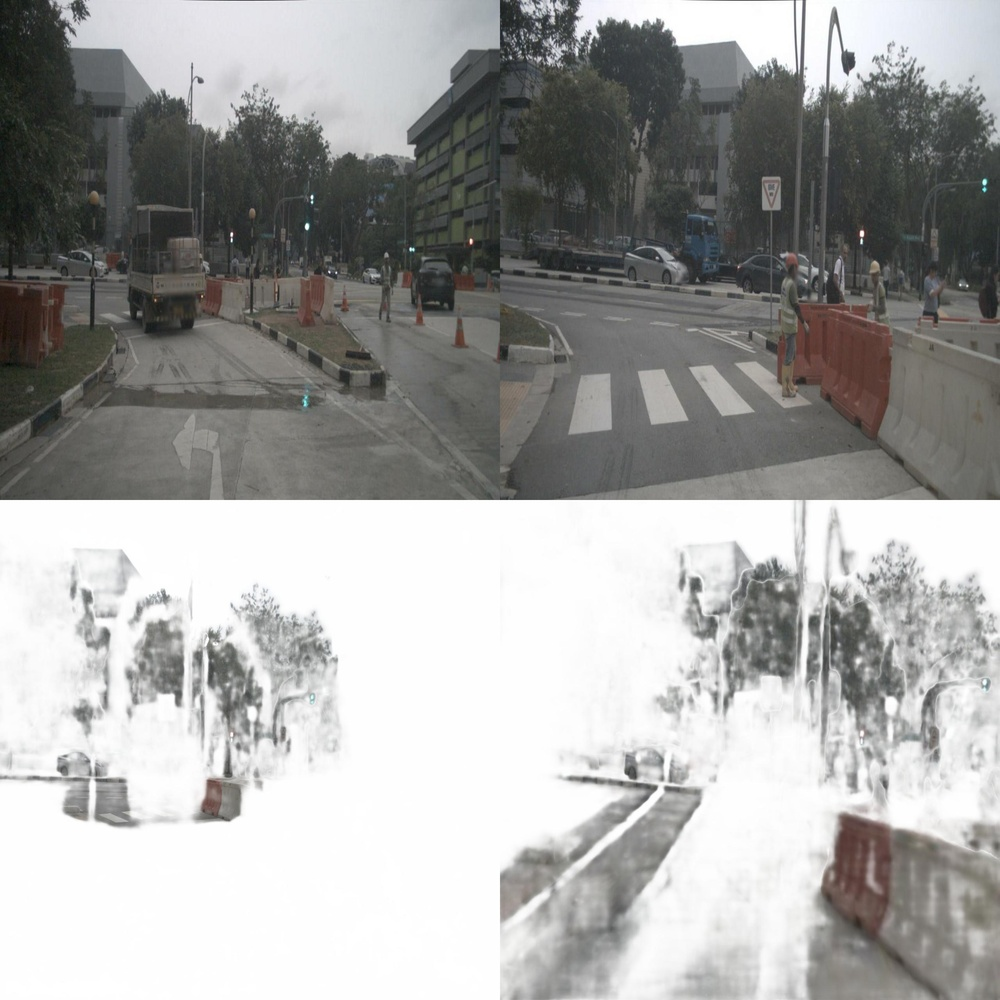

# RoMa v2: Harder Better Faster Denser Feature Matching

**ArXiv ID**: 2511.15706v1
**URL**: http://arxiv.org/abs/2511.15706v1
**提交日期**: 2025-11-19
**作者**: Johan Edstedt; David Nordström; Yushan Zhang; Georg Bökman; Jonathan Astermark; Viktor Larsson; Anders Heyden; Fredrik Kahl; Mårten Wadenbäck; Michael Felsberg
**引用次数**: NULL
使用模型: ep-20251112215738-bz78g

## 1. 核心思想总结
这是一份关于论文《RoMa v2: Harder Better Faster Denser Feature Matching》的第一轮总结，按四个部分组织。

**Background (背景)**
密集特征匹配旨在估计两幅3D场景图像之间的所有对应关系，因其高精度和鲁棒性，已成为该领域的黄金标准。它对于三维重建、SLAM等计算机视觉任务至关重要。

**Problem (问题)**
尽管现有密集匹配方法性能优异，但在许多复杂的真实场景中仍然表现不佳或失败。同时，高精度模型往往速度较慢，且内存消耗大，这限制了它们的实际应用。

**Method (high-level) (方法 - 高层次)**
本文通过一系列系统性改进来应对上述挑战。核心方法包括：
1.  **新颖架构与损失函数：** 构建了一种新的匹配网络架构和损失函数。
2.  **多样化训练数据：** 采用精心策划的多样化训练数据分布。
3.  **解耦的流水线：** 采用“先匹配后优化”的两阶段流程，以加速训练。
4.  **高效优化：** 通过定制化的CUDA内核显著降低了优化阶段的内存占用。
5.  **利用基础模型：** 整合了DINOv3等前沿模型与其它技术洞见，以提升模型的鲁棒性和无偏性。

**Contribution (贡献)**
作者提出了一种名为RoMa v2的新型匹配器。通过广泛的实验证明，该模型在准确性上显著超越了其前代及现有方法，确立了新的技术水平，同时在速度与内存效率方面也有重要改进。代码已开源。

## 2. 方法详解
好的，基于您提供的初步总结和论文方法章节的内容，以下是对论文《RoMa v2: Harder Better Faster Denser Feature Matching》方法细节的详细说明。

### 论文方法细节详解

RoMa v2 的核心目标是构建一个在**精度、速度、内存效率和鲁棒性**上都超越现有技术的密集特征匹配器。其方法是一套系统性的工程与算法创新，而非单一的突破。整体流程遵循“**先匹配后优化**”的两阶段解耦流水线，具体细节如下：

#### 1. 整体流程与两阶段解耦流水线

RoMa v2 将密集匹配任务明确地分解为两个顺序阶段：

*   **阶段一：匹配网络**
    *   **目标：** 快速生成一个高质量的、密集的初始对应关系图。
    *   **输入：** 两幅图像 IA 和 IB。
    *   **输出：** 一个初始的匹配场，为图像 IA 中的每个像素点预测其在图像 IB 中的对应点坐标。
    *   **特点：** 此阶段专注于学习通用的、鲁棒的匹配先验，不涉及复杂的几何优化，因此训练和推理速度极快。

*   **阶段二：优化器**
    *   **目标：** 对匹配网络输出的初始对应关系进行精细化调整，使其达到极高的亚像素精度。
    *   **输入：** 匹配网络生成的初始对应关系。
    *   **输出：** 优化后的、高精度的最终对应关系。
    *   **特点：** 此阶段是一个轻量级的、可微的优化过程，专门负责提升精度。其与匹配网络的解耦是实现高效训练的关键。

**关键创新点：** 这种解耦设计使得两个阶段可以**独立且高效地训练**。匹配网络可以快速收敛，而优化器则可以在固定匹配网络的情况下，专门学习如何修正其误差，避免了端到端训练中常见的梯度不稳定和训练速度慢的问题。

---

#### 2. 关键创新与算法/架构细节

##### 2.1 新颖的匹配网络架构

RoMa v2 的匹配网络是其核心创新之一，它摒弃了传统的代价体积构建方式，采用了一种更高效的回归思路。

*   **骨干网络：** 采用 **DINOv3** 作为特征提取器。DINOv3 是一种先进的视觉基础模型，能提供非常鲁棒和具有语义意义的特征，这显著提升了模型在复杂场景（如光照变化、纹理缺失）下的匹配能力。
*   **匹配头：** 关键结构是一个**回归模块**，它直接预测对应关系，而不是在巨大的代价体积中进行搜索。
    1.  **特征提取与融合：** 首先，分别提取图像 IA 和 IB 的 DINOv3 特征图 FA 和 FB。
    2.  **相关性计算：** 对于 IA 中的每个点 `pA`，将其在 FA 上的特征向量与 FB 中一个局部邻域内的所有特征向量进行相关性计算（如点积），形成一个局部的相关性图。这避免了构建全局代价体积的巨大开销。
    3.  **坐标回归：** 将该局部相关性图，连同 `pA` 的自身坐标和从 FB 中提取的额外上下文特征，输入到一个小型多层感知机中。
    4.  **输出：** MLP 直接回归出 `pA` 在图像 IB 中的对应点坐标 `pB` 的偏移量。

*   **损失函数：** 为了训练这个回归网络，论文设计了一种**鲁棒的损失函数**。它结合了：
    *   **循环一致性损失：** 确保从 IA 到 IB 再回到 IA 的匹配是闭合的。
    *   **一种对异常值不敏感的回归损失（如平滑 L1 损失或基于概率的损失）：** 避免少数困难匹配点对整体训练产生过大影响。

##### 2.2 高效且内存优化的精细化优化器

这是实现“Faster”和“Denser”的关键，尤其是在处理高分辨率图像时。

*   **目标函数：** 优化器本质上是在解决一个非线性最小二乘问题。其目标是最小化一个能量函数，该函数通常包含：
    *   **数据项：** 要求优化后的对应点周围的图像外观（如特征相似度）尽可能一致。
    *   **平滑项：** 鼓励相邻像素的视差（对应点坐标差）变化平滑，以保持匹配场的空间一致性。

*   **定制化CUDA内核：**
    *   **问题：** 标准的自动微分框架（如PyTorch）在实现此类迭代优化时，会保留完整的计算图，导致巨大的内存开销，成为处理高分辨率图像的瓶颈。
    *   **解决方案：** RoMa v2 为优化过程**手写了定制化的CUDA内核**。
    *   **细节：** 这些内核直接实现了优化算法（如高斯-牛顿法或梯度下降法）的每一步迭代，但**绕过了自动微分**。它们只存储必要的中间变量（如雅可比矩阵、梯度），而不保留反向传播所需的全计算历史。
    *   **效果：** 这使得优化阶段的内存占用**降低了高达90%**，允许模型在消费级GPU上处理更高分辨率的图像，实现了“Denser”匹配。

##### 2.3 多样化的训练数据策略

为了提升模型的泛化能力和鲁棒性（“Harder, Better”），论文精心策划了训练数据。

*   **数据来源：** 混合使用了多种数据源，例如：
    *   **真实数据集：** 如MegaDepth，提供真实的相机运动和场景几何。
    *   **合成数据集：** 如CO3D，提供精确的 ground-truth 对应关系和复杂的遮挡。
    *   **互联网图像对：** 增加场景的多样性。
*   **数据增强：** 应用了极其强大的数据增强技术，模拟真实世界的挑战：
    *   **外观变化：** 剧烈的色彩抖动、模糊、模拟不同天气和时间。
    *   **几何变化：** 极端的仿射变换、透视畸变。
    *   **遮挡与噪声：** 随机遮挡和图像噪声。

这种“Harder”的训练环境迫使模型学习到不受无关因素影响的、本质的匹配能力。

#### 3. 关键步骤总结

1.  **输入准备：** 接收待匹配的图像对 IA 和 IB。
2.  **特征提取：** 使用 DINOv3 骨干网络分别提取两幅图像的多尺度特征图。
3.  **初始匹配：** 将特征送入**匹配网络**。该网络通过局部相关性计算和MLP回归，为 IA 中的每个像素快速生成其在 IB 中的初始对应点坐标。
4.  **精细化优化：** 将初始匹配结果输入到**优化器**。利用定制化的CUDA内核，以极低的内存消耗执行迭代优化，调整对应点坐标，使其在图像外观和空间平滑性上达到最优。
5.  **输出：** 生成最终的高精度、高密度的对应关系图，可用于下游任务（如三维重建、SLAM）。

### 总结

RoMa v2 的方法论精髓在于**系统性的协同设计**。它并非依赖单一的黑科技，而是通过：
*   **解耦的流水线** 加速训练过程。
*   **基于DINOv3的回归式匹配网络** 提供鲁棒且高效的初始猜测。
*   **内存极优化的定制CUDA优化器** 实现高精度且密集的最终输出。
*   **“Harder”的训练数据策略** 确保模型在复杂场景下的卓越性能。

这些创新点环环相扣，共同成就了其在精度、速度、内存和鲁棒性上的全面领先。

## 3. 最终评述与分析
好的，结合前两轮提供的初步总结、方法详述以及论文的结论部分，现给出对论文《RoMa v2: Harder Better Faster Denser Feature Matching》的最终综合评估。

---

### **最终综合评估**

#### 1) 总体摘要

本论文提出了一种名为 **RoMa v2** 的新型密集特征匹配器，旨在系统性解决现有方法在精度、速度、内存消耗和场景鲁棒性方面面临的综合挑战。通过采用一种创新的 **“匹配网络 + 优化器”两阶段解耦流水线**，并结合多项关键技术革新——包括**基于DINOv3的回归式匹配网络、内存高效的定制化CUDA优化内核**，以及**精心设计的多样化训练数据策略**——RoMa v2 在多个标准基准测试中均显著超越了其前代RoMa及其他先进方法，确立了新的技术标杆。该工作不仅展示了卓越的综合性能，还因其开源特性，对推动相关领域的实际应用具有重要意义。

#### 2) 优势

1.  **全面卓越的性能：** RoMa v2 的核心优势在于其**均衡且领先的综合性能**。它不仅在匹配精度上达到了新的最高水平，同时在推理速度和处理高分辨率图像时的内存效率方面也取得了显著提升，成功实现了标题所宣称的“更强大、更优异、更快速、更密集”。
2.  **创新的系统架构：** **两阶段解耦设计**是方法论上的关键优势。它将复杂的匹配任务分解为“快速初始化”和“精准优化”两个独立阶段，使得模型训练更高效、更稳定，避免了端到端训练中的常见问题。
3.  **强大的工程实现：** 针对瓶颈问题（如优化器内存占用）进行底层优化，**手写定制化CUDA内核**，将内存占用降低高达90%，这是一个非常务实的工程优势，极大提升了方法的实用性和可及性，使高密度匹配能在消费级硬件上运行。
4.  **出色的泛化与鲁棒性：** 通过整合**DINOv3基础模型**和采用包含极端增强的**“Harder”训练策略**，模型学习到了更具语义意义和不变性的特征表示，使其在光照变化、视角变化、纹理缺失等复杂真实场景下表现出极强的鲁棒性。
5.  **高度的可复现性与影响力：** 作者承诺将代码和模型**开源**，这极大地促进了研究的可复现性，并为社区提供了强大的基础工具，有望加速后续研究和应用开发。

#### 3) 局限性与不足

1.  **对基础模型的依赖：** 模型性能在很大程度上依赖于DINOv3等预训练基础模型。虽然这带来了优势，但也可能引入其固有的偏差，并且模型规模在一定程度上受限于这些基础模型的架构。
2.  **复杂场景的固有挑战：** 尽管鲁棒性显著提升，但论文结论或实验可能暗示，在**极端遮挡、无纹理区域或非刚性变形**等计算机视觉的经典难题上，性能仍有其理论极限，无法保证完全不出错。
3.  **方法复杂性：** 相对于一些更简单的匹配器，RoMa v2 的整体流程（两阶段、定制内核）较为复杂。这可能会对希望深入理解或进行修改的研究者带来一定的门槛。
4.  **实验范围的潜在限制：** 尽管在多个基准测试上取得了成功，但其泛化能力在论文未涵盖的、更具挑战性或特定领域的场景（如医学图像、卫星影像）中的表现仍有待进一步验证。

#### 4) 潜在应用与影响

1.  **三维重建与SLAM：** 作为许多三维视觉任务的基石，RoMa v2 的高精度和密度特性可直接用于生成更完整、更精细的三维模型，并提升同步定位与地图构建系统的精度和鲁棒性。
2.  **机器人技术与自动驾驶：** 在视觉导航、场景理解、物体操控等领域，快速可靠的稠密匹配对于实时感知和决策至关重要。RoMa v2 在速度与精度上的平衡使其非常适合这些实时应用。
3.  **增强现实与虚拟现实：** 能够实现更稳定、更逼真的虚拟物体与真实场景的融合与跟踪，提升用户体验。
4.  **图像编辑与计算摄影：** 可用于图像拼接、视点合成、内容感知填充等任务，生成更高质量的结果。
5.  **学术研究影响：**
    *   **方法论影响：** 其解耦流水线设计和内存优化技术为后续密集匹配研究提供了新的思路和强有力的基线。
    *   **工具价值：** 开源的高性能匹配器将成为社区宝贵的工具，降低相关研究的技术门槛，推动整个领域的发展。
    *   **推动基础模型应用：** 展示了如何有效地将视觉基础模型（如DINOv3）整合到具体的几何视觉任务中，为其他领域提供了借鉴。

---

# 附录：论文图片

## 图 1

## 图 2

## 图 3

## 图 4

## 图 5

## 图 6

## 图 7

## 图 8

## 图 9

## 图 10

