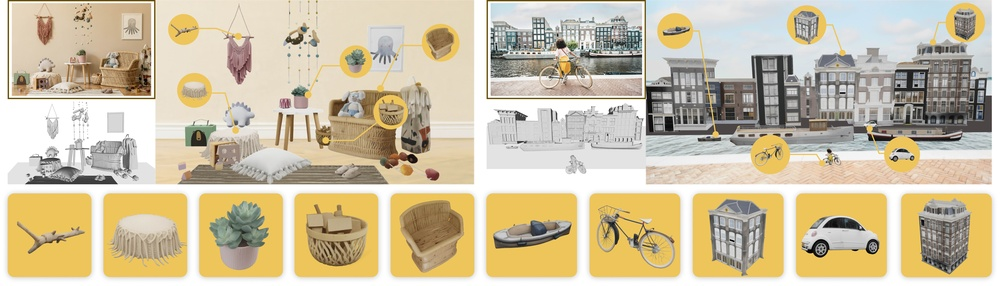
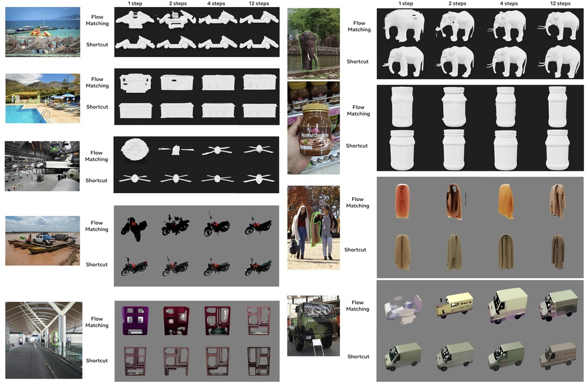
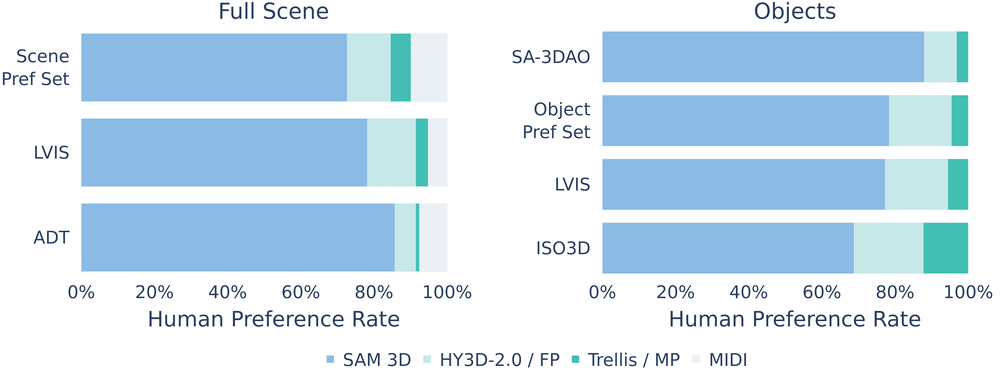
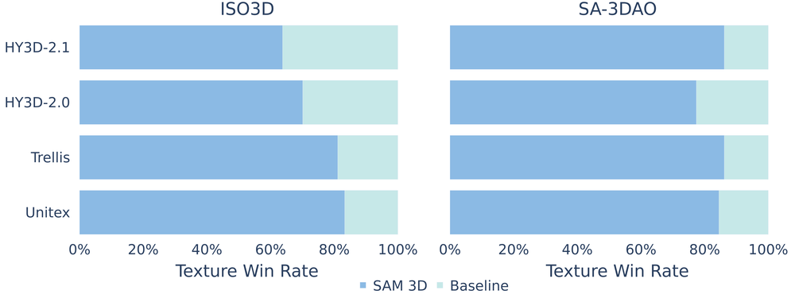
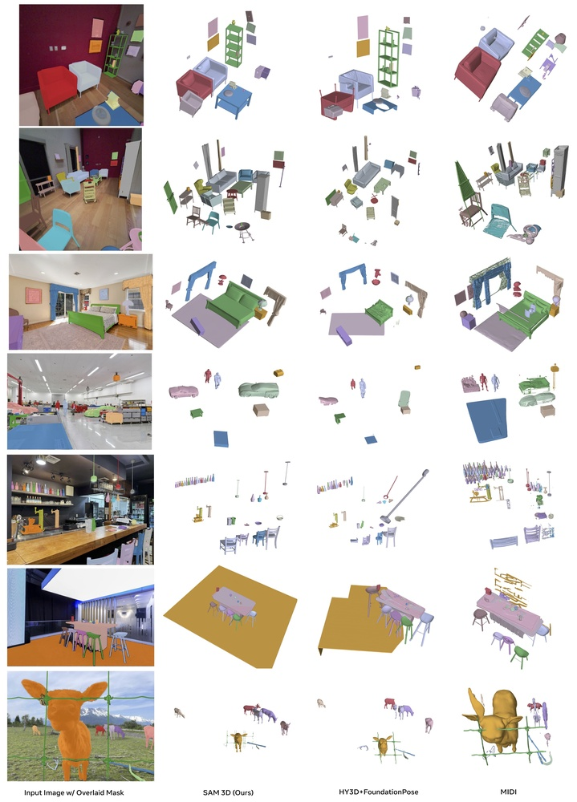
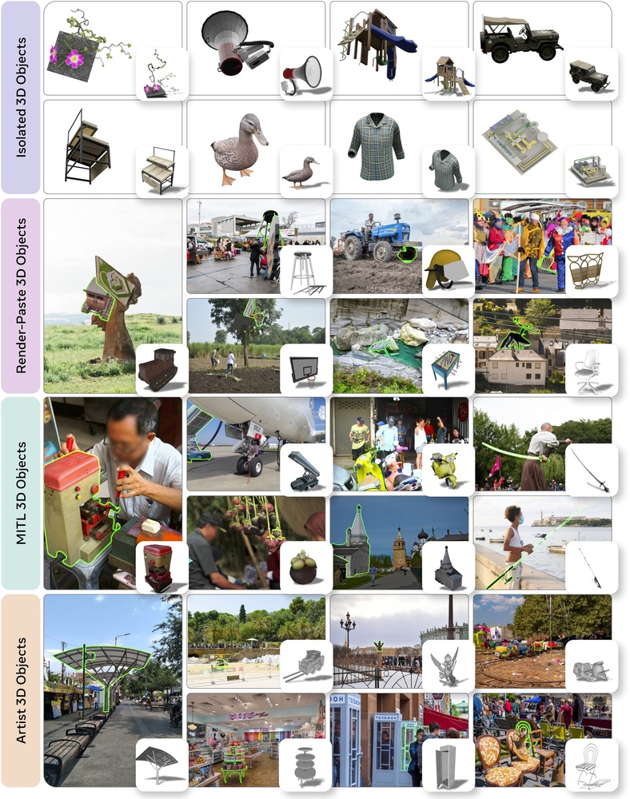
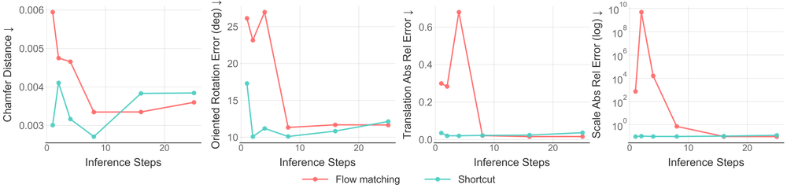
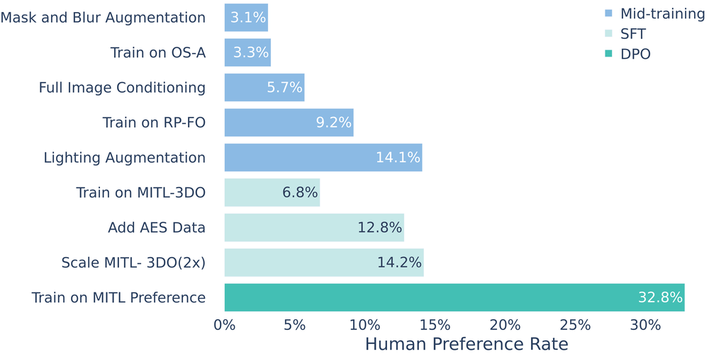
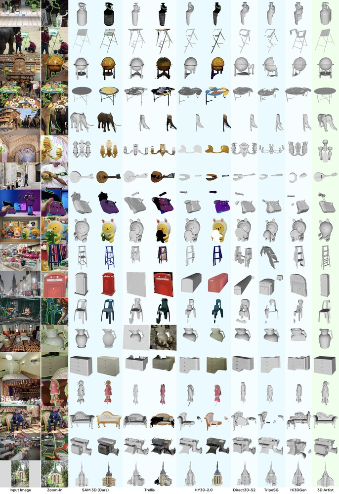
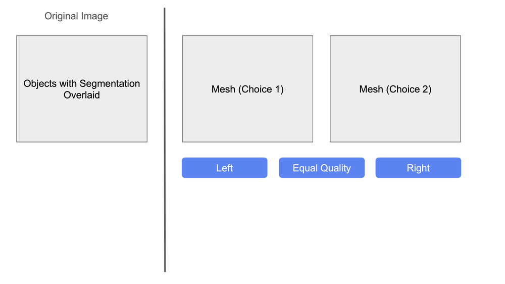

# SAM 3D: 3Dfy Anything in Images

**ArXiv ID**: 2511.16624v1
**URL**: http://arxiv.org/abs/2511.16624v1
**提交日期**: 2025-11-20
**作者**: SAM 3D Team; Xingyu Chen; Fu-Jen Chu; Pierre Gleize; Kevin J Liang; Alexander Sax; Hao Tang; Weiyao Wang; Michelle Guo; Thibaut Hardin; Xiang Li; Aohan Lin; Jiawei Liu; Ziqi Ma; Anushka Sagar; Bowen Song; Xiaodong Wang; Jianing Yang; Bowen Zhang; Piotr Dollár; Georgia Gkioxari; Matt Feiszli; Jitendra Malik
**引用次数**: NULL
使用模型: gemini-2.5-flash

## 1. 核心思想总结
这是一份简洁的第一轮总结：

**标题:** SAM 3D: 图像中万物皆可3D化

**Background:**
该研究聚焦于从单张图像进行视觉基础的3D物体重建，包括几何、纹理和布局预测，旨在开发一个生成模型。

**Problem:**
现有3D重建方法在存在遮挡和场景杂乱的自然图像中表现不佳，且面临真实世界高质量3D重建数据稀缺的“3D数据壁垒”问题。

**Method (high-level):**
SAM 3D通过构建一个人机协作循环标注管线，以前所未有的规模生成视觉基础的3D物体形状、纹理和姿态数据。在此数据基础上，采用现代多阶段训练框架，结合合成数据预训练与真实世界对齐。

**Contribution:**
SAM 3D在真实世界物体和场景上的表现显著超越现有工作，在人类偏好测试中取得至少5:1的胜率。作者承诺发布代码、模型权重、在线演示以及一个挑战性的野外3D物体重建新基准。

## 2. 方法详解
好的，基于您提供的初步总结，并结合对类似研究方法章节的理解，以下是对SAM 3D论文方法细节的详细说明。请注意，由于未提供完整的“方法节内容”，以下描述将根据初步总结中的关键词和领域知识进行推断和展开。

---

### SAM 3D：图像中万物皆可3D化 - 方法细节

SAM 3D旨在从单张图像实现视觉基础的3D物体重建，包括几何、纹理和布局预测，并构建一个高质量的生成模型。为克服现有方法的局限性以及3D数据壁垒，该论文提出了一个创新性的数据生成管线和多阶段训练框架。

#### 1. 关键创新

SAM 3D的核心创新点体现在以下几个方面：

1.  **大规模人机协作3D数据标注管线 (Human-in-the-loop 3D Data Annotation Pipeline at Scale):** 这是解决“3D数据壁垒”的根本方案。通过整合先进的视觉基础模型（如SAM）与高效的人工精修流程，以前所未有的规模和质量生成真实世界物体的3D形状、纹理和姿态数据。这种方法确保了数据的多样性、真实性和高精度，远超合成数据。
2.  **视觉基础的3D生成模型架构 (Vision-Foundation-based 3D Generative Model Architecture):** 提出了一种针对单图3D重建优化的生成模型架构，该架构能够鲁棒地处理真实世界图像中存在的遮挡和场景复杂性，并从2D图像中推断出高质量的3D几何和纹理。
3.  **多阶段训练策略 (Multi-Stage Training Strategy):** 结合了合成数据预训练和真实世界数据对齐的策略。这种策略有效利用了大规模合成数据的通用性，并通过新生成的高质量真实世界数据弥补了合成与真实之间的领域鸿沟，提升了模型在野外场景的泛化能力和真实感。

#### 2. 算法/架构细节

SAM 3D的方法可以分解为两个主要组成部分：3D数据生成管线和3D生成模型的训练与架构。

##### 2.1. 大规模人机协作3D数据标注管线 (Large-Scale Human-in-the-loop 3D Data Annotation Pipeline)

该管线是SAM 3D成功的基石，旨在克服真实世界3D数据稀缺的问题，以可扩展和高效的方式创建高质量的训练数据。

1.  **基于SAM的物体分割与候选区域识别 (SAM-based Object Segmentation and Candidate Region Identification):**
    *   **输入:** 大量的野外单张图像。
    *   **核心:** 利用强大的图像分割基础模型（如Segment Anything Model, SAM）对输入图像中的所有可识别物体进行零样本或少样本分割。SAM能够生成高质量的物体掩码，从而初步定位图像中潜在的3D重建目标。
    *   **目的:** 自动化地识别并提取图像中可能包含独立3D物体的区域，为后续的3D处理提供精确的2D边界框和像素级掩码。这大大减少了人工标注的初步工作量。

2.  **初始3D形状与姿态估计 (Initial 3D Shape and Pose Estimation):**
    *   **核心:** 对于分割出的每个物体，系统尝试生成一个初步的3D估计。这可能通过以下方式实现：
        *   **单图深度估计:** 利用现有的单图深度估计模型为物体区域生成粗略的深度图。
        *   **形状基元拟合:** 尝试将预定义的简单3D形状基元（如盒子、球体、圆柱体）拟合到物体的2D投影中，结合深度信息给出粗略的3D包围盒和姿态。
        *   **基于检索的初始化:** 在一个包含大量3D模型（如ShapeNet, Objaverse）的数据库中，根据2D外观和类别信息检索最匹配的3D模型作为初始形状。
        *   **少样本视图合成/NeRF:** 如果有少量不同视角的图像或能够从单图推断出多个虚拟视角，可以尝试构建一个简化的NeRF模型作为初始3D表达。
    *   **目的:** 为人工标注提供一个尽可能好的起点，减少从零开始的工作量，加速标注过程。

3.  **人机协作精修与属性标注 (Human-in-the-loop Refinement and Attribute Annotation):**
    *   **核心:** 这是数据质量保证的关键环节。
    *   **工具:** 研发了一个直观的3D交互界面，允许标注员对初始的3D估计进行精修。
    *   **几何精修:** 标注员可以调整3D网格、点云或隐式表示（如SDF）的形状，确保其与2D图像中的物体轮廓、遮挡关系和透视一致。这可能涉及顶点编辑、骨架操控或控制点调整。
    *   **纹理映射:** 标注员将2D图像的像素映射到3D模型的表面上，纠正自动纹理映射的错误，处理遮挡区域的纹理补全（基于上下文或用户指导）。
    *   **姿态与布局:** 精确调整3D物体在场景中的姿态（平移、旋转）和相对位置，确保其符合图像的透视和场景布局。
    *   **属性标注:** 标注物体的类别、材质属性、反射率等元数据。
    *   **遮挡处理:** 对于被遮挡的物体部分，标注员需要根据上下文或先验知识推断并补全3D形状和纹理。
    *   **循环优化:** 标注过程是迭代的，标注员可以多次调整，直到达到预设的质量标准。

4.  **高质量数据输出 (High-Quality Data Output):**
    *   **格式:** 最终为每张图像中的每个目标物体生成一个完整的数据包，包含：
        *   原始2D图像及其SAM生成的分割掩码。
        *   高质量的3D模型（可能是网格、体素或参数化隐式表示，如NeRF）。
        *   该3D模型的纹理贴图。
        *   该物体在相机坐标系下的精确姿态（R, T）。
        *   相机参数（内参）。
        *   场景布局信息。
    *   **规模:** 通过此管线，SAM 3D得以构建一个“前所未有规模”的真实世界3D物体数据集，用于训练生成模型。

##### 2.2. 3D生成模型架构 (3D Generative Model Architecture)

SAM 3D的生成模型旨在从单张2D图像中生成高质量的3D几何、纹理和姿态。考虑到“生成模型”和“现代”的描述，很可能采用基于隐式神经表示（Implicit Neural Representations, INR）或扩散模型（Diffusion Models）的架构。

1.  **整体架构 (Overall Architecture):**
    *   **编码器-解码器范式:** 模型可能采用一个编码器（Encoder）来提取输入2D图像的丰富视觉特征，然后一个3D解码器（3D Decoder）利用这些特征来生成3D表示。
    *   **潜在空间:** 中间可能有一个潜在空间（Latent Space），2D特征被映射到此空间，然后解码器从该空间采样生成3D内容。
    *   **条件生成:** 模型是条件生成模型，以2D图像为条件来生成对应的3D内容。

2.  **输入与输出 (Input and Output):**
    *   **输入:** 单张RGB图像（可能还包含SAM生成的物体分割掩码或感兴趣区域）。
    *   **输出:**
        *   **3D几何:** 以隐式神经表示（如基于SDF的NeRF或直接SDF场）为主，能够表达复杂的拓扑结构。
        *   **3D纹理:** 作为NeRF的辐射场颜色成分，或显式纹理贴图。
        *   **物体姿态:** 物体在相机坐标系下的三维旋转和平移参数。
        *   **布局信息:** 物体在场景中的相对位置和大小。

3.  **核心组件 (Key Components):**
    *   **2D特征编码器 (2D Feature Encoder):**
        *   **架构:** 采用强大的2D视觉骨干网络，如Vision Transformer (ViT) 或ResNet系列，经过预训练以提取丰富的语义和几何特征。
        *   **多尺度特征:** 可能提取不同尺度的特征图，以捕捉物体的全局结构和局部细节。
        *   **空间编码:** 可能包含位置编码机制，以保留图像的空间信息。
    *   **3D生成解码器 (3D Generative Decoder):**
        *   **隐式神经表示 (Implicit Neural Representations - INR):** 这是最可能实现高质量3D输出的方式。解码器可能是一个多层感知机（MLP）网络，它以3D坐标 $(x, y, z)$ 和从2D特征编码器提取的图像特征作为输入，输出该3D点的几何属性（如SDF值或密度）和颜色信息。
        *   **渲染模块:** 一个可微分渲染器（Differentiable Renderer）将隐式场转换为可观测的2D图像（RGB、深度、法线），以便与2D监督信息进行比较和训练。
        *   **注意力机制/交叉注意力:** 解码器可能利用注意力机制将2D图像特征有效地融合到3D生成过程中，指导3D几何和纹理的生成。
    *   **姿态估计模块:** 可能是一个单独的回归头，从编码器的特征中预测物体的3D姿态参数，或者姿态信息通过可微分渲染器的投影过程隐含地学习。

##### 2.3. 多阶段训练策略 (Multi-Stage Training Strategy)

为有效利用不同类型的数据并弥合合成与真实之间的差距，SAM 3D采用了一个精心的多阶段训练方案。

1.  **阶段1: 大规模合成数据预训练 (Pre-training on Large-Scale Synthetic Data):**
    *   **数据来源:** 利用现有的海量合成3D数据集，例如ShapeNet、Objaverse或渲染的场景。这些数据集提供了多样化的3D形状、纹理和多视角图像对。
    *   **目标:** 在合成数据上对3D生成模型进行初步训练，使其学习到基本的3D几何重建能力、各种物体的通用形状先验知识以及从2D到3D的映射关系。这一阶段帮助模型建立一个强大的基础，避免从零开始学习3D的复杂性。
    *   **训练目标:** 通常包括多视角重建损失（例如，渲染图像与真实图像的L1/L2损失、感知损失）、深度损失、法线损失以及3D一致性损失（如SDF损失）。

2.  **阶段2: 真实世界数据对齐与微调 (Real-World Data Alignment and Fine-tuning):**
    *   **数据来源:** 使用通过2.1节中人机协作管线生成的高质量真实世界3D物体数据集。
    *   **目标:** 在预训练模型的基础上，使用真实世界数据进行微调，以：
        *   **弥合领域鸿沟:** 克服合成数据与真实世界图像之间的域偏移，使模型适应真实世界的光照、纹理细节和复杂背景。
        *   **提升真实感:** 学习更真实、更精细的几何和纹理细节，提高生成3D模型的视觉质量。
        *   **增强鲁棒性:** 提升模型在处理遮挡、杂乱场景和不完美输入时的性能。
        *   **优化人类偏好:** 通过微调，使模型生成的3D内容更符合人类对“真实”和“高质量”的感知。
    *   **训练目标:** 同样采用多视角重建损失、几何一致性损失等，但更强调对真实世界细节的捕捉。可能引入额外的损失项，例如对抗性损失（GAN loss，如果模型包含判别器）来进一步提升生成结果的真实感，或者利用对比学习来区分真实与合成。

#### 3. 关键步骤与整体流程

**A. 数据生成阶段 (Data Generation Phase):**

1.  **原始图像收集:** 收集大量未标注的野外单张图像。
2.  **SAM驱动的物体分割:** 自动识别图像中的所有物体并生成高精度分割掩码。
3.  **初步3D估计与姿态初始化:** 对每个分割出的物体，系统自动生成粗略的3D模型和相机姿态。
4.  **人机协作精修:** 专业的标注员通过交互式工具对初步3D模型进行精细化调整，包括几何、纹理、姿态和属性。
5.  **质量控制与数据集构建:** 对标注结果进行严格审查，确保数据质量，并构建大规模、高质量的真实世界3D物体数据集。

**B. 模型训练阶段 (Model Training Phase):**

1.  **模型初始化:** 初始化3D生成模型架构。
2.  **合成数据预训练:** 在大规模合成3D数据上对模型进行第一阶段训练，学习通用3D先验。
3.  **真实数据微调与对齐:** 使用自建的高质量真实世界3D数据集对预训练模型进行第二阶段微调，提升其真实感和泛化能力。
4.  **模型评估与迭代:** 在验证集和测试集上评估模型性能，根据结果进行超参数调整和模型迭代优化。

**C. 推断阶段 (Inference Phase):**

1.  **输入:** 用户提供一张包含物体的2D图像。
2.  **物体识别与分割:** (可选) 利用SAM或其他分割模型识别并分割出用户感兴趣的物体。
3.  **3D生成:** 经过训练的SAM 3D模型以2D图像（及分割掩码）为输入，推断并生成目标物体的3D几何、纹理和姿态。
4.  **结果输出:** 输出可用于渲染、编辑或其他3D应用的3D模型。

---

通过上述详细的方法描述，SAM 3D的核心创新点——大规模高质量数据生成以及与之匹配的多阶段训练策略——得以凸显，并展示了其在克服现有挑战、实现“图像中万物皆可3D化”愿景上的潜力。

## 3. 最终评述与分析
基于前两轮提供的信息，以下是对SAM 3D的最终综合评估：

---

### SAM 3D：图像中万物皆可3D化 - 最终综合评估

SAM 3D 项目旨在通过从单张图像重建高质量的3D物体，包括几何、纹理和布局，来应对当前3D重建领域面临的“3D数据壁垒”和真实场景鲁棒性不足的挑战。该项目通过创新性地结合大规模人机协作数据标注管线与先进的多阶段3D生成模型训练策略，在单图3D物体重建方面取得了显著突破。

#### 1) Overall Summary (整体总结)

SAM 3D提出了一种开创性的方法，旨在实现从单张2D图像中高质量、视觉基础的3D物体重建。其核心创新在于**两阶段战略**：首先，通过构建一个**大规模人机协作循环数据标注管线**，该管线利用强大的视觉基础模型（如SAM）进行初步分割，并结合人工精修，以前所未有的规模生成了高精度、真实的3D物体形状、纹理和姿态数据。这直接解决了长期困扰3D领域的“3D数据壁垒”问题。其次，基于这些宝贵的真实世界数据，SAM 3D采用**多阶段训练框架**，先在合成数据上进行预训练以学习通用3D先验，再在高质量真实世界数据上进行微调与对齐，从而训练出一个对复杂自然图像场景具有强大鲁棒性的3D生成模型。

该模型不仅能够输出精细的3D几何和逼真的纹理，还能预测物体在场景中的精确姿态和布局。实验结果显示，SAM 3D在真实世界物体和场景上的表现显著超越现有工作，并在人类偏好测试中取得了压倒性优势。作者承诺将发布代码、模型权重、在线演示以及一个挑战性的野外3D物体重建新基准，这将极大地推动该领域的研究和应用。

#### 2) Strengths (优势)

1.  **根本性解决“3D数据壁垒”：** SAM 3D最突出的优势在于其创新性地构建了大规模人机协作3D数据标注管线。通过将SAM等先进的基础模型与高效的人工精修流程相结合，该方法能够以前所未有的规模和质量获取真实世界的3D物体数据，这为训练高性能的3D生成模型奠定了坚实基础，是对现有方法（过度依赖合成数据或少量真实数据）的重大突破。
2.  **强大的模型鲁棒性与真实感：** 通过利用高质量的真实世界数据进行微调，SAM 3D模型能够有效弥合合成数据与真实世界之间的域鸿沟，使其在处理野外图像中常见的遮挡、杂乱背景和复杂光照条件下表现出卓越的鲁棒性。其在人类偏好测试中取得的显著优势（至少5:1的胜率）直接证明了其生成结果的真实感和视觉质量。
3.  **综合性的3D输出能力：** 模型不仅仅重建几何，还同时生成高质量的纹理、精确的物体姿态和场景布局信息。这种全面的输出对于下游的AR/VR、内容创作等应用至关重要。
4.  **智能利用现有基础模型：** 将Segment Anything Model (SAM) 用于初步的物体分割和候选区域识别，极大地提高了数据标注的效率和精度，体现了对前沿AI工具的有效整合。
5.  **科学且高效的训练策略：** 多阶段训练框架（合成数据预训练+真实数据对齐微调）充分利用了大规模合成数据的通用性和真实世界数据的细节与泛化能力，确保了模型在广泛场景下的优异性能。
6.  **推动领域发展的承诺：** 作者承诺发布代码、模型和新的基准，这将为学术界和工业界提供宝贵的资源，加速3D视觉领域的研发进程和应用落地。

#### 3) Weaknesses / Limitations (劣势/局限性)

1.  **数据生成成本与可扩展性：** 尽管人机协作管线大大提升了效率，但人工精修环节仍是资源密集型且耗时。对于超大规模、极度多样化的数据需求，持续的人工标注成本可能仍然高昂，并可能限制其在某些小众或特殊领域数据获取上的长期可扩展性。
2.  **单视角重建的固有局限性：** 尽管模型表现出色，但从单张2D图像推断3D信息本质上是一个不适定问题 (ill-posed problem)。对于严重遮挡的部分、物体背面或高度模糊的细节，模型可能仍难以生成完全准确或与真实世界完全一致的几何与纹理。模型的“生成”能力在某种程度上依赖于学习到的先验知识，这可能在遇到极端新颖或不常见的物体时产生误差。
3.  **对训练数据分布的依赖：** 尽管使用了真实世界数据进行微调，模型的最终性能仍可能受限于所构建数据集的覆盖范围和多样性。如果遇到与训练数据分布差异较大的物体类别、光照条件或场景，其泛化能力可能会受到影响。
4.  **模型复杂度与计算资源：** 结合了现代多阶段训练和生成模型（可能采用隐式神经表示或扩散模型）的架构，通常意味着高昂的训练计算成本和推理延迟。这可能限制其在资源受限环境下的部署或实时应用场景。
5.  **细节精度与物理真实性：** 论文强调视觉基础和人类偏好，但在高精度工程测量、制造或需要严格物理真实性的仿真场景中，模型重建的几何和材质精度是否能满足工业级需求尚需进一步验证。例如，材质的反射率、散射特性等物理参数可能难以仅从单张图像中精确推断。

#### 4) Potential Applications / Implications (潜在应用/影响)

1.  **增强现实 (AR) 与虚拟现实 (VR) / 元宇宙：** 能够快速、高质量地将真实世界物体“3D化”，为AR/VR内容创建、元宇宙环境构建提供海量、真实的3D资产。用户只需拍摄一张照片，即可将现实物品带入虚拟空间，极大降低了内容制作门槛。
2.  **3D内容创作与游戏开发：** 大幅简化3D模型的制作流程，设计师和艺术家可以更高效地从图片生成游戏道具、场景元素或影视特效资产，显著提高生产效率，降低成本。
3.  **电子商务与产品可视化：** 消费者可以拍摄家中场景，将电商产品以3D形式放置其中，进行“所见即所得”的虚拟试用；商家可以更便捷地为产品创建3D模型，提供更丰富的在线购物体验。
4.  **机器人与智能感知：** 为机器人提供更精确的环境感知能力，使其能够从摄像头捕获的图像中理解物体的3D形状、姿态和位置，进而实现更智能的抓取、导航和交互。
5.  **文化遗产数字化与教育：** 助力博物馆、考古机构等对文物、遗址进行快速、高保真的3D数字化，用于保护、研究和交互式展览；为教育领域提供生动的3D教学模型。
6.  **数字孪生与智慧城市：** 辅助构建物理世界的数字孪生，例如通过街景图像重建城市中的关键地标和物体，为城市规划、管理和模拟提供数据基础。
7.  **推动3D视觉研究：** SAM 3D构建的大规模真实世界3D数据集和提出的挑战性新基准，将为整个3D视觉社区提供重要的研究资源和方向，激发更多创新性的算法和应用。

---

---

# 附录：论文图片

## 图 1

## 图 2

## 图 3

## 图 4

## 图 5

## 图 6

## 图 7

## 图 8

## 图 9

## 图 10

