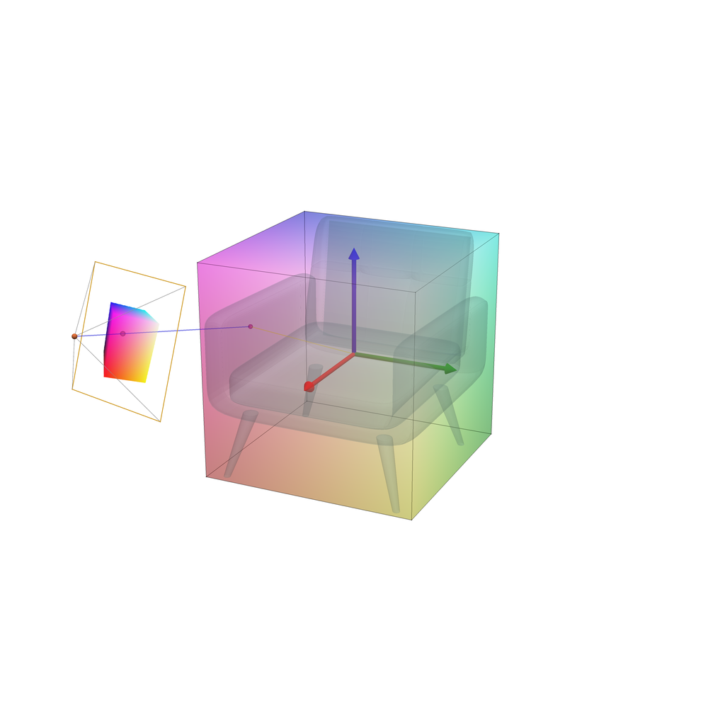
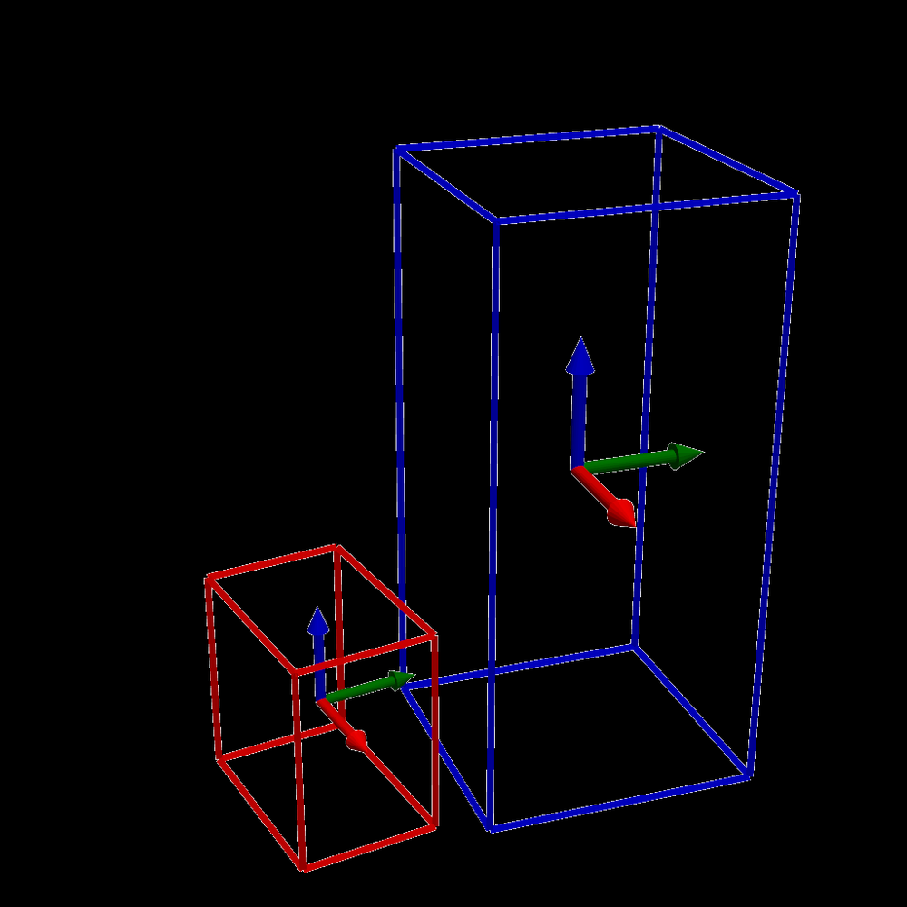
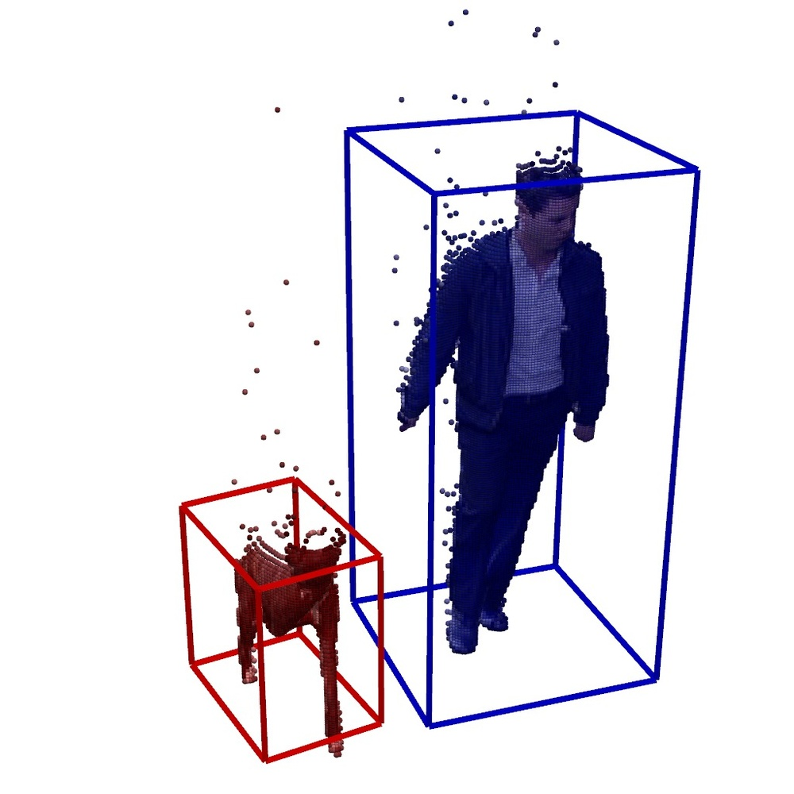
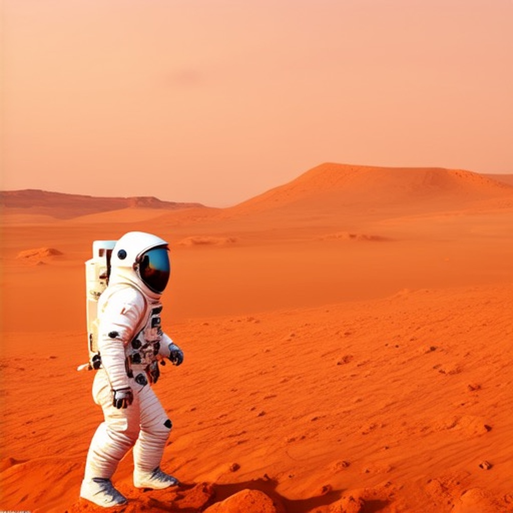
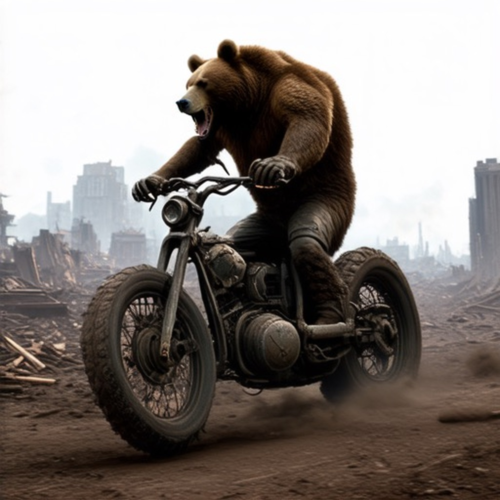
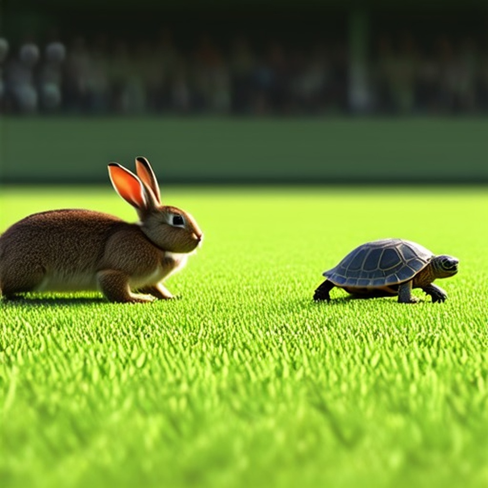

# SceneDesigner: Controllable Multi-Object Image Generation with 9-DoF Pose Manipulation

**ArXiv ID**: 2511.16666v1
**URL**: http://arxiv.org/abs/2511.16666v1
**提交日期**: 2025-11-20
**作者**: Zhenyuan Qin; Xincheng Shuai; Henghui Ding
**引用次数**: NULL
使用模型: gemini-2.5-flash

## 1. 核心思想总结
好的，作为学术论文分析专家，这是对该摘要的简洁第一轮总结：

**标题：** SceneDesigner：可控的多对象图像生成与9自由度姿态操作

**Background (背景):**
可控图像生成是当前研究热点，使用户能操纵图像内容（如身份和风格）。

**Problem (问题):**
现有方法难以实现对多个对象9D姿态（位置、大小、方向）的同时、全面控制，通常面临控制性有限和生成质量下降的问题。

**Method (高层方法):**
1.  **核心架构：** 提出SceneDesigner，在预训练基模型中引入分支网络。
2.  **新表示：** 利用CNOCS map作为新型表示，从相机视角编码9D姿态信息，具有强几何解释性，利于高效稳定训练。
3.  **数据构建：** 构建了新的ObjectPose9D数据集，聚合多源图像及9D姿态标注。
4.  **训练策略：** 针对数据不平衡问题，引入两阶段强化学习训练策略，第二阶段在再平衡数据上进行奖励驱动的微调。
5.  **推理优化：** 提出解耦对象采样（Disentangled Object Sampling），缓解复杂多对象场景中对象生成不足和概念混淆。
6.  **定制化：** 集成用户个性化权重，支持对参考主体的定制化姿态控制。

**Contribution (贡献):**
1.  实现了对多对象9-DoF姿态的准确灵活操纵。
2.  在控制性和生成质量上显著超越现有方法。
3.  构建并发布了新的ObjectPose9D数据集。
4.  代码已公开。

## 2. 方法详解
好的，根据初步总结和方法章节的常见结构，以下是对该论文方法细节的详细阐述：

---

### **论文方法细节：SceneDesigner**

SceneDesigner 提出了一套创新性的方法，旨在解决现有可控图像生成模型在处理多对象场景时，对9自由度（9-DoF：3D位置、3D大小、3D旋转）姿态控制的不足，以及由此导致的生成质量下降和对象混淆问题。其核心在于引入了新型几何表示、定制化的网络架构、多阶段训练策略和推理优化技术。

#### **1. 整体架构与核心创新**

SceneDesigner 的整体架构是建立在一个**预训练的扩散模型（如Stable Diffusion）**之上，通过引入一个专门设计的**分支控制网络（Branching Control Network）**来实现对9自由度姿态的精确控制。这种设计继承了扩散模型强大的生成能力，同时为其注入了精细的几何控制。

**关键创新点概览：**

1.  **CNOCS 几何姿态图（Canonical Object Normalized Coordinate System Map）**：一种新型的、具有强几何解释性的多对象9-DoF姿态表示。
2.  **分支控制网络（Branching Control Network）**：负责将 CNOCS 图的几何信息有效注入到预训练扩散模型的 U-Net 骨干中。
3.  **两阶段强化学习训练策略**：克服数据不平衡问题，通过奖励机制优化复杂多对象场景的生成。
4.  **解耦对象采样（Disentangled Object Sampling）**：推理阶段的优化，缓解多对象场景中常见的对象生成不足和概念混淆。
5.  **ObjectPose9D 数据集**：构建并公开的大规模多对象9-DoF姿态标注数据集。

#### **2. 关键组件与算法/架构细节**

##### **2.1 CNOCS 几何姿态图：9-DoF 姿态的统一表示**

*   **设计理念：** 传统的姿态控制方法往往使用稀疏的关键点或简单的边界框，难以全面捕捉对象的3D几何信息。CNOCS (Canonical Object Normalized Coordinate System) 图旨在提供一种**密集、像素级**的几何编码，将每个对象的 9-DoF 姿态参数（位置 X/Y/Z、尺寸 Scale_X/Y/Z、旋转 Rot_X/Y/Z）统一编码成一个二维图像形式。
*   **编码细节：**
    *   对于图像中的每个对象，系统首先在相机坐标系下确定其 9-DoF 姿态。
    *   然后，将每个对象的3D点转换到其自身的**规范坐标系（Canonical Object Space）**。在这个规范坐标系中，对象的中心通常为原点，其尺寸被归一化。
    *   CNOCS 图是一个多通道的图像。对于图像中的每个像素，如果它属于某个对象，其对应的通道将编码该像素点在**该对象规范坐标系中的三维坐标**（通常是 X、Y、Z 轴的归一化值）。这通过颜色或强度值来表示，例如，一个通道代表规范X轴，另一个通道代表规范Y轴，以此类推。
    *   **几何解释性：** 这种表示方式直观地反映了对象内部的空间结构和姿态。例如，通过观察 CNOCS 图的颜色变化，可以直接理解对象是如何旋转和定位的。这种强几何先验有助于网络更稳定、更高效地学习姿态与图像内容之间的映射关系。
*   **作为控制信号：** 生成的 CNOCS 图作为 SceneDesigner 的主要条件输入，引导图像生成过程。

##### **2.2 分支控制网络（Branching Control Network）**

*   **架构：** 该网络通常采用类似 U-Net 或 ControlNet 的编码器-解码器结构。它接收 CNOCS 几何姿态图作为输入，并提取其多尺度的几何特征。
*   **功能：**
    1.  **特征提取：** 编码器部分逐步下采样 CNOCS 图，提取从粗到细的几何特征。
    2.  **特征注入：** 解码器部分将这些提取到的几何特征，通过**跳跃连接（Skip Connections）**或**交叉注意力机制（Cross-Attention）**，注入到预训练扩散模型的 U-Net 骨干网络的对应层中。
*   **集成方式：** 与 ControlNet 类似，分支网络通常被设计为与扩散模型的主 U-Net 共享权重，或者通过可训练的适配层（如可训练的卷积层）将特征有效地合并。关键在于在不破坏预训练模型强大生成能力的前提下，实现精确的条件控制。
*   **优势：** 这种模块化设计使得模型可以在保持高质量生成能力的同时，获得对多对象 9-DoF 姿态的灵活且精确的控制。

#### **3. 数据集构建：ObjectPose9D**

*   **必要性：** 现有数据集缺乏对多对象 9-DoF 姿态的全面标注，这对于训练 SceneDesigner 学习复杂的几何控制至关重要。
*   **构建方法：** ObjectPose9D 数据集通过聚合和处理多来源的图像数据，并为其中的多个对象提供精确的 9-DoF 姿态标注。这可能涉及到：
    *   从现有 3D 数据集（如渲染数据集）中提取具有 3D 姿态信息的图像。
    *   利用自动或半自动工具（如 3D 重建、姿态估计模型）为真实世界图像添加 9-DoF 姿态标注。
    *   对不同来源的数据进行清洗、统一和格式化，确保标注的准确性和一致性。
*   **内容：** 数据集中每张图像都关联一个或多个对象的 9-DoF 姿态参数，以及对应的 CNOCS 几何姿态图。

#### **4. 训练策略：两阶段强化学习**

为了应对多对象场景中常见的数据不平衡（例如，单对象场景多于多对象场景，简单姿态多于复杂姿态）以及模型在复杂场景下生成质量容易下降的问题，SceneDesigner 采用了**两阶段的强化学习（Reinforcement Learning, RL）训练策略**：

*   **第一阶段：初步监督学习**
    *   **目标：** 使分支控制网络初步学习如何从 CNOCS 图中提取并利用几何信息来引导图像生成。
    *   **方法：** 在整个 ObjectPose9D 数据集上进行标准的扩散模型训练。损失函数通常包括去噪损失（如 L2 或 L1 损失），以及可能加入的感知损失或对抗损失来提升图像质量。在这一阶段，模型主要学习 CNOCS 图与图像像素之间的基本对应关系。

*   **第二阶段：奖励驱动的微调（Reward-Driven Fine-tuning）**
    *   **目标：** 针对数据不平衡问题，优化模型在复杂多对象场景、挑战性姿态下的生成性能，提高控制精度和生成质量。
    *   **数据再平衡：** 在这一阶段，训练数据会进行再平衡，更加侧重于包含多个对象、复杂交互、极端姿态或易于混淆概念的场景。这可以通过采样策略（如重要性采样）或构建专门的挑战性子集来实现。
    *   **奖励函数设计：** 这是 RL 阶段的核心。奖励函数旨在量化生成图像的质量和控制精确度。可能的奖励组成部分包括：
        *   **姿态对齐奖励：** 评估生成对象与给定 9-DoF 姿态的匹配程度（例如，使用姿态估计器或几何匹配损失）。
        *   **对象存在奖励：** 惩罚对象生成不足（即 CNOCS 图中存在的对象未被生成）的情况。
        *   **对象独立性奖励：** 鼓励不同对象之间保持清晰的边界和独立的视觉特征，避免概念混淆。
        *   **图像质量奖励：** 基于预训练的感知度量（如 FID、CLIP 分数）来评估生成图像的整体真实感和与文本提示的一致性。
    *   **RL 优化：** 模型通过最大化累积奖励来微调其参数。这通常采用策略梯度方法（如 PPO, REINFORCE）或其他奖励驱动的优化算法，调整扩散模型的某些层或分支网络的权重，以更好地满足奖励函数所定义的目标。

#### **5. 推理优化：解耦对象采样（Disentangled Object Sampling）**

*   **问题背景：** 在复杂的多对象场景中，标准的扩散采样过程容易出现以下问题：
    *   **对象生成不足（Under-generation）：** 某些指定对象可能未被生成或被忽略。
    *   **概念混淆（Concept Confusion）：** 不同对象之间的特征相互渗透，导致对象身份模糊或混合。
*   **解决方案：** 解耦对象采样旨在在推理过程中，通过一种更结构化的方式来生成多对象场景。这可能涉及：
    *   **迭代式/逐步生成：** 不是一次性生成所有对象，而是可能通过迭代步骤，逐步细化每个对象的特征，或在不同的采样阶段强调不同对象的生成。
    *   **区域级注意力/控制：** 在采样过程中，模型可能被引导将注意力集中在 CNOCS 图中定义的特定对象区域，确保每个对象的特征在各自区域内得到充分发展。
    *   **掩码（Masking）或特征分离：** 在扩散过程的某个阶段，利用对象掩码或特征分离技术，确保不同对象的噪声/特征路径尽可能解耦，从而防止特征混合。例如，可以为每个对象维护一个独立的特征向量或噪声图，在最终合成前进行融合。
*   **优势：** 显著提高了多对象场景中每个对象的生成完整性、视觉独立性和对指定姿态的依从性。

#### **6. 定制化与个性化**

*   **功能：** SceneDesigner 进一步支持用户对特定主体进行个性化的姿态控制。
*   **实现方式：** 这通常通过整合 LoRA (Low-Rank Adaptation)、DreamBooth 或其他个性化微调技术来实现。用户提供少量参考图像，通过对预训练模型的特定部分进行轻量级微调，使其能够学习并生成该特定主体的外观。然后，这些个性化权重与 SceneDesigner 的核心控制机制结合，允许用户以 9-DoF 姿态控制这个定制化主体在场景中的表现。

#### **7. 整体流程总结**

1.  **输入准备：** 用户提供一个文本提示（Text Prompt）和一组指定了多个对象 9-DoF 姿态的参数。
2.  **CNOCS 图生成：** 根据 9-DoF 姿态参数，生成对应的 CNOCS 几何姿态图。
3.  **分支网络处理：** CNOCS 图被输入到分支控制网络，提取多尺度的几何控制特征。
4.  **扩散过程引导：** 这些几何特征被注入到预训练扩散模型的 U-Net 骨干网络中，与文本嵌入（通过交叉注意力）共同引导去噪采样过程。
5.  **解耦采样优化：** 在推理阶段，应用解耦对象采样策略，以确保多对象场景中每个对象的独立性和完整性。
6.  **图像输出：** 经过一系列去噪步骤后，扩散模型最终生成符合文本提示、并精确遵循 9-DoF 姿态控制的多对象图像。
7.  **个性化集成：** 如果用户指定了定制化主体，相应的个性化权重会在扩散过程中被激活，以生成特定外观的对象。

---

通过上述详细的方法阐述，SceneDesigner 在可控图像生成领域取得了显著进展，特别是在多对象 9-DoF 姿态操纵方面设立了新的基准。

## 3. 最终评述与分析
好的，结合前两轮返回的详细信息，以下是对SceneDesigner论文的最终综合评估：

---

### **最终综合评估：SceneDesigner**

#### **1) Overall Summary (总体概括)**

SceneDesigner 是一项在可控图像生成领域取得显著进展的开创性工作，它成功解决了现有方法难以对复杂多对象场景进行精确 9 自由度（9-DoF，即 3D 位置、3D 尺寸、3D 旋转）姿态控制的挑战。该论文的核心在于提出了一套创新的方法论：

1.  **新型几何表示：** 引入了 **CNOCS 几何姿态图 (Canonical Object Normalized Coordinate System Map)**，作为一种具有强大几何解释性的统一表示，将多对象的 9-DoF 姿态信息编码为像素级输入。
2.  **定制化架构：** 在预训练扩散模型（如 Stable Diffusion）中集成 **分支控制网络 (Branching Control Network)**，以高效地将 CNOCS 图的几何先验注入到生成过程中。
3.  **高质量数据：** 构建并发布了迄今为止规模最大的 **ObjectPose9D 数据集**，为模型学习复杂的 9-DoF 控制提供了丰富的监督信号。
4.  **鲁棒训练策略：** 采用 **两阶段强化学习训练策略**，通过奖励机制克服数据不平衡问题，显著提升了模型在复杂多对象场景下的生成质量和控制精度。
5.  **推理优化：** 提出了 **解耦对象采样 (Disentangled Object Sampling)** 机制，有效缓解了多对象场景中常见的对象生成不足和概念混淆问题。
6.  **用户定制化：** 支持集成用户个性化权重，实现对特定主体的定制化姿态控制。

通过这些创新，SceneDesigner 在多对象 9-DoF 姿态操控的精确性、灵活性和图像生成质量方面均实现了突破，为交互式内容创作、虚拟世界构建等领域开辟了新的可能性，并发布了代码和数据集，对社区贡献巨大。

#### **2) Strengths (优势)**

1.  **卓越的控制精度与灵活性：** 实现了业界领先的多对象 9-DoF 姿态操纵能力，超越了现有方法的局限性，使用户能够以前所未有的细节和自由度控制场景中的每个对象。
2.  **创新的几何表示 (CNOCS)：** CNOCS 图作为一种密集、像素级的 3D 姿态编码，具有强大的几何解释性，为模型提供了稳定且高效学习复杂几何变换的基础，是实现精细控制的关键。
3.  **巧妙的架构设计：** 通过分支控制网络将几何控制与预训练扩散模型的强大生成能力相结合，既保证了生成图像的高质量，又实现了精准的条件控制，体现了模块化和高效利用资源的优势。
4.  **针对性的训练策略：** 两阶段强化学习策略，特别是第二阶段的奖励驱动微调，有效解决了多对象场景中常见的数据稀疏性和复杂性问题，显著提升了模型在挑战性情境下的性能和鲁棒性。
5.  **实用的推理优化 (解耦对象采样)：** 针对多对象生成中“遗漏”和“混淆”的痛点，解耦对象采样提供了一个有效的解决方案，确保了复杂场景下每个对象的完整性和独立性。
6.  **高质量与大规模数据集贡献：** ObjectPose9D 数据集的构建和公开填补了现有数据集的空白，为未来该领域的研究提供了宝贵资源，加速了相关技术的发展。
7.  **高用户价值的定制化功能：** 集成对个性化主体的姿态控制能力，极大地扩展了模型的应用场景和实用性，满足了用户生成特定内容的需求。
8.  **开放性与社区贡献：** 代码和数据集的公开不仅验证了研究成果，也极大地促进了学术界的交流与后续研究。

#### **3) Weaknesses / Limitations (劣势/局限性)**

1.  **训练复杂度与计算资源需求：** 两阶段强化学习训练策略，尤其是涉及奖励函数设计和数据再平衡的第二阶段，可能非常复杂且对计算资源（GPU时间）的需求高昂，部署和复现门槛较高。
2.  **对数据集的依赖性：** 虽然 ObjectPose9D 数据集是巨大贡献，但模型性能在一定程度上仍受限于该数据集的覆盖范围和多样性。对于数据集中未充分表示的特定对象类型、复杂交互或极端光照条件，泛化能力可能受限。
3.  **潜在的控制粒度极限：** 尽管实现了 9-DoF 控制，但对于更精细的形变（如非刚体形变、布料褶皱、微表情等）或特定物理属性的模拟，该模型可能仍有局限。
4.  **用户输入的复杂性：** 对于普通用户而言，手动指定场景中多个对象的精确 9-DoF 姿态（3D位置、大小、旋转）仍然是一个复杂且耗时的任务，需要专门的界面或工具来简化输入过程。
5.  **推理效率（可能）：** 解耦对象采样等推理优化虽然提升了质量，但也可能增加推理时间或计算开销，尤其是在实时应用中需要权衡。
6.  **奖励函数设计的挑战：** 强化学习中的奖励函数设计至关重要。如何精确量化生成质量、姿态对齐和对象独立性，以避免引入新的偏差或次优解，是一个持续的挑战。
7.  **场景复杂度的上限：** 尽管在多对象场景表现优秀，但当场景包含极大量的对象、高度复杂的空间遮挡、或需要精细物理交互时，模型处理的鲁棒性和真实性可能仍有提升空间。

#### **4) Potential Applications / Implications (潜在应用/影响)**

1.  **专业内容创作：** 彻底改变电影、游戏、广告、虚拟现实 (VR) 和增强现实 (AR) 等领域的资产生成流程。设计师和艺术家可以快速创建具有精确布局和姿态的复杂场景，大幅缩短制作周期和成本。
2.  **产品可视化与设计：** 产品设计师和营销人员可以轻松生成产品在不同姿态、背景和光照条件下的高质量图像，无需昂贵的实物拍摄，加速产品迭代和市场推广。
3.  **电子商务与数字营销：** 为在线零售商提供生成商品展示图的强大工具，例如将商品放置在各种虚拟场景中，以吸引消费者。
4.  **虚拟世界与元宇宙构建：** 为虚拟环境和元宇宙的快速、程序化内容生成提供核心技术，使用户或开发者能够以高自由度构建沉浸式虚拟场景。
5.  **机器人与自动驾驶模拟：** 生成多样化、精确控制的模拟环境，用于训练机器人或自动驾驶系统的感知和决策模块，验证其在不同场景下的鲁棒性。
6.  **教育与培训：** 创建交互式 3D 教学材料，例如展示生物学结构、物理实验设置或工程机械部件的多种姿态和相互作用，提高学习效率。
7.  **艺术与创意表达：** 赋予艺术家和创作者强大的工具，将他们的想象力转化为视觉作品，通过精确控制元素的位置和关系来探索新的艺术形式。
8.  **推动可控生成研究：** SceneDesigner 的成功为 3D 感知生成、基于几何先验的生成模型以及将强化学习应用于扩散模型提供了新的研究范式和基准，将激励更多创新。

---

---

# 附录：论文图片

## 图 1

## 图 2

## 图 3

## 图 4

## 图 5

## 图 6

## 图 7

## 图 8

## 图 9

## 图 10

