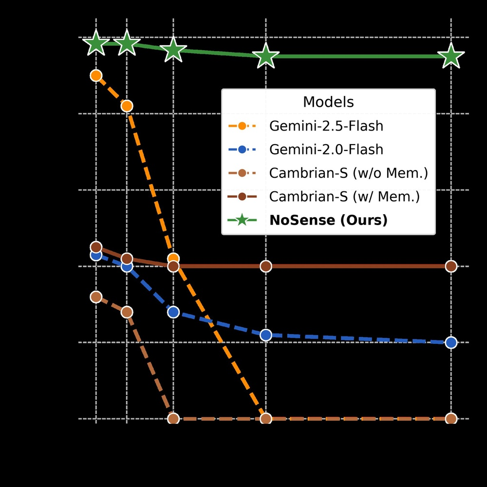
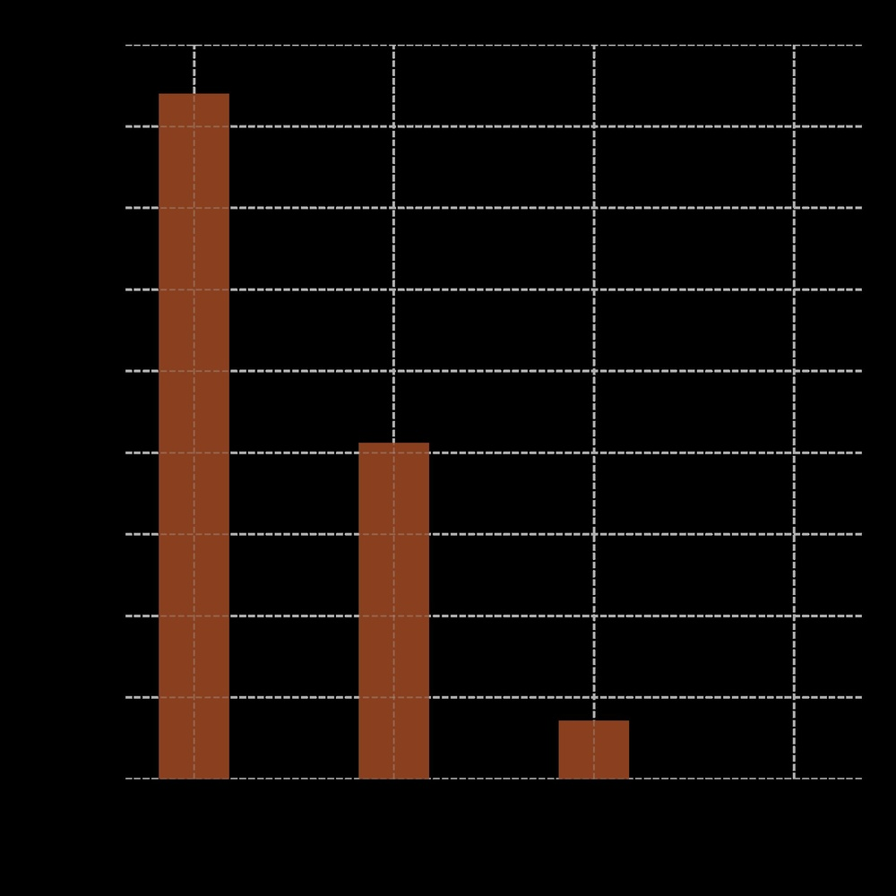
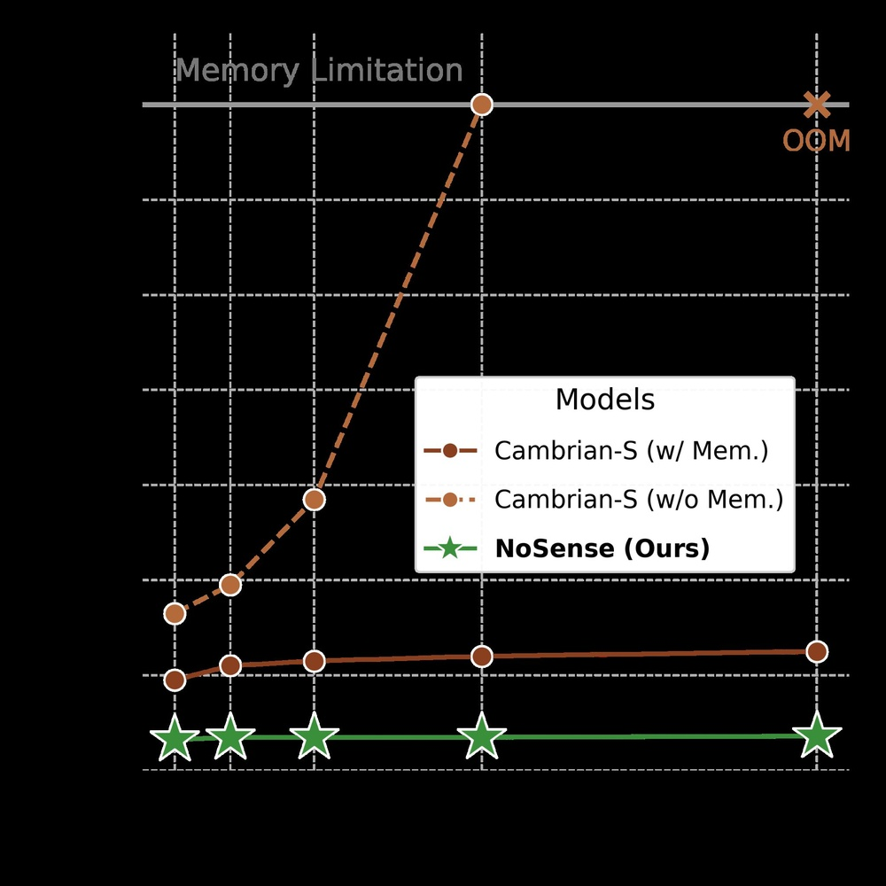
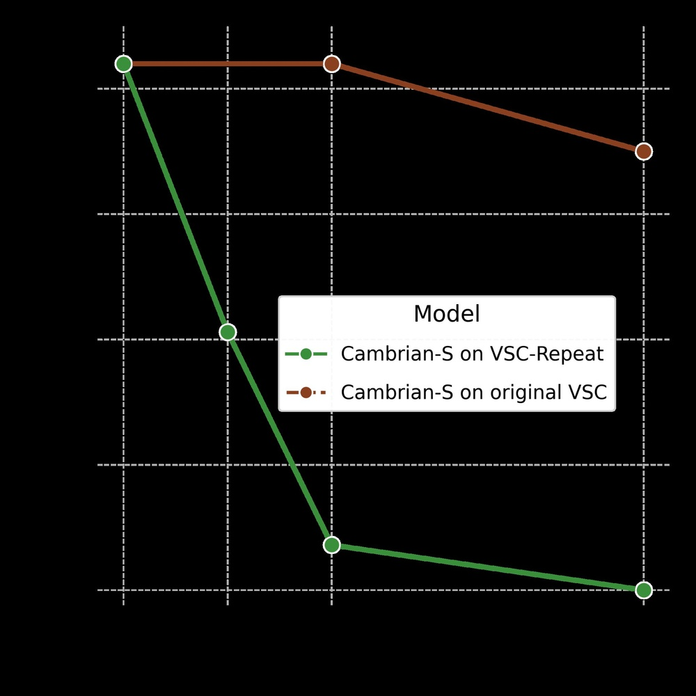
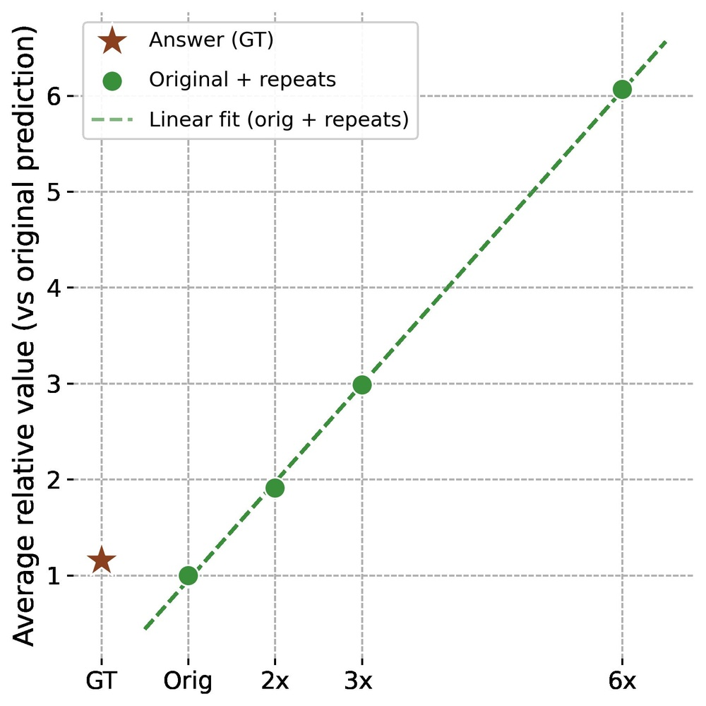
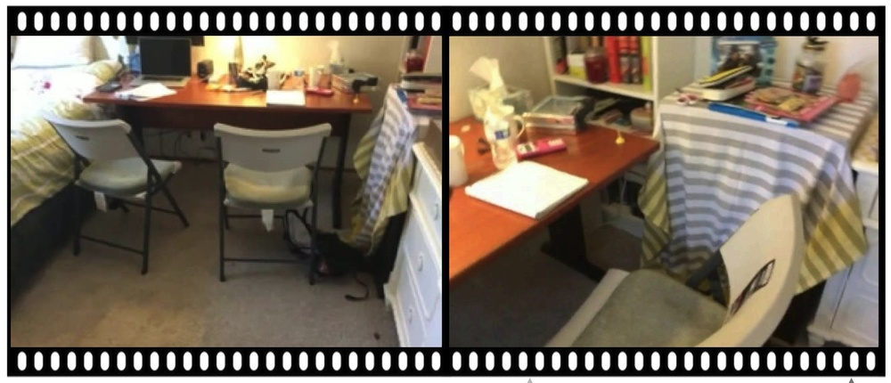
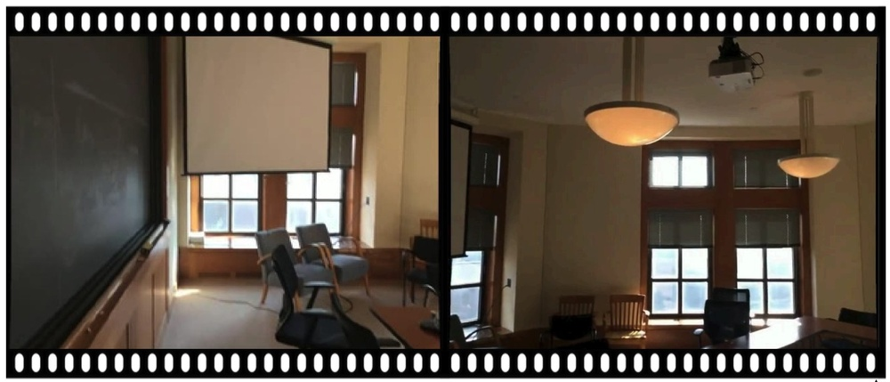
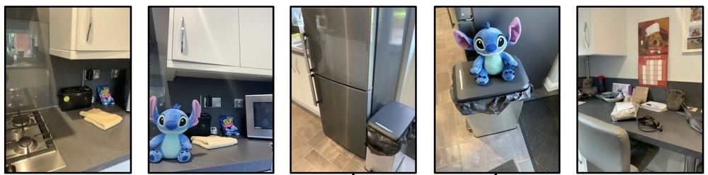

# Solving Spatial Supersensing Without Spatial Supersensing

**ArXiv ID**: 2511.16655v1
**URL**: http://arxiv.org/abs/2511.16655v1
**提交日期**: 2025-11-20
**作者**: Vishaal Udandarao; Shyamgopal Karthik; Surabhi S. Nath; Andreas Hochlehnert; Matthias Bethge; Ameya Prabhu
**引用次数**: NULL
使用模型: gemini-2.5-flash

## 1. 核心思想总结
这是一份对所提供摘要的简洁第一轮总结：

---

**标题:** 解决空间超感但并非通过空间超感

**Background (背景):**
原始工作 Cambrian-S 旨在通过引入“空间超感”（spatial supersensing）来改进视频世界模型，并提出了两个基准（VSI-Super-Recall, VSR 和 VSI-Super-Counting, VSC）及定制的预测感知推理策略。

**Problem (问题):**
本文对 Cambrian-S 进行了批判性分析，质疑其提出的基准是否能可靠地衡量“空间超感”，以及其推理策略是否真正实现了鲁棒的空间超感，抑或仅是利用了数据集中的捷径。

**Method (高层方法):**
作者采用了两种方法进行分析：1) 针对 VSR 基准，提出了一个几乎忽略时间结构的简单基线模型 NoSense。 2) 针对 VSC 基准，设计了一个通过重复拼接视频进行验证的 VSC-Repeat 健全性检查。

**Contribution (贡献):**
本文揭示：1) VSR 基准几乎可以通过非空间认知方法解决（NoSense 达到 95% 准确率），表明其无法可靠衡量空间超感。2) Cambrian-S 在 VSC 基准上的推理方法依赖于数据集中的捷径（如房间不重访），而非鲁棒的空间理解，因为简单的扰动（重复拼接视频）会使其性能完全崩溃。总而言之，研究贡献在于指出当前的 VSI-Super 基准未能有效衡量空间超感，且 Cambrian-S 的性能提升来源于无意中利用了捷径。

## 2. 方法详解
好的，基于您提供的初步总结，以下是该论文方法的详细说明：

---

### 论文方法细节：对 Cambrian-S 及其 VSI-Super 基准的批判性分析

本文旨在对 Cambrian-S 项目提出的“空间超感”（spatial supersensing）概念、其 VSI-Super 基准以及相应的预测感知推理策略进行深入的批判性分析。作者设计了两套独立的实验方法来验证 Cambrian-S 的鲁棒性及其衡量“空间超感”的能力。

#### 1. 针对 VSR 基准的 NoSense 基线模型

**目的：**
该方法的核心目的是质疑 VSR (Video Spatial-Super Recall) 基准是否能可靠地衡量模型的空间超感能力或高级时间推理能力。作者通过引入一个极端简单、几乎完全忽略时间结构的基线模型 NoSense，来测试 VSR 基准的鉴别力。

**关键创新（或反向创新）：**
NoSense 的“创新”在于其极致的简洁和对时间信息的故意忽略。它不引入任何复杂的神经网络架构、时间序列建模或物体动力学模拟。这种设计本身就是一种探针，旨在揭示如果一个完全不具备时间感知或复杂空间推理能力的模型能在此基准上取得优异性能，那么该基准可能无法有效区分真正的“空间超感”与简单的数据关联。

**算法/架构细节：**
NoSense 模型不具备传统的神经网络架构，其“算法”仅包含以下核心逻辑：
1.  **输入处理：** 模型仅读取输入视频序列的**第一帧**。
2.  **初始状态识别：** 在第一帧中，NoSense 会识别并记录所有可见的物体（或其在场景中的初始位置）。
3.  **未来状态预测：** 对于 VSR 基准要求的在未来某一时间步预测将可见的物体，NoSense 的预测策略是：**假设在整个视频序列的未来，只有在第一帧中被观察到的物体会持续可见。**它完全忽略了物体在视频中的移动、新物体的出现或已有物体的消失。换言之，它将视频的初始状态简单地平移到所有未来的时间步。
NoSense 没有内部记忆单元，不学习任何时间模式，也不建立物体之间的空间关系。它的预测完全是基于静态的、单一时间点的观察。

**关键步骤与整体流程：**
1.  **数据准备：** 获取 VSR 基准中的视频序列。
2.  **首帧分析：** 对每个视频，提取其第一帧图像。
3.  **物体检测：** 在第一帧中执行一次标准的物体检测，得到第一帧中所有可见物体的列表。
4.  **预测生成：** 将此物体列表作为该视频在所有未来时间步的统一预测结果。
5.  **性能评估：** 将 NoSense 的预测结果与 VSR 基准的真实标签（即未来时间步实际可见的物体）进行比较，计算准确率。
通过这种方式，论文发现 NoSense 在 VSR 基准上能达到惊人的 95% 准确率，有力地证明了 VSR 基准未能有效衡量空间超感。

#### 2. 针对 VSC 基准的 VSC-Repeat 健全性检查

**目的：**
此方法旨在检验 Cambrian-S 在 VSC (Video Spatial-Super Counting) 基准上关于“独特房间计数”的性能，是否真正来源于鲁棒的空间理解能力，还是利用了数据集中可能存在的“捷径”或隐含假设（例如，在标准测试场景中房间不会被重复访问）。

**关键创新：**
此方法的核心创新在于其通过构造一种特定的**数据扰动策略**（即重复拼接视频）来对 Cambrian-S 进行“对抗性”测试。它不是设计一个新模型，而是修改输入数据，以暴露 Cambrian-S 模型在非预期但逻辑合理的场景下的脆弱性。如果一个模型真正理解空间并能区分独特的房间，那么当视频内容被简单重复时，它应该能够识别出房间的重复访问。

**数据扰动策略与实施细节：**
作者没有设计新的模型，而是对 VSC 基准的输入数据进行了系统性的修改：
1.  **选择原始视频：** 从 VSC 基准数据集中选取一段标准的视频序列 `V`。
2.  **视频拼接：** 将原始视频序列 `V` 与其自身的副本进行简单的时间序列拼接，形成一个新的、加倍长度的视频序列 `V_repeat`。例如，如果 `V = [帧1, 帧2, ..., 帧N]`，则 `V_repeat = [帧1, ..., 帧N, 帧1, ..., 帧N]`。
    *   这种拼接操作在语义上意味着模型在同一个场景中“再次”遍历了完全相同的空间路径。
3.  **真值标签：** 对于 `V_repeat`，其真正的独特房间计数应该与原始视频 `V` 的独特房间计数相同（因为房间只是被重访了，但没有新的独特房间出现）。

**关键步骤与整体流程：**
1.  **基准视频准备：** 准备 VSC 基准中的所有原始视频序列。
2.  **生成重复视频：** 对每个原始视频 `V_i`，生成其重复拼接版本 `V_i_repeat`。
3.  **模型输入与预测：** 将 `V_i_repeat` 输入到预训练的 Cambrian-S 模型中，让其预测所访问的“独特房间”数量。
4.  **性能分析：** 记录 Cambrian-S 对 `V_i_repeat` 的预测结果。然后，将 Cambrian-S 的预测结果与 `V_i_repeat` 的真实标签（即原始视频 `V_i` 中包含的独特房间数量）进行比较。
通过分析 Cambrian-S 在这种扰动情境下的性能变化，论文揭示 Cambrian-S 的性能完全崩溃，表明它依赖于数据集中房间不重访的隐含模式，而不是对空间本身有深刻的理解。

---

**总结：**
通过这两种创新性的分析方法，本文有效地揭示了 Cambrian-S 所提出的 VSI-Super 基准在衡量“空间超感”方面的不足，以及 Cambrian-S 模型自身在处理复杂空间时间推理时对数据集中“捷径”的依赖性。这为未来视频世界模型的研究指明了方向，强调了开发更鲁棒、更具泛化能力基准和模型的重要性。

## 3. 最终评述与分析
好的，结合您提供的初步总结和详细方法描述，以下是对该论文的最终综合评估：

---

### 最终综合评估

**1) Overall Summary (综合总结)**

本论文对一项旨在通过“空间超感”（spatial supersensing）改进视频世界模型的先驱性工作 Cambrian-S 及其提出的 VSI-Super 基准进行了深刻而批判性的分析。Cambrian-S 引入了 VSI-Super-Recall (VSR) 和 VSI-Super-Counting (VSC) 两个基准，并声称通过其预测感知推理策略实现了鲁棒的空间超感。

然而，本论文通过设计两种简洁而有力的分析方法，成功揭示了 Cambrian-S 项目的核心局限性：
1.  **针对 VSR 基准：** 提出了一个名为 NoSense 的极端简单基线模型，该模型几乎完全忽略视频的时间结构，仅凭第一帧信息进行预测。令人震惊的是，NoSense 在 VSR 基准上取得了高达 95% 的准确率，这强有力地证明了 VSR 基准未能有效衡量模型的空间超感能力或复杂的时间推理。它实际上可通过非空间认知、甚至是非时间认知的方法轻易“解决”。
2.  **针对 VSC 基准：** 设计了一个名为 VSC-Repeat 的健全性检查，通过将原始视频序列重复拼接来扰动输入数据。本论文发现，在面对这种简单的逻辑扰动时，Cambrian-S 模型在 VSC 基准上的性能完全崩溃。这表明 Cambrian-S 的性能并非来源于对空间本身的鲁棒理解，而是无意中利用了数据集中“房间不重访”等隐含的捷径或统计模式。

**结论**是，本研究成功地指出 Cambrian-S 及其 VSI-Super 基准未能有效评估真正的“空间超感”，并且其模型声称的性能提升实际上是利用了数据集的固有捷径。这对于视频世界模型和AI基准测试领域具有重要的警示作用，强调了开发更鲁棒、更具泛化能力的基准和模型的重要性。

**2) Strengths (优势)**

*   **深刻的批判性分析：** 本文最核心的优势在于其对现有前沿研究（Cambrian-S）进行了深入且有力的批判，揭示了看似显著成果背后的深层问题。这种批判性思维对于科学进步至关重要。
*   **方法简洁且有效：** 论文提出的 NoSense 基线和 VSC-Repeat 健全性检查，设计巧妙，思路清晰。它们不依赖复杂的模型或大量计算资源，却能以最直接的方式揭示问题的本质，具有很高的信服力。
*   **提供强有力证据：** NoSense 在 VSR 上 95% 的准确率以及 Cambrian-S 在 VSC-Repeat 上性能的完全崩溃，是极其明确且无可辩驳的证据，有力地支撑了论文的论点。
*   **促进研究方向的纠正：** 通过指出现有基准和模型的缺陷，本文有助于防止研究资源被误导，引导未来的视频世界模型研究走向更真实、更鲁棒的方向。它强调了在追求高性能的同时，对模型理解能力进行深度验证的重要性。
*   **对基准设计提供警示：** 本文为机器学习社区，尤其是在设计新基准时，提供了宝贵的经验和警示。它提醒研究者在创建基准时，必须充分考虑简单的基线模型和各种数据扰动，以确保基准真正衡量其宣称的能力。

**3) Weaknesses / Limitations (劣势 / 局限性)**

*   **纯粹批判性，缺乏建设性替代方案：** 尽管批判是其核心优势，但该论文并未提出一个修正版的“空间超感”基准，也没有提出一个新的、更鲁棒的视频世界模型架构。它指出了问题，但没有直接给出解决方案的蓝图。
*   **研究范围的局限性：** 本文的分析主要集中在 Cambrian-S 项目及其 VSI-Super 基准。虽然其揭示的问题可能具有普遍性，但具体的实验结论是否能直接推广到所有视频世界模型或所有“空间超感”方法，仍需进一步研究验证。
*   **对原概念的重新定义不足：** 论文有效证明了 Cambrian-S 的实现未能达成“空间超感”，但对于“空间超感”这个概念本身，在发现现有衡量方式不足之后，如何更合理地定义和衡量，论文并未深入探讨。
*   **依赖于被批判工作的显著性：** 本论文的影响力在一定程度上依赖于 Cambrian-S 项目在学界的关注度和重要性。如果 Cambrian-S 并非一个备受关注的工作，那么这份批判的重要性也会相应降低。

**4) Potential Applications / Implications (潜在应用 / 影响)**

*   **改进AI基准测试方法论：** 本文的方法（如 NoSense 基线和 VSC-Repeat 扰动测试）可以作为未来AI基准设计和验证的典范。研究者在发布新基准时，应主动设计类似的“对抗性”测试，以确保基准的鲁棒性和有效性。
*   **推动更鲁棒的视频世界模型开发：** 本研究揭示的捷径问题，将促使研究者在开发视频世界模型时，更加注重模型的泛化能力和对底层物理、空间、时间规律的真正理解，而非仅仅追求在特定数据集上的指标。
*   **重新审视复杂概念的定义与衡量：** “空间超感”这类复杂的人类认知能力，在AI中如何定义和衡量是一个挑战。本文的发现促使我们重新思考，在AI领域，如何避免将表面上的高性能误读为对深层能力的掌握。
*   **增强AI系统的可信度和安全性：** 如果AI系统依赖于数据集中的捷径而非真正的理解，那么在真实世界或面对轻微扰动时，其行为将不可预测甚至危险。本文的发现有助于推动开发更可信、更安全的AI系统。
*   **在教育和培训中的应用：** 本文可以作为案例研究，用于计算机科学和人工智能的课程中，教导学生如何进行批判性思考，以及如何设计和评估机器学习模型和基准。

---

---

# 附录：论文图片

## 图 1

## 图 2

## 图 3

## 图 4

## 图 5

## 图 6

## 图 7

## 图 8

## 图 9

