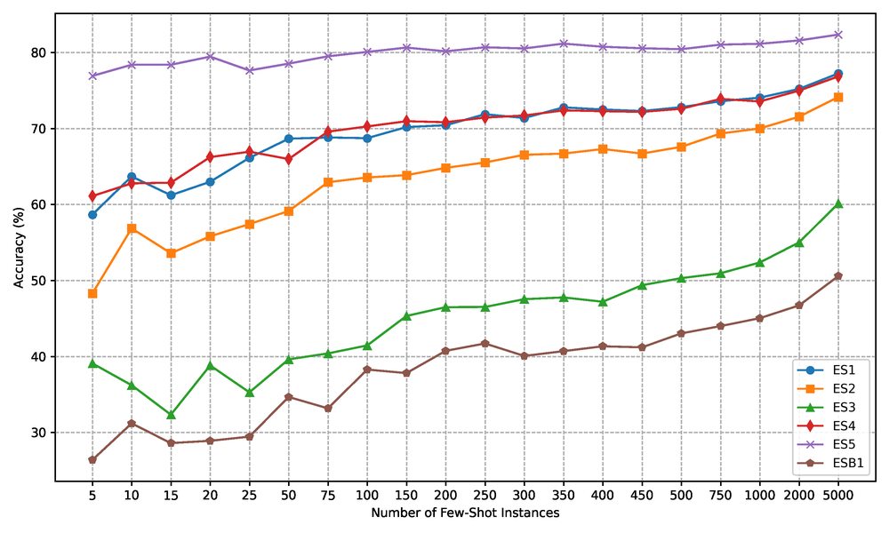
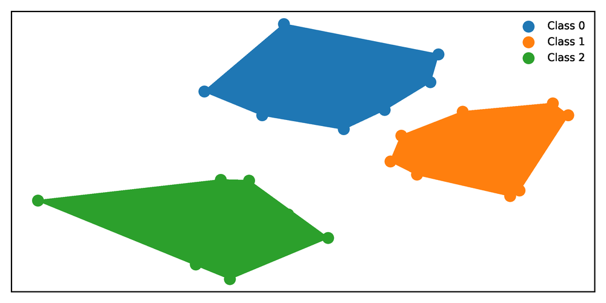
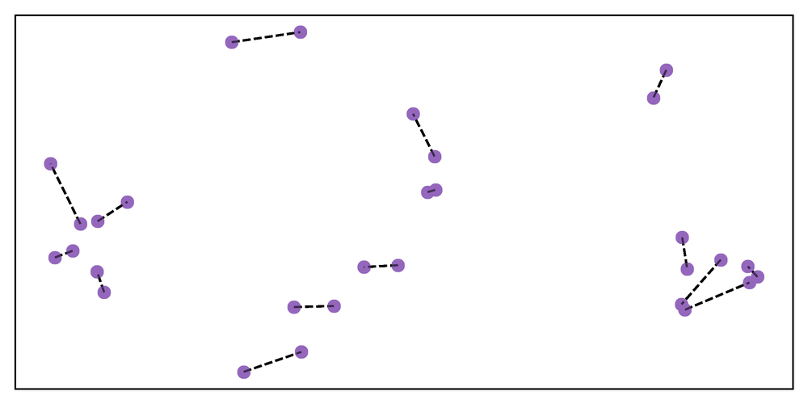
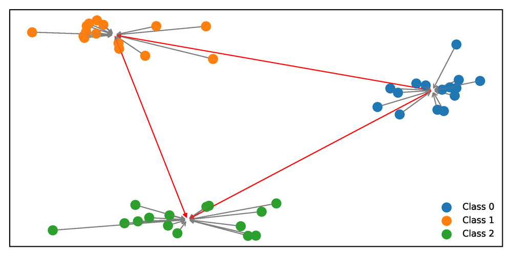
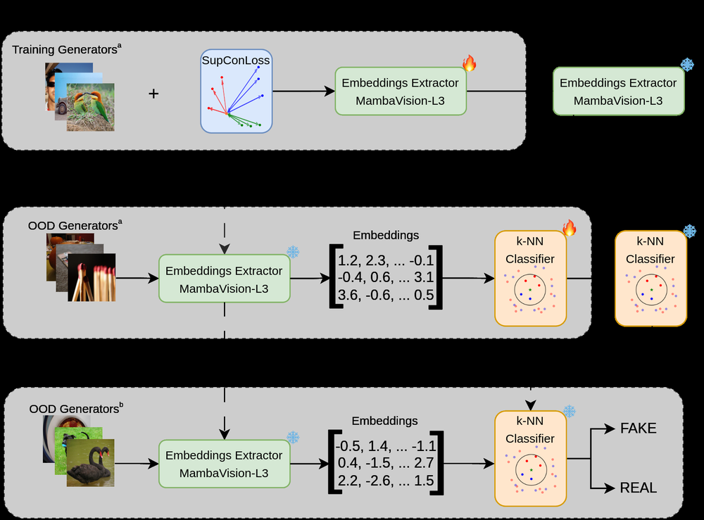
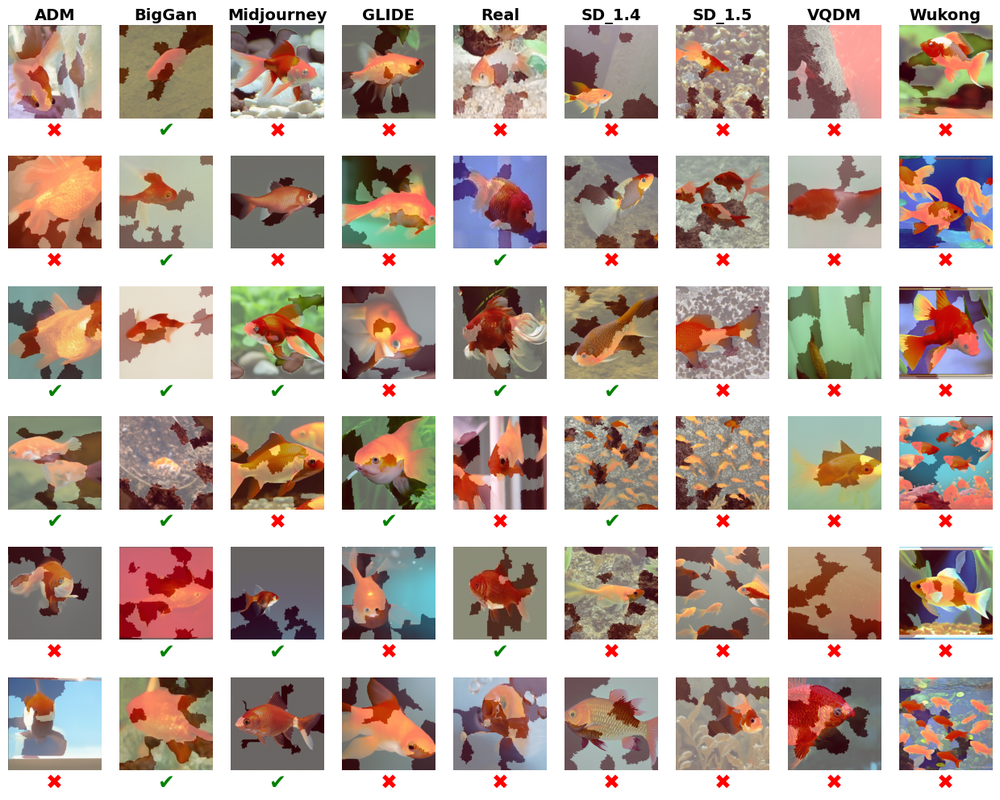
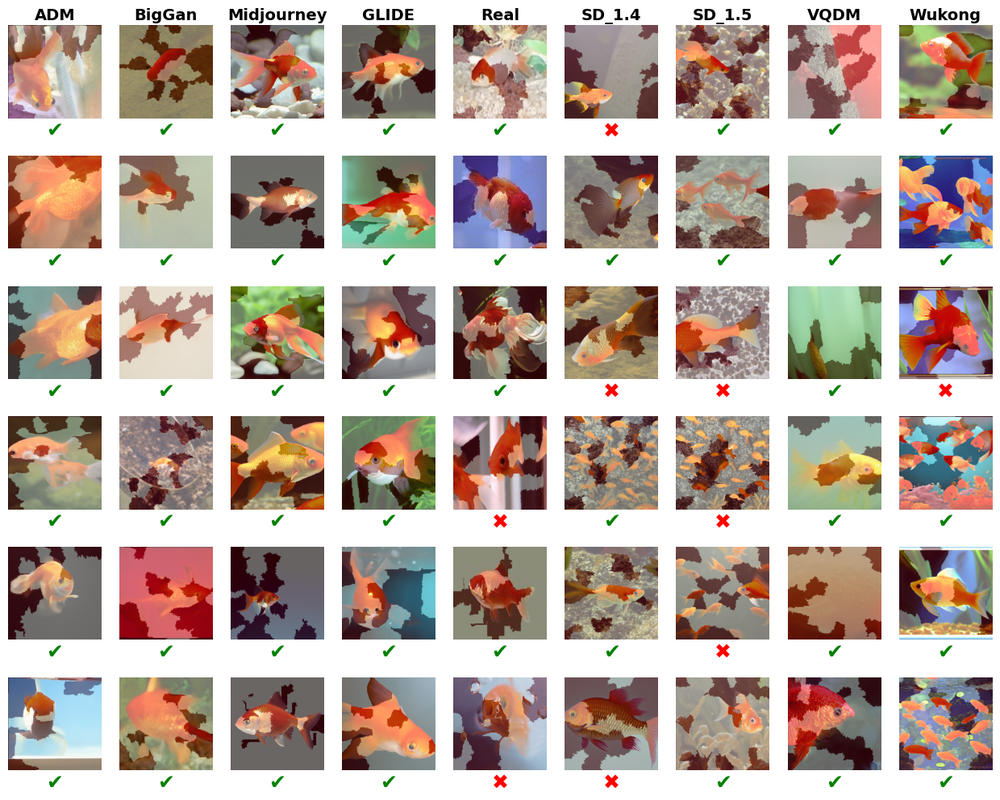
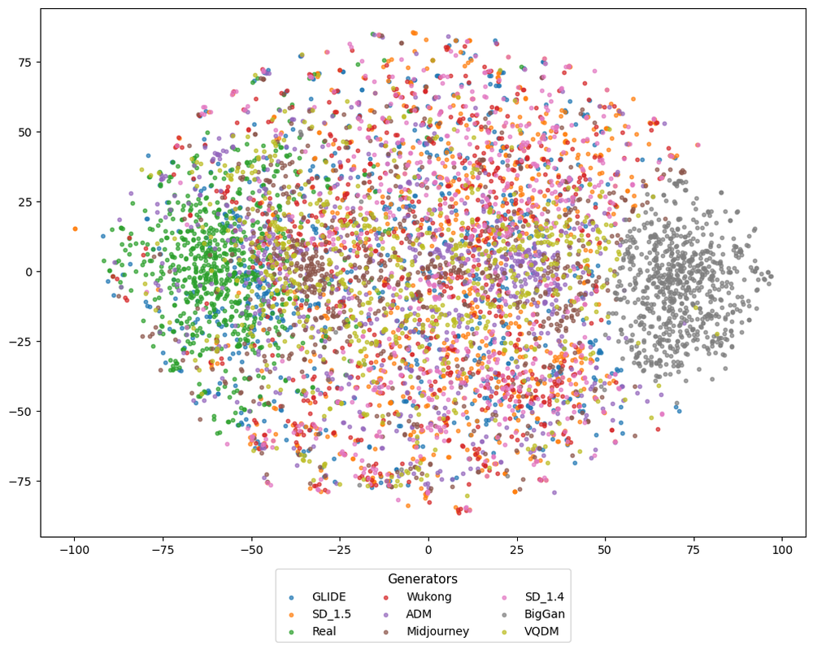
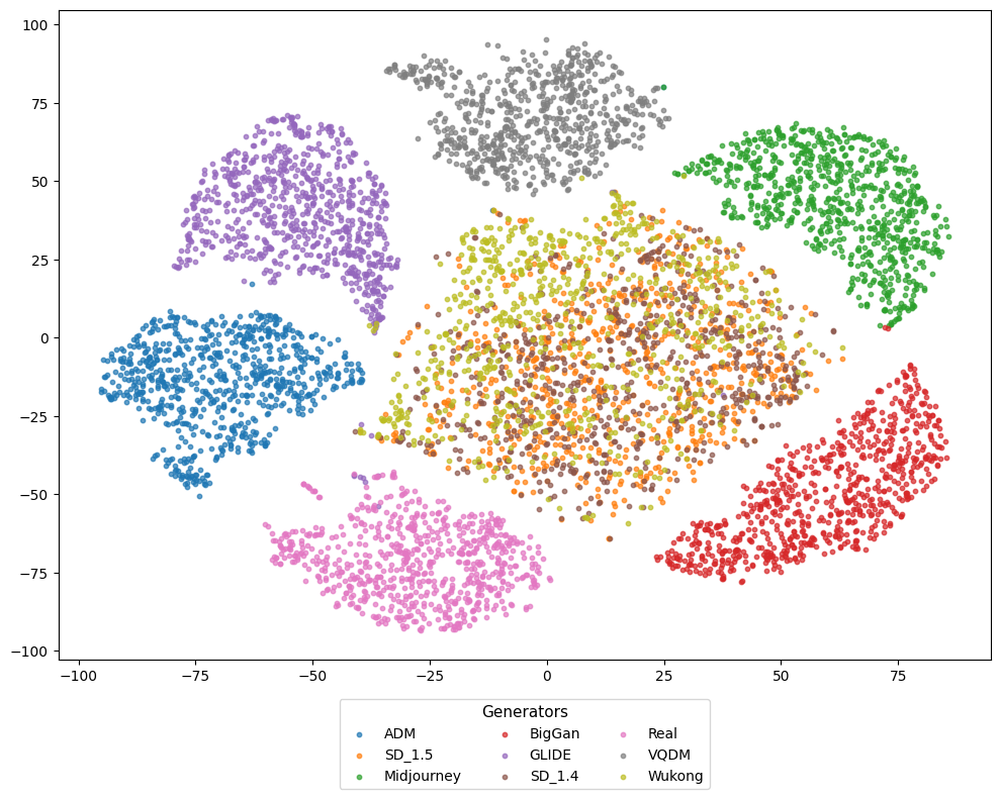
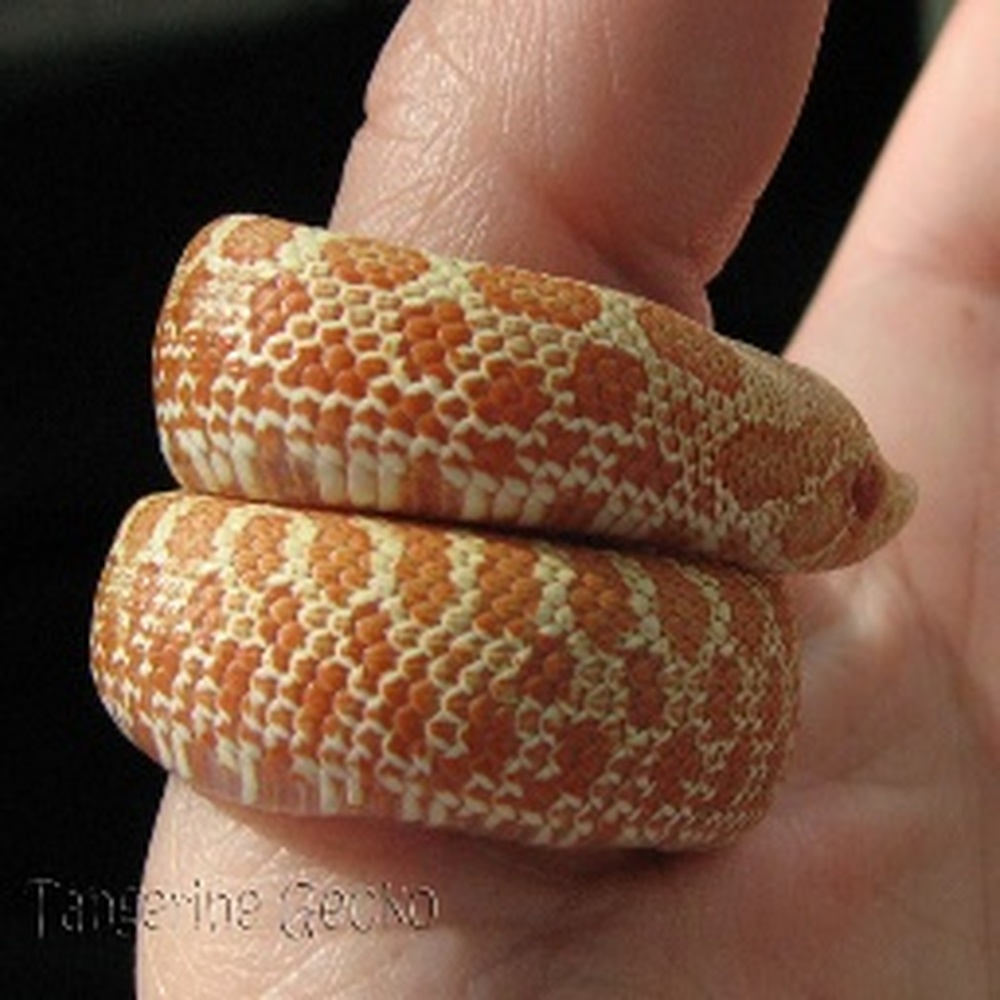

# Supervised Contrastive Learning for Few-Shot AI-Generated Image Detection and Attribution

**ArXiv ID**: 2511.16541v1
**URL**: http://arxiv.org/abs/2511.16541v1
**提交日期**: 2025-11-20
**作者**: Jaime Álvarez Urueña; David Camacho; Javier Huertas Tato
**引用次数**: NULL
使用模型: gemini-2.5-flash

## 1. 核心思想总结
以下是对该学术论文摘要的简洁第一轮总结：

### 论文标题：Supervised Contrastive Learning for Few-Shot AI-Generated Image Detection and Attribution

**Background (背景):**
生成式人工智能（Generative AI）的快速发展，使得合成图像与真实图像日益难以区分，对数字媒体内容的完整性和真实性构成严峻挑战。

**Problem (问题):**
新型生成模型迭代发布速度快，导致依赖周期性再训练的传统检测方法在计算上和操作上均不可行。现有方法难以有效泛化到未见过的生成器，缺乏鲁棒性和可扩展性。

**Method (high-level) (方法 – 高层次):**
本研究提出一个新颖的两阶段检测框架：
1.  **第一阶段：** 通过监督对比学习（supervised contrastive learning）训练深度视觉模型，以提取图像的判别性嵌入（discriminative embeddings）。在训练过程中，策略性地保留部分生成器，以严格评估模型对未知生成器的泛化能力。
2.  **第二阶段：** 在学习到的嵌入空间中，采用少样本学习（few-shot learning）范式，利用有限的样本训练k-NN分类器，用于对先前未见的生成器进行检测和源头归因。

**Contribution (贡献):**
1.  **检测任务：** 在每类仅150张图像的少样本学习范式下，平均检测准确率达91.3%，较现有方法提升5.2个百分点。
2.  **归因任务：** 在开放集分类环境中，源归因任务的AUC和OSCR指标分别提升14.70%和4.27%。
3.  **整体优势：** 实现了鲁棒、可扩展的取证归因系统，能够适应不断演变的生成式AI技术，而无需进行大量的重复训练。

## 2. 方法详解
基于初步总结和论文标题“Supervised Contrastive Learning for Few-Shot AI-Generated Image Detection and Attribution”，我们可以详细构建其方法细节，重点突出其创新性、算法/架构和整体流程。

### 论文方法细节：Supervised Contrastive Learning for Few-Shot AI-Generated Image Detection and Attribution

该论文提出了一种新颖的两阶段框架，旨在解决生成式AI图像检测和溯源任务中，模型对未知生成器的泛化能力差、传统方法难以适应快速迭代的生成模型的问题。其核心在于结合“监督对比学习”和“少样本学习”范式，构建一个鲁棒、可扩展且无需大量重复训练的系统。

#### 1. 整体流程概述

整个方法分为两个主要阶段，形成一个协同工作的系统：

*   **第一阶段：判别性嵌入学习 (Discriminative Embedding Learning)**
    *   **目标：** 训练一个深度视觉模型（特征编码器），将图像映射到一个高维嵌入空间。在这个空间中，来自同一生成器（或真实图像）的样本彼此靠近，而来自不同生成器的样本则彼此远离。
    *   **方法：** 采用**监督对比学习 (Supervised Contrastive Learning, SCL)** 范式进行训练。

*   **第二阶段：少样本检测与归因 (Few-Shot Detection and Attribution)**
    *   **目标：** 利用第一阶段学习到的嵌入空间，通过极少量的新样本快速适应和识别未见过的生成器，完成图像的真伪检测和源头归因。
    *   **方法：** 在嵌入空间中应用**少样本学习 (Few-Shot Learning, FSL)** 范式，通过训练轻量级的 **k-近邻 (k-Nearest Neighbors, k-NN) 分类器**实现。

#### 2. 第一阶段：判别性嵌入学习（基于监督对比学习）

**目标：** 学习一个能够提取图像核心判别性特征的通用表示，使其对后续的少样本分类任务具有强大的泛化能力。

**2.1. 核心思想与创新：监督对比学习 (SCL)**

*   **传统对比学习 (Unsupervised Contrastive Learning)：** 通常通过数据增强生成同一样本的不同视图作为正例，与其他样本作为负例，拉近正例距离，推远负例距离。
*   **监督对比学习 (SCL) 的创新：** 本文利用图像的类别标签（即图像是真实的，还是由哪个特定生成器生成的）来定义正负样本对。
    *   **正例：** 同一类别（如“生成器A”或“真实”）中的所有样本。这意味着一个锚点样本会与其所在类别的所有其他样本构成正例。
    *   **负例：** 不同类别（如“生成器B”、“生成器C”、“真实”等）中的所有样本。
    *   通过这种方式，SCL 能够更有效地利用已知的监督信息，学习到更紧凑、更具判别性的类内簇和更明确的类间边界。

**2.2. 模型架构：深度视觉特征编码器**

*   **主干网络 (Backbone Network)：** 通常采用成熟的深度卷积神经网络 (CNN) 架构，例如ResNet系列（如ResNet-50、ResNet-101）或EfficientNet等，作为图像特征提取器。该网络将输入图像编码为一个固定维度的向量（即图像嵌入）。
*   **投影头 (Projection Head)：** 在主干网络之后通常会添加一个非线性投影头（例如，一个MLP，包含一到两层全连接层和激活函数），将主干网络输出的特征映射到一个新的空间，在这个空间中应用对比损失。研究表明，投影头有助于学习到更具鲁棒性的表示，且在移除投影头后，主干网络的输出特征在下游任务上表现更佳。

**2.3. 训练过程与损失函数**

*   **训练数据：** 包含大量真实图像和**部分已知生成器**生成的图像。关键在于“部分已知”，这意味着在SCL训练阶段，刻意保留了**一部分生成器**不参与训练，以严格评估模型对“未见过的生成器”的泛化能力。每个图像都会附带其来源标签（例如，“真实”、“生成器A”、“生成器B”等）。
*   **监督对比损失函数 (Supervised Contrastive Loss)：**
    *   对于批次中的每个锚点嵌入 $i$，损失函数会计算其与所有其他同类嵌入（正例）之间的相似度，并鼓励这些相似度最大化。
    *   同时，损失函数也会计算锚点与所有不同类嵌入（负例）之间的相似度，并鼓励这些相似度最小化。
    *   形式上，它通常类似于Normalized Temperature-scaled Cross-Entropy (NT-Xent) Loss，但扩展到多正例：
        $$ L = \sum_{i \in I} \frac{-1}{|P(i)|} \sum_{p \in P(i)} \log \frac{\exp(z_i \cdot z_p / \tau)}{\sum_{a \in A(i)} \exp(z_i \cdot z_a / \tau)} $$
        其中，$I$ 是批次中所有锚点的索引集，$P(i)$ 是与锚点 $i$ 具有相同标签的所有其他嵌入的索引集（正例），$A(i)$ 是批次中除 $i$ 本身之外的所有嵌入的索引集（包括正例和负例）。$z$ 是投影头输出的嵌入，$\tau$ 是温度参数，用于调整相似度分布的锐度。
*   **输出：** 经过SCL训练后，特征编码器（主干网络）能够生成高质量的判别性图像嵌入，这些嵌入有效地捕获了图像的来源信息。

#### 3. 第二阶段：少样本检测与归因（基于k-NN分类）

**目标：** 在第一阶段学习到的嵌入空间中，利用极其有限的新样本（少样本）对先前未见的生成器进行高效的检测和溯源，无需对大型模型进行再训练。

**3.1. 核心思想与创新：少样本学习与k-NN的结合**

*   **少样本学习 (Few-Shot Learning, FSL)：** 模仿人类学习新概念的能力，只通过极少量的示例就能识别新类别。这对于快速迭代的生成器而言至关重要。
*   **k-NN 分类器：** k-NN是一种非参数的惰性学习算法。在少样本场景下，它具有天然的优势：
    *   **无需训练：** 对于新的生成器，只需将其少量样本的嵌入存储为“原型”或“支持集”。
    *   **快速适应：** 当有新的查询图像到来时，直接计算其嵌入与支持集中所有原型的距离，然后根据最近的k个邻居进行投票即可。
    *   **开放集能力：** k-NN可以很自然地处理开放集分类任务，即当查询图像不属于任何已知类别时，其距离可能会相对较远，或无法获得足够高的置信度。

**3.2. 少样本设置与k-NN分类器构建**

*   **N-way K-shot 设定：** 对于一个少样本任务，通常定义为 N 个类别，每个类别提供 K 个样本作为“支持集 (Support Set)”。论文的贡献提到了“每类仅150张图像的少样本学习范式”，这可能指K=150。
*   **支持集构建：**
    *   对于每个“新”的、未参与SCL训练的生成器（以及“真实”图像），收集少量样本。
    *   将这些样本通过第一阶段训练好的特征编码器，提取出其对应的嵌入向量。
    *   这些嵌入向量连同其来源标签，构成了 k-NN 分类器的**支持集**或**原型库**。
*   **查询集 (Query Set)：** 待检测或归因的未知图像。

**3.3. 检测任务 (Detection Task)**

*   **目标：** 判断一个图像是“真实”的还是“AI生成”的。
*   **k-NN 应用：**
    1.  从所有已知的生成器（包括训练时见过的和新见到的）中，为每个生成器收集K个支持样本，并为真实图像也收集K个支持样本。
    2.  对于一个查询图像，首先通过特征编码器获取其嵌入。
    3.  在支持集中，找到与查询嵌入最接近的k个邻居。
    4.  基于这k个邻居的多数投票（或距离加权投票），判断查询图像属于“真实”类还是“AI生成”类（即属于某个生成器类）。这可以通过设置一个阈值：如果查询图像与任何已知生成器支持集的距离小于与真实图像支持集的距离，则判定为“AI生成”。

**3.4. 归因任务 (Attribution Task)**

*   **目标：** 判断一个AI生成图像是由哪一个特定的生成器模型（如StyleGAN2、BigGAN、ProGAN等）生成的。
*   **k-NN 应用（开放集分类）：**
    1.  为每一个已知的生成器收集K个支持样本，提取嵌入，构建原型库。**注意：** 归因任务通常在“开放集”环境下进行，这意味着模型可能遇到它从未见过的生成器。k-NN的基于距离的特性使其能自然地处理这种情况。
    2.  对于一个查询图像，提取其嵌入。
    3.  在原型库中找到其k个最近邻。
    4.  多数投票决定查询图像最可能属于哪个生成器类别。
    5.  **开放集处理：** 如果查询图像与所有已知生成器原型的距离都非常大，或者投票结果的置信度很低，系统可以将其标记为“未知生成器”，从而实现开放集归因。

#### 4. 关键创新、优势与贡献总结

*   **两阶段创新框架：** 将SCL的强大特征学习能力与FSL的快速适应性完美结合，解决了生成式AI领域对模型泛化能力和可扩展性的核心需求。
*   **监督对比学习：** 有效利用监督信息，在嵌入空间中形成紧凑且判别性强的类别簇，显著提升了特征的质量和后续分类任务的性能。
*   **少样本 k-NN 的应用：**
    *   **鲁棒性与可扩展性：** 无需对大型模型进行再训练，只需存储少量新生成器的嵌入即可进行检测和归因，极大地降低了计算和操作成本。
    *   **快速适应新生成器：** 能够快速部署对新型、未见生成器的识别能力。
    *   **开放集分类能力：** k-NN 的特性使其能够自然地处理开放集归因任务，识别出已知生成器，并有潜力区分出未知生成器。
*   **性能提升：** 在少样本范式下，在检测和归因任务上均实现了显著的性能提升，尤其在开放集归因方面表现突出。

综上所述，该论文的方法通过精心设计的两阶段框架，成功地构建了一个能够有效应对生成式AI图像挑战的取证归因系统，为数字媒体内容的真实性验证提供了可行的解决方案。

## 3. 最终评述与分析
基于前两轮提供的信息，以下是对该论文的最终综合评估：

---

### 最终综合评估：Supervised Contrastive Learning for Few-Shot AI-Generated Image Detection and Attribution

**1) Overall Summary (综合概述)**

该论文针对生成式人工智能（Generative AI）快速发展带来的合成图像检测和溯源挑战，提出了一种新颖的两阶段框架。其核心思想是结合**监督对比学习（Supervised Contrastive Learning, SCL）**与**少样本学习（Few-Shot Learning, FSL）**范式，以解决传统方法在泛化到未见生成器时性能受限、计算成本高昂的问题。第一阶段，模型利用SCL训练一个深度视觉特征编码器，旨在学习图像的判别性嵌入，使来自同一来源（真实或特定生成器）的图像嵌入彼此靠近，而不同来源的图像嵌入则彼此远离。在SCL训练中，部分生成器被战略性地保留，以严格评估模型对新颖生成器的泛化能力。第二阶段，在学习到的嵌入空间中，采用少样本学习范式，利用极少量新样本构建k-近邻（k-NN）分类器，实现对先前未见的生成器进行高效的检测（判断真伪）和源头归因（识别具体生成器）。实验结果表明，该方法在少样本学习设置下显著提升了检测准确率和开放集归因性能，为构建一个鲁棒、可扩展且无需大量重复训练的数字媒体取证归因系统提供了有效的解决方案。

**2) Strengths (优势)**

*   **卓越的泛化能力与可扩展性：** 这是论文最核心的优势。通过将SCL的强大特征学习能力与FSL的快速适应性相结合，模型能够有效应对新型、未见过的生成器，而无需进行大规模的再训练，极大地降低了系统维护和更新的成本。
*   **高效利用监督信息：** 监督对比学习范式有效利用了图像的类别标签信息（真实或特定生成器），学习到更加紧凑和判别性更强的图像嵌入，这比无监督对比学习或传统分类器更能捕捉生成模型的细微特征。
*   **适应性强的少样本学习：** 通过在嵌入空间中应用k-NN分类器进行少样本学习，系统能够以极低的样本量（每类仅150张图像）快速适应和识别新类别，这对于生成模型迭代速度快的现实场景至关重要。
*   **出色的性能提升：** 在少样本检测和开放集归因任务上均取得了显著的性能提升，特别是开放集归因的AUC和OSCR指标大幅提升，这表明模型在识别未知来源的生成图像方面具有强大潜力。
*   **开放集归因能力：** k-NN作为一种基于距离的分类器，天然具备处理开放集任务的潜力，能够识别出已知生成器，并在一定程度上区分出未知生成器，这对应对不断涌现的新型生成模型具有重要意义。
*   **实用性和鲁棒性：** 论文构建了一个实用的取证归因系统，能够有效应对数字媒体内容真实性面临的挑战，其设计思路使其能够更好地抵抗生成模型的变化。

**3) Weaknesses / Limitations (劣势 / 局限性)**

*   **对SCL嵌入质量的依赖：** 第二阶段的少样本学习和k-NN分类器的性能高度依赖于第一阶段SCL学习到的嵌入质量。如果SCL阶段的训练数据不足、分布不均或SCL参数未能充分优化，导致嵌入空间中的类簇不够紧凑或类间分离不明显，则后续任务的性能将受到严重影响。
*   **k-NN自身的局限性：** 尽管k-NN在少样本场景下具有优势，但它也存在一些固有的局限性，例如：
    *   **计算开销（在推断时）：** 随着已知生成器类别和支持集样本数量的增加，k-NN在查询时的距离计算开销可能变大。
    *   **对"k"值选择的敏感性：** k值的选择对分类结果有重要影响，需要仔细调优。
    *   **缺乏模型内部解释性：** k-NN是一种“懒惰学习”算法，难以提供除了“最近邻”之外的深层决策依据。
    *   **维度灾难：** 虽然SCL旨在学习更好的表示，但在极高维嵌入空间中，距离度量可能变得不那么可靠。
*   **初始SCL训练的数据需求：** 尽管少样本阶段所需数据量小，但SCL阶段学习通用特征仍需大量的、高质量的、多样化的有标签训练数据（包括真实图像和多种已知生成器生成的图像）。如果这些初始数据存在偏差或不足，模型的泛化能力可能受限。
*   **对对抗性攻击的鲁棒性未探讨：** 论文未明确提及或评估模型在面对专门设计的对抗性攻击（例如，旨在规避检测或伪装来源的微小扰动）时的鲁棒性。这是一个实际应用中不可忽视的潜在威胁。
*   **对不同生成范式的泛化性：** 论文主要关注现有主流的图像生成模型（如GANs）。对于未来可能出现的全新生成范式（如不同的扩散模型、3D渲染引擎），其泛化效果可能需要进一步验证。
*   **“真实”与“AI生成”的边界定义：** 在开放集和少样本检测任务中，如何准确且鲁棒地定义查询图像是“真实”还是“AI生成”的边界，尤其是在存在噪声、后处理或与已知生成器高度相似的真实图像时，可能是一个挑战。

**4) Potential Applications / Implications (潜在应用 / 影响)**

*   **数字媒体取证与真实性验证：** 最直接的应用，可用于新闻机构、媒体平台、政府部门等验证图片、视频截图的真实性，打击虚假信息和深度伪造（deepfake）内容。
*   **内容审核与平台治理：** 社交媒体平台、内容托管服务提供商可利用该系统自动识别和标记AI生成内容，维护平台生态健康，防范诈骗和虚假宣传。
*   **知识产权保护：** 帮助原创内容创作者和版权所有者识别未经授权的AI生成作品，追踪其来源，保护数字艺术和媒体的知识产权。
*   **网络安全与欺诈检测：** 用于检测AI生成的假身份证明、伪造文件、虚假广告图片等，增强金融、政府等领域的安全防护能力。
*   **AI模型开发与评估：** 为生成模型开发者提供工具，评估其模型生成图像的“真实度”和“可归因性”，促进更负责任和可控的AI发展。
*   **科学研究方向的拓展：** 该工作为少样本学习、对比学习、多模态AI取证等领域的研究提供了新的思路和方法，有助于推动可信AI和AI安全领域的发展。

---

---

# 附录：论文图片

## 图 1

## 图 2

## 图 3

## 图 4

## 图 5

## 图 6

## 图 7

## 图 8

## 图 9

## 图 10

