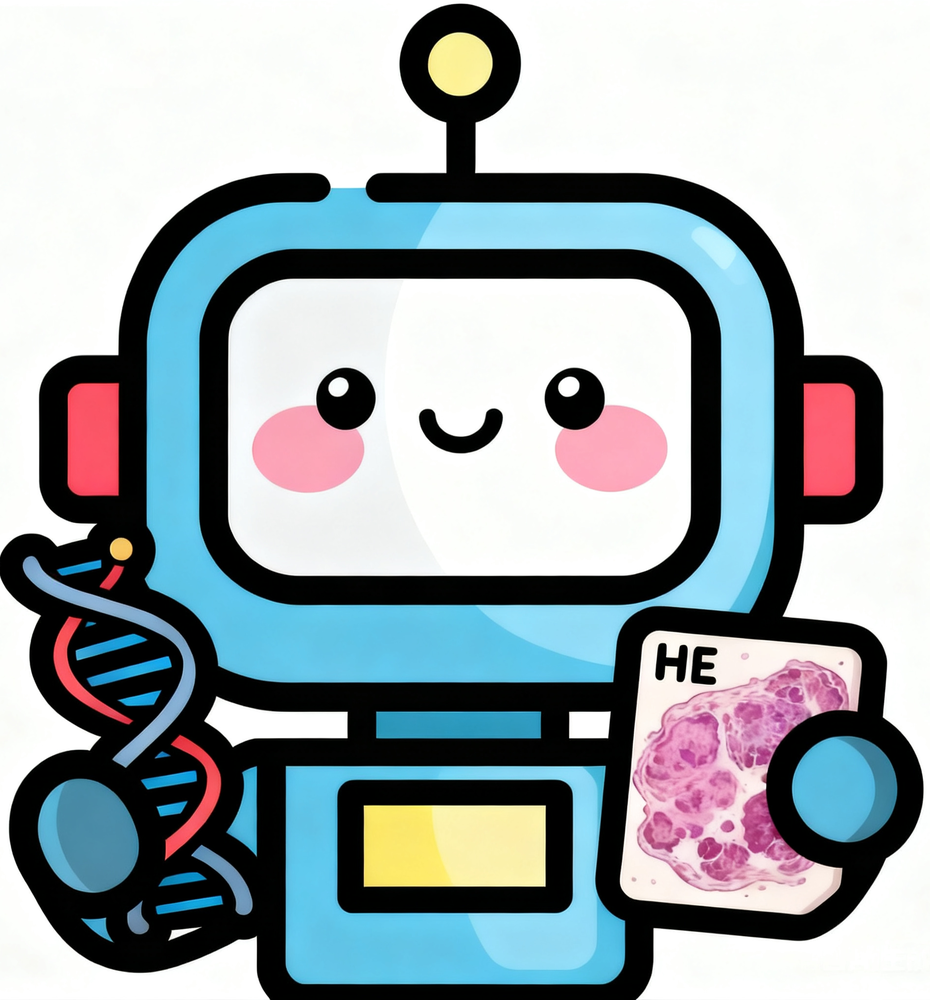
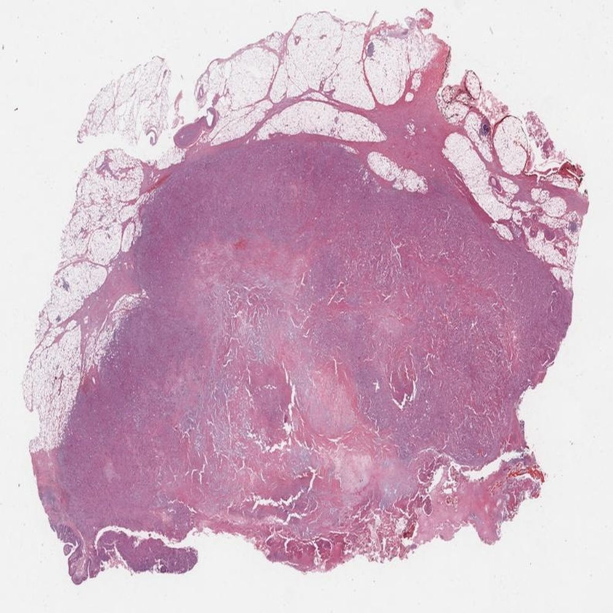
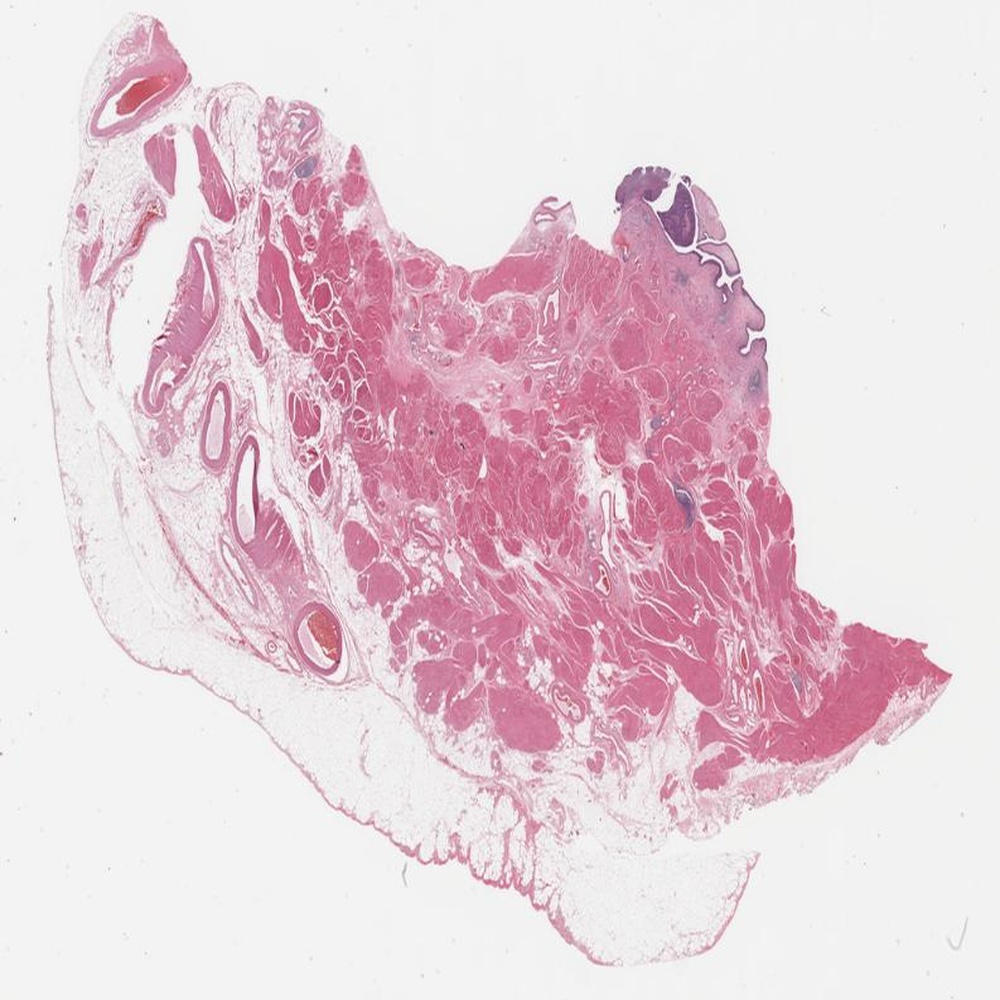
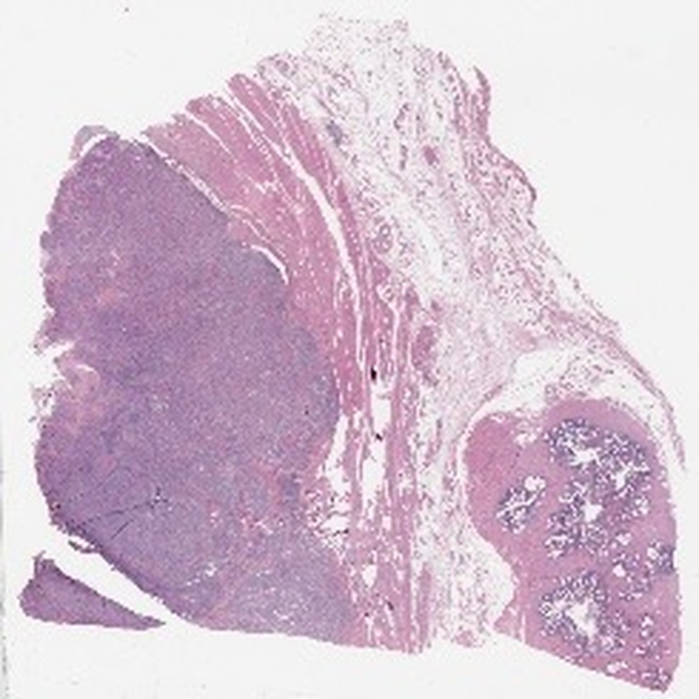
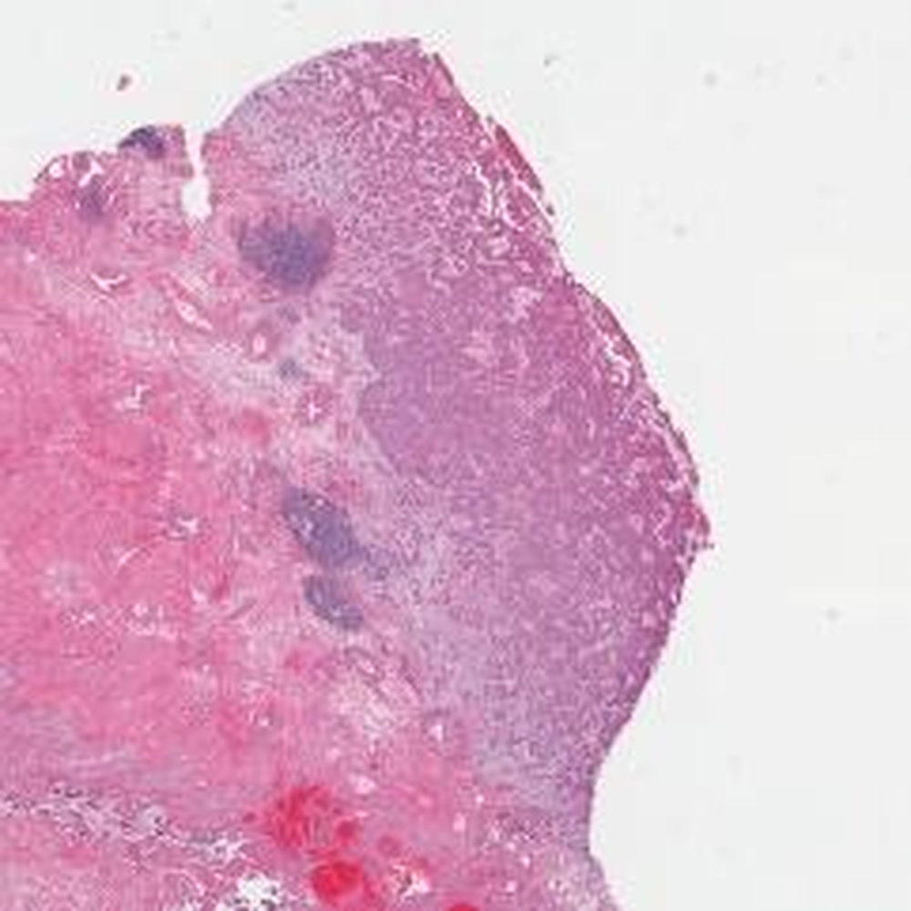

# SurvAgent: Hierarchical CoT-Enhanced Case Banking and Dichotomy-Based Multi-Agent System for Multimodal Survival Prediction

**ArXiv ID**: 2511.16635v1
**URL**: http://arxiv.org/abs/2511.16635v1
**提交日期**: 2025-11-20
**作者**: Guolin Huang; Wenting Chen; Jiaqi Yang; Xinheng Lyu; Xiaoling Luo; Sen Yang; Xiaohan Xing; Linlin Shen
**引用次数**: NULL
使用模型: gemini-2.5-flash

## 1. 核心思想总结
这是一份根据您提供的摘要整理的简洁第一轮总结：

---

**SurvAgent: 多模态生存预测的层次CoT增强案例库与二分法多智能体系统**

**Background (背景)**
生存分析对癌症预后和治疗规划至关重要。

**Problem (问题)**
尽管现有病理智能体在诊断任务中展现了可解释性，但在生存预测方面存在三点局限：1) 难以整合多模态数据；2) ROI（感兴趣区域）探索效率低下；3) 无法有效利用历史案例的经验学习。此外，现有方法普遍缺乏临床采用所需的透明度。

**Method (high-level) (方法概述)**
本文提出了SurvAgent，首个分层CoT增强的多智能体系统，用于多模态生存预测。该系统包含两个阶段：
1.  **WSI-基因CoT增强案例库构建：** 通过分层分析（低倍筛查、跨模态相似性感知与置信度感知补丁挖掘）处理病理图像，并进行基因分层分析（六类功能基因）。两者均生成带有CoT推理的结构化报告，用于经验学习。
2.  **基于二分法的多专家智能体推理：** 通过RAG检索相似案例，并结合专家预测和渐进区间细化整合多模态报告进行生存预测。

**Contribution (贡献)**
SurvAgent在五个TCGA队列上广泛实验，结果表明其性能优于传统方法、专有MLLM和现有医学智能体，为精准肿瘤学中可解释AI驱动的生存预测建立了新范式。

## 2. 方法详解
好的，基于您提供的初步总结，我们将详细阐述SurvAgent的方法细节。由于“方法节内容”是空的，我将完全根据“初步总结”中的信息进行推断和展开。

---

## SurvAgent 方法细节：多模态生存预测的层次CoT增强案例库与二分法多智能体系统

SurvAgent旨在解决现有生存预测模型在多模态数据整合、ROI探索效率、历史案例经验学习以及临床透明度方面的局限性。其核心创新在于构建了一个分层的、基于思维链（Chain of Thought, CoT）增强的案例库，并通过一个基于二分法的多专家智能体系统进行推理，从而提供可解释且鲁棒的生存预测。

### 1. 整体架构与流程概述

SurvAgent的整体流程分为两大阶段：

1.  **WSI-基因CoT增强案例库构建阶段：** 负责从历史病理全切片图像（WSI）和基因组数据中提取关键信息，并通过分层分析生成带有CoT推理过程的结构化多模态报告，存储为可供学习和检索的案例。
2.  **基于二分法的多专家智能体推理阶段：** 对新的患者数据，通过检索相似的CoT增强案例进行RAG（检索增强生成），并结合多个专家智能体的预测与渐进区间细化机制，最终给出生存预测。

这两个阶段紧密衔接，共同构建了一个端到端、可解释的多模态生存预测系统。

### 2. 阶段一：WSI-基因CoT增强案例库构建

此阶段的目标是创建包含丰富上下文和推理路径的案例，以实现经验学习和提高透明度。

#### 2.1 WSI分层CoT分析

针对病理全切片图像（WSI）数据，SurvAgent采用一种分层策略来高效提取相关信息并生成CoT推理报告，以克服ROI探索效率低下的问题。

*   **低倍筛查（Low-magnification Screening）：** 首先对WSI进行低倍率全局分析，快速识别潜在的肿瘤区域或关键病变区域。这模拟了病理医生首先在低倍镜下概览切片，定位可疑区域的过程，显著提高了后续高倍分析的效率。此步骤可能涉及基于深度学习的语义分割或目标检测模型。
*   **跨模态相似性感知补丁挖掘（Cross-modal Similarity-aware Patch Mining）：** 在识别出的潜在区域内，系统进一步挖掘高倍率补丁（patches）。这里的关键创新在于“跨模态相似性感知”：补丁的选择不仅基于其形态学特征，还会考虑其与基因表达模式或其他临床特征的关联性。例如，如果某些基因突变与特定的组织学表现相关，系统会优先选择包含这些形态特征的补丁，以确保WSI特征与基因组信息之间存在有意义的对应关系，从而促进多模态整合。这可能通过预训练的多模态特征对齐模型实现。
*   **置信度感知补丁挖掘（Confidence-aware Patch Mining）：** 系统会根据补丁所包含信息的质量和模型对其预测的置信度，优先选择那些具有高信息量且低不确定性的补丁。例如，边缘模糊、染色伪影或被判别为非肿瘤区域的补丁会被降权或过滤，从而聚焦于最具有诊断/预后价值的区域。

*   **CoT推理报告生成：** 对选定的WSI补丁集，系统会生成一个结构化的CoT推理报告。该报告不仅包含提取出的形态学特征（如核分裂相计数、肿瘤浸润淋巴细胞、肿瘤细胞异型性等），还会详细说明这些特征是如何被识别、聚合以及它们为何被认为是重要的，模拟病理医生对图像进行逐步分析和判断的过程。例如：“在低倍视野下发现A区存在大量异型增生细胞团。在高倍视野下，该区域的细胞核多形性显著，核仁清晰可见，可见3-5个核分裂相，提示恶性程度较高。”

#### 2.2 基因分层CoT分析

针对基因组数据，SurvAgent进行分层分析以揭示其对生存结局的影响。

*   **六类功能基因分层分析（Six Functional Gene Categories）：** 基因数据被组织成六个预定义的功能类别，例如：肿瘤抑制基因、原癌基因、DNA修复相关基因、免疫相关基因、代谢通路相关基因、细胞周期调控基因等。这种分类有助于系统从功能层面理解基因变异，而非仅仅关注单个基因，从而捕获更复杂的生物学通路信息。
*   **CoT推理报告生成：** 对每个功能类别的基因数据，系统会生成一个CoT推理报告。该报告会解释特定基因突变或表达模式在这些功能类别中的意义，以及它们如何通过特定生物学通路影响肿瘤进展和患者生存。例如：“患者在免疫相关基因类别中表现出PD-L1基因高表达。结合其TMB（肿瘤突变负荷）较高，推断其对免疫治疗可能响应良好，并可能影响长期生存。”

#### 2.3 多模态CoT增强案例构建

完成WSI和基因数据的CoT分析后，SurvAgent将这两部分结构化报告整合，构建一个完整的“多模态CoT增强案例”。

*   每个案例不仅包含原始数据、提取的特征，更重要的是，它包含了WSI和基因数据各自的**详细CoT推理过程**以及最终的**生存结局（例如，总生存期、事件状态）**。
*   这种案例库中的每个条目都是一个“学习单元”，其中嵌入了专家级别的分析逻辑，为后续的智能体推理提供了丰富的经验知识来源，直接解决了“无法有效利用历史案例经验学习”的问题。

### 3. 阶段二：基于二分法的多专家智能体推理

当有新的患者需要进行生存预测时，SurvAgent进入推理阶段，利用构建好的案例库和多专家智能体进行决策。

#### 3.1 查询与案例检索（RAG）

*   **查询生成：** 对于一个新的患者，其WSI和基因数据首先会经过初步特征提取，并结合其临床信息（如年龄、性别、肿瘤分期等）生成一个查询向量。
*   **RAG检索：** 系统利用检索增强生成（RAG）机制，在“WSI-基因CoT增强案例库”中检索与当前患者最相似的K个历史案例。这里的相似性度量会综合考虑WSI特征、基因特征以及CoT推理报告的语义内容，确保检索到的案例在病理形态、分子特征及潜在的生物学机制上与新患者高度匹配。
*   **检索结果：** 检索得到的不仅仅是相似患者的生存结局，更关键的是，它包含了这些相似患者的**WSI和基因CoT推理报告**，这些报告提供了具体的分析步骤和逻辑，作为智能体决策的“经验指南”。

#### 3.2 多专家智能体预测

SurvAgent设计了多个专家智能体，每个智能体可能专注于评估特定模态或整合信息。这里的“二分法（Dichotomous）”体现在智能体在推理过程中可能进行一系列的二元决策，逐步缩小预测范围或分类风险等级。

*   **专家智能体角色：** 例如，可能有一个“病理形态专家智能体”专注于分析检索到的WSI CoT报告，提取形态学风险因子；一个“基因组专家智能体”专注于分析基因CoT报告，识别分子预后标记；以及一个“整合专家智能体”负责综合多模态信息。
*   **基于CoT的预测：** 这些专家智能体不只是简单地读取特征，它们会“学习”并模仿案例库中CoT报告的推理模式。例如，当看到新的WSI特征与案例库中某个高风险案例的CoT分析过程相似时，病理智能体能够理解其高风险的潜在原因，而不仅仅是预测一个高风险分数。
*   **二分法决策：** 在预测过程中，智能体可能以二分法的方式进行决策，例如，首先判断患者是否属于“高风险”或“低风险”组；如果属于高风险组，则进一步判断是“极高风险”还是“中等风险”。这种逐步的二元分类有助于智能体更精细地划分风险等级，并为后续的区间细化奠定基础。

#### 3.3 渐进区间细化

这是SurvAgent的关键创新之一，它通过迭代地缩小预测区间来提高预测的准确性和鲁棒性，而非仅提供一个单一的预测点。

*   **初始区间预测：** 各专家智能体根据其对多模态CoT报告的分析，为患者提供一个初步的生存期区间（例如，预计生存期在12-24个月之间）。
*   **迭代细化：** 系统通过多轮的交互和信息整合，对这些初始区间进行渐进式细化。例如，如果病理智能体倾向于一个较短的生存期区间（例如，10-18个月），而基因组智能体倾向于一个稍长的区间（例如，15-22个月），整合智能体可能会结合两者的CoT推理，识别出导致差异的特定因素，并提出一个更精确的重叠区间（例如，15-18个月）。
*   **CoT指导细化：** 细化的过程也由CoT推理指导。智能体可以解释为什么某个区间被缩小，例如：“根据患者的KRAS突变情况（参考案例X的CoT报告），其对传统化疗的敏感性较低，因此将预计生存期上限从24个月下调至20个月。”

#### 3.4 多模态报告整合与生存预测

*   **最终报告生成：** 经过多专家智能体的预测和渐进区间细化后，系统整合所有模态的CoT推理，生成一个全面的、多模态的生存预测报告。这份报告不仅包含最终的生存预测（可能是概率曲线、风险等级或精细的生存期区间），还详细列出了支持该预测的病理形态学、基因组学证据，以及智能体是如何基于历史案例的CoT推理得出结论的。
*   **可解释性与透明度：** 该报告的CoT性质直接解决了“缺乏临床采用所需透明度”的问题，使医生能够理解AI的决策逻辑，从而更容易采纳和信任SurvAgent的建议。

### 4. 关键创新点总结

1.  **分层CoT增强案例库：** 首次将WSI和基因数据进行分层CoT分析，生成包含推理路径的结构化报告，极大地丰富了案例知识，实现了深度的经验学习。
2.  **跨模态相似性感知与置信度感知补丁挖掘：** 提升了WSI ROI探索效率和多模态数据整合的有效性，确保提取的特征具有高信息量和跨模态关联性。
3.  **基于二分法的多专家智能体系统：** 采用多智能体协同工作模式，通过二分法决策和CoT引导的预测，提高了预测的鲁棒性和精细度。
4.  **渐进区间细化机制：** 从单一预测点转向动态区间预测，并通过迭代细化，更好地反映了预测的不确定性，提升了临床实用价值。
5.  **RAG与CoT案例库结合：** 利用RAG检索带有CoT的案例，使得智能体能够学习“如何思考”而非仅仅“思考什么”，实现了真正意义上的可解释和经验驱动的AI推理。

### 5. 整体流程图（概念性）

```mermaid
graph TD
    subgraph 阶段一：WSI-基因CoT增强案例库构建
        A[历史WSI数据] -- 1.1 低倍筛查 --> B[潜在ROI区域]
        B -- 1.2 跨模态相似性感知 & 置信度感知补丁挖掘 --> C[WSI CoT推理报告]
        D[历史基因组数据] -- 1.3 六类功能基因分层分析 --> E[基因CoT推理报告]
        C & E -- 1.4 多模态整合 --> F[WSI-基因CoT增强案例库]
    end

    subgraph 阶段二：基于二分法的多专家智能体推理
        G[新患者WSI数据] -- 2.1 特征提取 --> H[新患者多模态查询]
        I[新患者基因组数据] -- 2.1 特征提取 --> H
        H -- 2.2 RAG检索 --> J[K个最相似CoT增强案例]
        J -- 2.3 多专家智能体预测 (病理/基因组/整合) --> K[初步生存期区间 & 二分法决策]
        K -- 2.4 渐进区间细化 (CoT指导) --> L[精细生存期区间]
        L -- 2.5 多模态报告整合 --> M[最终生存预测报告 (含CoT解释)]
    end

    F -- 提供经验知识 --> J
```

通过上述详细的方法说明，SurvAgent不仅提出了解决多模态生存预测挑战的新方法，更重要的是，它将可解释性与经验学习深度融入模型设计中，为精准肿瘤学中的AI应用树立了新范式。

## 3. 最终评述与分析
好的，基于您提供的初步总结和方法详述，以下是SurvAgent的最终综合评估：

---

## SurvAgent 最终综合评估

### 1) Overall Summary (总览)

SurvAgent是一款创新的、旨在解决多模态生存预测挑战的AI系统。它首次提出并实现了一个分层思维链（CoT）增强的多智能体系统，用于整合病理全切片图像（WSI）和基因组数据进行生存预测。该系统通过构建一个独特的WSI-基因CoT增强案例库，将病理图像分析、基因功能分层以及CoT推理过程融入历史案例学习中。在推理阶段，SurvAgent利用检索增强生成（RAG）从案例库中获取经验知识，并结合基于二分法的多专家智能体系统进行预测，该系统通过渐进区间细化机制，提供更加精细和鲁棒的生存预测，并输出高度可解释的决策报告。SurvAgent在多个TCGA队列上的实验表现优于现有方法，为精准肿瘤学中可解释AI驱动的生存预测开辟了新范式，显著提升了AI在临床应用中的透明度和可信度。

### 2) Strengths (优势)

1.  **卓越的多模态数据整合能力：** SurvAgent通过“跨模态相似性感知补丁挖掘”机制，有效连接了WSI特征与基因组信息，克服了传统方法难以整合多模态数据的局限性。这种深度整合确保了从不同模态中提取的特征是相互关联且具有生物学意义的。
2.  **开创性的CoT增强案例库：** 该系统构建了首个包含WSI和基因数据分层CoT推理的案例库。这不仅实现了高效的经验学习，更重要的是，它将AI的“思考过程”结构化并存储起来，使AI能够学习“如何思考”而非仅仅“思考什么”，为后续推理提供了丰富的上下文和解释路径。
3.  **高度的可解释性和透明度：** CoT推理报告的生成是SurvAgent的核心优势之一。无论是WSI分析、基因分层，还是最终的生存预测，系统都能提供详细的推理步骤和逻辑，极大增强了AI决策的透明度，解决了当前AI模型在临床应用中缺乏信任和采纳度的问题。
4.  **高效的ROI探索机制：** 针对WSI数据，通过“低倍筛查”和“置信度感知补丁挖掘”的分层策略，SurvAgent显著提高了ROI探索的效率和准确性，避免了对整个WSI进行高计算量分析的弊端，并确保聚焦于最具预后价值的区域。
5.  **精细和鲁棒的预测结果：** 基于二分法的多专家智能体系统与“渐进区间细化”机制相结合，使得SurvAgent不仅能提供单一的预测结果，还能输出更为精准的生存期区间，更好地反映了预测的不确定性，并能通过CoT解释区间细化的原因，这在临床决策中具有更高实用价值。
6.  **RAG与案例学习的深度结合：** 利用RAG机制检索带有CoT推理过程的相似案例，使得智能体能够基于“专家经验”进行推理，而非仅是模式匹配。这赋予了系统更强的泛化能力和对罕见病例的处理能力。
7.  **潜在的临床范式转变：** 结合了高性能、可解释性和多模态整合的SurvAgent，为精准肿瘤学中的AI应用树立了新标杆，有望推动AI辅助诊断和预后评估的临床落地。

### 3) Weaknesses / Limitations (劣势/局限性)

1.  **CoT生成与案例库构建的成本与质量：** 生成高质量、临床可信赖的CoT推理报告可能需要大量的专业知识输入（如病理医生、遗传学家的人工标注）或非常强大的基础模型（如LLM）进行自动生成。无论是哪种方式，其构建成本（时间、人力、计算资源）都可能非常高，且自动生成的CoT质量仍需严格验证。
2.  **模型复杂性与计算资源需求：** SurvAgent的架构涉及分层分析、多智能体协同、RAG检索、CoT生成和渐进区间细化等多个复杂模块，训练和推理过程可能对计算资源（GPU、内存）有较高要求，部署和维护成本较高。
3.  **案例库的泛化与动态更新：** 案例库的性能高度依赖于其多样性和代表性。如果训练数据（TCGA队列）未能覆盖所有复杂的临床情境或罕见病例，系统的泛化能力可能受限。同时，随着医学知识的更新和新数据的出现，案例库如何进行高效、持续的更新和维护，确保其时效性和准确性是一个挑战。
4.  **解释性的误导风险：** 尽管CoT提供了推理路径，但AI的“解释”是否总能与人类专家的认知完全对齐，以及在复杂情况下，AI的CoT是否会捕获到 spurious correlations（虚假相关）而非真正的因果关系，仍需深入研究和验证。过于复杂的CoT也可能反而增加理解难度。
5.  **“二分法”决策的潜在局限性：** 尽管系统通过区间细化提升了精度，但其多专家智能体可能在某些决策点上采用二分法。在某些边缘或模糊病例中，这种强制性的二分可能简化了连续性的生物学复杂性，需要确保这种二分法不会丢失重要的细微信息。
6.  **隐私和数据安全：** 处理敏感的患者WSI和基因组数据，构建大规模案例库，必须严格遵守数据隐私和安全法规，确保数据的匿名化和去识别化，这增加了部署的复杂性。

### 4) Potential Applications / Implications (潜在应用/影响)

1.  **精准肿瘤学和个性化治疗：** SurvAgent可以直接应用于癌症患者的个体化预后评估和治疗策略制定。医生可以根据系统提供的精确生存预测和可解释的决策路径，为患者选择最合适的治疗方案（如免疫治疗、化疗等）。
2.  **临床决策支持系统：** 作为一种强大的临床辅助工具，SurvAgent能为肿瘤科医生和病理医生提供基于多模态证据和AI逻辑的第二意见，尤其是在复杂或罕见病例中，从而提高诊断和预后评估的准确性和一致性。
3.  **生物标志物发现与药物研发：** 通过分析CoT报告中反复出现的关键WSI特征和基因组信息，研究人员可以识别新的预后或预测性生物标志物。这有助于加速靶向药物和免疫疗法的研发，为新药开发提供数据驱动的线索。
4.  **医学教育与培训：** SurvAgent生成的详细CoT推理报告可以作为优秀的教学案例，帮助医学生和年轻医生理解复杂的癌症病理学、基因组学与临床预后之间的关系，提升他们的多模态数据整合分析能力。
5.  **提升医疗质量和标准化：** 通过AI系统一致性的分析和判断，可以减少不同医生之间在预后评估上的主观差异，从而提高医疗服务的标准化水平和整体质量。
6.  **临床试验设计优化：** SurvAgent可以帮助研究人员更好地进行患者分层，识别对特定治疗反应更佳的亚组患者，从而优化临床试验设计，提高试验效率和成功率。

---


---

# 附录：论文图片

## 图 1


## 图 2


## 图 3


## 图 4


## 图 5


## 图 6


## 图 7


## 图 8


## 图 9


## 图 10


