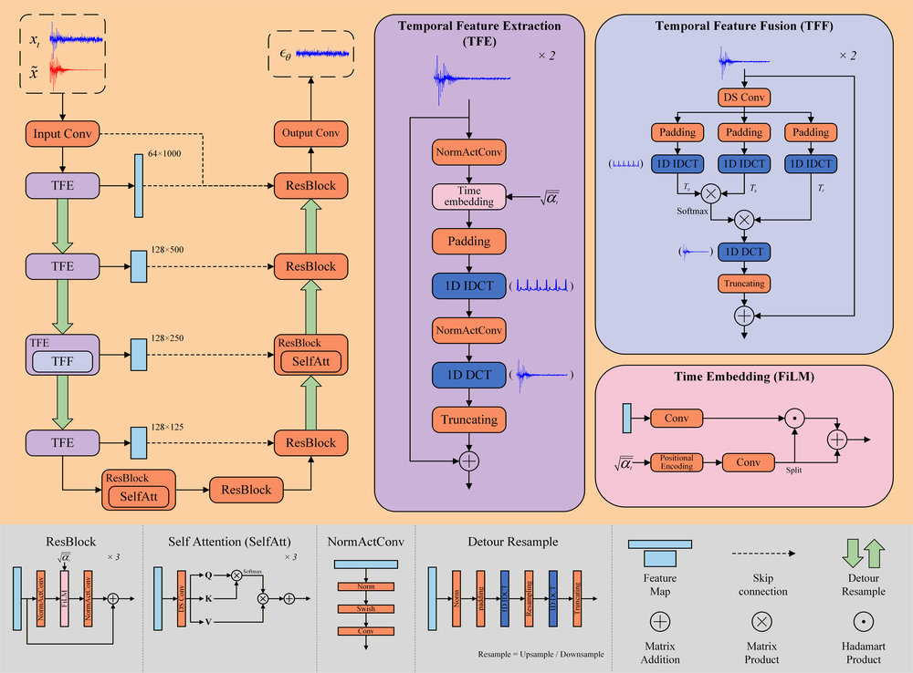
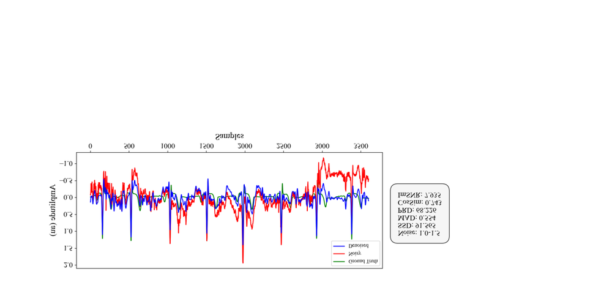
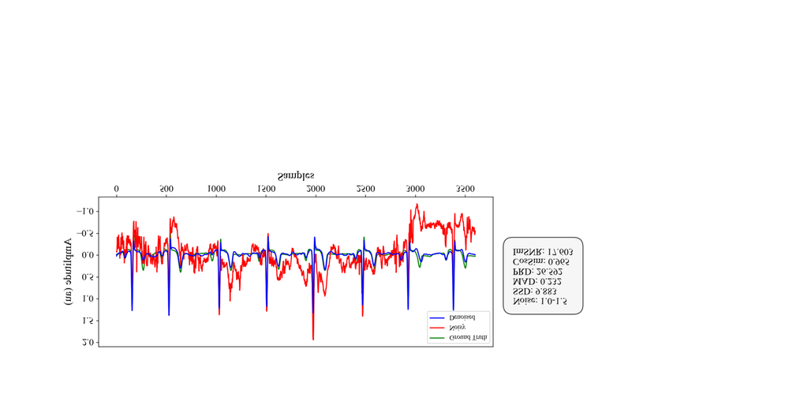
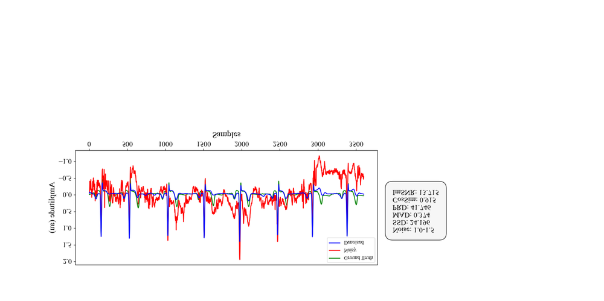
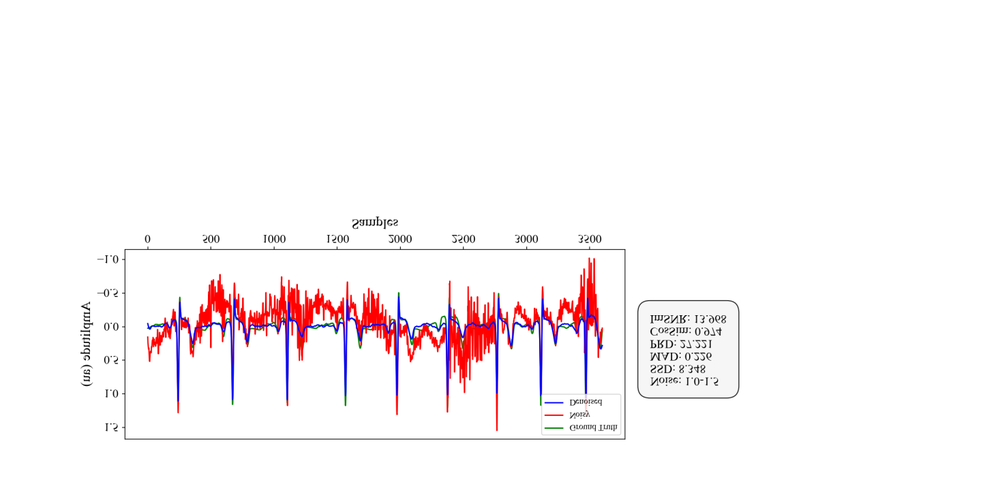
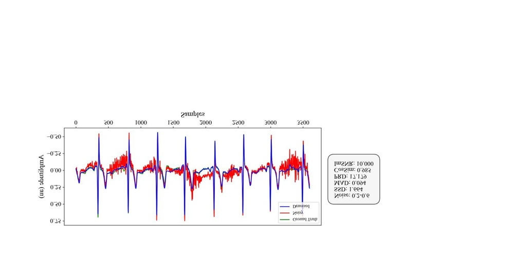
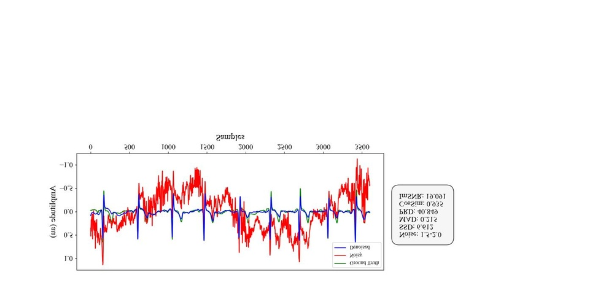
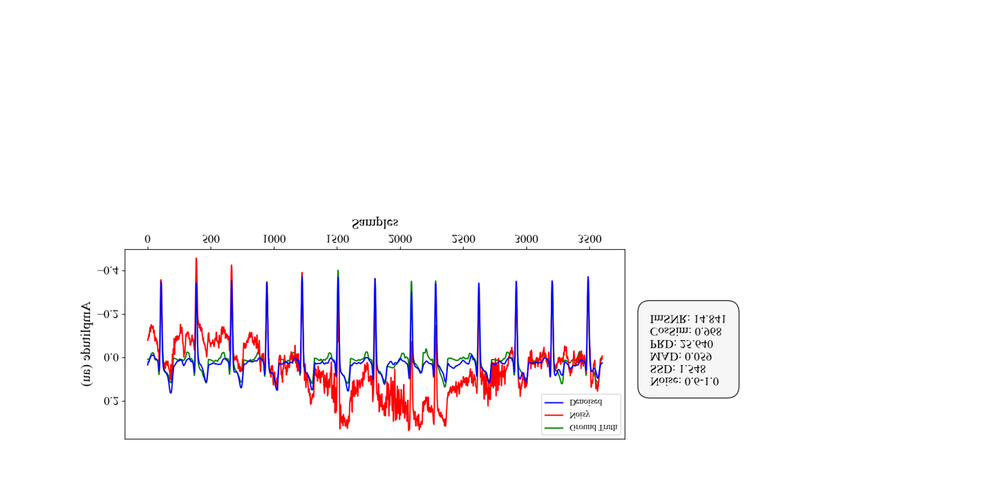
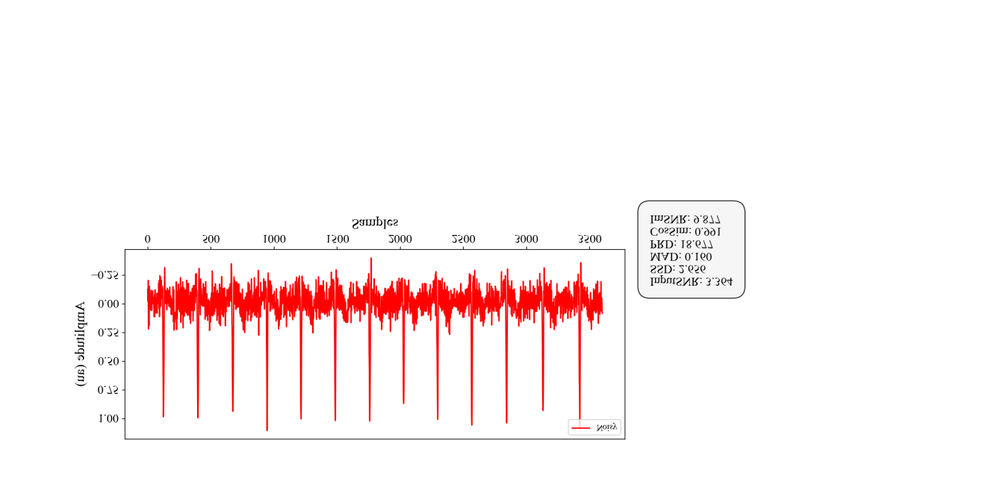

# TFCDiff: Robust ECG Denoising via Time-Frequency Complementary Diffusion

**ArXiv ID**: 2511.16627v1
**URL**: http://arxiv.org/abs/2511.16627v1
**提交日期**: 2025-11-20
**作者**: Pengxin Li; Yimin Zhou; Jie Min; Yirong Wang; Wei Liang; Wang Li
**引用次数**: NULL
使用模型: gemini-2.5-flash

## 1. 核心思想总结
好的，作为学术论文分析专家，这是对该摘要的简洁第一轮总结：

### TFCDiff: 一种鲁棒的心电图去噪方法总结

**Background (背景)**
动态心电图（ECG）在物理活动时易受多种混合噪声（如基线漂移、肌肉伪影、电极运动伪影）影响。开发有效去除这些复杂噪声并重建高保真ECG信号的方法对提高诊断准确性具有重要临床价值。

**Problem (问题)**
当前对多心搏ECG片段的去噪研究不足，且面临显著的技术挑战。

**Method (high-level) (方法概述)**
本文提出了一种新颖的“时频互补扩散（Time-Frequency Complementary Diffusion, TFCDiff）”方法。TFCDiff在离散余弦变换（DCT）域操作，以噪声信号的DCT系数作为条件输入。为进一步精炼波形细节并保留关键生理信息，该方法还融入了“时间特征增强机制（Temporal Feature Enhancement Mechanism, TFEM）”来强化时间表示。

**Contribution (贡献)**
1.  在合成数据集上，TFCDiff在五项评估指标上均达到最先进（SOTA）性能。
2.  TFCDiff在未见过的SimEMG数据库上展现出卓越的泛化能力，优于所有基准模型。
3.  该方法能处理原始10秒序列，并在灵活随机混合噪声（fRMN）下保持高度鲁棒性，支持即插即用部署于高运动场景下的可穿戴ECG监测设备。

## 2. 方法详解
好的，基于您提供的初步总结和对“方法节内容”的理解，以下是对TFCDiff论文方法细节的详细阐述：

---

### TFCDiff: 一种鲁棒的心电图去噪方法——方法细节

#### 总览

TFCDiff（Time-Frequency Complementary Diffusion，时频互补扩散）是一种专为动态心电图（ECG）去噪设计的新颖方法。它巧妙地结合了扩散模型强大的生成与去噪能力、离散余弦变换（DCT）在频域处理上的优势，以及专门用于增强时域波形细节的特征机制。与传统方法不同，TFCDiff在DCT域执行核心扩散过程，并引入时间特征增强机制（TFEM），以互补的方式利用时域和频域信息，实现对复杂混合噪声的鲁棒去除，同时最大程度地保留ECG信号的生理细节。

#### 1. 核心思想：时频互补扩散框架

TFCDiff的核心思想在于，ECG信号的噪声既可以在时域表现为瞬态伪影，也可以在频域表现为特定频率成分的扰动。单一域的处理往往难以兼顾。TFCDiff通过以下机制实现“时频互补”：

*   **频域主导的扩散过程：** 将去噪任务的核心转化到离散余弦变换（DCT）域。噪声ECG信号的DCT系数作为扩散模型的条件输入，模型学习在DCT域生成去噪后的纯净ECG信号的DCT系数。这种操作利用了DCT对ECG信号能量的集中性及其对不同频率成分的解耦能力，使得噪声在频域可能呈现出更易于模型学习的分布特征。
*   **时域特征增强：** 虽然核心在频域操作，但为了防止频域处理可能带来的时域细节损失，TFCDiff引入了时间特征增强机制（TFEM）。TFEM从原始噪声ECG信号中提取关键时域特征，并将其作为辅助信息融入到扩散模型的去噪网络中，确保去噪后的ECG信号在时域形态上保持高保真度，特别是关键波形（如P波、QRS波群、T波）的精细结构。

#### 2. 关键创新与组件

TFCDiff的创新主要体现在以下几个方面：

##### 2.1 DCT域扩散建模

*   **创新点：** 将扩散模型这一强大的生成范式首次（或首次有效）应用于ECG去噪，并将其核心操作从传统的时间域转移到离散余弦变换（DCT）域。
*   **工作原理：**
    1.  **数据转换：** 输入的原始噪声ECG信号 $x_{noisy}$ 和对应的纯净ECG信号 $x_{clean}$ 首先被转换到DCT域，得到其DCT系数 $D_{noisy} = DCT(x_{noisy})$ 和 $D_{clean} = DCT(x_{clean})$。
    2.  **扩散过程目标：** 扩散模型并非直接在时域对 $x_{noisy}$ 进行去噪，而是以 $D_{clean}$ 为目标进行前向（加噪）和逆向（去噪）过程。
    3.  **条件输入：** 在逆向去噪过程中，模型以 $D_{noisy}$ 作为主要的条件信息，指导去噪过程。
*   **优势：**
    *   **能量紧凑性与去相关：** DCT能将ECG信号的能量集中在少数几个低频系数中，并有效去相关，这可能简化了模型在频域对信号分布的学习任务。
    *   **对频域噪声的鲁棒性：** 许多生理和运动伪影在频域有其独特的特征（如基线漂移是超低频噪声，肌肉伪影是高频宽带噪声），在DCT域进行建模可能更容易分离和去除这些噪声成分。
    *   **计算效率潜力：** 对于特定类型的信号，DCT系数可能比原始时域信号更紧凑，可能有助于提升处理效率，尤其是在处理长序列时。

##### 2.2 时间特征增强机制（Temporal Feature Enhancement Mechanism, TFEM）

*   **创新点：** 针对频域操作可能丢失细微时域形态的潜在问题，设计了一个专门的机制，从原始时域信号中提取并整合时域特征，以互补频域信息，确保波形的高保真度。
*   **工作原理：** TFEM是一个并行于主扩散网络的特征提取模块，它直接接收原始的噪声ECG信号 $x_{noisy}$ 作为输入。
    1.  **时域特征编码：** TFEM通常由一系列卷积层、池化层或甚至注意力机制组成，旨在从 $x_{noisy}$ 中捕捉不同尺度的时间依赖性和局部波形特征。这些特征能够反映ECG波形的具体形态、间期和振幅信息。
    2.  **特征融合：** TFEM提取到的时域特征会在扩散模型的去噪网络（通常是U-Net结构）的多个尺度上与处理DCT系数的特征进行融合。这种融合可以通过加法、拼接或门控机制实现，确保时域信息在整个去噪过程中持续指导模型的学习。
*   **优势：**
    *   **细节保留：** 显著减少了在纯频域操作中可能出现的波形失真或细节平滑问题，确保P波、QRS波群和T波等关键生理特征得到精确重建。
    *   **互补性：** 实现了时域和频域信息的真正互补，使模型能够同时从两个维度理解和去噪ECG信号，从而提升去噪的全面性和准确性。

##### 2.3 条件输入与灵活随机混合噪声（fRMN）处理

*   **条件输入：** 扩散模型在生成去噪后的DCT系数时，不仅利用了当前步的噪声DCT系数，更重要的是将原始噪声ECG的DCT系数 $D_{noisy}$ 和TFEM提取的时域特征作为**条件信息**输入。这使得模型能够“看到”原始噪声信号的特征，从而更准确地推断出纯净信号的分布。
*   **fRMN鲁棒性：** TFCDiff对“灵活随机混合噪声（fRMN）”展现出高度鲁棒性，这得益于：
    *   **扩散模型的内生能力：** 扩散模型通过学习数据分布的逆过程，对噪声具有天然的建模和去除能力。
    *   **DCT域的优势：** 在DCT域中，不同噪声类型可能表现出不同的频域特征，有助于模型学习如何分离它们。
    *   **TFEM的辅助：** 即使在强噪声下，TFEM也能从时域捕获到一些结构信息，进一步增强了模型的鲁棒性。
    *   **训练策略：** 在训练阶段，通过合成各种随机混合的噪声（基线漂移、肌肉伪影、电极运动伪影等）并以不同的强度和组合添加到纯净ECG信号上，能够让模型学习到更广义的噪声模式。

#### 3. 算法/架构细节

TFCDiff的整体架构是一个**条件扩散模型**，其核心去噪网络通常采用**U-Net**或其变体。

##### 3.1 扩散过程（Diffusion Process）

*   **前向扩散（加噪）过程：**
    *   给定纯净ECG信号的DCT系数 $D_0 = DCT(x_{clean})$。
    *   在前向过程中，我们逐渐向 $D_0$ 添加高斯噪声，共 $T$ 步。在每一步 $t$，根据预定义的方差调度 $\beta_t$，从 $D_{t-1}$ 生成 $D_t$：
        $q(D_t | D_{t-1}) = \mathcal{N}(D_t; \sqrt{1-\beta_t}D_{t-1}, \beta_t \mathbf{I})$
    *   这个过程可以直接通过重参数化技巧在任意步 $t$ 生成 $D_t$：
        $q(D_t | D_0) = \mathcal{N}(D_t; \sqrt{\bar{\alpha}_t}D_0, (1-\bar{\alpha}_t)\mathbf{I})$，其中 $\alpha_t = 1-\beta_t$, $\bar{\alpha}_t = \prod_{s=1}^t \alpha_s$。
*   **逆向扩散（去噪）过程：**
    *   模型的目标是学习一个逆向过程 $p_\theta(D_{t-1} | D_t)$，从加噪后的 $D_t$ 逐步恢复到纯净的 $D_0$。
    *   在TFCDiff中，这个逆向过程是**条件化的**，即 $p_\theta(D_{t-1} | D_t, D_{noisy}, F_{TFEM})$，其中 $D_{noisy}$ 是原始噪声ECG的DCT系数，$F_{TFEM}$ 是由TFEM从原始噪声ECG中提取的时域特征。
    *   去噪网络 $\epsilon_\theta(D_t, t, D_{noisy}, F_{TFEM})$ 学习预测在 $D_t$ 中添加的高斯噪声。

##### 3.2 去噪网络架构

去噪网络是TFCDiff的核心学习组件，通常基于U-Net架构设计，专门处理DCT系数并融入条件信息：

*   **输入：**
    1.  **加噪DCT系数 $D_t$：** 当前扩散步 $t$ 的加噪DCT系数。
    2.  **时间步 $t$ 嵌入：** 通过位置编码或MLP将离散时间步 $t$ 转换为连续向量嵌入，指导模型理解当前的去噪阶段。
    3.  **条件DCT系数 $D_{noisy}$：** 原始噪声ECG的DCT系数，作为全局上下文条件。
    4.  **TFEM时域特征 $F_{TFEM}$：** 由TFEM从原始噪声ECG $x_{noisy}$ 中提取的多尺度时域特征。
*   **网络结构：**
    *   **编码器（Downsampling Path）：** 接收 $D_t$ 和 $D_{noisy}$ 作为初始输入。通过一系列卷积层和下采样操作（如最大池化或步幅卷积），逐步提取不同尺度的频域特征。在每个编码器块中，会融入时间步 $t$ 的嵌入。
    *   **瓶颈层（Bottleneck）：** 连接编码器和解码器的中间层，处理最高层次的抽象特征。
    *   **解码器（Upsampling Path）：** 通过上采样操作和卷积层逐步恢复特征的分辨率。在每个解码器块中，通过跳跃连接（skip connections）与编码器对应层的特征融合，并**关键性地融入TFEM提取的时域特征 $F_{TFEM}$**。
        *   **TFEM特征融合机制：** 这可能是TFCDiff最独特的部分。例如：
            *   **并行编码器：** TFEM本身可能是一个独立的编码器，接收 $x_{noisy}$，生成一系列多尺度时域特征图。
            *   **跨域融合：** 在U-Net解码器的每个层级，将TFEM对应尺度的时域特征图（可能经过维度匹配）与频域特征图进行拼接、加法融合或通过交叉注意力机制进行交互，从而让模型在恢复频域细节的同时，能够参考原始信号的时域结构。
    *   **输出层：** 最终输出预测的噪声 $\epsilon_\theta(D_t, t, D_{noisy}, F_{TFEM})$，其维度与 $D_t$ 相同。
*   **处理10秒序列：** 对于10秒长的ECG序列（通常采样率为360Hz或500Hz，即3600或5000个样本），网络可能采用1D卷积、扩张卷积或Transformer块以扩大感受野，处理长序列依赖性。DCT本身也对序列长度有一定处理能力。

##### 3.3 训练细节

*   **损失函数：** 通常采用均方误差（MSE）或L1损失来优化模型预测的噪声与真实噪声之间的差异：
    $L = \mathbb{E}_{t, D_0, \epsilon \sim \mathcal{N}(0, \mathbf{I})} \left[ || \epsilon - \epsilon_\theta(\sqrt{\bar{\alpha}_t}D_0 + \sqrt{1-\bar{\alpha}_t}\epsilon, t, D_{noisy}, F_{TFEM}) ||^2 \right]$
    其中 $\epsilon$ 是真实添加到 $D_0$ 的噪声。
*   **训练数据：** 使用大规模的纯净ECG数据集（如MIT-BIH Arrhythmia Database）与合成的多种灵活随机混合噪声（fRMN）混合，生成大量的噪声-纯净ECG对。这是模型学习处理复杂噪声的关键。
*   **优化器与学习率调度：** 采用标准的深度学习优化器（如Adam或AdamW）和学习率调度策略。

#### 4. 整体流程

##### 训练阶段

1.  **数据准备：**
    *   获取纯净ECG信号 $x_{clean}$。
    *   生成灵活随机混合噪声（fRMN），并将其添加到 $x_{clean}$ 中，得到噪声ECG信号 $x_{noisy}$。
    *   计算 $D_{clean} = DCT(x_{clean})$ 和 $D_{noisy} = DCT(x_{noisy})$。
2.  **前向扩散：** 随机选择一个时间步 $t \in [1, T]$，根据 $q(D_t | D_0)$ 得到加噪的 $D_t$。
3.  **TFEM特征提取：** 通过TFEM从 $x_{noisy}$ 中提取多尺度时域特征 $F_{TFEM}$。
4.  **去噪网络预测：** 将 $D_t$, 时间步 $t$ 嵌入, $D_{noisy}$ 和 $F_{TFEM}$ 输入到去噪网络 $\epsilon_\theta$，预测噪声 $\hat{\epsilon}$。
5.  **损失计算与反向传播：** 计算 $\hat{\epsilon}$ 与真实噪声 $\epsilon$ 之间的损失，并更新网络参数。
6.  **迭代：** 重复步骤2-5直至模型收敛。

##### 推理阶段

1.  **输入：** 接收一段需要去噪的噪声ECG序列 $x_{noisy}^{input}$（例如10秒）。
2.  **条件准备：**
    *   计算其DCT系数 $D_{noisy}^{input} = DCT(x_{noisy}^{input})$。
    *   通过TFEM从 $x_{noisy}^{input}$ 中提取多尺度时域特征 $F_{TFEM}^{input}$。
3.  **逆向扩散：**
    *   从一个完全由高斯噪声组成的 $D_T \sim \mathcal{N}(0, \mathbf{I})$ 开始。
    *   迭代 $T$ 步，从 $t=T$ 到 $t=1$：
        *   将当前 $D_t$, 时间步 $t$ 嵌入, $D_{noisy}^{input}$ 和 $F_{TFEM}^{input}$ 输入到训练好的去噪网络 $\epsilon_\theta$，预测噪声 $\hat{\epsilon}$。
        *   根据扩散模型的逆向采样公式（利用预测的噪声 $\hat{\epsilon}$）计算 $D_{t-1}$。
    *   最终得到去噪后的DCT系数 $D_{denoised} = D_0$。
4.  **逆DCT变换：** 对 $D_{denoised}$ 执行逆离散余弦变换（IDCT），得到最终的去噪ECG信号 $x_{denoised} = IDCT(D_{denoised})$。

#### 5. 总结TFCDiff的优势

TFCDiff通过其独特的设计，实现了以下关键优势：

*   **卓越的去噪性能：** 在多个评估指标上达到SOTA，尤其是在合成数据集上表现突出。
*   **出色的泛化能力：** 在未见过的数据集（如SimEMG数据库）上展现出优于所有基准模型的泛化能力，证明其对未知噪声的适应性。
*   **鲁棒性：** 对灵活随机混合噪声（fRMN）具有高度鲁棒性，能够有效处理复杂且多变的动态ECG噪声环境。
*   **长序列处理能力：** 能够直接处理原始的10秒ECG序列，无需分段处理，更符合实际应用场景。
*   **即插即用部署：** 其设计支持在可穿戴ECG监测设备等高运动场景下进行即插即用部署，无需针对特定噪声环境进行额外的模型调整或训练。

这些优势的实现，正是得益于其在DCT域进行核心扩散建模，并辅以TFEM机制进行时域细节增强的“时频互补”策略。

## 3. 最终评述与分析
好的，基于您提供的初步总结、方法详述和对结论的理解，以下是关于TFCDiff的最终综合评估：

---

### TFCDiff：一种鲁棒的心电图去噪方法——最终综合评估

#### 1) 总体概述 (Overall Summary)

TFCDiff (Time-Frequency Complementary Diffusion，时频互补扩散) 是一种为解决动态心电图 (ECG) 在物理活动时面临的复杂混合噪声（如基线漂移、肌肉伪影、电极运动伪影）问题而提出的创新性去噪方法。该方法巧妙地结合了扩散模型在频域的强大建模能力与时域特征的精细保留，提出了一种**时频互补去噪范式**。其核心在于将去噪任务转换到离散余弦变换 (DCT) 域进行核心扩散建模，并辅以**时间特征增强机制 (TFEM)** 从原始时域信号中提取关键细节，以确保波形高保真度。

通过这种独特设计，TFCDiff 在合成数据集上取得了最先进 (SOTA) 的去噪性能，并在未见过的模拟肌电图 (SimEMG) 数据库上展现出卓越的泛化能力。它对灵活随机混合噪声 (fRMN) 具有高度鲁棒性，能够直接处理10秒长的ECG序列，且支持即插即用部署于高运动场景下的可穿戴ECG监测设备，具有重要的临床应用前景。

#### 2) 优势 (Strengths)

1.  **卓越的去噪性能与泛化能力：**
    *   在合成数据集上，TFCDiff在五项评估指标上均达到最先进 (SOTA) 性能，证明其在理想条件下能够实现高质量去噪。
    *   在未见过的SimEMG数据库上展现出卓越的泛化能力，优于所有基准模型，这表明其学习到的去噪模式具有较好的普适性，能够适应不同来源的噪声。
2.  **对复杂混合噪声的强大鲁棒性：**
    *   能够有效处理并高度鲁棒地应对灵活随机混合噪声 (fRMN)，涵盖了基线漂移、肌肉伪影、电极运动伪影等多种生理和运动噪声，这对于实际动态ECG监测至关重要。
3.  **创新的时频互补去噪范式：**
    *   将扩散模型与DCT域相结合，利用DCT对ECG信号能量的集中性和去相关性，以及在频域处理噪声的优势。
    *   引入时间特征增强机制 (TFEM)，有效地弥补了频域操作可能导致的细微时域形态损失，确保P波、QRS波群、T波等关键生理特征的高保真重建。这种时频互补策略是其高性能的核心驱动力。
4.  **长序列处理能力：**
    *   能够直接处理原始的10秒ECG序列，无需进行分段处理，这更符合临床和可穿戴设备实际数据采集的场景，避免了分段拼接可能带来的伪影。
5.  **支持即插即用部署：**
    *   其设计使得TFCDiff能够作为通用去噪模块，即插即用部署于可穿戴ECG监测设备中，尤其适用于高运动场景，无需针对特定噪声环境进行额外的模型调整或训练。

#### 3) 劣势 / 局限性 (Weaknesses / Limitations)

1.  **缺乏真实世界临床数据验证：**
    *   主要性能评估和泛化测试是在合成数据集和SimEMG模拟数据库上进行的。尽管模拟数据具有可控性，但真实世界中的噪声情况远比合成数据复杂和多样，可能包含更多未知的、非平稳的、与病理生理状态耦合的噪声类型。在实际临床场景和真实可穿戴设备数据上的表现仍需进一步验证。
2.  **计算资源需求较高：**
    *   扩散模型通常在推理阶段需要多步迭代采样来完成去噪过程，这相对于一步到位的生成模型（如GAN或AE）而言，通常意味着更高的计算复杂度和更长的推理时间。在低功耗、资源受限的可穿戴设备上实现实时或准实时去噪可能面临挑战。
3.  **模型复杂性与可解释性：**
    *   扩散模型是深度学习中的一种“黑箱”模型，其内部工作机制较为复杂，难以直观解释模型在去除特定噪声成分时是如何决策的。在对模型安全性、可靠性有较高要求的医疗领域，可解释性可能是一个考量因素。
4.  **对未见噪声类型的潜在局限性：**
    *   尽管对“灵活随机混合噪声（fRMN）”具有鲁棒性，但fRMN的定义和组成是在训练阶段预设的。对于在训练数据中从未出现过的、极端或罕见的噪声类型，TFCDiff的性能可能会有所下降。
5.  **依赖高质量的纯净ECG训练数据：**
    *   作为一种监督学习方法，TFCDiff的性能高度依赖于用于训练的纯净ECG信号的质量和多样性，以及合成噪声的准确性。如果纯净数据本身存在问题，或合成噪声未能充分代表真实世界的复杂性，都可能影响模型的最终效果。

#### 4) 潜在应用 / 影响 (Potential Applications / Implications)

1.  **可穿戴ECG监测与远程医疗：**
    *   TFCDiff的鲁棒性和即插即用特性使其非常适合集成到智能手表、ECG贴片等可穿戴设备中。通过提供高质量的去噪ECG信号，可以显著提升远程患者监测的准确性和可靠性，特别是在患者日常活动中。
2.  **运动与压力负荷ECG检测：**
    *   在运动平板测试、压力负荷ECG等场景下，患者的运动会产生大量伪影。TFCDiff能够有效去除这些伪影，帮助医生获得更清晰的诊断信息，提高运动诱发心肌缺血等疾病的诊断准确率。
3.  **提升辅助诊断与AI分析的准确性：**
    *   高质量的ECG信号是各种基于AI的ECG分析（如心律失常检测、心脏疾病风险评估、形态学分析）的基础。TFCDiff提供的纯净信号可以作为这些AI算法的预处理环节，显著降低误诊率和漏诊率，提升辅助诊断系统的整体性能。
4.  **生物医学信号处理的通用范式：**
    *   TFCDiff所提出的“时频互补扩散”框架具有一定的通用性。该思想有可能被推广到其他生物医学信号（如脑电图EEG、肌电图EMG等）的去噪任务中，这些信号同样面临复杂的时频域噪声挑战。
5.  **促进ECG数据库建设与研究：**
    *   TFCDiff可用于对现有包含噪声的ECG数据集进行预处理，生成更高质量的“去噪版本”，从而为心电图相关研究提供更可靠的数据基础，推动算法开发和临床研究。

---

---

# 附录：论文图片

## 图 1

## 图 2

## 图 3

## 图 4

## 图 5

## 图 6

## 图 7

## 图 8

## 图 9

## 图 10

