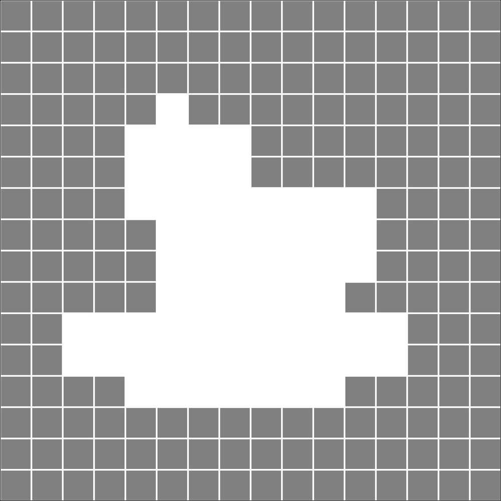
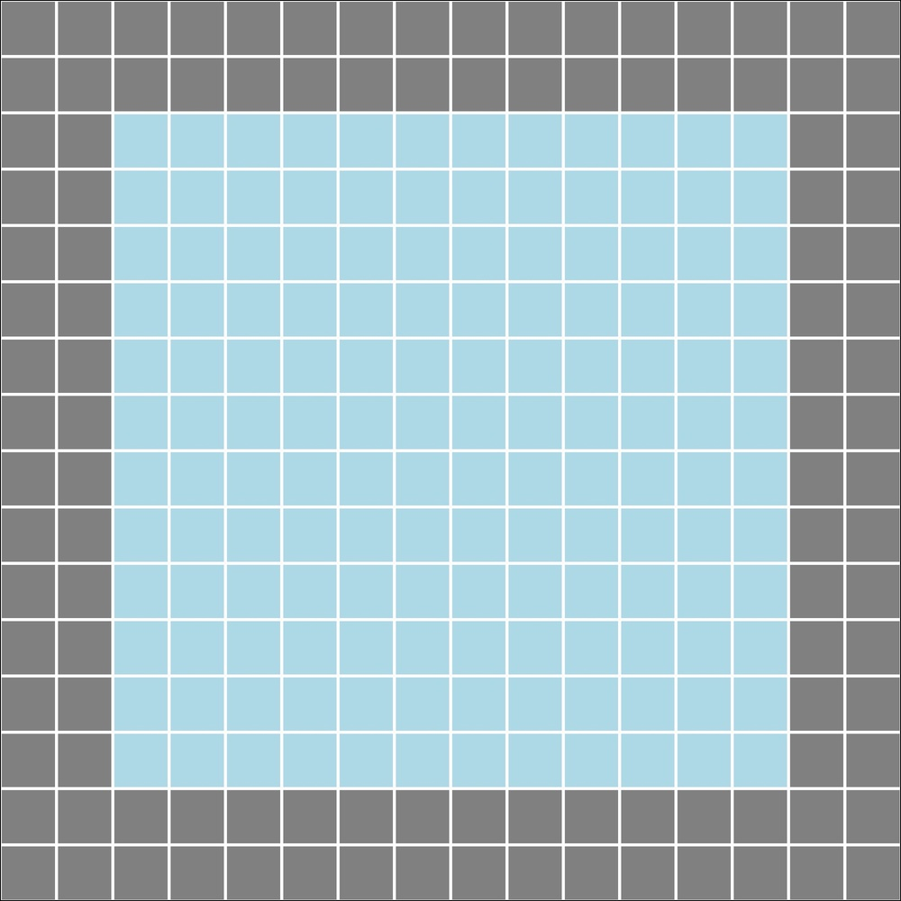
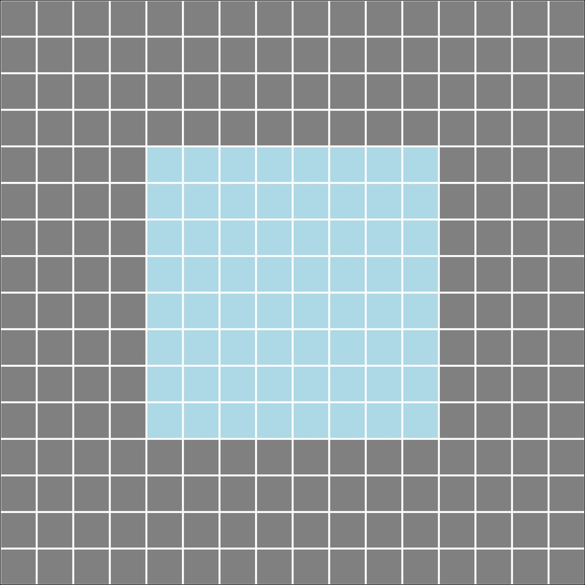
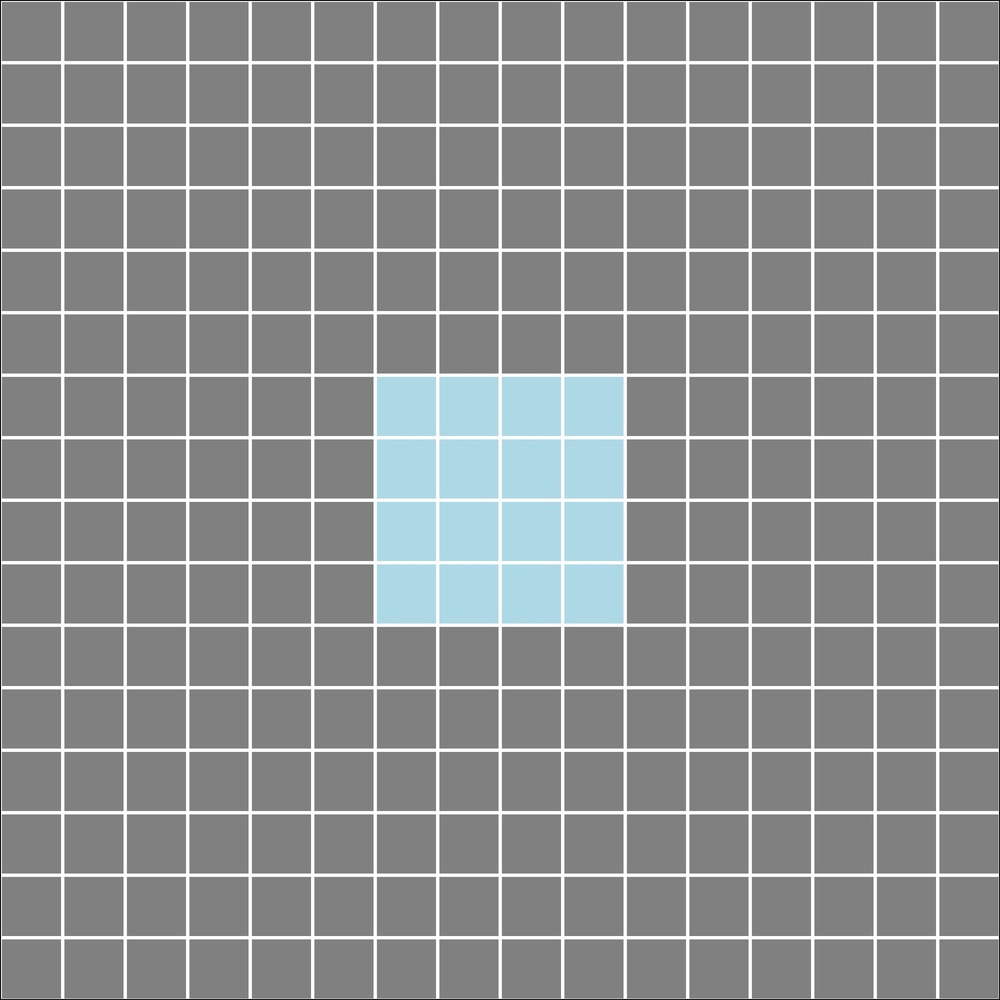
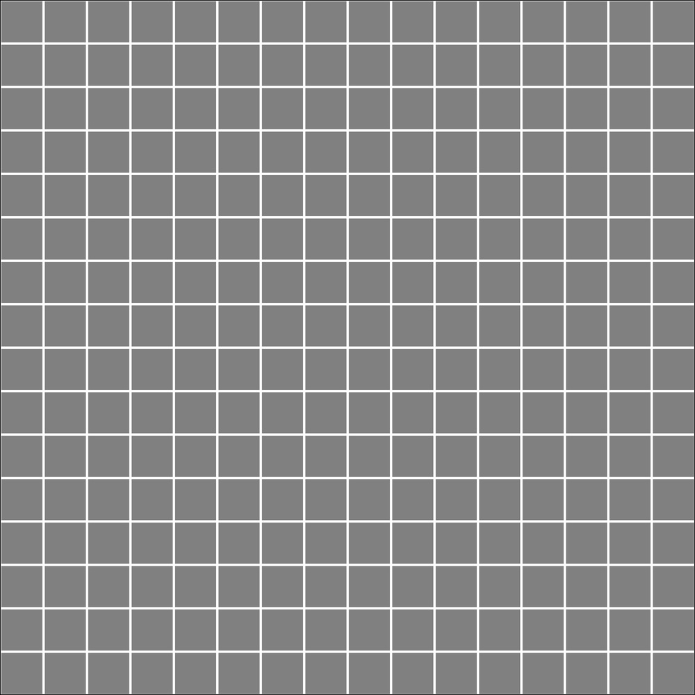
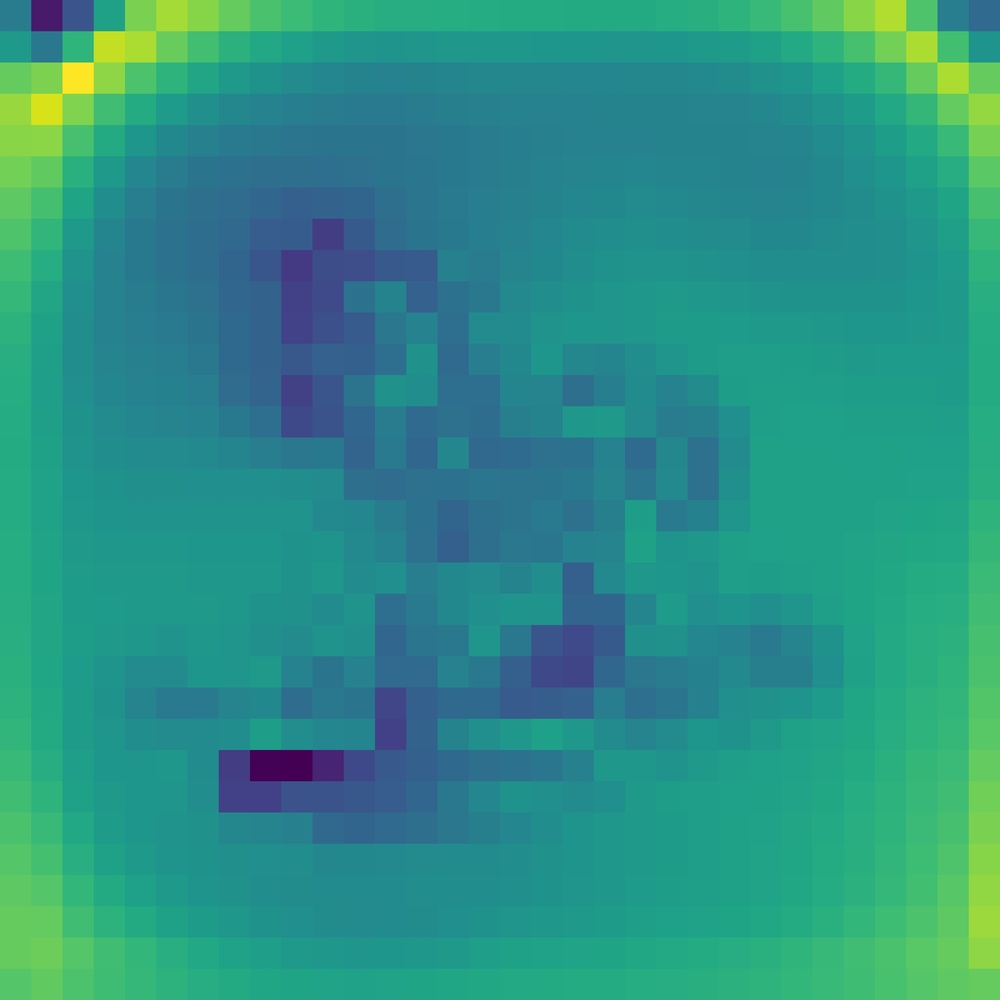

# TRIM: Scalable 3D Gaussian Diffusion Inference with Temporal and Spatial Trimming

**ArXiv ID**: 2511.16642v1
**URL**: http://arxiv.org/abs/2511.16642v1
**提交日期**: 2025-11-20
**作者**: Zeyuan Yin; Xiaoming Liu
**引用次数**: NULL
使用模型: gemini-2.5-flash

## 1. 核心思想总结
这是一份根据您提供的摘要整理的简洁的第一轮总结：

---

**标题:** TRIM: 可扩展的3D高斯扩散推理，兼具时间和空间剪枝

**背景 (Background):**
近年来3D高斯扩散模型取得了进展，能够生成高质量的3D内容。

**问题 (Problem):**
由于高斯基元数量庞大，现有3D高斯扩散模型在去噪和后处理阶段耗时严重，导致生成速度慢且采样轨迹的可扩展性受限。

**方法概要 (Method - High-level):**
本文提出TRIM (Trajectory Reduction and Instance Mask denoising) 方法，这是一种训后（post-training）方法，通过结合时间和空间剪枝策略来加速3D高斯扩散模型的推理，同时不损害输出质量并支持推理时缩放。
具体而言，TRIM包括：
1.  **时间剪枝：** 开发一个轻量级选择器模型，评估潜在高斯基元，实现早期轨迹缩减，选出高质量候选。
2.  **空间剪枝：** 引入实例掩码去噪，通过过滤冗余背景区域来修剪可学习的高斯基元，减少每一步去噪的计算量。

**主要贡献 (Contribution):**
TRIM显著提高了3D生成任务的效率和质量。

## 2. 方法详解
好的，基于您提供的初步总结，并推断典型方法章节的详细结构，以下是对TRIM论文方法细节的详细阐述：

---

### TRIM 方法细节： 可扩展的3D高斯扩散推理，兼具时间和空间剪枝

TRIM (Trajectory Reduction and Instance Mask denoising) 是一种创新性的训后（post-training）加速方法，专为解决3D高斯扩散模型推理效率低下问题而设计。它通过结合时间与空间两层面的剪枝策略，在不牺牲生成质量的前提下，显著加速了3D内容生成过程，并支持推理时的可伸缩性。

#### 1. 整体流程与集成 (Overall Workflow and Integration)

TRIM方法作为一个插入到现有3D高斯扩散模型去噪循环中的模块，其核心思想是在每个去噪步骤中智能地减少需要处理的高斯基元数量。其整体流程可以概括为：

1.  **初始化:** 从随机噪声或一个初始的潜在表示开始，扩散模型生成初始的高斯基元集 $G_T$（其中 $T$ 是扩散步数）。
2.  **迭代去噪:** 对于每个扩散时间步 $t = T, T-1, ..., 1$，TRIM介入并执行以下步骤：
    *   **a. 时间剪枝:** 利用轻量级选择器模型评估当前的全部高斯基元，识别并移除那些对最终质量贡献较低或冗余的基元，得到一个缩减后的基元集 $G'_t$。
    *   **b. 空间剪枝:** 基于 $G'_t$，通过生成实例掩码来识别场景中的前景或关键区域。去噪操作仅针对这些关键区域中的高斯基元进行，得到进一步聚焦的基元子集 $G''_t$。
    *   **c. 局部去噪:** 将 $G''_t$ 输入到原始的3D高斯扩散模型的去噪器中，更新这些被选定基元的参数（如位置、尺度、不透明度、颜色）。
    *   **d. 整合与迭代:** 将更新后的 $G''_t$ 与在步骤b中被标记为背景或非关键区域的基元（它们可能未被更新或以较低频率更新）整合，形成用于下一个时间步 $t-1$ 的高斯基元集 $G_{t-1}$。
3.  **最终输出:** 经过所有去噪步骤后，得到一个高度优化且高质量的3D高斯基元集，用于最终渲染或重建。

#### 2. 关键创新 (Key Innovations)

TRIM的核心创新体现在其双重剪枝机制和训后集成方式：

*   **双层协同剪枝策略:** 同时在时间维度（跨扩散轨迹）和空间维度（在每个去噪步骤内）进行剪枝，实现了更全面、更高效的计算优化。时间剪枝确保了早期去除“坏”或不必要的高斯，而空间剪枝则在每个步骤中聚焦于最关键的区域，避免了对大量背景基元的无效计算。
*   **训后（Post-Training）方法:** TRIM不修改或重新训练原始的3D高斯扩散模型本身。这意味着它可以作为插件或优化层应用于任何已预训练的3D高斯扩散模型，大大提高了其适用性和灵活性，无需昂贵的模型再训练成本。
*   **轻量级选择器模型:** 专门设计一个计算开销极小的模型来执行时间剪枝，确保了剪枝本身不会成为新的计算瓶颈。
*   **实例掩码去噪:** 引入了基于场景语义（前景/背景）的去噪机制，这是3D高斯扩散加速领域的一个新颖视角，允许去噪器根据场景内容动态调整其计算焦点。
*   **质量保持与可伸缩性:** 在显著提高推理速度的同时，TRIM旨在保持甚至可能略微提高生成内容的质量，并且支持在推理时通过调整剪枝参数来平衡速度与质量。

#### 3. 算法/架构细节 (Algorithm/Architecture Details)

TRIM方法主要由两个相互协作的模块构成：时间剪枝模块和空间剪枝模块。

##### 3.1. 时间剪枝模块 (Temporal Pruning Module)

*   **目标:** 在扩散轨迹的早期和中期阶段，识别并剔除那些对最终3D场景结构和外观贡献度较低、预测未来会变得冗余或不稳定的高斯基元。
*   **核心机制:** **轻量级选择器模型 (Lightweight Selector Model)**
    *   **输入:** 在每个去噪时间步 $t$，将当前高斯基元集 $G_t$ 中每个高斯基元 $g_i \in G_t$ 的特征作为输入。这些特征可能包括：
        *   高斯参数本身：位置 $(x,y,z)$、尺度 $(s_x, s_y, s_z)$、旋转（四元数）、不透明度 $\alpha$、颜色（球谐函数系数或RGB）。
        *   衍生的特征：例如，其在当前视角的投影面积、深度、与场景中心或已知前景区域的距离、其不透明度的变化率等。
    *   **架构:** 这是一个小型、高效的神经网络，通常可以是：
        *   **多层感知机 (MLP):** 对于每个高斯基元独立进行特征提取和决策。输入是单个高斯基元的特征向量，输出是其重要性分数或二值决策（保留/移除）。
        *   **浅层卷积网络 (Shallow CNN):** 如果将高斯基元投影到2D平面并形成特征图，可以利用CNN提取局部上下文信息。
    *   **输出:** 对于每个高斯基元，输出一个介于0到1之间的**重要性分数**，或一个**二值决策 (keep/discard)**。
    *   **训练:** 该选择器模型是独立于主扩散模型训练的。其训练目标是最大化最终生成质量的同时，最小化所保留高斯基元的数量。训练数据可以来自完整扩散过程中的不同时间步，并以最终渲染质量作为监督信号，例如：
        *   将对最终渲染有显著贡献（如高不透明度、占据重要空间位置）的高斯基元标记为“重要”。
        *   将那些在后续步骤中被“挤压”掉、变得完全透明或位于空白区域的基元标记为“不重要”。
        *   可以通过强化学习或自监督学习方式，让选择器学习预测哪些高斯基元是“长寿且有用”的。
    *   **操作:** 在每个去噪步的开始，选择器模型对 $G_t$ 中的所有高斯基元进行评估。根据预设的重要性阈值或通过动态调整的剪枝比例（例如，在早期阶段剪枝更多，后期阶段剪枝较少），移除一部分低重要性得分的基元，生成 $G'_t$。

##### 3.2. 空间剪枝模块 (Spatial Pruning Module)

*   **目标:** 在单一步骤内，将去噪器的计算焦点限制在场景中语义上最相关的区域（通常是前景对象），从而避免对大量不重要背景区域的高斯基元进行不必要的更新。
*   **核心机制:** **实例掩码去噪 (Instance Mask Denoising)**
    *   **步骤详情:**
        1.  **多视角投影与渲染:** 在当前时间步 $t$，将经过时间剪枝后的高斯基元集 $G'_t$ 从多个预设或随机选择的虚拟相机视角渲染成2D深度图、不透明度图或RGB图像。这些渲染结果提供了关于3D场景结构的2D投影信息。
        2.  **实例掩码生成:** 这一步是关键。TRIM利用一种轻量级的2D实例分割模型或启发式算法，基于步骤1生成的2D渲染图，识别出场景中的前景对象并生成对应的**2D实例掩码**。
            *   **轻量级分割模型:** 可以是一个小型、快速的卷积神经网络，预训练于通用对象分割任务，或针对3D生成场景的特定对象类型进行微调。
            *   **启发式方法:** 例如，基于渲染图像中的深度不连续性、高不透明度区域的连通性、或预定义的区域（如图像中心区域），来粗略地估计前景区域。
        3.  **高斯基元筛选:** 基于生成的2D实例掩码，TRIM反向映射或通过3D空间关系，判断 $G'_t$ 中的每个高斯基元是否落在被识别出的前景区域内。
            *   对于每个高斯基元，可以计算其投影到每个视角的2D区域与对应实例掩码的重叠度。
            *   或者，简单地判断高斯基元的中心点是否落在3D空间中由2D掩码“提升”出的前景体素区域内。
        4.  **局部去噪与参数更新:** 只有那些被判断为与前景实例相关的、被标记为“重要”的高斯基元子集 $G''_t$ 才会被送入到原始的3D高斯去噪器中进行参数更新。对于那些被识别为背景的高斯基元，TRIM可以选择：
            *   完全跳过它们的去噪更新，保持其参数不变。
            *   以更低的频率或更小的学习率更新它们。
            *   将它们暂时移除，待去噪结束后再重新整合。
    *   **优势:** 通过这种方式，去噪器每次只需要处理场景中最有信息量、最关键的部分，大大减少了每一步去噪的计算负担，尤其是在生成包含大量背景的稀疏场景时效果显著。

#### 4. 关键步骤 (Key Steps in Detail)

1.  **初始化 $G_T$**: 从一个初始的噪声高斯集开始，通常由扩散模型内部机制生成。
2.  **循环 $t=T$ to $1$**:
    *   **时间剪枝前处理**:
        *   将当前高斯集 $G_t$ 输入到**轻量级选择器模型**。
        *   模型为 $G_t$ 中的每个高斯基元 $g_i$ 生成一个重要性得分 $s_i$。
        *   根据预设的剪枝率 $\rho_t$ (例如，早期 $\rho_T$ 较高，后期 $\rho_1$ 较低) 阈值化 $s_i$，移除得分低于阈值的基元，得到 $G'_t = \{g_i \in G_t \mid s_i \ge \text{threshold}_t\}$。
    *   **空间剪枝前处理**:
        *   **渲染**: 从多个视角渲染 $G'_t$ 得到2D图像集合 $I'_t = \{I'_{t,v_1}, I'_{t,v_2}, \dots\}$。
        *   **掩码生成**: 使用轻量级2D实例分割模型或启发式方法，为每个 $I'_{t,v_k}$ 生成前景实例掩码 $M_{t,v_k}$。
        *   **高斯筛选**: 基于 $I'_t$ 和 $M_{t,v_k}$，识别出与前景实例空间上重叠或对应的3D高斯基元子集 $G''_t \subset G'_t$。其余的基元被标记为背景 $G^{bg}_t = G'_t \setminus G''_t$。
    *   **去噪操作**:
        *   将 $G''_t$ 连同扩散时间步 $t$ 和其他必要的条件信息（如文本提示、视角信息等）输入到**原始3D高斯扩散模型的去噪器 (U-Net或其他架构)**中。
        *   去噪器预测 $G''_t$ 的更新方向 $\Delta G''_t$。
        *   根据 $\Delta G''_t$ 更新 $G''_t$ 的参数，得到更新后的高斯子集 $\hat{G}''_t$。
    *   **整合与准备下一循环**:
        *   将更新后的前景高斯基元 $\hat{G}''_t$ 与未更新或低频更新的背景高斯基元 $G^{bg}_t$ 整合，形成 $G_{t-1} = \hat{G}''_t \cup G^{bg}_t$。
        *   进入下一个时间步 $t-1$ 的去噪循环。
3.  **最终输出**: 当 $t=0$ 时，得到最终的高斯基元集 $G_0$，用于高质量的3D渲染、重建或进一步的应用。

通过上述精细的时间和空间剪枝策略，TRIM能够有效降低3D高斯扩散模型在推理阶段的计算复杂度，使其在保持甚至提升生成质量的同时，实现显著的加速效果。

---

## 3. 最终评述与分析
好的，结合前两轮提供的信息，以下是对TRIM论文的最终综合评估：

---

### TRIM：可扩展的3D高斯扩散推理，兼具时间和空间剪枝

#### 1) 综合概述 (Overall Summary)

TRIM (Trajectory Reduction and Instance Mask denoising) 是一种创新性的训后（post-training）方法，旨在解决现有3D高斯扩散模型在推理阶段面临的计算效率低下问题。这些模型虽然能生成高质量的3D内容，但由于去噪和后处理阶段需要处理大量高斯基元，导致生成速度慢且采样轨迹的可扩展性受限。

TRIM通过引入**时间和空间双重剪枝策略**来加速这一过程，同时不损害输出质量并支持推理时的可伸缩性。具体而言：
*   **时间剪枝**：利用一个轻量级选择器模型，在扩散轨迹的早期阶段评估并剔除对最终质量贡献较低或冗余的高斯基元，实现早期轨迹缩减。
*   **空间剪枝**：引入实例掩码去噪机制，通过多视角渲染和2D实例分割生成前景掩码，从而聚焦去噪操作于场景中语义上最相关的区域（前景对象），避免对大量背景高斯基元进行不必要的计算。

作为一个训后方法，TRIM不修改或重新训练原始的3D高斯扩散模型，使其能够作为插件应用于任何已预训练的模型，显著提高了其适用性和灵活性。通过这种精细的计算优化，TRIM在显著提高3D生成任务效率的同时，保持甚至可能略微提升了生成内容的质量。

#### 2) 优势 (Strengths)

1.  **直接解决核心痛点：** 有效应对了3D高斯扩散模型推理速度慢、计算资源消耗大的核心问题，使其在实际应用中更具可行性。
2.  **双重剪枝策略的协同作用：** 时间剪枝和空间剪枝在不同维度上互补，实现了更全面、更精细的计算优化。时间剪枝在宏观上管理高斯基元数量，而空间剪枝在微观上聚焦每一步的计算重点。
3.  **训后（Post-Training）方法的巨大优势：** 这是TRIM最显著的优势之一。它无需修改或重新训练原始复杂的3D扩散模型，极大地降低了应用门槛和成本，使得TRIM可以作为一个通用优化层，即插即用，兼容现有及未来的多种3D高斯扩散模型。
4.  **质量与效率的有效平衡：** TRIM在显著提升推理速度的同时，致力于保持甚至优化生成内容的质量，并且提供了可伸缩性参数，允许用户根据具体需求灵活地在速度和质量之间进行权衡。
5.  **空间剪枝的创新性：** 引入实例掩码去噪，根据场景语义（前景/背景）聚焦去噪计算，是一个新颖且高效的思路，特别适用于前景突出、背景相对稀疏的场景。
6.  **辅助模块的轻量化设计：** 无论是时间剪枝的选择器模型，还是空间剪枝的2D实例分割模型，都被设计为轻量级，确保剪枝本身不会成为新的计算瓶颈，从而保证了整体的加速效果。

#### 3) 劣势 / 局限性 (Weaknesses / Limitations)

1.  **对辅助模型的依赖性：** TRIM的剪枝效果和最终质量高度依赖于其内部的轻量级选择器模型和实例掩码生成器的准确性和鲁棒性。如果这些辅助模型表现不佳，可能会导致错误地剪除重要高斯基元或未能有效过滤背景噪音，从而影响生成质量。
2.  **辅助模型的训练和泛化性挑战：** 尽管辅助模型是轻量级的，但如何高效、鲁棒地训练它们以确保在不同数据集、不同复杂度的3D场景中都能生成准确的“重要性分数”和“实例掩码”，是一个潜在的挑战。例如，选择器模型需要学习“长寿且有用”的高斯基元，而实例分割模型在处理高度多样化、无明确边界或包含新颖物体的场景时可能表现受限。
3.  **潜在的质量折衷：** 尽管论文声称保持质量，但任何形式的剪枝都存在理论上的信息损失风险。在某些极端或复杂场景下，激进的剪枝策略（尤其是在辅助模型不完美时）仍可能导致精细细节的丢失或伪影的产生。
4.  **与端到端优化的对比：** 作为训后方法，TRIM在兼容性上具有巨大优势。但从纯粹的性能优化角度来看，一个能够将去噪和剪枝过程集成到**端到端训练**框架中的模型，理论上可能通过联合优化实现更极致的速度与质量平衡（尽管这样的模型会更复杂、泛化性更差）。
5.  **对场景类型的适应性：** 实例掩码去噪在处理前景明确的场景时效果显著。但在处理高度稀疏、全景式、无明显前景/背景区分、或者多对象高度重叠的复杂场景时，其有效性和准确性可能受到限制。
6.  **引入额外计算开销：** 即使辅助模块是轻量级的，它们仍然会增加一定的计算和内存开销。在某些计算量极小或对延迟要求极高的场景下，这种额外的开销可能需要被权衡。

#### 4) 潜在应用 / 影响 (Potential Applications / Implications)

1.  **加速3D内容创作与生产：** TRIM能够显著缩短3D内容（如模型、场景、资产）的生成时间，将极大地赋能游戏开发、影视特效制作、工业设计、建筑可视化等领域，提高内容创作效率和迭代速度。
2.  **实现实时或交互式3D生成：** 提升的推理速度使得3D高斯扩散模型有望应用于对实时性要求较高的场景，例如VR/AR体验、元宇宙构建、交互式设计工具、实时虚拟世界生成等。
3.  **支持资源受限设备上的3D生成：** 通过减少计算负担，TRIM使得3D高斯扩散模型能够在移动设备、边缘计算节点等算力或内存有限的平台上运行，拓展了3D AIGC技术的应用边界。
4.  **推动3D AIGC技术的普及与民主化：** 降低了3D内容生成的计算门槛和成本，使得更多的开发者和非专业用户能够利用先进的3D生成技术，促进3D人工智能生成内容（AIGC）生态的繁荣。
5.  **支持渐进式或流式3D生成：** TRIM的剪枝机制可以被利用来快速生成一个粗略的3D模型，然后根据用户需求或计算预算，对特定区域或时间步进行更精细的去噪，实现渐进式或流式加载与优化。
6.  **启发未来研究方向：** TRIM提出的时间和空间双重剪枝，特别是结合语义信息的空间聚焦去噪，为3D生成模型乃至更广泛的生成式AI模型的推理优化、模型压缩和效率提升提供了新的思路和研究方向。

---

# 附录：论文图片

## 图 1

## 图 2

## 图 3

## 图 4

## 图 5

## 图 6

## 图 7

## 图 8

## 图 9

## 图 10

