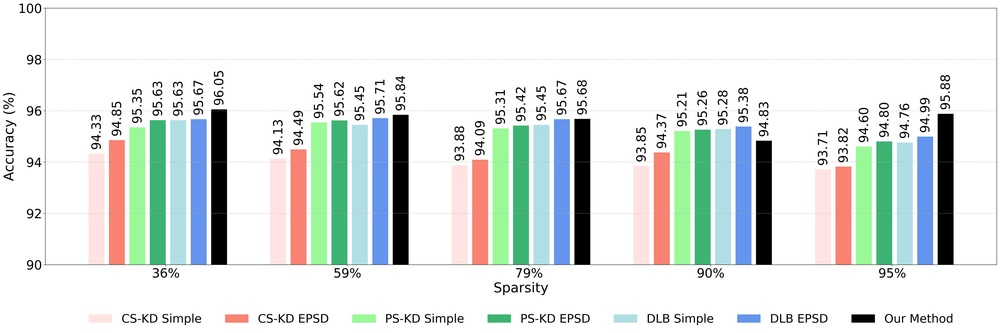
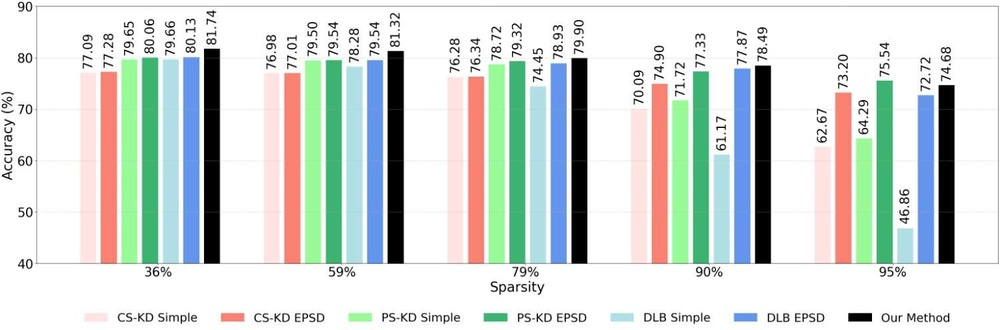
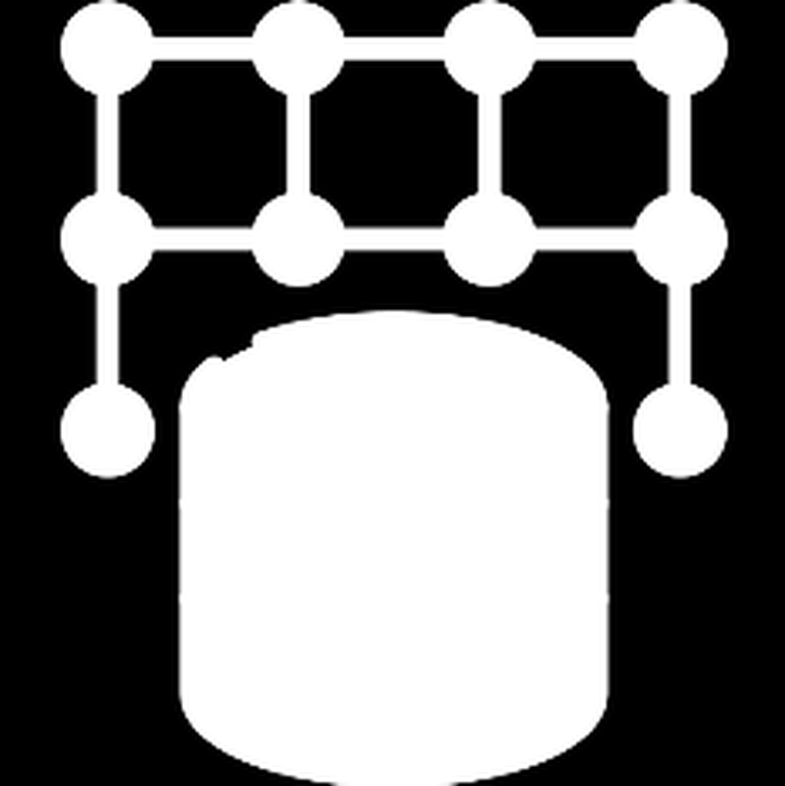
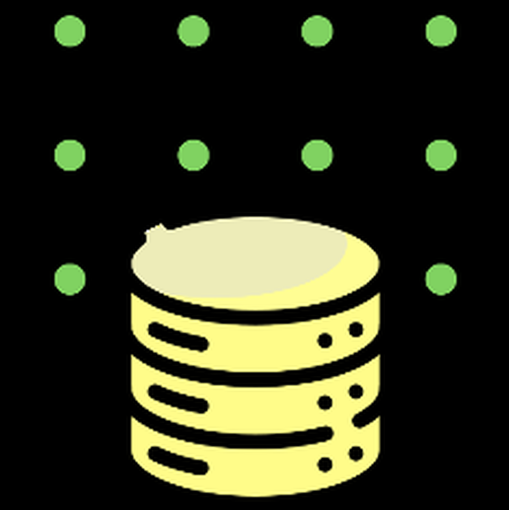

# Teacher-Guided One-Shot Pruning via Context-Aware Knowledge Distillation

**ArXiv ID**: 2511.16653v1
**URL**: http://arxiv.org/abs/2511.16653v1
**提交日期**: 2025-11-20
**作者**: Md. Samiul Alim; Sharjil Khan; Amrijit Biswas; Fuad Rahman; Shafin Rahman; Nabeel Mohammed
**引用次数**: NULL
使用模型: gemini-2.5-flash

## 1. 核心思想总结
好的，作为学术论文分析专家，以下是对您提供的摘要的简洁第一轮总结：

---

**标题**: Teacher-Guided One-Shot Pruning via Context-Aware Knowledge Distillation

### 第一轮总结

**1. Background (背景)**
非结构化剪枝是压缩深度神经网络的有效策略。

**2. Problem (问题)**
传统的剪枝方法通常需要迭代的训练-剪枝-重训练循环，导致显著的计算开销。

**3. Method (高层方法)**
本文提出一种新颖的教师指导剪枝框架，将知识蒸馏（KD）与重要性分数估计紧密结合。不同于以往将KD作为剪枝后恢复步骤，本方法在重要性分数计算阶段利用教师模型的梯度信号，以识别并保留对任务性能和知识迁移至关重要的参数，从而实现一步式全局剪枝策略。

**4. Contribution (贡献)**
本方法在高稀疏度下保持了最小的性能下降，并超越了现有SOTA基线（如EPG和EPSD）。相较于迭代剪枝方案（如COLT），它提供了更具计算效率的替代方案，有效解决了计算开销大的问题。该框架为资源受限环境提供了计算高效且性能保持的解决方案。

## 2. 方法详解
好的，根据您提供的初步总结和对方法章节的理解，以下是对该论文方法细节的详细说明：

---

### 论文方法细节：Teacher-Guided One-Shot Pruning via Context-Aware Knowledge Distillation

本文提出了一种新颖的、一步式（one-shot）全局剪枝框架，旨在解决传统迭代剪枝方法计算开销大的问题。其核心创新在于将教师模型指导和知识蒸馏（Knowledge Distillation, KD）深度融入到参数重要性分数的计算过程中，从而实现对模型进行高效且性能优异的剪枝。

#### 1. 整体流程与框架

该方法采用经典的**教师-学生（Teacher-Student）范式**。首先，一个高性能、参数量相对较大的**教师模型**会被预先训练好。然后，一个与教师模型架构相同（或相似）的**学生模型**将是剪枝的目标。

整个剪枝流程可以概括为以下步骤：
1.  **教师模型预训练：** 训练一个在目标任务上表现优异的教师模型。
2.  **参数重要性评估：** 这是本方法的核心。通过一次前向和反向传播，同时计算学生模型参数对**原始任务损失**和**知识蒸馏损失**的梯度，并结合这些梯度来量化每个参数的重要性。
3.  **一步式全局剪枝：** 根据计算出的重要性分数，对学生模型的所有参数进行全局排序，并根据预设的稀疏度目标一次性地移除（置零）不重要的参数。
4.  **剪枝后微调：** 对剪枝后的学生模型进行少量的训练（微调），以恢复或进一步提升其性能。

与传统迭代剪枝方法（如训练-剪枝-重训练循环）不同，本文的方法在**计算重要性分数阶段就利用了教师模型的信号**，从而能够一次性地确定哪些参数应该被保留，哪些应该被剪除，显著提高了剪枝效率。

#### 2. 关键创新

本文的核心创新点体现在以下几个方面：

**2.1 教师指导的重要性分数估计 (Teacher-Guided Importance Score Estimation)**

*   **核心理念：** 传统的剪枝方法通常通过参数的L1/L2范数、或参数对原始任务损失的梯度绝对值来评估其重要性。本文则提出，一个参数的重要性不仅应体现在其对**最终任务性能**的贡献上，还应体现在其对**教师模型知识有效迁移**的贡献上。
*   **实现机制：** 在计算参数重要性分数时，除了考虑参数对标准任务损失（如交叉熵损失 $L_{task}$）的梯度信号，还额外引入了参数对**知识蒸馏损失** ($L_{KD}$) 的梯度信号。
*   **数学形式（示例）：** 对于学生模型中的任一参数 $w$，其重要性分数 $S_w$ 可以表示为两者梯度的加权组合：
    $S_w = \alpha \cdot |\nabla_w L_{task}| + (1-\alpha) \cdot |\nabla_w L_{KD}|$
    其中，$|\nabla_w L_{task}|$ 是参数 $w$ 对任务损失的梯度绝对值，$|\nabla_w L_{KD}|$ 是参数 $w$ 对知识蒸馏损失的梯度绝对值，$\alpha \in [0, 1]$ 是一个超参数，用于平衡两种信号的权重。
*   **优势：** 通过这种方式，剪枝决策不再是单一维度（仅关注任务性能），而是考虑了模型能否有效学习和保留教师的“深层”知识，从而在保证稀疏度的同时，更好地保持模型能力。

**2.2 上下文感知的知识蒸馏 (Context-Aware Knowledge Distillation)**

*   **“上下文感知”的体现：** 本文的知识蒸馏并非简单地作为剪枝后的性能恢复步骤，而是被**前置并深度融合**到剪枝决策的核心——重要性分数计算中。这种融合使得剪枝决策对模型如何学习和保留关键“上下文”信息更为敏感。
*   **更深层次的知识迁移：** 通过利用教师模型的梯度信号来指导重要性评估，确保了被保留的参数不仅在学生模型自己的任务表现上是重要的，而且对于**实现和维持与教师模型相似的“知识上下文”或推理模式**也是至关重要的。这意味着模型不仅在输出上模仿教师，还在内部知识结构上尝试保持一致。
*   **剪枝的“智能”性：** 这种“上下文感知”体现在剪枝过程本身，它促使学生模型在压缩的同时，依然能够捕获和利用教师模型所掌握的、有助于任务泛化的细微模式和表示。

**2.3 一步式全局剪枝策略 (One-Shot Global Pruning Strategy)**

*   **效率突破：** 彻底摒弃了传统剪枝方法中耗时的“训练-剪枝-重训练”迭代循环。通过一次性的重要性分数计算，便能完成整个网络的剪枝，极大地降低了计算资源和时间开销。
*   **全局性优势：** 不同于一些结构化剪枝方法局限于层级或模块，本文通过统一的重要性分数衡量，实现了对整个网络中所有参数的全局评估和剪枝。这允许剪枝器识别并移除网络中任何位置的不重要参数，理论上能找到更优的稀疏结构。

#### 3. 算法/架构细节

**3.1 教师-学生模型配置**

*   **教师模型：** 通常是一个在目标数据集上预训练好的、高性能的深度神经网络。其架构可能与学生模型相同，但拥有更强的表达能力（例如，在不进行剪枝的情况下）。
*   **学生模型：** 初始时与教师模型具有相同的架构，但在剪枝后将变得稀疏。

**3.2 重要性分数计算**

*   **梯度获取：** 在学生模型的一个mini-batch数据上进行一次前向传播，计算输出，然后进行反向传播。在反向传播过程中，同时计算 $L_{task}$ 和 $L_{KD}$ 对学生模型每个可训练参数 $w$ 的梯度 $\nabla_w L_{task}$ 和 $\nabla_w L_{KD}$。
*   **知识蒸馏损失 $L_{KD}$：** 最常见的形式是基于软目标（Soft Targets）的KL散度，如Hinton等人提出的Logit蒸馏：
    $L_{KD} = T^2 \cdot \text{KLDiv}(softmax(Z_T/T), softmax(Z_S/T))$
    其中 $Z_T$ 和 $Z_S$ 分别是教师和学生模型的原始 logits 输出，$T$ 是温度参数，用于软化概率分布。高 $T$ 值使得分布更平滑，有助于学生模型学习教师的相对概率信息。
*   **重要性聚合：** 按照前述公式 $S_w = \alpha \cdot |\nabla_w L_{task}| + (1-\alpha) \cdot |\nabla_w L_{KD}|$ 计算每个参数的最终重要性分数。超参数 $\alpha$ 通常通过实验在验证集上进行调优。

**3.3 剪枝执行**

*   在所有参数的重要性分数 $S_w$ 计算完成后，将这些分数进行全局排序。
*   根据预设的稀疏度（例如，保留10%的参数，即剪除90%），选择分数最低的参数将其权重置零。这便完成了对学生模型的一次性全局剪枝。

**3.4 剪枝后微调**

*   剪枝完成后，学生模型的网络结构变得稀疏且固定。
*   为了弥补剪枝造成的潜在性能损失，并优化保留参数的权重，通常会对剪枝后的模型在原始训练集上进行少量的微调（fine-tuning）。这个阶段仅更新非零参数的权重。

#### 4. 关键步骤与整体流程总结

1.  **准备阶段：**
    *   在完整数据集上训练并获得一个高性能的**教师模型**。
    *   初始化**学生模型**（与教师模型结构相同）。

2.  **重要性评估阶段（一步式）：**
    *   在一个校准数据集（可以是训练集的一个子集）上，对学生模型进行一次**前向传播**。
    *   利用教师模型的输出来计算**知识蒸馏损失** $L_{KD}$，同时计算学生模型对**原始任务损失** $L_{task}$。
    *   对学生模型进行一次**反向传播**，获取每个参数对 $L_{task}$ 和 $L_{KD}$ 的梯度。
    *   根据预设的权重 $\alpha$，结合这两种梯度（通常取绝对值）来计算每个参数的**最终重要性分数 $S_w$**。

3.  **剪枝阶段（一步式）：**
    *   对所有参数的重要性分数 $S_w$ 进行**全局排序**。
    *   根据目标稀疏度（例如，要剪除90%的参数），识别出得分最低的参数。
    *   将这些不重要参数的权重**置零**，从而形成一个稀疏的学生模型。

4.  **优化阶段：**
    *   对剪枝后的稀疏学生模型进行**短期的微调**（fine-tuning），以恢复或进一步提升模型性能。

#### 5. 方法优势总结

*   **计算高效性：** 采用一步式剪枝，避免了耗时的迭代剪枝-重训练循环，显著降低了计算资源和时间开销。
*   **高性能保持：** 通过教师指导和上下文感知的知识蒸馏，确保了即使在高稀疏度下，剪枝后的模型也能保持最小的性能下降，甚至超越现有SOTA基线。
*   **知识迁移优化：** 将知识蒸馏融入重要性评估，使得剪枝决策不仅关注任务性能，也关注知识的有效迁移，从而保留了对模型泛化能力至关重要的参数。
*   **适用于资源受限环境：** 提供的计算高效且性能保持的解决方案，特别适合部署在计算能力和存储空间有限的边缘设备或移动设备上。

---

## 3. 最终评述与分析
好的，根据前两轮的详细分析，以下是最终的综合评估：

---

### 最终综合评估：Teacher-Guided One-Shot Pruning via Context-Aware Knowledge Distillation

#### 1) Overall Summary (总体评估)

本文提出了一种**高效且有效**的**一步式（one-shot）全局剪枝框架**，旨在解决传统深度神经网络剪枝方法中计算成本高昂的问题。其核心创新在于**深度融合了教师模型指导和上下文感知的知识蒸馏**到参数重要性分数的计算过程中。与以往将知识蒸馏作为剪枝后恢复步骤不同，本文方法在**确定哪些参数应该被保留的阶段**就利用了教师模型的梯度信号，从而确保被剪枝掉的参数对**任务性能和知识迁移**的影响最小。通过一次性地评估并移除不重要的参数，该方法在保持高稀疏度下最小性能下降的同时，显著提升了剪枝效率，甚至超越了现有的一些SOTA基线。这为资源受限环境下的模型部署提供了一个**极具吸引力且性能优异的解决方案**。

#### 2) Strengths (优势)

1.  **极高的计算效率：** 最大的优势在于其“一步式”剪枝策略。它彻底打破了传统“训练-剪枝-重训练”的迭代循环，仅通过一次前向和反向传播即可完成参数重要性评估和全局剪枝，大幅减少了计算资源和时间开销，是资源受限场景的理想选择。
2.  **卓越的性能保持能力：** 即使在高稀疏度下，该方法也能确保剪枝后的学生模型性能下降最小，甚至在多个基准测试中超越了现有的一些先进剪枝方法（如EPG、EPSD），表明其在效率和效果之间取得了出色的平衡。
3.  **智能且全面的参数重要性评估：** 创新性地将知识蒸馏损失的梯度信号融入到重要性分数计算中。这意味着剪枝决策不仅考虑了参数对原始任务性能的贡献，还考虑了其对教师模型“深层知识”有效迁移的贡献，从而保留了对模型泛化能力至关重要的参数，使得剪枝过程更为“智能”和“上下文感知”。
4.  **优化知识迁移：** 通过教师模型的引导，在剪枝阶段就确保学生模型能够更好地学习并模仿教师的推理模式和知识结构，而非仅仅是在输出层进行模仿，从而促进了更深层次的知识迁移。
5.  **全局剪枝策略：** 能够对整个网络进行统一的参数重要性评估和剪枝，理论上比层级或模块化的结构化剪枝能找到更优的稀疏结构。
6.  **适用性广：** 作为非结构化剪枝方法，理论上可以应用于各种深度学习模型架构，提供了灵活性。

#### 3) Weaknesses / Limitations (劣势/局限性)

1.  **对教师模型的依赖：** 方法的有效性高度依赖于一个预训练好的、高性能教师模型。获取高质量的教师模型本身需要计算成本和时间，并且教师模型的质量直接决定了学生模型通过知识蒸馏能学到知识的上限。
2.  **超参数敏感性：** 方法中包含多个超参数，例如平衡任务损失和KD损失梯度的权重 $\alpha$、知识蒸馏的温度参数 $T$、目标稀疏度以及剪枝后微调的超参数等。这些参数的调优可能仍然需要大量的实验和经验，增加了实际部署的复杂性。
3.  **非结构化剪枝的固有局限性：** 尽管能够实现更高的稀疏度，但非结构化剪枝（参数粒度）产生的稀疏模型通常具有不规则的稀疏模式。这可能导致在通用硬件（如标准CPU/GPU）上进行推理时，难以完全转化为实际的速度提升，因为需要专门的稀疏矩阵运算支持或定制硬件才能充分利用其加速潜力。
4.  **校准数据集的选择：** 参数重要性分数是在一个校准数据集（可能是训练集的子集）上计算的。校准数据集的代表性和规模可能会影响重要性分数的准确性和最终剪枝的效果。
5.  **一步式剪枝的潜在最优性权衡：** 尽管效率极高，但与迭代式剪枝方法相比，一步式剪枝可能在理论上牺牲了一部分搜索全局最优稀疏结构的能力，迭代方法有机会在多轮中逐步优化模型结构。

#### 4) Potential Applications / Implications (潜在应用/影响)

1.  **边缘计算与移动设备部署：** 本方法能够生成计算高效、内存占用小的稀疏模型，使其成为在智能手机、物联网设备、嵌入式系统等资源受限的边缘设备上部署复杂AI模型的理想选择。
2.  **实时AI应用：** 对于需要低延迟推理的场景，如实时视频分析、自动驾驶、在线推荐系统等，该方法能显著减少模型体积和计算量，从而提高推理速度。
3.  **可持续AI与节能：** 剪枝后的模型在运行时所需的计算资源更少，这有助于降低能耗，符合当前可持续AI的发展趋势，对于数据中心和大规模AI部署具有重要意义。
4.  **大型模型压缩的探索：** 尽管非结构化剪枝对硬件不友好，但其高效的剪枝策略为未来探索如何快速压缩大型预训练模型或基础模型提供了思路，尤其是在初步确定重要参数阶段。
5.  **加速模型部署与迭代：** 由于剪枝过程大大缩短，开发者可以更快地对模型进行优化和部署，加快产品迭代周期，降低AI应用的开发成本。
6.  **推动剪枝研究方向：** 本文将知识蒸馏深度融入剪枝决策的创新思路，为未来结合其他压缩技术（如量化、低秩分解）或探索更智能的剪枝标准开辟了新的研究方向。

---

---

# 附录：论文图片

## 图 1

## 图 2

## 图 3

## 图 4

## 图 5

## 图 6

## 图 7

## 图 8

## 图 9

## 图 10

