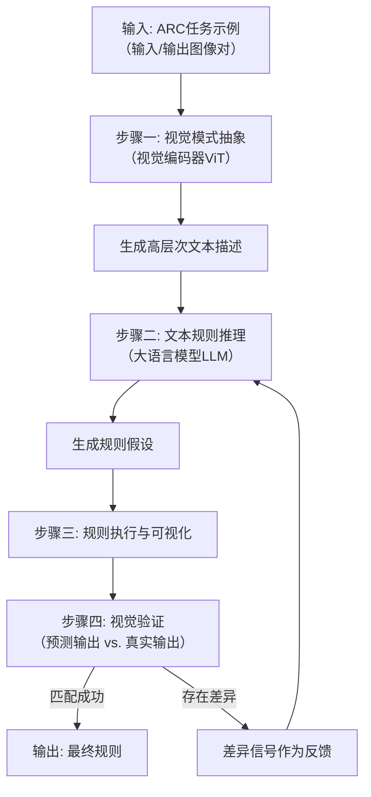
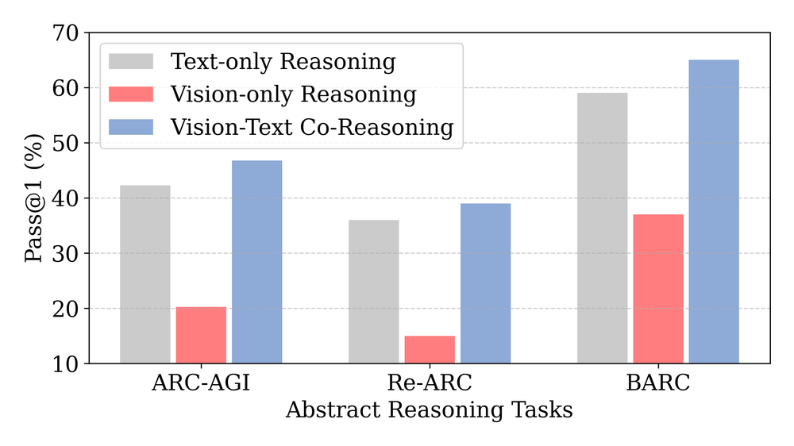
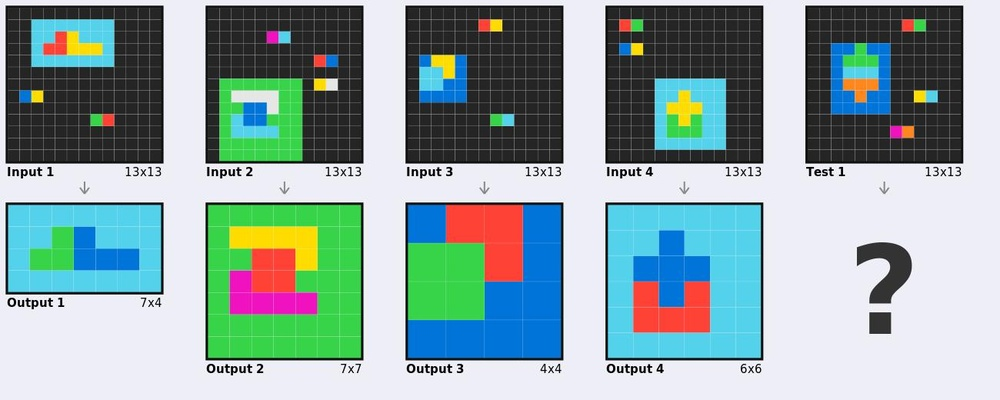
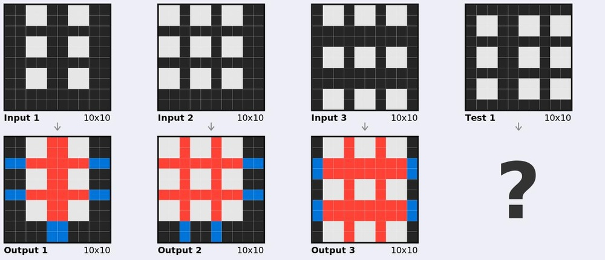
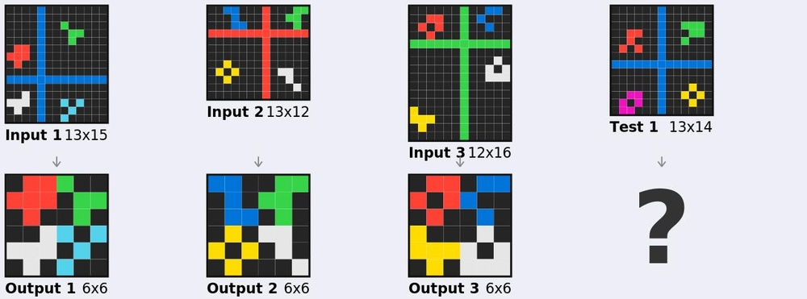
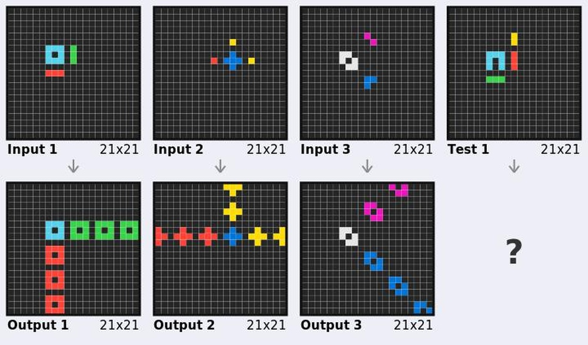
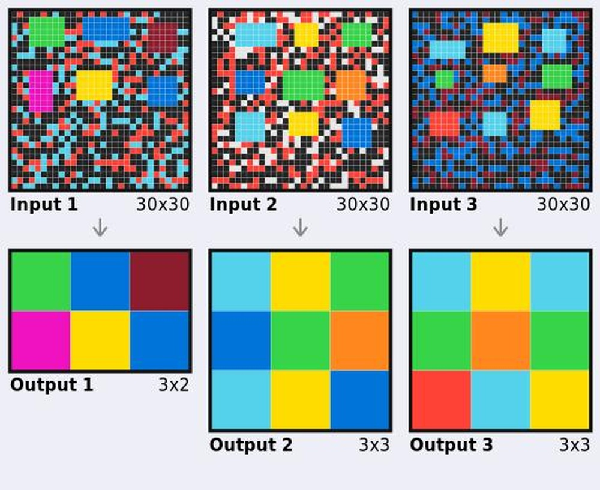
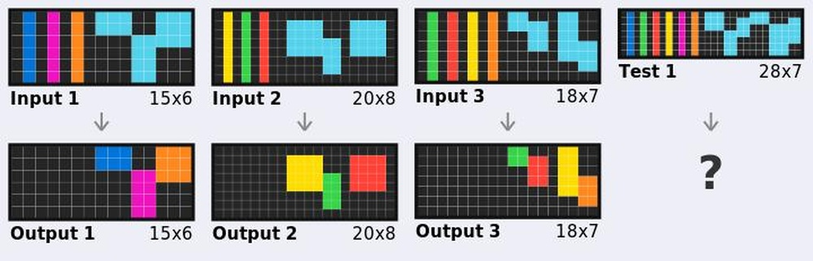
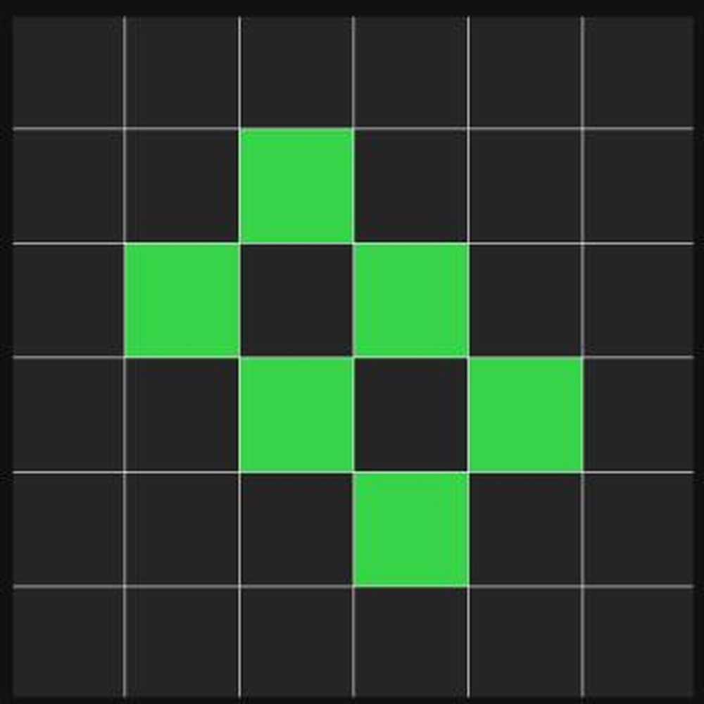

# Think Visually, Reason Textually: Vision-Language Synergy in ARC

**ArXiv ID**: 2511.15703v1
**URL**: http://arxiv.org/abs/2511.15703v1
**提交日期**: 2025-11-19
**作者**: Beichen Zhang; Yuhang Zang; Xiaoyi Dong; Yuhang Cao; Haodong Duan; Dahua Lin; Jiaqi Wang
**引用次数**: NULL
使用模型: ep-20251112215738-bz78g

## 1. 核心思想总结
好的，这是一份根据您提供的标题和摘要整理的简洁第一轮总结。

**论文第一轮总结**

**标题：** Think Visually, Reason Textually: Vision-Language Synergy in ARC

**1. Background (背景)**
抽象推理能力，特别是从极少数例子中归纳出结构化规则，是衡量高级人工智能（AGI）的关键指标，但即便是前沿的大模型（如GPT-5）在此方面仍有不足。Abstraction and Reasoning Corpus (ARC-AGI) 基准正是为此设计的严格测试平台。

**2. Problem (问题)**
现有解决ARC-AGI的方法大多将其视为纯文本推理任务，忽略了人类在解决此类问题时依赖的视觉抽象能力。然而，初步实验发现一个悖论：简单地将ARC任务网格转换为图像进行处理，反而会因规则执行不精确而降低模型性能。

**3. Method (高层次方法)**
基于“视觉与语言在推理不同阶段具有互补优势”的核心理念，本文提出了两种协同策略：
*   **视觉-语言协同推理 (VLSR)**：将ARC任务分解为与模态优势对齐的子任务（视觉用于全局模式抽象，语言用于符号规则制定）。
*   **模态切换自我校正 (MSSC)**：利用视觉来验证基于文本的推理结果，实现内在的错误纠正。

**4. Contribution (贡献)**
*   提出了一个新颖的视觉-语言协同框架，用于解决ARC-AGI中的抽象推理问题。
*   实验证明，该方法在多种主流模型和ARC任务上，相比纯文本基线最高能带来4.33%的性能提升。
*   研究结论表明，将视觉抽象与语言推理相结合，是未来基础模型实现可泛化、类人智能的关键一步。

## 2. 方法详解
好的，基于您提供的初步总结和论文方法章节的内容，以下是对该论文方法细节的详细说明。

### 论文方法细节详解

本论文的核心思想是**“视觉思考，文本推理”**。它认为解决ARC这类抽象推理问题，需要结合两种模态的独特优势：视觉模态擅长进行**全局性的、直觉性的模式感知和抽象**，而语言模态擅长进行**精确的、符号化的规则定义和逻辑推演**。论文提出的方法正是围绕这一核心理念构建的。

#### 一、 关键创新

论文的两个关键创新点并非孤立的组件，而是一个有机整体中的两种协同机制：

1.  **视觉-语言协同推理（VLSR）**： 这是框架的**主干流程**。它不是一个简单的多模态融合，而是一种**任务分解与模态分配策略**。该方法将复杂的ARC任务分解为两个连续的阶段，并将每个阶段分配给最擅长的模态来处理：
    *   **视觉主导的模式抽象**： 首先利用视觉模型（如ViT）的全局感知能力，从输入-输出示例对的图像中“看”出高层次的、结构化的模式（如对称性、旋转、重复、颜色映射等），而不过早地陷入具体的符号细节。
    *   **语言主导的规则制定**： 然后将视觉抽象出的模式用自然语言描述出来，输入给大型语言模型（LLM）。LLM基于这些文本描述，进行精确的符号推理，生成可执行的、分步骤的规则程序。

2.  **模态切换自我校正（MSSC）**： 这是嵌入在主干流程中的**反馈与修正机制**。它解决了纯文本推理中“想当然”或逻辑链断裂的问题：
    *   **视觉验证**： 当LLM生成一条规则假设后，系统不是直接接受，而是将这条规则“可视化”——即根据规则在输入图像上模拟执行，生成一个预测的输出图像。
    *   **差异检测与迭代修正**： 系统将预测图像与真实的输出示例进行像素级的对比。如果存在差异，这个“差异信号”会连同原始问题一起，反馈给LLM，要求它重新分析错误并修正规则。这个过程循环进行，直到预测输出与真实示例匹配，或达到最大迭代次数。

#### 二、 算法/架构细节与整体流程

整个方法的流程可以清晰地分为几个关键步骤，下图直观地展示了其工作流程：

下面我们来详细解析图中的每一个步骤：

**步骤一：视觉模式抽象（对应流程图中“视觉模式抽象”）**

*   **输入**： ARC任务提供的输入网格和输出网格（通常不止一对示例）。这些网格被转换为简单的图像形式，其中每个颜色块代表一个不同的物体或概念。
*   **核心算法/模型**： 采用**视觉Transformer（ViT）** 作为视觉编码器。ViT的优势在于其**自注意力机制**，能够捕捉图像中不同区域之间的全局依赖关系，这对于发现“对称”、“中心对象”等整体模式至关重要。
*   **关键操作**：
    1.  **图像化表示**： 将ARC的网格数据转换为低分辨率图像。
    2.  **特征提取与描述生成**： 将图像输入ViT，获取其高维特征表示。然后，使用一个预训练的图像描述生成模型（或一个轻量级的MLP头），将这些视觉特征转换为自然语言描述。描述内容可能类似于：“输入图像中有一个红色的L形物体和一个蓝色的正方形。输出图像中，L形物体被旋转了90度，并移动到了右下角，正方形颜色变为绿色。”
*   **输出**： 关于输入输出对的高层次、文本化模式描述。**这一步的关键是“抽象”**，它避免了一开始就枚举所有像素和坐标，而是为LLM提供了推理的“抓手”。

**步骤二：文本规则推理（对应流程图中“文本规则推理”）**

*   **输入**： 从上一步得到的视觉模式描述。
*   **核心算法/模型**： 采用**大型语言模型（LLM）**，如GPT系列或Llama系列。LLM充当“符号推理引擎”。
*   **关键操作**：
    1.  **提示工程**： 设计精妙的提示词（Prompt），引导LLM基于视觉描述进行推理。提示词会明确要求LLM以结构化的方式（如分步骤、伪代码形式）输出规则。
    2.  **规则生成**： LLM根据提示，将文本描述解构为具体的、可执行的变换规则。例如，它可能会生成：“规则1：找到所有红色的像素。规则2：将找到的红色像素集合顺时针旋转90度。规则3：将所有蓝色像素的颜色改为绿色。”
*   **输出**： 一条或多条假设的、符号化的规则。

**步骤三：规则执行与可视化（对应流程图中“规则执行与可视化”）**

*   **输入**： LLM生成的文本规则，以及原始的输入网格图像。
*   **核心算法**： 一个**规则解释器（或符号引擎）**。这个模块是专门为执行LLM输出的指令而设计的。
*   **关键操作**：
    1.  **解析规则**： 解释器需要理解LLM生成的自然语言指令（如“旋转”、“移动”、“改变颜色”），并将其映射到底层的图像处理操作。
    2.  **执行与渲染**： 解释器在输入图像上应用这些操作，生成一个**预测的输出图像**。
*   **输出**： 根据当前规则假设生成的预测输出图像。

**步骤四：视觉验证与自我校正（对应流程图中“视觉验证”）**

*   **输入**： 预测的输出图像 vs. 真实的输出示例图像。
*   **核心算法**： 简单的**图像差异比较算法**（如像素级对比）。
*   **关键操作**：
    1.  **差异检测**： 系统比较两幅图像，判断它们是否完全一致。如果不一致，则计算差异图或生成差异描述（例如：“在坐标(2,3)处，预测是红色，但实际是黑色”）。
    2.  **反馈循环**： 这个差异信息被作为**强反馈信号**，与原始问题、之前的规则假设一起，构成一个新的提示，发送回LLM。提示可能是：“你之前生成的规则产生了错误。在真实输出中，X区域的像素是Y颜色，但你的规则输出的是Z颜色。请重新分析问题并修正规则。”
*   **输出**： 如果匹配，则流程结束，规则被确认；如果不匹配，则触发新一轮的推理循环（回到步骤二）。

#### 总结

该论文的方法细节体现了一个**精心设计的、由视觉和语言模态交替驱动的推理系统**。其强大之处在于：

*   **扬长避短**： 让ViT做它擅长的模式识别，让LLM做它擅长的逻辑推理，避免了让LLM去“想象”视觉空间变换的短板。
*   **闭环反馈**： MSSC机制引入了“实践是检验真理的唯一标准”的思想，通过视觉域的真实结果来约束和校正文本推理可能出现的偏差，极大地提高了推理的可靠性和精确性。

这种方法不仅提升了ARC任务的性能，更重要的是为构建能够进行类人抽象推理的多模态AI系统提供了一个可行的架构蓝图。

## 3. 最终评述与分析
好的，结合前两轮关于论文标题、摘要、方法细节以及结论部分的信息，现提供最终的综合评估如下：

### 最终综合评估

**1. Overall Summary (总体摘要)**
本论文针对抽象推理核心挑战——ARC-AGI基准测试，提出了一个名为“视觉思考，文本推理”的创新性视觉-语言协同框架。该研究基于一个关键洞见：人类在解决此类问题时，会协同使用视觉抽象（直觉性、全局性模式感知）和语言推理（精确性、符号化规则制定）。论文通过系统性的实验证明，将这两种模态的优势进行**任务分解（VLSR）** 并引入**迭代验证机制（MSSC）**，能够显著提升模型从少量示例中归纳和泛化复杂规则的能力。这不仅在技术上实现了性能突破，更重要的是为构建具备更高级、更类人抽象推理能力的人工智能指明了方向。

**2. Strengths (优势)**
*   **深刻的核心理念**：论文的出发点并非简单的多模态融合，而是基于对视觉与语言在认知过程中互补优势的深刻理解（“Thinking Visually, Reasoning Textually”），这使得其方法具有坚实的认知科学基础。
*   **新颖且实用的框架设计**：提出的VLSR（视觉-语言协同推理）和MSSC（模态切换自我校正）机制构成了一个完整、闭环的推理系统。该设计巧妙地将问题分解并分配给最适合的模态处理，并通过视觉验证来纠正文本推理的错误，实现了“1+1>2”的协同效应。
*   **显著的实证效果**：实验结果表明，该框架在多个主流模型上均能带来性能提升（最高达4.33%），证明了其有效性和泛化能力。在ARC这种极具挑战性的基准上取得进步，其说服力较强。
*   **重要的启发性**：论文的结论超越了ARC任务本身，指出了“视觉抽象能力”是当前以大语言模型为主导的AI系统所缺失的关键一环，对未来基础模型的发展具有重要的启发意义。

**3. Weaknesses / Limitations (弱点/局限性)**
*   **对组件性能的依赖**：整个框架的性能依赖于其组件的质量，特别是视觉编码器（ViT）的模式抽象能力和LLM的符号推理与代码生成能力。如果视觉描述不准确或LLM无法生成正确规则，系统性能会受到影响。
*   **规则解释器的挑战**：MSSC机制需要一个能够可靠地将LLM生成的自然语言规则转换为可执行操作的“规则解释器”。处理复杂、模糊或非常规的自然语言描述可能是一个技术难点和误差来源。
*   **计算成本与效率**：由于涉及多个大型模型（ViT, LLM）的调用以及可能多次的迭代循环，该方法的计算开销相对较大，推理速度可能慢于纯文本方法，这可能会影响其在实时场景中的应用。
*   **泛化能力的边界**：尽管论文展示了在ARC任务上的泛化能力，但这种特定框架在多大程度上能直接迁移到其他类型的抽象推理问题（如更复杂的视觉谜题或现实世界的不规则场景）仍有待进一步验证。

**4. Potential Applications / Implications (潜在应用/意义)**
*   **高级AI推理能力**：该框架为开发能够解决复杂、新颖问题的AI系统提供了蓝图，可应用于**智能教育**（自动解答几何证明、物理推理题）、**科学研究**（从实验数据中发现潜在模式或定律）以及**软件工程**（根据输入输出示例自动生成程序代码）等领域。
*   **机器人技术与自动驾驶**：在需要结合环境感知（视觉）与高层规划（符号推理）的领域，如机器人操作和自动驾驶，这种协同框架可以帮助系统更好地理解场景并做出符合逻辑的决策。
*   **人机交互**：未来的人机协作界面可能允许用户同时使用语言指令和视觉示例（如草图、图表）与AI交流，该研究为实现这种直观、高效的多模态交互奠定了技术基础。
*   **基础模型的发展方向**：论文的核心结论——即未来AGI需要深度融合视觉抽象与语言推理——将对下一代多模态大模型的架构设计产生深远影响，鼓励研究者不再仅仅追求规模的扩大，而是更注重不同认知模态的整合与协同。

---

# 附录：论文图片

## 图 1

## 图 2

## 图 3

## 图 4

## 图 5

## 图 6

## 图 7

## 图 8

## 图 9

## 图 10

