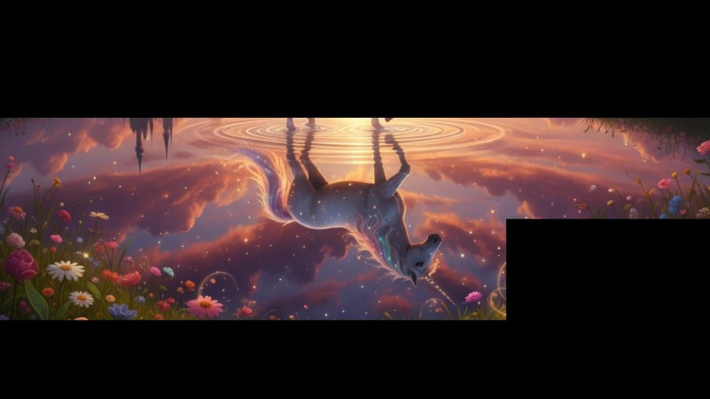
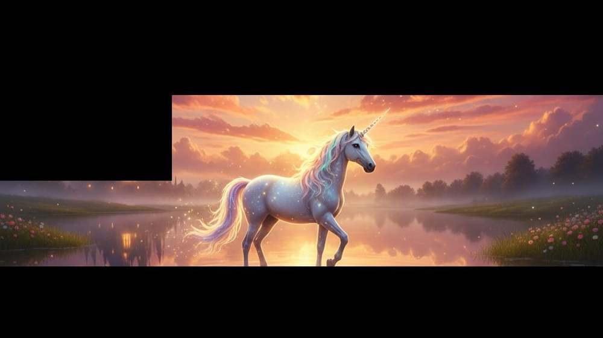

# Thinking-while-Generating: Interleaving Textual Reasoning throughout Visual Generation

**ArXiv ID**: 2511.16671v1
**URL**: http://arxiv.org/abs/2511.16671v1
**提交日期**: 2025-11-20
**作者**: Ziyu Guo; Renrui Zhang; Hongyu Li; Manyuan Zhang; Xinyan Chen; Sifan Wang; Yan Feng; Peng Pei; Pheng-Ann Heng
**引用次数**: NULL
使用模型: gemini-2.5-flash

## 1. 核心思想总结
好的，作为学术论文分析专家，以下是对该论文摘要的简洁第一轮总结：

---

**标题:** Thinking-while-Generating: Interleaving Textual Reasoning throughout Visual Generation

---

**Background (背景):**
视觉生成领域最新进展已开始探索整合推理能力。

**Problem (问题):**
现有方法通常在视觉生成过程之前（作为预规划）或之后（作为后完善）融入文本推理，但缺乏在生成过程中进行实时的、多模态的交互。

**Method (high-level) (方法概述):**
本研究引入了Thinking-while-Generating (TwiG) 框架，这是首个在视觉生成过程中实现文本推理与视觉内容协同演进的交错式框架。它通过在生成过程中交错进行文本推理，同时指导即将生成的局部区域并反思已合成的区域。为验证其潜力，研究探索了零样本提示、基于TwiG-50K数据集的监督微调（SFT）和通过TwiG-GRPO策略实现的强化学习（RL）三种候选策略。

**Contribution (贡献):**
TwiG框架是首个实现生成过程中文本推理与视觉内容交错演进的方案，能够产出更具上下文感知和语义丰富的视觉内容。该工作为增强视觉生成的交错式文本推理提供了新的方向和见解。

## 2. 方法详解
基于您提供的初步总结和对方法章节的推断，以下是对该论文方法细节的详细说明：

---

### 论文方法细节：Thinking-while-Generating (TwiG)

**引言与核心思想**

论文《Thinking-while-Generating: Interleaving Textual Reasoning throughout Visual Generation》提出了一种名为TwiG（Thinking-while-Generating）的创新框架，旨在解决现有视觉生成方法中文本推理与视觉内容生成过程脱节的问题。传统方法往往在生成前进行一次性规划或在生成后进行后期修正，无法实现实时、多模态的深度交互。TwiG框架的核心创新在于，它在视觉内容生成的过程中，交错式地融入文本推理，使“思考”与“生成”协同演进，从而产出更具上下文感知和语义丰富性的视觉内容。

---

#### 关键创新点

1.  **开创性地实现生成过程中的交错式文本推理：** TwiG是首个将文本推理深度融入视觉生成迭代循环的框架。它打破了传统上文本规划与视觉生成分离的模式，允许文本推理器在视觉生成器的每一步或每一阶段提供实时的、动态的指导和反馈。
2.  **双向指导与反思机制：**
    *   **前瞻性指导 (Guide Upcoming Local Regions)：** 文本推理模块能够根据当前的生成状态和整体目标，前瞻性地规划和生成针对即将生成局部区域的具体指令或子任务，确保生成过程沿着预期的语义路径前进。
    *   **状态感知反思 (Reflect on Already Synthesized Regions)：** 文本推理模块不仅提供前瞻性指导，还能接收并分析已生成的视觉内容及其上下文信息，进行实时的反思、评估和自我修正。这包括识别不一致性、提出改进建议、甚至调整后续的生成策略，从而保证全局的一致性和语义的准确性。
3.  **多模态交互与协同演进：** 通过文本推理模块（通常是大型语言模型）与视觉生成模块的紧密耦合，框架实现了文本和视觉信息在生成过程中的持续、迭代交互。文本推理利用视觉信息进行决策，而视觉生成则严格遵循文本指令，二者共同塑造最终的视觉输出。

---

#### 整体框架与工作流

TwiG框架的核心由两个主要组件构成：一个**文本推理模块**（基于大型语言模型LLM）和一个**视觉生成模块**（基于扩散模型或类似生成模型），它们在一个迭代式的循环中相互作用。

**整体工作流（高层次视图）：**

1.  **初始阶段：**
    *   用户提供一个高层次的文本提示（例如，“一幅描绘繁忙城市街道的画作，雨后，有霓虹灯的倒影”）。
    *   文本推理模块（LLM）接收初始提示，并将其分解为更小的、可管理的子任务或一个粗略的视觉生成计划。

2.  **交错式迭代循环：**
    *   **视觉内容生成（Visual Content Generation）：** 视觉生成模块根据文本推理模块提供的当前指令（可能是全局规划的一部分或针对特定区域的详细描述），生成或更新图像的某个局部区域或整体图像的一个阶段。
    *   **状态感知与多模态反思（State Awareness & Multimodal Reflection）：** 文本推理模块接收当前已生成的视觉内容（例如，部分图像、视觉特征）以及历史推理步骤。它会：
        *   对当前的视觉状态进行语义分析，评估其是否符合整体目标和当前指令。
        *   识别潜在的不一致性、语义偏差或需要进一步细化的区域。
        *   生成关于已合成内容的文本描述或诊断。
    *   **下一步行动规划与指令生成（Next Action Planning & Instruction Generation）：** 基于反思结果，文本推理模块生成新的、更具体的、上下文感知的文本指令。这些指令可以包括：
        *   针对下一阶段视觉生成的精细化提示。
        *   修改或调整之前生成的某个区域的指导。
        *   要求视觉生成器添加特定对象、调整颜色、改善构图等。
        *   更新整体生成计划。
    *   这个循环持续进行，直到生成完整的、高质量的图像，或者达到预设的迭代次数、复杂度阈值。

---

#### 核心算法与架构细节

1.  **文本推理模块 (Textual Reasoning Module - LLM as Reasoner):**
    *   **架构：** 通常基于先进的预训练大型语言模型（LLM），如GPT系列、Llama系列或其微调版本。这些LLM具备强大的文本理解、生成、规划和推理能力。
    *   **输入：**
        *   原始用户提示（Prompt）。
        *   历史文本推理步骤和决策序列。
        *   当前视觉生成的状态信息：这可能通过多种方式实现，例如：
            *   **视觉编码器（Vision Encoder）：** 将部分生成的图像编码为LLM可以处理的向量表示。
            *   **文本描述：** LLM可能被要求生成对当前视觉内容的文本描述，然后基于该描述进行推理。
            *   **多模态LLM：** 如果LLM本身就是多模态的（如GPT-4V），则可以直接接收图像输入。
    *   **输出：** 产生下一轮迭代所需的文本指令，这些指令可以是对视觉生成模块的局部提示、全局指导、修正建议、或者对整体生成过程的元指令。LLM的输出被设计成能够直接作为视觉生成器的条件输入。

2.  **视觉生成模块 (Visual Generation Module):**
    *   **架构：** 采用当前最先进的文本到图像生成模型，通常是基于**扩散模型（Diffusion Models）**，如Stable Diffusion、DALLE-3等。这些模型在生成高质量和多样性图像方面表现出色。
    *   **控制与条件生成：** 视觉生成模块具备强大的条件生成能力，能够根据：
        *   **文本条件：** 由文本推理模块提供的精确文本提示进行图像生成。
        *   **空间条件：** 可能还包括掩码（Masks）、草图（Sketches）或参考图像等，以实现更精细的局部控制和编辑。
    *   **局部生成与迭代细化：** 为了配合TwiG的交错式特性，视觉生成模块可能支持分步、分区域的生成或渐进式细化，以便在每次迭代中处理LLM提供的局部指令。这可能涉及到图像内绘画（Inpainting）、外绘画（Outpainting）或逐层合成等技术。

---

#### 训练与优化策略

TwiG框架的潜力通过三种候选策略进行验证和实现，这表明其具有很强的灵活性和可扩展性：

1.  **零样本提示 (Zero-Shot Prompting):**
    *   **原理：** 在不进行任何模型训练或微调的情况下，通过精心设计的提示（Prompt Engineering）直接利用预训练LLM的强大通用推理能力。
    *   **实现：** 采用复杂的提示结构，如**链式思考（Chain-of-Thought）**或**角色扮演（Role-Playing）**，引导LLM模拟TwiG的迭代生成与反思过程。例如，提示可能要求LLM“扮演一个视觉场景设计师，首先规划场景，然后逐步指导一个画家绘制，并在此过程中不断审视画作并给出修正意见”。
    *   **优势：** 无需大量标注数据，实现快速验证概念，但性能上限受限于LLM的通用能力和提示设计的精巧程度。

2.  **监督微调 (Supervised Fine-tuning - SFT) 与 TwiG-50K 数据集：**
    *   **TwiG-50K 数据集：** 这是一个专门为TwiG框架构建的高质量数据集，可能包含：
        *   多样化的用户初始Prompt。
        *   详细的视觉生成过程序列，包括每一步的视觉状态（部分生成图像）。
        *   对应于每一步的文本推理过程（LLM的中间思考、决策、反思）和生成的视觉指令。
        *   最终高质量图像。
        *   该数据集可能通过人工专家标注、或者从零样本提示的成功案例中蒸馏提炼而来，旨在捕获“思考-生成”的典型模式。
    *   **SFT 目标：** 对文本推理模块（LLM）进行监督式微调。模型的目标是学习从给定的初始提示、历史推理轨迹和当前视觉状态中，准确地预测下一个合理的文本推理步骤和视觉生成指令。
    *   **优势：** 显著提高文本推理模块在TwiG任务上的性能和鲁棒性，使其能够更稳定、高效地执行交错式推理。

3.  **强化学习 (Reinforcement Learning - RL) 与 TwiG-GRPO 策略：**
    *   **GRPO (Generative Policy Reinforcement Optimization) 策略：** 这是一个专门针对生成任务设计的策略优化算法。它将整个TwiG的迭代过程建模为一个序列决策问题，其中LLM是智能体（Agent），视觉生成器和当前图像状态是环境（Environment）。
    *   **RL 设置：**
        *   **智能体 (Agent)：** 文本推理模块（LLM），负责选择下一步的文本指令（动作）。
        *   **环境 (Environment)：** 视觉生成模块，根据LLM的指令更新视觉状态，并提供给LLM反馈。
        *   **状态 (State)：** 当前已生成的图像片段（通过视觉特征或文本描述）、历史文本推理过程、用户初始Prompt。
        *   **动作 (Action)：** LLM生成并输出的下一个文本指令，用于指导视觉生成器。
        *   **奖励函数 (Reward Function)：** 这是RL成功的关键，旨在量化生成图像的质量、语义忠实度、上下文连贯性、美学吸引力以及推理过程的效率。奖励函数可能包括：
            *   **客观指标：** 如FID（Fréchet Inception Distance）衡量图像质量，CLIP Score衡量图像与原始Prompt的语义匹配度。
            *   **专家评估：** 人工对生成图像的视觉质量和语义正确性进行打分。
            *   **语义一致性检查器：** 自动化地评估生成内容与Prompt的细节要求是否一致。
            *   **过程效率奖励：** 鼓励LLM在更少的步骤内达成高质量结果。
    *   **优势：** RL能够优化长期的决策序列，使其超越局部最优，发现更复杂的生成策略，以达成难以通过监督学习直接建模的目标，如高度创意性、长期规划和复杂的错误修正。

---

**总结**

TwiG框架通过其独特的交错式文本推理机制，将LLM的“思考”能力深度融入视觉生成循环中，实现了文本与视觉内容的协同演进。无论是通过零样本提示的快速原型验证，监督微调的性能提升，还是强化学习的端到端优化，TwiG都为生成更具上下文感知和语义丰富的视觉内容开辟了新的道路，是视觉生成领域的一个重要突破。

## 3. 最终评述与分析
结合前两轮提供的信息，以下是对该论文的最终综合评估：

### 最终综合评估

#### 1) Overall Summary (总体概括)

TwiG（Thinking-while-Generating）框架在视觉生成领域取得了开创性的突破，其核心贡献在于首次实现了**文本推理与视觉内容生成过程的深度交错融合**。与传统方法在生成前进行一次性规划或生成后进行后期修正不同，TwiG框架通过引入一个迭代式的双向机制——“前瞻性指导”即将生成的局部区域，并“状态感知反思”已合成的区域——使“思考”（文本推理）与“生成”（视觉内容）同步演进。这种实时、多模态的交互能力，显著提升了生成视觉内容的上下文感知度和语义丰富性。论文通过零样本提示、基于TwiG-50K数据集的监督微调（SFT）以及通过TwiG-GRPO策略实现的强化学习（RL）三种不同的训练与实现路径，全面验证了TwiG框架的灵活性、鲁棒性和有效性，为高质量、语义忠实且高度可控的视觉内容生成开辟了新的范式。

#### 2) Strengths (优势)

1.  **开创性的交错式推理范式：** TwiG打破了文本推理与视觉生成在时间上的分离，将LLM的强大推理能力深度融入视觉生成的迭代循环中，实现了实时的多模态交互和协同演进，这是视觉生成领域的一大创新。
2.  **强大的双向反馈与自修正机制：** 框架能够前瞻性地指导未生成区域，又能反思已生成内容并进行修正。这种能力赋予了生成过程高度的自适应性、鲁棒性和错误修正能力，从而确保最终输出的语义一致性和全局连贯性。
3.  **生成内容的显著质量提升：** 通过上下文感知和语义驱动的迭代推理，TwiG能够生成比传统方法更具语义准确性、细节丰富性和整体连贯性的视觉内容。
4.  **模块化与高度灵活性：** TwiG框架由独立的文本推理模块（LLM）和视觉生成模块（扩散模型）组成，允许研究者和开发者利用各自领域最先进的模型进行替换和升级。同时，支持零样本、SFT和RL三种训练策略，展现了框架极强的通用性和可扩展性。
5.  **填补了现有技术空白：** 明确解决了当前视觉生成模型在实时、细粒度多模态交互和长程规划能力上的不足，提供了解决这一核心难题的有效方案。
6.  **贡献了高质量数据集与RL策略：** TwiG-50K数据集的构建为监督式微调提供了宝贵资源，而TwiG-GRPO强化学习策略的提出，为优化长期推理和生成序列提供了新的工具，降低了未来研究的门槛。

#### 3) Weaknesses / Limitations (劣势 / 局限性)

1.  **高昂的计算资源与时间成本：** 迭代式地运行大型语言模型进行推理并驱动复杂的扩散模型生成视觉内容，意味着巨大的计算开销和更长的生成时间。这在实时应用或大规模内容生成场景中可能成为瓶颈。
2.  **系统复杂性与工程挑战：** 整合LLM和视觉生成模型，并设计一个稳定、高效的迭代反馈循环，对系统架构和工程实现提出了较高的要求。
3.  **推理质量对LLM能力的依赖：** 文本推理模块（LLM）的性能直接决定了TwiG框架的上限。如果LLM出现“幻觉”、推理错误或理解偏差，可能会导致视觉生成过程偏离预期，甚至产生不合逻辑的图像。
4.  **数据集构建的挑战性与可扩展性：** 尽管TwiG-50K数据集得到了构建，但为SFT创建高质量、包含详细推理步骤和视觉状态的大规模数据集仍然是一项耗时且昂贵的任务，这限制了框架向新领域或更复杂场景的快速扩展。
5.  **强化学习的奖励函数设计难度：** TwiG-GRPO策略的成功高度依赖于奖励函数的有效设计。为复杂的视觉生成和推理过程定义一个全面、无偏且能够引导模型学习最优行为的奖励函数，是一个众所周知的挑战，不当的奖励可能导致局部最优或不期望的行为。
6.  **迭代过程的稳定性与收敛性：** 在复杂的迭代反馈循环中，存在系统陷入循环、震荡或难以收敛到高质量最终状态的风险，尤其是在处理模糊或相互冲突的指令时。

#### 4) Potential Applications / Implications (潜在应用 / 影响)

1.  **高级创意内容生成：**
    *   **艺术与设计：** 艺术家和设计师可以利用TwiG作为智能辅助工具，通过迭代式对话精确指导AI生成复杂的艺术作品、概念图或产品设计，实现更细粒度的控制和个性化表达。
    *   **广告与营销：** 快速生成高质量、与品牌形象和营销策略高度匹配的视觉素材，减少人工设计成本和时间。
    *   **游戏与影视：** 辅助概念设计师快速迭代游戏场景、角色造型或电影预可视化，大幅提升工作效率。
2.  **个性化与定制化视觉内容：** 用户可以通过自然语言与AI进行多轮交互，逐步细化需求，生成高度个性化、符合特定偏好的图像，例如定制化插画、虚拟形象或背景。
3.  **智能设计与辅助创作工具：** 将TwiG集成到各类设计软件中，作为智能插件，为用户提供实时的视觉反馈和修改建议，共同完成复杂的设计任务，降低专业设计的门槛。
4.  **教育与可视化复杂概念：** 生成直观、准确的视觉图解，帮助学生和研究人员理解抽象或复杂的科学概念、历史事件或工作流程，提升教学与学习效率。
5.  **多模态AI研究的新范式：** TwiG框架为未来AI在融合文本推理、规划与视觉生成方面提供了新的研究方向和方法论。它展示了通用智能体通过“思考”过程，逐步构建复杂世界的能力，对广义人工智能（AGI）的发展具有深远影响。
6.  **具身智能与仿真环境生成：** 在更远期的应用中，TwiG的理念可能扩展到具身智能领域，用于实时生成或修正机器人仿真环境，以适应不断变化的训练需求或测试场景。

---

# 附录：论文图片

## 图 1

## 图 2

## 图 3

## 图 4

## 图 5

## 图 6

## 图 7

## 图 8

## 图 9

## 图 10

